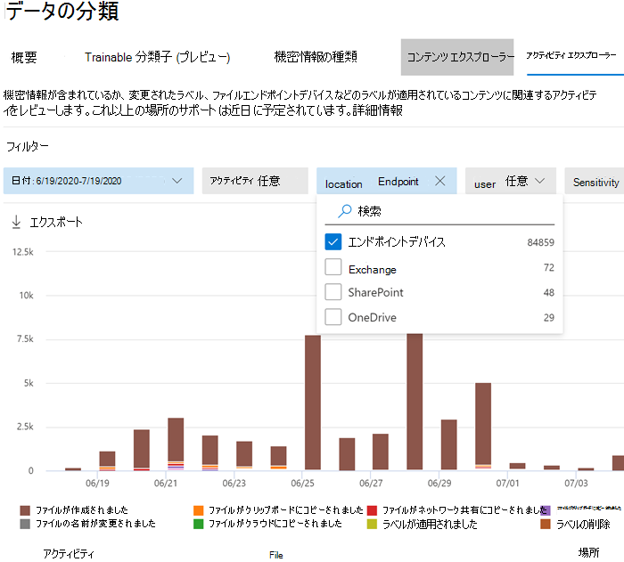

# <a name="get-started-with-microsoft-compliance-extension"></a>Microsoft Compliance Extension を開始する

以下の手順を使用して、Microsoft Compliance Extension をロールアウトします。

## <a name="before-you-begin"></a>はじめに

Microsoft Compliance Extension を使用するには、デバイスがエンドポイント DLP に搭載されている必要があります。 DLP やエンドポイント DLP に慣れていない場合は、これらの記事をレビューします

- [Microsoft Compliance Extension の詳細](dlp-chrome-learn-about.md)
- [データ損失防止について](dlp-learn-about-dlp.md)
- [DLP ポリシーの作成、テスト、調整](create-test-tune-dlp-policy.md)
- [テンプレートからの DLP ポリシーの作成](create-a-dlp-policy-from-a-template.md)
- [エンドポイント データ損失防止について](endpoint-dlp-learn-about.md)
- [エンドポイント データ損失防止の使用を開始する](endpoint-dlp-getting-started.md)
- [Windows 10 デバイスのオンボード ツールと各種方法](dlp-configure-endpoints.md)
- [エンドポイント DLP のデバイス プロキシとインターネット接続の構成](endpoint-dlp-configure-proxy.md)
- [エンドポイントのデータ損失防止の使用](endpoint-dlp-using.md)

### <a name="skusubscriptions-licensing"></a>SKU /サブスクリプション ライセンス

開始する前に、「[Microsoft 365サブスクリプション](https://www.microsoft.com/microsoft-365/compare-microsoft-365-enterprise-plans?rtc=1)」とアドオンを確認しなければなりません。 Endpoint DLP 機能にアクセスして使用するには、次のいずれかのサブスクリプションまたはアドオンが必要です。

- Microsoft 365 E5
- Microsoft 365 A5 (EDU) 
- Microsoft 365 E5 コンプライアンス
- Microsoft 365 A5 コンプライアンス
- Microsoft 365 E5 の情報保護とガバナンス
- Microsoft 365 A5 の情報保護とガバナンス

ライセンスのガイダンスに関する詳細については、「[セキュリティとコンプライアンスのための Microsoft 365 ライセンス ガイダンス](/office365/servicedescriptions/microsoft-365-service-descriptions/microsoft-365-tenantlevel-services-licensing-guidance/microsoft-365-security-compliance-licensing-guidance#information-protection)」を参照してください。

- ご所属の組織で エンドポイント DLP のライセンスを取得している必要があります。
- デバイスで Windows 10 x64 ビルド 1809 以降を実行している必要があります。
- デバイスで Antimalware Client バージョン 4.18.2101.9 以降を実行している必要があります。 **Windows セキュリティ** アプリを開いて現在のバージョンを確認し、**[設定]** アイコンを選択して、**[バージョン情報]** を選択します。


### <a name="permissions"></a>アクセス許可

Endpoint DLP からのデータは、[Activity エクスプローラー](data-classification-activity-explorer.md)で表示します。 Activity エクスプローラーに権限を付与する役割は 7 つあります。データへのアクセスに使用するアカウントは、次のいずれかのメンバーでなければなりません。

- グローバル管理者
- コンプライアンス管理者
- セキュリティ管理者
- コンプライアンスデータ管理者
- グローバルリーダー
- セキュリティ閲覧者
- レポート閲覧者

### <a name="overall-installation-workflow"></a>インストールの全体的なワークフロー

Microsoft Compliance Extension の展開は、多段階のプロセスです。一度に 1 台のマシンにインストールするか、Microsoft エンドポイント マネージャーやグループ ポリシーを使用して組織全体に展開するかを選択できます。

1. [デバイスを準備します](#prepare-your-devices)。
2. [基本的なセットアップ シングル マシンのセルフホスト](#basic-setup-single-machine-selfhost)
3. [Microsoft エンドポイント マネージャーを使用して展開する](#deploy-using-microsoft-endpoint-manager)
4. [グループ ポリシーを使用して展開する](#deploy-using-group-policy)
5. [拡張機能をテストする](#test-the-extension)
6. [アラート管理ダッシュボードを使用して、Chrome DLP アラートを表示する](#use-the-alerts-management-dashboard-to-viewing-chrome-dlp-alerts)。
7. [Activity エクスプローラーでの Chrome DLPデータの表示](#viewing-chrome-dlp-data-in-activity-explorer)

### <a name="prepare-infrastructure"></a>インフラストラクチャの準備

監視しているすべての Windows 10 デバイスに Microsoft Compliance Extension をロールアウトしている場合は、許可されていないアプリのリストおよび許可されていないブラウザーのリストから Google Chrome を削除する必要があります。 詳細については、「[許可されていないブラウザー](endpoint-dlp-using.md#unallowed-browsers)」を参照してください。 少数のデバイスにしかロールアウトしない場合は、Chrome を許可されていないブラウザーまたは許可されていないアプリのリストに残しておくことができます。 Microsoft Compliance Extension がインストールされているコンピューターでは、両方のリストの表示制限が回避されます。

### <a name="prepare-your-devices"></a>デバイスを準備する

1. これらのトピックの手順を使用して、デバイスをオンボードします。
    1. [エンドポイント データ損失防止の使用を開始する](endpoint-dlp-getting-started.md)
    1. [Windows 10 デバイスのオンボード ツールと各種方法](dlp-configure-endpoints.md)
    1. [エンドポイント DLP のデバイス プロキシとインターネット接続の構成](endpoint-dlp-configure-proxy.md)

### <a name="basic-setup-single-machine-selfhost"></a>基本的なセットアップ シングル マシンのセルフホスト

これは推奨される方法です。

1. Microsoft Compliance Extension をインストールする Windows 10 コンピューターにサインインし、管理者としてこの PowerShell スクリプトを実行します。

   ```powershell
   Get-Item -path "HKLM:\SOFTWARE\Microsoft\Windows Defender\Miscellaneous Configuration" | New-ItemProperty -Name DlpDisableBrowserCache -Value 0 -Force
   ```

2. [Microsoft Compliance Extension - Chrome Web Store (google.com)](https://chrome.google.com/webstore/detail/microsoft-compliance-exte/echcggldkblhodogklpincgchnpgcdco) に移動します。

3. Chrome Web ストアのページに記載されている手順で、拡張機能をインストールします。

### <a name="deploy-using-microsoft-endpoint-manager"></a>Microsoft エンドポイント マネージャーを使用して展開する

この設定方法は、組織全体の展開に使用します。

##### <a name="enabling-required-registry-value-via-microsoft-endpoint-manager"></a>Microsoft エンドポイント マネージャーで必要なレジストリ値を有効にする

1. 次のコンテンツを使用して PowerShell スクリプトを作成します。

    ```powershell
    Get-Item -path "HKLM:\SOFTWARE\Microsoft\Windows Defender\Miscellaneous Configuration" | New-ItemProperty -Name DlpDisableBrowserCache -Value 0 -Force
    ```

2. [Microsoft エンドポイント マネージャー管理センター](https://endpoint.microsoft.com)にサインインします。

3. **[デバイス]** > >  **[スクリプト]** の順に移動し、**[追加]** を選択します。

4. プロンプトが表示されたら、作成したスクリプトの場所を参照してください。

5. 次の設定を選択します。
    1. ログオンした資格情報を使用して、このスクリプトを実行する: いいえ
    1. スクリプトの署名チェックを強制する: いいえ
    1. 64 ビットの PowerShell ホストでスクリプトを実行する: はい

6. 適切なデバイス グループを選択し、ポリシーを適用します。

#### <a name="microsoft-endpoint-manager-force-install-steps"></a>Microsoft エンドポイント マネージャーの強制インストール手順

Microsoft Compliance Extension を強制インストールされた拡張機能のリストに追加する前に、Chrome ADMX を取り込むことが重要です。 Microsoft エンドポイント マネージャーでのこの手順は、Google で以下のとおり文書化されています。[Microsoft Intune を使用して Chrome ブラウザーを管理する - Google Chrome Enterprise ヘルプ](https://support.google.com/chrome/a/answer/9102677?hl=en#zippy=%2Cstep-ingest-the-chrome-admx-file-into-intune)

 ADMX を取り込んだ後、以下の手順でこの拡張機能の構成プロファイルを作成します。

1. Microsoft エンドポイント マネージャー管理センター (https://endpoint.microsoft.com)) にサインインします。

2. 構成プロファイルに移動します。

3. **[プロファイルの作成]** を選択します。

4. **Windows 10** をプラットフォームとして選択します。

5. プロファイルの種類として **[カスタム]** を選択します。

6. **[設定]** タブを選択します。

7. **[追加]** を選択します。

8. 次のポリシー情報を入力します。

    OMA-URI: `./Device/Vendor/MSFT/Policy/Config/Chrome~Policy~googlechrome~Extensions/ExtensionInstallForcelist`<br/>
    データ型: `String`<br/>
    値: `<enabled/><data id="ExtensionInstallForcelistDesc" value="1&#xF000; echcggldkblhodogklpincgchnpgcdco;https://clients2.google.com/service/update2/crx"/>`

9. [作成] をクリックします。

### <a name="deploy-using-group-policy"></a>グループ ポリシーを使用して展開する

Microsoft エンドポイント マネージャーを使用しない場合は、グループ ポリシーを使用して Microsoft Compliance Extension を組織全体に展開することができます。

1. デバイスはグループ ポリシーで管理できる必要があり、すべての Chrome ADMX をグループ ポリシー セントラル ストアにインポートする必要があります。 詳細については、「[Windows でグループ ポリシー管理テンプレート用に中央ストアを作成および管理する方法](/troubleshoot/windows-client/group-policy/create-and-manage-central-store)」を参照してください。

2. 以下の PowerShell コマンドを使用して、PowerShell スクリプトを作成します。

    ```powershell
    Get-Item -path "HKLM:\SOFTWARE\Microsoft\Windows Defender\Miscellaneous Configuration" | New-ItemProperty -Name DlpDisableBrowserCache -Value 0 -Force
    ```

3. **グループ ポリシー管理コンソール** を開き、自分の組織単位 (OU) に移動します。

4. 右クリックして、**[このドメインに GPO を作成し、このコンテナーにリンクする]** を選択します。 プロンプトが表示されたら、このグループ ポリシー オブジェクト (GPO) にわかりやすい名前を割り当て、作成を終了します。

5. GPO を右クリックし、**[編集]** を選択します。

6. **[コンピュータの構成]** > >  **[環境設定]** > >  **[コントロールパネルの設定]** > >  **[スケジュールされたタスク]** の順に移動します。

7. 右クリックして **[新規作成]** > >  **[即時タスク (Windows 7 以降)** を選択して新しい即時タスクを作成します。

8. タスクに名前と説明をつけます。

9. 即時タスクを実行するための対応するアカウントを選択します (NT Authority など)。

10. **[最上位の特権で実行する]** を選択します。

11. Windows 10 用のポリシーを構成します。

12. **[アクション]** タブで、アクション **[プログラムの開始]** を選択します。

13. 手順 1 で作成した Program/Script のパスを入力します。

14. **[適用]** を選択します。

#### <a name="adding-the-chrome-extension-to-the-forceinstall-list"></a>Chrome 拡張機能を ForceInstall リストに追加する

1. グループ ポリシー管理エディターで、OU に移動します。

2. 以下のパスを展開します。**[コンピューター/ユーザーの構成]** > >  **[ポリシー]** > >  **[管理用テンプレート]** > >  **[クラシック管理用テンプレート]** > >  **[Google]** > >  **[Google Chrome]** > >  **[拡張機能]** このパスは、お使いの構成によって異なる場合があります。

3. **[強制インストールした拡張機能リストの構成]** を選択します。

4. 右クリックして、**[編集]** を選択します。

5. **[有効]** を選択します。

6. **[表示]** を選択します。

7. **[値]** の下で、以下のエントリを追加します。`echcggldkblhodogklpincgchnpgcdco;https://clients2.google.com/service/update2/crx`

8. **[OK]**、**[適用]** の順に選択します。

### <a name="test-the-extension"></a>拡張機能をテストする

#### <a name="upload-to-cloud-service-or-access-by-unallowed-browsers-cloud-egress"></a>クラウド サービスへのアップロード、または許可されていないブラウザー クラウド エグレスによるアクセス

1. 機密性の高いアイテムを作成または取得し、組織の制限されたサービス ドメインの 1 つへのファイルのアップロードを試します。 機密データは、組み込みの [[機密情報の種類]](sensitive-information-type-entity-definitions.md) のいずれか、またはご所属の組織の機密情報の種類のいずれかに一致する必要があります。 テストを行っているデバイスでは、ファイルを開いた場合にこのアクションが許可されていないことを示す DLP トースト通知が表示されることが必要です。

#### <a name="testing-other-dlp-scenarios-in-chrome"></a>Chrome での他の DLP シナリオのテスト

許可されていないブラウザー/アプリのリストから Chrome を削除した後、以下のシナリオをテストして、挙動が組織の要件を満たしていることを確認できます。

- クリップボードを使用して、機密アイテムのデータを他のドキュメントにコピーする
  - テストするには、クリップボードへのコピー操作に対して保護されているファイルを Chrome ブラウザーで開き、ファイルからデータのコピーを試します。
  - 予想される結果ファイルを開いた場合に、この操作が許可されていないことを示す DLP トースト通知が表示されます。
- 文書を印刷する
  - テストするには、クリップボードへの印刷操作に対して保護されているファイルを Chrome ブラウザーで開き、ファイルの印刷を試します。
  - 予想される結果ファイルを開いた場合に、この操作が許可されていないことを示す DLP トースト通知が表示されます。
- USB リムーバブル メディアへのコピー
  - テストするには、リムーバブル メディア ストレージへのファイルの保存を試します。
  - 予想される結果ファイルを開いた場合に、この操作が許可されていないことを示す DLP トースト通知が表示されます。
- ネットワーク共有へのコピー
  - テストするには、ネットワーク共有へのファイルの保存を試します。
  - 予想される結果ファイルを開いた場合に、この操作が許可されていないことを示す DLP トースト通知が表示されます。

### <a name="use-the-alerts-management-dashboard-to-viewing-chrome-dlp-alerts"></a>アラート管理ダッシュボードを使用して、Chrome DLP アラートを表示する

1. [Microsoft 365 コンプライアンス センター](https://compliance.microsoft.com)の **[データ損失防止]** ページを開き、**[アラート]** を選択します。

2. エンドポイント DLP ポリシーの警告を表示するには、「[DLP ポリシーの警告を構成および表示する方法](dlp-configure-view-alerts-policies.md)」の手順を参照してください。

### <a name="viewing-chrome-dlp-data-in-activity-explorer"></a>Activity エクスプローラーでのエンドポイント DLP データの表示

1. Microsoft 365 コンプライアンスセンターでドメインの [データ分類ページ](https://compliance.microsoft.com/dataclassification?viewid=overview)を開き、**Activity エクスプローラー** を選択します。

2. エンドポイントデバイスのすべてのデータにアクセスしてフィルタリングするには、「[Activity エクスプローラースタートガイド](data-classification-activity-explorer.md)」の手順に従ってください。

   > [!div class="mx-imgBorder"]
   > 

### <a name="known-issues-and-limitations"></a>既知の問題と制限事項

1. クラウド エグレスに対する上書きのブロックの適用はサポートされていません。
2. シークレット モードはサポートされていないため、無効にする必要があります。

## <a name="next-steps"></a>次の手順

デバイスがオンボードされ、Activity Explorer でアクティビティデータを表示できるようになりました。次の手順に進み、機密アイテムを保護する DLP ポリシーを作成します。

- [エンドポイントのデータ損失防止の使用](endpoint-dlp-using.md)

## <a name="see-also"></a>関連項目

- [エンドポイント データ損失防止について](endpoint-dlp-learn-about.md)
- [エンドポイントのデータ損失防止の使用](endpoint-dlp-using.md)
- [データ損失防止について](dlp-learn-about-dlp.md)
- [DLP ポリシーの作成、テスト、調整](create-test-tune-dlp-policy.md)
- [Activity Explorer を使い始める](data-classification-activity-explorer.md)
- [Microsoft Defender for Endpoint](/windows/security/threat-protection/)
- [Windows 10 マシン用のオンボーディングツールとメソッド](/windows/security/threat-protection/microsoft-defender-atp/configure-endpoints)
- [Microsoft 365 サブスクリプション](https://www.microsoft.com/microsoft-365/compare-microsoft-365-enterprise-plans?rtc=1)
- [Azure AD に参加しているデバイス](/azure/active-directory/devices/concept-azure-ad-join)
- [Chromium ベースの新しい Microsoft Edge をダウンロードする](https://support.microsoft.com/help/4501095/download-the-new-microsoft-edge-based-on-chromium)
