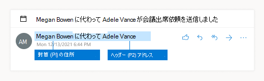

# <a name="dlp-policy-conditions-exceptions-and-actions"></a>DLP ポリシーの条件、例外、およびアクション

[!include[Purview banner](../includes/purview-rebrand-banner.md)]

DLP ポリシーの条件と例外は、ポリシーが適用される機密項目を識別します。 アクションは、例外が満たされた条件の結果として何が起こるかを定義します。

- 条件は、含める内容を定義します
- 例外は、除外する対象を定義します。
- アクションは、条件または例外が満たされた結果として何が起こるかを定義します

ほとんどの条件と例外には、1 つ以上の値をサポートする 1 つのプロパティがあります。 たとえば、DLP ポリシーがExchangeメールに適用されている場合、**送信者の条件には** メッセージの送信者が必要です。 プロパティが 2 つある条件もあります。 たとえば、**メッセージ ヘッダーにこれらの単語のいずれかが含まれる** という条件には、ヘッダーを指定するプロパティ 1 つと、ヘッダー フィールド内で検索するテキストを指定する 2 つめのプロパティが必要です。 いくつかの条件や例外は、プロパティが全くありません。 たとえば、 **添付ファイルはパスワードで保護された** 状態で、パスワードで保護されているメッセージ内の添付ファイルを検索するだけです。

アクションには通常、追加のプロパティが必要になります。 たとえば、DLP ポリシー規則がメッセージをリダイレクトする場合は、メッセージのリダイレクト先を指定する必要があります。
<!-- Some actions have multiple properties that are available or required. For example, when the rule adds a header field to the message header, you need to specify both the name and value of the header. When the rule adds a disclaimer to messages, you need to specify the disclaimer text, but you can also specify where to insert the text, or what to do if the disclaimer can't be added to the message. Typically, you can configure multiple actions in a rule, but some actions are exclusive. For example, one rule can't reject and redirect the same message.-->

## <a name="conditions-and-exceptions-for-dlp-policies"></a>DLP ポリシーの条件と例外

次のセクションの表では、DLP で使用できる条件と例外について説明します。

- [[Senders (送信者)](#senders)]
- [受信者](#recipients)
- [メッセージの件名または本文](#message-subject-or-body)
- [添付ファイル](#attachments)
- [メッセージ ヘッダー](#message-headers)
- [メッセージのプロパティ](#message-properties)

### <a name="senders"></a>送信者

条件または例外として送信者アドレスを使用する場合、値が検索される実際のフィールドは、構成されている送信者アドレスの場所によって異なります。 既定では、DLP ルールは送信者アドレスとしてヘッダー アドレスを使用します。



テナント レベルでは、1 つのルールによってオーバーライドされない限り、すべてのルールで使用する送信者アドレスの場所を構成できます。 すべてのルールでエンベロープからの送信者アドレスを評価するようにテナント DLP ポリシー構成を設定するには、次のコマンドを実行します。

```PowerShell
Set-PolicyConfig -SenderAddressLocation Envelope
```

DLP ルール レベルで送信者アドレスの場所を構成するには、パラメーターは *SenderAddressLocation です*。 使用できる値は次のとおりです:

- **Header**: メッセージ ヘッダー内の送信者 (たとえば、**From**、**Sender**、または **Reply-To** フィールド) のみを確認します。 これは既定の値です。

- **Envelope**: メッセージ エンベロープ (**Return-Path** フィールドに通常格納されている SMTP 転送に使用された **MAIL FROM** 値) からの送信者のみを確認します。

- **ヘッダーまたは封筒** (`HeaderOrEnvelope`) メッセージ ヘッダーとメッセージ エンベロープ内の送信者を調べます。

|DLP の条件または例外|Microsoft 365 PowerShell の condition/exception パラメーター|プロパティの種類|説明|
|---|---|---|---|
|送信者が|条件: *From* <br/><br/> 例外: *ExceptIfFrom*|住所|組織内の指定されたメールボックス、メール ユーザー、メール連絡先、またはMicrosoft 365 グループによって送信されるメッセージ。|
|送信者が次のメンバーの場合 |*FromMemberOf* <br/><br/> *ExceptIfFromMemberOf*|住所|指定した配布グループ、メールが有効なセキュリティ グループ、またはMicrosoft 365 グループのメンバーによって送信されるメッセージ。|
|送信者の IP アドレスが|条件: *SenderIPRanges*<br/><br/> 例外: *ExceptIfSenderIPRanges*|IPAddressRanges|送信者の IP アドレスが、指定した IP アドレスと一致するか、指定した IP アドレスの範囲内にあるメッセージです。|
|送信者のアドレスに単語が含まれている|条件: *FromAddressContainsWords* <br/><br/> 例外: *ExceptIfFromAddressContainsWords*|Words|送信者のメール アドレスに指定の単語が含まれているメッセージです。|
|送信者のアドレスがパターンと一致している|条件: *FromAddressMatchesPatterns* <br/><br/> 例外: *ExceptFromAddressMatchesPatterns*|パターン|送信者のメール アドレスに、特定の正規表現と一致するテキスト パターンが含まれているメッセージです。|
|送信者のドメインが次の場合|condition: *SenderDomainIs* <br/><br/> 例外: *ExceptIfSenderDomainIs*|Domainname|送信者のメール アドレスのドメインが指定された値と一致するメッセージです。 指定したドメイン (ドメインのサブドメインなど) を *含む* 送信者ドメインを見つける必要がある場合 **は、送信者アドレス一致** (*FromAddressMatchesPatterns*) 条件を使用し、構文 'domaincom\.$' を\.使用してドメインを指定します。|
|送信者スコープ|条件: *FromScope* <br/><br/> exception: *ExceptIfFromScope*|UserScopeFrom|内部または外部の送信者によって送信されるメッセージ。|
|送信者の指定のプロパティが次の単語のいずれかを含む|condition: *SenderADAttributeContainsWords* <br/><br/> exception: *ExceptIfSenderADAttributeContainsWords*|最初のプロパティ: `ADAttribute` <br/><br/> 2 番目のプロパティ: `Words`|送信者の指定された Active Directory 属性に指定された単語のいずれかが含まれているメッセージ。|
|送信者の指定のプロパティが次のテキスト パターンと一致する|condition: *SenderADAttributeMatchesPatterns* <br/><br/> exception: *ExceptIfSenderADAttributeMatchesPatterns*|最初のプロパティ: `ADAttribute` <br/><br/> 2 番目のプロパティ: `Patterns`|送信者の指定された Active Directory 属性に、指定した正規表現と一致するテキスト パターンが含まれているメッセージ。|

### <a name="recipients"></a>受信者

|DLP の条件または例外|Microsoft 365 PowerShell の condition/exception パラメーター|プロパティの種類|説明|
|---|---|---|---|
|受信者が|条件: *SentTo* <br/><br/> 例外: *ExceptIfSentTo*|住所|受信者の 1 人が組織内の指定されたメールボックス、メール ユーザー、メール連絡先であるメッセージです。受信者はメッセージの **To**、**Cc**、**Bcc** のフィールドにいることが可能です。|
|受信者ドメインが|condition: *RecipientDomainIs* <br/><br/> exception: *ExceptIfRecipientDomainIs*|Domainname|受信者の電子メール アドレスのドメインが指定した値と一致するメッセージ。|
|受信者のアドレスに単語が含まれている|condition: *AnyOfRecipientAddressContainsWords* <br/><br/> exception: *ExceptIfAnyOfRecipientAddressContainsWords*|Words|受信者のメール アドレスに指定の単語が含まれているメッセージです。 <br/><br/>**注**: この条件が、受信プロキシ アドレスに送信されるメッセージについて考慮していない点に注意してください。受信者のプライマリ メール アドレスに送信されるメッセージのみを照合します。|
|受信者のアドレスがパターンと一致している|condition: *AnyOfRecipientAddressMatchesPatterns* <br/><br/> exception: *ExceptIfAnyOfRecipientAddressMatchesPatterns*|パターン|受信者のメール アドレスに、特定の正規表現と一致するテキスト パターンが含まれているメッセージです。 <br/><br/> **注**: この条件が、受信プロキシ アドレスに送信されるメッセージについて考慮していない点に注意してください。受信者のプライマリ メール アドレスに送信されるメッセージのみを照合します。|
|のメンバーに送信されます。|condition: *SentToMemberOf* <br/><br/> exception: *ExceptIfSentToMemberOf*|住所|指定した配布グループ、メールが有効なセキュリティ グループ、またはMicrosoft 365 グループのメンバーである受信者を含むメッセージ。 グループはメッセージの **To**、**Cc**、または **Bcc** フィールドにあることが可能です。|
|受信者の指定のプロパティが次の単語のいずれかを含む |*RecipientADAttributeContainsWords* <br/><br/> *ExceptIfRecipientADAttributeContainsWords*|最初のプロパティ: `ADAttribute` <br/><br/> 2 番目のプロパティ: `Words`|受信者の指定された Active Directory 属性に指定された単語のいずれかが含まれているメッセージ。 <br/><br/> **Country** 属性には、2 文字の国コードの値 (たとえば、ドイツの DE) が必要であることに注意してください。|
|受信者の指定のプロパティが次のテキスト パターンと一致する |*RecipientADAttributeMatchesPatterns* <br/><br/> *ExceptIfRecipientADAttributeMatchesPatterns*|最初のプロパティ: `ADAttribute` <br/><br/> 2 番目のプロパティ: `Patterns`|受信者の指定された Active Directory 属性に、指定した正規表現と一致するテキスト パターンが含まれるメッセージ。|

### <a name="message-subject-or-body"></a>メッセージの件名または本文

|DLP の条件または例外|Microsoft 365 PowerShell の condition/exception パラメーター|プロパティの種類|説明|
|---|---|---|---|
|件名に単語または語句が含まれている|condition: *SubjectContainsWords* <br/> 例外: *ExceptIf SubjectContainsWords*|Words|Subject フィールドに特定の単語を持つメッセージです。|
|件名がパターンと一致している|condition: *SubjectMatchesPatterns* <br/> 例外: *ExceptIf SubjectMatchesPatterns*|パターン|件名フィールドに、指定した正規表現と一致するテキスト パターンが含まれるメッセージ。|
|コンテンツが含まれている|condition: *ContentContainsSensitiveInformation* <br/> *exception ExceptIfContentContainsSensitiveInformation*|SensitiveInformationTypes|Microsoft Purview データ損失防止 (DLP) ポリシーで定義されている機密情報を含むメッセージまたはドキュメント。|
|件名または本文の一致パターン|condition: *SubjectOrBodyMatchesPatterns* <br/> exception: *ExceptIfSubjectOrBodyMatchesPatterns*|パターン|件名フィールドまたはメッセージ本文に、指定した正規表現に一致するテキスト パターンが含まれるメッセージ。|
|件名または本文に単語が含まれている|condition: *SubjectOrBodyContainsWords* <br/> exception: *ExceptIfSubjectOrBodyContainsWords*|Words|件名フィールドまたはメッセージ本文に指定された単語を含むメッセージ|
|

### <a name="attachments"></a>添付ファイル

|DLP の条件または例外|Microsoft 365 PowerShell の condition/exception パラメーター|プロパティの種類|説明|
|---|---|---|---|
|添付ファイルがパスワードで保護されている|condition: *DocumentIsPasswordProtected* <br/><br/> exception: *ExceptIfDocumentIsPasswordProtected*|none|添付ファイルがパスワードで保護された (ゆえにスキャンすることができない) メッセージです。 パスワード検出は、Office ドキュメント、.zip ファイル、および .7z ファイルでのみ機能します。|
|添付ファイルの拡張子が|条件: *ContentExtensionMatchesWords* <br/><br/> exception: *ExceptIfContentExtensionMatchesWords*|Words|添付ファイルの拡張子が、以下の指定の単語と一致するメッセージです。|
|メールの添付ファイルのコンテンツをスキャンできなかった|condition: *DocumentIsUnsupported* <br/><br/>例外: *ExceptIf DocumentIsUnsupported*|該当なし|添付ファイルがExchange Onlineによってネイティブに認識されないメッセージ。|
|メールの添付ファイルのコンテンツのスキャンが完了しなかった|condition: *ProcessingLimitExceeded* <br/><br/> exception: *ExceptIfProcessingLimitExceeded*|該当なし|ルール エンジンが添付ファイルのスキャンを完了できなかったメッセージです。内容が完全にスキャンできなかったメッセージを認識し、処理するために協力して作用するルールを作成するために、この条件を使用できます。|
|ドキュメント名に単語が含まれている|条件: *DocumentNameMatchesWords* <br/><br/> 例外: *ExceptIfDocumentNameMatchesWords*|Words|添付ファイルのファイル名が指定した単語と一致するメッセージ。|
|ドキュメント名がパターンと一致する|condition: *DocumentNameMatchesPatterns* <br/><br/> exception: *ExceptIfDocumentNameMatchesPatterns*|パターン|添付ファイル名に特定の正規表現と一致するテキスト パターンが含まれているメッセージです。|
|文書のプロパティが|condition: *ContentPropertyContainsWords* <br/><br/> exception: *ExceptIfContentPropertyContainsWords*|Words|添付ファイルのファイル拡張子が指定した単語と一致するメッセージまたはドキュメント。|
|ドキュメント サイズが等しいか、ドキュメント サイズより大きい|条件: *DocumentSizeOver* <br/><br/> 例外: *ExceptIfDocumentSizeOver*|Size|任意の添付ファイルが指定値以上のメッセージです。|
|添付ファイルのコンテンツには、次のいずれかの単語が含まれます。|condition: *DocumentContainsWords* <br/><br/> 例外: *ExceptIfDocumentContainsWords*|`Words`|添付ファイルに指定された単語が含まれているメッセージです。|
|添付ファイルのコンテンツがこれらのテキスト パターンと一致する|condition: *DocumentMatchesPatterns* <br/><br/> exception: *ExceptIfDocumentMatchesPatterns*|`Patterns`|添付ファイルに特定の正規表現と一致するテキスト パターンが含まれているメッセージです。|

### <a name="message-headers"></a>メッセージ  ヘッダー

|DLP の条件または例外|Microsoft 365 PowerShell の condition/exception パラメーター|プロパティの種類|説明|
|---|---|---|---|
|ヘッダーに単語または語句が含まれている|condition: *HeaderContainsWords* <br/><br/> 例外: *ExceptIfHeaderContainsWords*|ハッシュ テーブル|指定したヘッダー フィールドを含むメッセージであり、そのヘッダー フィールドの値には指定した単語が含まれています。|
|ヘッダーがパターンと一致している|condition: *HeaderMatchesPatterns* <br/><br/> 例外: *ExceptIfHeaderMatchesPatterns*|ハッシュ テーブル|指定したヘッダー フィールドを含むメッセージであり、そのヘッダー フィールドの値には指定した正規表現が含まれています。|

### <a name="message-properties"></a>メッセージのプロパティ

|DLP の条件または例外|Microsoft 365 PowerShell の condition/exception パラメーター|プロパティの種類|説明|
|---|---|---|---|
|重要度を持つ|condition: *WithImportance* <br/><br/> exception: *ExceptIfWithImportance*|Importance|指定された重要度レベルでマークされたメッセージ。|
|コンテンツ文字セットに単語が含まれている|condition: *ContentCharacterSetContainsWords* <br/><br/> *ExceptIfContentCharacterSetContainsWords*|CharacterSets|指定した文字セット名のいずれかを含むメッセージです。|
|送信者のオーバーライドを持つ|condition: *HasSenderOverride* <br/><br/> exception: *ExceptIfHasSenderOverride*|該当なし|送信者がデータ損失防止 (DLP) ポリシーを上書きすることを選択したメッセージです。 DLP ポリシーの詳細については、「[データ損失防止の詳細](./dlp-learn-about-dlp.md)」を参照してください。|
|メッセージの種類が一致する|condition: *MessageTypeMatches* <br/><br/> exception: *ExceptIfMessageTypeMatches*|MessageType|指定の種類のメッセージです。 **注**: 使用可能なメッセージの種類は、自動応答、自動転送、暗号化 (S/MIME)、予定表、アクセス許可制御 (権限管理)、ボイスメール、署名済み、開封確認、承認要求です。 |
|メッセージ サイズが次の値以上の場合|条件: *MessageSizeOver* <br/><br/> 例外: *ExceptIfMessageSizeOver*|`Size`|合計サイズ (メッセージ プラス添付ファイル) が指定値以上のメッセージです。 **注**:メールボックスのメッセージ サイズの制限は、メール フロー ルールの前に評価されます。 この条件を含むルールがメッセージを処理する前に、メールボックスに対して大きすぎるメッセージが拒否されます。|

## <a name="actions-for-dlp-policies"></a>DLP ポリシーのアクション

次の表では、DLP で使用できるアクションについて説明します。

|DLP でのアクション|Microsoft 365 PowerShell のアクション パラメーター|プロパティの種類|説明|
|---|---|---|---|
|ヘッダーを設定する|SetHeader|First プロパティ: *ヘッダー名* <br/><br/> 2 番目のプロパティ: *ヘッダー値*|SetHeader パラメーターは、メッセージ ヘッダーのヘッダー フィールドと値を追加または変更する DLP ルールのアクションを指定します。 このパラメーターでは、構文 "HeaderName:HeaderValue" を使用します。 複数のヘッダー名と値のペアをコンマで区切って指定できます|
|ヘッダーを削除する|RemoveHeader|最初のプロパティ: *MessageHeaderField*<br/><br/> 2 番目のプロパティ: *String*|RemoveHeader パラメーターは、メッセージ ヘッダーからヘッダー フィールドを削除する DLP ルールのアクションを指定します。 このパラメーターは、構文 "HeaderName" または "HeaderName:HeaderValue" を使用します。複数のヘッダー名またはヘッダー名と値のペアをコンマで区切って指定できます|
|特定のユーザーにメッセージをリダイレクトする|*RedirectMessageTo*|住所|特定の受信者にメッセージをリダイレクトします。元の受信者にメッセージを配信せず、送信者や元の受信者に通知を送信しません。|
|送信者のマネージャーに承認メッセージを転送する|中|最初のプロパティ: *ModerateMessageByManager*<br/><br/> 2 番目のプロパティ: *Boolean*|Moderate パラメーターは、電子メール メッセージをモデレーターに送信する DLP ルールのアクションを指定します。 このパラメーターは、@{ModerateMessageByManager = <$true $false> \|; という構文を使用します。|
|承認メッセージを特定の承認者に転送する|中|最初のプロパティ: *ModerateMessageByUser*<br/><br/>2 番目のプロパティ: *Addresses*|Moderate パラメーターは、電子メール メッセージをモデレーターに送信する DLP ルールのアクションを指定します。 このパラメーターは、@{ ModerateMessageByUser = @("emailaddress1","emailaddress2",..."emailaddressN")} という構文を使用します。|
|受信者を追加する|AddRecipients|最初のプロパティ: *Field*<br/><br/>2 番目のプロパティ: *Addresses*|メッセージの To/Cc/Bcc フィールドに 1 人以上の受信者を追加します。 このパラメーターは、@{<AddToRecipients \<CopyTo \| BlindCopyTo\> = "emailaddress"} という構文を使用します。|
|送信者のマネージャーを受信者として追加する|AddRecipients|First プロパティ: *AddedManagerAction*<br/><br/>2 番目のプロパティ: *Field*|送信者の上司を指定の受信者タイプ (To、Cc、Bcc) としてメッセージに追加したり、送信者や受信者に通知することなくメッセージを送信者の上司にリダイレクトします。 このアクションは、送信者の Manager 属性が Active Directory で定義されている場合のみ有効です。 このパラメーターは、@{AddManagerAsRecipientType = "\<To \| Cc \| Bcc\>"} という構文を使用します。|
件名の先頭に追加する|PrependSubject|String|メッセージの Subject フィールドの冒頭に指定のテキストを追加します。元の件名のテキストを区別するために、指定されたテキストの最後の文字としてスペースまたはコロン (:) を使用してください。  <br/><br/>件名に既にテキストが含まれているメッセージ (返信など) に同じ文字列が追加されないようにするには、ルールに "件名に単語が含まれている" (ExceptIfSubjectContainsWords) 例外を追加します。|
|HTML 免責事項を適用する|ApplyHtmlDisclaimer|First プロパティ: *Text*<br/><br/>2 番目のプロパティ: *場所*<br/><br/>3 番目のプロパティ: *フォールバック アクション*|指定した HTML 免責事項をメッセージの必要な場所に適用します。<br/><br/>このパラメーターは、次の構文を使用します @{ Text = " " 。場所 = \<Append \| Prepend\>;FallbackAction = \<Wrap \| Ignore \| Reject\> }|
|メッセージの暗号化と権利保護を削除する|RemoveRMSTemplate|該当なし|電子メールに適用されたメッセージ暗号化を削除します|
|ホストされた検疫にメッセージを配信する |*Quarantine*|該当なし| このアクションは現在 **パブリック プレビュー段階です**。 このフェーズでは、DLP ポリシーによって検疫された電子メールには、ポリシーの種類が ExchangeTransportRule として表示されます。<br/><br/> EOP の検疫にメッセージを配信します。 詳細については、「 [EOP で検疫された電子メール メッセージ](/microsoft-365/security/office-365-security/quarantine-email-messages)」を参照してください。|
|件名を変更する|ModifySubject|PswsHashTable | 特定のパターンに一致する件名行からテキストを削除し、別のテキストに置き換えます。 以下の例を参照してください。 次の操作を行うことができます: <br/><br/>- 件名内のすべての一致を置換テキストに置き換 **える** <br/><br/>- **件名** 内のすべての一致を削除するために追加し、件名の末尾に置換テキストを挿入します。 <br/><br/>- すべての一致を削除する **前** に、件名の先頭に置換テキストを挿入します。 ModifySubject パラメーター in、/powershell/module/exchange/new-dlpcompliancerule を参照してください|
