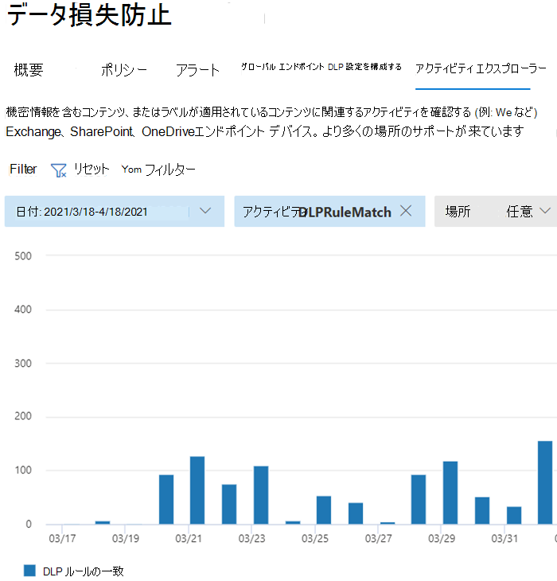

# データ損失防止について

組織には、財務データ、所有権データ、クレジット カード番号、健康記録、社会保障番号などの機密情報が管理下にあります。 これらの機密データを保護し、リスクを軽減するには、こうしたデータを保持するべきでないユーザーと不適切に共有できないようにする方法が必要です。 この方法は、データ損失防止 (DLP) と呼ばれます。

Microsoft Purview では、DLP ポリシーを定義して適用することで、データ損失防止を実装します。 DLP ポリシーを使用すると、次の項目全体で機密項目を識別、監視、および自動的に保護できます。

- Teams、Exchange、SharePoint、OneDrive などの Microsoft 365 サービス
- Word、Excel、PowerPoint などの Office アプリケーション
- Windows 10、Windows 11、macOS (Catalina 10.15 以降) エンドポイント
- Microsoft 以外のクラウド アプリ
- オンプレミスのファイル共有とオンプレミスの SharePoint。

DLP は、単純なテキスト スキャンだけでなく、ディープ コンテンツ分析を使用して機密アイテムを検出します。 コンテンツは、キーワードへのプライマリ データ一致、正規表現の評価、内部関数の検証、およびプライマリ データ一致に近いセカンダリ データ一致によって分析されます。 さらに、DLP では、機械学習アルゴリズムやその他の方法を使用して、DLP ポリシーに一致するコンテンツを検出します。

## DLP は、大規模な Microsoft Purview オファリングの一部です

DLP は Microsoft Purview ツールの 1 つに過ぎず、機密性の高いアイテムがどこに住んでも旅行でも保護するのに役立ちます。 Microsoft Purview ツール セット内の他のツール、それらが相互に相互に変換され、よりうまく連携する方法を理解する必要があります。  情報保護プロセスの詳細については、 [Microsoft Purview ツール](protect-information.md) を参照してください。

## DLP ポリシーの保護アクション

DLP ポリシーは、ユーザーが保存中の機密アイテム、転送中の機密アイテム、または使用中の機密アイテムに対して行うアクティビティを監視し、保護アクションを実行する方法です。 たとえば、ユーザーが許可されていない場所に機密アイテムをコピーしたり、ポリシーに記載されている電子メールやその他の条件で医療情報を共有したりするなど、禁止されたアクションを実行しようとすると、DLP は次のことができます。

- 機密性の高いアイテムを不適切に共有しようとしている可能性があることを警告するポップアップ ポリシー ヒントをユーザーに表示する
- 共有をブロックし、ポリシー ヒントを使用して、ユーザーがブロックをオーバーライドし、ユーザーの正当な理由をキャプチャできるようにします
- オーバーライド オプションなしで共有をブロックする
- 保存データの場合、機密アイテムをロックして安全な検疫場所に移動できます
- Teams チャットの場合、機密情報は表示されません

DLP 監視対象のすべてのアクティビティは、既定で [Microsoft 365 監査ログ](search-the-audit-log-in-security-and-compliance.md) に記録され、 [アクティビティ エクスプローラー](data-classification-activity-explorer.md)にルーティングされます。 ユーザーが DLP ポリシーの条件を満たすアクションを実行し、アラートを構成すると、DLP [アラート管理ダッシュボード](dlp-configure-view-alerts-policies.md)にアラートが表示されます。

## DLP ライフサイクル

DLP の実装は、通常、これらの主要なフェーズに従います。

- [DLP を計画する](#plan-for-dlp)
- [DLP の準備](#prepare-for-dlp)
- [運用環境にポリシーをデプロイする](#deploy-your-policies-in-production)

### DLP を計画する

DLP の監視と保護は、ユーザーが毎日使用するアプリケーションに固有です。 これにより、ユーザーがデータ損失防止の考え方や実践に慣れていない場合でも、組織の機密アイテムを危険なアクティビティから保護するのに役立ちます。 組織とユーザーがデータ損失防止プラクティスに慣れなければ、DLP の導入にはビジネス プロセスの変更が必要になる可能性があり、ユーザーにはカルチャの変化が生じることがあります。 ただし、適切な計画、テスト、チューニングを行うと、DLP ポリシーによって機密項目が保護され、潜在的なビジネス プロセスの中断が最小限に抑えられます。

**DLP のテクノロジ計画**

DLP は、保存データ、使用中のデータ、動作中のデータを Microsoft 365 サービス、Windows 10、Windows 11、macOS (Catalina 10.15 以降) デバイス、オンプレミスのファイル共有、オンプレミスの SharePoint 全体で監視および保護できることに注意してください。 さまざまな場所、監視および保護するデータの種類、ポリシーの一致が発生したときに実行されるアクションには、計画上の影響があります。

**DLP のビジネス プロセス計画**

DLP ポリシーは、電子メールによる機密情報の不適切な共有など、禁止されたアクティビティをブロックできます。 DLP ポリシーを計画するときは、機密アイテムに触れるビジネス プロセスを特定する必要があります。 ビジネス プロセスの所有者は、許可する必要がある適切なユーザー動作と、保護する必要がある不適切なユーザー動作を特定するのに役立ちます。 ポリシーを計画し、テスト モードでデプロイし、 [アクティビティ エクスプローラー](data-classification-activity-explorer.md) を使用して影響を評価してから、より制限の厳しいモードで適用する必要があります。

**DLP の組織カルチャ計画**

DLP の正常な実装は、適切に計画され調整されたポリシーに従って、ユーザーにデータ損失防止プラクティスのトレーニングと順化を行うのと同じくらい依存します。 ユーザーは大きく関与しているため、必ずトレーニングを計画してください。 ポリシーの適用をテスト モードからより制限の厳しいモードに変更する前に、ポリシーヒントを戦略的に使用してユーザーに対する認識を高めることができます。

<!--For more information on planning for DLP, including suggestions for deployment based on your needs and resources, see [Planning for data loss prevention](dlp-plan-for-dlp.md).-->

### DLP の準備

保存データ、使用中のデータ、移動中の場所のデータに DLP ポリシーを適用できます。

- 電子メールをExchange Onlineする
- SharePoint Online サイト
- OneDrive アカウント
- Teams チャットおよびチャネル メッセージ
- Microsoft Defender for Cloud Apps
- Windows 10、Windows 11、macOS (Catalina 10.15 以降) デバイス
- オンプレミスのリポジトリ
- PowerBI サイト

それぞれが異なる前提条件を持っています。 Exchange Online などの一部の場所の機密アイテムは、それらに適用されるポリシーを構成するだけで DLP の下に持ち込むことができます。 オンプレミスのファイル リポジトリなどの他のユーザーには、Azure Information Protection (AIP) スキャナーのデプロイが必要です。 ブロックアクションをアクティブ化する前に、環境を準備し、ポリシーの下書きをコーディングし、それらを徹底的にテストする必要があります。

### 運用環境にポリシーをデプロイする

#### ポリシーを設計する

まず、制御目標を定義し、それぞれのワークロードに適用する方法について説明します。 目標を具体化するポリシーを作成します。 一度に 1 つのワークロードから、またはすべてのワークロードで自由に開始できます。まだ影響はありません。

#### テスト モードでポリシーを実装する

テスト モードで DLP ポリシーを使用してコントロールを実装することで、コントロールの影響を評価します。 すべてのワークロードにテスト モードでポリシーを適用して、結果の完全な幅を得ることができますが、必要に応じて 1 つのワークロードから始めることができます。

#### 結果を監視し、ポリシーを微調整する

テスト モードでは、ポリシーの結果を監視し、制御目標を満たすように微調整しながら、有効なユーザー ワークフローや生産性に悪影響を与えたり、誤って影響を与えたりしないようにします。 微調整する例をいくつか次に示します。

- スコープ内または範囲外の場所と人/場所を調整する
- 項目とその処理がポリシーと一致するかどうかを判断するために使用される条件と例外を調整する
- 機密情報の定義/秒
- アクション
- 制限のレベル
- 新しいコントロールを追加する
- 新しいユーザーを追加する
- 新しい制限付きアプリを追加する
- 新しい制限付きサイトを追加する

> [!NOTE]
> _さらに多くのルールの処理を停止_ しても、テスト モードでは動作しません。オンになっている場合でも、

#### コントロールを有効にしてポリシーを調整する

ポリシーがすべての目標を満たしたら、それを有効にします。 引き続きポリシー アプリケーションの結果を監視し、必要に応じて調整します。 

> [!NOTE]
> 一般に、ポリシーは、オンになってから約 1 時間後に有効になります。

<!--See, LINK TO topic for SLAs for location specific  details-->

## DLP ポリシー構成の概要

DLP ポリシーの作成と構成は柔軟に行うことができます。 定義済みのテンプレートから始めて、数回のクリックでポリシーを作成することも、独自に設計することもできます。 どの DLP ポリシーを選択しても、すべての DLP ポリシーに同じ情報が必要です。

1. **監視する内容を選択します** 。DLP には、開始に役立つ定義済みのポリシー テンプレートが多数付属しているか、カスタム ポリシーを作成できます。
    - 定義済みのポリシー テンプレート: 財務データ、医療と保健データ、プライバシー データなど、さまざまな国と地域に対応しています。
    - 使用可能な機密情報の種類、保持ラベル、および秘密度ラベルを使用するカスタム ポリシー。
2. **監視する場所を選択します** 。DLP で機密情報を監視する場所を 1 つ以上選択します。 次の情報を監視できます。

場所 | 包含 / 除外|
|---------|---------|
|Exchange メール| 配布グループ|
|SharePoint サイト |sites |
|OneDrive アカウント |アカウントまたは配布グループ |
|Teams チャットおよびチャネル メッセージ |アカウントまたは配布グループ |
|Windows 10、Windows 11、macOS (Catalina 10.15 以降) デバイス |ユーザーまたはグループ |
|Microsoft Cloud App Security |インスタンス |
|オンプレミスのリポジトリ| リポジトリ ファイルのパス|

3. **項目に適用するポリシーに一致する必要がある条件を選択** します。事前に構成された条件を受け入れるか、カスタム条件を定義できます。 次に例を示します。

- item には、特定のコンテキストで使用されている特定の種類の機密情報が含まれています。 たとえば、組織外の受信者に電子メールで送信される 95 件の社会保障番号です。
- item に指定された秘密度ラベルがある
- 機密情報を含むアイテムが内部または外部で共有される

4. **ポリシー条件が満たされたときに実行するアクションを選択** します。アクションは、アクティビティが発生している場所によって異なります。  次に例を示します。

- SharePoint/Exchange/OneDrive: 組織外のユーザーフォームからコンテンツへのアクセスをブロックします。 ユーザーにヒントを表示し、DLP ポリシーで禁止されているアクションを実行していることを示す電子メール通知を送信します。
- Teams チャットとチャネル: チャットまたはチャネルで機密情報が共有されないようにブロックする
- Windows 10、Windows 11、macOS (Catalina 10.15 以降) デバイス: 機密アイテムの削除可能な USB デバイスへのコピーを監査または制限する
- Office Apps: ユーザーが危険な動作に関与していることを通知するポップアップを表示し、ブロックまたはブロックしますが、オーバーライドを許可します。
- オンプレミスのファイル共有: ファイルが保存されている場所から検疫フォルダーに移動する

> [!NOTE]
> 条件と実行するアクションは、Rule と呼ばれるオブジェクトで定義されます。

<!--## Create a DLP policy

All DLP policies are created and maintained in the Microsoft Purview center. See, INSERT LINK TO ARTICLE THAT WILL START WALKING THEM THROUGH THE POLICY CREATION PROCEDURES for more information.-->

コンプライアンス センターで DLP ポリシーを作成すると、そのポリシーは中央のポリシー ストアに格納され、次のようなさまざまなコンテンツ ソースに同期されます。

- Exchange Online、そこから Outlook on the web、Outlook。
- OneDrive for Business サイト。
- SharePoint Online サイト。
- Office デスクトップ プログラム (Excel、PowerPoint、Word)。
- Microsoft Teams チャネルおよびチャット メッセージ。

ポリシーが適切な場所に同期されると、コンテンツの評価とアクションの適用が開始されます。

## ポリシー アプリケーションの結果の表示

DLP は、監視、ポリシーの一致とアクション、ユーザー アクティビティから Microsoft Purview に膨大な量の情報を報告します。 機密性の高いアイテムに対して実行されたポリシーとトリアージ アクションを調整するには、その情報を使用して操作する必要があります。 テレメトリは、最初に[Microsoft Purview コンプライアンス ポータル監査ログ](search-the-audit-log-in-security-and-compliance.md#search-the-audit-log-in-the-compliance-portal)に入り、処理され、さまざまなレポート ツールに移動します。 レポート ツールごとに目的が異なります。

### DLP アラート ダッシュボード

DLP が機密アイテムに対してアクションを実行すると、構成可能なアラートを介してそのアクションを通知できます。 コンプライアンス センターでは、これらのアラートをメールボックスに蓄積するのではなく、 [DLP アラート管理ダッシュボード](dlp-configure-view-alerts-policies.md)で利用できるようにします。 DLP アラート ダッシュボードを使用して、アラートの構成、確認、トリアージ、DLP アラートの解決の追跡を行います。 ポリシーの一致とWindows 10デバイスからのアクティビティによって生成されるアラートの例を次に示します。

> [!div class="mx-imgBorder"]
> 

同じダッシュボードで、リッチ メタデータに関連付けられたイベントの詳細を表示することもできます

> [!div class="mx-imgBorder"]
> 

### レポート

[DLP レポート](view-the-dlp-reports.md#view-the-reports-for-data-loss-prevention)は、時間の経過と共に広範な傾向を示し、具体的な分析情報を次に示します。

- **DLP ポリシーは時間の** 経過と共に一致し、日付範囲、場所、ポリシー、またはアクションによってフィルター処理されます
- **DLP インシデントの一致** では、時間の経過と共に一致も表示されますが、ポリシー ルールではなくアイテムがピボットされます。
- **DLP の誤検知とオーバーライドは** 、誤検知の数を示し、構成されている場合はユーザーの正当性と共にユーザーオーバーライドを示します。

### DLP アクティビティ エクスプローラー

DLP ページの [アクティビティ エクスプローラー] タブには、*DLPRuleMatch* の *アクティビティ* フィルター プリセットがあります。 このツールを使用して、機密情報を含むコンテンツやラベルが適用されているコンテンツに関連するアクティビティ (変更されたラベル、ファイルの変更、ルールとの一致など) を確認します。

詳細については、「[アクティビティ エクスプローラーの概要](data-classification-activity-explorer.md)」を参照してください。

Microsoft Purview DLP の詳細については、次を参照してください。

- [エンドポイント データ損失防止について](endpoint-dlp-learn-about.md)
- [Microsoft Teams の既定のデータ損失防止ポリシーについての詳細情報 (プレビュー)](dlp-teams-default-policy.md)
- [データ損失防止のオンプレミス スキャナーの詳細](dlp-on-premises-scanner-learn.md)
- [Microsoft Compliance Extension の詳細情報](dlp-chrome-learn-about.md)
- [データ損失防止の警告ダッシュボードについて](dlp-alerts-dashboard-learn.md)

データ損失防止を使用してデータ プライバシー規制に準拠する方法については、「Microsoft Purview (aka.ms/m365dataprivacy) を [使用してデータプライバシー規制の情報保護を展開](../solutions/information-protection-deploy.md)  する」を参照してください。

## ライセンスとサブスクリプション

DLP をサポートするサブスクリプションの詳細については[、Information Protectionのライセンス要件](/office365/servicedescriptions/microsoft-365-service-descriptions/microsoft-365-tenantlevel-services-licensing-guidance/microsoft-365-security-compliance-licensing-guidance#information-protection)を参照してください。
