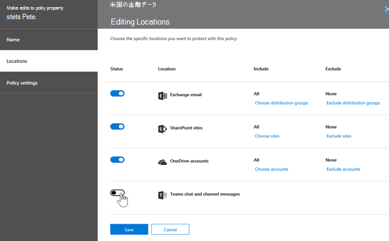
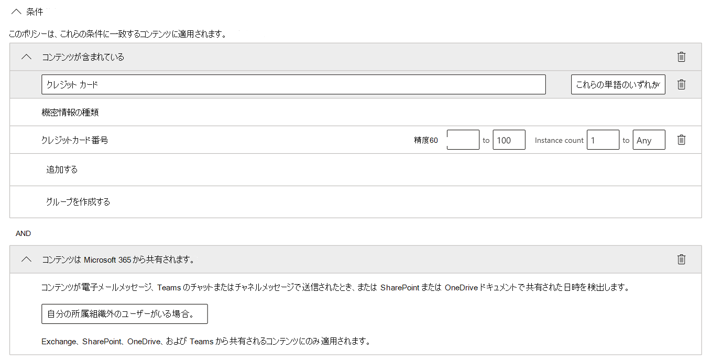
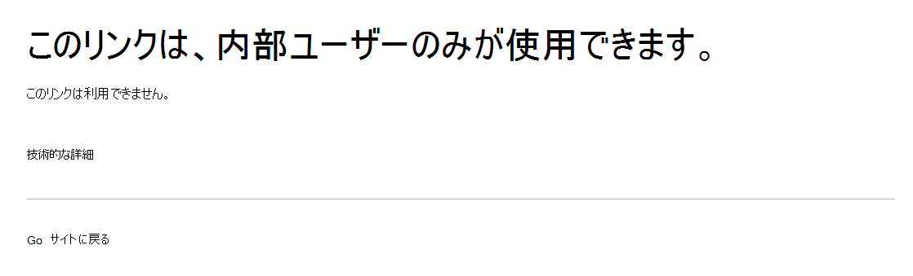

# データ損失防止と Microsoft Teams

組織にデータ損失防止 (DLP) がある場合は、ユーザーが機密情報をチャネルまたはチャット セッションで共有Microsoft Teamsポリシーを定義できます。 この保護のしくみの例を次に示します。

- **例 1: メッセージ内の機密情報を保護します**。 ユーザーがチャットまたはチャネル内の機密情報をゲスト (外部ユーザー) Teams共有しようとしたとします。 これを防ぐために DLP ポリシーが定義されている場合は、外部ユーザーに送信される機密情報を含むメッセージが削除されます。 これは、DLP ポリシーの構成方法に従って、自動的に数秒で行われます。

    > [!NOTE]
    > DLP for Microsoft Teamsは、次の権限を持つユーザーと共有Microsoft Teamsコンテンツをブロックします。 - [チームとチャネル](/MicrosoftTeams/guest-access) でのゲスト アクセス。または - [会議およびチャット](/MicrosoftTeams/manage-external-access) セッションでの外部アクセス。 
外部チャット セッションの DLP は、送信者と受信者の両方が Teams モードでネイティブ フェデレーションMicrosoft Teams[使用している場合にのみ機能します](/microsoftteams/manage-external-access)。 ユーザーの DLP Teams、またはネイティブ以外のフェデレーション チャット セッションとの相互運用Skype for Businessメッセージをブロックしません。

- **例 2: ドキュメント内の機密情報を保護します**。 ユーザーがチャネルまたはチャットのゲストとドキュメントを共有しようとMicrosoft Teams機密情報が含まれているとします。 これを防ぐために DLP ポリシーが定義されている場合、ドキュメントはそれらのユーザーに対して開かれません。 保護を適用するには、DLP ポリシーに SharePoint と OneDrive を含める必要があります。 これは、Microsoft Teams に表示される SharePoint の DLP の例であり、Office 365 DLP (Office 365 E3 に含まれる) のライセンスをユーザーに要求しますが、Office 365 Advanced Compliance のライセンスをユーザーに要求しません)。

## DLP ライセンス Microsoft Teams

[データ損失防止機能](dlp-learn-about-dlp.md)は、次のようなプライベート チャネル メッセージMicrosoft Teams含む、チャットメッセージやチャネル メッセージを含 **む機能が拡張** されました。

- Office 365 E5/A5/G5
- Microsoft 365 E5/A5/G5
- Microsoft 365 E5/A5/G5 情報保護とガバナンス
- Microsoft 365 E5/A5/G5/F5 コンプライアンスと F5 セキュリティ & コンプライアンス

Office 365およびMicrosoft 365 E3には、オンライン、SharePoint、およびOneDriveの DLP 保護Exchange Online。 また、このファイルには、Teamsを共有TeamsオンラインとSharePointをOneDriveするファイルも含まれます。

チャットでの DLP 保護のサポートTeams E5 が必要です。

ライセンス要件の詳細については、「[Microsoft 365 テナントレベル サービスのライセンスに関するガイダンス](/office365/servicedescriptions/microsoft-365-service-descriptions/microsoft-365-tenantlevel-services-licensing-guidance/microsoft-365-security-compliance-licensing-guidance)」を参照してください。

> [!IMPORTANT]
> DLP は、チャットスレッドまたはチャネル スレッドの実際のメッセージにのみ適用されます。 アクティビティ通知 (短いメッセージ プレビューを含み、ユーザーの通知設定に基づいて表示される)は、DLP にTeamsされません。 メッセージの一部に表示される機密情報は、DLP ポリシーが適用され、メッセージ自体の機密情報が削除された後でも、通知に表示されます。

## DLP 保護の範囲

DLP 保護は、エンティティに対してTeamsされます。

|ユーザー アカウント/グループ/リスト  |Teamsエンティティ |利用可能な DLP 保護|
|---------|---------|---------|
|個々のユーザー アカウント     |1:1/n チャット         |はい         |
|     |一般的なチャット         |いいえ         |
|     |プライベート チャネル         |はい         |
|セキュリティ グループ/配布リスト  | 1:1/n チャット         |はい         |
|     |一般的なチャット         |いいえ         |
|     |プライベート チャネル         |はい        |
|Microsoft 365 グループ    |1:1/n チャット          |いいえ         |
|     |一般的なチャット          |はい        |
|     |プライベート チャネル|いいえ| 

## ポリシー ヒントは、ユーザーの教育に役立ちます

[Exchange、Outlook、Outlook on the web、SharePoint](data-loss-prevention-policies.md#policy-evaluation-in-exchange-online-outlook-and-outlook-on-the-web) [Online、OneDrive for Business](data-loss-prevention-policies.md#policy-evaluation-in-onedrive-for-business-and-sharepoint-online-sites)サイト、および Office デスクトップ クライアントでの DLP の動作と同様に、アクションが DLP ポリシーでトリガーされるとポリシー ヒント[が](data-loss-prevention-policies.md#policy-evaluation-in-the-office-desktop-programs)表示されます。 ポリシー ヒントの例を次に示します。

![[ブロックされたメッセージの通知] Teams](../media/dlp-teams-blockedmessage-notification.png)

ここでは、送信者がソーシャル セキュリティ番号を別のチャネルで共有Microsoft Teamsしました。 [ **実行できる操作] リンクは** 、送信者が問題を解決するためのオプションを提供するダイアログ ボックスを開きます。 送信者はポリシーを上書きするか、管理者に確認と解決を通知することができます。

組織では、ユーザーに DLP ポリシーの上書きを許可できます。 DLP ポリシーを構成する場合は、既定のポリシー ヒントを使用するか、組織の [ポリシー ヒント](#to-customize-policy-tips) をカスタマイズできます。

この例に戻り、送信者がユーザー チャネルで社会保障番号を共有Teams、受信者が見た情報を次に示します。

> [!div class="mx-imgBorder"]
> 

### ポリシーのヒントをカスタマイズするには

このタスクを実行するには、DLP ポリシーを編集する権限を持つロールを割り当てる必要があります。 詳細については、「[アクセス許可](data-loss-prevention-policies.md#permissions)」を参照してください。

1. コンプライアンス センター ( ) に移動 [https://compliance.microsoft.com](https://compliance.microsoft.com) し、サインインします。

2. **[データ損失防止]** > **[ポリシー]** の順に選択します。

3. ポリシーを選択し、[ポリシー設定] の **横にある**[編集] を **選択します**。

4. 新しいルールを作成するか、ポリシーの既存のルールを編集します。

    > [!div class="mx-imgBorder"]
    > 

5. [ユーザー通知 **] タブで** 、[メール テキストの **カスタマイズ** ] または [ポリシー ヒントのテキスト **オプションのカスタマイズ] を選択** します。

    > [!div class="mx-imgBorder"]
    >    

6. 電子メール通知やポリシー ヒントに使用するテキストを指定し、[保存] を **選択します**。

7. [ポリシー設定 **] タブで** 、[保存] を **選択します**。

変更がデータ センターを通じて動作し、ユーザー アカウントに同期するために約 1 時間を許可します。
 <!-- why are these syncing to user accounts? -->

## Microsoft Teams を場所として既存の DLP ポリシーに追加する

このタスクを実行するには、DLP ポリシーを編集する権限を持つロールを割り当てる必要があります。 詳細については、「[アクセス許可](data-loss-prevention-policies.md#permissions)」を参照してください。

1. コンプライアンス センター ( ) に移動 [https://compliance.microsoft.com](https://compliance.microsoft.com) し、サインインします。

2. **[データ損失防止]** > **[ポリシー]** の順に選択します。

3. ポリシーを選択し、[場所] の下の値 **を確認します**。 チャットメッセージと **Teamsメッセージが表示される** 場合は、すべて設定されています。 編集しない場合は、[編集] を **クリックします**。

    > [!div class="mx-imgBorder"]
    > 

4. [状態 **] 列** で、チャットメッセージとチャネル メッセージのTeams **をオンにします**。

    > [!div class="mx-imgBorder"]
    > 

5. [場所 **の選択] タブ** で、すべてのアカウントの既定の設定を維持するか、[特定の場所を選択する] **を選択します**。 次の情報を指定できます。

    1. 最大 1000 個の個別アカウントを含めるか除外する
    1. 配布リストとセキュリティ グループを含めるか除外します。 
    <!-- 1. the shared mailbox of a shared channel. **This is a public preview feature.**--> 
    
6. **[次へ]** を選択します。

7. **[保存]** をクリックします。

変更がデータ センターを通じて動作し、ユーザー アカウントに同期するために約 1 時間を許可します。
<!-- again, why user accounts? -->

## Microsoft Teams の新しい DLP ポリシーを定義する

このタスクを実行するには、DLP ポリシーを編集する権限を持つロールを割り当てる必要があります。 詳細については、「[アクセス許可](data-loss-prevention-policies.md#permissions)」を参照してください。

1. コンプライアンス センター ( ) に移動 [https://compliance.microsoft.com](https://compliance.microsoft.com) し、サインインします。

2. **[データ損失防止]** > **[ポリシー]** > **[+ ポリシーの作成]** の順に選択します。

3. テンプレートを選択 [し、次へ] を **選択します**。

    この例では、米国の個人を特定できる情報データ テンプレートを選択しました。

    > [!div class="mx-imgBorder"]
    >  

4. [ポリシー **に名前を付け** ] タブで、ポリシーの名前と説明を指定し、[次へ] を **選択します**。

5. [場所 **の選択] タブ** で、すべてのアカウントの既定の設定を維持するか、[特定の場所を選択する] **を選択します**。 次の情報を指定できます。

    1. 最大 1000 個の個別アカウントを含めるか除外する
    1. 配布リストとセキュリティ グループを含めるか除外します。 **これはパブリック プレビュー機能です。**
    <!-- 1. the shared mailbox of a shared channel. **This is a public preview feature.**-->  

    

    > [!NOTE]
    > 機密情報を含むドキュメントが Teams で不適切に共有されない場合は **、SharePoint** サイトと **OneDrive** アカウントが Teams チャットメッセージとチャネル メッセージと共にオン **になっていることを** 確認します。

6. [ポリシー設定 **] タブ** の[保護するコンテンツの種類をカスタマイズする] で、既定の単純な設定を保持するか、[詳細設定を使用する] を選択して、[次へ] を選択 **します**。 詳細設定を選択した場合は、ポリシーのルールを作成または編集できます。 このヘルプについては、「簡易設定と [詳細設定」を参照してください](data-loss-prevention-policies.md#simple-settings-vs-advanced-settings)。

7.  [ポリシー **設定] タブ** の **[機密情報** が検出された場合の操作] で、設定を確認します。 ここでは、既定のポリシー ヒントと電子メール通知を保持するか、カスタマイズすることもできます。

    > [!div class="mx-imgBorder"]
    > 

    設定の確認または編集が完了したら、[次へ] を **選択します**。

8. [ポリシーの **設定**] タブの [ポリシーを有効にするか、最初にテストするのかを選択しますか **?]** で、ポリシーを有効 にするか、最初にテストするか、今のところオフにしておき、[次へ] を選択します。

    > [!div class="mx-imgBorder"]
    > 

9. [設定 **の確認] タブ** で、新しいポリシーの設定を確認します。 [編集 **] を** 選択して変更を加えます。 完了したら、[作成] を **選択します**。

新しいポリシーがデータセンター経由で動作し、ユーザー アカウントと同期するには、約 1 時間を許可します。

## 機密文書への外部アクセスを防止する

機密情報をSharePoint含むドキュメントに、既定で SharePoint または Teams から外部ゲストがアクセスできないことを確認するには、次の項目を選択します。

- 新しいファイルを既定で機密性の高いファイルとしてマークすることで、DLP スキャンが行い、共有が安全とマークされるまで、ドキュメントが [確実に保護されます](/sharepoint/sensitive-by-default)。

- 推奨される DLP ポリシー構造

    - **条件**
        - コンテンツには、次の機密情報の種類が含まれる。 [適用するすべて選択]
        
        - 組織外のユーザー Microsoft 365からコンテンツを共有する
        
          > [!div class="mx-imgBorder"]
          > 

    - **Actions**
        - 外部ユーザーのコンテンツへのアクセスを制限する
        
        - メールおよびポリシー ヒントでユーザーに通知する
        
        - インシデント レポートを管理者に送信する
        
        > [!div class="mx-imgBorder"]
        > 

機密情報を含むドキュメントを外部ゲストと共有SharePoint DLP ポリシーが動作します。

> [!div class="mx-imgBorder"]
> 

ゲストが外部ブロックを使用してドキュメントを開Teams DLP ポリシーが有効です。

> [!div class="mx-imgBorder"]
> 

## 関連記事

- [DLP ポリシーの作成、テスト、調整](create-test-tune-dlp-policy.md)
- [メール通知を送信して、DLP ポリシーのヒントを表示する](use-notifications-and-policy-tips.md)
