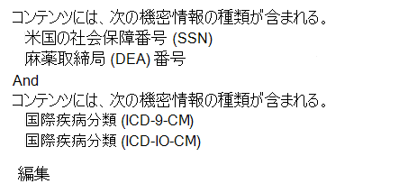
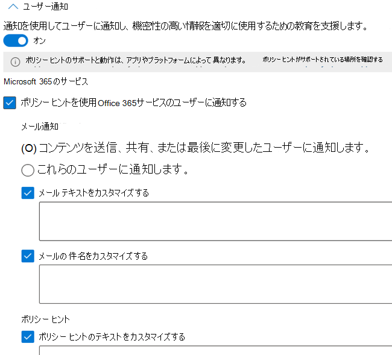
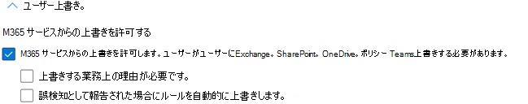

# データ損失防止ポリシーリファレンス

データ損失防止 (DLP) ポリシーには、構成する多くのコンポーネントがあります。 効果的なポリシーを作成するには、各コンポーネントの目的と、その構成によってポリシーの動作がどのように変化するのかを理解する必要があります。 この記事では、DLP ポリシーの詳細な構造について説明します。

## ポリシー テンプレート 

DLP ポリシー テンプレートは、次の 4 つのカテゴリに事前に並べ替えされています。

- 財務情報の種類を検出して **保護できる** 情報。
- 医療と健康に関する情報の種類を検出 **して保護できる** 情報。
- プライバシー情報の種類を検出して **保護できる** 情報。
- 他 **の 1** つが組織のニーズを満たしない場合に独自のポリシーを作成するために使用できるカスタム テンプレート。

次の表に、すべてのポリシー テンプレートと機密情報の種類 (SIT) を示します。 

更新日: 2021/06/23

|Category| テンプレート | SIT |
|---------|---------|---------|
|財務的| オーストラリアの金融データ| - [SWIFT コード](sensitive-information-type-entity-definitions.md#swift-code)   - [オーストラリアの税ファイル番号](sensitive-information-type-entity-definitions.md#australia-tax-file-number)   - [オーストラリアの銀行口座番号](sensitive-information-type-entity-definitions.md#australia-bank-account-number)   - [クレジット カード番号](sensitive-information-type-entity-definitions.md#credit-card-number)|
|財務的| カナダ 財務データ |- [クレジット カード番号](sensitive-information-type-entity-definitions.md#credit-card-number)   -  [カナダの銀行口座番号](sensitive-information-type-entity-definitions.md#canada-bank-account-number)|
|財務的| フランス 財務データ |- [クレジット カード番号](sensitive-information-type-entity-definitions.md#credit-card-number)   - [EU のデビットカード番号](sensitive-information-type-entity-definitions.md#eu-debit-card-number)|
|財務的| ドイツの金融データ |- [クレジット カード番号](sensitive-information-type-entity-definitions.md#credit-card-number)   - [EU のデビットカード番号](sensitive-information-type-entity-definitions.md#eu-debit-card-number)|
|財務的| イスラエルの金融データ |- [イスラエルの銀行口座番号](sensitive-information-type-entity-definitions.md#israel-bank-account-number)   - [SWIFT コード](sensitive-information-type-entity-definitions.md#swift-code)   - [クレジット カード番号](sensitive-information-type-entity-definitions.md#credit-card-number)|
|財務的| 日本の金融データ |- [日本の銀行口座番号](sensitive-information-type-entity-definitions.md#japan-bank-account-number)   - [クレジット カード番号](sensitive-information-type-entity-definitions.md#credit-card-number)|
|財務的| PCI データ セキュリティ基準 (PCI DSS)|- [クレジット カード番号](sensitive-information-type-entity-definitions.md#credit-card-number)|
|財務的| サウジアラビアのサイバー犯罪防止法|- [SWIFT コード](sensitive-information-type-entity-definitions.md#swift-code)   - [国際銀行口座番号 (IBAN)](sensitive-information-type-entity-definitions.md#international-banking-account-number-iban) |
|財務的| サウジアラビアの金融データ |- [クレジット カード番号](sensitive-information-type-entity-definitions.md#credit-card-number)   - [SWIFT コード](sensitive-information-type-entity-definitions.md#swift-code)   - [国際銀行口座番号 (IBAN)](sensitive-information-type-entity-definitions.md#international-banking-account-number-iban)|
|財務的| 英国の財務データ|- [クレジット カード番号](sensitive-information-type-entity-definitions.md#credit-card-number)   - [EU のデビットカード番号](sensitive-information-type-entity-definitions.md#eu-debit-card-number)   - [SWIFT コード](sensitive-information-type-entity-definitions.md#swift-code)|
|財務的| 米国の財務データ|- [クレジット カード番号](sensitive-information-type-entity-definitions.md#credit-card-number)   - [米国の銀行口座番号](sensitive-information-type-entity-definitions.md#us-bank-account-number)  - [ABA ルーティング番号](sensitive-information-type-entity-definitions.md#aba-routing-number)|
|財務的| 米国連邦取引委員会 (FTC) の消費者保護規則|- [クレジット カード番号](sensitive-information-type-entity-definitions.md#credit-card-number)   - [米国の銀行口座番号](sensitive-information-type-entity-definitions.md#us-bank-account-number)  - [ABA ルーティング番号](sensitive-information-type-entity-definitions.md#aba-routing-number)|
|財務的| 米国の Gramm-Leach-Bliley 法 (GLBA) 拡張|- [クレジット カード番号](sensitive-information-type-entity-definitions.md#credit-card-number)   - [米国の銀行口座番号](sensitive-information-type-entity-definitions.md#us-bank-account-number)  - [米国の個人納税者識別番号 (ITIN)](sensitive-information-type-entity-definitions.md#us-individual-taxpayer-identification-number-itin)    - [米国の社会保障番号 (SSN)](sensitive-information-type-entity-definitions.md#us-social-security-number-ssn)  - [米国/英国のパスポート番号](sensitive-information-type-entity-definitions.md#us--uk-passport-number)   -[米国の運転免許証番号](sensitive-information-type-entity-definitions.md#us-drivers-license-number)|
|財務的| 米国のグラム リーチ ブライリー法 (GLBA)|- [クレジット カード番号](sensitive-information-type-entity-definitions.md#credit-card-number)   - [米国の銀行口座番号](sensitive-information-type-entity-definitions.md#us-bank-account-number)  - [米国の個人納税者識別番号 (ITIN)](sensitive-information-type-entity-definitions.md#us-individual-taxpayer-identification-number-itin)    - [米国の社会保障番号 (SSN)](sensitive-information-type-entity-definitions.md#us-social-security-number-ssn)|
|医療と健康| オーストラリアの健康記録法 (HRIP 法) 拡張 |- [オーストラリアの税ファイル番号](sensitive-information-type-entity-definitions.md#australia-tax-file-number)   - [オーストラリアの医療アカウント番号](sensitive-information-type-entity-definitions.md#australia-medical-account-number)|
|医療と健康| オーストラリアの保健記録法 (HRIP 法)|- [オーストラリアの税ファイル番号](sensitive-information-type-entity-definitions.md#australia-tax-file-number)   - [オーストラリアの医療アカウント番号](sensitive-information-type-entity-definitions.md#australia-medical-account-number)|
|医療と健康| カナダの健康情報法 (HIA) |- [カナダのパスポート番号](sensitive-information-type-entity-definitions.md#canada-passport-number)  - [カナダの社会保険番号](sensitive-information-type-entity-definitions.md#canada-social-insurance-number)   - [カナダの正常性サービス番号](sensitive-information-type-entity-definitions.md#canada-health-service-number)   - [カナダの個人の健康識別番号](sensitive-information-type-entity-definitions.md#canada-personal-health-identification-number-phin)|
|医療と健康| カナダの個人情報法 (PHIA) マニトバ州|- [カナダの社会保険番号](sensitive-information-type-entity-definitions.md#canada-social-insurance-number)   - [カナダの正常性サービス番号](sensitive-information-type-entity-definitions.md#canada-health-service-number)   - [カナダの個人の健康識別番号](sensitive-information-type-entity-definitions.md#canada-personal-health-identification-number-phin)|
|医療と健康| カナダ個人健康法 (PHIPA) オンタリオ州 |- [カナダのパスポート番号](sensitive-information-type-entity-definitions.md#canada-passport-number)  - [カナダの社会保険番号](sensitive-information-type-entity-definitions.md#canada-social-insurance-number)   - [カナダの正常性サービス番号](sensitive-information-type-entity-definitions.md#canada-health-service-number)   - [カナダの個人の健康識別番号](sensitive-information-type-entity-definitions.md#canada-personal-health-identification-number-phin)|
|医療と健康| 英国の医療報告書の利用に関する法律|- [英国の国民保健サービス番号](sensitive-information-type-entity-definitions.md#uk-national-health-service-number)   - [英国の国民保険番号 (NINO)](sensitive-information-type-entity-definitions.md#uk-national-insurance-number-nino)|
|医療と健康| 米国健康保険法 (HIPAA) 拡張|  - [病気の国際分類 (ICD-9-CM)](sensitive-information-type-entity-definitions.md#international-classification-of-diseases-icd-9-cm)   - [病気の国際分類 (ICD-10-CM)](sensitive-information-type-entity-definitions.md#international-classification-of-diseases-icd-10-cm) |
|医療と健康| 米国の医療保険法 (HIPAA)| - [病気の国際分類 (ICD-9-CM)](sensitive-information-type-entity-definitions.md#international-classification-of-diseases-icd-9-cm)   - [病気の国際分類 (ICD-10-CM)](sensitive-information-type-entity-definitions.md#international-classification-of-diseases-icd-10-cm)|
|プライバシー| オーストラリアのプライバシー法の強化|- [オーストラリアの運転免許証番号](sensitive-information-type-entity-definitions.md#australia-drivers-license-number)   - [オーストラリアのパスポート番号](sensitive-information-type-entity-definitions.md#australia-passport-number)|
|プライバシー| オーストラリアのプライバシー保護法|- [オーストラリアの運転免許証番号](sensitive-information-type-entity-definitions.md#australia-drivers-license-number)   - [オーストラリアのパスポート番号](sensitive-information-type-entity-definitions.md#australia-passport-number)|
|プライバシー| オーストラリアの個人情報 (PII) データ|- [オーストラリアの税ファイル番号](sensitive-information-type-entity-definitions.md#australia-tax-file-number)   - [オーストラリアの運転免許証番号](sensitive-information-type-entity-definitions.md#australia-drivers-license-number)|
|プライバシー| カナダの個人情報 (PII) データ|- [カナダの運転免許証番号](sensitive-information-type-entity-definitions.md#canada-drivers-license-number)  - [カナダの銀行口座番号](sensitive-information-type-entity-definitions.md#canada-bank-account-number)   - [カナダのパスポート番号](sensitive-information-type-entity-definitions.md#canada-passport-number)  - [カナダの社会保険番号](sensitive-information-type-entity-definitions.md#canada-social-insurance-number)   - [カナダの正常性サービス番号](sensitive-information-type-entity-definitions.md#canada-health-service-number)   - [カナダの個人の健康識別番号](sensitive-information-type-entity-definitions.md#canada-personal-health-identification-number-phin)|
|プライバシー| カナダの個人情報保護法 (PIPA)|- [カナダのパスポート番号](sensitive-information-type-entity-definitions.md#canada-passport-number)  - [カナダの社会保険番号](sensitive-information-type-entity-definitions.md#canada-social-insurance-number)   - [カナダの正常性サービス番号](sensitive-information-type-entity-definitions.md#canada-health-service-number)   - [カナダの個人の健康識別番号](sensitive-information-type-entity-definitions.md#canada-personal-health-identification-number-phin)|
|プライバシー| カナダの個人情報保護法 (PIPEDA)|- [オーストラリアのパスポート番号](sensitive-information-type-entity-definitions.md#australia-passport-number)   [カナダの運転免許証番号](sensitive-information-type-entity-definitions.md#canada-drivers-license-number)   - [カナダの銀行口座番号](sensitive-information-type-entity-definitions.md#canada-bank-account-number)   - [カナダのパスポート番号](sensitive-information-type-entity-definitions.md#canada-passport-number)  - [カナダの社会保険番号](sensitive-information-type-entity-definitions.md#canada-social-insurance-number)   - [カナダの正常性サービス番号](sensitive-information-type-entity-definitions.md#canada-health-service-number)   - [カナダの個人の健康識別番号](sensitive-information-type-entity-definitions.md#canada-personal-health-identification-number-phin)|
|プライバシー| フランスのデータ保護法|- [フランスの国民 ID カード (CNI)](sensitive-information-type-entity-definitions.md#france-national-id-card-cni)   - [フランスの社会保障番号 (INSEE)](sensitive-information-type-entity-definitions.md#france-social-security-number-insee)|
|プライバシー| フランスの個人情報 (PII) データ|- [フランスの社会保障番号 (INSEE)](sensitive-information-type-entity-definitions.md#france-social-security-number-insee)   - [フランスの運転免許証番号](sensitive-information-type-entity-definitions.md#france-drivers-license-number)   - [フランスのパスポート番号](sensitive-information-type-entity-definitions.md#france-passport-number)   - [フランスの国民 ID カード (CNI)](sensitive-information-type-entity-definitions.md#france-national-id-card-cni)|
|プライバシー| 一般データ保護規則 (GDPR) 拡張|- [EU のデビットカード番号](sensitive-information-type-entity-definitions.md#eu-debit-card-number)   - [EU の運転免許証番号](sensitive-information-type-entity-definitions.md#eu-drivers-license-number)   - [EU の国民識別番号](sensitive-information-type-entity-definitions.md#eu-national-identification-number)   - [EU パスポート番号](sensitive-information-type-entity-definitions.md#eu-passport-number)   - [EU 社会保障番号または同等の ID](sensitive-information-type-entity-definitions.md#eu-social-security-number-or-equivalent-identification)   - [EU 税の識別番号](sensitive-information-type-entity-definitions.md#eu-tax-identification-number)| 
|プライバシー| EU 一般データ保護規則 (GDPR)|- [EU のデビットカード番号](sensitive-information-type-entity-definitions.md#eu-debit-card-number)   - [EU の運転免許証番号](sensitive-information-type-entity-definitions.md#eu-drivers-license-number)   - [EU の国民識別番号](sensitive-information-type-entity-definitions.md#eu-national-identification-number)  - [EU パスポート番号](sensitive-information-type-entity-definitions.md#eu-passport-number)   - [EU 社会保障番号または同等の ID](sensitive-information-type-entity-definitions.md#eu-social-security-number-or-equivalent-identification)  - [EU 税の識別番号](sensitive-information-type-entity-definitions.md#eu-tax-identification-number)|
|プライバシー| ドイツの個人情報 (PII) データ|- [ドイツの運転免許証番号](sensitive-information-type-entity-definitions.md#germany-drivers-license-number)   - [ドイツのパスポート番号](sensitive-information-type-entity-definitions.md#germany-passport-number)| 
|プライバシー| イスラエルの個人情報 (PII) データ|- [イスラエルの国民識別番号](sensitive-information-type-entity-definitions.md#israel-national-identification-number)| 
|プライバシー| イスラエルのプライバシー保護|- [イスラエルの国民識別番号](sensitive-information-type-entity-definitions.md#israel-national-identification-number)  - [イスラエルの銀行口座番号](sensitive-information-type-entity-definitions.md#israel-bank-account-number)|
|プライバシー| 日本の個人を特定できる情報 (PII) データの強化|- [日本社会保険番号 (SIN)](sensitive-information-type-entity-definitions.md#japan-social-insurance-number-sin)  - [日本のマイナンバー - 個人用](sensitive-information-type-entity-definitions.md#japan-my-number---personal)  - [日本のパスポート番号](sensitive-information-type-entity-definitions.md#japan-passport-number)  - [日本の運転免許証番号](sensitive-information-type-entity-definitions.md#japan-drivers-license-number)|
|プライバシー| 日本の個人情報 (PII) データ|- [日本居住者登録番号](sensitive-information-type-entity-definitions.md#japan-resident-registration-number)   - [日本社会保険番号 (SIN)](sensitive-information-type-entity-definitions.md#japan-social-insurance-number-sin)|
|プライバシー| 日本の個人情報保護の強化|- [日本社会保険番号 (SIN)](sensitive-information-type-entity-definitions.md#japan-social-insurance-number-sin)   - [日本のマイナンバー - 個人用](sensitive-information-type-entity-definitions.md#japan-my-number---personal)  - [日本のパスポート番号](sensitive-information-type-entity-definitions.md#japan-passport-number)   - [日本の運転免許証番号](sensitive-information-type-entity-definitions.md#japan-drivers-license-number)| 
|プライバシー| 日本の個人情報保護|- [日本居住者登録番号](sensitive-information-type-entity-definitions.md#japan-resident-registration-number)  - [日本社会保険番号 (SIN)](sensitive-information-type-entity-definitions.md#japan-social-insurance-number-sin)|
|プライバシー| サウジアラビア 個人を特定できる (PII) データ|- [サウジアラビアの国民 ID](sensitive-information-type-entity-definitions.md#saudi-arabia-national-id)|
|プライバシー| 英国のデータ保護法|- [英国の国民保険番号 (NINO)](sensitive-information-type-entity-definitions.md#uk-national-insurance-number-nino)   - [米国/英国のパスポート番号](sensitive-information-type-entity-definitions.md#us--uk-passport-number)   - [SWIFT コード](sensitive-information-type-entity-definitions.md#swift-code)|
|プライバシー| 英国のプライバシーおよび電子通信に関する規制|- [SWIFT コード](sensitive-information-type-entity-definitions.md#swift-code)|
|プライバシー| 英国の個人情報 (PII) データ|- [英国の国民保険番号 (NINO)](sensitive-information-type-entity-definitions.md#uk-national-insurance-number-nino)   - [米国/英国のパスポート番号](sensitive-information-type-entity-definitions.md#us--uk-passport-number)|
|プライバシー| 英国のオンラインの個人情報に関する実務基準 (PIOCP)|- [英国の国民保険番号 (NINO)](sensitive-information-type-entity-definitions.md#uk-national-insurance-number-nino)   - [英国の国民保健サービス番号](sensitive-information-type-entity-definitions.md#uk-national-health-service-number)   - [SWIFT コード](sensitive-information-type-entity-definitions.md#swift-code)|
|プライバシー| 米国愛国者法の強化|- [クレジット カード番号](sensitive-information-type-entity-definitions.md#credit-card-number)   - [米国の銀行口座番号](sensitive-information-type-entity-definitions.md#us-bank-account-number)  - [米国の個人納税者識別番号 (ITIN)](sensitive-information-type-entity-definitions.md#us-individual-taxpayer-identification-number-itin)    - [米国の社会保障番号 (SSN)](sensitive-information-type-entity-definitions.md#us-social-security-number-ssn)|
|プライバシー| 米国の愛国者法|- [クレジット カード番号](sensitive-information-type-entity-definitions.md#credit-card-number)   - [米国の銀行口座番号](sensitive-information-type-entity-definitions.md#us-bank-account-number)  - [米国の個人納税者識別番号 (ITIN)](sensitive-information-type-entity-definitions.md#us-individual-taxpayer-identification-number-itin)    - [米国の社会保障番号 (SSN)](sensitive-information-type-entity-definitions.md#us-social-security-number-ssn)|
|プライバシー| 米国の個人を特定できる情報 (PII) データ拡張|- [米国の個人納税者識別番号 (ITIN)](sensitive-information-type-entity-definitions.md#us-individual-taxpayer-identification-number-itin)    - [米国の社会保障番号 (SSN)](sensitive-information-type-entity-definitions.md#us-social-security-number-ssn)  - [米国/英国のパスポート番号](sensitive-information-type-entity-definitions.md#us--uk-passport-number)|
|プライバシー| 米国の個人情報 (PII) データ|- [米国の個人納税者識別番号 (ITIN)](sensitive-information-type-entity-definitions.md#us-individual-taxpayer-identification-number-itin)    - [米国の社会保障番号 (SSN)](sensitive-information-type-entity-definitions.md#us-social-security-number-ssn)  - [米国/英国のパスポート番号](sensitive-information-type-entity-definitions.md#us--uk-passport-number)|
|プライバシー| 米国の州違反通知法の強化|- [クレジット カード番号](sensitive-information-type-entity-definitions.md#credit-card-number)   - [米国の銀行口座番号](sensitive-information-type-entity-definitions.md#us-bank-account-number)  -[米国の運転免許証番号](sensitive-information-type-entity-definitions.md#us-drivers-license-number)   - [米国の社会保障番号 (SSN)](sensitive-information-type-entity-definitions.md#us-social-security-number-ssn)   - [米国/英国のパスポート番号](sensitive-information-type-entity-definitions.md#us--uk-passport-number)|
|プライバシー| 米国の個人情報漏洩の通知に関する州法|- [クレジット カード番号](sensitive-information-type-entity-definitions.md#credit-card-number)   - [米国の銀行口座番号](sensitive-information-type-entity-definitions.md#us-bank-account-number)  -[米国の運転免許証番号](sensitive-information-type-entity-definitions.md#us-drivers-license-number)   - [米国の社会保障番号 (SSN)](sensitive-information-type-entity-definitions.md#us-social-security-number-ssn)|
|プライバシー| 米国の社会保障番号の機密保持に関する州法|- [米国の社会保障番号 (SSN)](sensitive-information-type-entity-definitions.md#us-social-security-number-ssn)| 

## 場所

DLP ポリシーは、複数の場所にわたって機密情報を含むアイテムを検索して保護できます。

|場所  |範囲を含める/除外する  |データ状態  |その他の前提条件 |
|---------|---------|---------|---------|
|Exchangeメールをオンラインで送信する |配布グループ | data-in-motion| いいえ |
|SharePointサイト   |sites       | data-at-rest   data-in-use | いいえ|
|OneDrive for Business アカウント| アカウントまたは配布グループ |data-at-rest   data-in-use|いいえ|
|Teams チャットおよびチャネル メッセージ     | アカウントまたは配布グループ |data-in-motion   data-in-use |  いいえ       |
|Microsoft Cloud App Security (MCAS)   | クラウド アプリ インスタンス       |data-at-rest         | - [Microsoft 以外のクラウド アプリでデータ損失防止ポリシーを使用する](dlp-use-policies-non-microsoft-cloud-apps.md#use-data-loss-prevention-policies-for-non-microsoft-cloud-apps)        |
|デバイス  |ユーザーまたはグループ         |data-at-rest    data-in-use    data-in-motion         |- [エンドポイントデータ損失Microsoft 365の詳細](endpoint-dlp-learn-about.md#learn-about-microsoft-365-endpoint-data-loss-prevention)  - [エンドポイントのデータ損失防止の使用を開始する](endpoint-dlp-getting-started.md#get-started-with-endpoint-data-loss-prevention)  - [エンドポイント DLP のデバイス プロキシとインターネット接続の設定を構成する](endpoint-dlp-configure-proxy.md#configure-device-proxy-and-internet-connection-settings-for-endpoint-dlp)        |
|オンプレミスリポジトリ (ファイル共有とSharePoint)    |リポジトリ         | data-at-rest         | - [データ損失防止Microsoft 365オンプレミス スキャナーの詳細](dlp-on-premises-scanner-learn.md#learn-about-the-microsoft-365-data-loss-prevention-on-premises-scanner)   - [データ損失防止オンプレミス スキャナーの使用を開始する](dlp-on-premises-scanner-get-started.md#get-started-with-the-data-loss-prevention-on-premises-scanner)         |

Exchange に特定の配布グループを含めるように選択した場合、DLP ポリシーはそのグループのメンバーにのみ適用されます。 同様に、配布グループを除外すると、その配布グループのすべてのメンバーがポリシー評価から除外されます。 ポリシーを配布リストのメンバー、動的配布グループ、セキュリティ グループの範囲にすることができます。 DLP ポリシーには、このような追加および除外を 50 個まで含めることができます。

特定の SharePoint サイトまたは OneDrive アカウントを含めるか、除外するかを選択した場合、DLP ポリシーに含めることができるのは、100 を超えることはできません。 こうした制限はありますが、組織全体のポリシーまたは場所全体に適用されるポリシーを適用することで、この制限を超えることができます。

特定の OneDrive アカウントまたはグループを含めるか、除外するかを選択した場合、DLP ポリシーに含めることができるのは、ユーザー アカウントなら 100 までで、グループなら 50 までです。

### コンテンツの定義方法に関する場所のサポート

DLP ポリシーは、機密情報の種類 (SIT)、機密ラベル、または保持ラベルに一致することで、機密アイテムを検出します。 各場所では、機密性の高いコンテンツを定義するさまざまな方法がサポートされています。 ポリシー内の場所を組み合わせると、コンテンツの定義方法が 1 つの場所で定義される方法と異なる場合があります。 

> [!IMPORTANT]
> ポリシーに複数の場所を選択すると、コンテンツ定義カテゴリの "no" 値が "yes" 値よりも優先されます。 たとえば、サイトのみを選択SharePointポリシーは、1 つ以上の SIT、機密ラベル、または保持ラベルによる機密アイテムの検出をサポートします。 ただし、サイトを選択 ***SharePointチャットTeams*** チャネル メッセージの場所を選択すると、ポリシーは SIT による機密性の高いアイテムの検出のみをサポートします。 

|場所|  コンテンツは SIT で定義できます|  コンテンツは、感度ラベルを定義できます|   コンテンツは保持ラベルで定義できます|
|---------|---------|---------|---------|
|Exchangeメールをオンラインで送信する|はい| はい|    いいえ|
|SharePointサイト|   はい|    はい|    はい|
|OneDrive for Business アカウント|    はい|    はい|    はい|
|Teamsチャットメッセージとチャネル メッセージ |  はい|    いいえ| いいえ|
|デバイス    |はい |  はい|    いいえ|
|Microsoft Cloud App Security|  はい|    はい|    はい|
|オンプレミス リポジトリ|  はい|    はい|    いいえ|

> [!NOTE]
> DLP では、電子メールおよび attachemnets の感度ラベルの検出がサポートされています。「DLP ポリシーで感度ラベルを条件として [使用する」を参照してください](dlp-sensitivity-label-as-condition.md#use-sensitivity-labels-as-conditions-in-dlp-policies)。

## ルール

<!--This section introduces the classifications of content that, when detected, can be protected. Link out to [Learn about sensitive information types]() and [Sensitive information type entity definitions](sensitive-information-type-entity-definitions.md#sensitive-information-type-entity-definitions) as well as labels (cross referenced by supporting workload). It will touch on the purpose of multiple conditions, confidence levels (link out to [more on confidence levels](sensitive-information-type-learn-about.md#more-on-confidence-levels)) and confidence levels video. How to use the confidence level to change the behavior of a policy in conjunction with the instance count.  eg. if you want your policy to trigger when it encounters situation DEF, set your conditions like HIJ.-->
<!--
- What is a rule in the context of a Policy?
- when and why should I have more than one rule?
- The purpose of rule groups
- How do I tune the behavior of a Policy through the tuning of rules
- what's in a rule-->

ルールは DLP ポリシーのビジネス ロジックです。 これらは、次の要素で構成されます。

- [**一**](#conditions) 致した場合にポリシーをトリガーする条件
- [**条件**](#exceptions) の例外
- [**ポリシー**](#actions) がトリガーされた場合に実行するアクション
- [**ユーザーが**](#user-notifications-and-policy-tips) ポリシーをトリガーする何かを行っているときにユーザーに通知し、組織が機密情報の処理方法を教育する際に役立つユーザー通知
- [**管理者が構成した**](#user-overrides) 場合のユーザーの上書き、ユーザーがブロック操作を選択的に上書きできる
- [**ルールの一**](#incident-reports) 致が発生した場合に管理者や他の主要関係者に通知するインシデント レポート
- [**ルール評価の**](#additional-options) 優先度を定義し、ルールとポリシーの処理をさらに停止できる追加オプション。

 ポリシーには、1 つ以上のルールが含まれる。 ルールは、各ポリシー内の最も高位のルールから順に実行されます。

### 処理するルールの優先度

各ルールには、作成順に優先度が割り当てられます。 つまり、最初に作成されたルールには第 1 優先順位、2 番目に作成されたルールには第 2 の優先度が設定されます。 
  

コンテンツがルールに対して評価されると、ルールは優先度順に処理されます。 コンテンツが複数のルールに一致する場合、最も制限の厳しいアクションを持つ最初のルールが適用されます。 たとえば、コンテンツが以下のすべてのルールに一致する場合、最も優先度が高く、制限が厳しいルール 3 が適用されます。
  
- ルール 1: ユーザーに通知のみを行う
- ルール 2: ユーザーに通知する、アクセスを制限する、ユーザーによる上書きを許可する
- ルール 3: ユーザーに通知する、アクセスを制限する、ユーザーによる上書きを許可しない
- ルール 4: アクセスを制限する

ルール 1、2、および 4 は評価されますが、適用されません。 この例では、最も制限の厳しいルールだけが適用されている場合でも、すべてのルールの一致が監査ログに記録され、DLP レポートに表示されます。

ルールを使用して特定の保護要件を満たし、DLP ポリシーを使用して一般的な保護要件をグループ化できます (たとえば、特定の規制に準拠する必要のあるすべてのルール)。
  
たとえば、Health Insurance Portability and Accountability Act (HIPAA) の対象となる情報の存在を検出する際に役立つ DLP ポリシーがあるとします。 この DLP ポリシーは、HIPAA データ (対象) をすべての SharePoint Online サイトと OneDrive for Business サイト (場所) で保護するために、組織外の人物と共有するこの機密情報が含まれるドキュメント (条件) を検出し、そのドキュメントに対するアクセスをブロックして通知を送信 (アクション) できます。 これらの要件は、個別のルールとして保存され、簡単に管理およびレポートする DLP ポリシーとしてまとめてグループ化されます。
  

### 条件

条件は包括的であり、ルールで何を探すのか、およびそれらのアイテムが使用されているコンテキストを定義する場所です。 *ルール*&#8212; は、このようなアイテムを見つけ、&#8212; のように使用されている場合は一致し、ポリシー内の残りのアクションはルール &#8212; に対して実行する必要があります。 条件を使用して、さまざまな操作をリスクレベル別に割り当てることができます。 たとえば、組織内で共有されている機密コンテンツは、組織外のユーザーと共有されている機密コンテンツよりリスク レベルが低く、必要なアクションを少なくする、といったことができます。

> [!NOTE]
> ホストの組織の Active Directory または Azure Active Directory のテナントにゲスト以外のアカウントを持っているユーザーは、組織内のユーザーと見なされます。 

#### コンテンツが含まれている

 コンテンツに含まれるすべての **場所に条件** が含まれているのがサポートされています。 各コンテンツ タイプの複数のインスタンスを選択し、次の **(論理** OR) 演算子またはすべての **(論理** AND) 演算子を使用して条件をさらに絞り込みできます。

- [機密情報の種類](sensitive-information-type-learn-about.md#learn-about-sensitive-information-types)
- [秘密度ラベル](sensitivity-labels.md)
- [保持ラベル](retention.md#using-a-retention-label-as-a-condition-in-a-dlp-policy)

ポリシーを適用 [する場所](#location-support-for-how-content-can-be-defined) に応じて異なる場合があります。 

SIT には事前に定義された信頼 [**度が設定されています**](https://www.microsoft.com/videoplayer/embed/RE4Hx60) 。必要に応じて変更できます。 詳細については、「信頼度の [詳細」を参照してください](sensitive-information-type-learn-about.md#more-on-confidence-levels)。 また、SIT には、ルールに一致する必要がある SIT の出現範囲があらかじめ定義されています。たとえば、インスタンスカウント範囲が 1 から 9 に設定されている場合、ルールが一致するには、SIT が少なくとも 1 回、最大 9 回発生する必要があります。

ルールは、選択した感度ラベルと保持ラベル **の有無のみを** 探します。 

#### 条件コンテキスト

使用可能なコンテキスト オプションは、選択した場所に応じて変わります。 複数の場所を選択すると、その場所に共通する条件だけが使用できます。

##### 条件Exchangeサポートされています。

- コンテンツが含まれている
- コンテンツは、ユーザーから共有Microsoft 365
- コンテンツの受信
- 送信者の IP アドレスが
- 送信者がポリシー ヒントを上書きしました
- 送信者が
- 送信者のドメインが次の場合
- 送信者アドレスに単語が含まれている
- 送信者アドレスにパターンが含まれている
- Sender AD属性に単語または語句が含まれている
- Sender AD属性がパターンと一致する
- 送信者は、次のメンバーです。
- メールの添付ファイルのコンテンツをスキャンできなかった
- メールの添付ファイルのコンテンツのスキャンが完了しなかった
- 添付ファイルがパスワードで保護されている
- ファイル拡張子は
- 受信者がメンバーである
- 受信者ドメインが
- 受信者が
- 受信者のアドレスに単語が含まれている
- 受信者のアドレスがパターンと一致している
- 受信者AD属性には、単語または語句が含まれる
- 受信者AD属性がパターンと一致する
- ドキュメント名には、単語または語句が含まれる
- ドキュメント名がパターンと一致する
- 文書のプロパティが
- ドキュメント のサイズが等しいか、またはより大きい
- ドキュメントコンテンツには、単語または語句が含まれる
- ドキュメント コンテンツがパターンと一致する
- 件名には、単語または語句が含まれている
- 件名がパターンと一致している
- 件名または本文に単語または語句が含まれる
- 件名または本文がパターンと一致する
- コンテンツ文字セットに単語が含まれている
- ヘッダーには、単語または語句が含まれています
- ヘッダーがパターンと一致している
- メッセージ サイズが等しいか、またはより大きい
- メッセージの種類は次の値です。
- メッセージの重要度は、

##### サポートSharePoint条件
 
- コンテンツが含まれている
- コンテンツは、ユーザーから共有Microsoft 365
- ファイル拡張子は
- 文書のプロパティが

##### アカウントOneDriveサポートされる条件

- コンテンツが含まれている
- コンテンツは、ユーザーから共有Microsoft 365
- ファイル拡張子は
- 文書のプロパティが

##### チャットTeamsチャネル メッセージのサポートに関する条件

- コンテンツが含まれている
- コンテンツは、ユーザーから共有Microsoft 365
- Sender is (Preview)
- 送信者ドメインは (プレビュー)
- 受信者ドメインは (プレビュー)
- 受信者は (プレビュー)

##### デバイスがサポートする条件

- コンテンツが含まれている
- 「監視 [およびアクションを実行できるエンドポイント アクティビティ」を参照してください。](endpoint-dlp-learn-about.md#endpoint-activities-you-can-monitor-and-take-action-on)

##### サポートMicrosoft Cloud App Security条件

- コンテンツが含まれている
- コンテンツは、ユーザーから共有Microsoft 365

##### オンプレミス リポジトリ

- コンテンツが含まれている
- ファイル拡張子は
- 文書のプロパティが

#### 条件グループ

1 つの SIT で定義されている米国の社会保障番号を含むすべてのコンテンツなど、1 つのことを識別するためのルールが必要な場合があります。 ただし、特定しようとしているアイテムの種類が複雑で定義が困難な多くのシナリオでは、条件の定義に柔軟性が必要になります。

たとえば、米国の健康保険法 (HIPAA) の適用対象のコンテンツを特定するには、次を検索する必要があります。
  
- 特定の種類の機密情報 (社会保障番号や麻薬取締局 (DEA) 番号など) を含んでいるコンテンツ。
    
    AND
    
- 特定がより難しいコンテンツ (患者の治療に関する通信記録や提供された医療サービスの説明など)。 コンテンツを特定するには、国際疾病分類 (ICD-9-CM または ICD-10-CM) などの大きなキーワード リストからキーワードを一致させる必要があります。
    
この種類のデータは、条件をグループ化し、グループ間で論理演算子 (AND、 OR) を使用して識別できます。
    
米国健康保険 **法 (HIPPA)** の場合、条件は次のようにグループ化されます。

最初のグループには、個人を識別する T を含み、2 番目のグループには医療診断を識別する T を含む。

### 例外

ルールでは、例外はポリシーからアイテムを除外するために使用される条件を定義します。 論理的には、包括的な条件とコンテキストの後に評価される排他的な条件。 ルール &#8212; は、このようなアイテムが見つから、それが一致し、ポリシー内の残りのアクションが ... を除いて実行される必要があるように使用されている場合に、ルール &#8212; に伝えます。&#8212; 

たとえば、HIPPA ポリシーに従って、ベルギーのドライバーライセンス番号を含むアイテムを除外するルールを変更できます。次のようにします。

場所でサポートされる例外条件は、すべての包含条件と同じです。唯一の違いは、サポートされている各条件に対して "If を除く" の事前保留です。 ルールに例外だけが含まれている場合、除外条件を満たしていないすべての電子メールまたはファイルに適用されます。

すべての場所が包括的な条件をサポートしているのと同じ方法です。

- コンテンツが含まれている

例外は次の場合です。

- **コンテンツが含** まれている場合を除く 

### Actions 

包括的な ***conditions** _ および排他例外 _**_ フィルターを介してそれを行 _**_ うアイテムには、ルールで定義されているアクションが適用されます。 アクションをサポートするために必要なオプションを構成する必要があります。 たとえば、[アクセスを制限する] Exchangeを使用して [アクセスを制限する] を選択するか、Microsoft 365 *場所のコンテンツ* を暗号化する * アクションを選択する場合は、次のオプションから選択する必要があります。

- ユーザーが共有コンテンツ、SharePoint、OneDrive、およびTeamsをブロックする
    - すべてのユーザーをブロックします。 コンテンツ所有者、最終修飾子、およびサイト管理者だけが引き続きアクセス権を持つ
    - 組織外からのユーザーのみをブロックします。 組織内のユーザーは引き続きアクセスできます。
- 電子メール メッセージを暗号化する (Exchange のコンテンツにのみ適用)

ルールで使用できるアクションは、選択されている場所によって異なります。 ポリシーを適用する場所を 1 つのみ選択した場合、使用可能なアクションを以下に示します。

> [!IMPORTANT]
> SharePoint Online および OneDrive for Business の場所のドキュメントは、ドキュメントが共有されるかどうかに関係なく、機密情報を検出した直後に、すべての外部ユーザーに対して積極的にブロックされ、内部ユーザーは引き続きドキュメントにアクセスできます。

#### Exchange場所アクション:

- アクセスを制限するか、または場所内のコンテンツMicrosoft 365する
- ヘッダーの設定
- ヘッダーの削除
- メッセージを特定のユーザーにリダイレクトする
- 承認のためにメッセージを送信者のマネージャーに転送する
- 承認のメッセージを特定の承認者に転送する
- [宛先] ボックスに受信者を追加する
- [Cc] ボックスに受信者を追加する
- [Bcc] ボックスに受信者を追加する
- 送信者のマネージャーを受信者として追加する
- O365 メッセージの暗号化と権限の保護を削除しました
- 電子メールの件名の先頭に追加する
- HTML 免責事項の追加

#### SharePoint場所の操作:

- アクセスを制限するか、または場所内のコンテンツMicrosoft 365する

#### OneDriveアカウントの場所:

- アクセスを制限するか、または場所内のコンテンツMicrosoft 365する

#### Teamsチャットメッセージとチャネル メッセージ

- アクセスを制限するか、または場所内のコンテンツMicrosoft 365する

#### デバイス:

- デバイスのアクティビティを監査またはWindowsする

> [!NOTE]
> デバイスでは、[アクティビティを監査 **する]、** アクティビティをブロックする、またはアクティビティを上書き **してブロックするオプション** が提供されます。

デバイスの場所には、多くのサブアクティブ (条件) とアクションが提供されます。 詳細については、「監視およびアクションを実行できるエンドポイント [アクティビティ」を参照してください](endpoint-dlp-learn-about.md#endpoint-activities-you-can-monitor-and-take-action-on)。 

#### Microsoft Cloud App Security:

- アクセスを制限するか、または場所内のコンテンツMicrosoft 365する
- サード パーティ製アプリの制限

#### オンプレミスリポジトリ:

- アクセスの制限またはオンプレミス ファイルの削除

#### 場所を結合するときに使用できるアクション

ポリシーを適用するExchangeその他の単一の場所を選択した場合は、

- アクセスを制限するか、または場所内のコンテンツMicrosoft 365する

and

- ユーザー以外の場所に対するExchange操作

アクションが使用可能になります。

ポリシーを適用する 2 つ以上Exchangeの場所を選択すると、

- アクセスを制限するか、または場所内のコンテンツMicrosoft 365する

AND

- ユーザー以外の場所に対Exchangeアクション 

アクションが使用可能になります。

たとえば、[デバイス] と [Exchange] を場所として選択した場合、次のアクションを使用できます。

- アクセスを制限するか、または場所内のコンテンツMicrosoft 365する
- デバイスのアクティビティを監査またはWindowsする

[デバイスとデバイス] を選択Microsoft Cloud App Security、次のアクションを使用できます。

- アクセスを制限するか、または場所内のコンテンツMicrosoft 365する
- デバイスのアクティビティを監査またはWindowsする
- サード パーティ製アプリの制限

アクションが有効かどうかは、ポリシーのモードの構成方法によって異なります。 [最初にテストする] オプションを選択すると、ポリシー ヒントを表示する場合と表示せずに、テスト モードでポリシー **を実行できます** 。 [すぐに有効にする] オプションを選択して、ポリシーの作成から 1時間後にポリシーを実行するか、保存して後で [オフにする] オプションを選択してポリシーに戻す方法を **選択** できます。 

<!-- This section needs to explain that the actions available depend on the locations selected AND that the observed behavior of a policy is produced through an interaction of the configured actions AND the configured status (off, test, apply) of a policy. It will detail the purpose of each of the available actions and the location/desired outcome interaction and provide examples eg. how to use the Restrict Third Party apps in the context of a policy that is applied to endpoints so that users can't use a upload content to a third party site or the interaction of on-premises scanner with restrict access or remove on-premises files.  Also what happens when I select multiple locations? provide abundant examples for most common scenarios-->

### ユーザー通知とポリシーヒント

<!--This section introduces the business need for user notifications, what they are, their benefit, how to use them, how to customize them, and links out to 

- https://docs.microsoft.com/en-us/microsoft-365/compliance/use-notifications-and-policy-tips?view=o365-worldwide
- https://docs.microsoft.com/en-us/microsoft-365/compliance/dlp-policy-tips-reference?view=o365-worldwide

for where they are used/expected behavior-->

<!--You can use notifications and overrides to educate your users about DLP policies and help them remain compliant without blocking their work. For example, if a user tries to share a document containing sensitive information, a DLP policy can both send them an email notification and show them a policy tip in the context of the document library that allows them to override the policy if they have a business justification.-->

ユーザーがルールの条件と例外を満たすコンテキストで機密性の高いアイテムに対してアクションを試みる場合は、ユーザー通知メールとコンテキスト ポリシー ヒント ポップアップを使用して、そのアイテムについて知らせできます。 これらの通知は、意識を高め、組織の DLP ポリシーに関する人々の教育に役立つため便利です。 

たとえば、個人を特定できるExcel (PII) を含み、ゲストと共有される OneDrive for Business サイト上のブックのようなコンテンツ。

> [!NOTE]
> 通知メールは保護されていない状態で送信されます。

また、有効なビジネス上の必要性がある場合、またはポリシーが誤検知を検出している場合にブロックされない状態で、ポリシーを上書きするオプションをユーザーに提供することもできます。

ユーザー通知とポリシー ヒントの構成オプションは、選択した監視場所によって異なります。 選択した場合:

- Exchange
- SharePoint
- OneDrive
- Teamsチャットとチャネル
- MCAS

さまざまな Microsoft アプリのユーザー通知を有効または無効にできます。「データ損失防止ポリシーのヒント [リファレンス」を参照してください。](dlp-policy-tips-reference.md#data-loss-prevention-policy-tips-reference)

- ポリシー ヒントを使用して、Office 365ユーザーに通知 **を** 有効または無効にできます。
    - コンテンツを送信、共有、または最後に変更したユーザーへの電子メール通知 OR
    - 特定のユーザーに通知する

をクリックし、電子メール テキスト、件名、ポリシー ヒント テキストをカスタマイズします。

[デバイスのみ] を選択した場合は、Exchange、SharePoint、OneDrive、Teams チャット、チャネル、MCAS で使用可能なすべての同じオプションと、Windows 10 デバイスに表示される通知タイトルとコンテンツをカスタマイズするオプションが表示されます。

  

これらのパラメーターを使用して、テキストのタイトルと本文をカスタマイズできます。 本文のテキストは、次の機能をサポートします。

|共通名  |パラメーター  |例
|---------|---------|---------|
|ファイル名     |%%FileName%% | Contoso doc 1 |
|プロセス名     |%%ProcessName%% | Word |
|ポリシー名     |%%PolicyName%%| Contoso の機密性の高い |
|action | %%AppliedActions%% | クリップボードから別のアプリにドキュメントコンテンツを貼り付ける |

**%%AppliedActions%% は、次** の値をメッセージ本文に置き換える。

|アクションの共通名 |%%AppliedActions%% パラメーターで置換された値 |
|---------|---------|
|削除可能な記憶域にコピーする    |*リムーバブル 記憶域への書き込み*         |
|ネットワーク共有にコピーする     |*ネットワーク共有への書き込み*         |
|print     |*印刷*         |
|クリップボードから貼り付ける  |*クリップボードからの貼り付け*         |
|bluetooth 経由でコピーする   |*を介して転送Bluetooth*         |
|許可されていないアプリで開く     |*このアプリで開く*         |
|リモート デスクトップ (RDP) へのコピー     |*リモート デスクトップへの転送*         |
|許可されていない Web サイトへのアップロード     |*このサイトへのアップロード*         |
|許可されていないブラウザーを介してアイテムにアクセスする     |*このブラウザーで開く*         |

このカスタマイズされたテキストの使用

*%%AppliedActions%% ファイル名 %%FileName%% via %%ProcessName%%は、組織では許可されません。ポリシー %%PolicyName%% をバイパスする場合は、[許可] をクリックします。* 

カスタマイズされた通知で次のテキストを生成します。

*クリップボードから貼り付けるファイル名: Contoso doc 1 を使用WINWORD.EXE組織では許可されません。Contoso の機密性の高いポリシーをバイパスする場合は、[許可] ボタンをクリックします。*
 

> [!NOTE]
> ユーザー通知とポリシー ヒントは、オンプレミスの場所では使用できません

> [!NOTE]
> 最も優先度が高く、制限が厳しいルールのポリシー ヒントのみが表示されます。 たとえば、単に通知を送信するルールのポリシー ヒントよりも、コンテンツへのアクセスを禁止するルールのポリシー ヒントの方が優先して表示されます。 これにより、ポリシー ヒントがカスケード表示されるのを防止します。

ユーザー通知とポリシー ヒントの構成と使用の詳細については、「通知とヒント テキストをカスタマイズする方法」を参照してください。 
- [メール通知を送信して、DLP ポリシーのヒントを表示する](use-notifications-and-policy-tips.md#send-email-notifications-and-show-policy-tips-for-dlp-policies)
  
<!--The email can notify the person who sent, shared, or last modified the content and, for site content, the primary site collection administrator and document owner. In addition, you can add or remove whomever you choose from the email notification.
  
In addition to sending an email notification, a user notification displays a policy tip:
  
- In Outlook and Outlook on the web.
    
- For the document on a SharePoint Online or OneDrive for Business site.
    
- In Excel, PowerPoint, and Word, when the document is stored on a site included in a DLP policy.
    
The email notification and policy tip explain why content conflicts with a DLP policy. If you choose, the email notification and policy tip can allow users to override a rule by reporting a false positive or providing a business justification. This can help you educate users about your DLP policies and enforce them without preventing people from doing their work. Information about overrides and false positives is also logged for reporting (see below about the DLP reports) and included in the incident reports (next section), so that the compliance officer can regularly review this information.
  
Here's what a policy tip looks like in a OneDrive for Business account.
  

 To learn more about user notifications and policy tips in DLP policies, see [Use notifications and policy tips](use-notifications-and-policy-tips.md).

> [!NOTE]
> The default behavior of a DLP policy, when there is no alert configured, is not to alert or trigger. This applies only to default information types. For custom information types, the system will alert even if there is no action defined in the policy.
-->

### ユーザーの上書き

ユーザーのオーバーライドの目的は、ユーザーが作業を続行できるよう、Exchange、SharePoint、OneDrive、または Teams の機密性の高いアイテムに対する DLP ポリシーブロックアクションを正当化してバイパスする方法をユーザーに与える方法です。 ユーザーの上書きは **、Office 365** サービスのユーザーにポリシー ヒントを使用して通知が有効になっている場合にのみ有効になります。そのため、ユーザーの上書きは通知とポリシーのヒントと手をつないで行きます。 

> [!NOTE]
> ユーザーの上書きは、オンプレミスリポジトリの場所では使用できません。

通常、ユーザーの上書きは、組織が最初にポリシーを展開するときに役立ちます。 オーバーライドの正当性と誤検知の識別から得たフィードバックは、ポリシーの調整に役立ちます。 

<!-- This section covers what they are and how to best use them in conjunction with Test/Turn it on right away and link out to where to find the business justification for the override (DLP reports?  https://docs.microsoft.com/en-us/microsoft-365/compliance/view-the-dlp-reports?view=o365-worldwide)  https://docs.microsoft.com/en-us/microsoft-365/compliance/view-the-dlp-reports?view=o365-worldwide#view-the-justification-submitted-by-a-user-for-an-override-->

- 	最も制限の厳しいルールでユーザーにルールを上書きすることを許可している場合は、このルールを上書きすることで、コンテンツに一致した他のルールもすべて上書きされます。
 
<!---->
 
ユーザーオーバーライドの詳細については、以下を参照してください。

- [ユーザーがオーバーライドのために送信した位置合わせを表示する](view-the-dlp-reports.md#view-the-justification-submitted-by-a-user-for-an-override)

### インシデント レポート

<!--DLP interacts with other M365 information protection services, like IR. Link this to a process outline for triaging/managing/resolving DLP incidents

https://docs.microsoft.com/en-us/microsoft-365/compliance/view-the-dlp-reports?view=o365-worldwide
https://docs.microsoft.com/en-us/microsoft-365/compliance/dlp-configure-view-alerts-policies?view=o365-worldwide-->

ルールが一致する場合は、イベントの詳細を含むインシデント レポートをコンプライアンス担当者 (または選択したユーザー) に送信できます。 レポートには、一致したアイテム、ルールに一致した実際のコンテンツ、およびコンテンツを最後に変更したユーザーの名前に関する情報が含まれます。 メール メッセージの場合、レポートには添付ファイルとして、DLP ポリシーに適合する元のメッセージも含まれます。

DLP は、インシデント情報を他Microsoft 365情報保護サービス (インサイダー リスク管理など)[に](insider-risk-management.md#learn-about-insider-risk-management-in-microsoft-365)フィードMicrosoft 365。 インサイダー リスク管理にインシデント情報を取得するには、インシデントレポートの重大度レベルを High に設定する **必要があります**。

<!---->

アクティビティがルールに一致する度にアラートを送信できます。これは、ノイズが多い場合や、一定の期間のアイテムの一致数または量に基づいて、より少ないアラートに集約できます。

DLP は、オンラインまたは他のアイテムと異SharePointメールをOneDrive for Businessします。 SharePoint Online や OneDrive for Business では、DLP は新しいアイテムだけでなく既存のアイテムもスキャンして、一致が検出される場合は常にインシデント レポートを生成します。 Exchange Online では、DLP は新しいメール メッセージのみをスキャンして、ポリシーとの一致が検出されるとレポートを生成します。 DLP は、メールボックスやアーカイブに保存されている既存のメール アイテムについては、スキャンや一致検出を ***実行しません***。

### 追加オプション

ポリシーに複数のルールがある場合は、[追加] オプションを使用して、編集中のルールに一致する場合の追加のルール処理を制御し、ルールの評価の優先度を設定できます。

## 関連項目

- [データ損失防止について](dlp-learn-about-dlp.md#learn-about-data-loss-prevention)
- [データ損失防止 (DLP) の計画](dlp-overview-plan-for-dlp.md#plan-for-data-loss-prevention-dlp)
- [テンプレートから DLP ポリシーを作成する](create-a-dlp-policy-from-a-template.md#create-a-dlp-policy-from-a-template)
- [DLP ポリシーの作成、テスト、調整](create-test-tune-dlp-policy.md#create-test-and-tune-a-dlp-policy)
