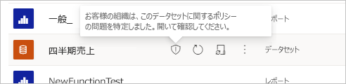
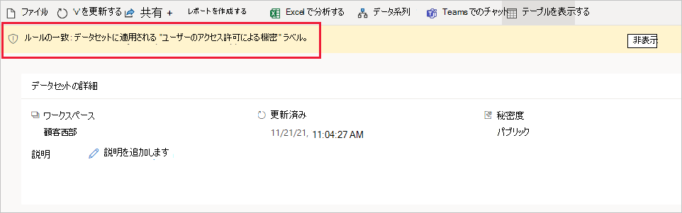

# Power BI (プレビュー) のデータ損失防止ポリシーの使用を開始する

組織が機密データを検出して保護できるように、[Microsoft Purview データ損失防止 (DLP) ポリシー](/microsoft-365/compliance/dlp-learn-about-dlp)は、Power BI をサポートしています。 Power BI データ セットが DLP ポリシーの条件と一致すると、機密コンテンツの性質を説明するアラートをトリガーできます。 このアラートは、管理者による監視と管理のために、Microsoft コンプライアンス ポータルのデータ損失防止の **[アラート]** タブにも登録されます。 さらに、管理者と指定したユーザーに電子メール アラートを送信できます。

## 考慮事項と制限事項

- DLP ポリシーはワークスペースに適用されます。 Premium Gen2 キャパシティでホストされているワークスペースのみがサポートされます。 詳細については、「[Power BI Premium Gen2 とは?](/power-bi/enterprise/service-premium-gen2-what-is)」を参照してください。
- DLP データセット評価ワークロードはキャパシティに影響を与えます。 DLP 評価ワークロードの計量はサポートされていません。
- Premium Gen2 キャパシティでホストされている限り、クラシックなワークスペースと新エクスペリエンスのワークスペースの両方がサポートされます。
- Power BI のカスタム DLP カスタム ポリシーを作成する必要があります。 DLP テンプレートはサポートされていません。
- DLP の場所に適用される DLP ポリシーは、条件として秘密度ラベルと秘密度情報タイプをサポートします。 
- Power BI の DLP ポリシーは、サンプル データセット、[ストリーミング データセット](/power-bi/connect-data/service-real-time-streaming)、または[DirectQuery](/power-bi/connect-data/desktop-use-directquery) または[ライブ接続](/power-bi/connect-data/desktop-directquery-about#live-connections)を介してデータ ソースに接続するデータセットをサポートしていません。
- Power BI の DLP ポリシーは、ソブリン クラウドではサポートされていません。

## ライセンスとアクセス許可

### SKU /サブスクリプションライセンス

Power BI の DLP の使用を開始する前に、[Microsoft 365 サブスクリプション](https://www.microsoft.com/microsoft-365/compare-microsoft-365-enterprise-plans?rtc=1)を確認する必要があります。 完全なライセンシングのガイダンスについては、[セキュリティとコンプライアンスに関する Microsoft 365 ガイダンス](/office365/servicedescriptions/microsoft-365-service-descriptions/microsoft-365-tenantlevel-services-licensing-guidance/microsoft-365-security-compliance-licensing-guidance#information-protection)を参照してください。

### アクセス許可

Power BI の DLP からのデータは、[アクティビティ エクスプローラー](/microsoft-365/compliance/data-classification-activity-explorer)で表示できます。 アクティビティ エクスプローラーにアクセス許可を付与するロールは 4 つあります; データへのアクセスに使用するアカウントは、いずれかのロールのメンバーである必要があります。

- 全体管理者
- コンプライアンス管理者
- セキュリティ管理者
- コンプライアンス データ管理者

## Power BI の DLP ポリシーのしくみ

DLP ポリシーは、コンプライアンス ポータルのデータ損失防止セクションで定義します。 「[データ損失防止ポリシーを設計する](dlp-policy-design.md#design-a-data-loss-prevention-policy)」を参照してください。 ポリシーでは、検出したい秘密度ラベルを指定します。 また、指定した秘密度ラベルが適用されているデータセットが、ポリシーによって検出されたときに発生するアクションも指定します。 DLP ポリシーでは、Power BI について次の 2 つのアクションをサポートします:

- ポリシー ヒントによるユーザー向けの通知。
- 通知。 アラートは、管理者とユーザーに電子メールで送信できます。 さらに、管理者はコンプライアンス センターの **[アラート]** タブでアラートを監視および管理できます。 

データセットが DLP によって評価され、DLP ポリシーの条件と一致すると、ポリシーで定義されているアクションが適用されます。 データセットが評価されるのは、データセットが次の場合です:

- 公開
- Republish
- オンデマンド更新
- 計画更新

>[!NOTE]
> 次のいずれかに該当する場合、データセットの DLP 評価は行われません:
> - イベントのイニシエーターはサービス プリンシパルです。
> - データセットの所有者は、サービス プリンシパルまたは B2B ユーザーです。

### データセットが DLP ポリシーと一致した場合に何が実行されるか

データセットが DLP ポリシーと一致した場合:

- ポリシーにユーザー通知が構成されている場合、DLP ポリシーと一致することを示すシールド アイコンが Power BI サービスにマークされます。

    

    データセットの詳細ページを開いて、ポリシーの一致と検出された機密情報タイプの処理方法を説明するポリシー ヒントを表示します。

    

    >[!NOTE]
    > ポリシー ヒントを非表示にすると、削除されません。 次回、ページにアクセスすると表示されます。

- ポリシーでアラートが有効になっている場合は、コンプライアンス センターの DLP **[アラート]** タブにアラートが記録され、(構成されている場合は) 管理者や指定されたユーザーに電子メールが送信されます。 次の図は、Microsoft Purview コンプライアンス ポータルのデータ損失防止セクションの **[アラート]** タブを示しています。

    ![コンプライアンス センターの [アラート] タブのスクリーンショット。](../media/dlp-power-bi-alerts-tab.png)

## Power BI の DLP ポリシーを構成する

[DLP ポリシーの作成、テスト、チューニング](create-test-tune-dlp-policy.md#create-test-and-tune-a-dlp-policy)の手順に従い、カスタム テンプレートを使用します。

> [!IMPORTANT]
> Power BI の DLP ポリシーの場所を選択する場合は、Power BI の場所のみを選択します。 他の場所は選択しないでください。この構成はサポートされていません。 

<!--1. Log into the [Microsoft Purview compliance portal](https://compliance.microsoft.com).

1. Choose the **Data loss prevention** solution in the navigation pane, select the **Policies** tab, choose **Create policy**.

    

1. Choose the **Custom** category and then the **Custom policy** template.
    
    >[!NOTE]
    >No other categories or templates are currently supported.

    
 
    When done, click **Next**.

1. Name the policy and provide a meaningful description.

    
 
    When done, click **Next**.

1. Enable Power BI as a location for the DLP policy. **Disable all other locations**. Currently, DLP policies for Power BI must specify Power BI as the sole location.

    

    By default the policy will apply to all workspaces. Alternatively, you can specify particular workspaces to include in the policy as well as workspaces to exclude from the policy.
    >[!NOTE]
    > DLP actions are supported only for workspaces hosted in Premium Gen2 capacities.

    If you select **Choose workspaces** or **Exclude workspaces**, a dialog will allow you to create a list of included (or excluded) workspaces. You must specify workspaces by workspace object ID. Click the info icon for information about how to find workspace object IDs.

    
 
    After enabling Power BI as a DLP location for the policy and choosing which workspaces the policy will apply to, click **Next**.

1. The **Define policy settings** page appears. Choose **Create or customize advanced DLP rules** to begin defining your policy.

    
 
    When done, click **Next**.

1. On the **Customize advanced DLP rules** page, you can either start creating a new rule or choose an existing rule to edit. Click **Create rule**.

    

1. The **Create rule** page appears. On the create rule page, provide a name and description for the rule, and then configure the other sections, which are described following the image below.

    
 
### Conditions

In the condition section, you define the conditions under which the policy will apply to a dataset. Conditions are created in groups. Groups make it possible to construct complex conditions.

1. Open the conditions section, choose **Add condition** and then **Content contains**.

    
 
    This opens the first group (named Default – you can change this).

1. Choose **Add**, and then **Sensitivity labels**.
        
    >[!NOTE]
    > Sensitive info types are currently not supported.
    
    
 
    When you choose **Sensitivity labels**, you will be able to choose a particular sensitivity label from a list that will appear.

    You can add additional sensitivity labels to the group. To the right of the group name, you can specify **Any of these** or **All of these**. This determines whether matches on all or any of the labels is required for the condition to hold. Make sure **Any of these** is selected, since datasets can’t have more than one label applied.

    The image below shows a group (Default) that contains two sensitivity label conditions. The logic Any of these means that a match on any one of the sensitivity labels in the group constitutes “true” for that group.

     
 
    You can create more than one group, and you can control the logic between the groups with **AND** or **OR** logic. 

    The image below shows a rule containing two groups, joined by **OR** logic.

     
 
### Exceptions

If the sensitivity label of the dataset matches any of the defined exceptions, the rule won’t be applied to the dataset. 

Exceptions are configured in the same way as conditions, described above.
    

 
### Actions

Protection actions are currently unavailable for Power BI DLP policies.

### User notifications

The user notifications section is where you configure your policy tip. Turn on the toggle, select the **Notify users in Office 365 service with a policy tip** and **Policy tips** checkboxes, and write your policy tip in the text box.

 
### User overrides
 
User overrides are currently unavailable for Power BI DLP policies.

 
 
### Incident reports

Assign a severity level that will be shown in alerts generated from this policy. Enable (default) or disable email notification to admins, specify users or groups for email notification, and configure the details about when notification will occur.

   
### Additional options

 
## Monitor and manage policy alerts

Log into the Microsoft Purview compliance portal and navigate to **Data loss prevention > Alerts**.

Click on an alert to start drilling down to its details and to see management options.
-->
## 次の手順

- [データ損失防止について](/microsoft-365/compliance/dlp-learn-about-dlp)
- [Power BI の秘密度ラベル](/power-bi/enterprise/service-security-sensitivity-label-overview)
- [Power BI の秘密度ラベルの監査スキーマ](/power-bi/enterprise/service-security-sensitivity-label-audit-schema)
