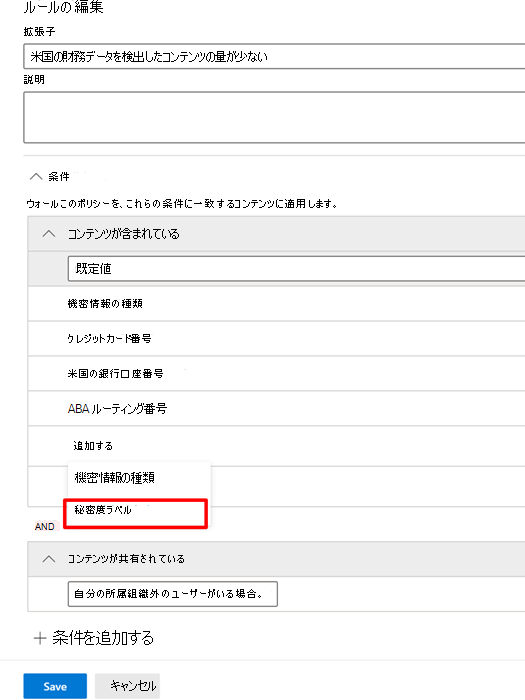

# DLP ポリシーで秘密度ラベルを条件として使用する

次の場所の DLP ポリシーでは、[秘密度ラベル](sensitivity-labels.md)を条件として使用できます。

- Exchange Online メール メッセージ
- SharePoint Online
- OneDrive for Business サイト
- Windows 10 デバイス

秘密度ラベルは、**コンテンツに含まれている** 一覧にオプションとして表示されます。

> [!div class="mx-imgBorder"]
> 

> [!IMPORTANT]
> DLP ポリシーを適用する場所として **Teams チャットとチャネル メッセージ** を選択している場合、条件としての **秘密度ラベル** は使用できません。

## サポートされているアイテム、シナリオ、ポリシー ヒント

秘密度ラベルは、これらのアイテム上やシナリオ内での条件として使用することができます。

### サポートされているアイテム

|サービス  |アイテムの種類  |ポリシー ヒントに利用可能  |強制可能  |
|---------|---------|---------|---------|
|Exchange    |メール メッセージ         |はい         |はい         |
|Exchange    |メールの添付ファイル         |いいえ         |はい *         |
|SharePoint Online     |SharePoint Online 内のアイテム         |はい         |はい         |
|OneDrive for Business     |アイテム         |はい         |はい         |
|Teams     |Teams とチャネル メッセージ         |該当なし         |該当なし         |
|Teams     |attachments         |はい **         |はい **         |
|Windows 10 デバイス     |アイテム         |はい         |はい         |
|MCAS (プレビュー) |アイテム         |はい         |はい         |

\* 秘密度ラベル付き電子メール添付ファイルの DLP 検知機能は、Microsoft Office ファイルタイプのみサポートします。

\** 1:1 チャットまたはチャネルを介して Teams で送信された添付ファイルは、OneDrive for Business や SharePoint に自動的にアップロードされます。 そのため、SharePoint Online や OneDrive for Business が DLP ポリシー内の場所として含まれている場合、Teams で送信されたラベル付きの添付ファイルは自動的にこの条件の範囲に含まれます。 場所としての Teams は、DLP ポリシーで選択する必要はありません。

> [!NOTE]
> SharePoint および OneDrive for Business で秘密度ラベルを検出する DLP の機能は制限されています。 詳細については、「[SharePoint および OneDrive で Office ファイルの秘密度ラベルを有効にする](sensitivity-labels-sharepoint-onedrive-files.md#limitations)」を参照してください。

### サポートされるシナリオ

- DLP 管理者が 1 つ以上の秘密度ラベルを条件として含めることを選択すると、DLP 管理者はテナント内のすべての秘密度ラベルの一覧を表示することができます。

- 秘密度ラベルの条件としての使用は、上記のサポートのマトリックスで示されているように、すべてのワークロードでサポートされています。

- DLP ポリシーのヒントは、秘密度ラベルを条件として含む DLP ポリシーのワークロード (Outlook Win32 を除く) 全体で表示され続けます。

- 秘密度ラベルを条件として持つ DLP ポリシーが一致した場合、秘密度ラベルはインシデント レポート メールの一部としても表示されます。

- 秘密度ラベルの詳細情報は、秘密度ラベルを条件として含む DLP ポリシーの一致の DLP ルール一致監査ログにも表示されます。

### ポリシー ヒントのサポート

|ワークロード  |ポリシー ヒントのサポートあり/サポートなし  |
|---------|---------|
|OWA |    サポート対象     |
|Outlook Win 32    |  サポートなし       |
|SharePoint   |   サポート対象      |
|OneDrive for Business    |    サポート対象     |
|エンドポイント デバイス   |  サポートなし       |
