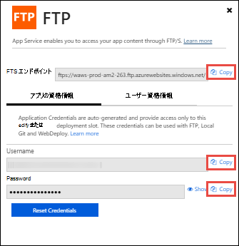

# <a name="double-key-encryption-for-microsoft-365"></a>ユーザーのダブル キー暗号化Microsoft 365

> *適用対象: アプリケーションのダブル キー暗号化Microsoft 365、Microsoft 365 [コンプライアンス](https://www.microsoft.com/microsoft-365/business/compliance-management)[、Azure Information Protection](https://azure.microsoft.com/pricing/details/information-protection)*
>
> *手順: [Azure Information Protection 統合](/azure/information-protection/faqs#whats-the-difference-between-the-azure-information-protection-classic-and-unified-labeling-clients)ラベル付けクライアント for Windows*


> *サービスの説明: [Microsoft 365 コンプライアンス](/office365/servicedescriptions/microsoft-365-service-descriptions/microsoft-365-tenantlevel-services-licensing-guidance/microsoft-365-security-compliance-licensing-guidance)*

ダブル キー暗号化 (DKE) では、2 つのキーを一緒に使用して保護されたコンテンツにアクセスします。 Microsoft では、1 つのキー Microsoft Azure保存し、もう一方のキーを保持します。 ダブル キー暗号化サービスを使用して、キーの 1 つを完全に制御します。 機密性の高いコンテンツには、Azure Information Protection 統合ラベル付けクライアントを使用して保護を適用します。

ダブル キー暗号化は、クラウドとオンプレミスの両方の展開をサポートします。 これらの展開は、保護されたデータを保存する場所を問い合っても、暗号化されたデータが不透明な状態を維持するのに役立ちます。

既定のクラウドベースのテナント ルート キーの詳細については、「Azure Information Protection テナント キーの計画と [実装」を参照してください](/azure/information-protection/plan-implement-tenant-key)。

## <a name="when-your-organization-should-adopt-dke"></a>組織で DKE を採用する必要が生じ

ダブル キー暗号化は、最も厳密な保護要件の対象となる最も機密性の高いデータを対象とします。 DKE は、すべてのデータを対象としているのではありません。 一般に、Double Key Encryption を使用して、全体的なデータの一部のみを保護します。 展開する前に、このソリューションでカバーする適切なデータを特定するためのデューデリジェンスを行う必要があります。 場合によっては、スコープを絞り込み、Microsoft が管理するキーや BYOK を使用する Microsoft Information Protectionなどのほとんどのデータに対して他のソリューションを使用する必要があります。 これらのソリューションは、強化された保護と規制要件の対象とされないドキュメントでは十分です。 また、これらのソリューションを使用すると、DKE で暗号化されたコンテンツでは使用できない最も強力Office 365サービスを使用できます。 例:

- 添付ファイルを表示する必要があるマルウェア対策やスパムなどのトランスポート ルール
- Microsoft Delve
- 電子情報開示
- コンテンツ検索とインデックス作成
- Office機能を含む Web アプリ

MIP SDK を介して DKE と統合されていない外部アプリケーションまたはサービスは、暗号化されたデータに対してアクションを実行できません。

Microsoft Information Protection SDK 1.7+ では、ダブル キー暗号化がサポートされています。SDK と統合するアプリケーションは、十分なアクセス許可と統合を行って、このデータを理由にできます。

組織では、機密データの大部分を保護するために Microsoft Information Protection 機能 (分類とラベル付け) を使用し、ミッション クリティカルなデータにのみ DKE を使用することをお勧めします。 ダブル キー暗号化は、金融サービスやヘルスケアなどの規制の厳しい業界の機密データに関連します。

組織に次の要件がある場合は、DKE を使用してコンテンツをセキュリティで保護できます。

- すべての状況下で *、保護* されたコンテンツを解読できるのは自分だけである必要があります。
- Microsoft が独自に保護されたデータにアクセスする必要はない。
- 地理的境界内にキーを保持する規制要件があります。 データの暗号化と暗号化解除のために保持するキーはすべて、データ センターで保持されます。

## <a name="system-and-licensing-requirements-for-dke"></a>DKE のシステム要件とライセンス要件

**ダブル キー暗号化には、Microsoft 365** がMicrosoft 365 E5。 ライセンスをお持ちMicrosoft 365 E5場合は、試用版にサインアップ[できます](https://aka.ms/M365E5ComplianceTrial)。 これらのライセンスの詳細については、「セキュリティとコンプライアンス[Microsoft 365ライセンス ガイダンス」を&してください](/office365/servicedescriptions/microsoft-365-service-descriptions/microsoft-365-tenantlevel-services-licensing-guidance/microsoft-365-security-compliance-licensing-guidance)。

**Azure Information Protection**. DKE は、感度ラベルで動作し、Azure Information Protection が必要です。

DKE の感度ラベルは、デスクトップ アプリの AIP Unified Labeling クライアントの [Office] ボタンを使用してエンド ユーザーが使用できます。 保護されたドキュメントを保護および使用する各クライアント コンピューターに、これらの前提条件をインストールします。

**Microsoft Office** 2009 以降のアプリ (デスクトップ バージョンの Word、PowerPoint、Excel) Windows。

**Azure Information Protection Unified Labeling クライアント** バージョン 2.7.93.0 以降。 Microsoft ダウンロード センターから Unified Labeling クライアントをダウンロード [してインストールします](https://www.microsoft.com/download/details.aspx?id=53018)。

## <a name="supported-environments-for-storing-and-viewing-dke-protected-content"></a>DKE で保護されたコンテンツを格納および表示するためのサポートされている環境

**サポートされているアプリケーション**。 [](https://www.microsoft.com/microsoft-365/business/microsoft-365-apps-for-enterprise-product) Microsoft 365 Apps for enterprise、Windows、Word、Excel、およびPowerPoint。

**オンライン コンテンツのサポート**。 ダブル キー暗号化で保護されたドキュメントとファイルは、Microsoft の暗号化と管理の両方でオンラインSharePoint OneDrive for Business。 これらの場所にアップロードする前に、サポートされているアプリケーションによって DKE を使用してドキュメントとファイルにラベルを付け、保護する必要があります。 暗号化されたコンテンツは電子メールで共有できますが、暗号化されたドキュメントやファイルをオンラインで表示できません。 代わりに、ローカル コンピューターでサポートされているデスクトップ アプリケーションとクライアントを使用して保護されたコンテンツを表示する必要があります。

## <a name="overview-of-deploying-dke"></a>DKE の展開の概要

次の一般的な手順に従って、DKE を設定します。 これらの手順を完了すると、エンド ユーザーは、機密性の高いデータをダブル キー暗号化で保護できます。

1. この記事の説明に従って、DKE サービスを展開します。

2. 二重キー暗号化を使用してラベルを作成します。 [パスワード] の下の [情報Microsoft 365 コンプライアンス センター] に移動し<a href="https://go.microsoft.com/fwlink/p/?linkid=2077149" target="_blank">、</a>ダブル キー暗号化を使用して新しいラベルを作成します。 「暗号化 [を適用するために感度ラベルを使用してコンテンツへのアクセスを制限する」を参照してください](./encryption-sensitivity-labels.md)。

3. 二重キー暗号化ラベルを使用します。 [データの暗号化] リボンで [二重キー暗号化] ラベルを選択して、データMicrosoft Office。

二重キー暗号化を展開する手順の一部を実行するには、いくつかの方法があります。 この記事では、経験の少ない管理者がサービスを正常に展開できるよう、詳細な手順を説明します。 この方法が快適な場合は、独自のメソッドを使用できます。

## <a name="deploy-dke"></a>DKE の展開

この記事と展開ビデオでは、DKE サービスの展開先として Azure を使用します。 別の場所に展開する場合は、独自の値を指定する必要があります。

この記事 [の概念の](https://youtu.be/vDWfHN_kygg) 概要については、ダブル キー暗号化の展開ビデオをご覧ください。 ビデオの完了には約 18 分かかります。

次の一般的な手順に従って、組織のダブル キー暗号化を設定します。

1. [DKE サービスのソフトウェア前提条件のインストール](#install-software-prerequisites-for-the-dke-service)
1. [リポジトリの二重キー暗号化GitHubする](#clone-the-dke-github-repository)
1. [アプリケーション設定の変更](#modify-application-settings)
1. [テスト キーの生成](#generate-test-keys)
1. [プロジェクトをビルドする](#build-the-project)
1. [DKE サービスを展開し、キー ストアを発行する](#deploy-the-dke-service-and-publish-the-key-store)
1. [展開を検証する](#validate-your-deployment)
1. [キー ストアを登録する](#register-your-key-store)
1. [DKE を使用して感度ラベルを作成する](#create-sensitivity-labels-using-dke)
1. [クライアントで DKE を有効にする](#enable-dke-in-your-client)
1. [保護されたファイルを HYOK ラベルから DKE ラベルに移行する](#migrate-protected-files-from-hyok-labels-to-dke-labels)

完了したら、DKE を使用してドキュメントとファイルを暗号化できます。 詳細については、「ファイルと[電子メールに感度ラベル](https://support.microsoft.com/office/2f96e7cd-d5a4-403b-8bd7-4cc636bae0f9)を適用する」を参照Office。

### <a name="install-software-prerequisites-for-the-dke-service"></a>DKE サービスのソフトウェア前提条件のインストール

DKE サービスをインストールするコンピューターに、これらの前提条件をインストールします。

**.NET Core 3.1 SDK**. ダウンロード [.NET Core 3.1 から SDK をダウンロードしてインストールします](https://dotnet.microsoft.com/download/dotnet-core/3.1)。

**Visual Studio Code**. からVisual Studio Codeダウンロード [https://code.visualstudio.com/](https://code.visualstudio.com) します。 インストールが完了したら、Visual Studio Codeを実行し、[拡張機能の表示 **]** \> **を選択します**。 これらの拡張機能をインストールします。

- C#のVisual Studio Code

- NuGet パッケージ マネージャー

**Git リソース**. 次のいずれかをダウンロードしてインストールします。

- [Git](https://git-scm.com/downloads)

- [GitHub デスクトップ](https://desktop.github.com/)

- [GitHub Enterprise](https://github.com/enterprise)

**OpenSSL** DKE の展開 [後にテスト](https://slproweb.com/products/Win32OpenSSL.html) キーを [生成するには、OpenSSL](#generate-test-keys) がインストールされている必要があります。 環境変数パスから正しく呼び出されていることを確認します。 たとえば、詳細については、「インストール ディレクトリを PATH に追加する」 [https://www.osradar.com/install-openssl-windows/](https://www.osradar.com/install-openssl-windows/) を参照してください。

### <a name="clone-the-dke-github-repository"></a>DKE ファイル リポジトリGitHubする

Microsoft は、DKE ソース ファイルを新しいリポジトリGitHubします。 リポジトリを複製して、組織で使用するためにプロジェクトをローカルにビルドします。 DKE GitHubリポジトリは . [https://github.com/Azure-Samples/DoubleKeyEncryptionService](https://github.com/Azure-Samples/DoubleKeyEncryptionService)

以下の手順は、経験の浅い git またはユーザーのVisual Studio Codeです。

1. ブラウザーで、次のページに移動します [https://github.com/Azure-Samples/DoubleKeyEncryptionService](https://github.com/Azure-Samples/DoubleKeyEncryptionService) 。

2. 画面の右側にある [コード] を **選択します**。 バージョンの UI に [複製] または [ダウンロード **] ボタンが表示される場合** があります。 次に、表示されるドロップダウンで、コピー アイコンを選択して URL をクリップボードにコピーします。

    例:

   > [!div class="mx-imgBorder"]
   > 

3. [コマンド Visual Studio Code] で、[**コマンド パレットの表示]** \> **を選択** し **、[Git: Clone] を選択します**。 リスト内のオプションに移動するには、入力を開始してエントリをフィルター処理し、ドロップダウン `git: clone` から選択します。 例:

   > [!div class="mx-imgBorder"]
   > 

4. テキスト ボックスに、Git からコピーした URL を貼り付け、Git から [複製]**をGitHub。**

5. 表示される **[フォルダーの** 選択] ダイアログで、リポジトリを保存する場所を参照して選択します。 プロンプトで、[開く] を **選択します**。

    リポジトリが左側Visual Studio Code開き、左下に現在の Git ブランチが表示されます。 たとえば、ブランチは main である **必要があります**。 例:

   

6. メイン ブランチにいない場合は、そのブランチを選択する必要があります。 [Visual Studio Code] で、ブランチを選択し、**表示されるブランチ** の一覧から main を選択します。

   > [!IMPORTANT]
   > メイン ブランチを選択すると、プロジェクトをビルドするための適切なファイルが確実に作成されます。 正しいブランチを選択しない場合、展開は失敗します。

これで、DKE ソース リポジトリがローカルにセットアップされます。 次に [、組織のアプリケーション設定](#modify-application-settings) を変更します。

### <a name="modify-application-settings"></a>アプリケーション設定の変更

DKE サービスを展開するには、次の種類のアプリケーション設定を変更する必要があります。

- [キー アクセス設定](#key-access-settings)
- [テナントとキーの設定](#tenant-and-key-settings)

appsettings.json ファイルでアプリケーション設定を変更します。 このファイルは、ローカルで複製した DoubleKeyEncryptionService リポジトリの DoubleKeyEncryptionService\src\customer-key-store にあります。 たとえば、次Visual Studio Codeに示すように、ファイルを参照できます。


#### <a name="key-access-settings"></a>キー アクセス設定

電子メールまたは役割の承認を使用するかどうかを選択します。 DKE では、一度にサポートされる認証方法は 1 つのみです。

- **電子メールの承認**。 組織が電子メール アドレスにのみ基づいてキーへのアクセスを承認できます。

- **役割の承認**。 組織が Active Directory グループに基づいてキーへのアクセスを承認し、Web サービスが LDAP を照会できる必要があります。

##### <a name="to-set-key-access-settings-for-dke-using-email-authorization"></a>電子メール認証を使用して DKE のキー アクセス設定を設定するには

1. **appsettings.json ファイルを開き**、設定を探 `AuthorizedEmailAddress` します。

2. 承認する電子メール アドレスまたはアドレスを追加します。 複数の電子メール アドレスを二重引用符とコンマで区切ります。 例:

   ```json
   "AuthorizedEmailAddress": ["email1@company.com", "email2@company.com ", "email3@company.com"]
   ```

3. 設定を見 `LDAPPath` つけて、二重引用符の `If you use role authorization (AuthorizedRoles) then this is the LDAP path.` 間のテキストを削除します。 二重引用符はそのままにしてください。 完了したら、この設定は次のように表示されます。

   ```json
   "LDAPPath": ""
   ```

4. 設定を見 `AuthorizedRoles` つけて、行全体を削除します。

この画像は、 **電子メールの承認用に正しく書式設定された appsettings.json** ファイルを示しています。

   

##### <a name="to-set-key-access-settings-for-dke-using-role-authorization"></a>役割の承認を使用して DKE のキー アクセス設定を設定するには

1. **appsettings.json ファイルを開き**、設定を探 `AuthorizedRoles` します。

2. 承認する Active Directory グループ名を追加します。 複数のグループ名を二重引用符とコンマで区切ります。 例:

   ```json
   "AuthorizedRoles": ["group1", "group2", "group3"]
   ```

3. 設定を見 `LDAPPath` つけて、Active Directory ドメインを追加します。 例:

   ```json
   "LDAPPath": "contoso.com"
   ```

4. 設定を見 `AuthorizedEmailAddress` つけて、行全体を削除します。

この画像は、 **役割の承認のために正しく書式設定された appsettings.json** ファイルを示しています。

   

#### <a name="tenant-and-key-settings"></a>テナントとキーの設定

DKE テナントとキー設定は **appsettings.json ファイルに格納** されます。

##### <a name="to-configure-tenant-and-key-settings-for-dke"></a>DKE のテナントとキーの設定を構成するには

1. **appsettings.json ファイルを開** きます。

2. 設定を見 `ValidIssuers` つけて、テナント `<tenantid>` ID に置き換える。 テナント ID を見つけるには、Azure portal にアクセスしてテナントのプロパティを [表示します](https://aad.portal.azure.com/#blade/Microsoft_AAD_IAM/ActiveDirectoryMenuBlade/Properties)。 例:

   ```json
   "ValidIssuers": [
     "https://sts.windows.net/9c99431e-b513-44be-a7d9-e7b500002d4b/"
   ]
   ```

> [!NOTE]
> キー ストアへの外部 B2B アクセスを有効にする場合は、有効な発行者のリストの一部としてこれらの外部テナントも含める必要があります。

を探します `JwtAudience` 。 `<yourhostname>`DKE サービスが実行されるコンピューターのホスト名に置き換える。 例:

  > [!IMPORTANT]
  > の値は `JwtAudience` 、ホストの名前と完全に一致 *する必要があります*。 デバッグ中に **localhost:5001 を** 使用できます。 ただし、デバッグが完了したら、この値をサーバーのホスト名に更新してください。

- `TestKeys:Name`. キーの名前を入力します。 例: `TestKey1`
- `TestKeys:Id`. GUID を作成し、値として入力 `TestKeys:ID` します。 たとえば、`DCE1CC21-FF9B-4424-8FF4-9914BD19A1BE` などです。 オンライン GUID ジェネレーターのようなサイト [を使用して、GUID](https://guidgenerator.com/) をランダムに生成できます。

この画像は **、appsettings.json** のテナントとキーの設定に対する正しい形式を示しています。 `LDAPPath` は、役割の承認用に構成されます。


### <a name="generate-test-keys"></a>テスト キーの生成

アプリケーション設定を定義したら、公開キーとプライベート テスト キーを生成する準備が整いました。

キーを生成するには、次の操作を行います。

1. 次のWindows スタート メニュー、OpenSSL コマンド プロンプトを実行します。

2. テスト キーを保存するフォルダーに変更します。 このタスクの手順を完了して作成するファイルは、同じフォルダーに格納されます。

3. 新しいテスト キーを生成します。

   ```console
   openssl req -x509 -newkey rsa:2048 -keyout key.pem -out cert.pem -days 365
   ```

4. プライベート キーを生成します。

   OpenSSL バージョン 3 以降をインストールした場合は、次のコマンドを実行します。
  
  ```console
  openssl rsa -in key.pem -out privkeynopass.pem -outform PEM -traditional
  ```
  
>  それ以外の場合は、次のコマンドを実行します。
>  ```console
>  openssl rsa -in key.pem -out privkeynopass.pem -outform PEM
>  ```

5. 公開キーを生成します。

   ```console
   openssl rsa -in key.pem -pubout > pubkeyonly.pem
   ```

6. テキスト エディターで **、pubkeyonly.pem を開きます**。 **pubkeyonly.pem** ファイル内のすべてのコンテンツを、最初の行と最後の行を除いて `PublicPem` **、appsettings.json** ファイルのセクションにコピーします。

7. テキスト エディターで **、privkeynopass.pem を開きます**。 最初の行と最後の行を除く **、privkeynopass.pem** ファイル内のすべてのコンテンツを `PrivatePem` **appsettings.json** ファイルのセクションにコピーします。

8. セクションとセクションの両方のすべての空白と改行を `PublicPem` `PrivatePem` 削除します。

    > [!IMPORTANT]
    > このコンテンツをコピーする場合は、PEM データを削除しない。

9. **[Visual Studio Code、Startup.cs ファイルを参照** します。 このファイルは、DoubleKeyEncryptionService\src\customer-key-store\の下でローカルに複製した DoubleKeyEncryptionService リポジトリにあります。

10. 次の行を探します。

    ```csharp
        #if USE_TEST_KEYS
        #error !!!!!!!!!!!!!!!!!!!!!! Use of test keys is only supported for testing,
        DO NOT USE FOR PRODUCTION !!!!!!!!!!!!!!!!!!!!!!!!!!!!!
        services.AddSingleton<ippw.IKeyStore, ippw.TestKeyStore>();
        #endif
    ```

11. これらの行を次のテキストに置き換える。

    ```csharp
    services.AddSingleton<ippw.IKeyStore, ippw.TestKeyStore>();
    ```

    最後の結果は、次のようになります。

    

これで、DKE プロジェクト [をビルドする準備ができました](#build-the-project)。

### <a name="build-the-project"></a>プロジェクトをビルドする

DKE プロジェクトをローカルでビルドするには、次の手順を使用します。

1. [Visual Studio Code DKE サービス リポジトリで、[コマンド パレットの表示] を選択し、プロンプトに「 \> **ビルド」** と入力します。

2. 一覧から、[タスク: ビルド **タスクの実行] を選択します**。

   ビルド タスクが見つからない場合は、[ビルド タスクの構成] を **選択し、** 次のように .NET コア用に作成します。

   

   1. [テンプレート **から tasks.json を作成する] を選択します**。

      

   2. テンプレートの種類の一覧から **、[.NET Core] を選択します**。

      

   3. ビルド セクションで **、customerkeystore.csproj ファイルへのパスを見** つけます。 表示されていない場合は、次の行を追加します。

      ```json
      "${workspaceFolder}/src/customer-key-store/customerkeystore.csproj",
      ```

   4. ビルドを再度実行します。

3. 出力ウィンドウに赤いエラーが表示されません。

   赤色のエラーがある場合は、コンソール出力を確認します。 前のすべての手順が正しく完了し、正しいビルド バージョンが存在していることを確認します。

4. [ **デバッグ** \> **の開始] を選択** して、プロセスをデバッグします。 環境の選択を求めるメッセージが表示されたら **、[.NET core] を選択します**。

   .NET コア デバッガーは通常、 に起動します `https://localhost:5001` 。 テスト キーを表示するには、スラッシュ (/) とキーの `https://localhost:5001` 名前に移動して追加します。 例:

   ```https
   https://localhost:5001/TestKey1
   ```

   キーは JSON 形式で表示されます。

これでセットアップは完了です。 キーストアを発行する前に、appsettings.json で JwtAudience 設定の場合は、ホスト名の値が App Service ホスト名と完全に一致するようにします。 ビルドのトラブルシューティングを行う際に localhost に変更した可能性があります。

### <a name="deploy-the-dke-service-and-publish-the-key-store"></a>DKE サービスを展開し、キー ストアを発行する

実稼働環境の場合は、サード パーティのクラウドにサービスを展開するか、オンプレミス [システムに発行します](/aspnet/core/tutorials/publish-to-iis?preserve-view=true&tabs=netcore-cli&view=aspnetcore-3.1)。

他の方法でキーを展開することもできます。 組織に最適な方法を選択します。

パイロット展開の場合は、Azure に展開して、すぐ開始できます。

#### <a name="to-create-an-azure-web-app-instance-to-host-your-dke-deployment"></a>DKE 展開をホストする Azure Web App インスタンスを作成するには

キー ストアを発行するには、DKE 展開をホストする Azure App Service インスタンスを作成します。 次に、生成されたキーを Azure に発行します。

1. ブラウザーで、ポータルの Microsoft Azure [サインインし](https://ms.portal.azure.com)、[App Services の追加 **] に移動**  >  **します**。

2. サブスクリプションとリソース グループを選択し、インスタンスの詳細を定義します。

   - DKE サービスをインストールするコンピューターのホスト名を入力します。 [**appsettings.json**](#tenant-and-key-settings)ファイルの JwtAudience 設定に対して定義されている名前と同じ名前にしてください。 名前に指定する値も WebAppInstanceName です。

   - [ **発行]** で、 **コードを選択** し、[ **ランタイム スタック] で** **[.NET Core 3.1] を選択します**。

   例:

   > [!div class="mx-imgBorder"]
   > 

3. ページの下部で、[レビューと作成] を **選択** し、[追加] を **選択します**。

4. 生成されたキーを発行するには、次のいずれかを実行します。

   - [ZipDeployUI 経由で発行する](#publish-via-zipdeployui)
   - [FTP 経由で発行する](#publish-via-ftp)
   - [2019 以降Visual Studio発行する](/aspnet/core/tutorials/)

#### <a name="publish-via-zipdeployui"></a>ZipDeployUI 経由で発行する

1. `https://<WebAppInstanceName>.scm.azurewebsites.net/ZipDeployUI`に移動します。

   例: https://dkeservice.scm.azurewebsites.net/ZipDeployUI

2. キー ストアのコードベースで **、customer-key-store\src\customer-key-store** フォルダーに移動し、このフォルダーに **customerkeystore.csproj** ファイルが含まれているか確認します。

3. 実行: **dotnet 発行**

   出力ウィンドウには、発行が展開されたディレクトリが表示されます。

   例: `customer-key-store\src\customer-key-store\bin\Debug\netcoreapp3.1\publish\`

4. 発行ディレクトリ内のすべてのファイルを別のファイルに.zipします。 .zip ファイルを作成する場合は、ディレクトリ内のすべてのファイルがディレクトリ ファイルのルート レベル.zipしてください。

5. 作成したファイルを.zip上で開いた ZipDeployUI サイトにドラッグ アンド ドロップします。 例: https://dkeservice.scm.azurewebsites.net/ZipDeployUI

DKE が展開され、作成したテスト キーを参照できます。 [次の展開 [の検証] に進](#validate-your-deployment) んでください。

#### <a name="publish-via-ftp"></a>FTP 経由で発行する

1. Connect作成した App Service にアクセス[します](#deploy-the-dke-service-and-publish-the-key-store)。

   ブラウザーで **、「Azure portal** App Service Deployment Center Manual  >  **Deployment** FTP  >    >  **Dashboard」**  >  **に移動**  >  **します**。

2. 表示された接続文字列をローカル ファイルにコピーします。 これらの文字列を使用して Web App Service に接続し、FTP 経由でファイルをアップロードします。

   例:

   

3. キー ストレージのコードベースで **、customer-key-store\src\customer-key-store ディレクトリに移動します**。

4. このディレクトリに **customerkeystore.csproj ファイルが含まれているか確認** します。

5. 実行: **dotnet 発行**

   出力には、発行が展開されたディレクトリが含まれます。

   例: `customer-key-store\src\customer-key-store\bin\Debug\netcoreapp3.1\publish\`

6. 発行ディレクトリ内のすべてのファイルを zip ファイルに送信します。 .zip ファイルを作成する場合は、ディレクトリ内のすべてのファイルがディレクトリ ファイルのルート レベル.zipしてください。

7. FTP クライアントから、コピーした接続情報を使用して App Service に接続します。 アップロード前.zip作成したファイルを Web アプリのルート ディレクトリに移動します。

DKE が展開され、作成したテスト キーを参照できます。 次に、 [展開を検証します](#validate-your-deployment)。

### <a name="validate-your-deployment"></a>展開を検証する

上記のいずれかの方法を使用して DKE を展開した後、展開とキー ストアの設定を検証します。

次のコマンドを実行します。

```powershell
src\customer-key-store\scripts\key_store_tester.ps1 dkeserviceurl/mykey
```

次に例を示します。

```powershell
key_store_tester.ps1 https://mydkeservice.com/mykey
```

出力にエラーが表示されないか確認します。 準備ができたら、キー [ストアを登録します](#register-your-key-store)。

キー名では大文字と小文字が区別されます。 appsettings.json ファイルに表示されるキー名を入力します。

## <a name="register-your-key-store"></a>キー ストアを登録する

次の手順を実行すると、DKE サービスを登録できます。 DKE サービスの登録は、ラベルの作成を開始する前に DKE を展開する最後の手順です。

DKE サービスを登録するには、次の方法を実行します。

1. ブラウザーで、ポータルを開 [Microsoft Azure、[](https://ms.portal.azure.com/)すべてのサービス **ID** アプリの登録] \>  \> **に移動します**。

2. [ **新規登録] を** 選択し、わかりやすい名前を入力します。

3. 表示されるオプションからアカウントの種類を選択します。

   カスタム 以外のドメイン **(onmicrosoft.com** など) で Microsoft Azure を使用している場合は、[この組織ディレクトリ内のアカウントのみ] を選択します **(Microsoft のみ - シングル テナント)。**

   例:

   > [!div class="mx-imgBorder"]
   > 

4. ページの下部にある [登録] **を選択** して、新しいアプリ登録を作成します。

5. 新しいアプリ登録で、左側のウィンドウの [管理] で **、[認証**] を **選択します**。

6. [プラットフォーム **の追加] を選択します**。

7. [プラットフォームの **構成] ポップアップで****、[Web] を選択します**。

8. [ **リダイレクト URI] で**、ダブル キー暗号化サービスの URI を入力します。 ホスト名とドメインの両方を含む App Service URL を入力します。

   例: https://mydkeservicetest.com

   - 入力する URL は、DKE サービスが展開されているホスト名と一致している必要があります。
   - ローカルでテストする場合は、Visual Studioを使用します **https://localhost:5001** 。
   - すべての場合、スキームは https である **必要があります**。

   ホスト名が App Service のホスト名と完全に一致する必要があります。 ビルドのトラブルシューティングに変更 `localhost` した可能性があります。 **appsettings.json では**、この値はユーザーが設定したホスト名です `JwtAudience` 。

9. [**暗黙的な付与] で****、[ID トークン] チェック ボックスを** オンにします。

10. **[保存]** を選び、変更内容を保存します。

11. 左側のウィンドウで、[API の公開] **を選択** し、[アプリケーション ID URI] の横にある [設定] を **選択します**。

12. [API の **公開] ページの [この API** で定義されたスコープ] 領域で、[スコープの追加]**を選択します**。 新しいスコープでは、次の値を使用します。

    1. スコープ名を次のように **定義user_impersonation。**

    2. 同意できる管理者とユーザーを選択します。

    3. 必要な残りの値を定義します。

    4. **[スコープの追加]** を選択します。

    5. 上部の **[保存** ] を選択して変更を保存します。

13. [API の **公開] ページの**  [承認済みクライアント アプリケーション] 領域で、[クライアント アプリケーションの追加]**を選択します**。

    新しいクライアント アプリケーションで次の方法を実行します。

    1. クライアント ID を次のように定義します `d3590ed6-52b3-4102-aeff-aad2292ab01c` 。 この値はクライアント ID Microsoft Officeであり、キー Officeアクセス トークンを取得できます。

    2. [ **承認済みスコープ] で**、有効範囲 **user_impersonation** します。

    3. **[アプリケーションの追加]** を選択します。

    4. 上部の **[保存** ] を選択して変更を保存します。

    5. これらの手順を繰り返しますが、今回は、クライアント ID をとして定義します `c00e9d32-3c8d-4a7d-832b-029040e7db99` 。 この値は、Azure Information Protection 統合ラベル付けクライアント ID です。

これで、DKE サービスが登録されます。 [DKE を使用してラベルを作成して続行します](#create-sensitivity-labels-using-dke)。

## <a name="create-sensitivity-labels-using-dke"></a>DKE を使用して感度ラベルを作成する

このページMicrosoft 365 コンプライアンス センター新しい感度ラベルを作成し、それ以外の場合と同じように暗号化を適用します。 [ **ダブル キー暗号化を使用する]** を選択し、キーのエンドポイント URL を入力します。 指定したキー名は、URL の appsettings.json ファイルの "TestKeys" セクションに含める必要があります。 

例: https://testingdke1.azurewebsites.net/ **KEYNAME**


> [!div class="mx-imgBorder"]
> ![[キーの二重暗号化を使用する] を選択Microsoft 365 コンプライアンス センター。](../media/dke-use-dke.png)

追加した DKE ラベルは、最新バージョンのユーザーに対して表示Microsoft 365 Apps for enterprise。

> [!NOTE]
> クライアントが新しいラベルで更新するには、最大 24 時間かかる場合があります。

### <a name="enable-dke-in-your-client"></a>クライアントで DKE を有効にする

Insider のユーザー Office DKE が有効になります。 それ以外の場合は、次のレジストリ キーを追加して、クライアントの DKE を有効にします。

```console
   [HKEY_LOCAL_MACHINE\SOFTWARE\WOW6432Node\Microsoft\MSIPC\flighting]
   "DoubleKeyProtection"=dword:00000001

   [HKEY_LOCAL_MACHINE\SOFTWARE\Microsoft\MSIPC\flighting]
   "DoubleKeyProtection"=dword:00000001
```

## <a name="migrate-protected-files-from-hyok-labels-to-dke-labels"></a>保護されたファイルを HYOK ラベルから DKE ラベルに移行する

必要な場合は、DKE の設定が完了したら、HYOK ラベルを使用して保護したコンテンツを DKE ラベルに移行できます。 移行するには、AIP スキャナーを使用します。 スキャナーの使用を開始するには、「Azure Information Protection 統合ラベル スキャナーとは」 [を参照してください](/azure/information-protection/deploy-aip-scanner)。

コンテンツを移行しない場合、HYOK で保護されたコンテンツは影響を受けません。

## <a name="other-deployment-options"></a>その他の展開オプション

規制の厳しい業界のお客様の中には、ソフトウェア ベースのキーを使用したこの標準リファレンス実装では、コンプライアンスの強化された義務とニーズを満たすには十分ではない可能性があります。
さまざまなサード パーティハードウェア セキュリティ モジュール (HSM) ベンダーと提携し、DKE サービスに次の拡張キー管理オプションのサポートを提供しています。

 - [Entrust](https://www.entrust.com/digital-security/hsm/services/packaged-services/double-key-encryption-integration#:~:text=Entrust%20Double%20Key%20Encryption%20for%20Microsoft%20AIP%2C%20offered,trust%20for%20the%20protection%20of%20sensitive%20cryptographic%20keys.) 

- [Thales](https://cpl.thalesgroup.com/cloud-security/encryption/double-key-encryption) 

これらのベンダーに直接問い合って、市場内の DKE HSM ソリューションに関する詳細とガイダンスを入手してください。 

