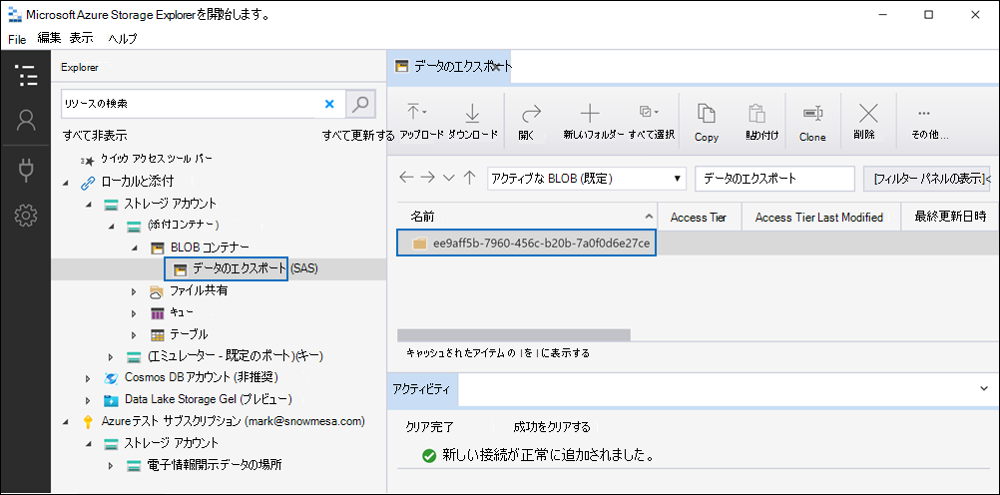

# レビュー セット内のドキュメントをAzure Storage アカウントにエクスポートする

[!include[Purview banner](../includes/purview-rebrand-banner.md)]

電子情報開示 (プレミアム) ケースのレビュー セットからドキュメントをエクスポートする場合は、組織で管理されているAzure Storage アカウントにエクスポートできます。 このオプションを使用すると、ドキュメントはAzure Storageの場所にアップロードされます。 エクスポート後は、Azure Storage Explorerを使用してドキュメントにアクセス (およびローカル コンピューターまたはその他の場所にダウンロード) できます。 この記事では、ドキュメントをAzure Storage アカウントにエクスポートする方法と、Azure Storage Explorerを使用してAzure Storageの場所に接続してエクスポートされたドキュメントをダウンロードする方法について説明します。 Azure Storage Explorerの詳細については、「[Azure Storage Explorerを使用する](/azure/storage/blobs/storage-quickstart-blobs-storage-explorer)」を参照してください。

## レビュー セットからドキュメントをエクスポートする前に

- Azure Storage アカウントの共有アクセス署名 (SAS) トークンと、レビュー セットからドキュメントをエクスポートするには、ストレージ アカウント内の特定のコンテナーの URL を指定する必要があります。 手順 2. を実行する場合は、必ずこれらを手元に (テキスト ファイルにコピーするなど) してください。

  - **SAS トークン**: SAS トークンはAzure Storage アカウント用です (コンテナーの場合は取得しないでください)。 アカウントの SAS トークンは、Azure Storageで生成できます。 これを行うには、Azure Storage アカウントに移動し、[ストレージ アカウント] ブレードの **[設定** 設定] で [**アクセス署名の共有**] を選択します。 既定の設定を使用し、SAS トークンを生成するときにすべてのリソースの種類を許可します。

  - **コンテナー URL**: レビュー セットドキュメントをアップロードするコンテナーを作成し、コンテナーの URL のコピーを取得する必要があります。たとえば、. `https://ediscoverydata.blob.core.windows.net/exportdata` URL を取得するには、Azure Storageのコンテナーに移動し、コンテナー ブレードの **[設定**] セクションで **[プロパティ**] を選択します。

- Azure Storage Explorerをダウンロードしてインストールします。 手順については、[Azure Storage Explorer ツール](https://go.microsoft.com/fwlink/p/?LinkId=544842)を参照してください。 このツールを使用して、Azure Storage アカウントのコンテナーに接続し、手順 1. でエクスポートしたドキュメントをダウンロードします。

## 手順 1: レビュー セットからドキュメントをエクスポートする

最初の手順では、レビュー セットからドキュメントをエクスポートするエクスポート ジョブを作成します。 すべてのエクスポート オプションの詳細な手順については、「 [レビュー セットからドキュメントをエクスポートする](export-documents-from-review-set.md)」を参照してください。 次の手順では、組織のAzure Storage アカウントにドキュメントをエクスポートする設定を強調表示します。

1. Microsoft Purview コンプライアンス ポータルで、電子情報開示 (プレミアム) ケースを開き、[**校閲セット**] タブを選択し、エクスポートするレビュー セットを選択します。

2. レビュー セットで、**ActionExport** >  をクリックします。

3. **[エクスポート オプション**] ポップアップ ページで、エクスポートの名前 (必須) と説明 (省略可能) を入力します。

4. ドキュメント、メタデータ、コンテンツ、オプションの各セクションで設定を構成します。 これらの設定の詳細については、「 [レビュー セットからドキュメントをエクスポートする](export-documents-from-review-set.md)」を参照してください。

5. [**出力オプション**] セクションで、[**Azure Storage アカウントにエクスポートされた圧縮ディレクトリ構造**] オプションを選択します。

6. ストレージ アカウントのコンテナー URL と SAS トークンを対応するフィールドに貼り付けます。

   

7. **[エクスポート]** をクリックしてエクスポート ジョブを作成します。

## 手順 2: エクスポート ジョブから SAS URL を取得する

次の手順では、手順 1 でエクスポート ジョブを作成した後に生成される SAS URL を取得します。 SAS URL を使用して、レビュー セット ドキュメントをエクスポートしたAzure Storage アカウント内のコンテナーに接続します。

1. **電子情報開示 (プレミアム)** ページでケースに移動し、[**エクスポート**] タブをクリックします。

2. [**エクスポート**]タブで、ダウンロードするエクスポートジョブをクリックします。 これは、手順 1 で作成したエクスポート ジョブです。

3. ポップアップ ページの [ **場所]** で、表示されている SAS URL をコピーします。 必要に応じて、テキスト ファイルに保存して、手順 3. でテキスト ファイルにアクセスできます。

   ![[場所] に表示される SAS URL をコピーします。](../media/eDiscoExportJob.png)

   > [!TIP]
   > エクスポート ジョブに表示される SAS URL は、Azure Storage アカウントのコンテナー URL と SAS トークンを連結したものです。 エクスポート ジョブからコピーすることも、URL と SAS トークンを組み合わせて自分で作成することもできます。

## 手順 3: Azure Storage コンテナーにConnectする

最後の手順では、Azure Storage Explorerと SAS URL を使用して、Azure Storage アカウント内のコンテナーに接続し、エクスポートされたドキュメントをローカル コンピューターにダウンロードします。

1. ダウンロードしてインストールしたAzure Storage Explorerを開始します。

2. [**Connectダイアログを開く]** アイコンをクリックします。

   ![[アカウントの追加] アイコンをクリックします。](../media/AzureStorageConnect.png)

3. **[Azure StorageへのConnect**] ページで、[**Blob コンテナー**] をクリックします。

4. [ **認証方法の選択]** ページで、[ **共有アクセス署名 (SAS)]** オプションを選択し、[ **次へ**] をクリックします。

5. **[接続情報の入力**] ページで、(手順 2 のエクスポート ジョブで取得した) SAS URL を **[Blob Container SAS URL**] ボックスに貼り付けます。

    ![[URI] ボックスに SAS URL を貼り付けます。](../media/AzureStorageConnect3.png)

    コンテナー名が [表示名] ボックスに **表示** されていることに注意してください。 この名前は編集できます。

6. [**次へ**] をクリックして **概要** ページを表示し、[**Connect**] をクリックします。

    **Blob コンテナー** ノード (**[Storage アカウント** > **(添付コンテナー)]** \> が開きます。

    

    このコンテナーには、手順 5 の表示名が付いた名前のコンテナーが含まれています。 このコンテナーには、Azure Storage アカウント内のコンテナーにダウンロードしたエクスポート ジョブごとにフォルダーが含まれています。 これらのフォルダーには、エクスポート ジョブの ID に対応する ID で名前が付けられます。 これらのエクスポート ID (およびエクスポートの名前) は、電子情報開示 (プレミアム) ケースの [**ジョブ**] タブにある **エクスポート ジョブの準備データ** のポップアップ ページの **[サポート情報**] で確認できます。

7. エクスポート ジョブ フォルダーをダブルクリックして開きます。

   フォルダーとエクスポート レポートの一覧が表示されます。

    

8. エクスポート ジョブからすべての内容をエクスポートするには、[ **上へ** ] 矢印をクリックしてエクスポート ジョブ フォルダーに戻り、[ **ダウンロード**] をクリックします。

9. エクスポートしたファイルをダウンロードする場所を指定して、[フォルダを選択]をクリックします。

    Azure Storage Explorerがダウンロード プロセスを開始します。 エクスポートされたアイテムのダウンロードの状態が 、[ **アクティビティ** ] ウィンドウに表示されます。 ダウンロードが完了すると、メッセージが表示されます。

> [!NOTE]
> Azure Storage Explorerでエクスポート ジョブ全体をダウンロードする代わりに、特定のアイテムを選択してダウンロードして表示できます。

## 詳細

- エクスポート ジョブ フォルダーには、次の項目が含まれています。 エクスポート フォルダー内の実際の項目は、エクスポート ジョブの作成時に構成されたエクスポート オプションによって決まります。 これらのオプションの詳細については、「 [レビュー セットからドキュメントをエクスポートする](export-documents-from-review-set.md)」を参照してください。

  - Export_load_file.csv: この CSV ファイルは、エクスポートされた各ドキュメントに関する情報を含む詳細エクスポート レポートです。 ファイルは、ドキュメントの各メタデータ プロパティの列で構成されます。 このレポートに含まれるメタデータの一覧と説明については、「[電子情報開示のドキュメント メタデータ フィールド (プレミアム)](document-metadata-fields-in-advanced-ediscovery.md)」の表のエクスポート **されたフィールド名** 列を参照してください。

  - Summary.txt: エクスポートの統計情報を含むエクスポートの概要を含むテキスト ファイル。

  - Extracted_text_files: このフォルダーには、エクスポートされた各ドキュメントのテキスト ファイル バージョンが含まれています。

  - NativeFiles: このフォルダーには、エクスポートされた各ドキュメントのネイティブ ファイル バージョンが含まれています。

  - Error_files: エクスポート ジョブにエラー ファイルが含まれている場合、このフォルダーには次の項目が含まれます。

    - ExtractionError.csv: この CSV ファイルには、親アイテムから適切に抽出されなかったファイルで使用できるメタデータが含まれています。

    - ProcessingError: このフォルダーには、処理エラーのあるドキュメントが含まれています。 このコンテンツはアイテム レベルです。つまり、添付ファイルに処理エラーが発生した場合、添付ファイルを含むドキュメントもこのフォルダーに含まれます。
