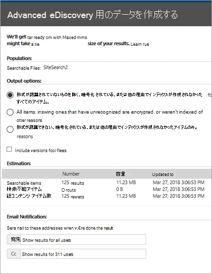
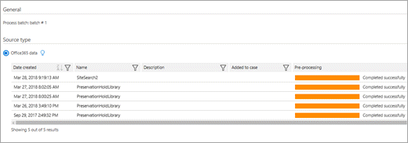

# <a name="manage-ediscovery-cases-in-the-security--compliance-center"></a><span data-ttu-id="67813-105">セキュリティ センターとコンプライアンス センターの電子情報開示のケースを管理する</span><span class="sxs-lookup"><span data-stu-id="67813-105">Manage eDiscovery cases in the Security & Compliance Center</span></span>

<span data-ttu-id="67813-p102">Office 365 および Microsoft 365 のコンプライアンスセンターで電子情報開示ケースを使用して、組織内で電子情報開示ケースを作成、アクセス、および管理できるユーザーを制御することができます。組織に Office 365 E5 サブスクリプションがある場合は、Office 365 Advanced eDiscovery を使用して、電子情報開示ケースを使用して検索結果を分析することもできます。</span><span class="sxs-lookup"><span data-stu-id="67813-p102">You can use eDiscovery cases in the compliance center in Office 365 and Microsoft 365 to control who can create, access, and manage eDiscovery cases in your organization. If your organization has an Office 365 E5 subscription, you can also use eDiscovery cases to analyze search results by using Office 365 Advanced eDiscovery.</span></span>
  
<span data-ttu-id="67813-p103">電子情報開示ケースを使用すると、ケースへのメンバーの追加、特定のケース メンバーが実行可能なアクションの種類の制御、訴訟事件に関連のあるコンテンツの場所の保留、複数のコンテンツ検索と 1 つのケースの関連付けを実行できます。また、ケースに関連付けられたコンテンツ検索の結果をエクスポートしたり、Advanced eDiscovery で分析できるように検索結果を準備したりできます。電子情報開示ケースは、組織内の特定の訴訟事件に関するコンテンツ検索と検索結果にアクセスできるユーザーを制限するのに適切な方法です。</span><span class="sxs-lookup"><span data-stu-id="67813-p103">An eDiscovery case allows you to add members to a case, control what types of actions that specific case members can perform, place a hold on content locations relevant to a legal case, and associate multiple Content Searches with a single case. You can also export the results of any Content Search that is associated with a case or prepare search results for analysis in Advanced eDiscovery. eDiscovery cases are a good way to limit who has access to Content Searches and search results for a specific legal case in your organization.</span></span>
  
<span data-ttu-id="67813-111">次のワークフローを使用して、セキュリティ & コンプライアンスセンターと高度な電子情報開示に電子情報開示ケースを設定および使用します。</span><span class="sxs-lookup"><span data-stu-id="67813-111">Use the following workflow to set-up and use eDiscovery cases in the Security & Compliance Center and Advanced eDiscovery.</span></span>

[<span data-ttu-id="67813-112">手順 1: 潜在的なケースのメンバーに電子情報開示のアクセス許可を割り当てる</span><span class="sxs-lookup"><span data-stu-id="67813-112">Step 1: Assign eDiscovery permissions to potential case members</span></span>](#step-1-assign-ediscovery-permissions-to-potential-case-members)

[<span data-ttu-id="67813-113">手順 2: 新しいケースを作成する</span><span class="sxs-lookup"><span data-stu-id="67813-113">Step 2: Create a new case</span></span>](#step-2-create-a-new-case)

[<span data-ttu-id="67813-114">手順 3: ケースにメンバーを追加する</span><span class="sxs-lookup"><span data-stu-id="67813-114">Step 3: Add members to a case</span></span>](#step-3-add-members-to-a-case)

[<span data-ttu-id="67813-115">手順 4: コンテンツの場所を保留にする</span><span class="sxs-lookup"><span data-stu-id="67813-115">Step 4: Place content locations on hold</span></span>](#step-4-place-content-locations-on-hold)

[<span data-ttu-id="67813-116">手順 5: ケースに関連付けられているコンテンツ検索を作成して実行する</span><span class="sxs-lookup"><span data-stu-id="67813-116">Step 5: Create and run a Content Search associated with a case</span></span>](#step-5-create-and-run-a-content-search-associated-with-a-case)

[<span data-ttu-id="67813-117">手順 6: ケースに関連付けられているコンテンツ検索の結果をエクスポートする</span><span class="sxs-lookup"><span data-stu-id="67813-117">Step 6: Export the results of a Content Search associated with a case</span></span>](#step-6-export-the-results-of-a-content-search-associated-with-a-case)

[<span data-ttu-id="67813-118">手順 7: Advanced eDiscovery 用に検索結果を準備する</span><span class="sxs-lookup"><span data-stu-id="67813-118">Step 7: Prepare search results for Advanced eDiscovery</span></span>](#step-7-prepare-search-results-for-advanced-ediscovery)

[<span data-ttu-id="67813-119">手順 8: Advanced eDiscovery のケースに移動する</span><span class="sxs-lookup"><span data-stu-id="67813-119">Step 8: Go to the case in Advanced eDiscovery</span></span>](#step-8-go-to-the-case-in-advanced-ediscovery)

[<span data-ttu-id="67813-120">(省略可能) 手順 9: ケースを閉じる</span><span class="sxs-lookup"><span data-stu-id="67813-120">(Optional) Step 9: Close a case</span></span>](#optional-step-9-close-a-case)

[<span data-ttu-id="67813-121">(省略可能) 手順 10: 閉じたケースを再度開く</span><span class="sxs-lookup"><span data-stu-id="67813-121">(Optional) Step 10: Re-open a closed case</span></span>](#optional-step-10-re-open-a-closed-case)

[<span data-ttu-id="67813-122">詳細情報</span><span class="sxs-lookup"><span data-stu-id="67813-122">More information</span></span>](#more-information)
  
## <a name="step-1-assign-ediscovery-permissions-to-potential-case-members"></a><span data-ttu-id="67813-123">手順 1: 潜在的なケースのメンバーに電子情報開示のアクセス許可を割り当てる</span><span class="sxs-lookup"><span data-stu-id="67813-123">Step 1: Assign eDiscovery permissions to potential case members</span></span>

<span data-ttu-id="67813-p104">最初の手順として、適切な電子情報開示関連のアクセス許可をユーザーに割り当てて、手順2で電子情報開示ケースに追加できるようにします。電子情報開示のアクセス許可を割り当てるには、セキュリティ & コンプライアンスセンターで、組織の管理役割グループのメンバーであるか (または、役割管理役割が割り当てられている必要があります)。次の一覧は、セキュリティ & コンプライアンスセンターの電子情報開示関連の役割グループを示しています。</span><span class="sxs-lookup"><span data-stu-id="67813-p104">The first step is to assign the appropriate eDiscovery-related permissions to people so you can add them to an eDiscovery case in Step 2. You have to be a member of the Organization Management role group (or be assigned the Role Management role) in the Security & Compliance Center to assign eDiscovery permissions. The following list describes the eDiscovery-related role groups in the Security & Compliance Center.</span></span> 
  
- <span data-ttu-id="67813-p105">**レビュー担当者。** この役割グループには、電子情報開示関連のアクセス許可が最も制限されています。この役割グループの主な目的は、メンバーが[Advanced ediscovery (クラシック)](office-365-advanced-ediscovery.md) (*上級電子情報開示 v1*とも呼ばれます) のケースデータの表示とアクセスを許可することです。このグループのメンバーは、自分が所属しているセキュリティ & コンプライアンスセンターの**電子情報開示**ページでのみ、ケースのリストを表示して開くことができます。セキュリティ/コンプライアンスセンターでユーザーがケースにアクセスした後、[ **Advanced ediscovery に切り替え**] をクリックすると、高度な電子情報開示でケースデータにアクセスして分析することができます。ケースを作成したり、ケースにメンバーを追加したり、ホールドを作成したり、検索を作成したり、検索結果をプレビューしたり、検索結果をエクスポートしたり、高度な電子情報開示の結果を準備したりすることはできません。</span><span class="sxs-lookup"><span data-stu-id="67813-p105">**Reviewer.** This role group has the most restrictive eDiscovery-related permissions. The primary purpose of this role group is to allow members to view and access case data in [Advanced eDiscovery (classic)](office-365-advanced-ediscovery.md) (also known as *Advanced eDiscovery v1*). Members of this group can only see and open the list of the cases on the **eDiscovery** page in the Security & Compliance Center that they are members of. After the user accesses a case in the security and compliance center, they can click **Switch to Advanced eDiscovery** to access and analyze the case data in Advanced eDiscovery. They can't create cases, add members to a case, create holds, create searches, preview search results, export search results, or prepare results for Advanced eDiscovery.</span></span> 

   > [!NOTE]
   > <span data-ttu-id="67813-133">現時点では、レビュー担当者の役割グループのメンバーであるユーザーは、Microsoft 365 ( *Advanced ediscovery v2*とも呼ばれる)[の高度な電子情報開示](overview-ediscovery-20.md)のデータにアクセスできません。</span><span class="sxs-lookup"><span data-stu-id="67813-133">At this time, users who are member of the Reviewer role group can't access data in [Advanced eDiscovery in Microsoft 365](overview-ediscovery-20.md) (also known as *Advanced eDiscovery v2*).</span></span> <span data-ttu-id="67813-134">ケースデータを確認できるように、Advanced eDiscovery v2 のケースにメンバーを追加するには、ユーザーが電子情報開示マネージャーの役割グループのメンバーである必要があります。</span><span class="sxs-lookup"><span data-stu-id="67813-134">To add members to a case in Advanced eDiscovery v2 so that they can review case data, a user must be a member of the eDiscovery Manager role group.</span></span>
    
- <span data-ttu-id="67813-135">**電子情報開示マネージャー。**</span><span class="sxs-lookup"><span data-stu-id="67813-135">**eDiscovery Manager.**</span></span> <span data-ttu-id="67813-136">この役割グループのメンバーは、電子情報開示のケースを作成して管理できます。</span><span class="sxs-lookup"><span data-stu-id="67813-136">Members of this role group can create and manage eDiscovery cases.</span></span> <span data-ttu-id="67813-137">ユーザーは、メンバーを追加および削除したり、コンテンツの場所を保持状態に配置したり、ケースに関連付けられたコンテンツ検索を作成および編集したり、コンテンツ検索の結果をエクスポートしたり、高度な電子情報開示で分析のための検索結果を準備したりできます。</span><span class="sxs-lookup"><span data-stu-id="67813-137">They can add and remove members, place content locations on hold, create and edit Content Searches associated with a case, export the results of a Content Search, and prepare search results for analysis in Advanced eDiscovery.</span></span> <span data-ttu-id="67813-138">この役割グループには、2つのサブグループがあります。</span><span class="sxs-lookup"><span data-stu-id="67813-138">There are two subgroups in this role group.</span></span> <span data-ttu-id="67813-139">これらのサブグループの違いは、スコープに基づきます。</span><span class="sxs-lookup"><span data-stu-id="67813-139">The difference between these subgroups is based on scope.</span></span>
    
  - <span data-ttu-id="67813-140">**電子情報開示マネージャー。**</span><span class="sxs-lookup"><span data-stu-id="67813-140">**eDiscovery Manager.**</span></span> <span data-ttu-id="67813-141">自分で作成した電子情報開示のケース、または自分がメンバーになっている電子情報開示のケースを表示および管理できます。</span><span class="sxs-lookup"><span data-stu-id="67813-141">Can view and manage the eDiscovery cases they create or are a member of.</span></span> <span data-ttu-id="67813-142">別の電子情報開示管理者が作成したケースのメンバーとして2番目の電子情報開示マネージャーを追加しなかった場合、2番目の電子情報開示マネージャーは、セキュリティ & コンプライアンスセンターの [**電子情報開示**] ページでケースを表示または開くことができません。</span><span class="sxs-lookup"><span data-stu-id="67813-142">If another eDiscovery Manager creates a case but doesn't add a second eDiscovery Manager as a member of that case, the second eDiscovery Manager won't be able to view or open the case on the **eDiscovery** page in the Security & Compliance Center.</span></span> <span data-ttu-id="67813-143">電子情報開示マネージャーは、高度な電子情報開示のケースにアクセスして分析タスクを実行することもできます。</span><span class="sxs-lookup"><span data-stu-id="67813-143">eDiscovery Managers can also access their cases in Advanced eDiscovery to perform analysis tasks.</span></span> 
    
  - <span data-ttu-id="67813-144">\**電子情報開示管理者 *。**</span><span class="sxs-lookup"><span data-stu-id="67813-144">**eDiscovery Administrator\*.**</span></span> <span data-ttu-id="67813-145">電子情報開示マネージャーが実行できるすべてのケースの管理タスクを実行できます。</span><span class="sxs-lookup"><span data-stu-id="67813-145">Can perform all case management tasks that an eDiscovery Manager can do.</span></span> <span data-ttu-id="67813-146">さらに、電子情報開示管理者は、次のことができます。</span><span class="sxs-lookup"><span data-stu-id="67813-146">Additionally, an eDiscovery Administrator can:</span></span>
    
    - <span data-ttu-id="67813-147">[**電子情報開示**] ページにリストされたすべてのケースを表示する。</span><span class="sxs-lookup"><span data-stu-id="67813-147">View all cases that are listed on the **eDiscovery** page.</span></span> 
    
    - <span data-ttu-id="67813-148">自分自身をケースのメンバーとして追加した後、組織のすべてのケースを管理する。</span><span class="sxs-lookup"><span data-stu-id="67813-148">Manage any case in the organization after they add themself as a member of the case.</span></span>
    
    - <span data-ttu-id="67813-149">Advanced eDiscovery で組織内のすべてのケースに関するケース データにアクセスする。</span><span class="sxs-lookup"><span data-stu-id="67813-149">Access case data in Advanced eDiscovery for any case in the organization.</span></span>
    
    <span data-ttu-id="67813-150">組織に電子情報開示管理者が必要な理由については、「[詳細情報](#more-information)」セクションをご覧ください。</span><span class="sxs-lookup"><span data-stu-id="67813-150">See the [More information](#more-information) section for reasons why you may want an eDiscovery Administrator in your organization.</span></span> 

<span data-ttu-id="67813-151">EDiscovery アクセス許可の詳細については、「[電子情報開示のアクセス許可を割り当てる](assign-ediscovery-permissions.md)」を参照してください。</span><span class="sxs-lookup"><span data-stu-id="67813-151">For more information about eDiscovery permissions, see [Assign eDiscovery permissions](assign-ediscovery-permissions.md).</span></span>
  
 <span data-ttu-id="67813-152">**電子情報開示のアクセス許可を割り当てるには:**</span><span class="sxs-lookup"><span data-stu-id="67813-152">**To assign eDiscovery permissions:**</span></span>
  
1. <span data-ttu-id="67813-153">[https://protection.office.com](https://protection.office.com) に移動します。</span><span class="sxs-lookup"><span data-stu-id="67813-153">Go to [https://protection.office.com](https://protection.office.com).</span></span>
    
2. <span data-ttu-id="67813-154">職場または学校のアカウントを使用して、Office 365 にサインインします。</span><span class="sxs-lookup"><span data-stu-id="67813-154">Sign in to Office 365 using your work or school account.</span></span>
    
3. <span data-ttu-id="67813-155">[セキュリティ & コンプライアンスセンター] で、[**アクセス許可**] をクリックし、割り当てる電子情報開示のアクセス許可に基づいて次のいずれかを実行します。</span><span class="sxs-lookup"><span data-stu-id="67813-155">In the Security & Compliance Center, click **Permissions**, and then do one of the following based on the eDiscovery permissions that you want to assign.</span></span>
    
    - <span data-ttu-id="67813-p110">レビュー担当者のアクセス許可を割り当てるには、[**レビュー担当者**] 役割グループを選択し、[**メンバー**] の横にある [**編集**] をクリックします。[**メンバーの選択**]、[**編集**]、[ **追加**] の順にクリックし、レビュー担当者の役割グループに追加するユーザーを選択してから、[**追加**] をクリックします。</span><span class="sxs-lookup"><span data-stu-id="67813-p110">To assign Reviewer permissions, select the **Reviewer** role group, and then next to **Members**, click **Edit**. Click **Choose members**, click **Edit**, click  **Add**, select the user that you want to add to the Reviewer role group, and then click **Add**.</span></span>
    
    - <span data-ttu-id="67813-p111">電子情報開示マネージャーのアクセス許可を割り当てるには、[**電子情報開示管理者**] 役割グループを選択し、[**電子情報開示マネージャー**] の横にある [**編集**] をクリックします。[**電子情報開示マネージャーの選択**]、[**編集**]、[ 追加] の順にクリックし、電子情報開示マネージャーとして追加するユーザーを選択してから [**追加**] をクリックします。</span><span class="sxs-lookup"><span data-stu-id="67813-p111">To assign eDiscovery Manager permissions, select the **eDiscovery Manager** role group, and then next to **eDiscovery Manager**, click **Edit**. Click **Choose eDiscovery Manager**, click **Edit**, click  \*\* Add \*\*, select the user that you want to add as an eDiscovery Manager, and then click **Add**.</span></span>
    
    - <span data-ttu-id="67813-p112">電子情報開示管理者のアクセス許可を割り当てるには、[**電子情報開示マネージャー**] 役割グループを選択し、[**電子情報開示管理者**] の横にある [**編集**] をクリックします。[**電子情報開示管理者の選択**]、[**編集**]、[ **追加**] の順にクリックし、電子情報開示管理者として追加するユーザーを選択してから [**追加**] をクリックします。</span><span class="sxs-lookup"><span data-stu-id="67813-p112">To assign eDiscovery Administrator permissions, select the **eDiscovery Manager** role group, and then next to **eDiscovery Administrator**, click **Edit**. Click **Choose eDiscovery Administrator**, click **Edit**, click  **Add**, select the user that you want to add as an eDiscovery Administrator, and then click **Add**.</span></span>
    
4. <span data-ttu-id="67813-162">すべてのユーザーを追加した後、[**完了**] をクリックし、役割グループへの変更を保存するために [**保存**] をクリックして、[**閉じる**] をクリックします。</span><span class="sxs-lookup"><span data-stu-id="67813-162">After you have added all the users, click **Done**, click **Save** to save the changes to the role group, and then click **Close**.</span></span>

## <a name="step-2-create-a-new-case"></a><span data-ttu-id="67813-163">手順 2: 新しいケースを作成する</span><span class="sxs-lookup"><span data-stu-id="67813-163">Step 2: Create a new case</span></span>

<span data-ttu-id="67813-164">次の手順では、電子情報開示ケースを作成します。</span><span class="sxs-lookup"><span data-stu-id="67813-164">The next step is to create a eDiscovery case.</span></span> <span data-ttu-id="67813-165">電子情報開示のケースを作成するには、電子情報開示マネージャー役割グループのメンバーである必要があります。</span><span class="sxs-lookup"><span data-stu-id="67813-165">You must be a member of the eDiscovery Managers role group to create eDiscovery cases.</span></span> <span data-ttu-id="67813-166">前述のとおり、セキュリティ & コンプライアンスセンターでケースを作成した後、組織に Office 365 E5 サブスクリプションがある場合は、上級電子情報開示でその同じケースにアクセスできるようになります (およびその他のケースメンバー)。</span><span class="sxs-lookup"><span data-stu-id="67813-166">As previously explained, after you create a case in the Security & Compliance Center, you (and other case members) will be able to access that same case in Advanced eDiscovery if your organization has an Office 365 E5 subscription.</span></span>
  
1. <span data-ttu-id="67813-167">[https://protection.office.com](https://protection.office.com) に移動します。</span><span class="sxs-lookup"><span data-stu-id="67813-167">Go to [https://protection.office.com](https://protection.office.com).</span></span>
    
2. <span data-ttu-id="67813-168">職場または学校のアカウントを使用して、Office 365 にサインインします。</span><span class="sxs-lookup"><span data-stu-id="67813-168">Sign in to Office 365 using your work or school account.</span></span>
    
3. <span data-ttu-id="67813-169">セキュリティ & コンプライアンスセンターで、[**電子情報** \> **開示電子情報開示**] し、[追加] アイコンをクリックして**ケースを作成**します。</span><span class="sxs-lookup"><span data-stu-id="67813-169">In the Security & Compliance Center, click **eDiscovery** \> **eDiscovery**, and then click  **Create a case**.</span></span>
    
4. <span data-ttu-id="67813-170">[**新しいケース**] ページで、ケースに名前を付け、オプションの説明を入力して、[**保存**] をクリックします。</span><span class="sxs-lookup"><span data-stu-id="67813-170">On the **New Case** page, give the case a name, type an optional description, and then click **Save**.</span></span> <span data-ttu-id="67813-171">ケース名は、組織内で一意である必要があります。</span><span class="sxs-lookup"><span data-stu-id="67813-171">The case name must be unique in your organization.</span></span>
    
    
  
    <span data-ttu-id="67813-173">新しいケースは、[**電子情報開示**] ページのケースの一覧に表示されます。</span><span class="sxs-lookup"><span data-stu-id="67813-173">The new case is displayed in the list of cases on the **eDiscovery** page.</span></span> <span data-ttu-id="67813-174">ケース名の上にカーソルを置くと、ケースの状態 (**アクティブ**または**クローズ**)、ケースの説明 (前の手順で作成したもの)、ケースが最後に変更されたケース、変更された日時など、ケースに関する情報を表示できます。</span><span class="sxs-lookup"><span data-stu-id="67813-174">You can hover the cursor over a case name to display information about the case, including the status of the case (**Active** or **Closed**), the description of the case (that was created in the previous step), and when the case was changed last and who changed it.</span></span>
    
    > [!TIP]
    > <span data-ttu-id="67813-p116">新しいケースを作成した後に、いつでも名前を変更することができます。[**電子情報開示**] ページのケース名をクリックするだけです。[**このケースの管理**] ポップアップ ページで、[**名前**] のボックスに表示される名前を変更してから、変更を保存します。</span><span class="sxs-lookup"><span data-stu-id="67813-p116">After you create a new case, you can rename it anytime. Just click the name of the case on the **eDiscovery** page. On the **Manage this case** flyout page, change the name displayed in the box under **Name**, and then save the change.</span></span> 
## <a name="step-3-add-members-to-a-case"></a><span data-ttu-id="67813-178">手順 3: ケースにメンバーを追加する</span><span class="sxs-lookup"><span data-stu-id="67813-178">Step 3: Add members to a case</span></span>

<span data-ttu-id="67813-179">ケースを作成したら、次の手順として、ケースにメンバーを追加します。</span><span class="sxs-lookup"><span data-stu-id="67813-179">After you create a case, the next step is to add members to the case.</span></span> <span data-ttu-id="67813-180">ケースを作成した電子情報開示マネージャーは、自動的にメンバーとして追加されます。</span><span class="sxs-lookup"><span data-stu-id="67813-180">The eDiscovery Manager who created the case is automatically added as a member.</span></span> <span data-ttu-id="67813-181">前述したように、メンバーを追加した後にケースにアクセスできるように、メンバーは適切な電子情報開示のアクセス許可を割り当てる必要があります。</span><span class="sxs-lookup"><span data-stu-id="67813-181">As previously explained, members have to assign the appropriate eDiscovery permissions so they can access the case after you add them.</span></span>
  
1. <span data-ttu-id="67813-182">[セキュリティ & コンプライアンスセンター] で、[**電子情報** \> **開示電子情報開示**] をクリックして、組織内のケースの一覧を表示します。</span><span class="sxs-lookup"><span data-stu-id="67813-182">In the Security & Compliance Center, click **eDiscovery** \> **eDiscovery** to display the list of cases in your organization.</span></span> 

2. <span data-ttu-id="67813-183">メンバーを追加するケースの名前をクリックします。</span><span class="sxs-lookup"><span data-stu-id="67813-183">Click the name of the case that you want to add members to.</span></span>

    <span data-ttu-id="67813-184">[**このケースを管理**] ポップアップ ページが表示されます。</span><span class="sxs-lookup"><span data-stu-id="67813-184">The **Manage this case** flyout page is displayed.</span></span> 

    
  
3. <span data-ttu-id="67813-186">[**メンバーの管理**] で、[ **追加**] をクリックして、ケースにメンバーを追加します。</span><span class="sxs-lookup"><span data-stu-id="67813-186">Under **Manage members**, click  **Add** to add members to the case.</span></span> 

    <span data-ttu-id="67813-p118">ケースに役割グループを追加することもできます。[**役割グループの管理**] で、[ **追加**] をクリックします。</span><span class="sxs-lookup"><span data-stu-id="67813-p118">You can also choose to add a role group to the case. Under **Manage role groups**, click  **Add**.</span></span>

    > [!NOTE]
    > <span data-ttu-id="67813-p119">役割グループで、電子情報開示ケースにメンバーを割り当てることができるユーザーが制御されます。つまり、ケースにはメンバーである役割グループのみを割り当てることができます。</span><span class="sxs-lookup"><span data-stu-id="67813-p119">Role groups control who can assign members to an eDiscovery case. That means you can only assign the role groups that you are a member of to a case.</span></span>

4. <span data-ttu-id="67813-191">ケースのメンバーとして追加できるユーザーまたは役割グループのリストで、追加するユーザーまたは役割グループの名前の横にあるチェック ボックスをオンにします。</span><span class="sxs-lookup"><span data-stu-id="67813-191">In the list of people or role groups that can be added as members of the case, click the check box next to the names of the people or role groups that you want to add.</span></span>

    > [!TIP]
    > <span data-ttu-id="67813-192">メンバーとして追加できるユーザーが多数いる場合は、[**検索**] ボックスを使用してリストで特定のユーザーを検索します。</span><span class="sxs-lookup"><span data-stu-id="67813-192">If you have a large list of people who can added as members, use the **Search** box to search for a specific person in the list.</span></span> 
  
5. <span data-ttu-id="67813-193">グループのメンバーとして追加するユーザーまたは役割グループを選択したら、[**追加**] をクリックします。</span><span class="sxs-lookup"><span data-stu-id="67813-193">After you select the people or role groups to add as members of the group, click **Add**.</span></span>
    
    <span data-ttu-id="67813-194">[**このケースを管理**] で、[**保存**] をクリックして、ケース メンバーの新しいリストを保存します。</span><span class="sxs-lookup"><span data-stu-id="67813-194">In **Manage this case**, click **Save** to save the new list of case members.</span></span> 
    
6. <span data-ttu-id="67813-195">[**保存**] をクリックして、ケース メンバーの新しいリストを保存します。</span><span class="sxs-lookup"><span data-stu-id="67813-195">Click **Save** to save the new list of case members.</span></span> 
  
## <a name="step-4-place-content-locations-on-hold"></a><span data-ttu-id="67813-196">手順 4: コンテンツの場所を保留にする</span><span class="sxs-lookup"><span data-stu-id="67813-196">Step 4: Place content locations on hold</span></span>

<span data-ttu-id="67813-197">電子情報開示のケースを使用して、ケースに関連する可能性のあるコンテンツを保持するホールドを作成できます。</span><span class="sxs-lookup"><span data-stu-id="67813-197">You can use an eDiscovery case to create holds to preserve content that might be relevant to the case.</span></span> <span data-ttu-id="67813-198">この場合、保管担当者のメールボックスと OneDrive for Business サイトに保持を配置することができます。</span><span class="sxs-lookup"><span data-stu-id="67813-198">You can place a hold on the mailboxes and OneDrive for Business sites of people who are custodians in the case.</span></span> <span data-ttu-id="67813-199">また、Office 365 グループのグループメールボックス、SharePoint サイト、OneDrive for Business サイトにホールドを配置することもできます。</span><span class="sxs-lookup"><span data-stu-id="67813-199">You can also place a hold on the group mailbox, SharePoint site, and OneDrive for Business site for an Office 365 Group.</span></span> <span data-ttu-id="67813-200">同様に、Microsoft Teams または Yammer グループに関連付けられているメールボックスおよびサイトに保持を配置できます。</span><span class="sxs-lookup"><span data-stu-id="67813-200">Similarly, you can place a hold on the mailboxes and sites that are associated with Microsoft Teams or Yammer Groups.</span></span> <span data-ttu-id="67813-201">コンテンツの場所を保持するように設定すると、コンテンツの場所から保留を削除するか、保留リストを削除するまで、コンテンツは保持されます。</span><span class="sxs-lookup"><span data-stu-id="67813-201">When you place content locations on hold, content is held until you remove the hold from the content location or until you delete the hold.</span></span>

> [!NOTE]
> <span data-ttu-id="67813-202">コンテンツの場所を保留にした後、保留が有効になるまで最大で 24 時間かかります。</span><span class="sxs-lookup"><span data-stu-id="67813-202">After you place a content location on hold, it takes up to 24 hours for the hold to take effect.</span></span> 

<span data-ttu-id="67813-203">保留リストを作成するときに、指定されたコンテンツの場所に保持されているコンテンツの範囲を指定する場合は、次のオプションがあります。</span><span class="sxs-lookup"><span data-stu-id="67813-203">When you create a hold, you have the following options to scope the content that is held in the specified content locations:</span></span>
  
- <span data-ttu-id="67813-p121">すべてのコンテンツが保留にされている場合、無限の保留リストを作成します。また、検索クエリに一致したコンテンツのみが保留にされている場合、クエリ ベースの保留リストも作成できます。</span><span class="sxs-lookup"><span data-stu-id="67813-p121">You create an infinite hold where all content is placed on hold. Alternatively, you can create a query-based hold where only content that matches a search query is placed on hold.</span></span>
    
- <span data-ttu-id="67813-p122">日付の範囲を指定して、その日付の範囲内に送信、受信、または作成したコンテンツのみを保留にすることができます。また、コンテンツがいつ送信、受信、作成されたかにかかわらず、すべてのコンテンツを保留にすることもできます。</span><span class="sxs-lookup"><span data-stu-id="67813-p122">You can specify a date range to hold only the content that was sent, received, or created within that date range. Alternatively, you can hold all content regardless of when it was sent, received, or created.</span></span>
    
> [!NOTE]
> <span data-ttu-id="67813-208">組織内のすべての電子情報開示ケース全体で、最大 10,000 個のポリシーを保留にすることができます。</span><span class="sxs-lookup"><span data-stu-id="67813-208">You can have a maximum of 10,000 hold policies across all eDiscovery cases in your organization.</span></span> 
  
<span data-ttu-id="67813-209">電子情報開示ケースの保留リストを作成するには、次のようにします。</span><span class="sxs-lookup"><span data-stu-id="67813-209">To create a hold for an eDiscovery case:</span></span>
  
1. <span data-ttu-id="67813-210">[セキュリティ & コンプライアンスセンター] で、[**電子情報** \> **開示電子情報開示**] をクリックして、組織内のケースの一覧を表示します。</span><span class="sxs-lookup"><span data-stu-id="67813-210">In the Security & Compliance Center, click **eDiscovery** \> **eDiscovery** to display the list of cases in your organization.</span></span> 
    
2. <span data-ttu-id="67813-211">保留リストを作成するケースの横の [**開く**] をクリックします。</span><span class="sxs-lookup"><span data-stu-id="67813-211">Click **Open** next to the case that you want to create the holds in.</span></span> 
    
3. <span data-ttu-id="67813-212">ケースの [**ホーム**] ページで、[**保留**] タブをクリックします。</span><span class="sxs-lookup"><span data-stu-id="67813-212">On the **Home** page for the case, click the **Hold** tab.</span></span> 
    
    ![[保留] タブをクリックする](../media/3fef2db4-36de-4517-a34d-82f47b82d9bf.png)
  
4. <span data-ttu-id="67813-214">[**保留**] ページで、[ **作成**] をクリックします。</span><span class="sxs-lookup"><span data-stu-id="67813-214">On the **Hold** page, click  **Create**.</span></span>
    
5. <span data-ttu-id="67813-p123">[**保留リストの名前を設定**] ページで、保留リストに名前を付けます。保留リストの名前は組織内で一意である必要があります。</span><span class="sxs-lookup"><span data-stu-id="67813-p123">On the **Name your hold** page, give the hold a name. The name of the hold must be unique in your organization.</span></span> 
    
    
  
6. <span data-ttu-id="67813-218">(省略可能) [\*\*説明 \*\*] ボックスで、保留リストの説明を追加します。</span><span class="sxs-lookup"><span data-stu-id="67813-218">(Optional) In the **Description** box, add a description of the hold.</span></span> 
    
7. <span data-ttu-id="67813-219">[**次へ**] をクリックします。</span><span class="sxs-lookup"><span data-stu-id="67813-219">Click **Next**.</span></span>
    
8. <span data-ttu-id="67813-p124">保留にするコンテンツの場所を選択します。メールボックス、サイト、パブリック フォルダーを保留にできます。</span><span class="sxs-lookup"><span data-stu-id="67813-p124">Choose the content locations that you want to place on hold. You can place mailboxes, sites, and public folders on hold.</span></span>
    
    
  
   <span data-ttu-id="67813-223">a.</span><span class="sxs-lookup"><span data-stu-id="67813-223">a.</span></span> <span data-ttu-id="67813-224">**Exchange 電子メール**-[**ユーザー、グループ、またはチームの選択**] をクリックし、[**ユーザー、グループ、またはチームの選択**] をもう一度クリックします。</span><span class="sxs-lookup"><span data-stu-id="67813-224">**Exchange email** - Click **Choose users, groups, or teams** and then click **Choose users, groups, or teams** again.</span></span> <span data-ttu-id="67813-225">保持するメールボックスを指定します。</span><span class="sxs-lookup"><span data-stu-id="67813-225">to specify mailboxes to place on hold.</span></span> <span data-ttu-id="67813-226">検索ボックスを使用して、ユーザーのメールボックスと配布グループを検索します (グループメンバーのメールボックスを保留にする場合)。</span><span class="sxs-lookup"><span data-stu-id="67813-226">Use the search box to find user mailboxes and distribution groups (to place a hold on the mailboxes of group members) to place on hold.</span></span> <span data-ttu-id="67813-227">Microsoft teams、Yammer グループ、または Office 365 グループに関連付けられたメールボックスにホールドを配置することもできます。</span><span class="sxs-lookup"><span data-stu-id="67813-227">You can also place a hold on the associated mailbox for a Microsoft Team, a Yammer Group, or an Office 365 Group.</span></span> <span data-ttu-id="67813-228">[ユーザー、グループ、チーム] チェックボックスをオンにし、[**選択**] をクリックし、[**完了**] をクリックします。</span><span class="sxs-lookup"><span data-stu-id="67813-228">Select the user, group, team check box, click **Choose**, and then click **Done**.</span></span>
    
    > [!NOTE]
    > <span data-ttu-id="67813-p126">[**ユーザー、グループ、またはチームの選択**] をクリックして保留にするメールボックスを指定するときに、表示されるメールボックス ピッカーは空の状態です。これは、パフォーマンスを向上させるための仕様です。このリストにユーザーを追加するには、検索ボックスに名前 (3 文字以上) を入力します。</span><span class="sxs-lookup"><span data-stu-id="67813-p126">When you click **Choose users, groups, or teams** to specify mailboxes to place on hold, the mailbox picker that's displayed is empty. This is by design to enhance performance. To add people to this list, type a name (a minimum of 3 characters) in the search box.</span></span> 

   <span data-ttu-id="67813-232">b.</span><span class="sxs-lookup"><span data-stu-id="67813-232">b.</span></span> <span data-ttu-id="67813-233">**Sharepoint サイト**-[**サイトの選択**] をクリックし、[**サイトの選択**] をもう一度クリックして、保持する SharePoint および OneDrive for business サイトを指定します。</span><span class="sxs-lookup"><span data-stu-id="67813-233">**SharePoint sites** - Click **Choose sites** and then click **Choose sites** again to specify SharePoint and OneDrive for Business sites to place on hold.</span></span> <span data-ttu-id="67813-234">保持する各サイトの URL を入力します。</span><span class="sxs-lookup"><span data-stu-id="67813-234">Type the URL for each site that you want to place on hold.</span></span> <span data-ttu-id="67813-235">また、Microsoft Team、Yammer グループ、または Office 365 グループの SharePoint サイトの URL を追加することもできます。</span><span class="sxs-lookup"><span data-stu-id="67813-235">You can also add the URL for the SharePoint site for a Microsoft Team, a Yammer Group, or a, Office 365 Group.</span></span> <span data-ttu-id="67813-236">[**選択**] をクリックし、[**完了**] をクリックします。</span><span class="sxs-lookup"><span data-stu-id="67813-236">Click **Choose**, and then click **Done**.</span></span>
    
    <span data-ttu-id="67813-237">Microsoft Teams、Yammer グループ、Office 365 グループを保留にする方法に関するヒントについては、「[詳細情報](#more-information)」セクションを参照してください。</span><span class="sxs-lookup"><span data-stu-id="67813-237">See the [More information](#more-information) section for tips on putting Microsoft Teams, Yammer Groups, and Office 365 Groups on hold.</span></span> 
    
    > [!NOTE]
    > <span data-ttu-id="67813-238">ユーザープリンシパル名 (UPN) が変更された場合、そのユーザーの OneDrive アカウントの URL も新しい UPN を組み込むように変更されます。</span><span class="sxs-lookup"><span data-stu-id="67813-238">In the rare case that a person's user principal name (UPN) is changed, the URL for their OneDrive account will also be changed to incorporate the new UPN.</span></span> <span data-ttu-id="67813-239">このような場合は、ユーザーの新しい OneDrive URL を追加して古いバージョンを削除することによって、保留リストを変更する必要があります。</span><span class="sxs-lookup"><span data-stu-id="67813-239">If this happens, you'll have to modify the hold by adding the user's new OneDrive URL and removing the old one.</span></span> <span data-ttu-id="67813-240">詳細については、「 [UPN の変更が ONEDRIVE URL に与える影響](https://docs.microsoft.com/onedrive/upn-changes)」を参照してください。</span><span class="sxs-lookup"><span data-stu-id="67813-240">For more information, see [How UPN changes affect the OneDrive URL](https://docs.microsoft.com/onedrive/upn-changes).</span></span>
  
   <span data-ttu-id="67813-241">c.</span><span class="sxs-lookup"><span data-stu-id="67813-241">c.</span></span> <span data-ttu-id="67813-242">**Exchange のパブリックフォルダー。**</span><span class="sxs-lookup"><span data-stu-id="67813-242">**Exchange public folders.**</span></span> <span data-ttu-id="67813-243">[トグルスイッチを**すべて**の位置に移動して、Exchange Online 組織内のすべてのパブリックフォルダーを保持するようにします。</span><span class="sxs-lookup"><span data-stu-id="67813-243">Move the toggle switch  to the **All** position to put all public folders in your Exchange Online organization on hold.</span></span> <span data-ttu-id="67813-244">特定のパブリックフォルダーを保持の対象にすることはできません。</span><span class="sxs-lookup"><span data-stu-id="67813-244">You can't choose specific public folders to put on hold.</span></span> <span data-ttu-id="67813-245">パブリックフォルダーを保持しない場合は、トグルスイッチを **[なし**] のままにします。</span><span class="sxs-lookup"><span data-stu-id="67813-245">Leave the toggle switch set to **None** if you don't want to put a hold on public folders.</span></span>
    
9. <span data-ttu-id="67813-246">保留リストにコンテンツの場所を追加し終わったら、[**次へ**] をクリックします。</span><span class="sxs-lookup"><span data-stu-id="67813-246">When you're done adding content locations to the hold, click **Next**.</span></span>
    
10. <span data-ttu-id="67813-247">条件を使用してクエリベースの保持を作成するには、次の手順を実行します。</span><span class="sxs-lookup"><span data-stu-id="67813-247">To create a query-based hold with conditions, complete the following.</span></span> <span data-ttu-id="67813-248">または、[**次へ**] をクリックします。</span><span class="sxs-lookup"><span data-stu-id="67813-248">Otherwise, click **Next**</span></span>
    
    
  
    
       <span data-ttu-id="67813-p131">a. [**キーワード**] の下にあるボックスに、検索条件を満たすコンテンツのみが保留にされるように、検索クエリを入力します。キーワード、メッセージ プロパティ、またはファイル名などのドキュメント プロパティを指定することができます。**AND**、**OR**、または **NOT** などのブール演算子を使用する、より複雑なクエリを使用することもできます。キーワード ボックスを空のままにすると、指定されたコンテンツの場所にあるすべてのコンテンツが保留にされます。</span><span class="sxs-lookup"><span data-stu-id="67813-p131">a. In the box under **Keywords**, type a search query in the box so that only the content that meets the search criteria is placed on hold. You can specify keywords, message properties, or document properties, such as file names. You can also use more complex queries that use a Boolean operator, such as **AND**, **OR**, or **NOT**. If you leave the keyword box empty, then all content located in the specified content locations will be placed on hold.</span></span>
    
    <span data-ttu-id="67813-255">b.</span><span class="sxs-lookup"><span data-stu-id="67813-255">b.</span></span> <span data-ttu-id="67813-256">[ ![追加]](../media/ITPro-EAC-AddIcon.gif) **アイコンを**クリックすると、1つまたは複数の条件を追加して、検索クエリを絞り込むことができます。</span><span class="sxs-lookup"><span data-stu-id="67813-256">Click  **Add conditions** to add one or more conditions to narrow the search query for the hold.</span></span> <span data-ttu-id="67813-257">各条件は、保留を作成するときに作成および実行される KQL 検索クエリに句を追加します。</span><span class="sxs-lookup"><span data-stu-id="67813-257">Each condition adds a clause to the KQL search query that is created and run when you create the hold.</span></span> <span data-ttu-id="67813-258">たとえば、日付範囲を指定して、その期間内に作成された電子メールまたはサイトのドキュメントが保留リストに配置されるようにすることができます。</span><span class="sxs-lookup"><span data-stu-id="67813-258">For example, you can specify a date range so that email or site documents that were created within the date ranged are placed on hold.</span></span> <span data-ttu-id="67813-259">条件は、**AND** 演算子によってキーワードのクエリ (キーワード ボックスで指定される) と論理的に接続されます。</span><span class="sxs-lookup"><span data-stu-id="67813-259">A condition is logically connected to the keyword query (specified in the keyword box) by the **AND** operator.</span></span> <span data-ttu-id="67813-260">これは、アイテムがキーワードクエリと条件の両方に一致する必要があることを意味します。</span><span class="sxs-lookup"><span data-stu-id="67813-260">That means that items have to satisfy both the keyword query and the condition to be placed on hold.</span></span>

    <span data-ttu-id="67813-261">検索クエリの作成と条件の使用の詳細については、「[コンテンツ検索のキーワード クエリと検索条件](keyword-queries-and-search-conditions.md)」を参照してください。</span><span class="sxs-lookup"><span data-stu-id="67813-261">For more information about creating a search query and using conditions, see [Keyword queries and search conditions for Content Search](keyword-queries-and-search-conditions.md).</span></span>
    
11. <span data-ttu-id="67813-262">クエリ ベースの保留リストを構成した後、[**次へ**] をクリックします。</span><span class="sxs-lookup"><span data-stu-id="67813-262">After configuring a query-based hold, click **Next**.</span></span>
    
12. <span data-ttu-id="67813-263">設定を確認し、[**この保留リストを作成**] をクリックします。</span><span class="sxs-lookup"><span data-stu-id="67813-263">Review your settings, and then click **Create this hold**.</span></span>
    
### <a name="hold-statistics"></a><span data-ttu-id="67813-264">保留アイテムの統計情報</span><span class="sxs-lookup"><span data-stu-id="67813-264">Hold statistics</span></span>

<span data-ttu-id="67813-p133">しばらくすると、選択した保留アイテムの詳細ウィンドウの [**保留リスト**] ページに、新しい保留アイテムに関する情報が表示されます。この情報には、保留中のメッセージボックスとサイトの数、保留にされたコンテンツに関する統計情報 (保留にされたアイテムの合計数とサイズ、保留アイテムの統計情報の最終計算時など) が含まれます。この保留アイテムの統計情報から、電子情報開示ケースに関連するコンテンツがどのくらい保留にされているかを確認できます。</span><span class="sxs-lookup"><span data-stu-id="67813-p133">After a while, information about the new hold is displayed in the details pane on the **Holds** page for the selected hold. This information includes the number of mailboxes and sites on hold and statistics about the content that was placed on hold, such as the total number and size of items placed on hold and the last time the hold statistics were calculated. These hold statistics help you identify how much content that's related to the eDiscovery case is being held.</span></span> 
  

  
<span data-ttu-id="67813-269">保留アイテムの統計情報については、次の点に注意してください。</span><span class="sxs-lookup"><span data-stu-id="67813-269">Keep the following things in mind about hold statistics:</span></span>
  
- <span data-ttu-id="67813-p134">保留にされているアイテムの合計数は、すべてのコンテンツ ソースのうち、保留にされているアイテム数を示します。クエリベースの保留リストを作成した場合、この統計情報は、クエリに一致するアイテム数を示します。</span><span class="sxs-lookup"><span data-stu-id="67813-p134">The total number of items on hold indicates the number of items from all content sources that are placed on hold. If you've created a query-based hold, this statistic indicates the number of items that match the query.</span></span>
    
- <span data-ttu-id="67813-272">保留中のアイテム数には、コンテンツの場所にあるインデックスがないアイテムも含まれます。</span><span class="sxs-lookup"><span data-stu-id="67813-272">The number of items on hold also includes unindexed items found in the content locations.</span></span> <span data-ttu-id="67813-273">クエリベースの保持を作成すると、コンテンツの場所にあるすべてのインデックスのないアイテムが保持されます。</span><span class="sxs-lookup"><span data-stu-id="67813-273">If you create a query-based hold, all unindexed items in the content locations are placed on hold.</span></span> <span data-ttu-id="67813-274">これには、クエリベースの保持の検索条件に一致しないインデックスのないアイテムと、日付範囲の範囲外にある可能性のあるインデックスを持たないアイテムが含まれます。</span><span class="sxs-lookup"><span data-stu-id="67813-274">This includes unindexed items that don't match the search criteria of a query-based hold and unindexed items that might fall outside of a date range condition.</span></span> <span data-ttu-id="67813-275">これは、検索クエリと一致しない、または日付範囲の条件によって除外されたインデックスのないアイテムが検索結果に含まれていない場合に、コンテンツ検索を実行したときの動作とは異なります。</span><span class="sxs-lookup"><span data-stu-id="67813-275">This is different than what happens when you run a Content Search, in which unindexed items that don't match the search query or are excluded by a date range condition aren't included in the search results.</span></span> <span data-ttu-id="67813-276">インデックスが設定されていないアイテムの詳細については、「 [Office 365 のコンテンツ検索でのインデックスのあるアイテム](partially-indexed-items-in-content-search.md)」を参照してください。</span><span class="sxs-lookup"><span data-stu-id="67813-276">For more information about unindexed items, see [Partially indexed items in Content Search in Office 365](partially-indexed-items-in-content-search.md).</span></span>
    
- <span data-ttu-id="67813-p136">最新の保留アイテムの統計情報を取得するには、[**統計を更新**] をクリックし、現在保留にされているアイテム数を計算する検索見積もりを再実行します。必要に応じて、ツール バーの [**更新**]  をクリックして、詳細ウィンドウの保留アイテムの統計情報を更新します。</span><span class="sxs-lookup"><span data-stu-id="67813-p136">You can get the latest hold statistics by clicking **Update statistics** to re-run a search estimate that calculates the current number of items on hold. If necessary, click **Refresh** in the toolbar to update the hold statistics in the details pane.</span></span> 
    
- <span data-ttu-id="67813-279">通常、保留にされているアイテム数は時間と共に増えます。これは、メッセージ ボックスまたはサイトが保留にされているユーザーは、一般的に新しいメール メッセージを送受信し、新しい SharePoint および OneDrive for Business ドキュメントを作成するためです。</span><span class="sxs-lookup"><span data-stu-id="67813-279">It's normal for the number of items on hold to increase over time because users whose mailbox or site is on hold are typically sending or receiving new email message and creating new SharePoint and OneDrive for Business documents.</span></span>
    
> [!NOTE]
> <span data-ttu-id="67813-p137">SharePoint サイトまたは OneDrive アカウントが複数地域環境内の別の領域に移動された場合、そのサイトの統計情報は保留アイテムの統計情報には含まれません。ただし、サイト内のコンテンツは引き続き保留にされます。また、サイトが別の領域に移動された場合、保留リストに表示される URL は更新されません。保留リストを編集し、URL を更新する必要があります。</span><span class="sxs-lookup"><span data-stu-id="67813-p137">If a SharePoint site or OneDrive account is moved to a different region in a multi-geo environment, the statistics for that site won't be included in the hold statistics. However, the content in the site will still be on hold. Also, if a site is moved to a different region the URL that's displayed in the hold will not be updated. You'll have to edit the hold and update the URL.</span></span> 
  
## <a name="step-5-create-and-run-a-content-search-associated-with-a-case"></a><span data-ttu-id="67813-284">手順 5: ケースに関連付けられているコンテンツ検索を作成して実行する</span><span class="sxs-lookup"><span data-stu-id="67813-284">Step 5: Create and run a Content Search associated with a case</span></span>

<span data-ttu-id="67813-285">電子情報開示のケースを作成し、ケースに関連する管理者にホールドを適用したら、ケースに関連付けられた 1 つ以上のコンテンツ検索を作成して、実行できます。</span><span class="sxs-lookup"><span data-stu-id="67813-285">After an eDiscovery case is created and any custodians related to the case are placed on hold, you can create and run one or more Content Searches that are associated with the case.</span></span> <span data-ttu-id="67813-286">ケースに関連付けられたコンテンツ検索は、セキュリティ & コンプライアンスセンターの [**検索**] ページに表示されません。</span><span class="sxs-lookup"><span data-stu-id="67813-286">Content Searches associated with a case aren't listed on the **Search** page in the Security & Compliance Center.</span></span> <span data-ttu-id="67813-287">つまり、ケースに関連付けられたコンテンツ検索は、電子情報開示マネージャー役割グループのメンバーを兼ねているケースのメンバーのみがアクセスできます。</span><span class="sxs-lookup"><span data-stu-id="67813-287">This means that Content Searches associated with a case can only be accessed by case members who are also members of the eDiscovery Manager role group.</span></span> 
  
1. <span data-ttu-id="67813-288">[セキュリティ & コンプライアンスセンター] で、[**電子情報** \> **開示電子情報開示**] をクリックして、組織内のケースの一覧を表示します。</span><span class="sxs-lookup"><span data-stu-id="67813-288">In the Security & Compliance Center, click **eDiscovery** \> **eDiscovery** to display the list of cases in your organization.</span></span> 
    
2. <span data-ttu-id="67813-289">コンテンツ検索を作成するケースの横の [**開く**] をクリックします。</span><span class="sxs-lookup"><span data-stu-id="67813-289">Click **Open** next to the case that you want to create a Content Search in.</span></span> 
    
3. <span data-ttu-id="67813-290">ケースの [**ホーム**] ページで、[**検索**] タブをクリックします。</span><span class="sxs-lookup"><span data-stu-id="67813-290">On the **Home** page for the case, click the **Search** tab.</span></span> 
    
    ![[検索] タブ](../media/2e15fe32-1a2e-4588-ad0b-5d96f77cece9.png)
  
4. <span data-ttu-id="67813-292">[**検索**] ページで、[ **新しい検索**] をクリックします。</span><span class="sxs-lookup"><span data-stu-id="67813-292">On the **Search** page, click  **New search**.</span></span> 
    
5. <span data-ttu-id="67813-293">[**新しい検索**] ページで、キーワードと条件を追加して検索クエリを作成できます。</span><span class="sxs-lookup"><span data-stu-id="67813-293">On the **New search** page, you can add keywords and conditions to create the search query.</span></span> 
    
    
  
6. <span data-ttu-id="67813-p139">キーワード、メッセージのプロパティ (送信日、受信日など)、またはドキュメントのプロパティ (ファイル名、ドキュメントの最終変更日など) を指定できます。**AND**、**OR**、**NOT**、**NEAR**、**ONEAR** などのブール演算子を使用する、より複雑なクエリを使用できます。また、ドキュメント内の機密情報 (社会保障番号など) や、外部で共有されているドキュメントを検索することもできます。キーワード ボックスを空のままにすると、指定したコンテンツの場所にあるすべてのコンテンツが検索結果に含まれます。</span><span class="sxs-lookup"><span data-stu-id="67813-p139">You can specify keywords, message properties, such as sent and received dates, or document properties, such as file names or the date that a document was last changed. You can use more complex queries that use a Boolean operator, such as **AND**, **OR**, **NOT**, **NEAR**, or **ONEAR**. You can also search for sensitive information (such as social security numbers) in documents, or search for documents that have been shared externally. If you leave the keyword box empty, all content located in the specified content locations will be included in the search results.</span></span> 
    
7. <span data-ttu-id="67813-p140">[**キーワード リストの表示**] チェック ボックスをオンにして、各行にキーワードを入力することができます。この操作を行うと、各行のキーワードが、作成された検索クエリの **OR** 演算子で接続されます。</span><span class="sxs-lookup"><span data-stu-id="67813-p140">You can click the **Show keyword list** check box and the type a keyword in each row. If you do this, the keywords on each row are connected by the **OR** operator in the search query that's created.</span></span> 
    
    
  
    <span data-ttu-id="67813-p141">キーワード リストを使用するのはなぜですか。各キーワードと一致するアイテム数を示す統計情報を取得することができます。これは、最も有効な (および最も有効でない) キーワードをすばやく識別するのに役立ちます。行で (かっこで囲まれた) キーワード フレーズを使用することもできます。検索統計の詳細については、「[コンテンツ検索結果のキーワード統計の表示](view-keyword-statistics-for-content-search.md)」を参照してください。</span><span class="sxs-lookup"><span data-stu-id="67813-p141">Why use the keyword list? You can get statistics that show how many items match each keyword. This can help you quickly identify which keywords are the most (and least) effective. You can also use a keyword phrase (surrounded by parentheses) in a row. For more information about search statistics, see [View keyword statistics for Content Search results](view-keyword-statistics-for-content-search.md).</span></span>
    
    <span data-ttu-id="67813-307">キーワード リストの使用の詳細については、「[検索クエリを作成する](content-search.md#building-a-search-query)」を参照してください。</span><span class="sxs-lookup"><span data-stu-id="67813-307">For more information about using the keywords list, see [Building a search query](content-search.md#building-a-search-query).</span></span>
    
8. <span data-ttu-id="67813-p142">[**条件**] で、検索クエリに条件を追加し、検索を絞り込み、より絞り込まれた結果セットが返されるようにします。各条件によって、句が KQL 検索クエリに追加されます。KQL 検索クエリは、検索の開始時に作成され、実行されます。条件は **AND** 演算子によってキーワード クエリ (キーワード ボックスで指定) に論理的に接続されます。つまり、アイテムは、キーワード クエリと、結果に含める条件の両方を満たす必要があります。このように、条件は結果を絞り込むのに役立ちます。</span><span class="sxs-lookup"><span data-stu-id="67813-p142">Under **Conditions**, add conditions to a search query to narrow a search and return a more refined set of results. Each condition adds a clause to the KQL search query that is created and run when you start the search. A condition is logically connected to the keyword query (specified in the keyword box) by the **AND** operator. That means that items have to satisfy both the keyword query and the condition to be included in the results. This is how conditions help to narrow your results.</span></span> 
    
    <span data-ttu-id="67813-313">検索クエリの作成と条件の使用の詳細については、[コンテンツ検索のキーワード クエリ](keyword-queries-and-search-conditions.md)に関するページを参照してください。</span><span class="sxs-lookup"><span data-stu-id="67813-313">For more information about creating a search query and using conditions, see [Keyword queries for Content Search](keyword-queries-and-search-conditions.md).</span></span>
    
9. <span data-ttu-id="67813-p143">[**場所: 保留になっている場所**] で、検索するコンテンツの場所を選択します。同じ検索で、メールボックス、サイト、パブリック フォルダーを検索できます。</span><span class="sxs-lookup"><span data-stu-id="67813-p143">Under **Locations: locations on hold**, choose the content locations that you want to search. You can search mailboxes, sites, and public folders in the same search.</span></span>
    
    
  
    - <span data-ttu-id="67813-317">[**すべての場所**] 組織内のすべてのコンテンツの場所を検索するには、このオプションを選択します。</span><span class="sxs-lookup"><span data-stu-id="67813-317">**All locations** - Select this option to search all content locations in your organization.</span></span> <span data-ttu-id="67813-318">このオプションを選択すると、すべての Exchange メールボックス (すべての Microsoft Teams、Yammer グループ、Office 365 グループのメールボックスを含む)、すべての SharePoint および OneDrive for Business サイト (すべての Microsoft Teams、Yammer グループ、および Office 365 グループのサイトが含まれます)、すべてのパブリックフォルダーを検索することを選択できます。</span><span class="sxs-lookup"><span data-stu-id="67813-318">When you select this option, you can choose to search all Exchange mailboxes (which includes the mailboxes for all Microsoft Teams, Yammer Groups, and Office 365 Groups), all SharePoint and OneDrive for Business sites (which includes the sites for all Microsoft Teams, Yammer Groups, and Office 365 Groups), and all public folders.</span></span>
    
    - <span data-ttu-id="67813-319">**保留中のすべての場所。**</span><span class="sxs-lookup"><span data-stu-id="67813-319">**All locations on hold.**</span></span> <span data-ttu-id="67813-320">このオプションを選択すると、保持されているすべてのコンテンツの場所をケース内で検索します。</span><span class="sxs-lookup"><span data-stu-id="67813-320">Select this option to search all the content locations that have been placed on hold in the case.</span></span> <span data-ttu-id="67813-321">ケースに複数の保留が含まれている場合、このオプションを選択すると、すべての保留からのコンテンツの場所が検索されます。</span><span class="sxs-lookup"><span data-stu-id="67813-321">If the case contains multiple holds, the content locations from all holds will be searched when you select this option.</span></span> <span data-ttu-id="67813-322">また、コンテンツの場所がクエリベースの保留リストに設定されている場合、この手順で作成しているコンテンツ検索を実行すると、保留中のアイテムのみが検索されます。</span><span class="sxs-lookup"><span data-stu-id="67813-322">Additionally, if a content location was placed on a query-based hold, only the items that are on hold will be searched when you run the content search that you're creating in this step.</span></span> <span data-ttu-id="67813-323">たとえば、特定の日付より前に送信または作成されたアイテムを保持するクエリベースのケースホールドにユーザーが配置された場合、それらのアイテムのみがコンテンツ検索の検索条件を使用して検索されます。</span><span class="sxs-lookup"><span data-stu-id="67813-323">For example, if a user was placed on query-based case hold that preserves items that were sent or created before a specific date, only those items would be searched by using the search criteria of the content search.</span></span> <span data-ttu-id="67813-324">これは、ケースホールドクエリとコンテンツ検索クエリを**and**演算子で接続することによって実現されます。</span><span class="sxs-lookup"><span data-stu-id="67813-324">This is accomplished by connecting the case hold query and the content search query by an **AND** operator.</span></span> <span data-ttu-id="67813-325">Case コンテンツの検索の詳細については、この記事の最後にある「[詳細情報](#more-information)」セクションを参照してください。</span><span class="sxs-lookup"><span data-stu-id="67813-325">See the [More information](#more-information) section at the end of this article for more details about searching case content.</span></span> 
    
    - <span data-ttu-id="67813-326">**特定の場所。**</span><span class="sxs-lookup"><span data-stu-id="67813-326">**Specific locations.**</span></span> <span data-ttu-id="67813-327">検索するメールボックスとサイトを選択するには、このオプションを選択します。</span><span class="sxs-lookup"><span data-stu-id="67813-327">Select this option to select the mailboxes and sites that you want to search.</span></span> <span data-ttu-id="67813-328">このオプションを選択して [**変更**] をクリックすると、場所の一覧が表示されます。</span><span class="sxs-lookup"><span data-stu-id="67813-328">When you select this option and click **Modify**, a list of locations appears.</span></span> <span data-ttu-id="67813-329">任意の、またはすべてのユーザー、グループ、チーム、またはサイトの場所を検索することができます。</span><span class="sxs-lookup"><span data-stu-id="67813-329">You can choose to search any or all users, groups, teams, or site locations.</span></span>
    
      
  
      <span data-ttu-id="67813-p147">組織内のすべてのパブリック フォルダーを検索するように選択することもできますが、このオプションを選択して、保留中の任意のコンテンツの場所を検索すると、検索クエリにはクエリを使用したケースが保留となっているケースは適用されません。つまり、クエリを使用したケースの保留によって保持されているコンテンツだけでなく、場所のすべてのコンテンツが検索されます。</span><span class="sxs-lookup"><span data-stu-id="67813-p147">You can also choose to search all public folders in your organization, but if you select this option and search any content location that's on hold, any query from a query-based case hold won't be applied to the search query. In other words, all content in a location is searched, not just the content that is preserved by a query-based case hold.</span></span>
    
      <span data-ttu-id="67813-333">あらかじめ設定されているケースの内容を削除するか、新しい場所を追加することができます。</span><span class="sxs-lookup"><span data-stu-id="67813-333">You can remove the pre-populated case content locations or add new ones.</span></span> <span data-ttu-id="67813-334">このオプションを選択すると、特定のサービスのすべてのコンテンツの場所 (すべての Exchange メールボックスの検索など) を柔軟に検索したり、サービスの特定のコンテンツの場所を検索したりすることもできます。</span><span class="sxs-lookup"><span data-stu-id="67813-334">If you choose this option, you also have flexibility to search all content locations for a specific service (such as searching all Exchange mailboxes) or you can search specific content locations for a service.</span></span> <span data-ttu-id="67813-335">組織内のパブリックフォルダーを検索するかどうかを選択することもできます。</span><span class="sxs-lookup"><span data-stu-id="67813-335">You can also choose whether to search the public folders in your organization.</span></span>
    
      <span data-ttu-id="67813-336">検索するコンテンツの場所を追加する場合は、次のことに注意してください。</span><span class="sxs-lookup"><span data-stu-id="67813-336">Keep these things in mind when adding content locations to search:</span></span>
    
      - <span data-ttu-id="67813-p149">[**ユーザー、グループ、またはチームの選択**] をクリックして検索するメールボックスを指定するときに、表示されるメールボックス ピッカーは空の状態です。これは、パフォーマンスを向上させるための仕様です。このリストに受信者を追加するには、[**ユーザー、グループ、またはチームの選択**] をクリックし、検索ボックスに名前 (3 文字以上) を入力して、名前の横にあるチェック ボックスをオンにしてから [**選択**] をクリックします。</span><span class="sxs-lookup"><span data-stu-id="67813-p149">When you click **Choose users, groups, or teams** to specify mailboxes to search, the mailbox picker that's displayed is empty. This is by design to enhance performance. To add recipients to this list, click **Choose users, groups, or teams**, type a name (a minimum of 3 characters) in the search box, select the check box next to the name, and then click **Choose**.</span></span> 
    
      - <span data-ttu-id="67813-340">検索するメールボックスの一覧に、非アクティブなメールボックス、Microsoft Teams、Yammer グループ、Office 365 グループ、および配布グループを追加することができます。</span><span class="sxs-lookup"><span data-stu-id="67813-340">You can add inactive mailboxes, Microsoft Teams, Yammer Groups, Office 365 Groups, and distribution groups to the list of mailboxes to search.</span></span> <span data-ttu-id="67813-341">動的配布グループはサポートされていません。</span><span class="sxs-lookup"><span data-stu-id="67813-341">Dynamic distribution groups aren't supported.</span></span> <span data-ttu-id="67813-342">Microsoft Teams、Yammer グループ、または Office 365 グループを追加する場合は、グループまたはチームのメールボックスが検索されます。グループメンバーのメールボックスは検索されません。</span><span class="sxs-lookup"><span data-stu-id="67813-342">If you add Microsoft Teams, Yammer Groups, or Office 365 Groups, the group or team mailbox is searched; the mailboxes of the group members aren't searched.</span></span>
    
      - <span data-ttu-id="67813-343">サイトを追加するには、[**サイトの選択**] をクリックし、[**サイトの選択**] をもう一度クリックして、検索する各サイトの URL を入力します。</span><span class="sxs-lookup"><span data-stu-id="67813-343">To add sites click **Choose sites**, click **Choose sites** again, and then type the URL for each site that you want to search.</span></span> <span data-ttu-id="67813-344">Microsoft teams、Yammer グループ、または Office 365 グループの SharePoint サイトの URL を追加することもできます。</span><span class="sxs-lookup"><span data-stu-id="67813-344">You can also add the URL for the SharePoint site for a Microsoft Team, a Yammer Group, or an Office 365 Group.</span></span> 
    
10. <span data-ttu-id="67813-345">検索するコンテンツの場所を選択したら、[**完了**]、[**次へ**] の順にクリックします。</span><span class="sxs-lookup"><span data-stu-id="67813-345">After you select the content locations to search, click **Done** and then click **Save**.</span></span>
    
11. <span data-ttu-id="67813-p152">[**新しい検索**] ページで、[**保存**] をクリックしてから、検索の名前を入力します。ケースに関連付けられたコンテンツ検索の名前は、Office 365 組織内で一意である必要があります。</span><span class="sxs-lookup"><span data-stu-id="67813-p152">On the **New search** page, click **Save** and then type a name for the search. Content Searches associated with a case must have names that are unique within your Office 365 organization.</span></span> 
    
12. <span data-ttu-id="67813-348">[**保存して実行**] をクリックして、検索設定を保存します。</span><span class="sxs-lookup"><span data-stu-id="67813-348">Click **Save &amp; run** to save the search settings.</span></span> 
    
13. <span data-ttu-id="67813-349">検索の一意の名前を入力し、[**保存**] をクリックして検索を開始します。</span><span class="sxs-lookup"><span data-stu-id="67813-349">Enter a unique name for the search, and click **Save** to start the search.</span></span> 
    
    <span data-ttu-id="67813-p153">検索が始まります。しばらくすると、検索結果の見積もりが詳細ウィンドウに表示されます。見積もりには、検索条件と一致したアイテムの合計サイズと数が含まれます。また、検索見積もりには、検索されたコンテンツの場所にあるインデックスのないアイテム数も含まれます。検索条件を満たさないインデックスなしアイテムの数は、詳細ウィンドウに表示される検索の統計情報に含まれます。(他のメッセージまたはドキュメントのプロパティが検索条件と一致するため) インデックスなしアイテムが検索クエリと一致する場合、インデックスなしアイテムの見積もり数には含まれません。検索条件によってインデックスのないアイテムが除外される場合、インデックスのないアイテムの見積もりにも含まれません。</span><span class="sxs-lookup"><span data-stu-id="67813-p153">The search begins. After a while, an estimate of the search results is displayed in the details pane. The estimate includes the total size and number of items that matched the search criteria. The search estimate also includes the number of unindexed items in the content locations that were searched. The number of unindexed items that don't meet the search criteria will be included in the search statistics displayed in the details pane. If an unindexed item matches the search query (because other message or document properties meet the search criteria), it won't be included in the estimated number of unindexed items. If an unindexed item is excluded by the search criteria, it also won't be included in the estimate of unindexed items.</span></span>
    
  <span data-ttu-id="67813-p154">検索が完了した後、検索結果をプレビューすることができます。必要に応じて、[**更新**]  をクリックして詳細ウィンドウの情報を更新します。</span><span class="sxs-lookup"><span data-stu-id="67813-p154">After the search is completed, you can preview the search results. If necessary, click **Refresh** to update the information in the details pane.</span></span> 
    
## <a name="step-6-export-the-results-of-a-content-search-associated-with-a-case"></a><span data-ttu-id="67813-359">手順 6: ケースに関連付けられているコンテンツ検索の結果をエクスポートする</span><span class="sxs-lookup"><span data-stu-id="67813-359">Step 6: Export the results of a Content Search associated with a case</span></span>

<span data-ttu-id="67813-p155">検索の実行が成功したら、検索結果をエクスポートできます。検索結果をエクスポートすると、メールボックス アイテムが PST ファイルまたは個々のメッセージとしてでダウンロードされます。SharePoint サイトと OneDrive for Business サイトからコンテンツをエクスポートすると、ネイティブ Office ドキュメントとその他のドキュメントのコピーがエクスポートされます。各検索結果に関する情報を含むマニフェスト ファイル (XML 形式) もエクスポートされます。</span><span class="sxs-lookup"><span data-stu-id="67813-p155">After a search is successfully run, you can export the search results. When you export search results, mailbox items are downloaded in PST files or as individual messages. When you export content from SharePoint and OneDrive for Business sites, copies of native Office documents and other documents are exported. A manifest file (in XML format) that contains information about every search result is also exported.</span></span>
  
<span data-ttu-id="67813-364">[ケースに関連付けられている 1 つの検索](#export-the-results-of-a-single-search-associated-with-a-case)の結果をエクスポートすることも、[ケースに関連付けられている複数の検索](#export-the-results-of-multiple-searches-associated-with-a-case)の結果をエクスポートすることもできます。</span><span class="sxs-lookup"><span data-stu-id="67813-364">You can export the results of a [single search associated with a case](#export-the-results-of-a-single-search-associated-with-a-case) or you can export the results of [multiple searches associated with a case](#export-the-results-of-multiple-searches-associated-with-a-case).</span></span>
  
### <a name="export-the-results-of-a-single-search-associated-with-a-case"></a><span data-ttu-id="67813-365">ケースに関連付けられている 1 つの検索の結果をエクスポートする</span><span class="sxs-lookup"><span data-stu-id="67813-365">Export the results of a single search associated with a case</span></span>

1. <span data-ttu-id="67813-366">[セキュリティ & コンプライアンスセンター] で、[**電子情報** \> **開示電子情報開示**] をクリックして、組織内のケースの一覧を表示します。</span><span class="sxs-lookup"><span data-stu-id="67813-366">In the Security & Compliance Center, click **eDiscovery** \> **eDiscovery** to display the list of cases in your organization.</span></span> 
    
2. <span data-ttu-id="67813-367">検索をエクスポートするケースの横の [**開く**] をクリックします。</span><span class="sxs-lookup"><span data-stu-id="67813-367">Click **Open** next to the case that you want to export search from.</span></span> 
    
3. <span data-ttu-id="67813-368">ケースの [**ホーム**] ページで [**検索**] をクリックします。</span><span class="sxs-lookup"><span data-stu-id="67813-368">On the **Home** page for the case, click **Search**.</span></span>
    
4. <span data-ttu-id="67813-369">ケースの検索の一覧で、検索結果をエクスポートする検索をクリックし、 [**詳細**] をクリックしてから、ドロップダウン リストから [**結果のエクスポート**] を選択します。</span><span class="sxs-lookup"><span data-stu-id="67813-369">In the list of searches for the case, click the search that you want to export search results from, click  **More**, and then select **Export results** from the drop-down list.</span></span> 
    
    <span data-ttu-id="67813-370">[**結果のエクスポート**] ページが表示されます。</span><span class="sxs-lookup"><span data-stu-id="67813-370">The **Export results** page is displayed.</span></span> 
    
    ![[結果のエクスポート] ページ](../media/ab0bb46d-310b-4374-8644-717146df6676.png)
  
    <span data-ttu-id="67813-372">ケースに関連付けられているコンテンツの検索の結果をエクスポートするワークフローは、**[コンテンツの検索]** ページで検索の検索結果をエクスポートする場合と同じです。</span><span class="sxs-lookup"><span data-stu-id="67813-372">The workflow to export the results from a Content Search associated with a case is that same as exporting the search results for a search on the **Content search** page.</span></span> <span data-ttu-id="67813-373">詳細な手順については、「[コンテンツ検索の結果をエクスポート](export-search-results.md)する」を参照してください。</span><span class="sxs-lookup"><span data-stu-id="67813-373">For step-by-step instructions, see [Export Content Search results](export-search-results.md).</span></span>
    
    > [!NOTE]
    > <span data-ttu-id="67813-p157">検索されたメールボックスで同じメール メッセージの複数のインスタンスが検出された可能性がある場合でも、検索結果をエクスポートするときに、メール メッセージの 1 つのコピーのみがエクスポートされるようにする重複除去オプションを有効にできます。重複除去および重複したアイテムの特定方法の詳細については、「[電子情報開示検索結果での重複除去](de-duplication-in-ediscovery-search-results.md)」を参照してください。</span><span class="sxs-lookup"><span data-stu-id="67813-p157">When you export search results, you have the option to enable de-duplication so that only one copy of an email message is exported even though multiple instances of the same message might have been found in the mailboxes that were searched. For more information about de-duplication and how duplicate items are identified, see [De-duplication in eDiscovery search results](de-duplication-in-ediscovery-search-results.md).</span></span> 
  
5. <span data-ttu-id="67813-376">[**エクスポート**] タブをクリックすると、そのケースに対して存在するエクスポート ジョブのリストが表示されます。</span><span class="sxs-lookup"><span data-stu-id="67813-376">Click the **Export** tab to display the list of export jobs that exist for that case.</span></span> 
    
    ![[エクスポート] タブ](../media/1b84c45e-4ec9-4ecd-9e07-eaf8fc4cc307.png)
  
    <span data-ttu-id="67813-378">作成したエクスポートジョブが表示さ](../media/O365-MDM-Policy-RefreshIcon.gif)れるように、エクスポートジョブの一覧を更新するには、 **[更新] アイコンをクリック** to update the list of export jobs so that it shows the export job that you created.</span></span> <span data-ttu-id="67813-379">エクスポートジョブには、検索名の末尾に **_Export**が追加された対応するコンテンツ検索と同じ名前が付けられます。</span><span class="sxs-lookup"><span data-stu-id="67813-379">Export jobs have the same name as the corresponding Content Search with **_Export** appended to the end of search name.</span></span> 
    
6. <span data-ttu-id="67813-380">作成したエクスポートジョブをクリックして、詳細ウィンドウに状態情報を表示します。</span><span class="sxs-lookup"><span data-stu-id="67813-380">Click the export job that you just created to display status information in the details pane.</span></span> <span data-ttu-id="67813-381">この情報には、Microsoft クラウド内の Azure ストレージ領域に転送されたアイテムの割合が含まれます。</span><span class="sxs-lookup"><span data-stu-id="67813-381">This information includes the percentage of items that have been transferred to an Azure Storage area in the Microsoft cloud.</span></span>
    
    <span data-ttu-id="67813-382">すべてのアイテムが転送されたら、[**結果のダウンロード**] をクリックして、検索結果をローカルコンピューターにダウンロードします。</span><span class="sxs-lookup"><span data-stu-id="67813-382">After all items have been transferred, click **Download results** to download the search results to your local computer.</span></span> <span data-ttu-id="67813-383">詳細については、「[コンテンツ検索の結果をエクスポート](export-search-results.md)する」のステップ2を参照してください。</span><span class="sxs-lookup"><span data-stu-id="67813-383">For more information, see Step 2 in [Export Content Search results](export-search-results.md)</span></span>
    
### <a name="export-the-results-of-multiple-searches-associated-with-a-case"></a><span data-ttu-id="67813-384">ケースに関連付けられている複数の検索の結果をエクスポートする</span><span class="sxs-lookup"><span data-stu-id="67813-384">Export the results of multiple searches associated with a case</span></span>

<span data-ttu-id="67813-p161">ケースに関連付けられている 1 つのコンテンツ検索の結果をエクスポートする代わりに、同じケースの複数の検索の結果を一度にエクスポートすることもできます。1 つずつ検索の結果をエクスポートするより、複数の検索の結果をまとめてエクスポートする方が時間がかからず簡単です。</span><span class="sxs-lookup"><span data-stu-id="67813-p161">As an alternative to exporting the results of a single Content Search associated with a case, you can export the results of multiple searches from the same case in a single export. Exporting the results of multiple searches is faster and easier than exporting the results one search at a time.</span></span>
  
> [!NOTE]
> <span data-ttu-id="67813-387">すべての検索結果を検索するように構成されている場合は、複数の検索の結果をエクスポートすることはできません。</span><span class="sxs-lookup"><span data-stu-id="67813-387">You can't export the results of multiple searches if one of those searches was configured to search all case content.</span></span> <span data-ttu-id="67813-388">電子情報開示ケースに関連付けられている検索の複数の検索結果のみをエクスポートします。</span><span class="sxs-lookup"><span data-stu-id="67813-388">only export the results of multiple searches for searches that are associated with an eDiscovery case.</span></span> <span data-ttu-id="67813-389">セキュリティ & コンプライアンスセンターの [**コンテンツ検索**] ページにリストされている複数の検索の結果をエクスポートすることはできません。</span><span class="sxs-lookup"><span data-stu-id="67813-389">You can't export the results of multiple searches listed on the **Content search** page in the Security & Compliance Center.</span></span> 
  
1. <span data-ttu-id="67813-390">[セキュリティ & コンプライアンスセンター] で、[**電子情報** \> **開示電子情報開示**] をクリックして、組織内のケースの一覧を表示します。</span><span class="sxs-lookup"><span data-stu-id="67813-390">In the Security & Compliance Center, click **eDiscovery** \> **eDiscovery** to display the list of cases in your organization.</span></span> 
    
2. <span data-ttu-id="67813-391">検索結果をエクスポートするケースの横の [**開く**] をクリックします。</span><span class="sxs-lookup"><span data-stu-id="67813-391">Click **Open** next to the case that you want to export search results from.</span></span> 
    
3. <span data-ttu-id="67813-392">ケースの [**ホーム**] ページで [**検索**] をクリックします。</span><span class="sxs-lookup"><span data-stu-id="67813-392">On the **Home** page for the case, click **Search**.</span></span>
    
4. <span data-ttu-id="67813-393">ケースの検索のリストで、検索結果をエクスポートする複数の検索を選択します。</span><span class="sxs-lookup"><span data-stu-id="67813-393">In the list of searches for the case, select two or more searches that you want to export search results from.</span></span>
    
    > [!NOTE]
    > <span data-ttu-id="67813-p163">複数の検索を選択するには、Ctrl キーを押しながら各検索をクリックします。または、最初の検索をクリックし、Shift キーを押したまま最後の検索をクリックすることで、連続する複数の検索をまとめて選択することもできます。</span><span class="sxs-lookup"><span data-stu-id="67813-p163">To select multiple searches, press Ctrl as you click each search. Or you can select multiple adjacent searches by clicking the first search, holding down the Shift key, and then clicking the last search.</span></span> 
  
5. <span data-ttu-id="67813-396">検索を選択した後、[**一括操作**] ページが表示されます。</span><span class="sxs-lookup"><span data-stu-id="67813-396">After you select the searches, the **Bulk actions** page appears.</span></span> 
    
    ![[一括操作] ページで、[結果のエクスポート] をクリックする](../media/f34e3707-a9c1-494f-91a4-da1165aa730a.png)
  
    
6. <span data-ttu-id="67813-398"> [**結果のエクスポート**] をクリックします。</span><span class="sxs-lookup"><span data-stu-id="67813-398">Click  **Export results**.</span></span>

7. <span data-ttu-id="67813-p164">[**結果のエクスポート**] ページで、エクスポートに一意の名前を付け、出力オプションを選択し、コンテンツのエクスポート方法を選択します。[**エクスポート**] をクリックします。</span><span class="sxs-lookup"><span data-stu-id="67813-p164">On the **Export results** page, give the export a unique name, select output options, and choose how your content will be exported. Click **Export**.</span></span>
    
    <span data-ttu-id="67813-401">ケースに関連付けられている複数のコンテンツ検索から結果をエクスポートするワークフローは、単一の検索の検索結果をエクスポートする場合と同じです。</span><span class="sxs-lookup"><span data-stu-id="67813-401">The workflow to export the results from multiple content searches associated with a case is the same as exporting the search results for a single search.</span></span> <span data-ttu-id="67813-402">詳細な手順については、「[コンテンツ検索の結果をエクスポート](export-search-results.md)する」を参照してください。</span><span class="sxs-lookup"><span data-stu-id="67813-402">For step-by-step instructions, see [Export Content Search results](export-search-results.md).</span></span>
    
    > [!NOTE]
    > <span data-ttu-id="67813-p166">1 つ以上の検索で検索されたメールボックスで同じメッセージの複数のインスタンスが検出された可能性がある場合でも、ケースに関連付けられている複数の検索から検索結果をエクスポートするときに、メール メッセージの 1 つのコピーのみがエクスポートされるようにする重複除去オプションを有効にすることもできます。重複除去および重複したアイテムの特定方法の詳細については、「[電子情報開示検索結果での重複除去](de-duplication-in-ediscovery-search-results.md)」を参照してください。</span><span class="sxs-lookup"><span data-stu-id="67813-p166">When you export search results from multiple searches associated with a case, you also have the option to enable de-duplication so that only one copy of an email message is exported even though multiple instances of the same message might have been found in the mailboxes that were searched in one or more of the searches. For more information about de-duplication and how duplicate items are identified, see [De-duplication in eDiscovery search results](de-duplication-in-ediscovery-search-results.md).</span></span> 
  
8. <span data-ttu-id="67813-405">エクスポートの開始後、[**エクスポート**] タブをクリックすると、そのケースのエクスポート ジョブのリストが表示されます。</span><span class="sxs-lookup"><span data-stu-id="67813-405">After you start the export, click the **Export** tab to display the list of export jobs for that case.</span></span> 
    
    ![[エクスポート] タブ、複数の検索](../media/b9505e1b-559f-4a8c-96b3-a3f734753926.png)
  
    <span data-ttu-id="67813-407">作成したエクスポートジョブを表示する](../media/O365-MDM-Policy-RefreshIcon.gif)ためにエクスポートジョブの一覧を更新するには **、[更新** ![] アイコンをクリックする必要がある場合があります。</span><span class="sxs-lookup"><span data-stu-id="67813-407">You might have to click **Refresh**  to update the list of export jobs to display the export job that you created.</span></span> <span data-ttu-id="67813-408">エクスポートジョブに含まれていた検索は、[**検索**] 列に表示されます。</span><span class="sxs-lookup"><span data-stu-id="67813-408">The searches that were included in the export job are listed in the **Searches** column.</span></span> 
    
8. <span data-ttu-id="67813-409">作成したエクスポートジョブをクリックして、詳細ウィンドウに状態情報を表示します。</span><span class="sxs-lookup"><span data-stu-id="67813-409">Click the export job that you just created to display status information in the details pane.</span></span> <span data-ttu-id="67813-410">この情報には、Microsoft クラウド内の Azure ストレージ領域に転送されたアイテムの割合が含まれます。</span><span class="sxs-lookup"><span data-stu-id="67813-410">This information includes the percentage of items that have been transferred to an Azure Storage area in the Microsoft cloud.</span></span>
    
9. <span data-ttu-id="67813-411">すべてのアイテムが転送されたら、[**結果のダウンロード**] をクリックして、検索結果をローカルコンピューターにダウンロードします。</span><span class="sxs-lookup"><span data-stu-id="67813-411">After all items have been transferred, click **Download results** to download the search results to your local computer.</span></span> <span data-ttu-id="67813-412">詳細については、「[コンテンツ検索結果をエクスポート](export-search-results.md)する」のステップ2を参照してください。</span><span class="sxs-lookup"><span data-stu-id="67813-412">For more information, see Step 2 in [Export Content Search results](export-search-results.md).</span></span>
    
#### <a name="more-information-about-exporting-the-results-of-multiple-searches"></a><span data-ttu-id="67813-413">複数の検索の結果のエクスポートに関するその他の情報</span><span class="sxs-lookup"><span data-stu-id="67813-413">More information about exporting the results of multiple searches</span></span>

- <span data-ttu-id="67813-414">複数の検索の結果をエクスポートすると、すべての検索からの検索クエリが**or**演算子を使用して結合され、その後の検索が開始されます。</span><span class="sxs-lookup"><span data-stu-id="67813-414">When you export the results of multiple searches, the search queries from all the searches are combined by using **OR** operators, and then the combined search is started.</span></span> <span data-ttu-id="67813-415">組み合わせた検索の推定結果は、選択したエクスポートジョブの詳細ウィンドウに表示されます。</span><span class="sxs-lookup"><span data-stu-id="67813-415">The estimated results of the combined search are displayed in the details pane of the selected export job.</span></span> <span data-ttu-id="67813-416">検索結果は、Microsoft クラウド内の Azure ストレージ領域に転送されます。</span><span class="sxs-lookup"><span data-stu-id="67813-416">The search results are then transferred to the Azure Storage area in the Microsoft cloud.</span></span> <span data-ttu-id="67813-417">転送の状態は、詳細ウィンドウにも表示されます。</span><span class="sxs-lookup"><span data-stu-id="67813-417">The status of the transfer is also displayed in the details pane.</span></span> <span data-ttu-id="67813-418">前述したように、すべての検索結果が転送された後、それらをローカルコンピューターにダウンロードできます。</span><span class="sxs-lookup"><span data-stu-id="67813-418">As previously stated, after all the search results have been transferred, you can download them to your local computer.</span></span> 
    
- <span data-ttu-id="67813-419">エクスポートする検索クエリからのキーワードの最大数は、500です。</span><span class="sxs-lookup"><span data-stu-id="67813-419">The maximum number of keywords from the search queries for all searches that you want to export is 500.</span></span> <span data-ttu-id="67813-420">(これは、1つのコンテンツ検索に対して同じ制限があります)。</span><span class="sxs-lookup"><span data-stu-id="67813-420">(this is the same limit for a single Content Search).</span></span> <span data-ttu-id="67813-421">これは、エクスポートジョブで**or**演算子を使用してすべての検索クエリが結合されるためです。</span><span class="sxs-lookup"><span data-stu-id="67813-421">That's because the export job combines all the search queries by using the **OR** operator.</span></span> <span data-ttu-id="67813-422">この制限を超えると、エラーが返されます。</span><span class="sxs-lookup"><span data-stu-id="67813-422">If you exceed this limit, an error will be returned.</span></span> <span data-ttu-id="67813-423">この場合、より少ない検索から結果をエクスポートするか、またはエクスポートする検索の検索クエリを簡略化する必要があります。</span><span class="sxs-lookup"><span data-stu-id="67813-423">In this case, you have to export the results from fewer searches or simplify the search queries of the searches that you want to export.</span></span> 
    
- <span data-ttu-id="67813-p172">エクスポートされる検索結果は、アイテムが見つかったコンテンツ ソースごとにまとめられています。つまり、エクスポート結果のコンテンツ ソースのアイテムが異なる検索で返される可能性があります。たとえば、メールボックスごとに 1 つの PST ファイルにメール メッセージをエクスポートする場合、PST ファイルに複数の検索の結果が含まれることがあります。</span><span class="sxs-lookup"><span data-stu-id="67813-p172">The search results that are exported are organized by the content source the item was found in. That means a content source in the export results might have items returned by different searches. For example, if you chose to export email messages in one PST file for each mailbox, the PST file might have results from multiple searches.</span></span>
    
- <span data-ttu-id="67813-427">同じコンテンツの場所の同じメール アイテムまたはドキュメントが、エクスポートする複数の検索によって返される場合、アイテムの 1 つのコピーだけがエクスポートされます。 </span><span class="sxs-lookup"><span data-stu-id="67813-427">If the same email item or document from the same content location is returned by more than one of the searches that you export, only one copy of the item will be exported.</span></span>
    
- <span data-ttu-id="67813-428">作成した後で、複数の検索のエクスポートを編集することはできません。</span><span class="sxs-lookup"><span data-stu-id="67813-428">You can't edit an export for multiple searches after you create it.</span></span> <span data-ttu-id="67813-429">たとえば、エクスポートに対して検索を追加または削除することはできません。</span><span class="sxs-lookup"><span data-stu-id="67813-429">For example, you can't add or remove searches from the export.</span></span> <span data-ttu-id="67813-430">エクスポートジョブを作成して、エクスポートする検索結果を変更する必要があります。</span><span class="sxs-lookup"><span data-stu-id="67813-430">You have to create an export job to change which search results are exported.</span></span> <span data-ttu-id="67813-431">エクスポートジョブを作成した後は、結果をコンピューターにダウンロードするか、エクスポートを再起動するか、またはエクスポートジョブを削除することができます。</span><span class="sxs-lookup"><span data-stu-id="67813-431">After an export job is created, you only can download the results to a computer, restart the export, or delete the export job.</span></span>
    
- <span data-ttu-id="67813-p174">エクスポートを再実行した場合、エクスポート ジョブを構成する検索のクエリに対する変更は、取得される検索結果に影響しません。エクスポートを再実行すると、エクスポート ジョブを作成したときと同じ組み合わせの検索クエリ ジョブが再び実行されます。</span><span class="sxs-lookup"><span data-stu-id="67813-p174">If you restart the export, any changes to the queries of the searches that make up the export job won't affect the search results that will be retrieved. When you restart an export, the same combined search query job that was run when the export job was created will be run again.</span></span>
    
- <span data-ttu-id="67813-434">電子情報開示ケースの [**エクスポート**] ページからエクスポートを再開した場合、Azure ストレージ領域に転送された検索結果によって、以前の結果が上書きされます。</span><span class="sxs-lookup"><span data-stu-id="67813-434">If you restart an export from the **Exports** page in an eDiscovery case, the search results that are transferred to the Azure Storage area overwrites the previous results.</span></span> <span data-ttu-id="67813-435">転送された以前の結果は、ダウンロードすることができません。</span><span class="sxs-lookup"><span data-stu-id="67813-435">The previous results there were transferred won't be available to be downloaded.</span></span> 
    
- <span data-ttu-id="67813-p176">Advanced eDiscovery での分析に対して複数の検索結果を準備することはできません。Advanced eDiscovery での分析に対して結果を準備できる検索は 1 つだけです。</span><span class="sxs-lookup"><span data-stu-id="67813-p176">Preparing the results of multiple searches for analysis in Advanced eDiscovery isn't available. You can only prepare the results of a single search for analysis in Advanced eDiscovery.</span></span>

## <a name="step-7-prepare-search-results-for-advanced-ediscovery"></a><span data-ttu-id="67813-438">手順 7: Advanced eDiscovery 用に検索結果を準備する</span><span class="sxs-lookup"><span data-stu-id="67813-438">Step 7: Prepare search results for Advanced eDiscovery</span></span>

<span data-ttu-id="67813-p177">組織に Office 365 E5 サブスクリプションがある場合、ケースに関連するコンテンツ検索の結果を Advanced eDiscovery で分析する準備ができます。検索結果を準備したら、Advanced eDiscovery に移動し (「[手順 8: Advanced eDiscovery のケースに移動する](#step-8-go-to-the-case-in-advanced-ediscovery)」を参照)、検索結果のデータを Advanced eDiscovery でさらに分析することができます。</span><span class="sxs-lookup"><span data-stu-id="67813-p177">If your organization has an Office 365 E5 subscription, you can prepare the results of Content Searches associated with a case for analysis in Advanced eDiscovery. After you prepare search results, you can go to Advanced eDiscovery (see [Step 8: Go to the case in Advanced eDiscovery](#step-8-go-to-the-case-in-advanced-ediscovery)) and process the search result data for further analysis in Advanced eDiscovery.</span></span>
  
<span data-ttu-id="67813-p178">Advanced eDiscovery の検索結果を準備すると、光学式文字認識 (OCR) 機能によって、画像からテキストが自動的に抽出されます。OCR は、圧縮されていないファイル、メールの添付ファイル、および埋め込み画像の場合にサポートされています。画像ファイルの任意のテキストに Advanced eDiscovery のテキスト分析機能 (類似データ、メールのスレッド化、テーマ、プレディクティブ コーディング) を適用できます。</span><span class="sxs-lookup"><span data-stu-id="67813-p178">When you prepare search results for Advanced eDiscovery, optical character recognition (OCR) functionality automatically extracts text from images. OCR is supported for loose files, email attachments, and embedded images. This allows you to apply the text analytic capabilities of Advanced eDiscovery (near-duplicates, email threading, themes, and predictive coding) to any text in image files.</span></span>
  
> [!NOTE]
> <span data-ttu-id="67813-p179">Advanced eDiscovery を使用してユーザーのデータを分析するには、ユーザー (データの保管担当者) に Office365 E5 ライセンスが割り当てられている必要があります。または、Office365 E1 または E3 ライセンスを持つユーザーに Advanced eDiscovery 単体のライセンスを割り当てることもできます。ケースに割り当てられ、Advanced eDiscovery を使用してデータを分析する管理者および法令遵守責任者には E5 ライセンスは不要です。</span><span class="sxs-lookup"><span data-stu-id="67813-p179">To analyze a user's data using Advanced eDiscovery, the user (the custodian of the data) must be assigned an Office 365 E5 license. Alternatively, users with an Office 365 E1 or E3 license can be assigned an Advanced eDiscovery standalone license. Administrators and compliance officers who are assigned to cases and use Advanced eDiscovery to analyze data don't need an E5 license.</span></span> 
  
1. <span data-ttu-id="67813-447">[セキュリティ & コンプライアンスセンター] で、[**電子情報** \> **開示電子情報開示**] をクリックして、組織内のケースの一覧を表示します。</span><span class="sxs-lookup"><span data-stu-id="67813-447">In the Security & Compliance Center, click **eDiscovery** \> **eDiscovery** to display the list of cases in your organization.</span></span> 
    
2. <span data-ttu-id="67813-448">Advanced eDiscovery で分析するために、検索結果を準備するケースの横の [**開く**] をクリックします。</span><span class="sxs-lookup"><span data-stu-id="67813-448">Click **Open** next to the case that you want to prepare search results for analysis in Advanced eDiscovery.</span></span> 
    
3. <span data-ttu-id="67813-449">ケースの [**ホーム**] ページで [**検索**] をクリックして、検索を選択します。</span><span class="sxs-lookup"><span data-stu-id="67813-449">On the **Home** page for the case, click **Search**, and then select the search.</span></span>
    
4. <span data-ttu-id="67813-450">詳細ウィンドウで、 [**詳細**] をクリックしてから、[**Advanced eDiscovery に対する準備**] をクリックします。</span><span class="sxs-lookup"><span data-stu-id="67813-450">In the details pane, click  **More**, and then click **Prepare for Advanced eDiscovery**.</span></span>
    
    
  
5. <span data-ttu-id="67813-452">[**Advanced eDiscovery に対する準備**] ページで、以下のいずれかを準備するように選択します。</span><span class="sxs-lookup"><span data-stu-id="67813-452">On the **Prepare for Advanced eDiscovery** page, choose to prepare one of the following:</span></span> 
    
    - <span data-ttu-id="67813-453">形式が認識されていないものを除く、暗号化されている、または他の理由でインデックスが作成されなかったすべてのアイテム。</span><span class="sxs-lookup"><span data-stu-id="67813-453">All items, excluding those with unrecognized format, are encrypted, or weren't indexed for other reasons.</span></span>
    
    - <span data-ttu-id="67813-454">形式が認識されていないものを含む、暗号化されている、または他の理由でインデックスが作成されなかったすべてのアイテム。</span><span class="sxs-lookup"><span data-stu-id="67813-454">All items, including those that have unrecognized format, are encrypted, or weren't indexed for other reasons.</span></span>
    
    - <span data-ttu-id="67813-455">形式が認識できない、暗号化されている、または他の理由でインデックスが作成されなかったアイテムのみ。</span><span class="sxs-lookup"><span data-stu-id="67813-455">Only items that have an unrecognizable format, are encrypted, or weren't indexed for other reasons.</span></span>
    
6. <span data-ttu-id="67813-456">(省略可能) [**SharePoint ファイルのバージョンを含めます**] チェック ボックスをオンにします。</span><span class="sxs-lookup"><span data-stu-id="67813-456">(Optional) Click the **Include versions for SharePoint files** check box.</span></span> 
    
7. <span data-ttu-id="67813-457">[**準備**] をクリックします。</span><span class="sxs-lookup"><span data-stu-id="67813-457">Click **Prepare**.</span></span>
    
    <span data-ttu-id="67813-458">検索結果が、Advanced eDiscovery を使用して分析するために準備されます。</span><span class="sxs-lookup"><span data-stu-id="67813-458">The search results are prepared for analysis with Advanced eDiscovery.</span></span>
    
8. <span data-ttu-id="67813-459">[**閉じる**] をクリックして、詳細ウィンドウを閉じます。</span><span class="sxs-lookup"><span data-stu-id="67813-459">Click **Close** to close the details pane.</span></span> 
    
## <a name="step-8-go-to-the-case-in-advanced-ediscovery"></a><span data-ttu-id="67813-460">手順 8: Advanced eDiscovery のケースに移動する</span><span class="sxs-lookup"><span data-stu-id="67813-460">Step 8: Go to the case in Advanced eDiscovery</span></span>

<span data-ttu-id="67813-461">セキュリティ & コンプライアンスセンターでケースを作成した後、上級電子情報開示と同じケースに進むことができます。</span><span class="sxs-lookup"><span data-stu-id="67813-461">After you create a case in the Security & Compliance Center, you can go to the same case in Advanced eDiscovery.</span></span>
  
<span data-ttu-id="67813-462">Advanced eDiscovery のケースに移動するには、以下を実施します:</span><span class="sxs-lookup"><span data-stu-id="67813-462">To go to a case in Advanced eDiscovery:</span></span>
  
1. <span data-ttu-id="67813-463">[セキュリティ & コンプライアンスセンター] で、[**電子情報** \> **開示電子情報開示**] をクリックして、組織内のケースの一覧を表示します。</span><span class="sxs-lookup"><span data-stu-id="67813-463">In the Security & Compliance Center, click **eDiscovery** \> **eDiscovery** to display the list of cases in your organization.</span></span> 
    
2. <span data-ttu-id="67813-464">Advanced eDiscovery の移動するケースの横の [**開く**] をクリックします。</span><span class="sxs-lookup"><span data-stu-id="67813-464">Click **Open** next to the case that you want to go to in Advanced eDiscovery.</span></span> 
    
3. <span data-ttu-id="67813-465">ケースの [**ホーム**] ページで、[**Advanced eDiscovery に切り替え**] をクリックします。</span><span class="sxs-lookup"><span data-stu-id="67813-465">On the **Home** page for the case, click **Switch to Advanced eDiscovery**.</span></span>
    
    ![[Advanced eDiscovery に切り替え] を選択する](../media/d7e31558-e79c-4782-b841-2b735568a576.png)
  
    <span data-ttu-id="67813-p180">[**Advanced eDiscovery に接続しています**] の進行状況バーが表示されます。Advanced eDiscovery に接続されると、ページにコンテナーのリストが表示されます。</span><span class="sxs-lookup"><span data-stu-id="67813-p180">The **Connecting to Advanced eDiscovery** progress bar is displayed. When you're connected to Advanced eDiscovery, a list of containers is displayed on the page.</span></span> 
    
    
  
    <span data-ttu-id="67813-470">これらのコンテナーは、手順7で高度な電子情報開示で分析するために準備した検索結果を表します。</span><span class="sxs-lookup"><span data-stu-id="67813-470">These containers represent the search results that you prepared for analysis in Advanced eDiscovery in Step 7.</span></span> <span data-ttu-id="67813-471">セキュリティ & コンプライアンスセンターの場合、コンテナーの名前はコンテンツ検索と同じ名前になります。</span><span class="sxs-lookup"><span data-stu-id="67813-471">The name of the container has the same name as Content Search in the case in the Security & Compliance Center.</span></span> <span data-ttu-id="67813-472">リスト内のコンテナーは、準備したものです。</span><span class="sxs-lookup"><span data-stu-id="67813-472">The containers in the list are the ones that you prepared.</span></span> <span data-ttu-id="67813-473">上級電子情報開示のために別のユーザーが検索結果を準備している場合、対応するコンテナーはリストに含まれません。</span><span class="sxs-lookup"><span data-stu-id="67813-473">If a different user prepared search results for Advanced eDiscovery, the corresponding containers won't be included in the list.</span></span>
    
4. <span data-ttu-id="67813-474">コンテナーから Advanced eDiscovery のケースに検索結果データを読み込むには、コンテナーを選択し、[**プロセス**] をクリックします。</span><span class="sxs-lookup"><span data-stu-id="67813-474">To load the search result data from a container to the case in Advanced eDiscovery, select a container and click **Process**.</span></span>
    
    <span data-ttu-id="67813-475">コンテナーの処理方法については、「[Office 365 Advanced eDiscovery でプロセス モジュールを実行し、データを読み込む](run-the-process-module-and-load-data-in-advanced-ediscovery.md)」を参照してください。</span><span class="sxs-lookup"><span data-stu-id="67813-475">For information about how to process containers, see [Run the Process module and load data in Office 365 Advanced eDiscovery](run-the-process-module-and-load-data-in-advanced-ediscovery.md).</span></span>
    
> [!TIP]
> <span data-ttu-id="67813-476">[**電子情報開示**への切り替え] をクリックして、セキュリティ & コンプライアンスセンターの同じケースに戻ります。</span><span class="sxs-lookup"><span data-stu-id="67813-476">Click **Switch to eDiscovery** to go back to the same case in the Security & Compliance Center.</span></span> 
  
## <a name="optional-step-9-close-a-case"></a><span data-ttu-id="67813-477">(省略可能) 手順 9: ケースを閉じる</span><span class="sxs-lookup"><span data-stu-id="67813-477">(Optional) Step 9: Close a case</span></span>

<span data-ttu-id="67813-p182">電子情報開示ケースでサポートされる訴訟や捜査が完了したら、ケースを閉じることができます。ケースを閉じたときの動作を示します。</span><span class="sxs-lookup"><span data-stu-id="67813-p182">When the legal case or investigation supported by an eDiscovery case is completed, you can close the case. Here's what happens when you close a case:</span></span>
  
- <span data-ttu-id="67813-p183">ケースに保留中の任意のコンテンツの場所が含まれている場合、これらの保留が無効になります。この結果、ユーザーまたは自動プロセス (削除ポリシーなど) によってコンテンツが完全に削除または消去される場合があります。  </span><span class="sxs-lookup"><span data-stu-id="67813-p183">If the case contains any content locations on hold, those holds will be turned off. This might result in content being permanently deleted or purged, either by the user or by an automated process, such as a deletion policy.</span></span>
    
- <span data-ttu-id="67813-p184">ケースを閉じると、そのケースに関連付けられている保留だけが無効になります。コンテンツの場所に他の保留 (訴訟ホールド、保持ポリシー、別の電子情報開示ケースからの保留など) がある場合、これらの保留はそのまま保持されます。</span><span class="sxs-lookup"><span data-stu-id="67813-p184">Closing a case only turns off the holds that are associated with that case. If other holds are place on a content location (such as a Litigation Hold. a Preservation Policy, or a hold from a different eDiscovery case) those holds will still be maintained.</span></span>
    
- <span data-ttu-id="67813-485">ケースは、セキュリティ & コンプライアンスセンターの [電子情報開示] ページに表示されたままになっています。</span><span class="sxs-lookup"><span data-stu-id="67813-485">The case is still listed on the eDiscovery page in the Security & Compliance Center.</span></span> <span data-ttu-id="67813-486">クローズしたケースの詳細、保持、検索、メンバーは保持されます。</span><span class="sxs-lookup"><span data-stu-id="67813-486">The details, holds, searches, and members of a closed case are retained.</span></span>
    
- <span data-ttu-id="67813-p186">ケースは閉じた後でも編集できます。たとえば、メンバーの追加または削除、検索の作成、検索結果のエクスポート、Advanced eDiscovery で分析するための検索結果の準備が行えます。アクティブ ケースと閉じたケースの主な違いは、ケースを閉じると保留が無効になることです。</span><span class="sxs-lookup"><span data-stu-id="67813-p186">You can edit a case after it's closed. For example, you can add or removing members, create searches, export search results, and prepare search result for analysis in Advanced eDiscovery. The primary difference between active and closed cases is that holds are turned off when a case is closed.</span></span>
    
<span data-ttu-id="67813-490">ケースを閉じるには、次のようにします。</span><span class="sxs-lookup"><span data-stu-id="67813-490">To close a case:</span></span>
  
1. <span data-ttu-id="67813-491">[セキュリティ & コンプライアンスセンター] で、[**電子情報** \> **開示電子情報開示**] をクリックして、組織内のケースの一覧を表示します。</span><span class="sxs-lookup"><span data-stu-id="67813-491">In the Security & Compliance Center, click **eDiscovery** \> **eDiscovery** to display the list of cases in your organization.</span></span> 
    
2. <span data-ttu-id="67813-492">閉じるケースの名前をクリックします。</span><span class="sxs-lookup"><span data-stu-id="67813-492">Click the name of the case that you want to close.</span></span>
    
    <span data-ttu-id="67813-493">[**このケースを管理**] ポップアップ ページが表示されます。</span><span class="sxs-lookup"><span data-stu-id="67813-493">The **Manage this case** flyout page is displayed.</span></span> 
    
3. <span data-ttu-id="67813-494">[**ケースの状態の管理**] で、![[プレビューの固定を解除] ボタン](../media/b6512677-5e7b-42b0-a8a3-3be1d7fa23ee.gif) [**ケースの終了**] をクリックします。</span><span class="sxs-lookup"><span data-stu-id="67813-494">Under **Manage case status**, click  **Close case**.</span></span>
    
    <span data-ttu-id="67813-495">ケースに関連付けられた保留が無効になることを示す警告が表示されます。</span><span class="sxs-lookup"><span data-stu-id="67813-495">A warning is displayed saying that the holds associated with the case will be turned off.</span></span>
    
4. <span data-ttu-id="67813-496">[**はい**] をクリックしてケースを閉じます。</span><span class="sxs-lookup"><span data-stu-id="67813-496">Click **Yes** to close the case.</span></span> 
    
    <span data-ttu-id="67813-497">[**このケースを管理**] ポップアップ ページの状態が [**アクティブ**] から [**閉じています**] に変わります。</span><span class="sxs-lookup"><span data-stu-id="67813-497">The status on the **Manage this case** flyout page is changed from **Active** to **Closing**.</span></span>
    
5. <span data-ttu-id="67813-498">[**このケースを管理**] ページを閉じます。</span><span class="sxs-lookup"><span data-stu-id="67813-498">Close the **Manage this case** page.</span></span> 
    
6. <span data-ttu-id="67813-p187">[**電子情報開示**] ページで、![[更新] アイコン](../media/O365-MDM-Policy-RefreshIcon.gif) [**更新**] をクリックして、閉じたケースの状態を更新します。閉じるプロセスが完了するまで最大で 60 分かかる場合があります。</span><span class="sxs-lookup"><span data-stu-id="67813-p187">On the **eDiscovery** page, click  **Refresh** to update the status of the closed case. It might take up to 60 minutes for the closing process to complete.</span></span> 
    
    <span data-ttu-id="67813-p188">プロセスが完了すると、[**電子情報開示**] ページのケースの状態は [**閉じる**] に変わります。もう一度ケース名をクリックして、[**このケースを管理**] ポップアップ ページを表示します。ここには、ケースが閉じられた時刻とケースを閉じたユーザーの情報が含まれます。</span><span class="sxs-lookup"><span data-stu-id="67813-p188">When the process is complete, the status of the case is changed to **Closed** on the **eDiscovery** page. Click the name of the case again to display the **Manage this case** flyout page, which contains information about when the case was closed and who closed it.</span></span> 
     
## <a name="optional-step-10-re-open-a-closed-case"></a><span data-ttu-id="67813-503">(省略可能) 手順 10: 閉じたケースを再度開く</span><span class="sxs-lookup"><span data-stu-id="67813-503">(Optional) Step 10: Re-open a closed case</span></span>

<span data-ttu-id="67813-504">ケースを再度開くと、ケースが閉じられたときに行われていた保留リストは自動的に再開されません。</span><span class="sxs-lookup"><span data-stu-id="67813-504">When you reopen a case, any holds that were in place when the case was closed won't be automatically reinstated.</span></span> <span data-ttu-id="67813-505">ケースを再度開いた後、**ホールド**ページに移動して、前のホールドをオンにする必要があります。</span><span class="sxs-lookup"><span data-stu-id="67813-505">After the case is reopened, you'll have to go to the **Hold** page and turn on the previous holds.</span></span> <span data-ttu-id="67813-506">保留リストを有効にするには、それを選択して [詳細] ウィンドウの [オン**に**する] をクリックします。</span><span class="sxs-lookup"><span data-stu-id="67813-506">To turn on a hold, select it and click **Turn it on** in the details pane.</span></span> 
  
1. <span data-ttu-id="67813-507">[セキュリティ & コンプライアンスセンター] で、[**電子情報** \> **開示電子情報開示**] をクリックして、組織内のケースの一覧を表示します。</span><span class="sxs-lookup"><span data-stu-id="67813-507">In the Security & Compliance Center, click **eDiscovery** \> **eDiscovery** to display the list of cases in your organization.</span></span> 
    
2. <span data-ttu-id="67813-508">再度開くケースの名前をクリックします。</span><span class="sxs-lookup"><span data-stu-id="67813-508">Click the name of the case that you want to reopen.</span></span>
    
    <span data-ttu-id="67813-509">[**このケースを管理**] ポップアップ ページが表示されます。</span><span class="sxs-lookup"><span data-stu-id="67813-509">The **Manage this case** flyout page is displayed.</span></span> 
    
3. <span data-ttu-id="67813-510">[**ケースの状態を管理する**] で、[**ケースを再度開く**] をクリックします。</span><span class="sxs-lookup"><span data-stu-id="67813-510">Under **Manage case status**, click **Reopen case**.</span></span>
    
    <span data-ttu-id="67813-511">ケースを閉じたときに関連付けられていた保留は自動的に有効にならないことを示す警告が表示されます。</span><span class="sxs-lookup"><span data-stu-id="67813-511">A warning is displayed saying that the holds that were associated with the case when it was closed won't be turned on automatically.</span></span>
    
4. <span data-ttu-id="67813-512">[**はい**] をクリックしてケースを再度開きます。</span><span class="sxs-lookup"><span data-stu-id="67813-512">Click **Yes** to reopen the case.</span></span> 
    
    <span data-ttu-id="67813-513">[**このケースを管理**] ポップアップ ページの状態が [**閉じる**] から [**アクティブ**] に変わります。</span><span class="sxs-lookup"><span data-stu-id="67813-513">The status on the **Manage this case** flyout page is changed from **Closed** to **Active**.</span></span>
    
5. <span data-ttu-id="67813-514">[**このケースを管理**] ページを閉じます。</span><span class="sxs-lookup"><span data-stu-id="67813-514">Close the **Manage this case** page.</span></span> 
    
6. <span data-ttu-id="67813-p190">[**電子情報開示**] ページで、![[更新] アイコン](../media/O365-MDM-Policy-RefreshIcon.gif) [**更新**] をクリックして、再度開いたケースの状態を更新します。再度開くプロセスが完了するまで最大で 60 分かかる場合があります。</span><span class="sxs-lookup"><span data-stu-id="67813-p190">On the **eDiscovery** page, click  **Refresh** to update the status of the reopened case. It might take up to 60 minutes for the reopening process to complete.</span></span> 
    
    <span data-ttu-id="67813-517">プロセスが完了すると、[**電子情報開示**] ページのケースの状態は [**アクティブ**] に変わります。</span><span class="sxs-lookup"><span data-stu-id="67813-517">When the process is complete, the status of the case is changed to **Active** on the **eDiscovery** page.</span></span> 
  
## <a name="optional-step-11-delete-a-case"></a><span data-ttu-id="67813-518">オプション手順 11: ケースを削除する</span><span class="sxs-lookup"><span data-stu-id="67813-518">(Optional) Step 11: Delete a case</span></span>

<span data-ttu-id="67813-519">アクティブなケースとクローズされたケースを削除することもできます。</span><span class="sxs-lookup"><span data-stu-id="67813-519">You can also delete active and closed cases.</span></span> <span data-ttu-id="67813-520">ケースを削除すると、ケース内のすべての検索とエクスポートが削除され、セキュリティ & コンプライアンスセンターの [**電子情報開示**] ページで、ケースのリストから削除されます。</span><span class="sxs-lookup"><span data-stu-id="67813-520">When you delete a case all searches and exports in the case are deleted, and it's removed from the list of cases on the **eDiscovery** page in the Security & Compliance Center.</span></span> <span data-ttu-id="67813-521">削除したケースを再度開くことはできません。</span><span class="sxs-lookup"><span data-stu-id="67813-521">You can't re-open a deleted case.</span></span> 

<span data-ttu-id="67813-522">ケース (アクティブかクローズか) を削除するには、まず、ケースに関連付けられている*すべて*の保留リストを削除する必要があります。</span><span class="sxs-lookup"><span data-stu-id="67813-522">Before you can delete a case (whether it's active or closed), you must first delete *all* holds associated with the case.</span></span> <span data-ttu-id="67813-523">これには、状態が**Off**のホールドの削除が含まれます。</span><span class="sxs-lookup"><span data-stu-id="67813-523">That includes deleting holds with a status of **Off**.</span></span> 

<span data-ttu-id="67813-524">保留リストを削除するには</span><span class="sxs-lookup"><span data-stu-id="67813-524">To delete a hold:</span></span>

1. <span data-ttu-id="67813-525">削除する場合は、[**保留**] タブに移動します。</span><span class="sxs-lookup"><span data-stu-id="67813-525">Go the **Holds** tab in case that you want to delete.</span></span>

2. <span data-ttu-id="67813-526">削除するホールドをクリックします。</span><span class="sxs-lookup"><span data-stu-id="67813-526">Click the hold that you want to delete.</span></span>

3. <span data-ttu-id="67813-527">[フライアウト] ページで、[**ホールドの削除**] をクリックします。</span><span class="sxs-lookup"><span data-stu-id="67813-527">On the flyout page, click **Delete hold**.</span></span>

<span data-ttu-id="67813-528">ケースを削除するには:</span><span class="sxs-lookup"><span data-stu-id="67813-528">To delete a case:</span></span>

1. <span data-ttu-id="67813-529">[セキュリティ & コンプライアンスセンター] で、[**電子情報** \> **開示電子情報開示**] をクリックして、組織内のケースの一覧を表示します。</span><span class="sxs-lookup"><span data-stu-id="67813-529">In the Security & Compliance Center, click **eDiscovery** \> **eDiscovery** to display the list of cases in your organization.</span></span> 
    
2. <span data-ttu-id="67813-530">削除するケースの名前をクリックします。</span><span class="sxs-lookup"><span data-stu-id="67813-530">Click the name of the case that you want to delete.</span></span>

3. <span data-ttu-id="67813-531">[ポップアップページの**ケース状態の管理**] で、[ **case の削除**] をクリックします。</span><span class="sxs-lookup"><span data-stu-id="67813-531">Under **Manage case status** on the flyout page, click **Delete case**.</span></span>

<span data-ttu-id="67813-532">削除しようとしているケースに保持リストが含まれている場合は、エラーメッセージが表示されます。</span><span class="sxs-lookup"><span data-stu-id="67813-532">If the case you're trying to delete still contains holds, you'll receive an error message.</span></span> <span data-ttu-id="67813-533">ケースに関連付けられているすべての保留リストを削除してから、ケースを削除する必要があります。</span><span class="sxs-lookup"><span data-stu-id="67813-533">You'll have to delete all holds associated with the case and then try again to delete the case.</span></span>

## <a name="more-information"></a><span data-ttu-id="67813-534">詳細情報</span><span class="sxs-lookup"><span data-stu-id="67813-534">More information</span></span>

- <span data-ttu-id="67813-p194">**電子情報開示ケースまたは電子情報開示ケースに関連付けられた保留アイテムに制限はありますか。** 次の表には、電子情報開示ケースとケースの保留に関する制限をまとめています。</span><span class="sxs-lookup"><span data-stu-id="67813-p194">**Are there any limits for eDiscovery cases or holds associated with an eDiscovery case?** The following table lists the limits for eDiscovery cases and case holds.</span></span>
    
  |<span data-ttu-id="67813-537">**制限の説明**</span><span class="sxs-lookup"><span data-stu-id="67813-537">**Description of limit**</span></span>|<span data-ttu-id="67813-538">**制限**</span><span class="sxs-lookup"><span data-stu-id="67813-538">**Limit**</span></span>|
  |:-----|:-----|
  |<span data-ttu-id="67813-539">組織のケースの最大数</span><span class="sxs-lookup"><span data-stu-id="67813-539">Maximum number of cases for an organization</span></span>  <br/> |<span data-ttu-id="67813-540">制限なし</span><span class="sxs-lookup"><span data-stu-id="67813-540">No limit</span></span>  <br/> |
  |<span data-ttu-id="67813-541">組織のケース保留の最大数</span><span class="sxs-lookup"><span data-stu-id="67813-541">Maximum number of case holds for an organization</span></span>  <br/> |<span data-ttu-id="67813-542">10,000</span><span class="sxs-lookup"><span data-stu-id="67813-542">10,000</span></span>  <br/> |
  |<span data-ttu-id="67813-543">1 つのケース保留のメールボックスの最大数</span><span class="sxs-lookup"><span data-stu-id="67813-543">Maximum number of mailboxes in a single case hold</span></span>  <br/> |<span data-ttu-id="67813-544">1,000</span><span class="sxs-lookup"><span data-stu-id="67813-544">1,000</span></span>  <br/> |
  |<span data-ttu-id="67813-545">1 つのケース保留の SharePoint および OneDrive for Business サイトの最大数</span><span class="sxs-lookup"><span data-stu-id="67813-545">Maximum number of SharePoint and OneDrive for Business sites in a single case hold</span></span>  <br/> |<span data-ttu-id="67813-546">100</span><span class="sxs-lookup"><span data-stu-id="67813-546">100</span></span>  <br/> |
  |<span data-ttu-id="67813-547">電子情報開示のホームページに表示されるケースの最大数と、ケース内で保持、検索、およびエクスポートタブに表示されるアイテムの最大数。</span><span class="sxs-lookup"><span data-stu-id="67813-547">Maximum number of cases displayed on the eDiscovery home page, and the maximum number of items displayed on the Holds, Searches, and Export tabs within a case.</span></span> <span data-ttu-id="67813-548"><sup>1</sup></span><span class="sxs-lookup"><span data-stu-id="67813-548"><sup>1</sup></span></span> |<span data-ttu-id="67813-549">1,000</span><span class="sxs-lookup"><span data-stu-id="67813-549">1,000</span></span>|
  |||

   > [!NOTE]
   > <span data-ttu-id="67813-550"><sup>1</sup> 1000 ケース、ホールド、検索、またはエクスポートの一覧を表示するには、対応する Office 365 Security & コンプライアンス PowerShell コマンドレットを使用できます。</span><span class="sxs-lookup"><span data-stu-id="67813-550"><sup>1</sup> To view a list of more than 1,000 cases, holds, searches, or exports, you can use the corresponding Office 365 Security & Compliance PowerShell cmdlet:</span></span><br/> [<span data-ttu-id="67813-551">Get-compliancecase</span><span class="sxs-lookup"><span data-stu-id="67813-551">Get-ComplianceCase</span></span>](https://docs.microsoft.com/powershell/module/exchange/policy-and-compliance-ediscovery/get-compliancecase) <br/> [<span data-ttu-id="67813-552">CaseHoldPolicy</span><span class="sxs-lookup"><span data-stu-id="67813-552">Get-CaseHoldPolicy</span></span>](https://docs.microsoft.com/powershell/module/exchange/policy-and-compliance-ediscovery/get-caseholdpolicy)<br/> [<span data-ttu-id="67813-553">Get-ComplianceSearch</span><span class="sxs-lookup"><span data-stu-id="67813-553">Get-ComplianceSearch</span></span>](https://docs.microsoft.com/powershell/module/exchange/policy-and-compliance-content-search/get-compliancesearch)<br/> [<span data-ttu-id="67813-554">New-compliancesearchaction</span><span class="sxs-lookup"><span data-stu-id="67813-554">Get-ComplianceSearchAction</span></span>](https://docs.microsoft.com/powershell/module/exchange/policy-and-compliance-content-search/get-compliancesearchaction)


- <span data-ttu-id="67813-555">**Advanced eDiscovery のケース管理ページで作成されたケースについて**</span><span class="sxs-lookup"><span data-stu-id="67813-555">**What about cases that were created on the case management page in Advanced eDiscovery?**</span></span> <span data-ttu-id="67813-556">以前の高度な電子情報開示ケースの一覧にアクセスするには、セキュリティ & コンプライアンスセンターの [**電子情報開示**] ページの下部にあるリンクをクリックします。</span><span class="sxs-lookup"><span data-stu-id="67813-556">You can access a list of older Advanced eDiscovery cases by clicking the link at the bottom on the **eDiscovery** page in the Security & Compliance Center.</span></span> <span data-ttu-id="67813-557">ただし、以前のケースで作業を行うには、Office 365 サポートに連絡して、セキュリティ & コンプライアンスセンターで、ケースを新しい電子情報開示ケースに移行するよう要求する必要があります。</span><span class="sxs-lookup"><span data-stu-id="67813-557">However, to do any work in an older case, you have to contact Office 365 Support and request that the case be moved to a new eDiscovery case in the Security & Compliance Center.</span></span> 
    
- <span data-ttu-id="67813-p197">**電子情報開示管理者を作成する理由。** 前述のとおり、電子情報開示管理者は、組織内のすべての電子情報開示ケースを表示したり、これらのケースにアクセスしたりできる、電子情報開示マネージャー役割グループのメンバーです。すべての電子情報開示ケースにアクセスする能力には、2 つの重要な目的があります。</span><span class="sxs-lookup"><span data-stu-id="67813-p197">**Why create an eDiscovery Administrator?** As previously explained, an eDiscovery Administrator is member of the eDiscovery Manager role group who can view and access all eDiscovery cases in your organization. This ability to access all the eDiscovery cases has two important purposes:</span></span>
    
  - <span data-ttu-id="67813-561">電子情報開示のケースの唯一のメンバーが組織を退職すると、どのユーザー (組織管理役割グループのメンバー、または電子情報開示マネージャー役割グループの他のメンバーなど) も、ケースのメンバーではないため、その電子情報開示のケースにアクセスできなくなります。</span><span class="sxs-lookup"><span data-stu-id="67813-561">If a person who is the only member of an eDiscovery case leaves your organization, no one (including members of the Organization Management role group or another member of the eDiscovery Manager role group) can access that eDiscovery case because they aren't a member of a case.</span></span> <span data-ttu-id="67813-562">この状況では、ケースのデータにアクセスする方法はありません。</span><span class="sxs-lookup"><span data-stu-id="67813-562">In this situation, there would be no way to access the data in the case.</span></span> <span data-ttu-id="67813-563">しかし、電子情報開示管理者は組織内のすべての電子情報開示ケースにアクセスできるため、セキュリティ & コンプライアンスセンターでケースを表示し、そのケースのメンバーとして自分または別の電子情報開示マネージャーを追加することができます。</span><span class="sxs-lookup"><span data-stu-id="67813-563">But because an eDiscovery Administrator can access all eDiscovery cases in the organization, they can view the case in the Security & Compliance Center and add themselves or another eDiscovery manager as a member of the case.</span></span>
    
  - <span data-ttu-id="67813-p199">電子情報開示管理者は、すべての電子情報開示ケースを表示し、これらのケースにアクセスできるため、すべてのケースと関連するコンテンツ検索の監査と監視を行うことができます。これは、コンテンツ検索または電子情報開示ケースの誤った使い方の防止に役立ちます。さらに、電子情報開示管理者はコンテンツ検索の結果に含まれる潜在的な機密情報にアクセスできるため、電子情報開示管理者となるユーザーの数を制限する必要があります。</span><span class="sxs-lookup"><span data-stu-id="67813-p199">Because an eDiscovery Administrator can view and access all eDiscovery cases, they can audit and oversee all cases and associated Content Searches. This can help to prevent any misuse of Content Searches or eDiscovery cases. And because eDiscovery Administrators can access potentially sensitive information in the results of a Content Search, you should limit the number of people who are eDiscovery Administrators.</span></span>
    
    <span data-ttu-id="67813-567">最後に説明したように、セキュリティ & コンプライアンスセンターの電子情報開示管理者は、アドバンスト eDiscovery の管理者として自動的に追加されます。</span><span class="sxs-lookup"><span data-stu-id="67813-567">Finally, as previous explained, eDiscovery Administrators in the Security & Compliance Center are automatically added as administrators in Advanced eDiscovery.</span></span> <span data-ttu-id="67813-568">つまり、電子情報開示管理者であるユーザーは、ユーザーの設定、ケースの作成、ケースへのデータの追加など、高度な電子情報開示で管理タスクを実行できます。</span><span class="sxs-lookup"><span data-stu-id="67813-568">That means a person who is an eDiscovery Administrator can perform administrative tasks in Advanced eDiscovery, such as setting up users, creating cases, and adding data to cases.</span></span>
    
- <span data-ttu-id="67813-p201">**コンテンツの場所を保留にするには、どのようなライセンスが必要ですか。** 一般に、コンテンツの場所を保留にするには、組織に Office 365 E3 サブスクリプション以上が必要です。メールボックスを保留にするには、保留にするメールボックスの Exchange Online プラン 2 のライセンスが必要です。</span><span class="sxs-lookup"><span data-stu-id="67813-p201">**What are the licensing requirements to place content locations on hold?** In general, organizations require an Office 365 E3 subscription or higher to place content locations on hold. To place mailboxes on hold, an Exchange Online Plan 2 license is required for the mailbox you want to place on hold.</span></span>
    
- <span data-ttu-id="67813-p202">**ケースのすべてのコンテンツを検索するのに、手順 5 でその他知っておく必要があることはありますか。** 前述のとおり、ケースで保留となっているコンテンツの場所を検索することができます。これを行うときに、保留の基準と一致するコンテンツのみが検索されます。保留の基準がない場合、すべてのコンテンツが検索されます。コンテンツがクエリで保留になっている場合、(手順 4 で保留となった) 保留の基準と (手順 5 の検索からの) 保留基準が検索結果で返されます。</span><span class="sxs-lookup"><span data-stu-id="67813-p202">**What else should you know about searching all case content in Step 5?** As previously explained, you can search the content locations that have been placed on hold in the case. When you do this, only the content that matches the hold criteria is search. If there is no hold criteria, all content is searched. If contents are on a query-based hold, only the content that matches both hold criteria (from the hold placed in Step 4) and the search criteria (from the search in Step 5) is returned with the search results.</span></span>
    
    <span data-ttu-id="67813-577">すべてのケースのコンテンツを検索する場合は、次の点に注意してください。</span><span class="sxs-lookup"><span data-stu-id="67813-577">Here are some other things to keep in mind when searching all case content:</span></span>
    
  - <span data-ttu-id="67813-578">コンテンツの場所が同じケース内の複数のホールドの一部である場合、[すべてのケースのコンテンツ] オプションを使用してそのコンテンツの場所を検索すると、ホールドクエリが**or**演算子によって組み合わされます。</span><span class="sxs-lookup"><span data-stu-id="67813-578">If a content location is part of multiple holds within the same case, the hold queries are combined by an **OR** operator when you search that content location using the all case content option.</span></span> <span data-ttu-id="67813-579">同様に、コンテンツの場所が2つの異なる保持の一部であり、一方はクエリベースであり、もう一方は無限保持 (すべてのコンテンツが保持されます) である場合は、無限保持のため、すべてのコンテンツが検索されます。</span><span class="sxs-lookup"><span data-stu-id="67813-579">Similarly, if a content location is part of two different holds, where one is query-based and the other is an infinite hold (where all content is placed on hold), then all content is search because of the infinite hold.</span></span> 
    
  - <span data-ttu-id="67813-p204">コンテンツ検索があるケース用であり、すべてのケースのコンテンツを検索するように構成し、(コンテンツの場所を追加または削除したり、保留のクエリを変更して) 保留を変更したりした場合、検索構成はそれらの変更で更新されます。ただし、検索結果を更新するには、保留が変更されてから検索を再実行する必要があります。</span><span class="sxs-lookup"><span data-stu-id="67813-p204">If a content search is for a case and you've configured it to search all case content and then you change a hold (by adding or removing a content location or changing the hold query), the search configuration is updated with those changes. However, you have to re-run the search after the hold is changed to update the search results.</span></span>
    
  - <span data-ttu-id="67813-582">電子情報開示ケースのコンテンツの場所に複数のケース保持が設定されている場合、すべてのケースのコンテンツを検索することを選択すると、その検索クエリのキーワードの最大数は500です。</span><span class="sxs-lookup"><span data-stu-id="67813-582">If multiple case holds are placed on a content location in an eDiscovery case and you select to search all case content, the maximum number of keywords for that search query is 500.</span></span> <span data-ttu-id="67813-583">これは、コンテンツ検索で**OR**演算子を使用してすべてのクエリベースの保持が結合されるためです。</span><span class="sxs-lookup"><span data-stu-id="67813-583">That's because the content search combines all the query-based holds by using the **OR** operator.</span></span> <span data-ttu-id="67813-584">結合された保留リストとコンテンツ検索クエリに500個を超えるキーワードがある場合、メールボックス内のすべてのコンテンツが検索されます。これは、クエリベースの大文字/小文字が含まれるコンテンツだけではありません。</span><span class="sxs-lookup"><span data-stu-id="67813-584">If there are more than 500 keywords in the combined hold queries and the content search query, then all content in the mailbox is searched, not just that content that matches any query-based case holds.</span></span> 
    
  - <span data-ttu-id="67813-585">保留のケースの状態が [**有効にしています**] の場合、保留が有効になっている間もケースのコンテンツの場所を検索できます。</span><span class="sxs-lookup"><span data-stu-id="67813-585">If a case hold has a status of **Turning on**, you can still search the case content locations while the hold is being turned on.</span></span>
    
  - <span data-ttu-id="67813-586">前述したように、すべての case コンテンツを検索するように検索が構成されている場合、複数の検索の結果をエクスポートする場合は、その検索を含めることはできません。</span><span class="sxs-lookup"><span data-stu-id="67813-586">As previously stated, if a search is configured to search all case content, then you can't include that search if you want to export the results of multiple searches.</span></span> <span data-ttu-id="67813-587">すべての case コンテンツを検索するように検索が構成されている場合は、その1つの検索の結果をエクスポートする必要があります。</span><span class="sxs-lookup"><span data-stu-id="67813-587">If a search is configured to search all case content, then you have to export the results of that single search.</span></span>
    
- <span data-ttu-id="67813-588">**保留中のメールボックス、SharePoint サイト、または OneDrive アカウントが、複数地域環境の別の地域に移動された場合でも、ホールドは適用されますか。**</span><span class="sxs-lookup"><span data-stu-id="67813-588">**If a mailbox, SharePoint site, or OneDrive account that is on hold is moved to a different region in a multi-geo environment, will the hold still apply?**</span></span> <span data-ttu-id="67813-589">いずれの場合も、メールボックス、サイト、または OneDrive アカウントのコンテンツは保持されます。</span><span class="sxs-lookup"><span data-stu-id="67813-589">In all cases, the content in a mailbox, site, or OneDrive account will still be retained.</span></span> <span data-ttu-id="67813-590">ただし、保持統計には、別の地域に移動されたコンテンツの場所からのアイテムは含まれなくなります。</span><span class="sxs-lookup"><span data-stu-id="67813-590">However, the hold statistics will no longer include items from a content location that's been moved to a different region.</span></span> <span data-ttu-id="67813-591">移動されたコンテンツの場所に対して保持の統計情報を含めるには、保持を編集して、そのコンテンツの場所が再び保持の統計に含まれるようにするために、URL (またはメールボックスの SMTP アドレス) を更新する必要があります。</span><span class="sxs-lookup"><span data-stu-id="67813-591">To include hold statistics for a content location that's been moved, you have to edit the hold and update the URL (or SMTP address of a mailbox) so that the content location is once again included in the hold statistics.</span></span> 
    
- <span data-ttu-id="67813-592">**Office 365 グループと Microsoft Teams にホールドを設定することについてはどうすればよいですか?**</span><span class="sxs-lookup"><span data-stu-id="67813-592">**What about placing a hold on Office 365 Groups and Microsoft Teams?**</span></span> <span data-ttu-id="67813-593">Microsoft Teams は、Office 365 グループ上に構築されています。</span><span class="sxs-lookup"><span data-stu-id="67813-593">Microsoft Teams is built on Office 365 Groups.</span></span> <span data-ttu-id="67813-594">そのため、電子情報開示ケースでは、それらを保持することは同様です。</span><span class="sxs-lookup"><span data-stu-id="67813-594">Therefore, placing them on hold in an eDiscovery case is similar.</span></span> <span data-ttu-id="67813-595">Office 365 グループと Microsoft Teams を保持する場合は、次の点に注意してください。</span><span class="sxs-lookup"><span data-stu-id="67813-595">Keep the following things in mind when placing Office 365 Groups and Microsoft Teams on hold.</span></span> 
    
  - <span data-ttu-id="67813-596">Office 365 グループと Microsoft Teams にあるコンテンツを保留にするには、グループまたはチームに関連付けられているメールボックスと SharePoint サイトを指定する必要があります。</span><span class="sxs-lookup"><span data-stu-id="67813-596">To place content located in Office 365 Groups and Microsoft Teams on hold, you have to specify the mailbox and SharePoint site that associated with a group or team.</span></span>
    
  - <span data-ttu-id="67813-p209">Exchange Online で **Get-UnifiedGroup** コマンドレットを実行し、Office 365 グループまたは Microsoft チームのプロパティを表示します。これは、Office 365 グループまたは Microsoft チームに関連付けられているサイトの URL を取得するのに適した方法です。たとえば、次のコマンドを実行すると、Senior Leadership Team という Office 365 グループの選択したプロパティが表示されます。</span><span class="sxs-lookup"><span data-stu-id="67813-p209">Run the **Get-UnifiedGroup** cmdlet in Exchange Online to view properties for an Office 365 Group or Microsoft Team. This is a good way to get the URL for the site that's associated with an Office 365 Group or a Microsoft Team. For example, the following command displays selected properties for an Office 365 Group named Senior Leadership Team:</span></span> 
    
       ```text
       Get-UnifiedGroup "Senior Leadership Team" | FL DisplayName,Alias,PrimarySmtpAddress,SharePointSiteUrl

       DisplayName            : Senior Leadership Team
       Alias                  : seniorleadershipteam
       PrimarySmtpAddress     : seniorleadershipteam@contoso.onmicrosoft.com
       SharePointSiteUrl      : https://contoso.sharepoint.com/sites/seniorleadershipteam
       ```

    > [!NOTE]
    > <span data-ttu-id="67813-600">**Get-UnifiedGroup** コマンドレットを実行するには、Exchange Online で View-Only Recipients という役割が割り当てられているか、View-Only Recipients という役割が割り当てられている役割グループに属している必要があります。</span><span class="sxs-lookup"><span data-stu-id="67813-600">To run the **Get-UnifiedGroup** cmdlet, you have to be assigned the View-Only Recipients role in Exchange Online or be a member of a role group that's assigned the View-Only Recipients role.</span></span> 
  
  - <span data-ttu-id="67813-601">ユーザーのメールボックスを検索すると、そのユーザーがメンバーになっているすべての Office 365 グループまたは Microsoft チームは検索されません。</span><span class="sxs-lookup"><span data-stu-id="67813-601">When a user's mailbox is searched, any Office 365 Group or Microsoft Team that the user is a member of won't be searched.</span></span> <span data-ttu-id="67813-602">同様に、Office 365 グループまたは Microsoft teams ホールドを配置すると、グループメールボックスとグループサイトのみが保持されます。</span><span class="sxs-lookup"><span data-stu-id="67813-602">Similarly, when you place an Office 365 Group or Microsoft Team hold, only the group mailbox and group site are placed on hold.</span></span> <span data-ttu-id="67813-603">グループメンバーのメールボックスと OneDrive for Business サイトは、明示的に保留リストに追加しない限り、保留リストには入りません。</span><span class="sxs-lookup"><span data-stu-id="67813-603">The mailboxes and OneDrive for Business sites of group members aren't placed on hold unless you explicitly add them to the hold.</span></span> <span data-ttu-id="67813-604">そのため、Office 365 グループまたは Microsoft teams を法的な理由でホールドする必要がある場合は、グループとチームメンバー用のメールボックスと OneDrive for Business サイトを同じホールドに追加することを検討してください。</span><span class="sxs-lookup"><span data-stu-id="67813-604">Therefore, if you the need to place an Office 365 Group or Microsoft Team on hold for a legal reason, consider adding the mailboxes and OneDrive for Business sites for group and team members on the same hold.</span></span>
    
  - <span data-ttu-id="67813-605">Office 365 グループまたは Microsoft チームのメンバーの一覧を取得するには、Microsoft 365 管理センターの [**ホーム\>グループ**] ページでプロパティを表示します。</span><span class="sxs-lookup"><span data-stu-id="67813-605">To get a list of the members of an Office 365 Group or Microsoft Team, you can view the properties on the **Home \> Groups** page in the Microsoft 365 admin center.</span></span> <span data-ttu-id="67813-606">または、Exchange Online PowerShell で次のコマンドを実行できます。</span><span class="sxs-lookup"><span data-stu-id="67813-606">Alternatively, you can run the following command in Exchange Online PowerShell:</span></span> 
    
    ```powershell
    Get-UnifiedGroupLinks <group or team name> -LinkType Members | FL DisplayName,PrimarySmtpAddress 
    ```

    > [!NOTE]
    > <span data-ttu-id="67813-607">**Get-UnifiedGroupLinks** コマンドレットを実行するには、Exchange Online で View-Only Recipients という役割が割り当てられているか、View-Only Recipients という役割が割り当てられている役割グループに属している必要があります。</span><span class="sxs-lookup"><span data-stu-id="67813-607">To run the **Get-UnifiedGroupLinks** cmdlet, you have to be assigned the View-Only Recipients role in Exchange Online or be a member of a role group that's assigned the View-Only Recipients role.</span></span> 
  
  - <span data-ttu-id="67813-p212">Microsoft Teams チャネルが含まれる会話は、Microsoft チームに関連付けられているメールボックスに保存されます。同様に、チャネルでチーム メンバーが共有するファイルはチームの SharePoint サイトに保存されます。そのため、チャネル内の会話とファイルを保持するには、Microsoft チーム メールボックスと SharePoint サイトを保留にする必要があります。</span><span class="sxs-lookup"><span data-stu-id="67813-p212">Conversations that are part of a Microsoft Teams channel are stored in the mailbox that's associated with the Microsoft Team. Similarly, files that team members share in a channel are stored on the team's SharePoint site. Therefore, you have to place the Microsoft Team mailbox and SharePoint site on hold to retain conversations and files in a channel.</span></span>
    
    <span data-ttu-id="67813-p213">または、Microsoft Teams のチャット リストに含まれる会話は、チャットに参加したユーザーのメールボックスに保存されます。チャットの会話でユーザーが共有するファイルは、ファイルを共有するユーザーの OneDrive for Business サイトに保存されます。そのため、チャット リストの会話やファイルを保持するには、個々のユーザーのメールボックスと OneDrive for Business サイトを保留にする必要があります。これが、チームのメールボックス (とサイト) を保留にするだけでなく、Microsoft チームのメンバーのメールボックスを保留にすることをお勧めする理由です。</span><span class="sxs-lookup"><span data-stu-id="67813-p213">Alternatively, conversations that are part of the Chat list in Microsoft Teams are stored in the mailbox of the user's who participate in the chat. And files that a user shares in Chat conversations are stored in the OneDrive for Business site of the user who shares the file. Therefore, you have to place the individual user mailboxes and OneDrive for Business sites on hold to retain conversations and files in the Chat list. That's why it's a good idea to place a hold on the mailboxes of members of a Microsoft Team in addition to placing the team mailbox (and site) on hold.</span></span>
    
    > [!IMPORTANT]
    > <span data-ttu-id="67813-p214">Microsoft Teams のチャット リストに含まれている会話に参加するユーザーは、メールボックスを電子情報開示の保留対象にするときにチャット会話を保持するために、Exchange Online の (クラウド ベースの) メールボックスを持つ必要があります。この理由は、チャット リストに含まれている会話がチャット参加者のクラウドベースのメールボックスに保存されるためです。チャット参加者が Exchange Online のメールボックスを持っていない場合、チャットの会話を保持できなくなります。たとえば、Exchange のハイブリッド展開では、オンプレミスのメールボックスを持つユーザーは Microsoft Teams のチャット リストに含まれている会話に参加できる可能性があります。ただし、この場合はユーザーにクラウドベースのメールボックスがないため、それらの会話の内容を保持できません。</span><span class="sxs-lookup"><span data-stu-id="67813-p214">Users who participate in conversations that are part of the Chat list in Microsoft Teams must have an Exchange Online (cloud-based) mailbox in order to retain chat conversations when the mailbox is placed on an eDiscovery hold. That's because conversations that are part of the Chat list are stored in the cloud-based mailboxes of the chat participants. If a chat participant doesn't have an Exchange Online mailbox, you won't be able to retain chat conversations. For example, in an Exchange hybrid deployment, users with an on-premises mailbox might be able to participate in conversations that are part of the Chat list in Microsoft Teams. However in this case, content from these conversation can't be retained because the users don't have cloud-based mailboxes.</span></span> 
  
  - <span data-ttu-id="67813-p215">各 Microsoft チームまたはチーム チャネルには、メモと共同作業用の Wiki が含まれています。Wiki コンテンツは、.mht 形式のファイルに自動的に保存されます。このファイルは、チームの SharePoint サイトの Teams Wiki データ ドキュメント ライブラリに保存されます。Wiki のコンテンツを保留にするには、チームの SharePoint サイトを保留にします。</span><span class="sxs-lookup"><span data-stu-id="67813-p215">Every Microsoft Team or team channel contains a Wiki for note-taking and collaboration. The Wiki content is automatically saved to a file with a .mht format. This file is stored in the Teams Wiki Data document library on the team's SharePoint site. You can place the content in the Wiki on hold by placing the team's SharePoint site on hold.</span></span>
    
    > [!NOTE]
    > <span data-ttu-id="67813-p216">(チームの SharePoint サイトを保留にするときに) Microsoft チームまたはチーム チャネルの Wiki コンテンツを保持する機能は、2017 年 6 月 22 日にリリースされました。チーム サイトが保留にされると、この日から Wiki コンテンツが保持されます。ただし、チーム サイトが保留にされ、Wiki コンテンツが 2017 年 6 月 22 日よりも前に削除された場合、その Wiki コンテンツは保持されていません。</span><span class="sxs-lookup"><span data-stu-id="67813-p216">The capability to retain Wiki content for a Microsoft Team or team channel (when you place the team's SharePoint site on hold) was released on June 22, 2017. If a team site is on hold, the Wiki content will be retained starting on that date. However, if a team site is on hold and the Wiki content was deleted before June 22, 2017, the Wiki content was not retained.</span></span> 

- <span data-ttu-id="67813-627">**OneDrive for Business サイトの URL を確認するにはどうすればよいですか?**</span><span class="sxs-lookup"><span data-stu-id="67813-627">**How do I find the URL for OneDrive for Business sites?**</span></span> <span data-ttu-id="67813-628">電子情報開示ケースに関連付けられた保留または検索に追加できるように、組織内の OneDrive for Business サイトの Url のリストを収集するには、「[組織内のすべての onedrive の場所の一覧を作成](https://support.office.com/article/8e200cb2-c768-49cb-88ec-53493e8ad80a)する」を参照してください。</span><span class="sxs-lookup"><span data-stu-id="67813-628">To collect a list of the URLs for the OneDrive for Business sites in your organization so you can add them to a hold or search associated with an eDiscovery case, see [Create a list of all OneDrive locations in your organization](https://support.office.com/article/8e200cb2-c768-49cb-88ec-53493e8ad80a).</span></span> <span data-ttu-id="67813-629">この記事内のスクリプトは、すべての OneDrive サイトのリストを含むテキスト ファイルを作成します。</span><span class="sxs-lookup"><span data-stu-id="67813-629">This script in this article creates a text file that contains a list of all OneDrive sites.</span></span> <span data-ttu-id="67813-630">このスクリプトを実行するには、SharePoint Online 管理シェルをインストールして使用する必要があります。</span><span class="sxs-lookup"><span data-stu-id="67813-630">To run this script, you have to install and use the SharePoint Online Management Shell.</span></span> <span data-ttu-id="67813-631">検索する各 OneDrive サイトに組織の個人用サイト ドメインの URL を必ず追加してください。</span><span class="sxs-lookup"><span data-stu-id="67813-631">Be sure to append the URL for your organization's MySite domain to each OneDrive site that you want to search.</span></span> <span data-ttu-id="67813-632">これは、すべての OneDrive を含むドメインです。例: `https://contoso-my.sharepoint.com`</span><span class="sxs-lookup"><span data-stu-id="67813-632">This is the domain that contains all your OneDrive; for example,  `https://contoso-my.sharepoint.com`.</span></span> <span data-ttu-id="67813-633">ユーザーの OneDrive サイトの URL の例は次のとおりです。`https://contoso-my.sharepoint.com/personal/sarad_contoso_onmicrosoft.com`</span><span class="sxs-lookup"><span data-stu-id="67813-633">Here's an example of a URL for a user's OneDrive site:  `https://contoso-my.sharepoint.com/personal/sarad_contoso_onmicrosoft.com`.</span></span>
