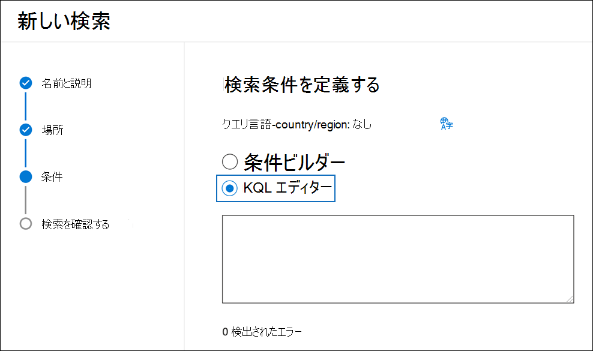
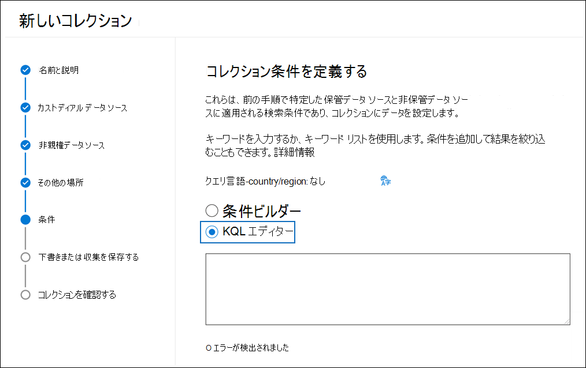
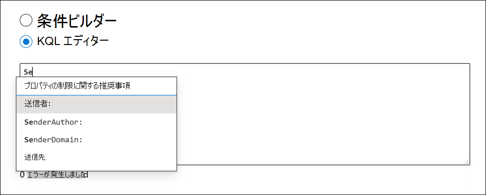
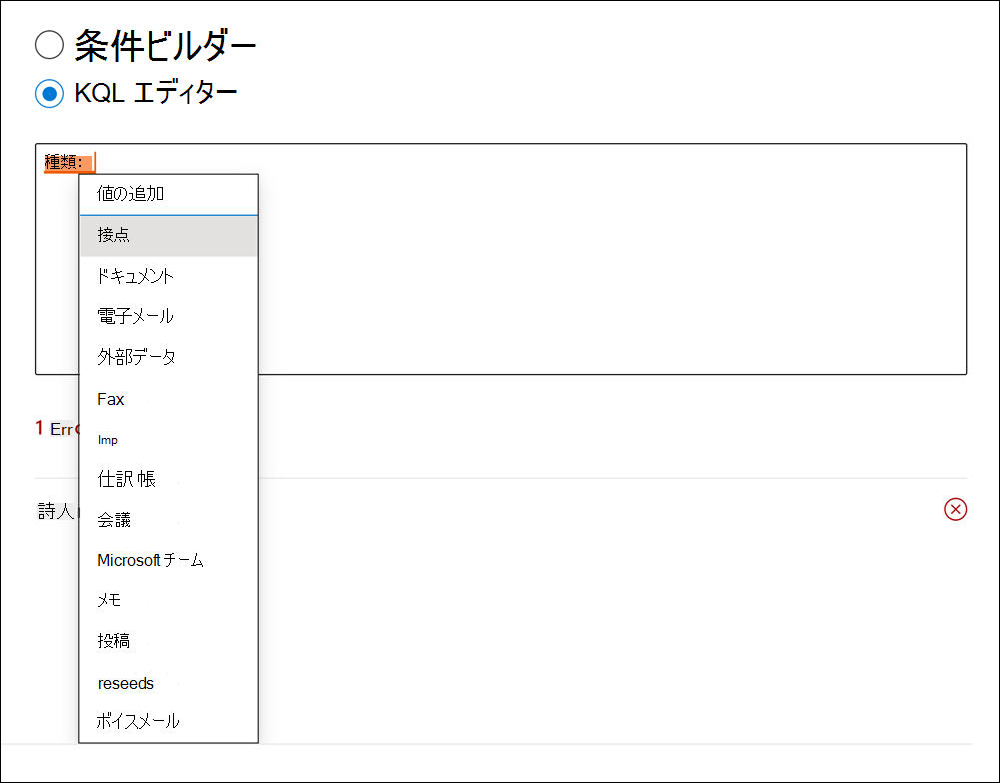
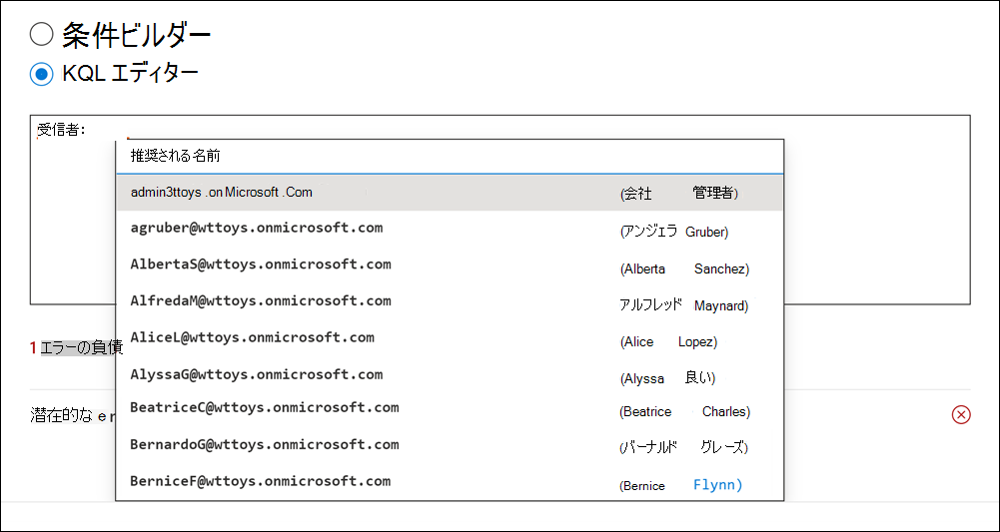
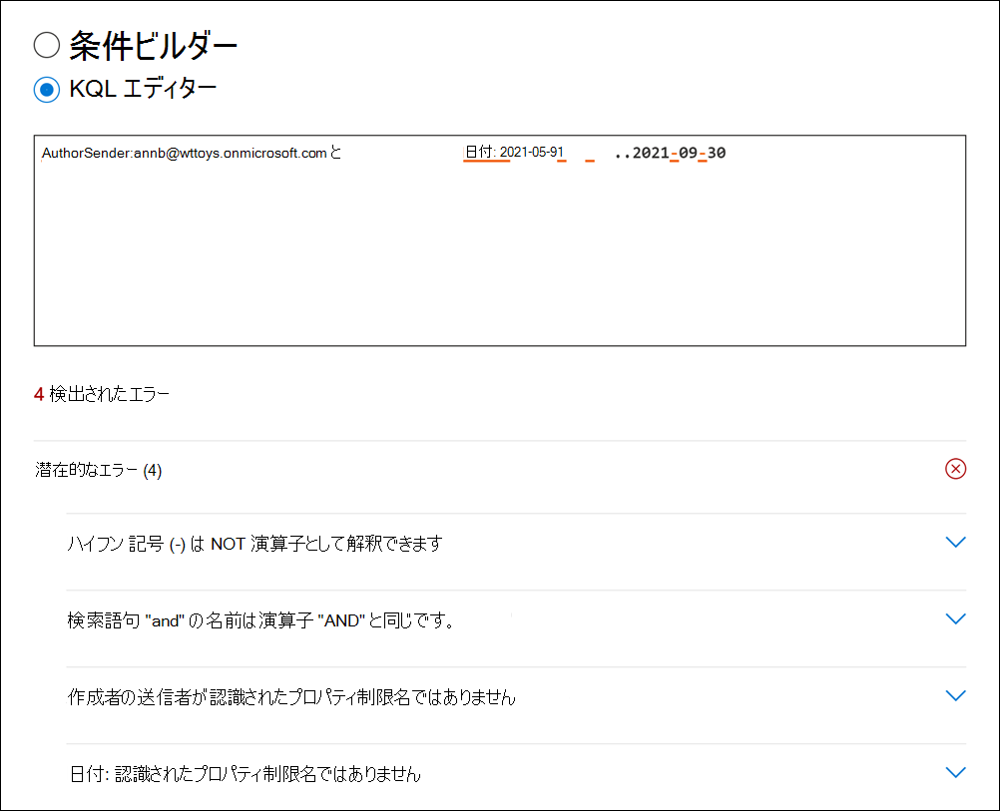

# KQL エディターを使用して検索クエリを作成する

電子情報開示ツール検索の新しい KQL クエリ エクスペリエンスMicrosoft 365コンテンツ検索、Core 電子情報開示、および電子情報開示で検索クエリを作成するときにフィードバックとガイダンスを提供Advanced eDiscovery。 エディターにクエリを入力すると、サポートされている検索可能なプロパティと条件のオートコンプリートが提供され、標準のプロパティと条件でサポートされる値の一覧が提供されます。 たとえば、クエリで email プロパティを指定すると、エディターに、選択できるサポートされている値の `kind` 一覧が表示されます。 また、KQL エディターは、検索を実行する前に修正できるクエリ エラーをリアルタイムで表示します。 何より、複雑なクエリをエディターに直接貼り付け、標準条件ビルダーのキーワードカードと条件カードを使用して手動でクエリを作成する必要はありません。
  
KQL エディターを使用する主な利点は次のとおりです。

- ガイダンスを提供し、最初から検索クエリを作成するのに役立ちます。

- 長く複雑なクエリをすばやくエディターに直接貼り付けます。 たとえば、反対の弁護士から複雑なクエリを受け取った場合は、条件ビルダーを使用する代わりに、KQL エディターに貼り付けます。

- 潜在的なエラーをすばやく特定し、問題を解決する方法に関するヒントを表示します。

KQL エディターは、Core 電子情報開示と電子情報開示でクエリ ベースの保持を作成するときにもAdvanced eDiscovery。

## KQL エディターの表示

電子情報開示検索を作成または編集する場合、KQL エディターを表示および使用するオプションは、検索またはコレクションウィザードの [条件] ページに表示されます。

### コンテンツ検索とコア電子情報開示の KQL エディター

### KQL エディター (Advanced eDiscovery

## KQL エディターの使用

次のセクションでは、KQL エディターが提案を提供し、潜在的なエラーを検出する方法の例を示します。

### 検索プロパティと演算子のオートコンプリート

KQL エディターで検索クエリの入力を開始すると、エディターには、選択できるサポートされている検索プロパティ (プロパティ制限とも呼 *ばれる)* の推奨オートコンプリートが表示されます。 これらの 2 文字で始まるサポートされているプロパティの一覧を表示するには、少なくとも 2 文字を入力する必要があります。 たとえば、次のスクリーンショットは、で始まる推奨される検索プロパティを示しています `Se` 。

さらに、完全なプロパティ名を入力すると、サポートされている演算子 (、、 など) の一覧も表示 `:` `=` `<>` されます。 たとえば、次のスクリーンショットは、プロパティの推奨演算子を示 `Date` しています。

サポートされている検索プロパティと演算子の詳細については、「電子情報開示のキーワード クエリと [検索条件」を参照してください](keyword-queries-and-search-conditions.md)。

### プロパティ値の候補

KQL エディターでは、一部のプロパティで使用できる値の候補を提供します。 たとえば、次のスクリーンショットは、プロパティの推奨値を示 `Kind` しています。

また、電子メール受信者のプロパティを入力するときに、ユーザーの一覧 (UPN 形式) が表示されます 。、 `From` `To` など `Recipients` `Participants` です。

### 潜在的なエラーの検出

KQL エディターは、検索クエリの潜在的なエラーを検出し、エラーの原因がエラーの解決に役立つヒントを提供します。 また、エディターは、プロパティに対応する操作または値が存在しない場合にエラーが発生する可能性を示します。 クエリ内の潜在的なエラーは赤いテキストで強調表示され、エラーの説明と考えられる修正は、[潜在的なエラー] ドロップダウン **セクションに表示** されます。 たとえば、次のクエリを KQL エディターに貼り付けすると、4 つの潜在的なエラーが検出されます。

この場合、潜在的なエラー ヒントを使用して、クエリのトラブルシューティングと修正を行えます。

## 詳細

- 条件ビルダーと KQL エディターを切り替えできます。 たとえば、条件ビルダーを使用して [キーワード] ボックスと複数の条件カードを使用してクエリを構成する場合、結果のクエリを KQL エディターに表示できます。 ただし、KQL エディターで複雑なクエリ (キーワードと条件を含む) を作成した場合、結果のクエリは、条件ビルダーで表示するときに [キーワード] ボックスにのみ表示されます。

- 複雑なクエリを KQL エディターに貼り付ける場合、エディターは潜在的なエラーを検出し、エラーを解決するための解決策を提案します。
