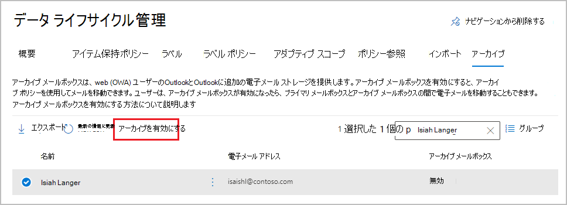
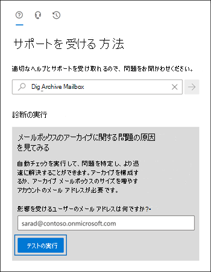

# <a name="enable-archive-mailboxes-in-the-microsoft-purview-compliance-portal"></a>Microsoft Purview コンプライアンス ポータルでアーカイブ メールボックスを有効にする

Microsoft 365 でのアーカイブ (*インプレース アーカイブ* とも呼ばれます) では、追加のメールボックスの記憶域がユーザーに提供されます。 詳細については、「[アーカイブ メールボックスの詳細](archive-mailboxes.md)」を参照してください。

この記事の情報を使用して、Microsoft Purview コンプライアンス ポータルまたは PowerShell を使用してアーカイブ メールボックスを有効または無効にします。 ユーザーのアーカイブ メールボックスに対して自動診断チェックを実行し、問題と推奨される解決策を特定する方法についても説明します。

## <a name="get-the-necessary-permissions"></a>必要なアクセス許可を取得する

アーカイブ メールボックスを有効または無効にするには、Exchange Online でメール受信者の役割が自分に割り当てられている必要があります。 既定では、この役割は、<a href="https://go.microsoft.com/fwlink/p/?linkid=2059104" target="_blank">Exchange 管理センター</a> の **[アクセス許可]** ページで受信者管理役割グループまたは組織管理役割グループに割り当てられています。 

 Microsoft Purview コンプライアンス ポータルの **[アーカイブ]** ページが表示されない場合、必要なアクセス許可を自分に割り当ててもらうよう管理者に依頼します。

## <a name="enable-an-archive-mailbox"></a>アーカイブ メールボックスの有効化

1. <a href="https://go.microsoft.com/fwlink/p/?linkid=2077149" target="_blank">Microsoft Purview コンプライアンス ポータル</a>に移動してサインインします。

2. コンプライアンス ポータルの左側のウィンドウで、**[データ ライフサイクル管理]**  >  **[インポート]** の順にクリックします。

   **[アーカイブ]** ページが表示されます。**[アーカイブ メールボックス]** 列は、各ユーザーに対してアーカイブ メールボックスが有効か無効かを示します。

   > [!NOTE]
   > **アーカイブ** ページには、最大 500 人のユーザーが表示されます。 目的のユーザーの名前をすぐに表示できない場合は、検索ボックスを使用します。

3. メールボックスの一覧で、アーカイブ メールボックスを有効にするユーザーを選択し、**[アーカイブの有効化]** を選択します。
    
   
    
   アーカイブ メールボックスを有効にすると、ユーザーのメールボックス内にあるメールボックスに割り当てられているアーカイブ ポリシーより古いアイテムは、新しいアーカイブ メールボックスに移動されるという警告が表示されます。 アイテムがメールボックスに配信またはユーザーによって作成された日付から 2 年間経過すると、Exchange Online のメールボックスに割り当てられているアイテム保持ポリシーの一部である既定のアーカイブ ポリシーにより、アイテムはアーカイブ メールボックスに移動されます。 詳細については、「[アーカイブ メールボックスの詳細](archive-mailboxes.md)」を参照してください。

5. 続行するには **[OK]** を選択します。

   アーカイブ メールボックスの作成にはしばらくかかる場合があります。 作成されると、選択したユーザーの **[アーカイブ メールボックス**] 列に **[有効]** が表示されますが、状態の変更を確認するためにページを更新する必要がある場合があります。

## <a name="disable-an-archive-mailbox"></a>アーカイブ メールボックスを無効にする

アーカイブ メールボックスを有効にする方法と同様に、Microsoft Purview コンプライアンス ポータルの **[アーカイブ]** ページを使用して、ユーザーのアーカイブ メールボックスを無効にすることができます。今回は、ユーザーを選択した後、**[アーカイブを無効にする]** オプションを選択します。

アーカイブ メールボックスを無効にしてから 30 日以内なら、ユーザーのプライマリ メールボックスにそれを再接続できます。この場合、アーカイブ メールボックスの元の内容が復元されます。30 日後には、元のアーカイブ メールボックスの内容は完全に削除され、回復不可能になります。したがって、アーカイブを無効にした後、30 日を超えてから再度有効にすると、新しいアーカイブ メールボックスが作成されます。

前述のように、ユーザーのメールボックスに割り当てられた既定のアーカイブ ポリシーは、配信された日付から 2 年間経つとアイテムをアーカイブ メールボックスに移動します。ユーザーのアーカイブ メールボックスを無効にすると、メールボックスのアイテムに対してアクションは実行されず、そのままユーザーのプライマリ メールボックスに残ります。

## <a name="use-exchange-online-powershell-to-enable-or-disable-archive-mailboxes"></a>Exchange Online PowerShell を使用してアーカイブ メールボックスを有効または無効にする

Exchange Online PowerShell を使用しても、アーカイブ メールボックスを有効にできます。PowerShell を使用する主な理由は、組織内のすべてのユーザーのためにアーカイブ メールボックスをすばやく有効にできるということです。

最初の手順は、Exchange Online PowerShell へ接続することです。 手順については、「[Exchange Online PowerShell に接続する](/powershell/exchange/connect-to-exchange-online-powershell)」を参照してください。

Exchange Online に接続したら、次のセクションのコマンドを実行してアーカイブメール ボックスを有効または無効にできます。

### <a name="enable-archive-mailboxes"></a>アーカイブ メールボックスの有効化

特定のユーザーのアーカイブ メールボックスを有効にするには、次のコマンドを実行します。

```powershell
Enable-Mailbox -Identity <username> -Archive
```

組織内の、アーカイブ メールボックスが現在有効になっていないすべてのユーザーについてアーカイブ メールボックスを有効にするには、次のコマンドを実行します。

```powershell
Get-Mailbox -Filter {ArchiveGuid -Eq "00000000-0000-0000-0000-000000000000" -AND RecipientTypeDetails -Eq "UserMailbox"} | Enable-Mailbox -Archive
```

### <a name="disable-archive-mailboxes"></a>アーカイブ メールボックスの無効化

特定のユーザーのアーカイブメールボックスを無効にするには、次のコマンドを実行します。

```powershell
Disable-Mailbox -Identity <username> -Archive
```

組織内の、アーカイブ メールボックスが現在有効になっているすべてのユーザーについてアーカイブ メールボックスを無効にするには、次のコマンドを実行します。

```powershell
Get-Mailbox -Filter {ArchiveGuid -Ne "00000000-0000-0000-0000-000000000000" -AND RecipientTypeDetails -Eq "UserMailbox"} | Disable-Mailbox -Archive
```

## <a name="run-diagnostics-on-archive-mailboxes"></a>アーカイブ メールボックスの診断を実行する

ユーザーのアーカイブ メールボックスに対して自動診断チェックを実行し、問題と推奨される解決策を特定できます。

診断チェックを実行するには、下のボタンをクリックします。 

> [!div class="nextstepaction"]
> [テストを実行する: アーカイブ メールボックス](https://aka.ms/PillarArchiveMailbox)



Microsoft 365 管理センターでポップアップ ページが開きます。 チェックするメールボックスのメール アドレスを入力し、**［テストの実行］** をクリックします。

> [!NOTE]
> アーカイブ メールボックスの診断チェックを使用するには、Microsoft 365 グローバル管理者である必要があります。 なお、この機能は、Microsoft 365 Government クラウド、21 Vianet が運用する Microsoft 365、または Microsoft 365 Germany では使用できません。

## <a name="instructions-for-end-users"></a>エンド ユーザー向けの手順

アーカイブ メールボックスのしくみと、Windows、macOS、および Web 上のOutlookでの操作方法について説明します。 最も効果的なドキュメントは、組織に対してカスタマイズされます。 ただし、基本的な手順については、[[オンライン アーカイブ メールボックスを使用したメール ストレージの管理](https://prod.support.services.microsoft.com/en-us/office/manage-email-storage-with-online-archive-mailboxes-1cae7d17-7813-4fe8-8ca2-9a5494e9a721)] を参照してください。

## <a name="next-steps"></a>次の手順

追加の記憶領域については、[自動拡張アーカイブ](autoexpanding-archiving.md)を有効にすることを検討してください。 手順については、「[自動拡張アーカイブを有効にする](enable-autoexpanding-archiving.md)」を参照してください。
