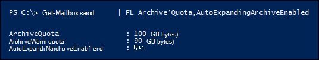

# <a name="enable-auto-expanding-archiving"></a>自動拡張アーカイブを有効にする

>*[セキュリティとコンプライアンスのための Microsoft 365 ライセンス ガイダンス](/office365/servicedescriptions/microsoft-365-service-descriptions/microsoft-365-tenantlevel-services-licensing-guidance/microsoft-365-security-compliance-licensing-guidance)。*

Exchange Online自動拡張アーカイブ機能を使用して、アーカイブ メールボックスの追加の記憶域を有効にすることができます。 自動拡張アーカイブを有効にすると、ユーザーのアーカイブ メールボックスが 1.5 TB のストレージ制限に達するまで、追加の記憶域領域が自動的に追加されます。 組織の全ユーザーに対し、または特定のユーザーだけに対し、自動拡張アーカイブを有効にすることができます。 自動拡張アーカイブの詳細については、「 [自動展開アーカイブの詳細](autoexpanding-archiving.md)」を参照してください。

## <a name="before-you-enable-auto-expanding-archiving"></a>自動拡張アーカイブを有効にする前に

- 次の制限について理解します。 

    - 組織または特定のユーザーの自動拡張アーカイブを有効にした後は、オフにすることはできません。 管理者は、自動拡張アーカイブ用のストレージ クォータを調整することもできません。
    
    - アーカイブを自動拡張すると、 [非アクティブなメールボックス](inactive-mailboxes-in-office-365.md#what-are-inactive-mailboxes)を回復または復元できなくなります。 つまり、メールボックスの自動拡張アーカイブを有効にし、後でメールボックスを非アクティブにした場合、 [非アクティブなメールボックスを (アクティブなメールボックス](recover-an-inactive-mailbox.md) に変換して) 回復したり (コンテンツを既存のメールボックスにマージすることによって) [復元](restore-an-inactive-mailbox.md) したりすることはできません。 
        
        非アクティブなメールボックスで自動拡張アーカイブが有効になっている場合、データを回復する唯一の方法は、Microsoft Purview コンプライアンス ポータルのコンテンツ検索ツールを使用してメールボックスからデータをエクスポートし、別のメールボックスにインポートすることです。 詳細については、「 [非アクティブなメールボックスと自動展開アーカイブ](inactive-mailboxes-in-office-365.md#inactive-mailboxes-and-auto-expanding-archives)」を参照してください。

- 自動拡張アーカイブを有効にするには、組織内のグローバル管理者であるか、Exchange Online組織内の組織管理役割グループのメンバーである必要があります。 または、特定のユーザーに対する自動拡張アーカイブを有効にするには、メール受信者の役割を割り当てられた役割グループのメンバーである必要があります。

- 自動拡張アーカイブを [有効にするには](enable-archive-mailboxes.md) 、ユーザーのメールボックスをアーカイブ用に既に有効にする必要があります。

- 自動拡張アーカイブを有効にすると、アーカイブ メールボックス (回復可能なアイテム フォルダーを含む) が 90 GB に達すると、アーカイブ メールボックスは自動展開アーカイブに変換されます。 追加記憶領域がプロビジョニングされるには、最大 30 日かかります。

- アーカイブの自動拡張では、共有メールボックスもサポートされます。

- Exchange 管理センターまたはMicrosoft Purview コンプライアンス ポータルを使用して、自動拡張アーカイブを有効にすることはできません。 PowerShell Exchange Online使用する必要があります。

## <a name="enable-auto-expanding-archiving-for-your-entire-organization"></a>自動拡張アーカイブを組織全体で有効にする

組織全体の自動拡張アーカイブを有効にすることができます。 いったん有効にすると、既存ユーザーのメールボックスと、作成される新規ユーザーのメールボックスに対し、自動拡張アーカイブが有効になります。 ユーザー メールボックスを作成するときは、自動拡張アーカイブ機能が新しいユーザー メールボックスで機能するように、ユーザーのメイン アーカイブ メールボックスを有効にする必要があります。
  
1. [Exchange Online PowerShell への接続](/powershell/exchange/connect-to-exchange-online-powershell)

2. 自動拡張アーカイブを組織全体で有効にするには、Exchange Online PowerShell で次のコマンドを実行します。

    ```powershell
    Set-OrganizationConfig -AutoExpandingArchive
    ```

## <a name="enable-auto-expanding-archiving-for-specific-users"></a>自動拡張アーカイブを特定のユーザーに対して有効にする

組織内のすべてのユーザーの自動拡張アーカイブを有効にするのではなく、特定のユーザーについてだけ有効にできます。 大容量のアーカイブ記憶領域の容量を必要とするのが一部のユーザーのみの場合に、この方法を使用します。
  
特定のユーザーと保持中のユーザーのメールボックスの自動拡張アーカイブを有効にするか、アイテム保持ポリシーに割り当てると、次の 2 つの構成が変更されます。
  
- ユーザーのプライマリ アーカイブ メールボックスの記憶領域のクォータが 10 GB 増加します (100 GB から 110 GB へ)。 また、アーカイブの警告クォータも 10 GB 増加します (90 GB から 100 GB へ)。

- ユーザーのプライマリ メールボックスの [回復可能なアイテム] フォルダーの記憶領域のクォータは、10 GB 増加します (100 GB から 110 GB へ)。 回復可能なアイテムの警告クォータも、10 GB 増加します (90 GB から 100 GB へ)。 これらの変更は、メールボックスが保留中であるか、アイテム保持ポリシーに割り当てられている場合にのみ適用されます。

この追加容量は、自動拡張アーカイブのプロビジョニングが行われる前に発生する可能性がある記憶領域の問題を防ぐために追加されるものです。 前のセクションで説明したように、自動拡張アーカイブを組織全体に対して有効にする場合は、追加記憶領域は追加 *されません*。
  
1. [Exchange Online PowerShell への接続](/powershell/exchange/connect-to-exchange-online-powershell)

2. 自動拡張アーカイブを特定のユーザーに対して有効にするには、次の PowerShell コマンドを実行します。 前述のように、ユーザーの自動拡張アーカイブを有効にする前に、そのユーザーのアーカイブ メールボックス (メイン アーカイブ) を有効にしておく必要があります。

    ```powershell
    Enable-Mailbox <user mailbox> -AutoExpandingArchive
    ```

> [!IMPORTANT]
> Exchange ハイブリッド展開では、 **Enable-Mailbox -AutoExpandingArchive コマンドを** 使用して、プライマリ メールボックスがオンプレミスでアーカイブ メールボックスがクラウドベースの特定のユーザーに対して自動拡張アーカイブを有効にすることはできません。 クラウド ベースのアーカイブ メールボックスの自動拡張アーカイブを Exchange ハイブリッド展開で有効にするには、Exchange Online PowerShell で **Set-OrganizationConfig -AutoExpandingArchive** コマンドを実行して、組織全体に対して自動拡張アーカイブを有効にする必要があります。 ユーザーのプライマリ メールボックスとアーカイブ メールボックスが両方ともクラウド ベースの場合は、**Enable-Mailbox -AutoExpandingArchive** コマンドを使用してそのユーザーに対して自動拡張アーカイブを有効にできます。
  
## <a name="verify-that-auto-expanding-archiving-is-enabled"></a>自動拡張アーカイブが有効になっていることを確認する

自動拡張アーカイブが組織に対して有効になっていることを確認するには、Exchange Online PowerShell で次のコマンドを実行します。

```powershell
Get-OrganizationConfig | FL AutoExpandingArchiveEnabled
```

値 `True` は、自動拡張アーカイブが組織に対して有効になっていることを示します。 
  
特定のユーザーに対して自動拡張アーカイブが有効になっていることを確認するには、powerShell で次のコマンドExchange Online実行します。
  
```powershell
Get-Mailbox <user mailbox> | FL AutoExpandingArchiveEnabled
```

値 `True` は、自動拡張アーカイブがそのユーザーに対して有効になっていることを示します。
  
非アクティブなメールボックスに対して自動拡張アーカイブが有効になっているかどうかを確認するには、powerShell で次のコマンドExchange Online実行します。
  
```powershell
Get-Mailbox -InactiveMailboxOnly | FL UserPrincipalName,AutoExpandingArchiveEnabled
```

値は  `True` 、非アクティブなメールボックスに対して自動拡張アーカイブが有効になっていることを示します。 値は `False` 、自動展開アーカイブが有効になっていないことを示します。

自動拡張アーカイブを有効にした後は、次の点に注意してください。
  
- **Set-OrganizationConfig -AutoExpandingArchive** コマンドを実行して自動拡張アーカイブを組織に対して有効化する場合は、個々のメールボックスに対して **Enable-Mailbox -AutoExpandingArchive** を実行する必要はありません。 **Set-OrganizationConfig** コマンドレットを実行して組織の自動拡張アーカイブを有効にしても、ユーザー メールボックス`True`の *AutoExpandingArchiveEnabled プロパティは* 変更されません。

- 同様に、自動拡張アーカイブを有効にしても、メールボックスの *ArchiveQuota* プロパティと *ArchiveWarningQuota* プロパティの値も変更されません。 実際、ユーザー メールボックスの自動拡張アーカイブを有効にして、*AutoExpandingArchiveEnabled* プロパティを `True` に設定している場合、*ArchiveQuota* プロパティと *ArchiveWarningQuota* プロパティは無視されます。 ユーザーのメールボックスの自動拡張アーカイブを有効にした後のこれらのメールボックス プロパティの例を示します。 

    

## <a name="more-information"></a>詳細情報

- PowerShell を使って、アーカイブ メールボックスを有効にすることもできます。 たとえば、Exchange Online PowerShell で次のコマンドを実行して、アーカイブ メールボックスがまだ有効になっていないすべてのユーザーのアーカイブ メールボックスを有効にできます。

    ```powershell
    Get-Mailbox -Filter {ArchiveStatus -Eq "None" -AND RecipientTypeDetails -eq "UserMailbox"} | Enable-Mailbox -Archive
    ```

- 自動拡張アーカイブは、オンプレミスのプライマリメールボックスを持つユーザーについて、Exchange ハイブリッド展開のクラウド ベースのアーカイブ メールボックスでサポートされています。 ただし、クラウド ベースのアーカイブ メールボックスに対して自動拡張アーカイブを有効にした後は、そのアーカイブ メールボックスをオフボードしてオンプレミスの Exchange 組織に戻すことはできません。 自動拡張アーカイブは、任意のバージョンのExchange Serverのオンプレミス メールボックスではサポートされていません。

- ユーザーがアーカイブ メールボックス内の追加のストレージ領域のアイテムにアクセスするために使用できる Outlook クライアントの一覧については、「自動展開アーカイブのアイテムにアクセスするための Outlook の要件」セクションの「 [自動展開アーカイブの詳細](autoexpanding-archiving.md#outlook-requirements-for-accessing-items-in-an-auto-expanded-archive)」を参照してください。

- 前述のように、**Enable-Mailbox -AutoExpandingArchive** コマンドを実行すると、ユーザーのプライマリ アーカイブ メールボックス (および、メールボックスが保留中の場合は、[回復可能なアイテム] フォルダー) の記憶領域のクォータ に 10 GB が追加されます。 これにより、自動拡張記憶領域がプロビジョニングされるまで (最大で30 日間かかります)、追加の記憶領域が提供されます。 **Set-OrganizationConfig -AutoExpandingArchive** を実行して組織のすべてのメールボックスに対して自動拡張アーカイブを有効化した場合は、追加記憶領域は追加されません。 自動拡張アーカイブを組織全体に対して有効化した場合でも、特定のユーザーの記憶領域に 10 GB を追加する必要がある場合は、そのメールボックスに対して **Enable-Mailbox -AutoExpandingArchive** コマンドを実行できます。 自動拡張アーカイブが既に有効化されているというエラー メッセージが表示されますが、メールボックスには追加記憶領域が追加されます。

> [!IMPORTANT]
> 自動拡張アーカイブは、個々のユーザーが使用するメールボックス、または 1 日あたり 1 GB を超えない増加率の共有メールボックスでのみサポートされます。 アーカイブ目的のために、ジャーナリング、トランスポート ルール、または自動転送ルールを使用してメッセージをアーカイブ メールボックスにコピーすることは許可されていません。 ユーザーのアーカイブ メールボックスは、そのユーザー専用です。 Microsoft は、他のユーザーのアーカイブ データを格納するためにユーザーのアーカイブ メールボックスが使用されている場合、または不適切な使用が行われる場合に、追加のアーカイブを拒否する権利を留保します。
