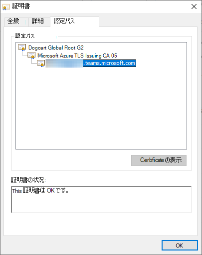

# <a name="office-tls-certificate-changes"></a>Office TLS 証明書の変更

Microsoft 365 は、メッセージング、会議、テレフォニー、音声、ビデオを電源としてサービスを更新し、異なるルート証明機関 (CA) の TLS 証明書を使用しています。 現在のルート CA は 2025 年 5 月に期限切れになるため、この変更が行われています。

影響を受ける製品は次のとおりです。
- Microsoft Teams
- Skype
- Skype for Business Online
- Microsoft Dynamics 365
- GroupMe
- Kaizala
- Azure Communication Services

影響を受けるエンドポイントには次のものが含まれます (ただし、これらに限定されません)。
- *.teams.microsoft.com
- *.skype.com
- *.skypeforbusiness.com
- *.groupme.com
- *.communication.azure.com
- *.operatorconnect.microsoft.com

さらに、Microsoft 365 の米国政府機関の国内クラウド インスタンスの Teams と Skype for Business Online エンドポイントも同じ変更を行い、エンドポイントに次のような影響を与えます。
- *.gcc.teams.microsoft.com
- *.dod.teams.microsoft.us
- *.gov.teams.microsoft.us
- *.online.dod.skypeforbusiness.us
- *.online.gov.skypeforbusiness.us
- *.um-dod.office365.us
- *.um.office365.us

この変更は、Microsoft 365 の中国またはドイツの国内クラウド インスタンスで使用される証明書、ドメイン、またはサービスには影響しません。

この記事のすべての証明書情報は、2020 年 [10 月までに Microsoft 365 暗号化チェーン](./encryption-office-365-certificate-chains.md) で提供されていました。

## <a name="when-will-this-change-happen"></a>この変更はいつ行われますか?

サービスは 2022 年 1 月に新しいルート CA への移行を開始し、2022 年 10 月まで継続されます。

## <a name="what-is-changing"></a>何が変わるのですか?

現在、Microsoft 365 サービスで使用される TLS 証明書のほとんどは、次のルート CA に連鎖しています。

| CA の共通名 | 拇印 (SHA1) |
|--|--|
| [Baltimore CyberTrust Root](https://cacerts.digicert.com/BaltimoreCyberTrustRoot.crt) | d4de20d05e66fc53fe1a50882c78db2852cae474 |

次のいずれかの中間 CA を使用します。

| CA の共通名 | 拇印 (SHA1) |
|--|--|
| [Microsoft RSA TLS CA 01](https://www.microsoft.com/pki/mscorp/Microsoft%20RSA%20TLS%20CA%2001.crt) | 703d7a8f0ebf55aaa59f98eaf4a206004eb2516a |
| [Microsoft RSA TLS CA 02](https://www.microsoft.com/pki/mscorp/Microsoft%20RSA%20TLS%20CA%2002.crt) | b0c2d2d13cdd56cdaa6ab6e2c04440be4a429c75 |

Microsoft 365 サービスで使用される新しい TLS 証明書は、次のいずれかのルート CA にチェーンされます。

| CA の共通名 | 拇印 (SHA1) |
|--|--|
| [DigiCert グローバル ルート G2](https://cacerts.digicert.com/DigiCertGlobalRootG2.crt) | df3c24f9bfd666761b268073fe06d1cc8d4f82a4 |
| [Microsoft RSA ルート証明機関 2017](https://www.microsoft.com/pkiops/certs/Microsoft%20RSA%20Root%20Certificate%20Authority%202017.crt) | 73a5e64a3bff8316ff0edccc618a906e4eae4d74 | 
| [Microsoft ECC ルート証明機関 2017](https://www.microsoft.com/pkiops/certs/Microsoft%20ECC%20Root%20Certificate%20Authority%202017.crt) | 999a64c37ff47d9fab95f14769891460eec4c3c5 |

次のいずれかの中間 CA を使用します。

| CA の共通名 | 拇印 (SHA1) |
|--|--|
| [Microsoft Azure TLS Issuing CA 01](https://www.microsoft.com/pkiops/certs/Microsoft%20Azure%20TLS%20Issuing%20CA%2001%20-%20xsign.crt) | 2f2877c5d778c31e0f29c7e371df5471bd673173 |
| [Microsoft Azure TLS Issuing CA 02](https://www.microsoft.com/pkiops/certs/Microsoft%20Azure%20TLS%20Issuing%20CA%2002%20-%20xsign.crt) | e7eea674ca718e3befd90858e09f8372ad0ae2aa |
| [Microsoft Azure TLS Issuing CA 05](https://www.microsoft.com/pkiops/certs/Microsoft%20Azure%20TLS%20Issuing%20CA%2005%20-%20xsign.crt) | 6c3af02e7f269aa73afd0eff2a88a4a1f04ed1e5 |
| [Microsoft Azure TLS Issuing CA 06](https://www.microsoft.com/pkiops/certs/Microsoft%20Azure%20TLS%20Issuing%20CA%2006%20-%20xsign.crt) | 30e01761ab97e59a06b41ef20af6f2de7ef4f7b0 |

たとえば、これは、新しい証明書チェーンの 1 つを持つ有効な証明書です。



## <a name="will-this-change-affect-me"></a>この変更は私に影響しますか?

ルート CA "DigiCert Global Root G2" は、Windows、macOS、Android、iOS などのオペレーティング システム、および Microsoft Edge、Chrome、Safari、Firefox などのブラウザーによって広く信頼されています。 **Microsoft 365 のお客様のほとんどが影響を受けないことを想定しています**。 

ただし、 **許容可能な CA の一覧が明示的に指定されている場合、アプリケーションに影響が及ぶ可能性があります**。 この方法は"証明書のピン留め" と呼ばれます。 受け入れ可能な CA の一覧に新しいルート CA がないお客様は、証明書検証エラーを受け取り、アプリケーションの可用性または機能に影響を与える可能性があります。

アプリケーションが影響を受ける可能性があるかどうかを検出する方法を次に示します。

- [ここで](https://www.microsoft.com/pki/mscorp/cps/default.htm)見つかった中間 CA の拇印、共通名、またはその他のプロパティをソース コードで検索します。 一致するものがある場合、アプリケーションは影響を受けます。 この問題を解決するには、ソース コードを更新して、新しい CA のプロパティを追加します。 ベスト プラクティスとして、CA を簡単な通知で追加または編集できることを確認します。 業界の規制では、状況によっては 7 日以内に CA 証明書を置き換える必要があるため、証明書ピン留めを実装するアプリケーションはこれらの変更に迅速に対応する必要があります。

- .NET はコールバック関数とコールバック関数を`System.Net.ServicePointManager.ServerCertificateValidationCallback``System.Net.HttpWebRequest.ServerCertificateValidationCallback`公開します。これにより、開発者はカスタム ロジックを使用して、標準の Windows 証明書ストアに依存するのではなく、証明書が有効かどうかを判断できます。 開発者は、特定の共通名または拇印をチェックするロジックを追加することも、"Baltimore CyberTrust Root" などの特定のルート CA のみを許可することもできます。 アプリケーションでこれらのコールバック関数を使用する場合は、古いルート CA と新しいルート CA と中間 CA の両方を受け入れることを確認する必要があります。

- ネイティブ アプリケーションが使用 `WINHTTP_CALLBACK_STATUS_SENDING_REQUEST`されている場合があります。これにより、ネイティブ アプリケーションはカスタム証明書検証ロジックを実装できます。 この通知の使用はまれであり、実装するには大量のカスタム コードが必要です。 上記と同様に、アプリケーションが古い CA と新しいルート CA と中間 CA の両方を受け入れるようにします。 

- Microsoft Teams、Skype、Skype for Business Online、または Microsoft Dynamics API と統合されたアプリケーションを使用していて、証明書ピン留めを使用するかどうかわからない場合は、アプリケーション ベンダーに問い合わせてください。

- Azure サービスと通信するさまざまなオペレーティング システムと言語ランタイムでは、新しい証明書チェーンを正しく構築して検証するために他の手順が必要になる場合があります。
   - **Linux**: 多くのディストリビューションでは、CA を追加する必要があります `/etc/ssl/certs`。 具体的な手順については、ディストリビューションのドキュメントを参照してください。
   - **Java**: Java キー ストアに上記の CA が含まれていることを確認します。
   - **切断された環境で実行されている Windows: 切断された環境** で実行されているシステムでは、新しいルート CA をストアに `Trusted Root Certification Authorities` 追加し、新しい中間 CA をストアに追加する `Intermediate Certification Authorities` 必要があります。
   - **Android**: デバイスと Android のバージョンに関するドキュメントを確認してください。
   - **IoT または埋め込みデバイス**: テレビ セットトップ ボックスなどの埋め込みデバイスは、多くの場合、ルート機関証明書のセットが限られており、証明書ストアを簡単に更新する方法がありません。 カスタム埋め込みデバイスまたは IoT デバイスのコードを記述する場合、またはデプロイを管理する場合は、デバイスが新しいルート CA を信頼していることを確認します。 デバイスの製造元に問い合わせる必要がある場合があります。

- ファイアウォール規則で特定のエンドポイントへの発信呼び出しのみを許可する環境がある場合は、次の証明書失効リスト (CRL) またはオンライン証明書状態プロトコル (OCSP) URL を許可します。
   - `http://crl3.digicert.com`
   - `http://crl4.digicert.com`
   - `http://ocsp.digicert.com`
   - `http://crl.microsoft.com`
   - `http://oneocsp.microsoft.com`
   - `http://ocsp.msocsp.com`
   - `http://www.microsoft.com/pkiops`

- この変更の影響を受けた場合は、実行中の環境の種類と影響を受けたシナリオに応じてエラー メッセージが表示されることがあります。 Windows アプリケーション イベント ログ、CAPI2 イベント ログ、およびカスタム アプリケーション ログで、次のようなメッセージを確認します。
   ```output
   An operation failed because the following certificate has validation errors:
   
   Subject Name: CN=teams.microsoft.com
   Issuer Name: CN=Microsoft Azure TLS Issuing CA 01, O=Microsoft Corporation, C=US
   
   Errors:
   
   The root of the certificate chain is not a trusted root authority.
   ```

## <a name="when-can-i-retire-the-old-ca-information"></a>古い CA 情報を削除できるのはいつですか?

現在のルート CA、中間 CA、リーフ証明書は取り消されません。 既存の CA 共通名または拇印は、既存の証明書の有効期間に基づいて、少なくとも 2023 年 10 月まで必要になります。

## <a name="known-issues"></a>既知の問題

非常にまれな状況では、エンタープライズ ユーザーには、ルート CA "DigiCert Global Root G2" が失効として表示される証明書検証エラーが表示される場合があります。 これは、次の両方の条件下で Windows の既知のバグが原因です。

- ルート CA は [CurrentUser\Root 証明書ストア](/windows/win32/seccrypto/system-store-locations#cert_system_store_current_user)にあり、プロパティと`NotBeforeEKU`プロパティがありません`NotBeforeFileTime`
- ルート CA は [LocalMachine\AuthRoot 証明書ストア](/windows/win32/seccrypto/system-store-locations#cert_system_store_local_machine)にありますが、プロパティと`NotBeforeEKU`プロパティの両方があります`NotBeforeFileTime`
- ルート CA が [LocalMachine\Root 証明書ストア](/windows/win32/seccrypto/system-store-locations#cert_system_store_local_machine)にありません

このルート CA から発行されたすべてのリーフ証明書は、失効した後に `NotBeforeFileTime` 表示されます。 

管理者は、このエラーについて CAPI2 ログを調べることで、問題を特定してトラブルシューティングできます。

```text
Log Name:      Microsoft-Windows-CAPI2/Operational
Source:        Microsoft-Windows-CAPI2
Date:          6/23/2022 8:36:39 AM
Event ID:      11
Task Category: Build Chain
Level:         Error
[...]
        <ChainElement>
          <Certificate fileRef="DF3C24F9BFD666761B268073FE06D1CC8D4F82A4.cer" subjectName="DigiCert Global Root G2" />
          [...]
          <TrustStatus>
            <ErrorStatus value="4000024" CERT_TRUST_IS_REVOKED="true" CERT_TRUST_IS_UNTRUSTED_ROOT="true" CERT_TRUST_IS_EXPLICIT_DISTRUST="true" />
            <InfoStatus value="10C" CERT_TRUST_HAS_NAME_MATCH_ISSUER="true" CERT_TRUST_IS_SELF_SIGNED="true" CERT_TRUST_HAS_PREFERRED_ISSUER="true" />
          </TrustStatus>
          [...]
          <RevocationInfo freshnessTime="PT0S">
            <RevocationResult value="80092010">The certificate is revoked.</RevocationResult>
          </RevocationInfo>
        </ChainElement>
      </CertificateChain>
      <EventAuxInfo ProcessName="Teams.exe" />
      <Result value="80092010">The certificate is revoked.</Result>
```
要素の存在に注意してください `CERT_TRUST_IS_EXPLICIT_DISTRUST="true"` 。 

次`certutil`のコマンドを実行し、出力を比較することで、異なる`NotBeforeFileTime`プロパティを持つルート CA の 2 つのコピーが存在することを確認できます。

```
certutil -store -v authroot DF3C24F9BFD666761B268073FE06D1CC8D4F82A4
certutil -user -store -v root DF3C24F9BFD666761B268073FE06D1CC8D4F82A4
```

ユーザーは、次の操作を実行して、証明書ストア内のルート CA のコピーを削除することで、問題を `CurrentUser\Root` 解決できます。
```
certutil -user -delstore root DF3C24F9BFD666761B268073FE06D1CC8D4F82A4
```
または 
```
reg delete HKCU\SOFTWARE\Microsoft\SystemCertificates\Root\Certificates\DF3C24F9BFD666761B268073FE06D1CC8D4F82A4 /f
```
最初の方法では、ユーザーがクリックする必要がある Windows ダイアログが作成されますが、2 番目のアプローチではクリックする必要はありません。 