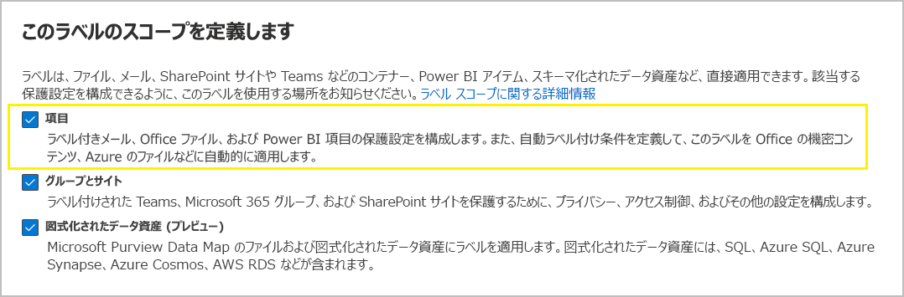
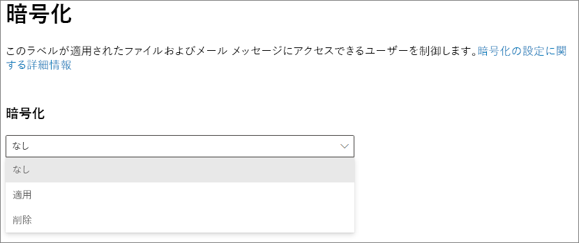
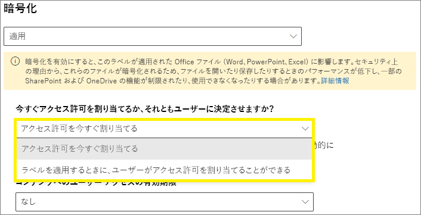
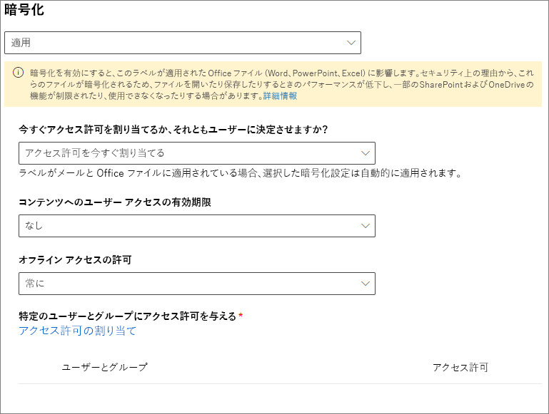
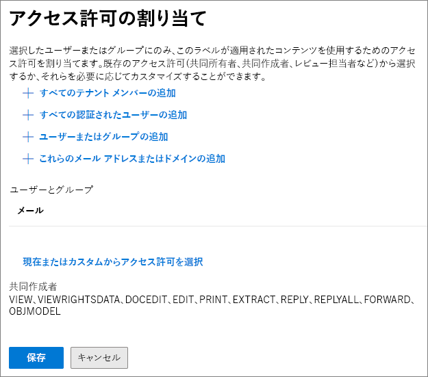
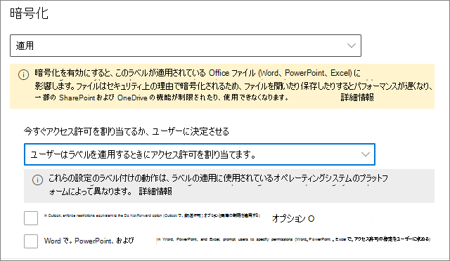

# 秘密度ラベルを使用して暗号化を適用してコンテンツへのアクセスを制限する

>*[セキュリティとコンプライアンスのための Microsoft 365 ライセンス ガイダンス](/office365/servicedescriptions/microsoft-365-service-descriptions/microsoft-365-tenantlevel-services-licensing-guidance/microsoft-365-security-compliance-licensing-guidance)。*

機密ラベルを作成するときに、そのラベルが適用されるコンテンツへのアクセスを制限できます。たとえば、機密ラベルに対応する暗号化の設定によって、次のようにコンテンツを保護できます。

- 組織内のユーザーのみが機密ドキュメントや電子メールを開けるようにする。
- 宣伝広告用のドキュメントや電子メールは、マーケティング部門のユーザーのみが編集および印刷できるようにして、その他の組織内のユーザーは閲覧のみできるようにする。
- 内部の再編成に関するニュースが含まれている電子メールは、ユーザーが転送や情報のコピーをできないようにする。
- ビジネス パートナーに送信する現行の価格リストは、指定した日付以降は開けないようにする。

ドキュメントや電子メールを暗号化するときには、次のようにしてコンテンツへのアクセスが制限されます。

- 暗号化の解除は、ラベルの暗号化設定で許可されているユーザーのみが可能です。
- 暗号化は、ファイルの場所 (組織内外) を問わず、ファイル名が変更されていても維持されます。
- 保存中 (OneDrive アカウントなど) と転送中 (インターネットを行き来するメールなど) の両方で暗号化されています。

最後に、管理者は、暗号化に適用する秘密度ラベルを構成するときに、次のいずれかを選択できます。

- **アクセス許可を割り当てます**。これにより、どのユーザーがそのラベルのコンテンツにどのアクセス許可を取得するかを正確に決定します。
- ラベルをコンテンツに適用するときに、**ユーザーがアクセス許可を割り当てる** ことができます。 このようにして、組織内のユーザーに、共同作業を行って作業を完了するために必要な柔軟性を与えることができます。

暗号化の設定は、Microsoft 365 コンプライアンス センターで[秘密度ラベルを作成](create-sensitivity-labels.md)するときに使用できます。 または以前のポータルであるセキュリティ/コンプライアンス センターを使用することもできます。

## 暗号化のしくみを理解する

暗号化では、Azure Information Protection の Azure Rights Management サービス (Azure RMS) が使用されます。 この保護ソリューションでは、暗号化ポリシー、ID ポリシー、および認識ポリシーが使用されます。 詳細については、 Azure Information Protection ドキュメントの「[Azure Rights Management とは](/azure/information-protection/what-is-azure-rms)」を参照してください。 

暗号化ソリューションを使用すると、**スーパー ユーザー** 機能により、認証されたユーザーとサービスが、組織のために暗号化されたデータの閲覧と検査を常に行えるようにできます。 必要に応じて、暗号化を削除または変更することができます。 詳細については、「[Azure Information Protection および検索サービスまたはデータ回復用のスーパー ユーザーの構成](/azure/information-protection/configure-super-users)」を参照してください。

## 暗号化のラベルを構成する方法

1. 一般的な手順に従って、[機密度ラベルを作成または編集](create-sensitivity-labels.md#create-and-configure-sensitivity-labels)し、ラベルのスコープとして **[ファイルとメール]** が選択されていることを確認します。 
    
    

2. 次に、**[ファイルとメールの保護設定の選択]** ページで、**[ファイルとメールの暗号化]** を選択していることを確認します。
    
    

4.  ウィザードの **[暗号化]** ページで、次のいずれかのオプションを選択します。
    
    - **ファイルが暗号化されている場合は暗号を削除します**: このオプションは、Azure Information Protection の統合ラベル付けクライアントでのみでサポートされています。 このオプションを選択して組み込みのラベル付けを使用すると、そのラベルがアプリに表示されないか、表示されても暗号の変更は行われないことがあります。
        
        このシナリオの詳細については、[ をご覧ください。ラベルが適用された場合の既存の暗号化への影響については ](#what-happens-to-existing-encryption-when-a-labels-applied) のセクションをご覧ください。 この設定により、ユーザーが十分な権限を持っていない場合に適用できない機密度ラベルが作成される可能性があることを理解することが重要です。
    
    - **暗号化設定の構成**: 暗号化をオンにして、暗号化設定を表示します。
        
        
        
        これらの設定の手順は、次の「[暗号化設定の構成](#configure-encryption-settings)」セクションにあります。

### ラベルが適用された場合の既存の暗号化への影響

暗号化されていないコンテンツに秘密度ラベルを適用する場合、選択可能な暗号化オプションを適用した場合の結果は、オプションの名前通りのものとなります。 たとえば、**[ファイルとメールを暗号化する]** を選択しなかった場合、コンテンツは暗号化されません。

ただし、コンテンツが既に暗号化されている場合があります。 たとえば、別のユーザーにより次のようなアクセス許可などが適用されている場合があります。

- ラベルにより求められた際にユーザーが定義したアクセス許可などのユーザー自身のアクセス許可、Azure Information Protection クライアントによるカスタムのアクセス許可、および Office アプリ内での **アクセス制限** によるドキュメントの保護。
- ラベルとは別にコンテンツの暗号化を行う、Azure Rights Management の保護テンプレート。 このカテゴリには、権限の保護を使用して暗号化を適用する、メール フロー ルールが含まれます。
- 管理者によって割り当てられているアクセス許可を使用して暗号化を適用するラベル。

そのコンテンツに秘密度ラベルが適用された際の既存の暗号への影響を次の表に示します:

| | 暗号化: 選択されていない | 暗号化: 構成されている | 暗号化: \* を削除します。 |
|:-----|:-----|:-----|:-----|
|**ユーザーによって指定されたアクセス許可**|元の暗号化が維持されます|新しいラベルの暗号化が適用されます|元の暗号化が削除されます|
|**保護テンプレート**|元の暗号化が維持されます|新しいラベルの暗号化が適用されます|元の暗号化が削除されます|
|**管理者定義によるアクセス許可が適用されたラベル**|元の暗号化が削除されます|新しいラベルの暗号化が適用されます|元の暗号化が削除されます|

**脚注:**

\* Azure Information Protection の統合ラベル付けクライアントでのみサポートされています

新しいラベルの暗号化が適用された場合、または元の暗号化が削除された場合、それが実際に実行されるのは、このアクションをサポートする使用権限または役割が、ラベルの適用を行うユーザーに付与されている場合のみです。

- 「エクスポート」または「フル コントロール」の[使用権限](/azure/information-protection/configure-usage-rights#usage-rights-and-descriptions)。
- [Rights Management 発行者または Rights Management 所有者](/azure/information-protection/configure-usage-rights#rights-management-issuer-and-rights-management-owner)の役割、または[スーパー ユーザー](/azure/information-protection/configure-super-users)。

ユーザーに上記のいずれかの権限または役割が付与されていない場合はラベルを適用することはできず、そのため元の暗号化が維持されます。 ユーザーには次のメッセージが表示されます: **You don't have permission to make this change to the sensitivity label. Please contact the content owner.** (秘密度ラベルを変更するためのアクセス許可がありません。コンテンツの所有者に連絡してください。)

たとえば、メール メッセージに「転送不可」を適用するユーザーは、スレッドのラベルを付け直して暗号化を置き換えたり削除したりできます。これらのユーザーはすべてのメールの Rights Management 所有者であるためです。 ただし、スーパー ユーザーを除き、このメールの受信者はメールのラベルを付け直すことはできません。必要な使用権限が受信者に付与されていないためです。

#### 暗号化されたメール メッセージの添付ファイル

メール メッセージが何らかの方法で暗号化されている場合、そのメールに添付されている暗号化されていないドキュメントでは、自動的に同じ暗号化設定が継承されます。

既に暗号化されているドキュメントが添付ファイルとして追加された場合は常に、元の暗号化がそのドキュメントで維持されます。

## 暗号化設定を構成する

ウィザードの **[暗号化]** ページで **[暗号化設定の構成]** を選択して機密度ラベルを作成または編集する場合は、次のいずれかのオプションを選択します。

- [**Assign permissions now**] (アクセス許可を今すぐ割り当てる): ラベルが適用されているコンテンツに対し、どのアクセス許可をどのユーザーに付与するかを正確に決められます。 詳細については、次のセクション「[アクセス許可を今すぐ割り当てる](#assign-permissions-now)」を参照してください。
- [**Let users assign permissions**] (アクセス許可の割り当てをユーザーに許可する): ユーザーがラベルをコンテンツに適用するときに、ユーザーがアクセス許可を割り当てることを許可します。 このオプションを使用した場合、共同作業や業務を行う上で必要な柔軟性を組織内のユーザーに与えることができます。 詳細については、このページのセクション「[ユーザーがアクセス許可を割り当てる](#let-users-assign-permissions)」を参照してください。

たとえば、最も機密性の高いコンテンツに適用される「**極秘**」という名前の機密ラベルがある場合、そのコンテンツに対してどのタイプのアクセス許可を誰に付与するのかについて、この時点で決めることができます。

一方、「**業務契約**」という名前の機密ラベルがあり、組織のワークフローの規定によりこのコンテンツに関して従業員と外部ユーザーの間でアドホック ベースで共同作業を行う必要がある場合は、従業員がラベルを割り当てる際に、アクセス許可を誰に付与するかを従業員が決定できるようにすることができます。 この柔軟性により、ユーザーの生産性が向上し、特定のシナリオに対処するために管理者に新しい機密度ラベルを更新または作成を要求することを減らすことができます。

[Choosing whether to assign permissions now] (アクセス許可を今すぐ割り当てる) または [Let users assign permissions] (アクセス許可の割り当てをユーザーに許可する) の選択:

## アクセス許可を今すぐ割り当てる

以下のオプションを使用して、このラベルが適用されるメールやドキュメントにアクセスできるユーザーを制御します。以下の方法を使用できます。

- **ラベル付けされたコンテンツへのアクセスに有効期限を設定します。** 特定の日付または指定するラベル適用後の経過日数で有効期限が切れるようにします。期限が切れると、ユーザーはラベル付きのアイテムを開くことができなくなります。日付を指定した場合、現在のタイム ゾーンでその日付の午前 0 時に有効期限が切れます。(一部のメール クライアントでは、キャッシュの仕組みにより、有効期限が適用されず、有効期限を過ぎたメールが表示されることがある点に注意してください。)

- **オフライン アクセス** を禁止、常に許可、または指定の日数 (ラベル適用後の経過日数) で許可します。オフライン アクセスを禁止または日数で制限すると、そのしきい値に達したときに、ユーザーは再認証される必要があり、ユーザーのアクセスがログに記録されます。詳細については、Rights Management 使用ライセンスに関する次のセクションを参照してください。

暗号化されたコンテンツに対するアクセス制御の設定:

### オフライン アクセスのための Rights Management 使用ライセンス

ユーザーが Azure Rights Management サービスからの暗号化によって保護されているドキュメントまたはメールを開くと、そのコンテンツの Azure Rights Management 使用ライセンスがユーザーに付与されます。 この使用ライセンスは、ドキュメントまたは電子メールに対するユーザーの使用権と、コンテンツの暗号化に使用された暗号化キーを含む証明書です。 使用ライセンスには、有効期限が設定されている場合はその有効期限と、使用ライセンスの有効期間も含まれています。

有効期限日が設定されていない場合、テナントに対する使用ライセンスの既定の有効期間は 30 日間です。使用ライセンスの有効期間中は、そのコンテンツに対してユーザーが再認証または再承認されることはありません。このプロセスにより、インターネット接続がない場合でも保護されたドキュメントまたはメールをユーザーは引き続き開くことができます。使用ライセンスの有効期間が切れた場合、保護されたドキュメントまたはメールにユーザーが次回アクセスした際に、ユーザーの再認証または再承認が必要になります。

再認証だけでなく、暗号化設定とユーザー グループ メンバーシップの再評価も実行されます。そのため、ユーザーが最後にコンテンツにアクセスした後で暗号化設定やグループ メンバーシップに変更が加えられていると、同じドキュメントや電子メールに対して異なるアクセス結果がユーザーに示されることがあります。

既定の 30 日の設定を変更する方法については、「[Rights Management 使用ライセンス](/azure/information-protection/configure-usage-rights#rights-management-use-license)」を参照してください。

### 特定のユーザーまたはグループにアクセス許可を割り当てる

特定のユーザーのみがラベル付きのコンテンツを操作できるよう、特定のユーザーのみにアクセス許可を付与することができます。

1. 最初に、ラベル付きコンテンツへのアクセス許可を割り当てるユーザーまたはグループを追加します。

2. 次に、これらのユーザーに付与するラベル付きコンテンツへのアクセス許可を選択します。

アクセス許可の割り当て:

#### ユーザーまたはグループの追加

アクセス許可を割り当てるときには、次の選択が可能です。

- 組織内のすべてのユーザー (すべてのテナント メンバー)。この設定ではゲスト アカウントが除外されます。

- すべての認証されたユーザー。 選択する前に、この設定の[要件と制限事項](#requirements-and-limitations-for-add-any-authenticated-users)を理解しておいてください。

- Azure AD で、特定のユーザーまたは電子メールが有効なセキュリティ グループ、配布グループ、または Microsoft 365 グループ ([以前の Office 365 グループ](https://techcommunity.microsoft.com/t5/microsoft-365-blog/office-365-groups-will-become-microsoft-365-groups/ba-p/1303601))。 Microsoft 365 グループは、静的メンバーシップまたは[動的メンバーシップ](/azure/active-directory/users-groups-roles/groups-create-rule)を持つことができます。 このグループの種類は Azure AD に同期されていないため、また、メールが有効になっていないセキュリティグループを使用できないため、[Exchange からの動的配布グループ](/Exchange/recipients/dynamic-distribution-groups/dynamic-distribution-groups) を使用することはできません。

- 任意のメール アドレスまたはドメイン。 この組織の任意のドメイン名を入力して、Azure AD を使用する別の組織のすべてのユーザーを指定するには、このオプションを使用します。 **gmail.com**、**hotmail.com**、**outlook.com** などのドメイン名を入力することにより、ソーシャル プロバイダーに対してこのオプションを使用することもできます。

    > [!NOTE]
    > Azure AD を使用する組織のドメインを指定した場合、その特定のドメインへのアクセスを制限することはできません。 代わりに、Azure AD の検証済みドメインはすべて、指定したドメイン名を所有するテナントに自動的に含まれます。

組織内のすべてのユーザーとグループを選択するか、ディレクトリを参照する場合、ユーザーまたはグループにはメール アドレスが必要になります。

ベスト プラクティスとして、ユーザーではなくグループを使用します。この方針により、シンプルな構成を維持できます。

##### [Add any authenticated users] (すべての認証されたユーザーを追加) の要件と制限事項

この設定では、ラベルによって暗号化されているコンテンツにアクセスできるユーザーは制限されませんが、コンテンツの暗号化は実行され、コンテンツの使用 (アクセス許可) およびコンテンツへのアクセス (有効期限とオフライン アクセス) を制限するオプションが提供されます。 ただし、暗号化されたコンテンツを開くために使用するアプリケーションでは、使用する認証方法がサポートされている必要があります。 このため、Google などのフェデレーションされたソーシャル プロバイダーやワンタイム パスコード認証はメールに対してのみ動作し、動作するのは Exchange Online を使用した場合のみになります。 Microsoft アカウントは、Office 365 アプリおよび [Azure Information Protection ビューアー](https://portal.azurerms.com/#/download)で使用できます。

> [!NOTE]
> [SharePoint および OneDrive の Office ファイルで機密ラベルが有効になっている](sensitivity-labels-sharepoint-onedrive-files.md)場合は、[SharePoint および OneDrive の Azure AD B2B との統合](/sharepoint/sharepoint-azureb2b-integration-preview)でこの設定を使用することを検討してください。

いずれの認証ユーザー設定の場合も、一般的なシナリオとして次のようなものがあります。

- コンテンツの閲覧者は制限しないが、コンテンツの使用方法を制限したい。 たとえば、コンテンツの編集、コピー、または印刷を制限したい場合がこれに該当します。
- コンテンツにアクセスするユーザーは制限しないが、コンテンツを開くユーザーを確認したい。
- コンテンツの保存時と送信時の暗号化を要求する要件があるが、コンテンツに対するアクセス制御が必要ない場合。

#### アクセス許可の選択

該当するユーザーまたはグループに付与するアクセス許可を選択するときには、次のいずれかを選択できます。

- 既定の権限のグループ (「共同制作者」や「レビュー担当者」など) で[事前定義されたアクセス許可レベル](/azure/information-protection/configure-usage-rights#rights-included-in-permissions-levels)。
- カスタムのアクセス許可。1 つ以上の使用権限を選択します。

適切な許可の選択に役立つ詳細については、「[使用権限と説明](/azure/information-protection/configure-usage-rights#usage-rights-and-descriptions)」を参照してください。  

同じラベルで異なるユーザーに異なるアクセス許可を付与できます。たとえば、次のスクリーンショットに示すように、単一のラベルで一部のユーザーを「レビュー担当者」として割り当てて、別のユーザーを「共同作成者」として割り当てることができます。

これを行うには、ユーザーまたはグループを追加してアクセス許可を割り当て、その設定を保存します。その後で、この手順 (ユーザーの追加とアクセス許可の割り当て) を繰り返して、そのたびに保存します。この構成は、異なるユーザーに異なるアクセス許可を定義することが必要になるたびに実行できます。

#### 常にフル コントロールを持つ Rights Management 発行者 (機密ラベルを適用するユーザー)

機密ラベルに対する暗号化にはMicrosoft Azure Information Protection から Microsoft Azure AD Rights Management サービスが使用されます。ユーザーがドキュメントやメールを保護するために暗号化を使用して機密ラベルを適用すると、そのユーザーはそのコンテンツに対する Rights Management 発行者になります。

Rights Management 発行者には、ドキュメントまたはメールに対するフル コントロールのアクセス許可が必ず付与されます。これに加え、次のことが可能になります。

- 暗号化設定に有効期が含まれている場合、Rights Management 発行者は期限を過ぎても引き続きドキュメントまたはメールを開いて編集できます。
- Rights Management 発行者は、常に、オフラインでドキュメントや電子メールにアクセスできます。
- Rights Management 発行者は、失効後のドキュメントも開くことができます。

詳細については、「[Rights Management 発行者と Rights Management 所有者](/azure/information-protection/configure-usage-rights#rights-management-issuer-and-rights-management-owner)」を参照してください。

### 二重キー暗号化

> [!NOTE]
> この機能は現在、Azure Information Protection 統合ラベル付けクライアントでのみサポートされています。

このオプションは、二重キー暗号化サービスを構成していて、このラベルを適用するファイルにこの二重キー暗号化を使用する必要がある場合にのみ選択します。

詳細、前提条件、構成手順については、「[二重キー暗号化 (DKE)](double-key-encryption.md)」を参照してください。

## ユーザーがアクセス許可を割り当てる

> [!IMPORTANT]
> ラベル クライアントの中には、ユーザーに権限を割り当てさせてもらえるオプションが一部サポートされていないものがあります。詳細については、このセクションを確認してください。

これらのオプションを使用すると、ユーザーがコンテンツに機密度ラベルを手動で適用するときにアクセス許可を割り当てることができます。

- Outlook では、ユーザーは選択した受信者に対して [[転送不可](/azure/information-protection/configure-usage-rights#do-not-forward-option-for-emails)] オプションまたは [[暗号化のみ]](/azure/information-protection/configure-usage-rights#encrypt-only-option-for-emails)と同等の制限を選択することができます。
    
    [転送しない] オプションは、すべての電子メール クライアントでサポートされています。この場合、これらのクライアントは、最高のラベルをサポートしています。 ただし、 **暗号化専用** オプションを検出性ラベル付きで適用する最新のリリースは、Azure Information Protection の統合ラベル クライアントではなく、組み込みのラベル機能でのみサポートされます。 この機能をサポートしないメール クライアントの場合、ラベルは表示されません。
    
    組み込みのラベルを使用して機密ラベル付きの [暗号化のみ] オプションの適用をサポートする Outlook アプリの最小バージョンを確認するには、「[Outlookの機能テーブル](sensitivity-labels-office-apps.md#sensitivity-label-capabilities-in-outlook)」と「**ユーザーが権限を割り当て可能 - 暗号化のみ**」行を使用します。

- Word、PowerPoint、Excel で、ユーザーは特定のユーザー、グループ、または組織に対して任意のアクセス許可を選択するよう求められます。

    このオプションは、Azure Information Protection 統合ラベル付けクライアントおよび組み込みラベルを使用一部のアプリでサポートされています。 この機能をサポートしないアプリの場合、ラベルがユーザーに対して表示されないか、一貫性のためにラベルが表示されますが、ユーザーに説明メッセージを使用して適用できません。
    
    このオプションをサポートする組み込みのラベルを使用するアプリを確認するには、[Word、Excel、PowerPointの機能テーブル](sensitivity-labels-office-apps.md#sensitivity-label-capabilities-in-word-excel-and-powerpoint)と **ユーザーが権限を割り当て可能にする行 : - ユーザーにアクセスを確認します**。

選択するオプションがサポートされている場合に、秘密度ラベルがユーザーに表示されるどうかについて、次の表で確認できます。

|設定 |ラベルを Outlook で表示|ラベルを Word、PowerPoint、Excel で表示|
|:-----|:-----|:-----|:-----|
|**In Outlook, enforce restrictions with the Do Not Forward option　または[暗号化のみ]オプション**|必要 |いいえ |
|**In Word, PowerPoint, and Excel, prompt users to specify permissions** (Word、PowerPoint、Excel で、アクセス許可の指定をユーザーに求める) |いいえ |はい|

両方の設定を選択すると、ラベルは Outlook と Word、Excel、PowerPoint の両方で表示されます。

ユーザーがアクセス許可を割り当てなければならない機密度ラベルは、ユーザーが手動でコンテンツに適用できます。自動適用したり、推奨ラベルとして使用したりすることはできません。

ユーザーが割り当てるアクセス許可の構成:

### Outlook の制限

Outlook では、ユーザーがメッセージにアクセス許可を割り当てることができる機密度ラベルを適用する場合、 **[転送不可]** または **[暗号化のみ]** オプションを選択できます。 メッセージの上部にラベル名と説明が表示されます。これは、コンテンツが保護されていることを示します。 Word、PowerPoint、Excel ([次のセクション](#word-powerpoint-and-excel-permissions)参照) とは異なり、ユーザーは特定のアクセス許可を選択するよう求められません。

これらのオプションのいずれかがメールに適用される場合、電子メールは暗号化され、受信者は認証を受ける必要があります。受信者には自動的に使用権限が制限されます。

- **[転送不可]**：受信者はそれを転送したり、印刷したり、コピーしたりすることができなくなります。 たとえば、Outlook クライアントでは、[転送] ボタン、[名前を付けて保存] および [印刷] メニュー オプションは使用できず、[宛先]、[CC]、または [BCC] ボックスで受信者を追加または変更することはできません。
    
    このオプションの機能の詳細については、[メールで[転送しない] オプションを使ってを転送しないでください](/azure/information-protection/configure-usage-rights#do-not-forward-option-for-emails)を参照してください。

- **暗号化のみ使用**: 受信者には、[名前を付けて保存]、[エクスポート]、および [フル コントロール] を除くすべての使用権があります。 この利用権の組み合わせは、受信者に保護を解除できないという制限がないという意味です。 たとえば、受信者はメールからコピーし、印刷して、転送することができます。
    
    このオプションの機能の詳細については、[メールで[暗号化のみ] オプションを使ってを転送しないでください](/azure/information-protection/configure-usage-rights#encrypt-only-option-for-emails)を参照してください。

メールに添付されている暗号化されていない Office ドキュメントでは、自動的に同じ制限が継承されます。 [転送不可]のドキュメントに適用される使用権は、[コンテンツの編集]、[編集]、[保存]、[表示]、[開く]、[読み取り]、および [マクロの許可] です。 ユーザーが添付ファイルに別の使用権を要求する場合、または添付ファイルがこの継承された保護をサポートする Office ドキュメントでない場合は、メールに添付する前にファイルを暗号化する必要があります。

### Word、PowerPoint、および Excel のアクセス許可

Word、PowerPoint、および Excel では、ドキュメントにアクセス許可を割り当てることをユーザーに許可する秘密度ラベルをユーザーが適用しようとすると、暗号化に際しての対象ユーザーとアクセス許可を指定するよう求められます。

たとえば、Azure Information Protection の統合ラベル付けクライアントでは次のことを行えます。

- ビューアー ([表示のみ] アクセス許可を割り当てる) または共同作成者 ([表示]、[編集]、[コピー]、および [印刷] アクセス許可を割り当てる) などのアクセス許可レベルを選択します。
- ユーザー、グループ、または組織を選択します。 これには、組織内外のユーザーが含まれます。
- 選択したユーザがコンテンツにアクセスできなくなる有効期限を設定します。 詳細については、上記のセクション「[オフライン アクセスのための Rights Management 使用ライセンス](#rights-management-use-license-for-offline-access)」を参照してください。

組み込みのラベルの場合、ユーザーが次のオプションを選択すると同様のダイアログ ボックスが表示されます。

- Windows: [**ファイル**] タブ > [**情報**] > [**文書の保護**] > [**アクセスの制限**] > [**制限アクセス**]

- macOS: [**校閲**] タブ > [**保護**] > [**アクセス許可**] > [**制限アクセス**]

## 暗号化の設定の構成例

以下の各例では、「**機密度ラベルを作成または編集する]** が選択されているときに、ウィザードの **[暗号化]** ページから構成を行います。

### 例 1: 暗号化されたメールを Gmail アカウントに送信するために [転送不可] を適用するラベル

このラベルは Outlook および Outlook on the web でのみ表示され、Exchange Online を使用する必要があります。 Gmail アカウント (または組織外の他のメール アカウント) を使用しているユーザーに暗号化されたメールを送信する必要がある場合、このラベルを選択するようユーザーに指示します。

ユーザーは、**[宛先]** ボックスに Gmail のメール アドレスを入力します。  次に、ラベルを選択すると、メールに [転送不可] オプションが自動的に追加されます。 その結果、受信者は、**[名前を付けて保存]** オプションを使用してメールを転送、印刷、コピー、またはメールボックス外に保存することができなくなります。

1. **[暗号化]** ページで: **[アクセス許可を今すぐ割り当てるか、それともユーザーに決定させますか?]** で、**[ラベルを適用するときに、ユーザーがアクセス許可を割り当てることができる]** を選択します。

2. **[Outlook で、[転送不可] オプションと同等の制限を適用する]** チェックボックスを選択します。

3. **[Word、PowerPoint、Excel で、ユーザーにアクセス許可を指定するように求める]** が選択されている場合、チェックボックスをオフにします。

4. **[次へ]** を選択してウィザードを完了します。

### 例 2: 別の組織のすべてのユーザーを読み取り専用アクセス許可に制限するラベル

このラベルは、非常に機密性の高いドキュメントを読み取り専用として共有するのに適しており、ドキュメントを表示するには常にインターネット接続が必要です。

このラベルはメールには適していません。

1. **[暗号化]** ページで: **[アクセス許可を今すぐ割り当てるか、それともユーザーに決定させますか?]** で、**[アクセス許可を今すぐ割り当てる]** を選択します。

2. **[オフライン アクセスの許可]** で、**[使用しない]** を選択します。

3. **[アクセス許可の割り当て]** を選択します。

4. **[アクセス許可の割り当て]** ウィンドウで、**[特定のメール アドレスまたはドメインを追加]** を選択します。

5. テキスト ボックスに、他の組織のドメイン名を入力します (例: **fabrikam.com**)。 次に **[追加]** を選択します。

6. **[アクセス許可の選択]** を選択します。

7. **[アクセス許可の選択]** ウィンドウで、ドロップダウン ボックスを選択し、**[ビューアー]** を選択し、**[保存]** を選択します。

8. **[アクセス許可の割り当て]** ウィンドウに戻り、**[保存]** を選択します。

9. **[暗号化]** ページで、**[次へ]** を選択してウィザードを完了します。

### 例 3: コンテンツを暗号化する既存のラベルに外部ユーザーを追加する

追加した新しいユーザーは、このラベルで既に保護されているドキュメントとメールを開くことができます。 これらのユーザーに付与するアクセス許可は、既存のユーザーが持つアクセス許可とは異なる場合があります。

1. **[暗号化]** ページで: **[アクセス許可を今すぐ割り当てるか、それともユーザーに決定させますか?]** で、**[アクセス許可を今すぐ割り当てる]** が選択されていることを確認します。

2. **[アクセス許可の割り当て]** を選択します。

3. **[アクセス許可の割り当て]** ウィンドウで、**[特定のメール アドレスまたはドメインを追加]** を選択します。

4. テキスト ボックスに、追加する最初のユーザー (またはグループ) のメール アドレスを入力し、**[追加]** を選択します。

5. **[アクセス許可の選択]** を選択します。

6. **[アクセス許可の選択]** ウィンドウで、このユーザー (またはグループ) のアクセス許可の選択し、**[保存]** を選択します。

7. **[アクセス許可の割り当て]** ウィンドウに戻り、このラベルに追加するユーザー (またはグループ) ごとに手順 3 から 6 を繰り返します。 **[保存]** をクリックします。

8. **[暗号化]** ページで、**[次へ]** を選択してウィザードを完了します。

### 例 4: コンテンツを暗号化するが、誰がアクセスできるかについては制限をしないラベル

この構成には、メールまたはドキュメントを暗号化するためにユーザー、グループ、またはドメインを指定する必要がないという利点があります。 コンテンツは引き続き暗号化され、使用権限、有効期限、オフライン アクセスを指定できます。

保護されたドキュメントまたはメールを開くことができるユーザーを制限する必要がない場合にのみ、この構成を使用してください。 [この設定の詳細情報](#requirements-and-limitations-for-add-any-authenticated-users)

1. **[暗号化]** ページで: **[アクセス許可を今すぐ割り当てるか、それともユーザーに決定させますか?]** で、**[アクセス許可を今すぐ割り当てる]** が選択されていることを確認します。

2. 必要に応じて、**[コンテンツへのユーザー アクセスの有効期限]** および **[オフライン アクセスの許可]** の設定を構成します。

3. **[アクセス許可の割り当て]** を選択します。

4. **[アクセス許可の割り当て]** ウィンドウで、**[すべての認証されたユーザーの追加]** を選択します。

    **[ユーザーとグループ]** については、自動的に追加された **Authenticated Users** を確認します。 この値を削除することはできますが、変更はできません。削除すると、**[すべての認証されたユーザーの追加]** の選択がキャンセルされます。

5. **[アクセス許可の選択]** を選択します。

6. [**アクセス許可の選択**] ウィンドウで、ドロップダウン ボックスを選択し、必要なアクセス許可の選択して [**保存**] を選択します。

7. **[アクセス許可の割り当て]** ウィンドウに戻り、**[保存]** を選択します。

8. **[暗号化]** ページで、**[次へ]** を選択してウィザードを完了します。

## 暗号化されたコンテンツに関する考慮事項

重要なドキュメントやメールを暗号化することにより、許可されたユーザーのみがそのデータにアクセスできるようになります。 ただし、考慮すべき点がいつくかあります。

- [SharePoint および OneDrive で Office ファイルの秘密度ラベルを有効にする](sensitivity-labels-sharepoint-onedrive-files.md) 機能が組織でまだ有効になっていない場合:

  - 暗号化されたファイルに対して、検索、電子情報開示、Delve は動作しません。
  - DLP ポリシーは、これらの暗号化されたファイルのメタデータ (保持ラベルの情報など) に対しては機能しますが、これらのファイルのコンテンツ (ファイル内のクレジット カード番号など) に対しては機能しません。
  - ユーザーは、暗号化されたファイルを Web 用 Office で開くことはできません。 SharePoint および OneDrive 内の Office ファイルの秘密度ラベルが有効化されている場合、ユーザーは有効化されたファイルを Web 用 Office で開くことができますが、次のようないつくつかの[制限](sensitivity-labels-sharepoint-onedrive-files.md#limitations)があります: オンプレミス キー ("Hold Your Own Key" または HYOK と呼ばれます)を使用して適用された暗号化、[二重キー暗号化](#double-key-encryption)、秘密度ラベルとは別に適用された暗号化。

- 暗号化されたドキュメントを組織外のユーザーと共有する場合は、ゲスト アカウントを作成し、条件付きアクセス ポリシーを変更する必要がある場合があります。 詳細については、「[外部ユーザーと暗号化されたドキュメントを共有する](sensitivity-labels-office-apps.md#support-for-external-users-and-labeled-content)」を参照してください。

- 暗号化されたファイルを複数のユーザーが同時に編集するには、全員が Web 用 Office を使用する必要があります。 この状況が当てはまらず、ファイルが既に開かれている場合、次のことが起こります。

  - Office アプリ (Windows、Mac、Android、iOS)で、[**使用中のファイル**] メッセージがファイルをチェック アウトしているユーザーの名前とともにユーザーに表示されます。 その場合、ユーザーは読み取り専用コピーの閲覧またはそのコピーの保存と編集を行うことが可能で、他のユーザーによるファイルの使用が終了したときに通知を受け取ることができます。
  - Web 用 Office では、他のユーザーと同時にドキュメントを編集することはできないというメッセージがユーザーに表示されます。 その場合は、[**閲覧表示で開く**] を選択できます。

- Office アプリ (Windows、Mac、Android、iOS) の[自動保存](https://support.office.com/article/what-is-autosave-6d6bd723-ebfd-4e40-b5f6-ae6e8088f7a5)機能は、暗号化されたファイルに対しては無効になっています。 自動保存を有効にする前に削除する必要があるアクセスの制限がファイルに適用されているというメッセージがユーザーに表示されます。

- 暗号化されたファイルは、Office アプリ (Windows、Mac、Android、iOS) で開くのに時間がかかる場合があります。

- ドキュメントを [SharePoint でチェックアウト](https://support.microsoft.com/office/check-out-check-in-or-discard-changes-to-files-in-a-library-7e2c12a9-a874-4393-9511-1378a700f6de)するときに Office アプリを使用することによって、暗号化されたラベルが追加されれ、その後、ユーザーがチェックアウトを破棄すると、ドキュメントはラベル付きの暗号化されたままになります。

- 暗号化されたファイルに対する次の操作は Office アプリ (Windows、Mac、Android、iOS) ではサポートされておらず、問題が発生したことを示すエラー メッセージがユーザーに表示されます。ただし、SharePoint 機能を代替手段として使用できます。

  - 以前のバージョンのコピーの表示、復元、および保存。 代替方法として、[リストまたはライブラリのバージョン管理を有効にして構成する](https://support.office.com/article/enable-and-configure-versioning-for-a-list-or-library-1555d642-23ee-446a-990a-bcab618c7a37)と、Web 用 Office でこれらの操作を行えます。
  - ファイルの名前または場所の変更。 代替方法として、[ドキュメント ライブラリ内のファイル、フォルダー、またはリンクの名前を SharePoint で変更](https://support.microsoft.com/office/rename-a-file-folder-or-link-in-a-document-library-bc493c1a-921f-4bc1-a7f6-985ce11bb185)することができます。

秘密度ラベルを使用して暗号化されたファイルでの共同作業環境を最適化するには、[SharePoint および OndeDrive 内の Office ファイル用秘密度ラベル](sensitivity-labels-sharepoint-onedrive-files.md)および Web 用 Office を使用することをお勧めします。

## 重要な前提条件

暗号化を使用するには、構成作業をいくつか行う必要がある場合があります。

- Azure Information Protection の保護を有効にする
    
    秘密度ラベルが暗号化を適用するには、Azure Information Protection の保護サービス (Azure Rights Management) をテナントに対して有効にする必要があります。  新しいテナントの場合はこれが既定の設定になっていますが、サービスを手動で有効にする必要がある場合があります。 詳細については、「[Azure Information Protection の保護サービスのアクティブ化](/azure/information-protection/activate-service)」を参照してください。

- ネットワーク エラーを確認
    
    ファイアウォールなど、ネットワーク デバイスへ一部の変更を加える必要があることがあります。 詳細については、Azure Information Protection ドキュメントにある [ファイアウォールとネットワーク インフラストラクチャ](/azure/information-protection/requirements#firewalls-and-network-infrastructure) を参照してください。

- Azure Information Protection 用に Exchange を構成する
    
    ユーザーが Outlook で電子メールの暗号化のためにラベルを適用するまでは、Azure Information Protection 用に Exchange を構成する必要はありません。ただし、Exchange が Azure Information Protection 用に構成されるまで、Exchange には Azure Rights Management 保護の使用よる完全な機能が備わりません。
    
    たとえば、暗号化された電子メールを携帯電話や Outlook on the web で表示すること、暗号化された電子メールの検索用インデックスの作成、Rights Management 保護用に Exchange Online DLP を構成することなどは行えません。 
    
    このような追加のシナリオを Exchange でサポートする場合は、次の項目を参照してください。
    
    - Exchange Online の場合は、「[Exchange Online: IRM 構成](/azure/information-protection/configure-office365#exchangeonline-irm-configuration)」の説明を参照してください。
    - Exchange On-Premises の場合は、[RMS コネクタを展開して Exchange サーバーを構成する](/azure/information-protection/deploy-rms-connector)必要があります。 

## 次の手順

ラベル付けおよび暗号化されたドキュメントを組織外の人々と共有する必要がありますか?  「[暗号化されたドキュメントを外部ユーザーと共有する](sensitivity-labels-office-apps.md#sharing-encrypted-documents-with-external-users)」を参照してください。