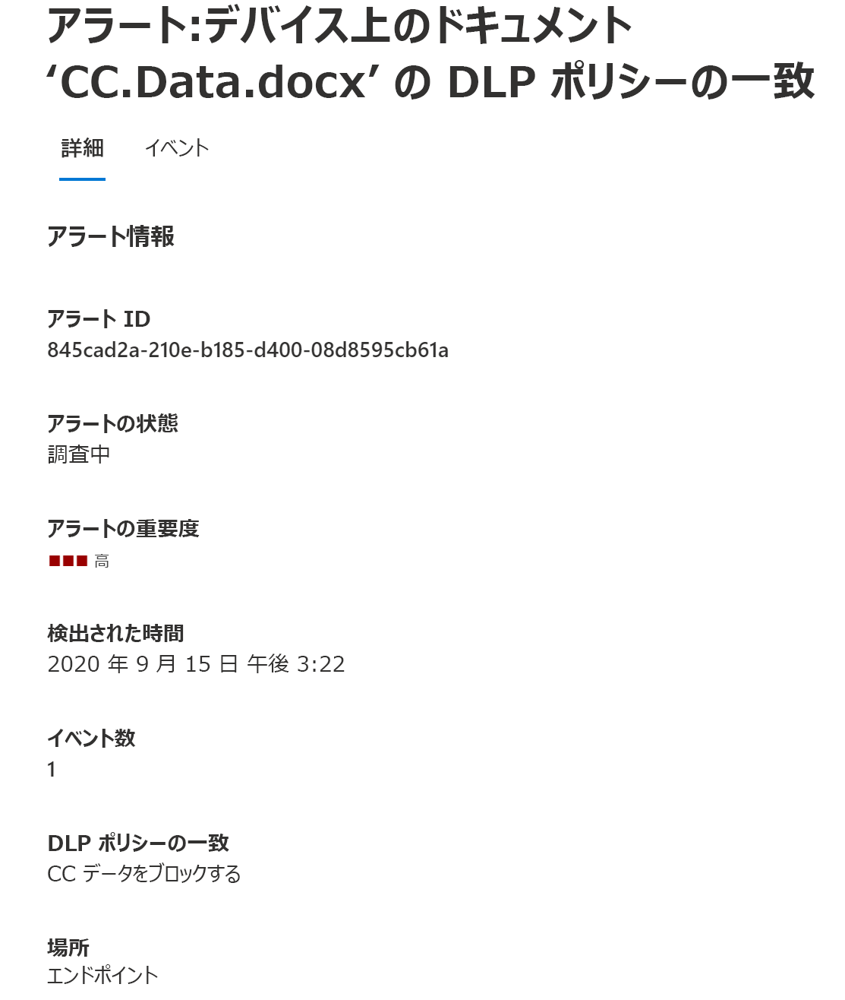
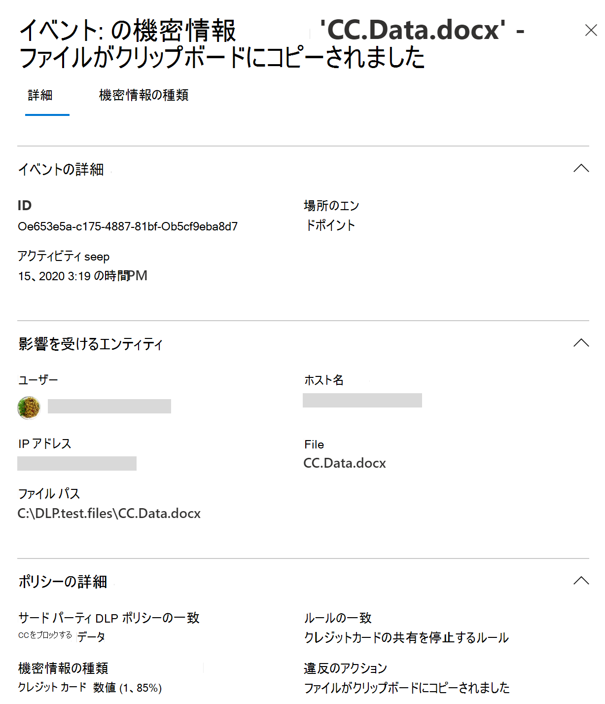
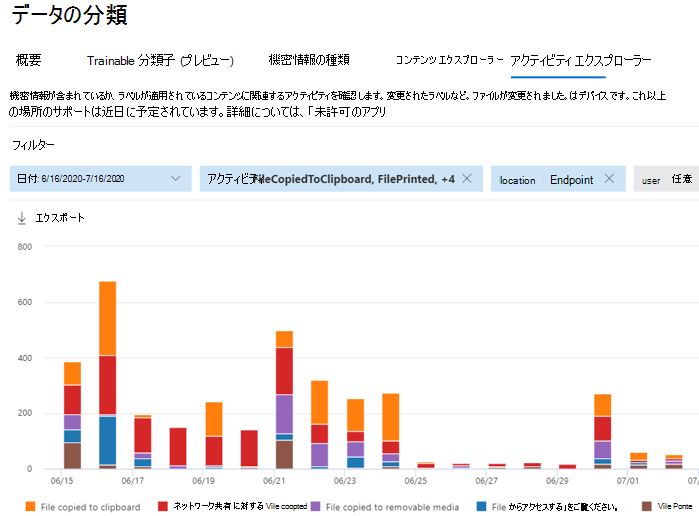

# Microsoft 365 のエンドポイントのデータ損失防止について説明する

Microsoft 365 のデータ損失防止 (DLP) を使用すると、機密があると判断されたアイテムに対して、発生しているアクションを監視し、それらのアイテムの意図しない共有を防ぐことができます。 DLP の詳細については、「[データ損失防止ポリシーについて](dlp-learn-about-dlp.md)」を参照してください。

**エンドポイント データ損失防止** (Endpoint DLP) は、DLP のアクティビティ監視および保護能力を、Windows 10、Windows 11、および macOS (Catalina 10.15 以上) デバイスに物理的に保存される機密アイテムに拡張します。 デバイスが、 Microsoft 365 コンプライアンス ソリューションに オンボードすると、機密アイテムを使用してユーザーが行っていることに関する情報が[Activity Explorer](data-classification-activity-explorer.md)に表示され、[DLPポリシー](create-test-tune-dlp-policy.md)を通して、それらのアイテムに保護アクションを適用できます。

> [!TIP]
> リムーバブル記憶域のデバイス コントロールを探している場合は、「[Microsoft Defender for Endpoint Device Control のリムーバブル記憶域アクセス制御](../security/defender-endpoint/device-control-removable-storage-access-control.md#microsoft-defender-for-endpoint-device-control-removable-storage-access-control)」 を参照してください。

> [!NOTE]
> Microsoft 365 コンプライアンスでは、機密項目の DLP ポリシー評価が一元的に行われるため、ポリシーとポリシー更新が個々のデバイスに配布されるまでのタイム ラグはありません。 コンプライアンス センターでポリシーが更新されると、それらの更新がサービス全体で同期されるまでに通常約 1 時間かかります。 ポリシーの更新が同期されると、対象のデバイス上のアイテムは、次回アクセスまたは変更されたときに自動的に再評価されます。

## 監視と対処が必要なエンドポイントのアクティビティ

Microsoft Endpoint DLP を使用すると、ユーザーが物理的に Windows 10、Windows 11、または macOS デバイスに保存されている機密アイテムに対して行う次の種類のアクティビティを監査および管理できます。

|最新情報 |説明  |Windows 10、1809 以降、Windows 11| macOS Catalina 10.15 (プレビュー) | 監査可能/制限可能|
|---------|---------|---------|---------|---------|
|クラウド サービスへのアップロード、または許可されていないブラウザーによるアクセス    | ユーザーが制限されたサービス ドメインにアイテムをアップロードしようとした場合、またはブラウザーを介してアイテムにアクセスしようとした場合に検出します。  DLP に許可されていないブラウザーとしてリストされているブラウザーを使用している場合、アップロード アクティビティがブロックされ、ユーザーは Microsoft Edge を使用するようにリダイレクトされます。 その後、Microsoft Edge は、DLP ポリシー構成に基づいて、アップロードまたはアクセスを許可またはブロックします         |サポートされる | サポートされる|監査可能/制限可能|
|他のアプリへのコピー    |ユーザーが保護されたアイテムから情報をコピーし、他のアプリ、プロセス、またはアイテムに貼り付けようとした場合に検出します。 同一のアプリ、プロセス、またはアイテム内での情報のコピーと貼り付けは、このアクティビティでは検出されません。|サポートされる|サポートされる         | 監査可能/制限可能|
|USB リムーバブル メディアへのコピー |ユーザーがアイテムまたは情報をリムーバブル メディアまたは USB デバイスにコピーしようとした場合に検出します。|サポートされる|サポートされる         | 監査可能/制限可能|
|ネットワーク共有へのコピー    |ユーザーがアイテムをネットワーク共有またはマップされたネットワーク ドライブにコピーしようとした場合に検出します |サポートされる|サポートされる         |監査可能/制限可能|
|ドキュメントの印刷    |ユーザーが保護されたアイテムをローカル プリンターまたはネットワーク プリンターに出力しようとした場合に検出します。|サポートされる|サポートされる|監査可能/制限可能         |
|リモート セッションにコピーする|ユーザーがアイテムをリモート デスクトップセッションにコピーしようとしたことを検出します |サポート対象|サポートなし|  監査可能/制限可能|
|Bluetooth デバイスにコピーする|ユーザーがアイテムを許可されていない Bluetooth アプリにコピーしようとしたことを検出します (エンドポイント DLP 設定の許可されていない Bluetooth アプリのリストで定義されています)。|サポート対象|サポートなし| 監査可能/制限可能|
|アイテムの作成|ユーザーがアイテムを作成した場合に検出します|サポート対象 | |監査可能|
|アイテムの名前の変更|ユーザーがアイテムの名前を変更した場合に検出します|サポート対象 | |監査可能|

## 監視対象ファイル

エンドポイント DLP は、これらのファイルの種類の監視をサポートしています。 DLP は、ポリシーの一致がない場合でも、これらのファイルの種類のアクティビティを監査します。 

- Word ファイル
- PowerPoint ファイル
- Excel ファイル
- PDF ファイル
- .csv ファイル
- .tsv ファイル
- .txt ファイル
- .rtf ファイル
- .c ファイル
- .class ファイル
- .cpp ファイル
- .cs ファイル
- .h ファイル
- .java ファイル
 
ポリシーの一致からのデータの監視のみが必要な場合は、エンドポイント DLP グローバル設定で **[デバイスのファイル アクティビティを常に監査する]** をオフにすることができます。

> [!NOTE]
> **デバイスのファイル アクティビティを常に監査する** の設定がオンの場合、デバイスがポリシーの対象になっていない場合でも、Word、PowerPoint、Excel、PDF、および .csv ァイルでのアクティビティは常に監査されます。

> [!TIP]
> サポートされているすべてのファイルの種類についてアクティビティが監査されるようにするには、[カスタム DLP ポリシー](create-test-tune-dlp-policy.md)を作成します。

エンドポイント DLP は MIME の種類に基づいてアクティビティを監視するため、ファイルの拡張子が変更されてもアクティビティはキャプチャされます。

## エンドポイント DLP との違い

エンドポイント DLP を掘り下げる前に知っておく必要がある追加の概念がいくつかあります。

### デバイス管理を有効にする

デバイス管理は、デバイスからテレメトリを収集できる機能です。これは、エンドポイント DLP や [インサイダー リスク管理](insider-risk-management.md)などの 365 Microsoft のコンプライアンスソリューションに導入する機能です。 DLP ポリシーの場所として使用するすべてのデバイスをオンボードする必要があります。

> [!div class="mx-imgBorder"]
> 

オンボードとオフボードは、デバイス管理センターからダウンロードするスクリプトを通して処理されます。 センターには、次の展開方法ごとにカスタムスクリプトがあります：

- ローカルスクリプト (最大10台のマシン)
- グループ ポリシー
- System Center Configuration Manager （ バージョン 1610以降 ）
- Mobile Device Management/Microsoft Intune
- 非永続的マシン用の VDI のオンボードスクリプト

> [!div class="mx-imgBorder"]
> 

 デバイスをオンボードにするには、[Microsoft 365 エンドポイント DLPの使用を開始する](endpoint-dlp-getting-started.md)の手順を使用します。

[Microsoft Defender for Endpoint](/windows/security/threat-protection/) を介してデバイスをオンボードした場合、それらのデバイスは自動的にデバイスの一覧に表示されます。 **デバイスの監視をオン** にして、エンドポイント DLP を使用できます。

> [!div class="mx-imgBorder"]
> 

### エンドポイント DLP データの表示

[DLP 警告管理ダッシュボード](dlp-configure-view-alerts-policies.md)に移動すると、エンドポイント デバイスに適用されている DLP ポリシーに関連する警告を表示できます。

> [!div class="mx-imgBorder"]
> 

同じダッシュボードで、リッチ メタデータに関連付けられたイベントの詳細を表示することもできます

> [!div class="mx-imgBorder"]
> 

デバイスがオンボードされると、場所としてデバイスを使用する DLP ポリシーを構成し、展開する前でも、監査されたアクティビティに関する情報がアクティビティエクスプローラーに流れます。

> [!div class="mx-imgBorder"]
> 

エンドポイント DLP は、監査済みアクティビティに関する広範囲にわたる情報を収集します。

たとえば、ファイルがリムーバブル USB メディアにコピーされた場合、アクティビティの詳細に次の属性が表示されます：

- アクティビティの種類
- クライアント IP
- 対象ファイルのパス
- 発生したタイムスタンプ
- ファイル名
- ユーザー
- ファイル拡張子
- ファイル サイズ
- 機密情報の種類（該当する場合）
- sha1 値
- sha256 値
- 以前のファイル名
- 場所
- 親
- FilePath
- ソースの場所の種類
- platform
- デバイス名
- 場所の宛先の種類
- コピーを実行したアプリケーション
- Microsoft Defender for Endpoint デバイス ID (該当する場合)
- リムーバブルメディアデバイスの製造元
- リムーバブルメディアデバイスのモデル
- リムーバブルメディアデバイスのシリアル番号

> [!div class="mx-imgBorder"]
> 

## 次の手順

ここまでエンドポイント DLP について学びましたので、次のステップの手順は以下になります：

1. [Windows 10 または Windows 11 デバイスを Microsoft 365 にオンボードする概要](device-onboarding-overview.md)
1. [Microsoft 365 への macOS デバイスのオンボードに関する概要 (プレビュー)](device-onboarding-macos-overview.md#onboard-macos-devices-into-microsoft-365-overview-preview)
1. [Microsoft エンドポイント データ損失防止を使用する](endpoint-dlp-using.md)

## 関連項目

- [Microsoft エンドポイント データ損失防止を開始する](endpoint-dlp-getting-started.md)
- [Microsoft エンドポイント データ損失防止を使用する](endpoint-dlp-using.md)
- [データ損失防止について](dlp-learn-about-dlp.md)
- [DLP ポリシーの作成、テスト、調整](create-test-tune-dlp-policy.md)
- [Activity Explorer を使い始める](data-classification-activity-explorer.md)
- [Microsoft Defender for Endpoint](/windows/security/threat-protection/)
- [インサイダー リスク管理](insider-risk-management.md)
