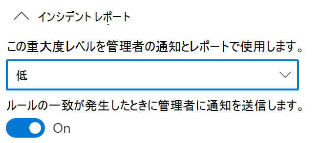
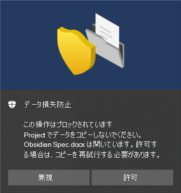

# エンドポイント データ損失防止の使用

この記事では、デバイスを場所として使用する DLP ポリシーを作成および変更する 4 つのシナリオについて説明します。

## DLP の設定

開始する前に、DLP 設定を設定する必要があります。 設定は、デバイスのすべての DLP ポリシーに適用されます。 実施するポリシーを作成する場合は、次のようにこれらを設定する必要があります。

- クラウド出口制限
- 許可しないアプリの制限

または

- 監視対象外のファイル パスを除外する場合

  > [!div class="mx-imgBorder"]
  > 

### 高度な分類のスキャンと保護

#### 登録する

この機能にアクセスするには、テナントを Microsoft に登録する必要があります。 まず、[登録](https://aka.ms/Ignite2021DLP)します。

有効にすると、**高度な分類のスキャンと保護** により、高度な Microsoft 365 クラウドベースのデータ分類サービスで項目をスキャンし、分類し、結果をローカル コンピューターに返すことができます。 つまり、DLP ポリシーで [厳密なデータ一致](create-custom-sensitive-information-types-with-exact-data-match-based-classification.md) 分類、[名前付きエンティティ (プレビュー)](named-entities-learn.md#learn-about-named-entities-preview) 分類手法を利用できるということです。

高度な分類では、コンテンツはスキャンと分類のためにローカル デバイスからクラウド サービスに送信されます。 帯域幅の使用率が懸念される場合は、このグローバル設定で、24 時間のローリングで使用できる量に関して、デバイスごとに適用される制限を設定できます。 帯域幅使用率の制限を設定し、それを超えた場合、DLP はユーザー コンテンツのクラウドへの送信を停止し、データ分類はデバイス上でローカルに続行されます。 累積帯域幅使用率がローリング 24 時間の制限を下回ると、クラウド サービスとの通信が再開されます。

帯域幅の使用率が問題でない場合は、制限を設定することはできず、無制限の使用率を許可することになります。

これらの Windows バージョンは、高度な分類スキャンと保護をサポートしています。

- Windows 10 バージョン 20H1/20H2/21H1 (KB 5006738)
- Windows 10 バージョン 19H1/19H2 (KB 5007189)
- Windows 10 RS5 (KB 5006744)

> [!NOTE]
> DLP ポリシーの評価は、ユーザー コンテンツが送信されていない場合でも、常にクラウドで行われます。

### エンドポイント DLP Windows 10 と macOS の設定

macOS サポートにアクセスするには、テナントを Microsoft に登録する必要があります。 まず、[登録](https://aka.ms/EndpointDLPIgnite21-Previews)します。

|Setting |Windows 10, 1809 以降  |macOS Catalina 10.15 以降 (プレビュー)  |メモ  |
|---------|---------|---------|---------|
|ファイルパスの除外     |サポート         |サポート         |macOS には、既定でオンになっている除外の推奨リストが含まれています          |
|許可されていないアプリ     |サポート         |サポート         |         |
|許可されていない Bluetooth アプリ    |サポート         |サポートなし         |         |
|機密アイテムに対するブラウザーとドメインの制限      |サポート         |サポート         |         |
|エンドポイント DLP の追加設定     |サポート         |サポート         |macOS デバイスでは、既定の業務上の正当な理由のみがサポートされます         |
|デバイスのファイル アクティビティを常に監査する     |サポート         |サポート         |         |

### ファイルパスの除外

[コンプライアンス センター](https://compliance.microsoft.com) > **データ損失防止** > **エンドポイント DLP 設定** > **ファイル パスの除外** を開きます。

DLP うるさすぎ、関心のあるファイルが含まれないので、デバイス上のDLP 監視、DLP 警告、および DLP ポリシー適用から特定のパスを除外したくなることがあります。 これらの場所にあるファイルは監査されず、その場所で作成または変更されたファイルは、DLP ポリシー適応の対象になりません。 DLP 設定では、パスを除外するように構成できます。

#### Windows 10 デバイス

このロジックを使用して、Windows 10 デバイスの除外パスを作成できます。

- 有効なファイルパスが ' \ ' で終わっている場合は、フォルダーの直下にあるファイルだけになります。  例: C:\Temp\

- 有効なファイルパスが ‘\*’で終わっている場合は、そのフォルダーの直下のファイルという以外に、サブフォルダーの直下にあるファイルのみということになります。  例: C:\Temp\*

- 有効なファイルパスが ‘\’ または ‘\*’以外で終わっている場合は、フォルダーとすべてのサブフォルダーの直下にあるすべてのファイルになります。  例: C:\Temp

- 両側の ' \ ' の間にあるワイルドカードを使用したパス。  例: C:\Users\*¥ Desktop\

- 両側の ' \ ' の間にあるワイルドカードと' (数値) ' のあるパスは、サブフォルダーの正確な数を指定します。  例: C:\Users\*(1) \Downloads\

- システム環境変数を含むパス。  例: %SystemDrive%\Test\*

- 上記のすべての組み合わせ。  例: %SystemDrive%\Users\*\Documents\*(2) ¥ Sub\

#### macOS デバイス (プレビュー)

Windows 10 デバイスと同様に、macOS デバイスに独自の除外を追加できます。

- ファイル パスの定義では大文字と小文字が区別されないため、`User` は `user` と同じです。

- ワイルドカード値がサポートされています。 そのため、パス定義には、パスの中央またはパスの末尾に `*`を含めることができます。 例: `/Users/*/Library/Application Support/Microsoft/Teams/*`

#####  推奨されるファイル パスの除外 (プレビュー)

パフォーマンス上の理由から、エンドポイント DLP には、macOS デバイスに推奨されるファイル パスの除外の一覧が含まれています。 これらの除外は既定で有効になっています。 [**Mac の推奨ファイル パスの除外を含める**] トグルを切り替えることで、必要に応じて無効にできます。 この一覧には次のものが含まれます。

- /Applications/*
- /System/*
- /usr/*
- /Library/*
- /private/*
- /opt/*
- /Users/*/Library/Application Support/Microsoft/Teams/*

### 許可されていないアプリ

許可されていないアプリとは、DLP で保護されたファイルへのアクセスが許可されないアプリケーションの一覧です。 これは、Windows 10 および macOS デバイス で使用できます (プレビュー)。

ポリシーで **許可されていないアプリによるアクセス** の設定がオンで、許可されていない一覧にあるアプリが保護ファイルにアクセスしようとする場合、アクティビティは許可されるか、ブロックされるか、ブロックされるもののユーザーがこの制限を上書きできるかのいずれかになります。 すべてのアクティビティが監査され、アクティビティエクスプローラーで確認できます。

> [!IMPORTANT]
> 実行可能ファイルへのパスは含めず、実行可能ファイル名 (browser.exe など) のみを含めてください。

#### macOS デバイス (プレビュー)

Windows デバイスと同様に、macOS アプリが機密データにアクセスできないようにするには、**許可されていないアプリ** 一覧で定義します。 

> [!NOTE]
> クロス プラットフォーム アプリには、実行している OS のそれぞれに固有のパスを入力する必要があることに注意してください。

Mac アプリの完全なパスを検索するには:
1. macOS デバイスで、**アクティビティ モニター** を開きます。 制限するプロセスを見つけて、ダブルクリックします

2. [**ファイルとポートを開く]** タブを選択します。
  
3. アプリ名は、完全なパスの末尾にあります。

#### クラウド同期アプリから機密性の高いデータを保護する

*onedrive.exe* などのクラウド同期アプリによって機密性の高いアイテムがクラウドに同期されないようにするには、そのクラウド同期アプリを **許可しないアプリ** 一覧に追加します。 許可されていないクラウド同期アプリが、ブロックする DLP ポリシーで保護されたアイテムにアクセスしようとした場合は、 DLP が繰り返し通知を生成することがあります。 **許可されていないアプリ** の **自動検疫** オプションを有効にすることで、このような繰り返しの通知を防止することができます。  

##### 自動検疫 (プレビュー)

> [!NOTE]
> 自動検疫は Windows 10 でのみサポートされます

有効にした場合、許可されていないアプリが DLP で保護された機密性の高いアイテムにアクセスしようとした場合に、自動検疫が作動します。 自動検疫では、機密性の高いアイテムを管理者が構成済みのフォルダーに移動し、元のファイルの代わりにプレースホルダー **.txt** ファイルを残すことができます。 プレースホルダー ファイルでテキストを構成して、ユーザーにアイテムの移動先やその他の関連情報を伝えることができます。  

自動検疫を使用して、ユーザーや管理者に DLP 通知が無限に連鎖するのを防止することができます。 「[シナリオ 4: 自動検疫を使用して、クラウド同期アプリからの DLP 通知のループを回避する (プレビュー)](#scenario-4-avoid-looping-dlp-notifications-from-cloud-synchronization-apps-with-auto-quarantine-preview)」を参照してください。

### 許可されていない Bluetooth アプリ

ポリシーによって保護されているファイルを特定の Bluetooth アプリ経由でユーザーが転送できないようにします。

### 機密データに対するブラウザーとドメインの制限

ポリシーに一致する機密ファイルが、無制限のクラウド サービス ドメインと共有されるのを制限します。

#### 許可されていないブラウザー

実行可能ファイル名で識別された、クラウド サービスへのアップロードの制限がブロックまたは上書きのブロックに設定されている強制された DLP ポリシーの条件に一致するファイルへのアクセスがブロックされるブラウザーを追加します。 これらのブラウザーがファイルへのアクセスからブロックされている場合、エンドユーザーには、Edge Chromium 経由でファイルを開くように依頼するトースト通知が表示されます。

#### サービスドメイン

ポリシーによって保護されている機密ファイルを Microsoft Edge の特定のサービス ドメインにアップロードできるかどうかを制御できます。

リストモードが **ブロック** に設定されている場合、ユーザーは、これらのドメインに機密アイテムをアップロードできません。 アイテムが DLP ポリシーと一致するためにアップロードアクションがブロックされた場合、DLP が警告を生成するか、機密アイテムのアップロードをブロックします。

リスト モードが **許可** に設定されている場合、ユーザーはこれらのドメイン **_限定_** で機密アイテムをアップロードでき、その他すべてのドメインへのアップロードは制限されます。

> [!IMPORTANT]
> サービス制限モードが "許可" に設定されている場合、制限を適用する前に、少なくとも 1 つのサービス ドメインを構成する必要があります。

### エンドポイント DLP の追加設定

#### ポリシー ヒントでの業務上の正当な理由

DLP ポリシー ヒントの通知で、ユーザーによる業務上の正当な理由オプションの操作を制御します。 このオプションは、DLP ポリシーの **[オーバーライド付きブロック]** 設定で保護されているアクティビティをユーザーが実行したときに表示されます。 これはグローバル設定です。 以下のいずれかのオプションを選択できます。

- **既定のオプションとカスタム テキスト ボックスを表示する**: 既定では、ユーザーは組み込みの業務上の正当な理由を選択するか、独自のテキストを入力できます。
- **既定のオプションのみを表示** する : ユーザーは、組み込みの業務上の正当な理由のみを選択できます。
- **カスタム テキスト ボックスのみを表示する**: ユーザーは、自分自身の正当な理由のみを入力できます。 エンド ユーザー ポリシー ヒント通知には、テキスト ボックスだけが表示されます。 

##### ドロップダウン メニューのオプションのカスタマイズ

**[オプションのカスタマイズ] ドロップダウン メニュー** を選択すると、ユーザーがポリシー通知ヒントを操作するときに表示される最大 5 つのカスタマイズされたオプションを作成できます。 

|オプション |既定のテキスト  |
|---------|---------|
|オプション 1    | **これは、確立されたビジネス ワークフローの一部です**  または、カスタマイズされたテキストを入力できます        |
|オプション 2  |**マネージャーがこのアクションを承諾します** または、カスタマイズされたテキストを入力できます         |
|オプション 3   |**緊急アクセスが必要です。自分のマネージャーに別途通知を送信します** または、カスタマイズされたテキストを入力できます          |
|誤検知オプションの表示     |**これらのファイルの情報は機密情報ではありません** または、カスタマイズされたテキストを入力できます          |
|オプション 5    |**その他** または、カスタマイズされたテキストを入力できます         |

<!--See, [Scenario 5: Configure a policy to use the customized business justification](#scenario-5-configure-a-policy-to-use-the-customized-business-justification)-->

### デバイスのファイル アクティビティを常に監査する

既定では、デバイスがオンボードされると、Office、PDF、CSV ファイルのアクティビティが自動的に監査され、アクティビティ エクスプローラーで確認できるようになります。 オンボーディングされたデバイスがアクティブなポリシーに含まれている場合にのみ、このアクティビティを監査する場合は、この機能をオフにします。

ファイル アクティビティは、アクティブ ポリシーに含まれているかどうかに関係なく、常にオンボードされたデバイスで監査されます。

## DLP 設定の結合

エンドポイント DLP および Microsoft Edge Chromium Web ブラウザーを使用すると、許可されていないクラウドアプリとサービスで意図しない機密アイテムの共有を制限できます。 Microsoft Edge Chromium では、アイテムがエンドポイント DLP ポリシーによって制限される場合を把握して、、アクセス制限を適用しています。

正常に構成されている DLP ポリシーと Microsoft Edge Chromium ブラウザーがある場所としてエンドポイント DLP を使用する場合、これらの設定で定義されている許可されていないブラウザーは、DLP ポリシーコントロールに一致する機密アイテムへアクセスできません。 その代わりに、ユーザーは Microsoft Edge Chromium を使用するようにリダイレクトされます。DLP ポリシーが適応される制限を把握することで、DLP ポリシーの条件が満たされた場合にアクティビティをブロックまたは制限することができます。

この制限を使用するには、次の 3 つの重要な要素を構成する必要があります。

1. 機密アイテムの共有を禁止する場所 (サービス、ドメイン、IP アドレス) を指定します。

2. DLP ポリシーが一致した場合に、特定の機密アイテムへのアクセスを許可しないブラウザーを追加します。

3. **クラウドサービスへアップロード** と **許可していないブラウザーからのアクセス** の設定をオンにし、DLP ポリシーを構成してから、これらの場所でアップロードを制限する機密アイテムの種類を定義します。

新しいサービス、アプリ、およびポリシーを継続的に追加して、制限を拡張、強化しながら、ビジネスへのニーズを満たし機密データを保護できます。 

この構成により、データが安全に維持でき、ユーザーが機密情報以外のアイテムにアクセスしたり、共有したりすることを禁止または制限する不必要な制約も回避できます。

## エンドポイント DLP ポリシーシナリオ

エンドポイント DLP 機能、および DLP ポリシーで表示される方法を把握するために、いくつかのシナリオをまとめてましたので、確認してください。

> [!IMPORTANT]
> これらのエンドポイント DLP シナリオは、DLP ポリシーの作成と調整に関する公式な手順ではありません。 一般的な状況で DLP ポリシーを使用する必要がある場合は、次のトピックを参照してください。

>- [データ損失防止について](dlp-learn-about-dlp.md)
>- [DLP の既定ポリシーの概要](get-started-with-the-default-dlp-policy.md)
>- [テンプレートから DLP ポリシーを作成する](create-a-dlp-policy-from-a-template.md)
>- [DLP ポリシーの作成、テスト、調整](create-test-tune-dlp-policy.md)

### シナリオ 1: テンプレートからポリシーを作成 (監査のみ)

これらのシナリオでは、デバイスが既にオンで、アクティビティエクスプローラーに報告されている必要があります。 まだデバイスをオンにしていない場合は、[エンドポイントのデータ損失防止 (プレビュー) を開始](endpoint-dlp-getting-started.md)を参照してください。

1. [データ損失防止ポリシー ページ](https://compliance.microsoft.com/datalossprevention?viewid=policies)を開きます。

2. **[ポリシーの作成]** を選びます。

3. このシナリオでは、**[プライバシー]** を選択して、"**米国の個人情報 (PII) データ**" を選んでから、**[次へ]** を選びます。

4. **状態** フィールドを **デバイス** を除くすべての場所でオフにします。 **[次へ]** を選択します。

5. 規定の **確認してテンプレートから設定をカスタマイズ** の選択を承認して、**次へ** を選択します。

6. 既定の **保護アクション** の値を承認して、**次へ** を選択します。

7. **Windows デバイスのアクティビティを監査または制限** を選択して、**監査のみ** に設定されたアクションはそのままにしておきます。 **[次へ]** を選択します。

8. 規定の **初めにテストします** を承認し、**テストモードでポリシーのヒントを表示** を選択します。 **[次へ]** を選択します。

9. 設定を確認し、**送信** を選択します。

10. 新しい DLP ポリシーがポリシー一覧に表示されます。

11. 監視対象エンドポイントのデータのアクティビティエクスプローラーを確認します。 デバイスがある場所のフィルターを設定し、ポリシーを追加してから、ポリシー名でフィルター処理を行って、このポリシーの影響を確認します。 必要に応じて、[アクティビティ エクスプローラーの使用を開始](data-classification-activity-explorer.md)を参照してください。

12. 組織外のユーザーと米国の個人情報 (PII) データの条件をトリガーするコンテンツを含むテストを共有。 これによって、ポリシーがトリガーされます。

13. イベントのアクティビティエクスプローラーを確認します。

### シナリオ 2: 既存のポリシーを変更し、通知を設定

1. [データ損失防止ポリシー](https://compliance.microsoft.com/datalossprevention?viewid=policies)を開く。

2. シナリオ １ で作成した **米国の個人情報 (PII) データ** ポリシーを選択します。

3. **[ポリシーの編集]** を選びます。

4. **詳細な DLP ルール** ページに移動し、**米国の個人を特定できる情報が検出された低ボリュームのコンテンツ** を編集します。

5. **インシデントリポート** セクションまでスクロールして、**ルールが一致する場合、管理者に通知を送信** を **オン** に設定します。 メールの通知は、管理者と、受信者のリストに追加する他のユーザーに自動的に送信されます。 

   > [!div class="mx-imgBorder"]
   > 
   
6. このシナリオの目的で、**アクティビティーがこのルールに一致する度に通知を送信** を選択します。

7. **[保存]** を選択します。

8. **次へ** を選択して、ポリシーの変更を **送信** を選択することで、すべての前の設定を保持します。

9. 組織外のユーザーと米国の個人情報 (PII) データの条件をトリガーするコンテンツを含むテストを共有。 これによって、ポリシーがトリガーされます。

10. イベントのアクティビティエクスプローラーを確認します。

### シナリオ 3: 既存のポリシーを変更し、上書きを許可する操作をブロック

1. [データ損失防止ポリシー](https://compliance.microsoft.com/datalossprevention?viewid=policies)を開く。

2. シナリオ １ で作成した **米国の個人情報 (PII) データ** ポリシーを選択します。

3. **[ポリシーの編集]** を選びます。

4. **詳細な DLP ルール** ページに移動し、**米国の個人を特定できる情報が検出された低ボリュームのコンテンツ** を編集します。

5. **Windows デバイスでアクティビティを監査または制限** セクションまでスクロールして、アクティビティごと対応するアクションに **上書きをブロック** を設定します。

   > [!div class="mx-imgBorder"]
   > 
   
6. **[保存]** を選択します。

7. **米国の個人情報が検出された大量のコンテンツ** の手順4から手順７を繰り返します。

8. **次へ** を選択して、ポリシーの変更を **送信** を選択することで、すべての前の設定を保持します。

9. 組織外のユーザーと米国の個人情報 (PII) データの条件をトリガーするコンテンツを含むテストを共有。 これによって、ポリシーがトリガーされます。

   クライアントデバイスに次のようなポップアップが表示されます。

   > [!div class="mx-imgBorder"]
   > 

10. イベントのアクティビティエクスプローラーを確認します。

### シナリオ 4: 自動検疫を使用して、クラウド同期アプリからの DLP 通知のループを回避する (プレビュー)

#### 始める前に

このシナリオでは、**非常に機密性の高い社外秘** の秘密度ラベルを持つファイルの OneDrive への同期がブロックされます。 これは、複数のコンポーネントと手順からなる複雑なシナリオです。 以下が必要です。

- 対象となる AAD ユーザー アカウントと、ローカルの OneDrive フォルダーと OneDrive クラウド ストレージをすでに同期させているオンボード済みの Windows 10 コンピューター。
- 対象の Windows 10 コンピューターにインストールされた Microsoft Word
- 秘密度ラベルが構成され、発行されました。「[秘密度ラベルの使用を開始する](get-started-with-sensitivity-labels.md#get-started-with-sensitivity-labels)」および「[秘密度ラベルとそのポリシーを作成して構成する](create-sensitivity-labels.md#create-and-configure-sensitivity-labels-and-their-policies)」を参照してください。

3 つの手順があります。

1. エンドポイント DLP の自動検疫設定を構成します。
2. **非常に機密性の高い社外秘** の秘密度ラベルが付けられた機密性の高いアイテムをブロックするポリシーを作成します。
3. ポリシーの対象となる Windows 10 デバイスで Word ドキュメントを作成し、ラベルを適用して、同期されるユーザー アカウントのローカル OneDrive フォルダーにコピーします。  

#### エンドポイント DLP の許可されていないアプリと自動検疫設定を構成する

1. [[エンドポイント DLP 設定]](https://compliance.microsoft.com/datalossprevention?viewid=globalsettings) を開きます

2. **[許可されていないアプリ]** を展開します。

3. **[許可されていないアプリの追加または編集]** を選択し、表示名に *[OneDrive]*、実行名に *[onedrive.exe]* を追加して、onedrive.exe が「**非常に機密性の高い社外秘**」ラベルのアイテムにアクセスできないようにします。

4. **[自動検疫]** を選んでから **[保存]** を選びます。

5. **[自動検疫設定]** で **[自動検疫設定の編集]** を選びます。

6. **[許可されていないアプリへの自動検疫]** を有効にします。

7. オリジナルの機密ファイルを移動させるローカル マシン上のフォルダーへのパスを入力します。次に例を示します。
   
ユーザー名 *Isaiah langer* 向けの **'%homedrive%%homepath%\Microsoft DLP\Quarantine'** は、移動済みアイテムを配置します 

*C:\Users\IsaiahLanger\Microsoft DLP\Quarantine\OneDrive* フォルダーと、元のファイル名への日時スタンプの追加。

> [!NOTE]
> DLP 自動検疫では、許可されていないアプリごとにファイルのサブフォルダーが作成されます。 つまり、許可されていないアプリの一覧に *Notepad* と *OneDrive* の両方が入っている場合、**\OneDrive** 用のサブフォルダーと **\Notepad** 用のサブフォルダーが作成されます。

8. **[次のテキストを含む .txt ファイルでファイルを置き換える]** を選択し、プレースホルダー ファイルに必要なテキストを入力します。たとえば、*auto quar 1.docx* という名前のファイルの場合:
    
**%%FileName%% には、組織がデータ損失防止 (DLP) ポリシーで保護している %%PolicyName%% が含まれ、検疫フォルダー %%QuarantinePath%% に移動されました。** 

は、以下のメッセージを含む .txt ファイルを残します

*auto quar 1.docx には、組織でデータ損失防止 (DLP) ポリシーで保護されている機密情報が含まれており、検疫フォルダー「C:\Users\IsaiahLanger\Microsoft DLP\Quarantine\OneDrive\auto quar 1_20210728_151541.docx」に移動されました。*

9. **[保存]** を選択します。

#### 秘密度ラベルが「非常に機密性の高い社外秘」であるファイルの OneDrive 同期をブロックするポリシーを構成します。

1. [データ損失防止ポリシー ページ](https://compliance.microsoft.com/datalossprevention?viewid=policies)を開きます。

2. **[ポリシーの作成]** を選びます。

3. このシナリオでは、**[カスタム]** を選択し、**[カスタム ポリシー]** を選択して、**[次へ]** を選択します。

4. **[名前]** フィールドおよび **[説明]** フィールドに入力し、**[次へ]** を選択します。

5. **状態** フィールドを **デバイス** を除くすべての場所でオフにします。 テストする特定のエンド ユーザー アカウントがある場合は、必ず範囲内で選択してください。 **次へ** を選択します。

6. 既定の **[高度な DLP ルールの作成またはカスタマイズ]** の選択を承諾し、**[次へ]** を選択します。

7. 以下の値でルールを作成します。
    1. **[名前]** > *[シナリオ 4 自動検疫]*
    1. **[条件]** > **[コンテンツに含まれている]** > **[秘密度ラベル]** > **[非常に機密性の高い社外秘]**
    1.  **[アクション]** > **[Windows デバイス上のアクティビティの監査または制限]** > **[許可されていないアプリでアクセス]** > **[ブロック]**。 このシナリオでは、他のアクティビティをすべてクリアします。
    1. **[ユーザー通知]** > **[オン]**
    1. **[エンドポイント デバイス]** から、**[アクティビティの場合にユーザーにポリシー ヒント通知を表示する]** がまだ有効になっていない場合は選択します。
    
8. **[保存]**、**[次へ]** を選択します。

9. **[すぐにオンにする]** を選択します。**[次へ]** を選択します。

10. 設定を確認し、**送信** を選択します。

> [!NOTE]
> 新しいポリシーが複製され、対象の Windows 10 コンピューターに適用されるまで 1 時間以上かかります。

11. 新しい DLP ポリシーがポリシー一覧に表示されます。

#### Windows 10 デバイスでの自動検疫のテスト

1. 「[秘密度ラベルが「非常に機密性の高い社外秘」であるファイルの OneDrive 同期をブロックするポリシーを構成します](#configure-a-policy-to-block-onedrive-synchronization-of-files-with-the-sensitivity-label-highly-confidential)」の手順 5 で指定したユーザー アカウントを使用して Windows 10 コンピューターにログインします。

2. 内容が OneDrive に同期されないフォルダーを作成します。次に例を示します。

    *C:\auto-quarantine ソース フォルダー*

3. Microsoft Word を開き、自動検疫ソース フォルダーにファイルを作成します。 「**非常に機密性の高い社外秘**」秘密度ラベルを適用します。 「[Office 内のファイルやメールに秘密度ラベルを適用する](https://support.microsoft.com/topic/apply-sensitivity-labels-to-your-files-and-email-in-office-2f96e7cd-d5a4-403b-8bd7-4cc636bae0f9)」を参照してください。

4. 作成したばかりのファイルを、OneDrive 同期フォルダーにコピーします。 アクションが許可されておらず、ファイルが検疫される予定であることを伝えるユーザー通知トーストが表示されます。 たとえば、ユーザー名「*Isaiah Langer*」、タイトル「*auto-quarantine doc 1.docx*」のドキュメントの場合、次のようなメッセージが表示されます。

メッセージは以下のとおりです。

「autoquarantine doc 1.docx をこのアプリで開くことは許可されていません。 このファイルは 'C:\Users\IsaiahLanger\Microsoft DLP\OneDrive' に検疫されます」

5. **[無視]** を選択します

6. プレース ホルダー .txt ファイルを開きます。 **auto-quarantine doc 1.docx_ *date_time*.txt** という名前が付けられます。 

7. 検疫フォルダーを開き、元のファイルがそこにあることを確認します。
 
8. 監視対象エンドポイントのデータのアクティビティエクスプローラーを確認します。 デバイスがある場所のフィルターを設定し、ポリシーを追加してから、ポリシー名でフィルター処理を行って、このポリシーの影響を確認します。 必要に応じて、[アクティビティ エクスプローラーの使用を開始](data-classification-activity-explorer.md)を参照してください。

9. イベントのアクティビティエクスプローラーを確認します。

## 関連項目

- [エンドポイント データ損失防止について](endpoint-dlp-learn-about.md)
- [エンドポイント データ損失防止を開始する](endpoint-dlp-getting-started.md)
- [データ損失防止について](dlp-learn-about-dlp.md)
- [DLP ポリシーの作成、テスト、調整](create-test-tune-dlp-policy.md)
- [Activity Explorer を使い始める](data-classification-activity-explorer.md)
- [Microsoft Defender for Endpoint](/windows/security/threat-protection/)
- [Windows 10 マシン用のオンボーディングツールとメソッド](/microsoft-365/compliance/dlp-configure-endpoints)
- [Microsoft 365 サブスクリプション](https://www.microsoft.com/microsoft-365/compare-microsoft-365-enterprise-plans?rtc=1)
- [Azure Active Directory (AAD) が参加しました](/azure/active-directory/devices/concept-azure-ad-join)
- [Chromium ベースの新しい Microsoft Edge をダウンロードする](https://support.microsoft.com/help/4501095/download-the-new-microsoft-edge-based-on-chromium)
- [DLP の既定ポリシーの概要](get-started-with-the-default-dlp-policy.md)
- [テンプレートからの DLP ポリシーの作成](create-a-dlp-policy-from-a-template.md)
