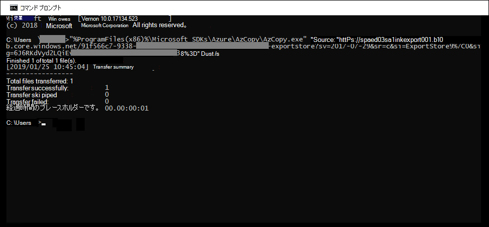
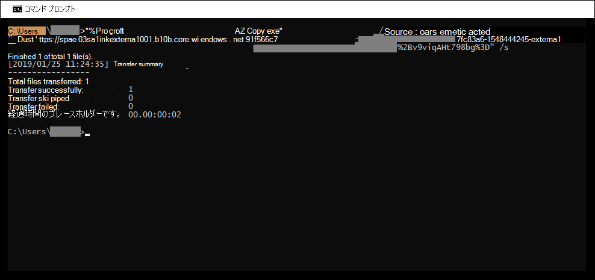

# データ処理中のエラー修復

エラー修復を使用すると、電子情報開示管理者は、ユーザーがコンテンツを適切に処理Advanced eDiscoveryデータの問題を修正できます。 たとえば、パスワードで保護されたファイルは、ファイルがロックまたは暗号化された後で処理できません。 エラー修復を使用して、電子情報開示管理者は、このようなエラーが発生したファイルをダウンロードし、パスワード保護を削除してから、修復されたファイルをアップロードできます。

次のワークフローを使用して、エラーが発生したファイルを修復Advanced eDiscoveryします。

## 処理エラーのあるファイルを修復するためのエラー修復セッションを作成する

> [!NOTE]
> 次の手順の間にエラー修復ウィザードがいつでも閉じている場合は、[表示] ドロップダウン メニューの [修復] を選択して、[処理]タブからエラー修復セッションに戻ります。 

1. Advanced eDiscoveryケースの [処理] タブで、[表示] ドロップダウンメニューの [エラー] を選択し、[スコープ] ドロップダウンメニューでレビュー セットまたはケース全体を選択します。  このセクションには、特定のレビューセットのケースやエラーのすべてのエラーが表示されます。

   

2. 修復するエラーを選択するには、エラーの種類またはファイルの種類の横にあるラジオ ボタンをクリックします。  次の例では、パスワードで保護されたファイルを修復します。

3. [新 **しいエラー修復] をクリックします**。

    エラー修復ワークフローは、エラーのあるファイルが Microsoft 提供の Azure Storage の場所にコピーされ、修復するためにローカル コンピューターにダウンロードできる準備段階から始まります。

    

4. 準備が完了したら、[次へ: ファイルの **ダウンロード] をクリックしてダウンロード** を続行します。

    

5. ファイルをダウンロードするには、 **ダウンロードの保存先パス** を指定します。 これは、ファイルをダウンロードするローカルコンピューター上の親フォルダーへのパスです。  既定のパス %USERPROFILE%\Downloads\errors は、ログインしているユーザーのダウンロード フォルダーをポイントします。 必要に応じて、このパスを変更できます。 変更する場合は、最適なパフォーマンスを得るローカル ファイル パスを使用することをお勧めします。 リモート ネットワーク パスを使用しない。 たとえば、パス **C:\修復を使用できます**。

   親フォルダーへのパスは、AzCopy コマンド (/Dest パラメーターの値として) **に自動的に追加** されます。

6. 定義済みコマンドをコピーするには **[クリップボードにコピー**] をクリックします。 コマンド プロンプトをWindowsし、AzCopy コマンドを貼り付け、Enter キーを **押します**。

    

    > [!NOTE]
    > [ファイルのダウンロード] ページで提供されているコマンドを正常に使用するには、AzCopy v8.1 を **使用する必要** があります。 手順 10 でファイルをアップロードするには、AzCopy v8.1 を使用する必要があります。 このバージョンの AzCopy をインストールするには、「AzCopy [v8.1](/previous-versions/azure/storage/storage-use-azcopy)を使用してデータを転送する」を参照Windows。 指定された AzCopy コマンドが失敗した場合は、「トラブルシューティング[AzCopy in Advanced eDiscovery」 を参照してください](troubleshooting-azcopy.md)。

    手順5で指定した場所に、選択したファイルがダウンロードされます。 親フォルダー(例: **C:\Remediation**) に、次のサブフォルダー構造が自動的に作成されます。

    `<Parent folder>\Subfolder 1\Subfolder 2\<file>`

    - *サブフォルダー 1* には、手順1で選択した範囲に応じて、ケースまたはレビューセットの ID の名前が付けられます。

    - *サブフォルダー 2* には、ダウンロードしたファイルのファイル ID が付いています。

    - ダウンロードしたファイルは *サブフォルダー 2* に保存され、ファイル ID で呼ばれます。

    アイテムを **C:\Remediation** 親フォルダーにダウンロードするときに作成されるフォルダー パスとエラー ファイル名の例を次に示します。

    `C:\Remediation\232f8b7e-089c-4781-88c6-210da0615d32\d1459499146268a096ea20202cd029857d64087706e6d6ca2a224970ae3b8938\d1459499146268a096ea20202cd029857d64087706e6d6ca2a224970ae3b8938.docx`

    複数のファイルがダウンロードされた場合、各ファイルは、ファイル ID で名前が付けられたサブフォルダーにダウンロードされます。

    > [!IMPORTANT]
    > 手順 9 と手順 10 でファイルをアップロードする場合、修復されたファイルは同じファイル名を持ち、同じサブフォルダー構造にある必要があります。 サブフォルダーとファイル名は、修復されたファイルを元のエラー ファイルに関連付けするために使用されます。 フォルダー構造またはファイル名が変更された場合は、次のエラーが表示されます `Cannot apply Error Remediation to the current Workingset` 。 問題を回避するには、修復されたファイルを同じ親フォルダーとサブフォルダー構造に保持することをお勧めします。

7. ファイルをダウンロードしたら、適切なツールで修復できます。 パスワードで保護されたファイルの場合、使用できるパスワード割れツールがいくつかあります。 ファイルのパスワードがわかっている場合は、ファイルを開いてパスワード保護を削除できます。

8. エラー修復ウィザードAdvanced eDiscoveryに戻り、[次へ: ファイルを開 **く] をアップロードします**。  これで、次のページに移動して、ファイルをアップロードできるようになります。

    

9. **[ファイルの場所へのパス]** テキストボックス内の修復されたファイルが保存されている親フォルダーを指定します。 ここでも、親フォルダーには、ファイルのダウンロード時に作成されたのと同じサブフォルダー構造が必要です。

    親フォルダーへのパスは、(/Source パラメーターの値として) AzCopy コマンド **に自動的に追加** されます。

10. 定義済みコマンドをコピーするには **[クリップボードにコピー**] をクリックします。 コマンド プロンプトをWindowsし、AzCopy コマンドを貼り付け、Enter キーを **押します**。 ファイルをアップロードします。

    

11. AzCopy コマンドを実行した後、[次へ: ファイルの処理 **] をクリックします**。

    処理が完了したら、セットを確認し、修復されたファイルを表示できます。

## コンテナー ファイルのエラーの修復

Advanced eDiscovery によってコンテナー ファイル (.zip ファイルなど) の内容を抽出できない場合は、コンテナーをダウンロードして、元のコンテナーが存在する同じフォルダーに展開できます。 展開されたファイルは、親コンテナーが最初に展開された場合と同様に親コンテナーにAdvanced eDiscovery。 このプロセスは、1 つのファイルを置換ファイルとしてアップロードする場合を除き、上記のように動作します。  修復されたファイルをアップロードする場合は、元のコンテナー ファイルを含めないことです。

## 抽出されたテキストをアップロードしてエラーを修復する

ファイルを解釈できるネイティブ形式に修復できないAdvanced eDiscovery場合があります。 ただし、元のファイルをネイティブ ファイルの元のテキストを含むテキスト ファイルに置き換えることができます (テキスト オーバーレイと呼ばれる *プロセス* で)。 これを行うには、この記事で説明する手順に従いますが、元のファイルをネイティブ形式で修復する代わりに、元のファイルから抽出されたテキストを含むテキスト ファイルを作成し、.txt サフィックスが付加された元のファイル名を使用してテキスト ファイルをアップロードします。 たとえば、ファイル名 335850cc-6602-4af0-acfa-1d14d9128ca2.abc でエラー修復中にファイルをダウンロードします。 ネイティブ アプリケーションでファイルを開き、テキストをコピーし、そのファイルを 335850cc-6602-4af0-acfa-1d14d9128ca2.abc.txt という名前の新しいファイルに貼り335850cc-6602-4af0-acfa-1d14d9128ca2.abc.txt。 これを行う場合は、修復されたテキスト ファイルを Advanced eDiscovery にアップロードする前に、ローカル コンピューターの修復されたファイルの場所からネイティブ形式の元のファイルを削除してください。

## ファイルが修復された場合の対応

修復されたファイルがアップロードされると、次のフィールドを除き、元のメタデータが保持されます。

- ExtractedTextSize
- HasText
- IsErrorRemediate
- LoadId
- ProcessingErrorMessage
- ProcessingStatus
- テキスト
- WordCount
- WorkingsetId

ドキュメント内のすべてのメタデータ フィールドの定義についてはAdvanced eDiscoveryドキュメント メタデータ フィールド[を参照してください](document-metadata-fields-in-advanced-ediscovery.md)。