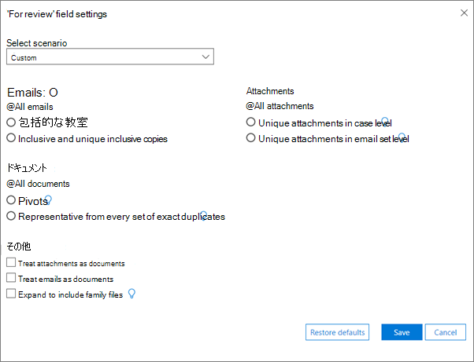
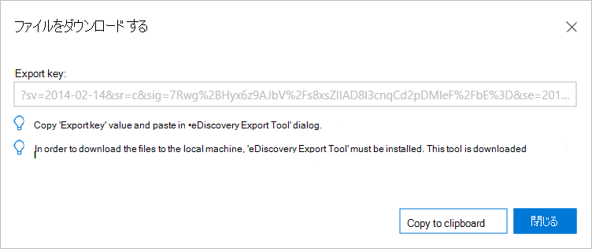

# Advanced eDiscovery (クラシック) で結果をエクスポートするExport results in Advanced eDiscovery (classic)

> [!NOTE]
> Advanced eDiscovery を使用するには、Advanced Compliance アドオンがインストールされた Office 365 E3 サブスクリプション、または E5 サブスクリプションがお客様の組織で必要になります。このプランを利用しておらず、Advanced eDiscovery をお試しになりたい場合は、[Office 365 Enterprise E5 の試用版にサインアップ](https://go.microsoft.com/fwlink/p/?LinkID=698279)してください。Advanced eDiscovery requires an Office 365 E3 with the Advanced Compliance add-on or an E5 subscription for your organization. If you don't have that plan and want to try Advanced eDiscovery, you can [sign up for a trial of Office 365 Enterprise E5](https://go.microsoft.com/fwlink/p/?LinkID=698279). 
  
このトピックでは、Advanced eDiscovery Export Setup オプションについて説明します。This topic describes the Advanced eDiscovery Export Setup options.
  
 **このトピックの内容****In this topic:**
  
- [エクスポート バッチとセッションの定義Defining export batches and sessions](export-results-in-advanced-ediscovery.md#BK_Define)
    
- [増分エクスポートと追加エクスポートIncremental and additional exports](export-results-in-advanced-ediscovery.md#BK_IncrementalReports)
    
- [バッチ エクスポート パラメーターを設定するSet up batch export parameters](export-results-in-advanced-ediscovery.md#BK_SetUpExport)
    
- [レポート出力ファイルをエクスポートするExport report output files](export-results-in-advanced-ediscovery.md#BK_ExportOutputFIles)
    
## エクスポート バッチとセッションの定義Defining export batches and sessions

エクスポート バッチを使用すると、一連の定義済みパラメーターを使用してエクスポート処理を実行できます。An export batch allows export processing using a set of defined parameters. Advanced eDiscovery を使用すると、バッチを定義して各エクスポートをカスタマイズできます。Advanced eDiscovery enables you to define batches to customize each export.
  
パラメーターはエクスポート バッチごとに定義されます。Parameters are defined per export batch. ケースの最初のバッチに対して、"Export batch 01" という名前のバッチが既定で作成されます。A batch named "Export batch 01" is created by default for the first batch of a case. バッチの名前と説明を編集できます。You can also edit the batch name and description.
  
エクスポート セッションは、エクスポート バッチ内での Advanced eDiscovery Export の実行です。An export session is an execution of Advanced eDiscovery Export within an export batch.
  
## 増分エクスポートと追加エクスポートIncremental and additional exports

エクスポート バッチ内で複数のエクスポート セッションを実行して、同じエクスポート テンプレートとパラメーターに基づいて一貫した結果を得ることができます。You can run multiple export sessions within an export batch, to ensure consistent results based on the same export template and parameters. バッチ内のセッションごとに、新しく処理されたケース データの分析をエクスポートし、各データを "段階的に" 処理できます。For each session within a batch, you can export analytics for newly processed case data and process each "incrementally."
  
別のパラメーター セットを使用してエクスポートするには、最初に新しいバッチを作成する必要があります。In order to export using a different set of parameters, you first need to create a new batch. 新しいバッチの最初のセッションでは、これらのファイルが 1 つ以上のインポートでインポートおよび処理されたかどうかに関して、これまでに処理されたファイルの結果が生成されます。The first session in the new batch will produce results for files processed in the case so far, whether or not these files were imported and processed over one or multiple Imports. 各バッチは、ピボット、類似性、包括性などを再計算します。セッションはバッチに定義されたパラメーターを使用し、セッションの実行ごとにピボット、類似性、包括性などを再計算しません。Each batch recalculates pivots, similarity, inclusives, etc. Sessions use the parameters defined for the batch and do not recalculate pivots, similarity, inclusives, etc. for each session execution.
  
たとえば、ケースがインポートされ、そのデータが分析されたとします。For example, assume a case was imported and its data analyzed. 増分データの Near-duplicates と Email Threading の結果を取得するには、以前にデータのエクスポートに使用したのと同じバッチで [エクスポート セッションの作成] をクリックします。In order to retrieve Near-duplicates and Email Threading results for the incremental data, click **Create export session** in the same batch that was previously used to export data. 
  
## バッチ エクスポート パラメーターを設定するSet up batch export parameters

電子情報開示エクスポート ツールは、Advanced eDiscovery からローカル コンピューターに検索結果をエクスポートするために使用されます。The eDiscovery Export Tool is used to export search results from Advanced eDiscovery to your local computer.
  
1. Advanced eDiscovery で、ケースを選択し、[セットアップのエクスポート **] をクリック** \> **します**。In Advanced eDiscovery, select a Case and click **Export** \> **Setup**.
    
    - [バッチ **のエクスポート] ボックス** の一覧で、バッチ名を選択するか、結果をエクスポート バッチ 01 (既定のバッチ) にエクスポートします。From the **Export batch** list, select the batch name or export results to Export batch 01, (the default batch). 
    
    - 既存のケースに追加した新しいファイルの結果をエクスポートするには、現在のバッチを続行します。To export results for new files that you added to an existing case, continue with your current batch. バッチでセッションを作成するには、同じバッチ番号を選択し、[エクスポート セッションの作成] をクリックします。このオプションを使用すると、前のバッチと同じパラメーターを増分形式でエクスポートできます。To create a session in the batch, select the same batch number and click **Create export session** You can use this option to export the same parameters as the previous batch, in an incremental manner. 
    
    - 新しいバッチにエクスポートするには、[追加] アイコンをクリックし、バッチ名に新しい名前を入力 (または既定の名前を受け入れる) と、Batch の説明に説明  **を入力します**。 To export to a new batch, click **Add** and enter a new name in **Batch name** (or accept the default) and a description in **Batch description**. [**OK**] をクリックします。Click **OK**.
    
    - バッチ名または説明を編集するには、[エクスポート] バッチで名前を選択し、[編集] アイコンをクリックして、  フィールドを変更します。To edit a batch name or description, select the name in **Export batch**, click **Edit** , and then modify the fields.
    
      > [!NOTE]
      > エクスポート バッチのセッションを実行した後は、削除できません。After you've run sessions for an export batch, they cannot be deleted. また、最初のセッションを実行すると、一部のパラメーターのみを編集できます。In addition, only some parameters can be edited once the first session is run. 
  
    - 重複するエクスポート バッチを作成するには、[重複するエクスポート バッチを作成する] を選択し、重複するバッチの名前と説明をパネル  に入力します。To create a duplicate export batch, choose **Duplicate export batch**  and enter a name and a description for the duplicate batch in the panel. 
    
    - エクスポート バッチを削除するには、[エクスポート バッチの **削除**]  。To delete an export batch, choose **Delete** .
    
    - バッチの履歴を表示するには、[バッチ履歴の表示 **履歴**]  。To view the history of a batch, choose **Batch history** .
    
2. [**母集団]** で、エクスポート バッチの設定を微調整する場合は、[関連性のカットオフ スコアの上のファイルのみを含める] または [エクスポート バッチの絞り込み] を選択します。 Under **Population**, select **Include only files above Relevance cut-off score** and/or **Refine export batch** if you want to fine-tune the settings for your export batch. 
    
3. [関連度カット **オフ スコアの上に** ファイルのみを含める] を選択すると、問題 **が** 有効になります。If you select **Include only files above Relevance cut-off score**, then the **Issue** is enabled. ファイルの関連性スコアが、選択した問題のカットオフ スコアより高い場合は、[レビュー用] フィルターによって除外されていない限り、ファイルがエクスポートされます。If the file's relevance score is higher than the cut-off score for the selected issue, the file will be exported unless it's excluded by the 'For review' filter. 
  
    [絞り込み **エクスポート バッチ**] を選択した場合、[レビュー用] フィールドのラジオ ボタンで **De-dupe** と Filter が有効になります。If you select **Refine export batch**, the **De-dupe** and Filter by 'For review' field radio buttons are enabled. **De-dupe** を選択した場合、重複するファイルは、定義されているポリシー [ケース レベル (既定) に従ってフィルター処理されます。大文字と小文字を区別して重複するファイルのすべてのセットから、1 つのファイルを含むすべてのファイルが削除されます。If you choose **De-dupe**, then duplicate files will be filtered out according to the policy defined [Case level (default): from every set of duplicate files in the entire case, all but one file will be de-duped. 保管担当者レベル: 同じ保管担当者の重複するファイルのすべてのセットから、1 つのファイルを含むすべてのファイルが重複を排除されます。エクスポート出力には、すべての重複ファイルのレコードが含まれている。Custodian level: from every set of duplicate files of the same custodian, all but one file will be de-duped.] The export output contains a record of all duplicate files. [確認用 **] フィールドでフィルター** を選択した場合は、[メタデータ] の下の [変更] を選択して **[レビュー用]** フィールドの設定を入力します。If you choose **Filter by 'For review'** field, select **Modify under Metadata** to enter your **'For review'** field settings. パッケージ **コンテンツにソース ファイルを含** めるには、[入力ファイルを含める] を選択します。Select **Include input files** to include source files in the package content. この設定をオフにすると、エクスポート プロセスを高速化できます。You can clear this setting to speed up the export process. ネイティブ ファイルは、いずれにしてもエクスポートされます。Note that the Native files will be exported in any case. 
    
4. [**メタデータ] で**、[テンプレートのエクスポート]の一覧から次のオプションを選択します (セッションごとに 1 回)。Under **Metadata**, select from the following options in the **Export template** list (once per session). 
    
    - **標準**: データ項目、メタデータ、およびプロパティの基本セット。**Standard**: Basic set of data items, metadata, and properties. このオプションは、インポート データが Advanced eDiscovery で既に処理され、エクスポート データがファイルが既に含まれているシステムにアップロードされる場合に使用します。Use this option when import data was already processed in Advanced eDiscovery and export data is uploaded to a system that already contains the files. 既定では、エクスポート テンプレート列が作成され、設定されます。By default, export template columns are created and filled.
    
    - **すべて**: すべての処理データ、分析スコア、関連性スコアを含む標準メタデータの完全なセット。**All**: Full set of standard metadata including all processing data, as well as Analyze and Relevance scores. このテンプレートは、Advanced eDiscovery が処理を実行し、ファイル データが初めて外部システムにアップロードされる場合に必要です。This template is required when Advanced eDiscovery performs the processing and file data is uploaded to an external system for the first time.
    
    - **問題 :**[ **すべての問題] を選択するか** 、作成した特定の問題を選択します。**Issues**: Select **All Issues** or select a particular issue you have created. 
    
5. **[Destination] の下**:Under **Destination**:
    
    - **ローカル コンピューターへのダウンロード****Download to local machine**
    
    - **ユーザー定義の Azure BLOB への** エクスポート: このチェック ボックスがオンの場合は、コンテナー URL と SAS トークンを指定できます。**Export to user-defined Azure blob**: If this is checked, you can specify a container URL and SAS token.
    
      > [!NOTE]
      > エクスポート パッケージをユーザー定義の Azure BLOB に保存すると、データは Advanced eDiscovery によって管理されなくなりました。Azure BLOB によって管理されます。Once an export package is stored to the user defined Azure blob, the data is no longer managed by Advanced eDiscovery; it's managed by the Azure blob. つまり、ケースを削除しても、エクスポートされたファイルは Azure BLOB に残ります。This means if you delete the case, the exported files will still remain on the Azure blob. 
  
    - **将来のエクスポート セッション** 用に SAS トークンを保存する : オンにした場合、SAS トークンは将来使用するために Advanced eDiscovery の内部データベースで暗号化されます。**Save SAS token for future export session**: If checked, the SAS token will be encrypted in the Advanced eDiscovery's internal database for future use.
    
      > [!NOTE]
      > 現在、SAS トークンの有効期限は 1 か月後です。Currently the SAS token expires after a month. 1 か月以上後にダウンロードする場合は、最後のセッションを元に戻す必要があります。その後、もう一度エクスポートします。If you try to download after more than a month you have to undo last session, then export again. 
  
6. [ **変更] を** クリックして、[レビュー用] フィールドの設定を設定します。Click **Modify** to set the 'for review' field settings. 
    
    
  
   - [ **レビュー フィールドの設定] の**[ **シナリオ** の選択] のドロップダウン リストで、レビューのシナリオと範囲を選択します。Under **For review field settings**, in **Select scenario** pull-down list, select the scenario and scope of the review. 設定は、選択内容に基づいて表示されます。The settings are displayed based on your selection.
    
      - **すべて確認** (既定): すべてのメール、添付ファイル、およびドキュメントが既定で選択されます。**Review all** (default): All emails, attachments, and documents are selected by default. 
    
      - **セット内のすべての一** 意のコンテンツを確認します。包括的で一意のコピー、メール セット レベルの一意の添付ファイル、完全に重複しているすべてのセットの代表的な添付ファイル。**Review all unique content in a set**: Inclusives and unique inclusive copies, unique attachments in email set level, representative from every set of exact duplicates.
    
      - **セット内のすべての一** 意のコンテンツを確認します。包括的なコピーはありません。包括的な添付ファイル、メール セット レベルの一意の添付ファイル、完全に重複しているすべてのセットの代表的な添付ファイル。**Review all unique content in a set - no inclusive copies**: Inclusives, unique attachments in email set level, representative from every set of exact duplicates.
    
      - **すべての一意のコンテンツと関連** するファミリ ファイルを確認します。包括性、メール セット レベルの一意の添付ファイル、完全に重複しているすべてのセットの代表的な添付ファイルは、ファミリ ファイルを含むまで展開されます。**Review all unique content and related family files**: Inclusives, unique attachments in email set level, representative from every set of exact duplicates, expand to include family files.
    
      - **ユーザー** 設定 (ダイアログのオプションを定義できます): 既定では、現在の選択を維持し、すべてのダイアログ オプションを有効にして、選択を許可します。**Custom** (allows you to define the options in the dialog): The default is to keep current selections and enable all dialog options, to allow their selection. このオプションを選択すると、メール、ドキュメント、添付ファイル、その他の設定をカスタマイズできます。If you select this option, you can then customize the settings for emails, documents, attachments and miscellaneous.
    
    - [ **メール] で**、エクスポートするメールを選択します。Under **Emails**, select the emails you want to export.
    
      - **すべてのメール**: (既定) すべてのメールが選択されます。**All emails**: (default) All emails are selected.
    
      - **包括的な** メール: 包括的なメールはスレッドの最後のメールであり、スレッドからの他のすべてのメールが含まれています。**Inclusives**: An inclusive email is a last email of a thread, and it contains all the other emails from the thread.
    
      - **包括的で一意のコピー**: 同じ件名、本文、添付ファイルを含む包括的なコピー一意の包括的なコピーは、これらの電子メールの一意のコピーです。**Inclusives and unique inclusive copies**: Inclusive copies and inclusives with the same subject, body and attachments; unique inclusive copies are unique copies of these emails .
    
    - [ **ドキュメント] で**、エクスポートするドキュメントを選択します。Under **Documents**, select the documents you want to export. 
    
      - **すべてのドキュメント**: (既定) すべてのドキュメントが選択されます。**All documents**: (default) All documents are selected.
    
      - **ピボット**: ほぼ重複するセットの代表的なファイルとして選択されます。通常、このファイルは、セットを確認するときにベースラインとして使用されます。**Pivots**: A file chosen as representative of near-duplicates set, which is typically used as the baseline when reviewing the set.
    
      - **完全に重複する各セットの** 代表的な例: 一意の近重複ファイル (ピボットを含む)。**Representative from every set of exact duplicates**: Unique near-duplicate files (including the pivot).
    
    - [ **添付ファイル**] で、エクスポートする添付ファイルを選択します。Under **Attachments**, select the attachments you want to export. 
    
      - **すべての添付ファイル**: (既定) すべての添付ファイルが選択されます。**All attachments**: (default) All attachments are selected.
    
      - **ケース レベルでの一意の添付ファイル**: 指定したケース内の一意の添付ファイル。**Unique attachment in case level**: Unique attachment files within the specified case.
    
      - **電子メール セット レベルでの一意の** 添付ファイル : 指定された電子メール ケース内の一意の添付ファイル。**Unique attachment in email set level**: Unique attachment files within the specified email case.
    
   -  **[Micellaneous] で**、[添付ファイルをドキュメントとして扱う]、[メールをドキュメントとして扱う]、または [展開してファミリ ファイルを含める] を **選択できます**。Under **Micellaneous**, you can choose to **Treat attachments as documents**, **Treat emails as documents**, or **Expand to include family files**. [展開] を **選択して** ファミリ ファイルを含める場合、レビューのフラグが設定された各ファイルに対して、同じファミリのすべてのファイルにもフラグが設定されます。When you choose **Expand to include family files**, for each file that is flagged for review, all files of the same family will also be flagged.
    
7. [ **保存] を** 選択して設定を保存します。Choose **Save** to save the settings. 
    
8. エクスポート パラメーターを指定した後、エクスポート バッチを開始するには、[エクスポート セッションの作成 **] をクリックします**。After you specify export parameters, to start export batch, click **Create export session**.
    
    エクスポート中、状態はタスクの状態 **で表示されます**。During export, the status is displayed in **Task status**. 結果はエクスポートの概要 **に表示されます**。The results are displayed in **Export summary**.
    
9. [ファイル **のダウンロード] ウィンドウで** 、[クリップボードに **コピー** ] をクリックして Export キーをコピーします。In the **Download files** window, click **Copy to clipboard** to copy the Export key. 
    
    
  
10. [閉じる] をクリックします。Click **Close**. 
    
    電子情報開示エクスポート ツールが開始されます。The eDiscovery Export Tool is started.
    
    
  
11. 電子情報開示 **エクスポート ツールで、**In the **eDiscovery Export Tool**:
    
    -  ソース **への接続に** 使用する共有アクセス署名を貼り付け、手順 7 でクリップボードにコピーした Export キーを貼り付けます。In **Paste the Shared Access Signature that will be used to connect to the source**, paste the Export key that you copied to the clipboard in step 7.
    
    - [ **参照]** をクリックして、ダウンロードしたエクスポート ファイルをローカル コンピューターに保存する場所を選択します。Click **Browse** to select the target location for storing the downloaded export files on the local machine. 
    
    - [スタート **] をクリックします**。エクスポート ファイルがローカル コンピューターにダウンロードされます。Click **Start**.The export files are downloaded to the local machine. 手順 4 でユーザー定義 **Azure BLOB** へのエクスポートを選択した場合、セッションは選択した BLOB ストレージ URL の宛先にエクスポートされます。If you chose **Export to user-defined Azure blob** in step 4, the session is exported to a Blob storage URL destination of your choosing.
    
エクスポート レポートのフィールドの詳細については、「レポート フィールドのエクスポート」 [を参照してください](export-report-fields-in-advanced-ediscovery.md)。For a full description of the fields in the export report, see [Export report fields](export-report-fields-in-advanced-ediscovery.md).
  
## レポート出力ファイルをエクスポートするExport report output files

次の表に、エクスポート バッチの実行時に生成される出力ファイルを示します。The following table lists the output files that are generated when you run an Export batch.
  
|**ファイル名****File name**|**ファイルの種類****File type**|**説明****Description**|
|:-----|:-----|:-----|
|エクスポートの概要Export summary    |csvcsv    |電子情報開示エクスポート ツールによって生成されたログ ファイル。A log file generated by the eDiscovery Export Tool.    |
|トレースTrace    |txttxt    |電子情報開示エクスポート ツールによって生成されたログ ファイル。A log file generated by the eDiscovery Export Tool.    |
|抽出されたテキスト ファイルExtracted text files    |ファイル フォルダーFile folder    |エクスポートされたファイルの抽出されたテキスト ファイルを含むフォルダー。Folder that contains the extracted text files of the exported files.    |
|入力ファイルまたはネイティブ ファイルInput or native files    |ファイル フォルダーFile folder    |エクスポートされたファイルのネイティブ ファイルと入力ファイルを含むフォルダー。Folder that contains the native and input files of the exported files.    |
|エクスポート リストExport list    |xlsxxlsx    |xlsx 形式でエクスポートされたファイルのメタデータ。Exported files metadata in xlsx format. ファイル内のフィールドは、ユーザーが選択してエクスポートするテンプレートに従います。Fields in files are according to template user selects to export. 必要に応じて、複数のファイルが作成され、それぞれに 100 から 150K の行が含まれます。If needed, several files are created, each contains 100-150K rows. 特定の値に含まれる文字数が Excel セルに含まれる文字数を超える場合 (現在の制限は 32,767 文字)、値は許容される最大長までトリミングされます。If a certain value contains more characters than an Excel cell can contain (currently the limit is 32,767 characters), then the value will be trimmed to the maximum length allowed. 値がトリミングされた場合、セルの背景色は赤でユーザーに示されます。""電子メール参加者" は、メールが大量の配布に送信された場合に、長さの制限を超える可能性があるフィールドの例です。If a value is trimmed, the cell's background color is red to indicate this to the user."Email participants" is an example of a field that can exceed the length limit, if the email was sent to a large distribution. 出力フィールド [の詳細については、「](export-report-fields-in-advanced-ediscovery.md) レポート フィールドのエクスポート」を参照してください。See [Export report fields](export-report-fields-in-advanced-ediscovery.md) for details about the output fields.    |
|ファイルの読み込みLoad file    |csvcsv    |ファイルメタデータを csv 形式でエクスポートして、別のアプリケーションに読み込む。Exported files metadata in csv format for loading into a different application. ファイル内のフィールドは、ユーザーが選択してエクスポートするテンプレートに従います。Fields in files are according to template user selects to export.    |
|成功インジケーターSuccess indicator    |txttxt    |サードパーティの Azure BLOB にエクスポートするときにのみ作成されます。Only created when exporting to a 3rd party Azure blob. エクスポートが完全に成功すると、ファイルが作成されます。If export succeed completely, the file will be created. エラーが発生した場合、または部分的に成功した場合、ファイルは作成されません。In case of failure, or partial success the file will not be created. ファイルはルート フォルダーに作成され、さまざまなエクスポート バッチ/セッションの状態に対する自動追跡が可能になります。File will be created in the root folder, allowing automated tracking on different Export batches/sessions statuses. これは空のファイルです。This is an empty file. 名前は次TenantId_CaseId_ExternalCaseId_CaseName_ExportBatchId_SessionId_DateTime.txt。Its name is: TenantId_CaseId_ExternalCaseId_CaseName_ExportBatchId_SessionId_DateTime.txt.    |
   
## 関連項目See also

[Advanced eDiscovery (クラシック)Advanced eDiscovery (classic)](office-365-advanced-ediscovery.md)
  
[バッチ履歴の表示と過去の結果のエクスポートViewing batch history and exporting past results](view-batch-history-and-export-past-results.md)
  
[Advanced eDiscovery のクイック セットアップQuick setup for Advanced eDiscovery](quick-setup-for-advanced-ediscovery.md)

[レポート フィールドのエクスポートExport report fields](export-report-fields-in-advanced-ediscovery.md)
