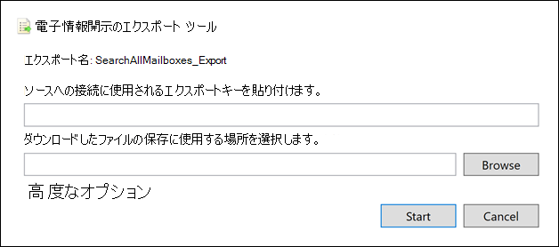

# <a name="export-content-search-results"></a>コンテンツ検索結果のエクスポート

コンテンツ検索が正常に実行された後、検索結果をローカル コンピューターにエクスポートできます。 電子メールの結果をエクスポートする場合は、PST ファイルとしてコンピューターにダウンロードされます。 サイトおよびサイトからコンテンツSharePointエクスポートOneDrive for Business、ネイティブ ドキュメントのOfficeエクスポートされます。 エクスポートされた検索結果には、他のドキュメントとレポートが含まれています。
  
コンテンツ検索の結果をエクスポートするには、結果を準備し、ローカル コンピューターにダウンロードします。 検索結果をエクスポートするためのこれらの手順は、Core 電子情報開示ケースに関連付けられている検索の結果のエクスポートにも適用されます。
  
## <a name="before-you-export-search-results"></a>検索結果をエクスポートする前に

- 検索結果をエクスポートするには、セキュリティ コンプライアンス センターで [エクスポート管理] 役割を割り&必要があります。 この役割は、組み込みの電子情報開示マネージャーの役割グループに割り当てられます。 既定では、Organization Management 役割グループには割り当てられません。 詳細については、「[電子情報開示のアクセス許可を割り当てる](assign-ediscovery-permissions.md)」を参照してください。電子情報開示のアクセス許可を割り当てる」を参照してください。

- 検索結果をエクスポートする際に使用するコンピューターは、次のシステム要件を満たす必要があります。
  
  - 最新バージョンの Windows (32 ビットまたは 64 ビット)
  
  - Microsoft .NET Framework 4.7
  
- 電子情報開示エクスポート ツール 1 を実行するには、次のサポートされているブラウザーのいずれかを使用する<sup>必要があります</sup>。

  - Microsoft Edge <sup>2</sup>
  
    または

  - Microsoft Internet Explorer 10 以降のバージョン
  
  > [!NOTE]
  > <sup>1</sup> Microsoft は、サードパーティ製の拡張機能やアドオンを、他のアプリケーションClickOnce行わない。 サードパーティの拡張機能またはアドオンを使用して、サポートされていないブラウザーを使用して検索結果をエクスポートする機能はサポートされていません。<br/>
  > <sup>2</sup>最新の変更の結果、Microsoft EdgeサポートClickOnceは既定で有効になっていません。 Edge でのサポートの有効化ClickOnce手順については、「電子情報開示エクスポート ツールを使用する」を参照[Microsoft Edge。](configure-edge-to-export-search-results.md)
  
- 手順 2 で検索結果をダウンロードするために使用する電子情報開示エクスポート ツールは、(スクリプトまたは実行中のコマンドレットを使用して) 自動化をサポートします。 手順 1 の準備プロセスまたは手順 2 のダウンロード プロセスを自動化しなけれとすることを強くお勧めします。 これらのプロセスのいずれかを自動化した場合、問題が発生した場合、Microsoft サポートはサポートを提供しません。

- 検索結果をローカル コンピューターにダウンロードすることをお勧めします。 検索結果のダウンロード時に会社のファイアウォールやプロキシ インフラストラクチャが問題を引き起こすことをなくす場合は、ネットワーク外の仮想デスクトップに検索結果をダウンロードする方法を検討してください。 これにより、多数のファイルをエクスポートするときに Azure データ接続で発生するタイムアウトが減少する可能性があります。 仮想デスクトップの詳細については、「仮想デスクトップのWindows[を参照してください](https://azure.microsoft.com/services/virtual-desktop)。

- 検索結果をダウンロードする際のパフォーマンスを向上させるために、結果の大きなセットを返す検索を小さな検索に分割する方法を検討してください。 たとえば、検索クエリで日付範囲を使用して、より速くダウンロードできる結果の小さなセットを返します。
  
- 検索結果をエクスポートすると、ローカル コンピューターにダウンロードされる前Azure Storage Microsoft クラウドの Microsoft 提供の場所にデータが一時的に保存されます。 組織が Azure のエンドポイント **\* (.blob.core.windows.net** )に接続できます (ワイルドカードはエクスポートの一意の識別子を表します)。 検索結果データは、作成Azure Storage 2 週間後に、検索結果の場所から削除されます。 
  
- 組織がプロキシ サーバーを使用してインターネットと通信する場合は、検索結果のエクスポートに使用するコンピューターでプロキシ サーバー設定を定義する必要があります (そのため、エクスポート ツールをプロキシ サーバーで認証できます)。 これを行うには、machine.configのバージョンに一致する場所にあるファイルを開Windows。 
  
  - **32 ビット:**`%windir%\Microsoft.NET\Framework\[version]\Config\machine.config`
  
  - **64 ビット:**`%windir%\Microsoft.NET\Framework64\[version]\Config\machine.config`
  
    タグとタグの  *間のmachine.config*  ファイルに次の行  `<configuration>` を追加  `</configuration>` します。 組織に適切な値を置き換え、適切な値に置き換える必要があります  `ProxyServer`  `Port` `proxy01.contoso.com:80` 。たとえば、 。 
  
    ```xml
    <system.net>
       <defaultProxy enabled="true" useDefaultCredentials="true">
         <proxy proxyaddress="https://ProxyServer :Port " 
                usesystemdefault="False" 
                bypassonlocal="True" 
                autoDetect="False" />
       </defaultProxy>
    </system.net>
    ```

- 検索の結果が 7 日を超え、エクスポート ジョブを送信すると、検索結果を更新するために検索を再実行するように求めるエラー メッセージが表示されます。 この場合は、エクスポートを取り消し、検索を再実行してから、エクスポートを再度開始します。

## <a name="step-1-prepare-search-results-for-export"></a>手順 1: エクスポートする検索結果を準備する

最初の手順では、エクスポートする検索結果を準備します。 結果を準備すると、Microsoft が提供する Microsoft クラウドAzure Storageにアップロードされます。 メールボックスとサイトのコンテンツは、1 時間あたり最大 2 GB の割合でアップロードされます。
  
1. 次のMicrosoft 365 コンプライアンス センター、結果をエクスポートするコンテンツ検索を選択します。
  
2. [フライアウト **] ページ** の下部にある [操作] メニューで、[結果のエクスポート] **をクリックします**。

   ![[操作] メニューの [結果のエクスポート] オプション](../media/ActionMenuExportResults.png)

   [ **結果のエクスポート]** フライアウト ページが表示されます。 コンテンツのエクスポートに使用できるエクスポート オプションは、検索結果がメールボックスかサイトか、または両方の組み合わせにあるかによって異なっています。

3. [ **出力オプション] で**、次のいずれかのオプションを選択します。
  
   

    - **認識できない形式の** アイテムを除くすべてのアイテムが暗号化される、または他の理由でインデックスが作成されていない。 このオプションは、インデックス付きアイテムのみをエクスポートします。
  
    - **認識されていない形式の** アイテムを含むすべてのアイテムが暗号化されている、または他の理由でインデックスが作成されていない。 このオプションは、インデックス付きアイテムとインデックス付きアイテムをエクスポートします。
  
    - **認識できない形式のアイテム**、暗号化されているアイテム、または他の理由でインデックスが作成されていないアイテムのみ。 このオプションは、インデックスが作成されていないアイテムのみをエクスポートします。

      部分的に [インデックス付きアイテム](#more-information) をエクスポートする方法の詳細については、「詳細」セクションを参照してください。 部分的にインデックス付けされたアイテムの詳細については、「 [コンテンツ検索」の「部分的にインデックス付きアイテム」を参照してください](partially-indexed-items-in-content-search.md)。

4. [**コンテンツExchangeとしてエクスポート] で**、次のいずれかのオプションを選択します。
  
   

    - **メールボックスごとに 1 つの PST ファイル**: 検索結果を含むユーザー メールボックスごとに 1 つの PST ファイルをエクスポートします。 ユーザーのアーカイブ メールボックスからの結果は、同じ PST ファイルに含まれます。 このオプションは、ソース メールボックスからメールボックス フォルダー構造を再現します。
  
    - **すべてのメッセージを含む** 1 つの PST ファイル : 検索に含まれるすべてのソース メールボックスからの検索結果を含む単一の PST ファイル *(Exchange.pst* という名前) をエクスポートします。 このオプションは、各メッセージのメールボックス フォルダー構造を再現します。
  
    - **1 つのフォルダー内** のすべてのメッセージを含む 1 つの PST ファイル : 検索結果を 1 つの PST ファイルにエクスポートし、すべてのメッセージが 1 つのトップ レベル のフォルダーに格納されます。 このオプションを使用すると、レビュー担当者は、アイテムごとに元のメールボックス フォルダー構造を移動することなく、アイテムを時系列順に確認できます (アイテムは送信日別に並べ替えされます)。
  
    - **個々のメッセージ**: .msg 形式を使用して、検索結果を個々の電子メール メッセージとしてエクスポートします。 このオプションを選択すると、電子メール検索結果がファイル システム内のフォルダーにエクスポートされます。 個々のメッセージのフォルダー パスは、結果を PST ファイルにエクスポートした場合に使用されるフォルダー パスと同じです。
  
5. 次の追加オプションを構成します。

   

   1. 重複する **メッセージを除外するには、[コンテンツの重複Exchangeを有効** にする] チェック ボックスをオンにします。
  
      このオプションを選択すると、検索されたメールボックスに同じメッセージの複数のコピーが見つかった場合でも、メッセージのコピーは 1 つしかエクスポートされません。 エクスポート結果レポート (Results.csv という名前のファイル) には、重複するメッセージのコピーを含むメールボックス (またはパブリック フォルダー) を識別できるよう、重複するメッセージのすべてのコピーの行が含まれます。 重複除外と重複アイテムの識別方法の詳細については、「電子情報開示検索結果の重複除外 [」を参照してください](de-duplication-in-ediscovery-search-results.md)。
  
   2. [ファイルの **バージョンを含SharePoint] チェック** ボックスをオンにして、すべてのバージョンのドキュメントSharePointします。 このオプションは、検索のコンテンツ ソースにサイトまたはサイトSharePoint場合OneDrive for Business表示されます。
  
   3. 圧縮 (**圧縮) フォルダー内のファイルのエクスポートを選択します。検索結果を圧縮フォルダーにエクスポートSharePoint** 個別のメッセージとドキュメントのチェック ボックスのみを含む。 このオプションは、個々のメッセージとしてExchangeアイテムをエクスポートする場合、および検索結果にドキュメントまたはドキュメントSharePoint含OneDrive表示されます。 このオプションは、主にアイテムのエクスポート時にファイル パスWindows 260 文字の制限を回避するために使用されます。 詳細セクションの「エクスポートされたアイテムのファイル名 [」を参照](#more-information) してください。
   > [!IMPORTANT]
   > 圧縮された (圧縮された) フォルダー内のファイルをエクスポートすると、エクスポート時間が増加します。
  
6. [エクスポート **] を** クリックして、エクスポート プロセスを開始します。 検索結果はダウンロード用に準備されています。つまり、元のコンテンツの場所から収集され、Microsoft クラウド内のAzure Storageにアップロードされます。 この処理には数分間かかる場合があります。

エクスポートされた検索結果をダウンロードする手順については、次のセクションを参照してください。
  
## <a name="step-2-download-the-search-results"></a>手順 2:検索結果をダウンロードする

次の手順では、検索結果をローカル の場所Azure Storageローカル コンピューターにダウンロードします。
  
1. [コンテンツ **の検索]** ページで、[Microsoft 365 コンプライアンス センター]**タブを選択** します。
  
   [更新] を **クリックして** エクスポート ジョブの一覧を更新し、作成したエクスポート ジョブを表示する必要がある場合があります。 エクスポート ジョブの名前は、対応する検索と同じ名前で、_Export **に追加** されます。
  
2. 手順 1 で作成したエクスポート ジョブを選択します。

3. [エクスポート] キーの下の **フライアウト ページで、[** クリップボードに **コピー] をクリックします**。 手順 6 でこのキーを使用して検索結果をダウンロードします。
  
   > [!IMPORTANT]
   > 電子情報開示エクスポート ツールをインストールして開始し、このキーを使用して検索結果をダウンロードすることはだれにでもできるため、このキーは、パスワードやその他のセキュリティ関連の情報を保護する場合と同様の予防策を講じてください。 

4. フライアウト ページの上部にある [結果のダウンロード] **をクリックします**。

5. 電子情報開示エクスポート ツールのインストールを求 **めるメッセージが** 表示されたら、[インストール] を **クリックします**。

6. 電子情報開示 **エクスポート ツールで、** 次の操作を行います。

   

   1. 手順 3 でコピーしたエクスポート キーを適切なボックスに貼り付けます。
  
   2. **[参照]** をクリックして、検索結果のファイルをダウンロードする場所を指定します。
  
      > [!IMPORTANT]
      >  ダウンロード中のネットワーク アクティビティが高い場合は、ローカル コンピューター上の内部ドライブ上の場所にのみ検索結果をダウンロードする必要があります。 最適なダウンロード エクスペリエンスを得る場合は、次のガイドラインに従います。 <br/>
      >- 検索結果を UNC パス、マップされたネットワーク ドライブ、外部 USB ドライブ、または同期されたアカウントにダウンロードOneDrive for Businessできません。<br/>
      >- 検索結果をダウンロードするフォルダーのウイルス対策スキャンを無効にします。<br/>
      >- 同時ダウンロード ジョブ用に検索結果を別のフォルダーにダウンロードします。

7. **[開始]** をクリックして、検索結果をコンピューターにダウンロードします。
  
    **電子情報開示エクスポート ツール** には、ダウンロードする残りのアイテムの数とサイズの見積もりなど、エクスポート プロセスの状態に関する情報が表示されます。 エクスポート処理が完了したら、ダウンロードした場所のファイルにアクセスできます。

## <a name="more-information"></a>詳細

検索結果のエクスポートの詳細については、次の情報を参照してください。
  
[エクスポートの制限](#export-limits)
  
[レポートのエクスポート](#export-reports)
  
[部分的にインデックスが作成されたアイテムのエクスポート](#exporting-partially-indexed-items)

[個々のメッセージまたは PST ファイルのエクスポート](#exporting-individual-messages-or-pst-files)

[RMS で保護された電子メール メッセージと暗号化された添付ファイルの復号化](#decrypting-rms-protected-email-messages-and-encrypted-file-attachments)

[エクスポートされたアイテムのファイル名](#filenames-of-exported-items)  
  
[その他](#miscellaneous)
  
### <a name="export-limits"></a>エクスポートの制限

コンテンツ検索結果をエクスポートする際の制限については、「コンテンツ検索の制限」の「エクスポート制限 [」セクションを参照してください](limits-for-content-search.md#export-limits)。

### <a name="export-reports"></a>レポートのエクスポート
  
- 検索結果をエクスポートすると、検索結果に加えて、次のレポートが含まれます。
  
  - **エクスポートの概要** エクスポートExcelを含むドキュメントを作成します。 これには、検索されたコンテンツ ソースの数、検索結果の推定サイズとダウンロードサイズ、エクスポートされたアイテムの推定数とダウンロード数などの情報が含まれます。
  
  - **マニフェスト** 検索結果に含まれる各アイテムに関する情報を含むマニフェスト ファイル (XML 形式)。
  
  - **結果** 検索結果Excelダウンロードされる各アイテムに関する情報を含むドキュメントを作成します。 電子メールの場合、結果ログには、次を含む各メッセージに関する情報が含まれます。
  
    - 移行元のメールボックス内のメッセージの場所 (メッセージがプライマリ メールボックスとアーカイブ メールボックスのどちらであるかを含みます)。
  
    - メッセージが送信または受信された日付。

    - メッセージの件名行。

    - メッセージの送信者と受信者。

    - 検索結果のエクスポート時に重複除外オプションを有効にした場合、メッセージが重複メッセージかどうかを指定します。 重複するメッセージには、メッセージを重複として識別する [アイテムに複製] 列の値があります。 [アイテムに複製 **] 列の値** には、エクスポートされたメッセージのアイテム ID が含まれる。 詳細については、「電子情報開示 [検索結果の重複除外」を参照してください](de-duplication-in-ediscovery-search-results.md)。

      サイトおよびサイトSharePoint OneDrive for Business、結果ログには、次を含む各ドキュメントに関する情報が含まれます。

      - ドキュメントの URL。

      - ドキュメントがあるサイト コレクションの URL。

      - ドキュメントが最後に変更された日付。

      - ドキュメントの名前 (これは、結果のログの [件名] 列にあります)。

  - **インデックスが作成されていないアイテム** 検索結果Excel含まれる部分的にインデックス付きアイテムに関する情報を含むドキュメントを作成します。 検索結果レポートを生成するときに部分的にインデックス付きアイテムを含めなかった場合、このレポートはダウンロードされますが、空になります。

  - **エラーと警告** エクスポート中に発生したファイルのエラーと警告が含まれています。 個々のエラーまたは警告に固有の情報については、「エラーの詳細」列を参照してください。

  - **スキップされたアイテム** 他のサイトやサイトから検索結果SharePointエクスポートOneDrive for Business、通常、エクスポートにはスキップされたアイテム レポート (SkippedItems.csv) が含まれます。 通常、このレポートで引用されているアイテムは、フォルダーやドキュメント セットなど、ダウンロードしないアイテムです。 これらの種類のアイテムをエクスポートしないのは、設計によって行います。 スキップされた他のアイテムについては、スキップされたアイテム レポートの [エラーの種類] フィールドと [エラーの詳細] フィールドに、アイテムがスキップされ、他の検索結果と一緒にダウンロードしなかった理由が表示されます。

  - **Trace.log** エクスポート プロセスに関する詳細なログ情報を含み、エクスポート中に問題を発見するのに役立ちます。 検索結果のエクスポートに関連する問題について Microsoft サポートでチケットを開いた場合は、このトレース ログの提供を求めるメッセージが表示される場合があります。
  
    > [!NOTE]
    > これらのドキュメントは、実際の検索結果をエクスポートせずにエクスポートできます。 「 [コンテンツ検索レポートのエクスポート」を参照してください](export-a-content-search-report.md)。
  
### <a name="exporting-partially-indexed-items"></a>部分的にインデックスの作成されたアイテムを調査する
  
- 検索結果のすべてのメールボックス アイテムを返すコンテンツ検索からメールボックス アイテムをエクスポートする場合 (検索クエリに含まれるキーワードが存在しないので)、部分的にインデックスが作成されたアイテムは、インデックスのないアイテムを含む PST ファイルにコピーされません。 これは、部分的にインデックスが作成されたアイテムを含むすべてのアイテムが、自動的に通常の検索結果に含まれるためです。 つまり、部分的にインデックス付けされたアイテムは、他のインデックス付きアイテムを含む PST ファイル (または個々のメッセージ) に含まれます。

    インデックス付きアイテムと部分的にインデックス付きアイテムの両方をエクスポートする場合、またはすべてのアイテムを返すコンテンツ検索からインデックス付きアイテムのみをエクスポートする場合は、同じ数のアイテムがダウンロードされます。 これは、コンテンツ検索の推定検索結果 (セキュリティ & コンプライアンス センターの検索統計に表示される) に、部分的にインデックスが作成されたアイテムの数に対する個別の見積もりが含まれる場合でも発生します。 たとえば、すべてのアイテム (検索クエリにキーワードがない) を含む検索の見積もりでは、1,000 アイテムが見つかり、部分的にインデックス付きアイテムが 200 件見つかったとします。 この場合、1,000 アイテムには部分的にインデックス付きアイテムが含まれます。検索ではすべてのアイテムが返されます。 つまり、検索によって返されるアイテムの総数は 1,000 件で、1,200 アイテムは返されません (予想通り)。 この検索の結果をエクスポートし、インデックス付きアイテムと部分的にインデックス付きアイテムをエクスポートする (または部分的にインデックス付きアイテムのみをエクスポートする) 場合は、1,000 アイテムがダウンロードされます。 繰り返しますが、空白の検索クエリを使用してすべてのアイテムを返す場合、部分的にインデックス付きアイテムが通常の (インデックス付き) 結果に含まれるためです。 この同じ例では、部分的にインデックス付きアイテムのみをエクスポートする場合、インデックスのない 200 アイテムだけがダウンロードされます。

    また、前の例 (インデックス付きアイテムと部分的にインデックス付きアイテムをエクスポートする場合、またはインデックス付きアイテムのみをエクスポートする場合) では、エクスポートされた検索結果に含まれる [概要のエクスポート] レポートに、前述と同じ理由で 1,000 アイテムの推定アイテムと 1,000 のダウンロード済みアイテムが一覧表示されます。 

- 結果をエクスポートする検索が、特定のコンテンツの場所または組織内のすべてのコンテンツの場所を検索した場合、検索条件に一致するアイテムを含むコンテンツの場所の一部のアイテムだけがエクスポートされます。 つまり、メールボックスまたはサイトで検索結果が見つからない場合、そのメールボックスまたはサイト内の部分的にインデックス付きアイテムはエクスポートされません。 その理由は、組織内の多数の場所から部分的にインデックス付きアイテムをエクスポートすると、エクスポート エラーの可能性が高く、検索結果のエクスポートとダウンロードにかかる時間が長くなる可能性があるからです。

    部分的にインデックスが作成されたアイテムを検索のすべてのコンテンツの場所からエクスポートするには、すべてのアイテムを返す (検索クエリからキーワードを削除して) 検索を構成し、検索結果をエクスポートするときに部分的にインデックス付きアイテムのみをエクスポートします。

    
  
- SharePoint または OneDrive for Business サイトから検索結果をエクスポートする場合、インデックスのないアイテムをエクスポートする機能は、選択したエクスポート オプションと、検索されたサイトに検索条件に一致するインデックス付きアイテムが含まれているかどうかによっても異なります。 たとえば、特定の SharePoint または OneDrive for Business サイトを検索し、検索結果が見つからない場合、インデックス付きアイテムとインデックスなしアイテムの両方をエクスポートする 2 番目のエクスポート オプションを選択した場合、それらのサイトのインデックスのないアイテムはエクスポートされません。 サイトのインデックス付きアイテムが検索条件と一致する場合、インデックス付きアイテムとインデックス付きアイテムの両方をエクスポートするときに、そのサイトのすべてのインデックスのないアイテムがエクスポートされます。 次の図は、サイトに検索条件に一致するインデックス付きアイテムがサイトに含まれているかどうかに基づくエクスポート オプションを示しています。

    

    a. 検索条件に一致するインデックス付きアイテムだけがエクスポートされます。 部分的にインデックスが作成されたアイテムはエクスポートされません。

    b. サイトのインデックス付きアイテムが検索条件と一致しない場合、そのサイトの部分的にインデックス付きアイテムはエクスポートされません。 サイトのインデックス付きアイテムが検索結果に返された場合、そのサイトの部分的にインデックス付きアイテムがエクスポートされます。 つまり、検索条件に一致するアイテムを含むサイトの部分的にインデックス付きアイテムだけがエクスポートされます。

    c. サイトに検索条件に一致するアイテムが含まれているかどうかに関係なく、検索内のすべてのサイトから部分的にインデックスが作成されたアイテムはすべてエクスポートされます。

    部分的にインデックス付きアイテムをエクスポートする場合、部分的にインデックスが作成されたメールボックス アイテムは、[コンテンツを次のようにエクスポートする] で選択したオプションに関係なく、別の PST ファイル **Exchangeエクスポートされます**。

- 部分的にインデックス付きアイテムが検索結果に返される場合 (部分的にインデックスが作成されたアイテムの他のプロパティが検索条件と一致したため)、部分的にインデックスが作成されたアイテムは通常の検索結果と一緒にエクスポートされます。 したがって、インデックス付きアイテムと部分的にインデックス付きアイテムの両方をエクスポートする場合 (認識できない形式のアイテムを含むすべてのアイテムを選択すると、暗号化または他の理由でインデックスが作成されていないアイテム)、通常の結果でエクスポートされた部分的にインデックス付きアイテムが Results.csv レポートに表示されます。 インデックスが作成されていないレポートにはitems.csvされません。
  
### <a name="exporting-individual-messages-or-pst-files"></a>個々のメッセージまたは PST ファイルのエクスポート
  
- メッセージのファイル パス名がメッセージの最大文字制限を超Windowsファイル パス名は切り捨てられて表示されます。 ただし、元のファイル パス名はマニフェストと ResultsLog に表示されます。
  
- 前に説明したように、電子メール検索結果はファイル システム内のフォルダーにエクスポートされます。 個々のメッセージのフォルダー パスは、ユーザーのメールボックス内のフォルダー パスをレプリケートします。 たとえば、ユーザーの受信トレイ内の "ContosoCase101" メッセージという名前の検索はフォルダー パスにあります  `~ContosoCase101\\<date of export\Exchange\user@contoso.com (Primary)\Top of Information Store\Inbox` 。

- 1 つのフォルダー内のすべてのメッセージを含む 1 つの PST ファイル内の電子メール メッセージをエクスポートする場合は、削除済みアイテム フォルダーと **検索** フォルダー フォルダーが PST フォルダーのトップ レベルに含まれます。 これらのフォルダーは空です。

- 前に述べたように、電子メール検索結果を個々のメッセージとしてエクスポートして、RMS で保護されたメッセージをエクスポートするときに暗号化解除する必要があります。 メール検索結果を PST ファイルとしてエクスポートすると、暗号化されたメッセージは暗号化されたままです。
  
### <a name="decrypting-rms-protected-email-messages-and-encrypted-file-attachments"></a>RMS で保護された電子メール メッセージと暗号化された添付ファイルの復号化

コンテンツ検索の結果に含まれる権利で保護された (RMS で保護された) 電子メール メッセージは、エクスポート時に復号化されます。 さらに [、Microsoft](encryption.md) 暗号化テクノロジで暗号化され、検索結果に含まれる電子メール メッセージに添付されているファイルは、エクスポート時にも復号化されます。 この復号化機能は、電子情報開示マネージャー役割グループのメンバーに対して既定で有効になっています。 これは、RMS Decrypt 管理役割が既定でこの役割グループに割り当てられているためです。 暗号化された電子メール メッセージと添付ファイルをエクスポートする場合は、次のことを念頭に置いておきます。
  
- 前に説明したように、RMS で保護されたメッセージをエクスポートするときに暗号化解除するには、検索結果を個々のメッセージとしてエクスポートする必要があります。 検索結果を PST ファイルにエクスポートする場合、RMS で保護されたメッセージは暗号化されたままです。

- 復号化されたメッセージは、ResultsLog レポート **で識別** されます。 このレポートには **、Decode Status** という名前の列が含まれます。この列の **値がデコード** されたメッセージを識別します。

- 検索結果のエクスポート時に添付ファイルを復号化する以外に、検索結果のプレビュー時に暗号化解除されたファイルをプレビューすることもできます。 権限で保護された電子メール メッセージは、エクスポート後にのみ表示できます。

- 現時点では、検索結果をエクスポートする場合の暗号化解除機能には、暗号化されたコンテンツが含SharePointサイトOneDrive for Businessされません。 ただし、Microsoft 暗号化テクノロジを使用して暗号化され、オンラインおよびサーバーにSharePointドキュメントのOneDrive for Business。

- 他のユーザーが RMS 保護メッセージと暗号化された添付ファイルの暗号化を解除する必要がある場合は、(組み込みの電子情報開示マネージャー役割グループをコピーして) カスタム役割グループを作成し、カスタム役割グループから RMS Decrypt 管理役割を削除する必要があります。 次に、カスタム 役割グループのメンバーとしてメッセージの暗号化を解除しないユーザーを追加します。
  
### <a name="filenames-of-exported-items"></a>エクスポートされたアイテムのファイル名
  
- ローカル コンピューターにエクスポートされる電子メール メッセージとサイト ドキュメントの完全なパス名には、260 文字の制限があります (オペレーティング システムによって課されます)。 エクスポートされたアイテムの完全なパス名には、アイテムの元の場所と、検索結果のダウンロード先のローカル コンピューター上のフォルダーの場所が含まれます。 たとえば、電子情報開示エクスポート ツールで検索結果をダウンロードする場合、ダウンロードした電子メール アイテムの完全なパス名は `C:\Users\Admin\Desktop\SearchResults` . `C:\Users\Admin\Desktop\SearchResults\ContentSearch1\03.15.2017-1242PM\Exchange\sarad@contoso.com (Primary)\Top of Information Store\Inbox\Insider trading investigation.msg`

- 260 文字の制限を超えると、アイテムの完全なパス名は、次に基づいて切り詰まれます。

  - 完全なパス名が 260 文字を超える場合、ファイル名は制限の下に入る短くなります。切り捨てられたファイル名 (ファイル拡張子を除く) は、8 文字以下にならない点に注意してください。

  - ファイル名を短くした後も完全なパス名が長すぎる場合、アイテムは現在の場所から親フォルダーに移動されます。 パス名がまだ長すぎる場合は、ファイル名を短くし、必要に応じて親フォルダーに移動します。 このプロセスは、完全なパス名が 260 文字の制限を超えるまで繰り返されます。

  - 切り捨てられた完全なパス名が既に存在する場合は、バージョン番号がファイル名の末尾に追加されます。たとえば、 `statusmessage(2).msg` .

    この問題を軽減するには、短いパス名を持つ場所に検索結果をダウンロードする方法を検討してください。たとえば、という名前のフォルダーに検索結果をダウンロードすると、エクスポートされたアイテムのパス名に追加する文字が、名前の付いたフォルダーにダウンロードするよりも  `C:\Results` 少なくなることができます  `C:\Users\Admin\Desktop\Results` 。

- サイト ドキュメントをエクスポートすると、ドキュメントの元のファイル名が変更される可能性もあります。 これは特に、保留にされているサイトまたはSharePointまたはOneDrive for Businessから削除されたドキュメントに対して発生します。 保留のサイト上にあるドキュメントを削除すると、削除されたドキュメントはサイトの保持ライブラリに自動的に移動されます (サイトが保留にされたときに作成されました)。 削除されたドキュメントを保持ライブラリに移動すると、ランダムに生成された一意の ID がドキュメントの元のファイル名に追加されます。 たとえば、ドキュメントのファイル名が指定され、そのドキュメントが後で削除され、保持ライブラリに移動された場合、保持ライブラリに移動されたドキュメントのファイル名は、次のように変更されます。 `FY2017Budget.xlsx` `FY2017Budget_DEAF727D-0478-4A7F-87DE-5487F033C81A2000-07-05T10-37-55.xlsx` 保持ライブラリ内のドキュメントがコンテンツ検索のクエリと一致し、その検索の結果をエクスポートすると、エクスポートされたファイルのファイル名が変更されます。この例では、エクスポートされたドキュメントのファイル名は  `FY2017Budget_DEAF727D-0478-4A7F-87DE-5487F033C81A2000-07-05T10-37-55.xlsx` .

    保留になっているサイトのドキュメントが変更されると (サイト内のドキュメント ライブラリのバージョン管理が有効になっている)、ファイルのコピーが保持ライブラリに自動的に作成されます。 この場合、ランダムに生成された一意の ID も、保持ライブラリにコピーされるドキュメントのファイル名に追加されます。

    保持ライブラリに移動またはコピーされるドキュメントのファイル名は、ファイル名の競合を防ぐためです。 サイトと保持ライブラリの保留リストの配置の詳細については、「SharePoint [Server 2016](https://support.office.com/article/5e400d68-cd51-444a-8fe6-e4df1d20aa95)でのインプレイス 保持の概要」を参照してください。

### <a name="miscellaneous"></a>その他
  
- 電子情報開示エクスポート ツールを使用して検索結果をダウンロードすると、次のエラーが表示される可能性があります。これは一時的なエラーで、通常は電子情報開示の場所Azure Storage `System.Net.WebException: The remote server returned an error: (412) The condition specified using HTTP conditional header(s) is not met.` です。 この問題を解決するには、検索結果の [ダウンロードを](#step-2-download-the-search-results)再試行し、電子情報開示エクスポート ツールを再起動します。

- すべての検索結果とエクスポート レポートは、コンテンツ検索と同じ名前のフォルダーに含まれます。 エクスポートされたメール メッセージは、**Exchange** という名前のフォルダーにあります。 ドキュメントは、**SharePoint** という名前のフォルダーにあります。

- ドキュメントがローカル コンピューターにエクスポートSharePoint、OneDrive for Businessサイト上のドキュメントのファイル システム メタデータが維持されます。 つまり、作成日や最終更新日などのドキュメントのプロパティは、ドキュメントがエクスポートされる時に変更されません。

- 検索結果に検索クエリと一致する SharePoint のリスト アイテムが含まれる場合、リスト内のすべての行が、検索クエリと一致するアイテムとリスト内の添付ファイルに加えてエクスポートされます。 この動作の理由は、検索結果で返されるリスト アイテムのコンテキストを提供する方法です。 追加のリスト アイテムと添付ファイルによって、エクスポートされたアイテムの数が検索結果の元の推定値と異なる場合があります。
