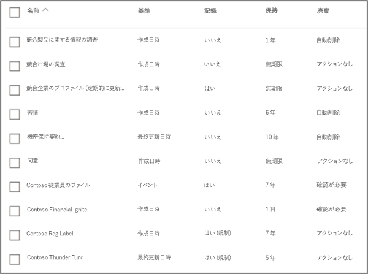
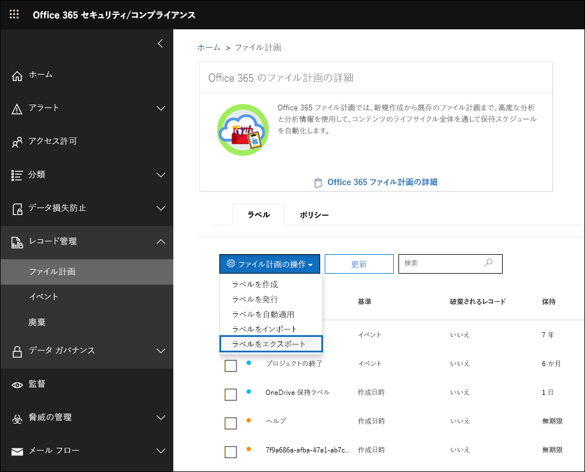
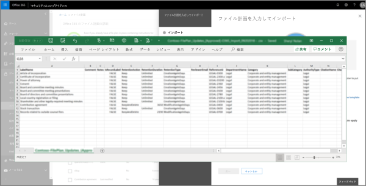
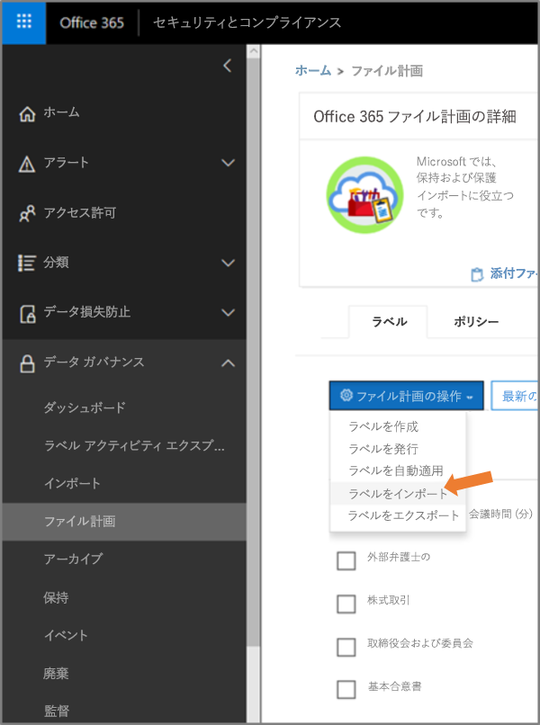

# ファイル計画マネージャーの概要Overview of file plan manager

ファイル計画マネージャーは、保持ラベルおよび保持ラベル ポリシーのための高度な管理機能を提供します。作成に始まり、コラボレーション、レコード宣言、保持、そして廃棄に至るまでのコンテンツのライフ サイクル全体におけるラベルとコンテンツのラベリングを網羅する統合的な機能を提供します。File plan manager provides advanced management capabilities for retention labels and policies, and provides an integrated way to traverse label and label-to-content activity for your entire content lifecycle – from creation, through collaboration, record declaration, retention, and finally disposition.

![[ファイル計画] ページ](media/file-plan-page.png)

## ファイル計画マネージャーへのアクセスAccessing file plan manager

ファイル計画マネージャーにアクセスするには次の 2 つの要件があります。There are two requirements to access file plan manager, they are:
- Office 365 Enterprise E5 サブスクリプション。An Office 365 Enterprise E5 subscription.
- 次のいずれかのセキュリティ &amp; コンプライアンス センターの役割がユーザーに割り当てられている状態。The user has been in assigned one of the following roles of the Security &amp; Compliance Center:
    - 保持マネージャーRetention Manager
    - 閲覧限定保持マネージャーView-only Retention Manager

## デフォルトの保持ラベルとラベルポリシーDefault retention labels and label policy

セキュリティ＆コンプライアンスセンターに保持ラベルがない場合、左ナビゲーションで**ファイルプラン**を最初に選択すると、**デフォルトデータガバナンス公開ポリシー**というラベルポリシーが作成されます。If there are no retention labels in the Security & Compliance Center, the first time you choose **File plan** in the left nav, this creates a label policy called **Default Data Governance Publishing Policy**. 

このラベルポリシーには、3つの保持ラベルが含まれています。This label policy contains three retention labels:

- **運用手順****Operational procedure**
- **企業一般****Business general**
- **契約規定****Contract agreement**

これらの保持ラベルは、コンテンツを保持するためだけに構成され、コンテンツを削除するためには構成されていません。These retention labels are configured only to retain content, not delete content. このラベルポリシーは組織全体に公開され、無効にすることも削除することもできます。This label policy will be published to the entire organization and can be disabled or removed. 

アクティビティ**作成済み保持ポリシー**および**作成済み保持ポリシーの保持設定**の監査ログを確認することで、ファイルプランマネージャを開いて初めて実行環境を構築したユーザを特定できます。You can determine who opened file plan manager and kicked off the first-run experience by reviewing the audit log for the activities **Created retention policy** and **Created retention configuration for a retention policy**.

> [!NOTE]
> お客様からのフィードバックにより、デフォルトの保持ラベルと保持ラベル ラベルポリシーを作成する上記のこの機能は削除されました。Due to customer feedback, we have removed this feature that creates the default retention labels and label policy mentioned above. これらの保持ラベルと保持ラベル ラベルポリシーは、ファイル計画マネージャーを 2019 年 4 月 11 日より前に開いたことがある場合にのみ表示されます。You will only see this policy and labels if you used file plan manager before April 11, 2019.

## ファイル計画の中の移動Navigating your file plan

ファイル計画マネージャーでは、すべての保持ラベルとポリシーの設定を 1 つのビューから簡単に参照できます。File plan manager makes it easier see into and across the settings of all your retention labels and policies from one view.

ファイル計画の外で作成された保持ラベルはファイル計画上で利用可能で、また、その逆も同様であることに注意します。Note that retention labels created outside of the file plan will be available in the file plan and vice versa.

[**ファイル計画ラベル**] タブで、次の追加の情報と機能が提供されます。On the **file plan labels** tab, the following additional information and capabilities are available:

### ラベル設定列Label settings columns

- [**分類方法**] は保持期間を起動するトリガーの種類を識別します。有効な値は次のとおりです。**Based on** identifies the type of trigger that will start the retention period. Valid values are:
    - イベントEvent
    - 作成日時When created
    - 最終更新日時When last modified
    - ラベルが付けられた日時When labeled
- [**レコード**] は、ラベルが適用されときにアイテムが宣言されたレコードが宣言されたレコードになるかどうかを識別します。有効な値は次のとおりです。**Record** identifies if the item will become a declared record when the label is applied. Valid values are:
    - いいえNo
    - はいYes
    - はい (法的)Yes(Regulatory)
- [**保持**] は保持の種類を識別します。有効な値は次のとおりです。**Retention** identifies the retention type. Valid values are:
    - 保持Keep
    - 保持および削除Keep and delete
    - 削除Delete
- [**廃棄**] は保持期間終了時のコンテンツの取り扱い方法を識別します。有効な値は次のとおりです。**Disposition** identifies what will happen to the content at the end of the retention period. Valid values are:
    - nullnull
    - アクションなしNo action
    - 自動削除Auto-delete
    - 要確認 (廃棄レビューとも呼ばれる)Review required (aka Disposition review)

### 保持ラベル ファイル計画記述子列Label file plan descriptors columns

より多くの情報を保持ラベルの構成に含めることができます。ファイル計画記述子を保持ラベルに挿入することにより、ファイル計画の管理性が向上し整理がしやすくなります。You can now include more information in the configuration of your retention labels. Inserting file plan descriptors into labels will improve the manageability and organization of your file plan.

すぐに利用開始できるように、ファイル計画マネージャーでは次の既定値が提供されています: 役割/部門、カテゴリ、権限の種類、規定/是正勧告。保持ラベルを作成または編集するときに、ファイル計画記述子の値を新たに追加することができます。To get you started, file plan manager provides some out-of-box values for: Function/department, Category, Authority type and Provision/citation. You can add new file plan descriptor values when creating or editing a retention label.

保持ラベルを作成または編集時のファイル計画記述子に関する手順の画面です。Here's a view of the file plan descriptors step when creating or editing a retention label.

ファイル計画マネージャーの [ラベル] タブのファイル計画記述子列の画面です。Here's a view of the file plan descriptors columns on the labels tab of file plan manager.

## 分析したりオフライン レビューを実行したりするために、すべての既存の保持ラベルをエクスポートするExport all existing retention labels to analyze and/or perform offline reviews

組織内のデータ ガバナンス関係者との定期的なコンプライアンス レビューが円滑に行えるように、ファイル計画マネージャーではすべての保持ラベルの詳細を .csv ファイルにエクスポートできます。From file plan manager, you can export the details of all retention labels into a .csv file to assist you in facilitating periodic compliance reviews with data governance stakeholders in your organization.

すべての保持ラベルをエクスポートするには、[**ファイル計画マネージャー**] \> [**ファイル計画アクション**] \> [**ラベルのエクスポート**] の順に移動します。To export all retention labels, go to **file plan manager** \> **file plan actions** \> **export labels**.

既存のすべての保持ラベルを含む \*.csv ファイルが開きます。A \*.csv file containing all existing retention labels will open.

## ファイル計画に保持ラベルをインポートするImport labels into your file plan

ファイル計画マネージャーでは新しい保持ラベルの一括インポートおよび既存の保持ラベルの変更を行うことができます。From file plan manager, you can bulk import new labels as well as modify existing retention labels.

新しい保持ラベルのインポートおよび既存の保持ラベルの更新を行うには、[**ファイル計画マネージャー**] \> [**ファイル計画アクション**] \> [**ラベルのインポート**] の順に移動します。To import new retention labels and make updates existing retention labels, go to **file plan manager** \> **file plan actions** \> **import labels**.

空白のテンプレートをダウンロードします (または現在のファイル計画のエクスポートを使います)。Download a blank template (or start from an export of your current file plan).

テンプレートに入力します。Fill-out the template. このテーブルは、有効な値を提供します。This table provides valid values.

|**Property****Property**|**種類****Type**|**有効な値****Valid values**|
|:-----|:-----|:-----|
|LabelNameLabelName|文字列String|値にスペースが含まれている場合は、値を二重引用符 (") で囲んでください。If the value contains spaces, enclose the value in quotation marks (").|
|コメントComment|StringString|値にスペースが含まれている場合は、値を二重引用符 (") で囲んでください。If the value contains spaces, enclose the value in quotation marks ("). |
|メモNotes|文字列String|カスタムCustom|
|IsRecordLabelIsRecordLabel|文字列String|$true: ラベルはレコード ラベルです。The 
                IsRecordLabel
              parameter specifies whether the label is a record label. $false: ラベルはレコード ラベルではありません。$false: The label isn't a record label. これは既定の値です。This is the default value.|
|RetentionActionRetentionAction|文字列String|削除Delete 保持Keep KeepAndDeleteKeepAndDelete |
|RetentionDurationRetentionDuration|文字列String|プロパティは、コンテンツを保持する日数を指定します。The RetentionDuration parameter specifies the number of days to retain the content. 有効な値は次のとおりです。Valid values are: 正の整数。A positive integer. 値は無制限です。The default value is unlimited.|
|RetentionTypeRetentionType|文字列String|プロパティは、コンテンツ作成日、ラベルが付けられた (タグが付けされた) 日、または最終変更日のいずれから保持期間を計算するかを指定します。The RetentionType parameter specifies whether the retention duration is calculated  from the content creation date, tagged date, or last modification date. 有効な値は次のとおりです。Valid values are: CreationAgeInDaysCreationAgeInDays EventAgeInDaysEventAgeInDays ModificationAgeInDaysModificationAgeInDays TaggedAgeInDaysTaggedAgeInDays |
|ReviewerEmailReviewerEmail|SmtpAddress[]SmtpAddress|プロパティは、Delete および KeepAndDelete の保存期間用アクションのレビュー担当者の電子メール アドレスを指定します。The ReviewerEmail parameter specifies the email address of a reviewer for Delete and KeepAndDelete retention actions. 複数のメール アドレスをコンマで区切って指定できます。You can specify multiple email addresses separated by commas.|
|ReferenceIdReferenceId|文字列String|カスタムCustom|
|DepartmentnameDepartmentname|文字列String|カスタムCustom|
|カテゴリCategory|StringString|カスタムCustom|
|下位カテゴリSubCategory|文字列String|カスタムCustom|
|AuthorityTypeAuthorityType|文字列String|カスタムCustom|
|CitationNameCitationName|文字列String|カスタムCustom|
|CitationUrlCitationUrl|文字列String|カスタムCustom|
|CitationJurisdictionCitationJurisdiction|文字列String|カスタムCustom|
|RegulatoryRegulatory|文字列String|カスタムCustom|
|EventTypeEventType|文字列String|このプロパティは、ラベルに関連付けられている保持規則を指定します。The 
                EventType
              specifies the retention rule that's associated with the label. ルールを一意に識別する任意の値を使用できます。You can use any value that uniquely identifies the rule. 次に例を示します。For example: 名前Name 識別名 (DN)Distinguished name (DN) GUIDGUID  使用可能な保持規則を確認するには、[Get-RetentionComplianceRule](https://docs.microsoft.com/ja-JP/powershell/module/exchange/policy-and-compliance-retention/get-retentioncompliancerule?view=exchange-ps) コマンドレットを使用します。You can use the [Get-RetentionComplianceRule](https://docs.microsoft.com/en-us/powershell/module/exchange/policy-and-compliance-retention/get-retentioncompliancerule?view=exchange-ps) cmdlet to view the available retention rules.|

入力済みのテンプレートをアップロードすると、ファイル計画マネージャーで記載事項が検証され、インポートの統計情報が表示されます。Upload the filled-out template, and file plan manager will validate the entries and display import statistics.

検証エラーが発生した場合、ファイル計画のインポートはインポート ファイル内のすべてのエントリを引き続き検証し、インポートファイル内でエラーを参照するラインまたは行の番号を表示し、表示されたエラー結果をコピーます。これにより、簡単にインポートファイル戻り、エラーを修正することができます。In the event there is a validation error, file plan import will continue to validate every entry in the import file and display all errors referencing line/row numbers in the import file, copy the displayed error results so that you can easilly return to the import file and correct the errors. 

インポートが完了したらファイル計画マネージャーに戻り、新しい保持ラベルを新規または既存の保持ポリシーと関連付けます。When the import is complete, return to file plan manager to assign new labels to new or existing policies.

