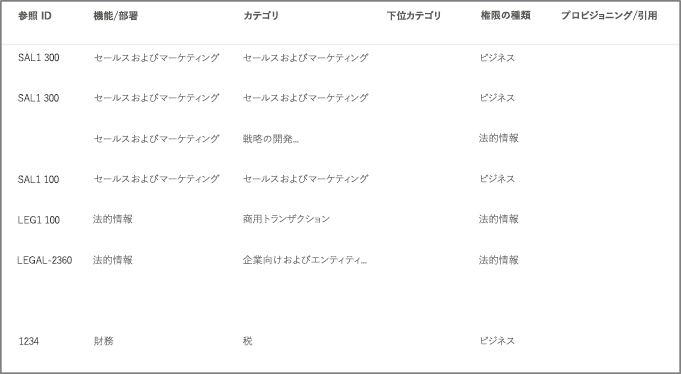

# ファイルプランを使用して保持ラベルを管理するUse file plan to manage retention labels

>*[セキュリティとコンプライアンスのための Microsoft 365 ライセンス ガイダンス](/office365/servicedescriptions/microsoft-365-service-descriptions/microsoft-365-tenantlevel-services-licensing-guidance/microsoft-365-security-compliance-licensing-guidance)。**[Microsoft 365 licensing guidance for security & compliance](/office365/servicedescriptions/microsoft-365-service-descriptions/microsoft-365-tenantlevel-services-licensing-guidance/microsoft-365-security-compliance-licensing-guidance).*

Microsoft 365 コンプライアンスセンターで、保持ラベルの作成と管理は **情報ガバナンス** から出来ますが、**レコード管理** からのファイルプランには追加の管理機能があります。Although you can create and manage retention labels from **Information governance** in the Microsoft 365 compliance center, file plan from **Records management** has additional management capabilities:

- スプレッドシートから関連情報をインポートして、保持ラベルを一括作成できます。You can bulk-create retention labels by importing the relevant information from a spreadsheet.

- 分析およびオフラインでの共同作業には、既存の保持ラベルから情報をエクスポートできます。You can export the information from existing retention labels for analysis and offline collaboration.

- 保持ラベルの詳細については、情報を見やすいように１つのビューから全ての保持ラベルの設定全体を表示しています。More information about the retention labels is displayed to make it easier to see into and across the settings of all your retention labels from one view.

- ファイルプラン記述子は、各ラベルの追加およびオプションの情報をサポートします。File plan descriptors support additional and optional information for each label.

ファイルプランは、コンテンツをレコードとしてマークしない場合でも、すべての保持ラベルに使用できます。File plan can be used for all retention labels, even if they don't mark content as a record.

![[ファイル計画] ページ](../media/compliance-file-plan.png)

保持ラベルについて、そして使用方法の情報については、[保持ポリシーおよび保持ラベルについて詳しく見る](retention.md) をご覧ください。For information about what retention labels are and how to use them, see [Learn about retention policies and retention labels](retention.md).

## ファイル計画にアクセスしていますAccessing file plan

ファイル計画にアクセスするには、次のいずれかの管理者役割が必要です。To access file plan, you must have one of the following admin roles:
    
- 保持マネージャーRetention Manager

- 閲覧限定保持マネージャーView-only Retention Manager

Microsoft 365 コンプライアンスセンターで、**ソリューション** > **レコード管理** > **ファイル計画** の順で移動します。In the Microsoft 365 compliance center, go to **Solutions** > **Records management** > **File plan**. 

**[レコード管理]** がナビゲーション ウィンドウに表示されない場合は、下にスクロールして **[すべて表示]** を選択します。If **Records management** doesn't display in the navigation pane, first scroll down, and select **Show all**.

![[ファイル計画] ページ](../media/compliance-file-plan.png)

## ファイル計画を移動中Navigating your file plan

Microsoft 365 コンプライアンスセンターで、もしも既に **情報ガバナンス** から保持ラベルを作成済みの場合は、これらのラベルは自動的にファイル計画に表示されます。 If you've already created retention labels from **Information governance** in the Microsoft 365 compliance center, these labels automatically display in your file plan. 

同様に、ファイル計画に保持ラベルを作成した場合、コンテンツをレコードとしてマークするようにラベルが構成されていない場合は、**情報ガバナンス** からも使用できます。Similarly, if you now create retention labels in file plan, they are also available from **Information governance** if the labels aren't configured to mark content as a record.

**ファイル計画** ページには、すべてのラベルの中に、状態や設定、オプションのファイル計画記述子、およびラベルのオフラインレビューを分析または有効にするエクスポートオプション、および保持ラベルを作成するインポートオプションが表示されます。On the **File plan** page, you see all your labels with their status and settings, optional file plan descriptors, an export option to analyze or enable offline reviews of your labels, and an import option to create retention labels. 

### ラベル設定列Label settings columns

**名前** ラベルを除くすべての列を表示、または非表示にするには、 **列のカスタマイズ** オプションを選択します。All columns except the label **Name** can be displayed or hidden by selecting the **Customize columns** option. 既定では、最初の幾つかの列にはラベルの状態とその設定に関する情報が表示されます。But by default, the first few columns display information about the label status and its settings: 

- **状態** は、ラベルポリシーにラベルが含まれているかどうか、或いは自動適用ポリシー (**アクティブ**) もしくはそうではない(**非アクティブ**).かを識別します。**Status** identifies whether the label is included in a label policy or auto-apply policy (**Active**) or not (**Inactive**).

- **基づき** どのように、もしくはいつ保持期間が開始するのかを識別します。**Based on** identifies how or when the retention period begins. 有効な値:Valid values:
    - イベントEvent
    - 作成日時When created
    - 最終更新日時Last modified
    - ラベルが付けられた日時When labeled

- **レコード** は、ラベルが適用されたときに、アイテムがレコードとしてマークされているかどうかを識別します。**Is record** identifies if the item is marked as a record when the label is applied. 有効な値:Valid values:
    - 不要No
    - はいYes
    - はい (法的)Yes(Regulatory)

- **保持期間** は、保持期間を識別します。**Retention duration** identifies the retention period. 有効な値:Valid values:
    - 日数Days
    - 月Months
    - 年数Years
    - 無期限Forever
    - なしNone

- [**廃棄の種類**] は、保持期間終了時に何が起こるのかを識別します。**Disposition type** identifies what happens to the content at the end of the retention period. 有効な値:Valid values:
    - アクションなしNo action
    - 自動削除Auto-delete
    - 確認が必要Review required

### ファイル計画記述子列File plan descriptors columns

ファイルプランでは、保持ラベルの一部として、より多くの情報を含めることができます。File plan lets you include more information as part of your retention labels. これらのファイルプラン記述子には、ラベルを作成するのに必要なコンテンツの管理性と構成を改善するためのより多くのオプションが提供されています。These file plan descriptors provide more options to improve the manageability and organization of the content you need to label.

既定では、 **参照 ID** から始めると、次のいくつかの列には、保持ラベルを作成するとき、または既存のラベルを編集するときに指定できる、オプションのファイルプラン記述子が表示されます。By default, starting with **Reference ID**, the next few columns display these optional file plan descriptors that you can specify when you create a retention label, or edit an existing label. 

この作業を開始するには、幾つかの既定値が次のファイルプラン記述子にあります。To get you started, there are some out-of-box values for the following file plan descriptors: 
- ビジネス機能/部署Business function/department
- カテゴリCategory
- 権限の種類Authority type
- プロビジョニング/引用Provision/citation 

保持ラベルを作成または編集する場合のファイルプラン記述子の例:Example of file plan descriptors when you create or edit a retention label:

ファイル計画記述子列の例の表示Example view of the file plan descriptors columns:

## すべての保持ラベルをエクスポートして、オフラインレビューを分析または有効にするExport all retention labels to analyze or enable offline reviews

組織内のデータ ガバナンス関係者との定期的なコンプライアンス レビューを促進するように、ファイル計画マネージャーではすべての保持ラベルの詳細を .csv ファイルにエクスポートできます。From your file plan, you can export the details of all retention labels into a .csv file to help you facilitate periodic compliance reviews with data governance stakeholders in your organization.

すべての保持ラベルをエクスポートするには: [**ファイル計画**] ページで [**エクスポート**] をクリックします。To export all retention labels: On the **File plan** page, click **Export**:

A \*.csv ファイルは既存の全ての保持ラベルを開く、を含みます。次に例を示します。A \*.csv file that contains all existing retention labels opens. For example:

## ファイル計画に保持ラベルをインポートするImport retention labels into your file plan

ファイル プランでは、特定のフォーマットの .csv ファイルを使用して、新しい保持ラベルを一括インポートすることができます。In file plan, you can bulk-import new retention labels by using a .csv file with a specific format. ラベルをインポートした後、.csv ファイルを編集し、再度ファイルをインポートすることで、既存の保持ラベルを簡単に一括編集することができます。After the labels are imported, you can make edits in the .csv file and import the file again for easier bulk-editing of existing retention labels.

新しい保持ラベルのインポートおよび既存の保持ラベルの変更を行うには:To import new retention labels and modify existing retention labels: 

1. **ファイル計画** ページで、[**インポート** をクリックし、**ファイル計画の記入とインポート** ページを使用します。On the **File plan** page, click **Import** to use the **Fill out and import your file plan** page:

   

   

2. 以下の手順に従って、空白のテンプレートをダウンロードします。Download a blank template as instructed:

   

3. プロパティと各プロパティへの有効な値を説明する次の情報を使用して、テンプレートに入力します。インポートの場合、一部の値には最大文字数があります。Fill out the template, using the following information that describes the properties and valid values for each property. For import, some values have a maximum length:
    
    - **LabelName**: 最大文字数 64 文字**LabelName**: Maximum length of 64 characters
    - **コメント** と **メモ**: 最大文字数 1024 文字**Comment** and **Notes**: Maximum length of 1024 characters
    - 他のすべての値: 文字数無制限All other values: Unlimited length
     
    
   |プロパティProperty|型Type|必須Required|有効な値Valid values|
   |:-----|:-----|:-----|:-----|
   |LabelNameLabelName|文字列String|はいYes|このプロパティは、保持ラベルの名前を指定します。このプロパティは、テナント内で一意である必要があります。This property specifies the name of the retention label and must be unique in your tenant.|
   |コメントComment|文字列String|いいえNo|このプロパティを使用して、管理者の保持ラベルに関する説明を追加します。Use this property to add a description about the retention label for admins. この説明は、コンプライアンス センターでラベルを管理する管理者にのみ表示されます。This description appears only to admins who manage the retention label in the compliance center.|
   |NotesNotes|文字列String|いいえNo|このプロパティを使用して、ユーザーの保持ラベルに関する説明を追加します。Use this property to add a description about the retention label for users. この説明は、ユーザーが Outlook、SharePoint、OneDrive などのアプリでラベルにカーソルを置いたときに表示されます。This description appears when users hover over the label in apps like Outlook, SharePoint, and OneDrive. このプロパティを空白のままにすると、ラベルの保持設定を説明する既定の説明が表示されます。If you leave this property blank, a default description is displayed, which explains the label's retention settings. |
   |IsRecordLabelIsRecordLabel|文字列String|いいえ、**Regulatory** が **TRUE** でない場合ですNo, unless **Regulatory** is **TRUE**|このプロパティでは、ラベルがコンテンツをレコードとしてマークするかどうかを指定します。有効な値は次のとおりです。This property specifies whether the label marks the content as a record. Valid values are:  **TRUE**: ラベルはアイテムをレコードとしてマークし、その結果としてアイテムを削除できません。**TRUE**: The label marks the item as a record and as a result, the item can't be deleted.  **FALSE**: ラベルは、コンテンツをレコードとしてマークしません。**FALSE**: The label doesn't mark the content as a record. これは既定の値です。This is the default value.     グループの依存関係: このプロパティが指定された場合、RetentionAction、 RetentionDuration、および RetentionType も指定される必要があります。Group dependencies: When this property is specified, RetentionAction, RetentionDuration, and RetentionType must also be specified.|
   |RetentionActionRetentionAction|文字列String|いいえ、**RetentionDuration**、**RetentionType**、または **ReviewerEmail** が指定されていない場合ですNo, unless **RetentionDuration**, **RetentionType**, or **ReviewerEmail** are specified|このプロパティは、RetentionDuration プロパティ (指定された場合) で指定された値の有効期限が切れた後に実行するアクションを指定します。有効な値は次のとおりです。This property specifies what action to take after the value specified by the RetentionDuration property (if specified) expires. Valid values are:  **Delete**: RetentionDuration プロパティで指定された値よりも古いアイテムが削除されます。**Delete**: Items older than the value specified by the RetentionDuration property are deleted. **Keep**: RetentionDuration プロパティで指定された期間のアイテムを保持し、期間が終了しても何もしません。**Keep**: Retain items for the duration specified by the RetentionDuration property and then do nothing when the duration period expires.  **KeepAndDelete**: RetentionDuration プロパティで指定された期間のアイテムを保持し、期間が終了したらそれらを削除します。**KeepAndDelete**: Retain items for the duration specified by the RetentionDuration property and then delete them when the duration period expires.     グループの依存関係: このプロパティが指定された場合、RetentionDuration および RetentionType も指定される必要があります。Group dependencies: When this property is specified, RetentionDuration and RetentionType must also be specified. |
   |RetentionDurationRetentionDuration|文字列String|いいえ、**RetentionAction** または **RetentionType** が指定されていない場合ですNo, unless **RetentionAction** or **RetentionType** are specified|このプロパティは、コンテンツを保持する日数を指定します。有効な値は次のとおりです。This property specifies the number of days to retain the content. Valid values are:  **Unlimited**: アイテムは無期限に保持されます。**Unlimited**: Items will be retained indefinitely.  \**_n_*: 日付の正の整数です (例: _ **365**)。\**_n_*: A positive integer in days; for example, **365**. サポート可能な最大数は 24,855 で、これは 68 年です。The maximum number supported is 24,855, which is 68 years. この最大値よりも長い期間を必要とする場合は、代わりに Unlimited 版を使用します。If you need longer than this maximum, use Unlimited instead.    グループの依存関係: このプロパティが指定された場合、RetentionAction および RetentionType も指定される必要があります。Group dependencies: When this property is specified, RetentionAction and RetentionType must also be specified.
   |RetentionTypeRetentionType|StringString|いいえ、**RetentionAction** または **RetentionDuration** が指定されていない場合ですNo, unless **RetentionAction** or **RetentionDuration** are specified|プロパティは、コンテンツ作成日、イベント日、ラベルが付けられた日、または最終変更日のいずれから保持期間 (指定された場合) を計算するかを指定します。有効な値は次のとおりです。This property specifies whether the retention duration (if specified) is calculated from the content creation date, event date, when labeled date, or last modified date. Valid values are:  **CreationAgeInDays****CreationAgeInDays** **EventAgeInDays****EventAgeInDays** **TaggedAgeInDays****TaggedAgeInDays** **ModificationAgeInDays****ModificationAgeInDays**     グループの依存関係: このプロパティが指定された場合、RetentionAction および RetentionDuraction も指定される必要があります。Group dependencies: When this property is specified, RetentionAction and RetentionDuraction must also be specified.|
   |ReviewerEmailReviewerEmail|SmtpAddressSmtpAddress|いいえNo|このプロパティが指定された場合、保持期間が終了すると、廃棄のレビューがトリガーされます。When this property is specified, a disposition review will be triggered when the retention duration expires. プロパティは、**KeepAndDelete** の保持期間用アクションのレビュー担当者の電子メール アドレスを指定します。This property specifies the email address of a reviewer for the **KeepAndDelete** retention action.     テナント内の個々のユーザー、配布グループまたはセキュリティ グループのメール アドレスを含めることが出来ます。You can include the email address of individual users, distribution groups, or security groups in your tenant. 複数のメール アドレスをセミコロンで区切って指定します。Specify multiple email addresses by separating them with semicolons.     グループの依存関係: このプロパティが指定された場合、**RetentionAction** (**KeepAndDelete** である必要があります)、**RetentionDuration**、および **RetentionType** も指定される必要があります。Group dependencies: When this property is specified, **RetentionAction** (must be **KeepAndDelete**), **RetentionDuration**, and **RetentionType** must also be specified.|
   |ReferenceIdReferenceId|StringString|いいえNo|このプロパティは、**参照 ID** ファイル計画記述子に表示される値を指定します。そしてこれは組織の固有の値として使うことが出来ます。This property specifies the value that's displayed in the **Reference Id** file plan descriptor, which you can use as a unique value to your organization.| 
   |DepartmentNameDepartmentName|文字列String|いいえNo|このプロパティは、**業務/部署** ファイル計画記述子に表示される値を指定します。This property specifies the value that's displayed in the **Function/department** file plan descriptor.|
   |カテゴリCategory|文字列String|いいえNo|このプロパティは、**カテゴリ** ファイル計画記述子に表示される値を指定します。This property specifies the value that's displayed in the **Category** file plan descriptor.|
   |下位カテゴリSubCategory|文字列String|いいえNo|このプロパティは、**サブカテゴリ** ファイル計画記述子に表示される値を指定します。This property specifies the value that's displayed in the **Sub category** file plan descriptor.|
   |AuthorityTypeAuthorityType|文字列String|いいえNo|このプロパティは、**管理組織の種類** ファイル計画記述子に表示される値を指定します。This property specifies the value that's displayed in the **Authority type** file plan descriptor.|
   |CitationNameCitationName|StringString|いいえNo|このプロパティは、**プロビジョニング/引用** ファイル計画記述子に表示される引用の名前を指定します。This property specifies the name of the citation displayed in the **Provision/citation** file plan descriptor. 例として、「2002 年米国企業改革法」。For example, "Sarbanes-Oxley Act of 2002". |
   |CitationUrlCitationUrl|文字列String|いいえNo|このプロパティは、**規定/引用** ファイル計画記述子に表示される URL を指定します。This property specifies the URL that's displayed in the **Provision/citation** file plan descriptor.|
   |CitationJurisdictionCitationJurisdiction|StringString|いいえNo|このプロパティは、**規定/引用** ファイル計画記述子に表示される管理規則または機関を指定します (例: 「米国証券取引委員会 (SEC)」)。This property specifies the jurisdiction or agency that's displayed in the **Provision/citation** file plan descriptor. For example, "U.S. Securities and Exchange Commission (SEC)".|
   |RegulatoryRegulatory|文字列String|いいえNo|このプロパティでは、ラベルがコンテンツをレコードより[制限された](records-management.md#compare-restrictions-for-what-actions-are-allowed-or-blocked) Regulatory レコードとしてマークするかどうかを指定します。This property specifies whether the label marks the content as a regulatory record, which is [more restrictive](records-management.md#compare-restrictions-for-what-actions-are-allowed-or-blocked) than a record. このラベル構成を使用するには、[コンテンツを Regulatory レコードとしてマークするオプションを表示する](declare-records.md#how-to-display-the-option-to-mark-content-as-a-regulatory-record)ようにテナントを構成する必要があり、そうでない場合はインポートの検証が失敗します。To use this label configuration, your tenant must be configured to [display the option to mark content as a regulatory record](declare-records.md#how-to-display-the-option-to-mark-content-as-a-regulatory-record), or the import validation will fail. 有効な値は次のとおりです。Valid values are:  **TRUE**: ラベルは、Regulatory レコードとしてアイテムをマークします。**TRUE**: The label marks the item as a regulatory record. また、**IsRecordLabel** プロパティを TRUE に設定する必要があります。You must also set the **IsRecordLabel** property to TRUE. **FALSE**: ラベルは、コンテンツを Regulatory レコードとしてマークしません。**FALSE**: The label doesn't mark the content as a regulatory record. これが既定値です。This is the default value.|
   |EventTypeEventType|文字列String|いいえ、**RetentionType** が **EventAgeInDays** ではない場合ですNo, unless **RetentionType** is **EventAgeInDays**|このプロパティは、[イベントベースの保持](event-driven-retention.md)に使用するイベントの種類を指定します。This property specifies an event type used for [event-based retention](event-driven-retention.md). **[レコード管理]**、 > **[イベント]**、 > **[イベントの種類の管理]** に表示されている既存のイベントの種類を指定します。Specify an existing event type that's displayed in **Records management** > **Events** > **Manage event types**. または、[Get-CompianceRetentionEventType](/powershell/module/exchange/get-complianceretentioneventtype) コマンドレットを使用して、利用可能なイベントの種類を表示します。Alternatively, use the [Get-ComplianceRetentionEventType](/powershell/module/exchange/get-complianceretentioneventtype) cmdlet to view the available event types. **従業員活動** や **製品ライフタイム** など、いくつかの組み込みのイベントの種類がありますが、独自のイベントの種類を作成することもできます。Although there are some built-in event types, such as **Employee activity** and **Product lifetime**, you can also create your own event types.     独自のイベントの種類を指定する場合、インポート プロセスの一環として名前が検証されるため、そのイベントの種類がインポート前に存在している必要があります。If you specify your own event type, it must exist before the import because the name is validated as part of the import process.|
   |||

   保持ラベルに関する情報を含むテンプレートの例を次に示します。Here's an example of the template containing the information about retention labels.

   

4. **ファイル計画を入力しインポートする** ページの手順 3 で、**ファイルの参照** をクリックし、入力済みのテンプレートをアップロードして、**[次へ]** を選択します。Under step 3 on the **Fill out and import your file plan** page, click **Browse for files** to upload the filled-out template, and then select **Next**.

   ファイル計画では、ファイルをアップロードし、エントリを検証して、インポートの統計情報を表示します。File plan uploads the file and validates the entries, displaying the import statistics.

   

5. 検証結果に応じて、以下の操作を行います。Depending on the validation results:
    
    - 検証に失敗した場合: インポート ファイルで修正する行番号と列名をメモします。If validation fails: Note the row number and column name to correct in the import file. **[閉じる]**、**[OK]** の順に選択して確認します。Select **Close**, and then **Yes** to confirm. ファイルのエラーを修正して保存し、もう一度 **[インポート]** を選択して、手順 4 に戻ります。Correct the errors in the file and save it, select the **Import** option again, and return to step 4.
    
    - 検証が成功した場合: **[Go Live]** を選択すると、保持ラベルをテナントで利用できるようになります。If validation passes: You can select **Go Live** to make the retention labels available in your tenant. あるいは、ページの ［閉じる］ アイコンを選択し、**[はい]** で、今回は保持ラベルをテナントで使用できないようにしてウィザードを終了することを確認します。Or, select the Close icon for the page, and **Yes** to confirm you want to close the wizard without making the retention labels available in your tenant at this time.

インポートされたラベルがテナントに追加されたら、新しい保持ラベル ポリシーに保持ラベルを追加したり、もしくは自動適用したりできます。When the imported labels are added to your tenant, you can now add them to a new retention label policy, or auto-apply them. **File plan** ページのから ドロップダウンで **+ Create a label** を選択、次に **ラベル発行のポリシー**、もしくは **ラベル自動適用のポリシー** の手順でこの権利を行えます。You can do this right from the **File plan** page by selecting the dropdown from **+ Create a label** and then **Policy to publish labels**, or **Policy to auto-apply a label**.

## 次の手順Next steps

保持ラベルの作成と編集、およびそのポリシーの詳細については以下のガイダンスを参照してください。For more information about creating and editing retention labels and their policies, see the following guidance:
- [アイテム保持ラベルを作成して、アプリに適用するCreate retention labels and apply them in apps](create-apply-retention-labels.md)
- [保持ラベルをコンテンツに自動的に適用するApply a retention label to content automatically](apply-retention-labels-automatically.md)