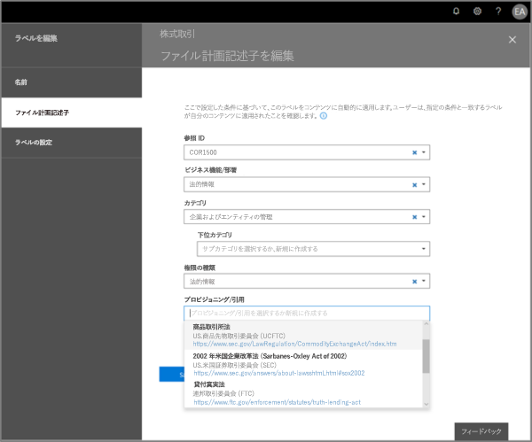
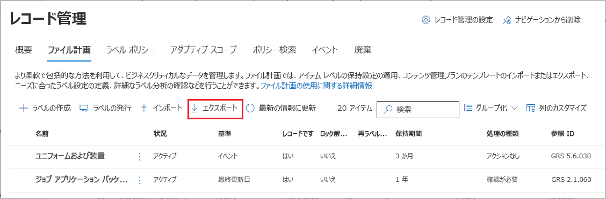
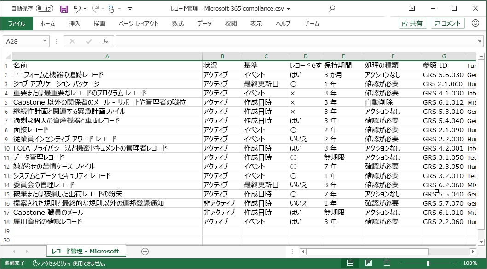
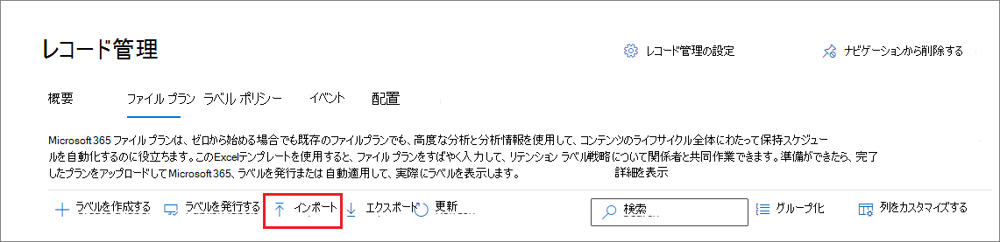
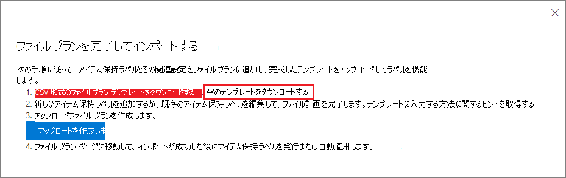
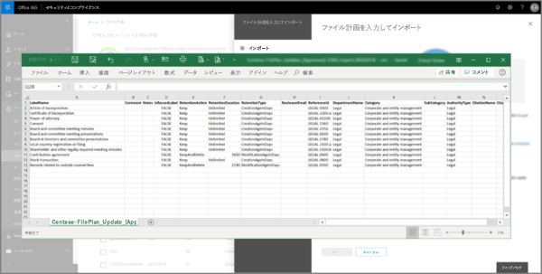
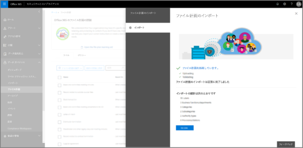

# ファイルプランを使用して保持ラベルを管理する

>*[セキュリティとコンプライアンスのための Microsoft 365 ライセンス ガイダンス](/office365/servicedescriptions/microsoft-365-service-descriptions/microsoft-365-tenantlevel-services-licensing-guidance/microsoft-365-security-compliance-licensing-guidance)。*

Microsoft 365 コンプライアンスセンターで、保持ラベルの作成と管理は **情報ガバナンス** から出来ますが、**レコード管理** からのファイルプランには追加の管理機能があります。

- スプレッドシートから関連情報をインポートして、保持ラベルを一括作成できます。

- 分析およびオフラインでの共同作業には、既存の保持ラベルから情報をエクスポートできます。

- 保持ラベルの詳細については、情報を見やすいように１つのビューから全ての保持ラベルの設定全体を表示しています。

- ファイルプラン記述子は、各ラベルの追加およびオプションの情報をサポートします。

ファイルプランは、コンテンツをレコードとしてマークしない場合でも、すべての保持ラベルに使用できます。

保持ラベルについて、そして使用方法の情報については、[保持ポリシーおよび保持ラベルについて詳しく見る](retention.md) をご覧ください。

## ファイル計画にアクセスしています

ファイル計画にアクセスするには、次のいずれかの管理者役割が必要です。
    
- 保持マネージャー

- 閲覧限定保持マネージャー

Microsoft 365 コンプライアンスセンターで、**ソリューション** > **レコード管理** > **ファイル計画** の順で移動します。 

**[レコード管理]** がナビゲーション ウィンドウに表示されない場合は、下にスクロールして **[すべて表示]** を選択します。

![[ファイル計画] ページ](../media/compliance-file-plan.png)

## ファイル計画を移動中

Microsoft 365 コンプライアンスセンターで、もしも既に **情報ガバナンス** から保持ラベルを作成済みの場合は、これらのラベルは自動的にファイル計画に表示されます。  

同様に、ファイル計画に保持ラベルを作成した場合、コンテンツをレコードとしてマークするようにラベルが構成されていない場合は、**情報ガバナンス** からも使用できます。

**ファイル計画** ページには、すべてのラベルの中に、状態や設定、オプションのファイル計画記述子、およびラベルのオフラインレビューを分析または有効にするエクスポートオプション、および保持ラベルを作成するインポートオプションが表示されます。 

### ラベル設定列

**名前** ラベルを除くすべての列を表示、または非表示にするには、 **列のカスタマイズ** オプションを選択します。 既定では、最初の幾つかの列にはラベルの状態とその設定に関する情報が表示されます。 

- **状態** は、ラベルポリシーにラベルが含まれているかどうか、或いは自動適用ポリシー (**アクティブ**) もしくはそうではない(**非アクティブ**).かを識別します。

- **基づき** どのように、もしくはいつ保持期間が開始するのかを識別します。 有効な値:
    - イベント
    - 作成日時
    - 最終更新日時
    - ラベルが付けられた日時

- **レコード** は、ラベルが適用されたときに、アイテムがレコードとしてマークされているかどうかを識別します。 有効な値:
    - 不要
    - はい
    - はい (法的)

- **保持期間** は、保持期間を識別します。 有効な値:
    - 日数
    - 月
    - 年数
    - 無期限
    - なし

- [**廃棄の種類**] は、保持期間終了時に何が起こるのかを識別します。 有効な値:
    - アクションなし
    - 自動削除
    - 確認が必要

### ファイル計画記述子列

ファイルプランでは、保持ラベルの一部として、より多くの情報を含めることができます。 これらのファイルプラン記述子には、ラベルを作成するのに必要なコンテンツの管理性と構成を改善するためのより多くのオプションが提供されています。

既定では、 **参照 ID** から始めると、次のいくつかの列には、保持ラベルを作成するとき、または既存のラベルを編集するときに指定できる、オプションのファイルプラン記述子が表示されます。 

この作業を開始するには、幾つかの既定値が次のファイルプラン記述子にあります。 
- ビジネス機能/部署
- カテゴリ
- 権限の種類
- プロビジョニング/引用 

保持ラベルを作成または編集する場合のファイルプラン記述子の例:

これらのオプションの記述子ごとに **[選択]** を選択すると、すぐに使用できる値の 1 つを選択するか、独自の値を作成して選択することができます。 次に例を示します。 

## すべての保持ラベルをエクスポートして、オフラインレビューを分析または有効にする

組織内のデータ ガバナンス関係者との定期的なコンプライアンス レビューを促進するように、ファイル計画マネージャーではすべての保持ラベルの詳細を .csv ファイルにエクスポートできます。

すべての保持ラベルをエクスポートするには: [**ファイル計画**] ページで [**エクスポート**] をクリックします。

A *.csv ファイルは既存の全ての保持ラベルを開く、を含みます。次に例を示します。

## ファイル計画に保持ラベルをインポートする

ファイル プランでは、特定のフォーマットの .csv ファイルを使用して、新しい保持ラベルを一括インポートすることができます。 

1. **ファイル計画** ページで、[**インポート** をクリックし、**ファイル計画の記入とインポート** ページを使用します。

   

   

2. 以下の手順に従って、空白のテンプレートをダウンロードします。

   

3. プロパティと各プロパティへの有効な値を説明する次の情報を使用して、テンプレートに入力します。インポートの場合、一部の値には最大文字数があります。
    
    - **LabelName**: 最大文字数 64 文字
    - **コメント** と **メモ**: 最大文字数 1024 文字
    - 他のすべての値: 文字数無制限
     
    
   |プロパティ|型|必須|有効な値|
   |:-----|:-----|:-----|:-----|
   |LabelName|文字列|はい|このプロパティは、保持ラベルの名前を指定します。このプロパティは、テナント内で一意である必要があります。|
   |コメント|文字列|いいえ|このプロパティを使用して、管理者の保持ラベルに関する説明を追加します。 この説明は、コンプライアンス センターでラベルを管理する管理者にのみ表示されます。|
   |Notes|文字列|いいえ|このプロパティを使用して、ユーザーの保持ラベルに関する説明を追加します。 この説明は、ユーザーが Outlook、SharePoint、OneDrive などのアプリでラベルにカーソルを置いたときに表示されます。 このプロパティを空白のままにすると、ラベルの保持設定を説明する既定の説明が表示されます。 |
   |IsRecordLabel|文字列|いいえ、**Regulatory** が **TRUE** でない場合です|このプロパティでは、ラベルがコンテンツをレコードとしてマークするかどうかを指定します。有効な値は次のとおりです。 **TRUE**: ラベルはアイテムをレコードとしてマークし、その結果としてアイテムを削除できません。  **FALSE**: ラベルは、コンテンツをレコードとしてマークしません。 これは既定の値です。     グループの依存関係: このプロパティが指定された場合、RetentionAction、 RetentionDuration、および RetentionType も指定される必要があります。|
   |RetentionAction|文字列|いいえ、**RetentionDuration**、**RetentionType**、または **ReviewerEmail** が指定されていない場合です|このプロパティは、RetentionDuration プロパティ (指定された場合) で指定された値の有効期限が切れた後に実行するアクションを指定します。有効な値は次のとおりです。 **Delete**: RetentionDuration プロパティで指定された値よりも古いアイテムが削除されます。 **Keep**: RetentionDuration プロパティで指定された期間のアイテムを保持し、期間が終了しても何もしません。  **KeepAndDelete**: RetentionDuration プロパティで指定された期間のアイテムを保持し、期間が終了したらそれらを削除します。     グループの依存関係: このプロパティが指定された場合、RetentionDuration および RetentionType も指定される必要があります。 |
   |RetentionDuration|文字列|いいえ、**RetentionAction** または **RetentionType** が指定されていない場合です|このプロパティは、コンテンツを保持する日数を指定します。有効な値は次のとおりです。 **Unlimited**: アイテムは無期限に保持されます。  **_n_*: 日付の正の整数です (例: _ **365**)。 サポート可能な最大数は 24,855 で、これは 68 年です。 この最大値よりも長い期間を必要とする場合は、代わりに Unlimited 版を使用します。    グループの依存関係: このプロパティが指定された場合、RetentionAction および RetentionType も指定される必要があります。
   |RetentionType|String|いいえ、**RetentionAction** または **RetentionDuration** が指定されていない場合です|プロパティは、コンテンツ作成日、イベント日、ラベルが付けられた日、または最終変更日のいずれから保持期間 (指定された場合) を計算するかを指定します。有効な値は次のとおりです。 **CreationAgeInDays** **EventAgeInDays** **TaggedAgeInDays** **ModificationAgeInDays**     グループの依存関係: このプロパティが指定された場合、RetentionAction および RetentionDuraction も指定される必要があります。|
   |ReviewerEmail|SmtpAddress|いいえ|このプロパティが指定された場合、保持期間が終了すると、廃棄のレビューがトリガーされます。 プロパティは、**KeepAndDelete** の保持期間用アクションのレビュー担当者の電子メール アドレスを指定します。     テナント内の個々のユーザー、配布グループまたはセキュリティ グループのメール アドレスを含めることが出来ます。 複数のメール アドレスをセミコロンで区切って指定します。     グループの依存関係: このプロパティが指定された場合、**RetentionAction** (**KeepAndDelete** である必要があります)、**RetentionDuration**、および **RetentionType** も指定される必要があります。|
   |ReferenceId|String|いいえ|このプロパティは、**参照 ID** ファイル計画記述子に表示される値を指定します。そしてこれは組織の固有の値として使うことが出来ます。| 
   |DepartmentName|文字列|いいえ|このプロパティは、**業務/部署** ファイル計画記述子に表示される値を指定します。|
   |カテゴリ|文字列|いいえ|このプロパティは、**カテゴリ** ファイル計画記述子に表示される値を指定します。|
   |下位カテゴリ|文字列|いいえ|このプロパティは、**サブカテゴリ** ファイル計画記述子に表示される値を指定します。|
   |AuthorityType|文字列|いいえ|このプロパティは、**管理組織の種類** ファイル計画記述子に表示される値を指定します。|
   |CitationName|String|いいえ|このプロパティは、**プロビジョニング/引用** ファイル計画記述子に表示される引用の名前を指定します。 例として、「2002 年米国企業改革法」。 |
   |CitationUrl|文字列|いいえ|このプロパティは、**規定/引用** ファイル計画記述子に表示される URL を指定します。|
   |CitationJurisdiction|String|いいえ|このプロパティは、**規定/引用** ファイル計画記述子に表示される管理規則または機関を指定します (例: 「米国証券取引委員会 (SEC)」)。|
   |Regulatory|文字列|いいえ|このプロパティでは、ラベルがコンテンツをレコードより[制限された](records-management.md#compare-restrictions-for-what-actions-are-allowed-or-blocked) Regulatory レコードとしてマークするかどうかを指定します。 このラベル構成を使用するには、[コンテンツを Regulatory レコードとしてマークするオプションを表示する](declare-records.md#how-to-display-the-option-to-mark-content-as-a-regulatory-record)ようにテナントを構成する必要があり、そうでない場合はインポートの検証が失敗します。 有効な値は次のとおりです。  **TRUE**: ラベルは、Regulatory レコードとしてアイテムをマークします。 また、**IsRecordLabel** プロパティを TRUE に設定する必要があります。 **FALSE**: ラベルは、コンテンツを Regulatory レコードとしてマークしません。 これが既定値です。|
   |EventType|文字列|いいえ、**RetentionType** が **EventAgeInDays** ではない場合です|このプロパティは、[イベントベースの保持](event-driven-retention.md)に使用するイベントの種類を指定します。 **[レコード管理]**、 > **[イベント]**、 > **[イベントの種類の管理]** に表示されている既存のイベントの種類を指定します。 または、[Get-CompianceRetentionEventType](/powershell/module/exchange/get-complianceretentioneventtype) コマンドレットを使用して、利用可能なイベントの種類を表示します。 **従業員活動** や **製品ライフタイム** など、いくつかの組み込みのイベントの種類がありますが、独自のイベントの種類を作成することもできます。     独自のイベントの種類を指定する場合、インポート プロセスの一環として名前が検証されるため、そのイベントの種類がインポート前に存在している必要があります。|
   |||

   保持ラベルに関する情報を含むテンプレートの例を次に示します。

   

4. **ファイル計画を入力しインポートする** ページの手順 3 で、**ファイルの参照** をクリックし、入力済みのテンプレートをアップロードして、**[次へ]** を選択します。

   ファイル計画では、ファイルをアップロードし、エントリを検証して、インポートの統計情報を表示します。

   

5. 検証結果に応じて、以下の操作を行います。
    
    - 検証に失敗した場合: インポート ファイルで修正する行番号と列名をメモします。 **[閉じる]**、**[OK]** の順に選択して確認します。 ファイルのエラーを修正して保存し、もう一度 **[インポート]** を選択して、手順 4 に戻ります。
    
    - 検証が成功した場合: **[Go Live]** を選択すると、保持ラベルをテナントで利用できるようになります。 あるいは、ページの ［閉じる］ アイコンを選択し、**[はい]** で、今回は保持ラベルをテナントで使用できないようにしてウィザードを終了することを確認します。

インポートされたラベルがテナントに追加されたときに、それらを公開してユーザーが利用できるようにするか、自動適用できるようになりました。 **[ラベル ポリシー]** タブから両方を実行し、**[ラベルの公開]** を選択するか、**[ラベルの自動適用]** を選択します。

## 次の手順

保持ラベルの作成と編集、およびそのポリシーの詳細については以下のガイダンスを参照してください。
- [アイテム保持ラベルを作成して、アプリに適用する](create-apply-retention-labels.md)
- [保持ラベルをコンテンツに自動的に適用する](apply-retention-labels-automatically.md)