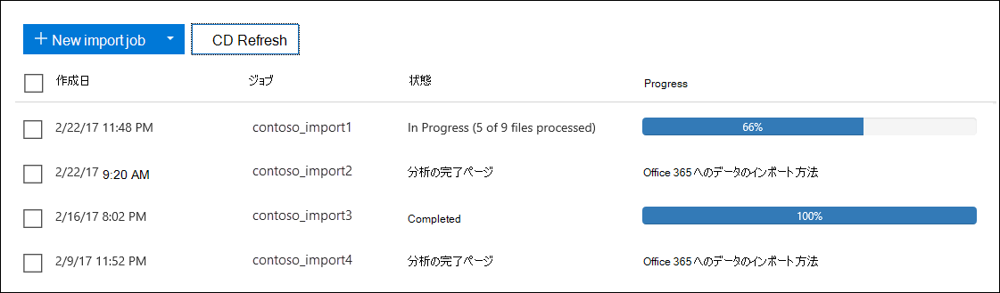
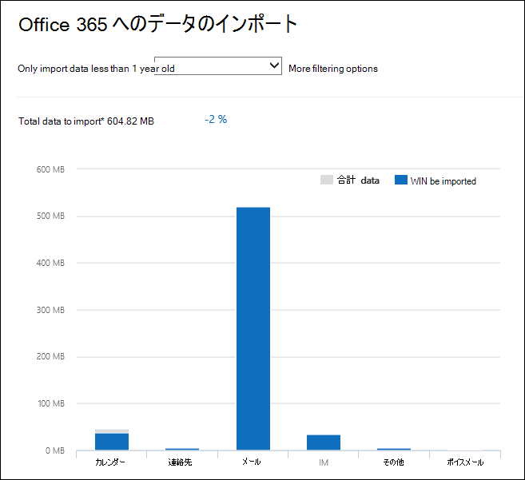

# PST ファイルをインポートするときに、データをフィルター処理する

Microsoft 365 Import サービスの新しいインテリジェント インポート機能を使用して、ターゲット メールボックスに実際にインポートされる PST ファイル内のアイテムをフィルター処理します。 次に、動作のしくみを示します。
  
- PST インポート ジョブを作成して送信すると、PST ファイルは Microsoft クラウドの Azure ストレージ領域にアップロードされます。
  
- Microsoft 365 は、メールボックス アイテムの年齢と PST ファイルに含まれるさまざまなメッセージの種類を識別することで、安全かつ安全な方法で PST ファイル内のデータを分析します。
  
- 分析が完了し、データをインポートする準備ができたら、PST ファイル内のすべてのデータをそのままインポートするか、インポートするデータを制御するフィルターを設定してインポートされたデータをトリミングするかを選択できます。 たとえば、次のように選択できます。
  
  - 特定の年齢のアイテムのみをインポートします。
  
  - 選択したメッセージの種類をインポートします。
  
  - 特定のユーザーが送受信するメッセージを除外します。
  
- フィルター設定を構成すると、Microsoft 365 は、フィルター条件を満たすデータのみをインポート ジョブで指定されたターゲット メールボックスにインポートします。
  
次の図は、インテリジェント インポート プロセスを示し、実行するタスクと、Office 365によって実行されるタスクを強調表示しています。
  

  
## PST インポート ジョブを作成する

- このトピックの手順では、ネットワーク アップロードまたはドライブ配送を使用して、Office 365 Import サービスで PST インポート ジョブを作成したことを前提としています。 詳細な手順については、次のいずれかのトピックを参照してください。
    
  - [ネットワーク アップロードを使用して PST ファイルを Office 365 にインストールする](use-network-upload-to-import-pst-files.md)
    
  - [ドライブの送付を使用して PST ファイルを Office 365 にインポートする](use-drive-shipping-to-import-pst-files-to-office-365.md)
    
- ネットワーク アップロードを使用してインポート ジョブを作成すると、セキュリティ & コンプライアンス センターの [インポート] ページのインポート ジョブの状態が **[分析中**] に設定されます。つまり、Microsoft 365 はアップロードした PST ファイルのデータを分析しています。 [ **更新]** をクリックして、インポート ジョブの状態を更新します。 
    
- ドライブ発送のインポート ジョブの場合、Microsoft データセンター担当者がハード ドライブを受け取り、組織の Azure ストレージ領域に PST ファイルをアップロードした後、データは Microsoft 365 によって分析されます。
  
## メールボックスにインポートされるデータをフィルター処理する

PST インポート ジョブを作成したら、次の手順に従ってデータをフィルター処理してから、Office 365にインポートします。
  
1. <a href="https://go.microsoft.com/fwlink/p/?linkid=2077149" target="_blank">Microsoft Purview コンプライアンス ポータル</a>に移動し、組織内の管理者アカウントの資格情報を使用してサインインします。
    
2. コンプライアンス ポータルの左側のウィンドウで、**[データ ライフサイクル管理]** \> **[インポート]** の順にクリックします。
    
    組織のインポート ジョブが [**インポート**] タブに一覧表示されます。**[状態]** 列の [**分析完了**] の値は、Microsoft 365 によって分析され、インポートする準備ができているインポート ジョブを示します。
    
    
  
3. 完了するインポート ジョブを選択し、[**インポートしてOffice 365]** をクリックします。
  
    PST ファイルに関する情報とインポート ジョブに関するその他の情報を示すポップアップ ページが表示されます。

4. [**インポート] をクリックしてOffice 365** します。
    
    [**データのフィルター処理**] ページが表示されます。 これには、インポート ジョブの PST ファイル内のデータに関するデータ分析情報 (データの経過時間に関する情報を含む) が含まれます。 
    
    ![[データのフィルター] ページには、インポート ジョブの PST ファイルのデータ分析情報が表示されます。](../media/3b537ec0-25a4-45a4-96d5-a429e2a33128.png)
  
5. Microsoft 365 にインポートされたデータをトリミングするかどうかに基づいて、[ **データをフィルター処理** しますか?
  
    a. [ **はい] をクリックし、インポートする前にフィルター処理してインポート** するデータをトリミングし、[ **次へ**] をクリックします。
  
    **[Office 365にデータをインポートする] ページ** ページには、Microsoft 365 が実行した分析の詳細なデータ分析情報が表示されます。 
  
    
  
    このページのグラフには、インポートされるデータの量が表示されます。 PST ファイルで見つかった各メッセージの種類に関する情報がグラフに表示されます。 各バーの上にカーソルを置くと、そのメッセージの種類に関する特定の情報を表示できます。 PST ファイルの分析に基づいて、異なる年齢値を持つドロップダウン リストもあります。 ドロップダウン リストで年齢を選択すると、グラフが更新され、選択した年齢に対してインポートされるデータの量が表示されます。 
  
    b. インポートされるデータの量を減らすために追加フィルターを構成するには、[ **その他のフィルター オプション**] をクリックします。
  
    ![インポートされたデータをトリミングするには、[その他のオプション] ページでフィルターを構成します。](../media/3f8d68c3-3fe2-4b4e-9488-b368b98fa9fe.png)
  
    次のフィルターを構成できます。
  
      - **年齢** - 指定した年齢より新しいアイテムのみがインポートされるように、年齢を選択します。 Microsoft 365 が **Age** フィルターの年齢バケットを決定する方法の詳細については、「[詳細情報](#more-information)」セクションを参照してください。 
  
      - **[種類]** - このセクションには、インポート ジョブの PST ファイルで見つかったすべてのメッセージの種類が表示されます。 除外するメッセージの種類の横にあるボックスをオフにすることができます。 その他のメッセージの種類を除外することはできません。 その他のカテゴリに含まれるメールボックス アイテムの一覧については、「 [詳細情報](#more-information) 」セクションを参照してください。
  
      - **ユーザー** - 特定のユーザーが送受信するメッセージを除外できます。 差出人フィールド、宛先: フィールド、またはメッセージの Cc: フィールドに表示されるユーザーを除外するには、その受信者の種類の横にある [ **ユーザーの除外** ] をクリックします。 ユーザーのメール アドレス (SMTP アドレス) を入力し、[新しい **追加]** をクリックして、その受信者の種類の除外されたユーザーの一覧に追加し、[ **保存]** をクリックして除外されたユーザーの一覧を保存します。 
  
        > [!NOTE]
        > Microsoft 365 では、People フィルターの設定に起因するデータ分析情報 **は** 表示されません。 ただし、特定のユーザーが送受信するメッセージを除外するようにこのフィルターを設定した場合、それらのメッセージは実際のインポート プロセス中に除外されます。 
  
    c. [**その他のフィルター オプション**] ポップアップ ページで [**適用]** をクリックして、フィルター設定を保存します。 
  
    **[Office 365へのデータのインポート]** ページのデータ分析情報は、フィルター設定に基づいてインポートされるデータの合計量を含め、フィルター設定に基づいて更新されます。 フィルター設定の概要も表示されます。 必要に応じて、フィルターの横にある **[編集]** をクリックして設定を変更できます。 
  
    
  
    d. **[次へ]** をクリックします。
  
    フィルター設定を示す状態ページが表示されます。 ここでも、任意のフィルター設定を編集できます。
  
    e. [ **データのインポート]** をクリックしてインポートを開始します。 インポートされるデータの合計量が表示されます。 
  
    または
  
    a. [いいえ] をクリック **し、すべてのデータをインポートして** PST ファイル内のすべてのデータをOffice 365にインポートし、[**次へ**] をクリックします。
  
    b. [**Office 365データのインポート**] ページで、[**データのインポート**] をクリックしてインポートを開始します。 インポートされるデータの合計量が表示されます。 
  
6. [**インポート**] タブで、[**更新**](../media/165fb3ad-38a8-4dd9-9e76-296aefd96334.png)] ![をクリックします。 インポート ジョブの状態が [ **状態]** 列に表示されます。
  
7. インポート ジョブをクリックすると、各 PST ファイルの状態や、構成したフィルター設定など、より詳細な情報が表示されます。

## 詳細情報

- Microsoft 365 では、年齢フィルターの増分はどのように決定されますか? Microsoft 365 が PST ファイルを分析すると、各項目の送信または受信したタイムスタンプが表示されます (アイテムに送信タイムスタンプと受信タイムスタンプの両方がある場合は、最も古い日付が選択されます)。 次に、Microsoft 365 は、そのタイムスタンプの年の値を調べ、それを現在の日付と比較してアイテムの年齢を決定します。 これらの年齢は、 **Age** フィルターのドロップダウン リストの値として使用されます。 たとえば、PST ファイルに 2016 年、2015 年、2014 年のメッセージがある場合、 **年齢** フィルターの値は **1 年**、 **2 年**、 **3 年** になります。
  
- 次の表に、[その他の **オプション**] ポップアップ ページの **[種類**] フィルターの **[その他**] カテゴリに含まれるメッセージの種類を示します (前の手順の手順 5b を参照)。 現時点では、OFFICE 365に PST をインポートするときに、"その他" カテゴリの項目を除外することはできません。 
  
    |**メッセージ クラス ID**|**このメッセージ クラスを使用するメールボックス アイテム**|
    |:-----|:-----|
    |IPM。活動    |履歴項目    |
    |IPM。ドキュメント    |ドキュメントとファイル (電子メール メッセージに添付されていません)    |
    |IPM。ファイル    |(IPM と同じ)。ドキュメント)    |
    |IPM。注.IMC.Notification    |インターネットへのExchange Server ゲートウェイである Internet Mail Connect によって送信されたレポート    |
    |IPM。注.Microsoft.Fax    |FAX メッセージ    |
    |IPM。Note.Rules.Oof.Template.Microsoft    |不在時の自動表示メッセージ    |
    |IPM。Note.Rules.ReplyTemplate.Microsoft    |受信トレイ ルールによって送信された返信    |
    |IPM。OLE。クラス    |定期的な系列の例外    |
    |IPM。Recall.Report    |メッセージ取り消しレポート    |
    |IPM。リモート    |リモート メール メッセージ    |
    |IPM。レポート    |アイテムの状態レポート    |
