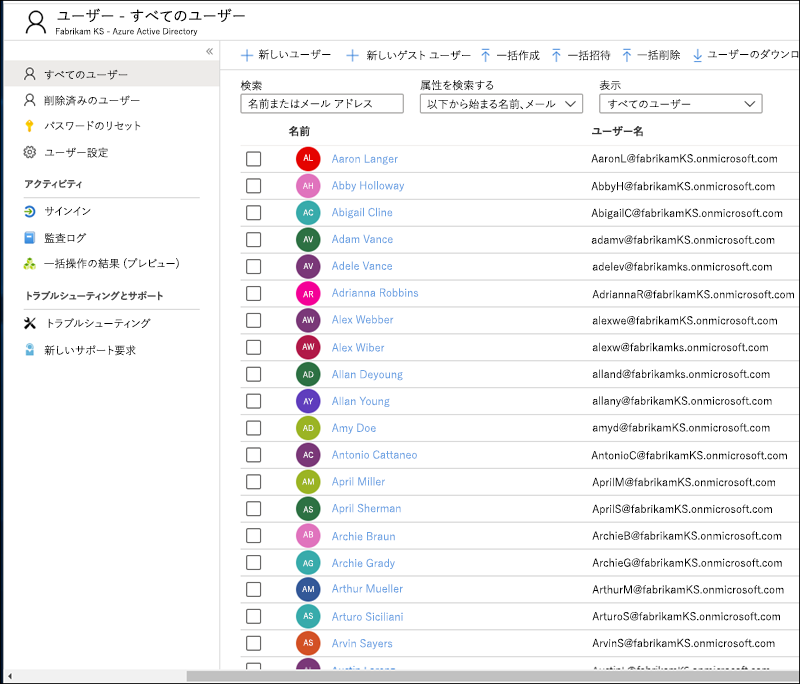
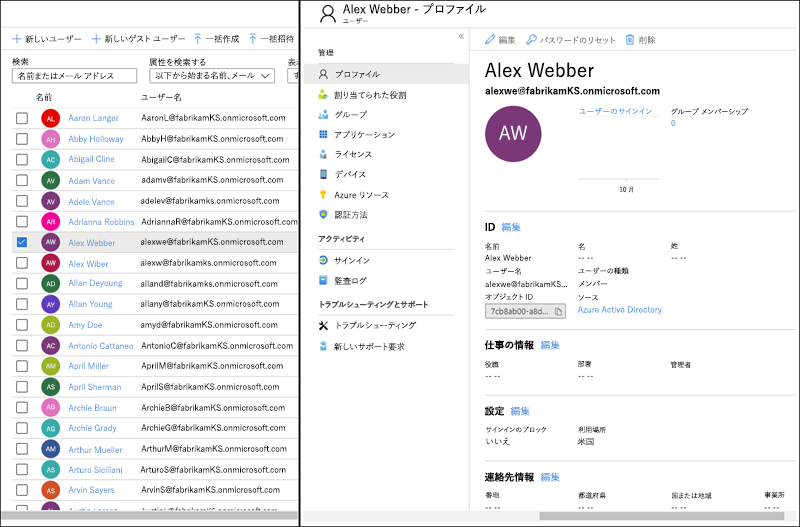
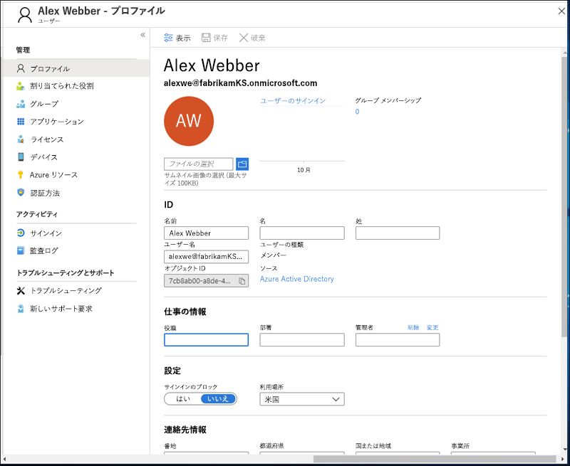
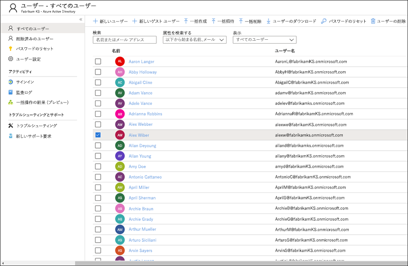
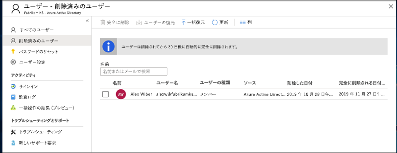
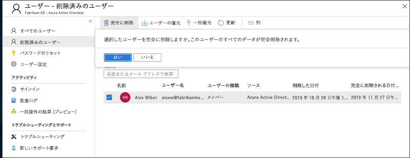
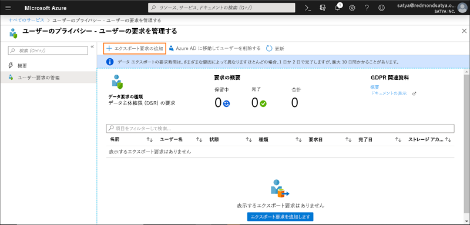

# GDPR および CCPA のための Azure データ主体要求

## データ主体要求 (DSR) の概要

欧州連合の[一般データ保護規則 (GDPR)](https://ec.europa.eu/justice/data-protection/reform/index_en.htm) は、雇用主または他の種類の機関や組織 (*データ コントローラー*または単に*コントローラー*と呼ばれます) によって収集された個人データを管理する権限を個人 (同規則にでは*データ主体*と呼ばれます) に与えます。GDPR での個人データは、特定されたまたは特定可能な自然人に関連するすべてのデータと、非常に幅広く定義されています。GDPR では、個人データに対するデータ主体固有の権限が付与されます。このような権限には、個人データのコピーの取得、個人データの修正の要求、個人データの処理の制限、個人データの削除、または別のコントローラーに移動できる電子的な形式での個人データの受け取りが含まれます。データ 主体からコントローラーに個人データへのアクション実行を求める正式な要求は、*データ主体要求*または DSR と呼ばれます。

同様に、カリフォルニア州消費者プライバシー法 (CCPA) では、個人情報の削除、アクセスおよび受信 (移植性) など、GDPR のデータ主体の権利に類似している権利を含む、カリフォルニア州の消費者のプライバシーの権利および義務を規定します。 また、CCPA では、特定の開示、権利の行使を選択する際の差別に対する保護、"売上" として分類された特定のデータ転送の "オプトアウト/オプトイン" 要件を規定します。 「販売」は広く定義されており、有価約因に関するデータの共有を含みます。 CCPA の詳細については、「[カリフォルニア州消費者プライバシー法](offering-ccpa.md)」と「[カリフォルニア州消費者プライバシー法に関する FAQ](ccpa-faq.md)」を参照してください。

このガイドでは、コントローラーが DSR 要求に応じて個人データを検索して操作できるように Microsoft 製品、サービス、管理ツールを使用する方法について説明します。 具体的には、Microsoft のクラウド内に存在する個人データの検索、アクセス、および操作方法について説明します。 このガイドに記載されているプロセスの概要を次に示します。

- **検出:** 検索および検出ツールを使用して、DSR の対象である可能性がある顧客データを簡単に検索します。 可能性のある応答ドキュメントが収集されると、以下の手順に示す 1 つ以上の DSR アクションを実行して、要求に応答できます。 または、DSR への応答に関する組織のガイドラインを要求が満たしていないと判断する場合もあります。
- **アクセス:** Microsoft クラウドにある個人データを取り出し、要求がある場合は、データ主体が利用できるコピーを作成します。
- **修正:** 必要に応じて、個人データを変更したり、要求された他の操作を個人データに対して実行したりします。
- **制限:** さまざまな Azure サービスのライセンスを削除するか、可能な場合は該当するサービスを無効にすることで、個人データの処理を制限します。 また、データを Microsoft クラウドから削除してオンプレミスまたは別の場所で保持することもできます。
- **削除:** Microsoft クラウドに格納されていた個人データを完全に削除します。
- **エクスポート/受信 (移植性):** 個人データまたは個人情報の電子コピー (コンピューターで読み取り可能な形式) をデータ主体に提供します。 CCPA における個人情報とは、識別された人、または識別可能な人に関するあらゆる情報のことです。 個人の私的、公的、または職業上の役割による区別はありません。 "個人情報" と定義された用語は、GDPR における "個人データ" とほぼ同義です。 ただし、CCPA では家族データおよび世帯データも含まれます。 CCPA の詳細については、「[カリフォルニア州消費者プライバシー法](offering-ccpa.md)」と「[カリフォルニア州消費者プライバシー法に関する FAQ](ccpa-faq.md)」を参照してください。

このガイドの各セクションでは、Microsoft クラウド内の個人データに関する DSR への対応としてデータ コントローラー組織が実行できる技術的な手順の概要を示します。

## 用語集

このガイドに関連する用語を以下に定義します。

- **管理者:** 単独または他者と共同で、個人データの処理に関する目的と手段を決定する自然人や法人、公的機関、団体、その他の組織。そのような処理の目的と手段が EU 法もしくは加盟国の法律によって決定される場合、コントローラーまたはその指名に関する具体的な基準が EU 法または加盟国の法律によって提供される場合があります。
- **個人データおよびデータ主体:** 特定されたまたは特定可能な自然人 ('データ主体') に関するあらゆる情報。特定可能な自然人とは、その者の名前、ID 番号、位置データ、オンライン ID、または当該自然人に固有の 1 つ以上の特に身体的、生理学的、遺伝的、心理的、経済的、文化的、社会的な識別情報などの要素を参照することにより、直接または間接的に特定することができる者のことです。
- **処理者:** 管理者に代わって個人データを処理する自然人または法人、公的機関、団体、その他の組織。
- **顧客データ:** これは、顧客または顧客の代理が エンタープライズ サービスの使用を通じて Microsoft に提供する、テキスト、音声、ビデオ、画像ファイル、およびソフトウェアを含むすべてのデータのことです。 顧客データには次の両方が含まれます: (1) 特定を可能にするエンド ユーザーの情報 (例: Azure Active Directory でのユーザー名と連絡先情報)、および (2) 特定のサービスでお客様がアップロードまたは作成する顧客コンテンツ (例: Azure Storage アカウント内の顧客コンテンツ、Azure SQL データベースの顧客コンテンツ、Azure Virtual Machines でのお客様の仮想マシン イメージ)。
- **システム生成ログ:** Microsoft がエンタープライズ サービスをユーザーに提供するうえで役立つ、Microsoft により生成されるログおよび関連データ。 システム生成ログには主に固有 ID などの仮名化データが含まれています。固有 ID とは一般的に、それ自体は特定の個人を識別しないものの、エンタープライズ サービスをユーザーに提供するために使われるシステム生成番号です。 また、ユーザー名などの、特定を可能にするエンド ユーザーの情報がシステム生成ログに含まれることもあります。

## このガイドの使用方法

このガイドは次のような 2 部構成になっています。

- **第 1 部: 顧客データに関するデータ サブジェクト要求に対応する:** このガイドの第 1 部では、アプリケーションで作成されたデータにアクセスし、データを修正、制限、削除、エクスポートする方法を示します。 このセクションでは、カスタマー コンテンツとエンド ユーザー個人情報の両方に対して DSR を実行する方法について詳しく述べます。
- **第 2 部: システム生成ログに関するデータ主体の要求に対応する:** Microsoft のエンタープライズ サービスを利用する際、Microsoft がサービスを提供するために使われるシステム生成ログという情報が生成されます。 このガイドの第 2 部では、Azure でこのような情報にアクセスしたり、削除したり、エクスポートしたりする方法について説明します。

## Azure Active Directory および Microsoft サービス アカウントに関する DSR について

お客様企業へのサービス提供を考慮するとき、特定の Azure Active Directory (AAD) テナント内のコンテキストで常に DSR の実行について理解する必要があります。特に、DSR は特定の AAD テナントの内部で常に実行されます。あるユーザーが複数のテナントに参加する場合、要求を受け取った特定のテナントのコンテキスト内で*のみ*、その DSR が実行されることを強調することが重要です。あるお客様企業からの DSR を実行しても、隣接するお客様企業のデータは影響を**受けない**という点を理解することは重要です。

また、Microsoft Service Accounts (MSA) に関しても、お客様企業に提供されるサービスのコンテキスト内で同じことが当てはまります。*ある AAD テナントに関連付けられた* MSA アカウントに対する DSR 実行では、そのテナント内のデータ**のみ**が対象となります。さらに、テナント内の MSA アカウントを扱う際には次の点を理解することが重要です:

- MSA ユーザーが Azure サブスクリプションを作成すると、そのサブスクリプションは AAD テナントであるかのように扱われます。その結果、DSR の範囲は上記のようにテナント内となります。
- MSA アカウントを介して作成された Azure サブスクリプションが削除された場合、実際の MSA アカウントには影響が**ありません**。ここでも、上記のように、Azure サブスクリプション内で実行される DSR はテナント自体の範囲に限定されます。

**特定のテナント外部の** MSA アカウント自体に対する DSR は、カスタマー プライバシー ダッシュボードを介して実行されます。詳しくは、Windows データ サブジェクト要求ガイドを参照してください。

## 第 1 部: 顧客データに関する DSR ガイド

### 顧客データに対する DSR の実行

特定のお客様データにアクセスし、それを削除したりエクスポートしたりするには、Azure ポータルを使用するか、特定のサービス用の既存のアプリケーション プログラミング インターフェイス (API) やユーザー インターフェイス (UI) を直接使用することができます (後者は*製品内エクスペリエンス*とも呼ばれます)。このような製品内エクスペリエンスについての詳細は、各サービスのリファレンス ドキュメントに記載されています。

>[!IMPORTANT]  
> 製品内 DSR をサポートするサービスでは、そのサービスのアプリケーション プログラミング インターフェイス (API) またはユーザー インターフェイス (UI) を直接使用し、該当する CRUD (作成、読み取り、更新、削除) 操作を記述する必要があります。したがって、特定のデータ主体の要求全体を完了するには Azure ポータル内での DSR 実行に加えて特定のサービス内での DSR の実行が必要です。詳細については、特定のサービスのリファレンス ドキュメントを参照してください。

### ステップ 1: 検出

DSR に対応する最初の手順は、要求の件名の個人データを見つけることです。 この第 1 ステップ (該当する個人データの検出と確認) により、DSR の承認/拒否に関する組織の要件を DSR が満たしているかどうか判断できます。 たとえば、該当する個人データを検出して確認した後、その要求を実行すると他者の権利や自由が侵害される恐れがあるので、その要求は組織の要件に適合しないと判断する場合があるかもしれません。

データが見つかったら、データ主体の要求に対応するために特定の操作を実行できます。

[Azure Active Directory](https://azure.microsoft.com/services/active-directory/) Microsoft が提供する対応クラウド ベースのマルチテナントのディレクトリ/ID 管理サービスです。 [Azure Active Directory](https://azure.microsoft.com/services/active-directory/) (AAD) 環境にある個人データを含むエンド ユーザー個人情報 (顧客や従業員のユーザー プロファイルなど) およびユーザー勤務先情報を見つけるには、[Azure Portal](https://portal.azure.com/) を使用できます。

これは、特定のユーザーの個人データを検索または変更する場合に特に便利です。 ユーザー プロファイルや勤務先情報を追加したり、変更したりすることもできます。 ディレクトリのグローバル管理者のアカウントを使用してサインインする必要があります。

#### ユーザー プロファイルや勤務先情報を検出または表示する方法

1. ディレクトリのグローバル管理者であるアカウントを使用して [Azure Portal](https://portal.azure.com/) にサインインします。

2. [**Azure Active Directory**] を選択します。

     ![[すべてのサービス] を選択します](../media/gdpr-azure-dsr-azure-portal.png)

3. [**ユーザー**] を選択します。

     

4. [**すべてのユーザー**] ブレードで、リストからユーザーを選択し、そのユーザーのブレードの [**プロファイル**] を選択すると、ユーザー プロファイル情報が表示されます。そこには個人データが含まれる可能性があります。

    

5. ユーザー プロファイル情報を追加または変更する必要がある場合は、コマンド バーの [**編集**] を選択し、追加または変更を行った後に、[**保存**] を選択します。 

#### サービス固有のインターフェイス

特定のサービス用の既存のアプリケーション プログラミング インターフェイス (API) またはユーザー インターフェイス (UI) を介して顧客データを直接検出できます。各サービスの参照ドキュメントに詳細が記載され、該当する CRUD (作成、読み取り、更新、削除) 操作について記述しています。

### ステップ 2: アクセス

DSR に応答する可能性のある個人データを含む顧客データを発見したら、担当者および組織は、データ主体に提供するデータを決定する必要があります。実際のドキュメントのコピー、適切に編集したバージョン、または共有できると判断した部分のスクリーン ショットを提供することができます。アクセス要求に対するこれらの各応答には、応答性の高いデータを含むドキュメントまたはその他のアイテムのコピーを取得する必要があります。

データ主体にコピーを提供する際には、別のデータ主体に関する個人情報などの機密情報を削除または編集することが必要になる場合があります。

#### Azure Active Directory

お客様企業のテナント管理者はポータルと製品エクスペリエンスの両方を利用して、DSR アクセス要求を管理することができます。 DSR アクセス要求により、(a) エンド ユーザーに関する特定可能なデータ、および (b) システム生成ログを含むユーザーの個人データへのアクセスが可能になります。

#### サービス固有のインターフェイス

特定のサービス用の既存のアプリケーション プログラミング インターフェイス (API) またはユーザー インターフェイス (UI) を介して顧客データを直接検出できます。各サービスの参照ドキュメントに詳細が記載され、該当する CRUD (作成、読み取り、更新、削除) 操作について記述しています。

### ステップ 3: 修正

データ主体が、組織のデータに存在する個人データの修正を求めた場合、担当者および組織は、その要求に応じることが適切かどうかを判断する必要があります。 データの訂正には、ドキュメントや他の種類のアイテムに含まれている個人情報の編集、修正、または削除などの処置が伴います。 Microsoft サポートおよび FastTrack のデータに対してこれを行うには、次のような最適な方法があります。

#### Azure Active Directory

お客様企業は、各 Microsoft サービスの性質に応じて、限定的な編集を含む DSR 修正要求の管理機能を利用できます。Microsoft はデータ プロセッサとして、システム生成ログの修正機能を提供しません。これはシステム生成ログが実際のアクティビティを表し、Microsoft サービス内のイベントの履歴レコードを形成するためです。Azure Active Directory に関しては、下記で説明するように、エンド ユーザーの個人情報を限定的に編集できる機能があります。

##### Azure Active Directory: 不正確または不完全な個人データの修正

[Azure Active Directory](https://azure.microsoft.com/services/active-directory/) (AAD) 環境で [Azure Portal](https://portal.azure.com/) を使用すると、ユーザーの氏名、役職、住所、電話番号などの個人データを含むエンド ユーザー個人情報 (顧客や従業員のユーザー プロファイルなど) やユーザーの勤務先情報を修正、更新、または削除することができます。 ディレクトリのグローバル管理者のアカウントを使用してサインインする必要があります。

###### Azure Active Directory でユーザー プロファイルや勤務先情報を修正または更新する方法

1. ディレクトリのグローバル管理者であるアカウントを使用して [Azure Portal](https://portal.azure.com/) にサインインします。

2. [**Azure Active Directory**] を選択します。

    ![[すべてのサービス] を選択します](../media/gdpr-azure-dsr-azure-portal.png)

3. [**ユーザー**] を選択します。

    

4. [**すべてのユーザー**] ブレードで、リストからユーザーを選択し、そのユーザーのブレードの [**プロファイル**] を選択して修正または更新が必要なユーザー プロファイル情報を表示します。

    

5. コマンド バーの [**編集**] を選択して勤務先情報を含むユーザー プロファイル情報を修正または更新し、更新が完了したら [ **保存**] を選択します。 

    

#### サービス固有のインターフェイス

特定のサービス用の既存のアプリケーション プログラミング インターフェイス (API) またはユーザー インターフェイス (UI) を介して顧客データを直接検出できます。各サービスの参照ドキュメントに詳細が記載され、該当する CRUD (作成、読み取り、更新、削除) 操作について記述しています。

### ステップ 4: 制限

データ主体は個人データの処理を制限することを要求する場合があります。 Azure Portal と既存のアプリケーション プログラミング インターフェイス (API) またはユーザー インターフェイス (UI) の両方を提供します。 これらのエクスペリエンスを利用すると、お客様企業のテナント管理者は、データのエクスポートとデータの削除を組み合わせて、DSR を管理することができます。 お客様は (1) (a) アカウント、(b) システム生成ログ、および (c) 関連ログを含むユーザーの個人データの電子コピーをエクスポートすることができ、続いて (2) Microsoft システム内に存在するアカウントおよび関連付けられたデータが削除されます。

### ステップ 5: 削除

組織のサポート データからの個人データの削除による「削除する権利」は GDPR における主要な保護の 1 つです。 個人データの削除には、監査ログ情報を除く、すべての個人データとシステム生成ログの削除が含まれます。 あるユーザーが**回復可能削除** (下記を参照) されると、そのアカウントが 30 日間にわたり無効になります。 この 30 日間に何のアクションも行われない場合、そのユーザーは**完全削除** (これも下記を参照) されます。  **完全削除**された場合、そのユーザーのアカウント、個人データ、システム生成ログがその後 30 日以内に抹消されます。 テナント管理者が即時に**完全削除**を発行した場合、ユーザーのアカウント、個人データ、システム生成ログがその後 30 日以内に抹消されます。

> [!IMPORTANT]
> ユーザーをテナントから削除するには、テナント管理者でなければなりません。

#### Azure Portal を介してユーザーおよび関連データを削除する

データ サブジェクトから削除要求を受け取った後、Azure Portal を使用してユーザーおよび関連する個人情報、さらにシステム生成ログを削除することができます。

このデータを削除すると、それとともにテナントからユーザーが削除されます。ユーザーは最初に回復可能な方法で削除されます。つまり、回復可能削除のマークが付いてから 30 日以内にテナント管理者がアカウントを回復することができます。30 日後は、アカウントがテナントから自動的かつ完全に削除されます。この 30 日が経過する前に、回復可能削除されたユーザーをごみ箱から手動で削除できます。

テナントからユーザーを削除する大まかな手順は次のとおりです。

1. Azure Portal に移動し、ユーザーを見つけます。

2. ユーザーを削除します。 ユーザーを最初に削除すると、ユーザーのアカウントがごみ箱に送信されます。 **この時点で、ユーザーは論理的に削除されます。つまり、アカウントは無効になりますが、Azure Active Directory から抹消されません。**

3. 最近削除されたユーザーのリストに移動して、ユーザーを永続的に削除します。**この時点でユーザーが永続的に削除されます (完全削除ともいう)。つまりアカウントが Azure Active Directory から抹消済みになります**

###### Azure テナントからユーザーを削除するには

1. ディレクトリのグローバル管理者のアカウントを使用して [Azure Portal](https://portal.azure.com/) にサインインします。

2. [**Azure Active Directory**] を選択します。

    ![[すべてのサービス] を選択します](../media/gdpr-azure-dsr-azure-portal.png)

3. [**ユーザー**] を選択します。

    

4. 削除するユーザーの横にあるボックスをオンにして **[ユーザーの削除]** を選択し、ユーザー削除を確認するボックスで **[はい]** を選択します。

    

5. [ **すべてのユーザー**]  ブレードで、[ **削除済みユーザー**] を選択します。

    

4. 同じユーザーを再び選択し、コマンド バーで　 **[完全に削除する]** を選択して、確認を求めるボックスで  **[はい]**   を選択します。

>[!IMPORTANT]  
>**[はい]** をクリックすると、ユーザーと関連するすべてのデータとシステムで生成されたログが完全に削除され、元に戻せないことに注意してください。 間違ってこれを行った場合は、手動でテナントにユーザーを追加する必要があります。 関連付けられたデータとシステム生成のログは回復できません。

   

#### サービス固有のインターフェイス

特定のサービス用の既存のアプリケーション プログラミング インターフェイス (API) またはユーザー インターフェイス (UI) を介して顧客データを直接検出できます。各サービスの参照ドキュメントに詳細が記載され、該当する CRUD (作成、読み取り、更新、削除) 操作について記述しています。

## ステップ 6: エクスポート

「データ移植性の権利」により、データ主体は、別のデータ コントローラーに送信できる電子的な形式 (つまり構造化され、一般使用される、マシン読み取り可能かつ相互運用可能な形式) の個人データのコピーを要求できます。 Azure では、ユーザーの組織がネイティブ JSON 形式のデータを指定の Azure Storage コンテナーにエクスポートできるようにすることでこれをサポートしています。

>[!IMPORTANT]
>ユーザー データをテナントからエクスポートするには、テナント管理者である必要があります。

### Azure Active Directory

顧客データに関して、お客様企業のテナント管理者はポータルと製品エクスペリエンスの両方を利用して、エンド ユーザーに関する特定可能な情報のエクスポート要求を管理することができます。

### サービス固有のインターフェイス

特定のサービス用の既存のアプリケーション プログラミング インターフェイス (API) またはユーザー インターフェイス (UI) を介して顧客データを直接検出できます。各サービスの参照ドキュメントに詳細が記載され、該当する CRUD (作成、読み取り、更新、削除) 操作について記述しています。

## 第 2 部: システム生成ログ

さらに、ユーザーによる Azure 使用状況に関連する特定のシステム生成ログにアクセスし、それを削除したりエクスポートしたりできます。

>[!IMPORTANT]
> システム生成ログを制限または修正する機能はサポートされていない点に注意してください。システム生成ログは、Microsoft クラウド内で実行された実際のアクションと診断データを形成し、そのようなデータが変更されるとアクションの履歴記録が損なわれ、詐欺やセキュリティのリスクが増大します。

### システム生成ログに対する DSR の実行

Azure ポータルを使用したり、特定のサービス用のプログラマティック インターフェイスまたはユーザー インターフェイスを直接使用したりすることで、特定のシステム生成ログにアクセスし、削除/エクスポートすることができます。 詳細については、各サービスの参照ドキュメンテーションに記載されています。

>[!IMPORTANT]  
> 製品内の DSR をサポートするサービスは、サービスのアプリケーション プログラミング インターフェイス (API) またはユーザー インターフェイス (UI) を直接使用する必要があります。 したがって、特定のデータ サブジェクトの要求全体を完了するには Azure ポータル内での DSR 実行に加えて製品内 DSR **を実行する必要があります。詳細については、特定のサービスの参照ドキュメントをご覧ください。**

### ステップ 1: アクセス

テナント管理者は、組織内で、特定のユーザーの Azure の使用に関連付けられたシステム生成ログにアクセスできる唯一のユーザーです。 アクセス要求に対して取得されるデータは、コンピューターが読み取り可能な形式で提供され、ユーザーがデータに関連付けられているサービスを認識できるファイルで提供されます。 上記で説明したように、取得されるデータにはサービスのセキュリティを損なう可能性があるデータは含まれません。

#### Azure Active Directory

お客様企業のテナント管理者は、ポータルおよび製品内エクスペリエンスを介してアクセス要求を管理できます。 アクセス要求では (a) エンド ユーザーに関する特定可能なデータ、および (b) サービス生成ログを含むユーザーの個人データへのアクセスが扱われます。 このプロセスは、第 1 部「ステップ 2: アクセス」の Azure Active Directory セクションで説明するプロセスと同じです。

#### サービス固有のインターフェイス

特定のサービス用の既存のアプリケーション プログラミング インターフェイス (API) またはユーザー インターフェイス (UI) を介して顧客データを直接検出できます。各サービスの参照ドキュメントに詳細が記載され、該当する CRUD (作成、読み取り、更新、削除) 操作について記述しています。

### ステップ 2: 削除

組織内で、Azure テナントの特定のユーザーに関する DSR 削除要求を実行できるのはテナント管理者だけです。

#### Azure Active Directory

お客様企業のテナント管理者はポータルと製品エクスペリエンスの両方を利用して、DSR 削除要求を管理することができます。 DSR 削除要求は、「第 1 部、ステップ 5: 削除の「Azure portal でユーザーと関連データを削除する」セクションで説明されているのと同じです。

#### サービス固有のインターフェイス

特定のサービス用の既存のアプリケーション プログラミング インターフェイス (API) またはユーザー インターフェイス (UI) を介して顧客データを直接検出できます。各サービスの参照ドキュメントに詳細が記載され、該当する CRUD (作成、読み取り、更新、削除) 操作について記述しています。

### ステップ 3: エクスポート

テナント管理者は、組織内で、特定のユーザーの Azure の使用に関連付けられたシステム生成ログにアクセスできる唯一のユーザーです。 エクスポート要求に対して取得されるデータは、コンピューターが読み取り可能な形式で提供され、ユーザーがデータに関連付けられているサービスを認識できるファイルで提供されます。 上記で説明したように、取得されるデータにはサービスのセキュリティまたは安定性を損なう可能性があるデータは含まれません。

#### Azure Portal を使用してシステム生成ログをエクスポートする

データ サブジェクトのエクスポート要求を受け取った後、Azure Portal を使用して、特定のユーザーに関連するシステム生成ログをエクスポートできます。

テナントからデータをエクスポートする大まかな手順は次のとおりです。

1. Azure Portal に移動し、ユーザーに代わってエクスポート要求を作成します。
2. データをエクスポートして、ファイルをユーザーに送ります。

###### Azure テナントからユーザーの情報をエクスポートするには

1. Azure Portal を開き、**[すべてのサービス]** を選択し、フィルターに「*policy*」と入力して **[ポリシー]** を選択します。

     ![[すべてのサービス] フィルター ](../media/gdpr-azure-dsr-azure-policy.png)

2. **[ポリシー]** ブレードで **[ユーザー プライバシー]** を選択し、**[ユーザー要求の管理]** を選択して、**[エクスポート要求の追加]** を選択します。

    

3. **[データ エクスポート要求]** に次のように入力します。

    

- **ユーザー**: エクスポートを要求した Azure Active Directory ユーザーの電子メール アドレスを入力します。
- **サブスクリプション**: リソース使用状況の報告とサービス料金の請求に使用するアカウントを選択します。これは Azure ストレージ アカウントの場所でもあります。
- **ストレージ アカウント。** Azure Storage (Blob) の場所を選択します。 詳細については、「[Microsoft Azure Storage の概要 – Blob ストレージ](https://docs.microsoft.com/azure/storage/common/storage-introduction#blob-storage)」の記事を参照してください。
- **Container。** エクスポートされたユーザー プライバシー データの保存場所として新しいコンテナーを作成するか、既存のものを選択します。

4. **[作成]** を選択します。

エクスポート要求は [**保留中**] 状態になります。 レポートの状況は [**ユーザー プライバシー - 概要**] ブレードで確認できます。

>[!IMPORTANT]  
>個人データは複数のシステムから取得される可能性があるので、エクスポート プロセスが完了するまでに 1 か月かかる場合があります。

#### サービス固有のインターフェイス

特定のサービス用の既存のアプリケーション プログラミング インターフェイス (API) またはユーザー インターフェイス (UI) を介して顧客データを直接検出できます。各サービスの参照ドキュメントに詳細が記載され、該当する CRUD (作成、読み取り、更新、削除) 操作について記述しています。

### エクスポートまたは削除に関する問題を通知する

Azure portal でデータをエクスポートまたは削除中に問題が発生した場合は、Azure ポータルの **[ヘルプとサポート]** ブレードに移動し、**[サブスクリプションの管理] > [他のセキュリティとコンプライアンスの要求] > [プライバシー ブレードと GDPR 要求]** で新しいチケットを送信します。

## 詳細情報

- [Microsoft Trust Center](https://www.microsoft.com/trust-center/privacy/gdpr-overview)
