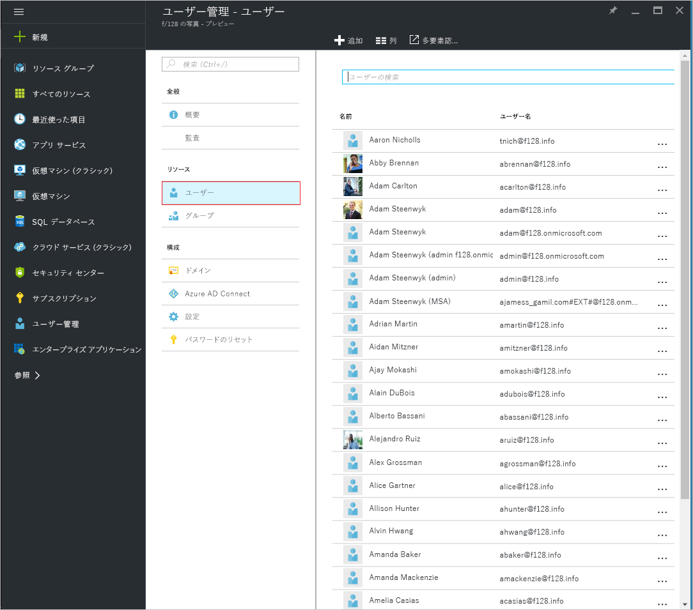
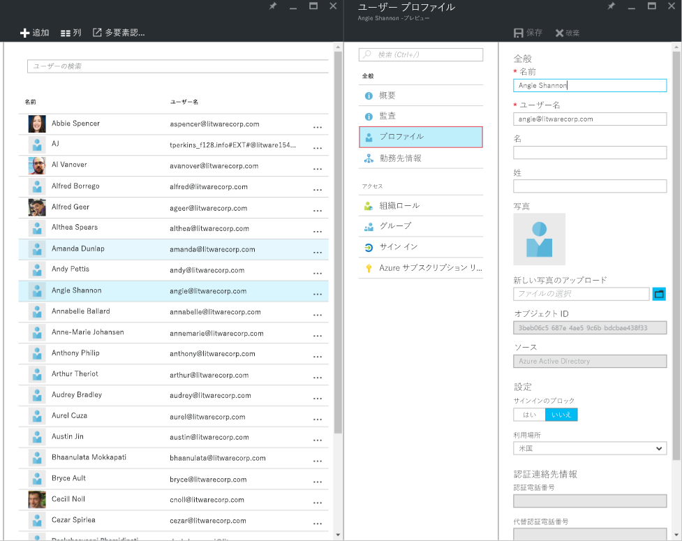
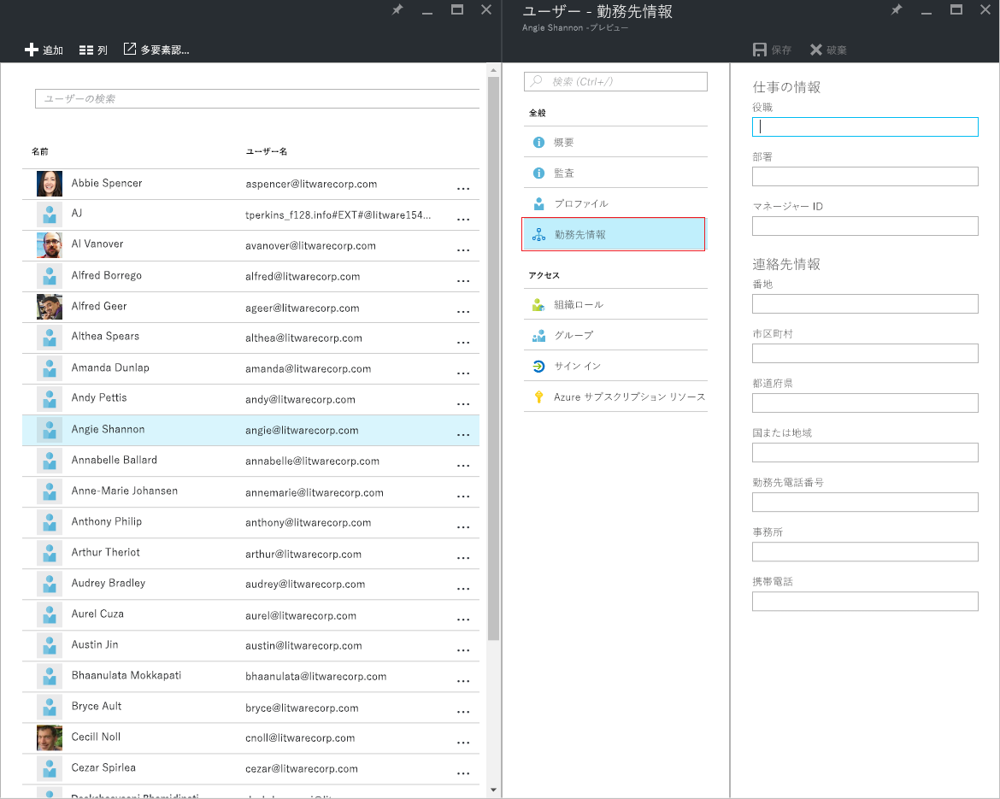
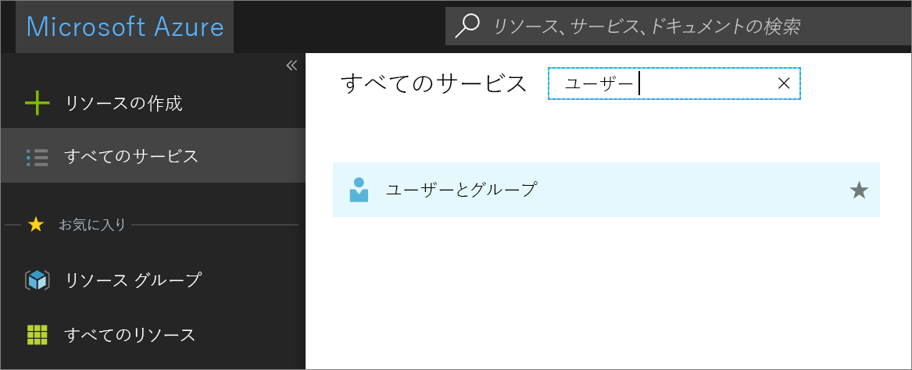
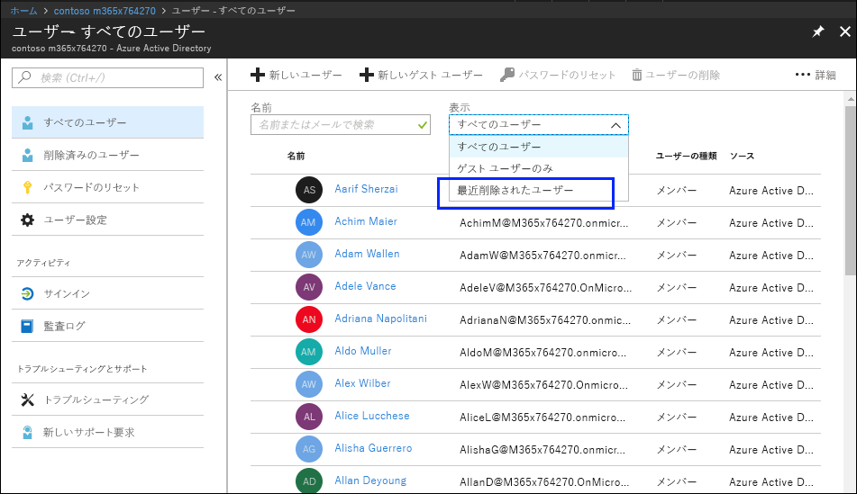
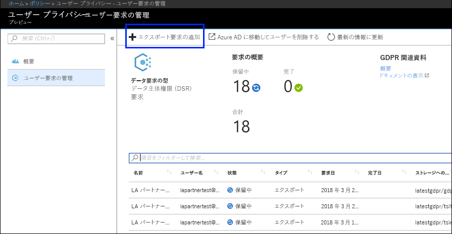
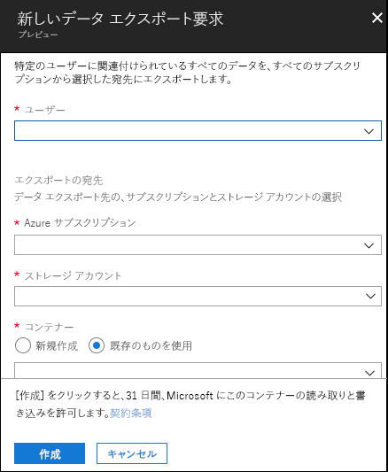

# GDPR のための Azure データ サブジェクト要求

## データ主体要求 (DSR) の概要

EU データ保護規則 (GDPR) では、ユーザー (規則では*データ サブジェクト*と呼ばれる) に対して、雇用主やその他の会社または組織 (*データ コントローラー*または単に*コントローラー*と呼ばれる) が収集した個人データを管理する権利を与えます。GDPR の下で個人データは広範な定義がなされ、識別された、または識別可能な自然人と関連するあらゆるデータのことです。GDPR は個人データに対するデータ サブジェクト固有の権利を与えます。この権利には、個人データのコピーの取得、修正の要求、処理の制限、削除、または、別のコントローラーに移動できるようにするための電子形式での受信が含まれます。データ サブジェクトからコントローラーに個人データへのアクション実行を求める正式な要求は、*データ サブジェクト要求* (DSR) と呼ばれます。

このガイドでは、DSR への対応として個人データを見つけて処理するコントローラーのお客様を支援する目的で、Microsoft の製品、サービス、管理ツールをどのように使用できるかを説明します。特に、Microsoft クラウドにある個人データを検出、アクセス、処理する方法を示します。このガイドで説明するプロセスの概要は次のとおりです:

1.  ***検出***—検索/検出ツールを使用することで、DSR の対象となる可能性がある顧客データをより簡単に見つけます。対応の対象となり得るドキュメントが収集されたら、後続のステップの DSR アクションを 1 つ以上実行することで要求に対応できます。あるいは、DSR 対応に関する組織のガイドラインを要求が満たしていないと判断する場合もあります。

2.  ***評価***—Microsoft クラウドにある個人データを取り出し、コピーが要求されている場合には、データ サブジェクトが利用できる形でコピーを作成します。

3.  ***修正***—要求されたアクションに応じて個人データを変更したり、他の操作を実行したりします。

4.  ***制限***—さまざまな Azure サービスのライセンスを削除するか、該当するサービスを無効にする (可能な場合) ことで、個人データの処理を制限します。また、データを Microsoft クラウドから削除してオンプレミスまたは別の場所で保持することもできます。

5.  ***削除***—Microsoft クラウドに格納されていた個人データを完全に削除します。

6.  ***エクスポート***—個人データの電子的コピー (マシンで読み取り可能な形式) をデータ サブジェクトに提供します。

このガイドの各セクションでは、Microsoft クラウド内の個人データに関する DSR への対応としてデータ コントローラー組織が実行できる技術的な手順の概要を示します。

### 用語集

このガイドに関連する用語を以下に定義します。

-   *コントローラー*—単独で、または他者と共同で、個人データの処理の目的と手段を決定する個人または法人、公的機関、団体、その他の組織。そのような処理の目的と手段が ＥＵ 法もしくは構成国法によって決定される場合、コントローラーまたはその指名に関する具体的な基準が ＥＵ 法もしくは構成国法によって提供される場合があります。

-   *個人データ*および*データ主体*—特定される個人、または特定可能な個人 ('データ主体') に関連するあらゆる情報であり、特定可能な個人とは、その個人の名前、ID 番号、位置データ、オンライン ID、または物理的、生理学的、遺伝子上、心理的、経済的、文化的、社会的な識別情報に固有の 1 つ以上の因子を参照することによって直接または間接的に特定される人物です。

-   *プロセッサ*—コントローラーに代わって個人データを処理する個人または法人、公的機関、団体、その他の組織。

-   *顧客データ*—お客様または代理者がエンタープライズ サービスの使用を通じて Microsoft に提供する、すべてのテキスト、サウンド、ビデオ、イメージ ファイルを含むすべてのデータ。顧客データには次の両方が含まれます: (1) エンド ユーザーの個人情報 (たとえば Azure Active Directory でのユーザー名と連絡先情報)、特定のサービスでお客様がアップロードまたは作成したカスタマー コンテンツ (たとえば Azure Storage アカウント内のカスタマー コンテンツ、Azure SQL Database のカスタマー コンテンツ、Azure Virtual Machines でのお客様の仮想マシン イメージ)。

-   *システム生成ログ*—Microsoft がエンタープライズ サービスをユーザーに提供するうえで役立つ、Microsoft により生成されるログおよび関連データ。システム生成ログには主に固有 ID などの仮名化データが含まれています。固有 ID とは通常、それ自体は特定の個人を識別しないものの、エンタープライズ サービスをユーザーに提供するために使われるシステム生成番号です。また、ユーザー名などのエンド ユーザー個人情報がシステム生成ログに含まれることもあります。

### このガイドの使用方法

このガイドは次のような 2 部構成になっています。

**第 1 部: 顧客データに関するデータ サブジェクト要求に対応する** — このガイドの第 1 部では、アプリケーションで作成されたデータにアクセスし、データを修正、制限、削除、エクスポートする方法を示します。このセクションでは、カスタマー コンテンツとエンド ユーザー個人情報の両方に対して DSR を実行する方法について詳しく述べます。

**第 2 部: システム生成ログに関するデータ サブジェクト要求に対応する** — Microsoft のエンタープライズ サービスを利用する際、Microsoft がサービスを提供するために使われるシステム生成ログという情報が生成されます。このガイドの第 2 部では、Azure でこのような情報にアクセスし、それを削除したりエクスポートしたりする方法について述べます。

### Azure Active Directory および Microsoft サービス アカウントに関する DSR について

お客様企業へのサービス提供を考慮するとき、特定の Azure Active Directory (AAD) テナント内のコンテキストで常に DSR の実行について理解する必要があります。特に、DSR は特定の AAD テナントの内部で常に実行されます。あるユーザーが複数のテナントに参加する場合、要求を受け取った特定のテナントのコンテキスト内で*のみ*、その DSR が実行されることを強調することが重要です。あるお客様企業からの DSR を実行しても、隣接するお客様企業のデータは影響を**受けない**という点を理解することは重要です。

また、Microsoft Service Accounts (MSA) に関しても、お客様企業に提供されるサービスのコンテキスト内で同じことが当てはまります。*ある AAD テナントに関連付けられた* MSA アカウントに対する DSR 実行では、そのテナント内のデータ**のみ**が対象となります。さらに、テナント内の MSA アカウントを扱う際には次の点を理解することが重要です:

-   MSA ユーザーが Azure サブスクリプションを作成すると、そのサブスクリプションは AAD テナントであるかのように扱われます。その結果、DSR の範囲は上記のようにテナント内となります。

-   MSA アカウントを介して作成された Azure サブスクリプションが削除された場合、実際の MSA アカウントには影響が**ありません**。ここでも、上記のように、Azure サブスクリプション内で実行される DSR はテナント自体の範囲に限定されます。

**特定のテナント外部の** MSA アカウント自体に対する DSR は、カスタマー プライバシー ダッシュボードを介して実行されます。詳しくは、Windows データ サブジェクト要求ガイドを参照してください。

## 第 1 部: 顧客データに関する DSR ガイド

## 顧客データに対する DSR の実行

Microsoft の特定のお客様データにアクセスし、それを削除したりエクスポートしたりするには、Azure ポータルを使用するか、特定のサービス用の既存のアプリケーション プログラミング インターフェイス (API) やユーザー インターフェイス (UI) を直接使用できます (後者は*製品内エクスペリエンス*とも呼ばれます)。このような製品内エクスペリエンスについての詳細は、各サービスの参照ドキュメントに記載されています。

>[重要]  
> 製品内 DSR をサポートするサービスでは、そのサービスのアプリケーション プログラミング インターフェイス (API) またはユーザー インターフェイス (UI) を直接使用し、該当する CRUD (作成、読み取り、更新、削除) 操作を記述する必要があります。したがって、特定のデータ サブジェクトの要求全体を完了するには Azure ポータル内での DSR 実行に加えて特定のサービス内で DSR を実行する必要があります。詳細については、特定のサービスの参照ドキュメントをご覧ください。

## ステップ 1: 検出

DSR への対応の第一歩は、要求の対象となる個人データを見つけることです。この第 1 ステップ (該当する個人データの検出と確認) により、DSR の承認/拒否に関する組織の要件を DSR が満たしているかどうか判断できます。たとえば、該当する個人データを検出して確認した後、その要求を実行すると他者の権利や自由が侵害される恐れがあるので、その要求は組織の要件に適合しないと判断する場合があるでしょう。

データを見つけた後、データ サブジェクトによる要求を満たすために特定のアクションを実行できます。

### Azure Active Directory

[Azure Active Directory](https://azure.microsoft.com/services/active-directory/) は、Microsoft が提供するクラウド ベースのマルチテナント ディレクトリおよびアイデンティティ管理サービスです。[Azure Active Directory](https://azure.microsoft.com/services/active-directory/) (AAD) 環境にある個人データを含むエンド ユーザー個人情報 (顧客や従業員のユーザー プロファイルなど) およびユーザー勤務先情報を見つけるには、[Azure Portal](https://portal.azure.com/) を使用できます。

特定のユーザーの個人データを検出または変更する必要がある場合には、これが特に役立ちます。また、ユーザー プロファイルや勤務先情報を追加したり変更したりすることもできます。ディレクトリのグローバル管理者であるアカウントを使用してサインインする必要があります。

#### ユーザー プロファイルや勤務先情報を検出または表示する方法

1. ディレクトリのグローバル管理者であるアカウントを使用して [Azure Portal](https://portal.azure.com/) にサインインします。

1. **[すべてのサービス]** を選択し、テキスト ボックスに「**ユーザーとグループ**」と入力して、**Enter** を選択します。

     ![[すべてのサービス] を選択します](media/azure-dsr_image3.png)

3. **[ユーザーとグループ]** ブレードで、**[ユーザー]** を選択します。

     

4.  **[ユーザーとグループ - ユーザー]** ブレードで、リストからユーザーを選択し、そのユーザーのブレードの **[プロファイル]** を選択すると、ユーザー プロファイル情報が表示されます。そこに個人データが含まれる可能性があります。

    

5. ユーザー プロファイル情報を必要に応じて追加または変更した後、コマンド バーの **[保存]** を選択します。

<!-- steps 6 and 7 not in original 
6. On the blade for the selected user, select **Work Info** to view user work information that may contain personal data.

     

7. If you need to add or change user work information, you can do so, and then, in the command bar, select **Save.**

end of text to isolate -->

### サービス固有のインターフェイス

特定のサービス用の既存のアプリケーション プログラミング インターフェイス (API) またはユーザー インターフェイス (UI) を介して顧客データを直接検出できます。各サービスの参照ドキュメントに詳細が記載され、該当する CRUD (作成、読み取り、更新、削除) 操作について記述しています。

## ステップ 2: アクセス

DSR 対応の対象となる可能性のある個人データを含む顧客データが見つかった後、組織とその担当者はどんなデータをデータ サブジェクトに提供するかを決定します。実際のドキュメントのコピー、適切に編集したバージョン、または共有できると判断した部分のスクリーン ショットを提供できます。アクセス要求に対するこのような対応ごとに、対象のデータを含むドキュメントのコピーまたは他のアイテムを取得する必要があります。

データ サブジェクトにコピーを提供する際には、他のデータ サブジェクトに関する個人情報や他の機密情報を削除または編集する必要が生じることがあります。

DSR アクセス要求への対応としてデータのコピーを取得する方法を以下で説明します。

### Azure Active Directory

お客様企業のテナント管理者は、ポータルおよび製品内エクスペリエンスを介して DSR アクセス要求を管理できます。DSR アクセス要求では (a) エンド ユーザーに関する個人情報、および (b) システム生成ログを含むユーザー個人データへのアクセスが扱われます。

### サービス固有のインターフェイス

特定のサービス用の既存のアプリケーション プログラミング インターフェイス (API) またはユーザー インターフェイス (UI) を介して顧客データを直接検出できます。各サービスの参照ドキュメントに詳細が記載され、該当する CRUD (作成、読み取り、更新、削除) 操作について記述しています。

## ステップ 3: 修正

組織のデータに含まれる個人データを修正するようデータ サブジェクトが依頼した場合、組織とその担当者は、要求を承認するのが適切かどうか判断する必要があります。データの修正には、ドキュメントまたは他の種類のアイテムの中の個人データを編集、変更、または削除するアクションが含まれます。Microsoft サポートおよび FastTrack データに対してこれを行う最も便利な方法を以下に示します。

### Azure Active Directory

お客様企業は、各 Microsoft サービスの性質に応じて、限定的な編集を含む DSR 修正要求の管理機能を利用できます。Microsoft はデータ プロセッサとして、システム生成ログの修正機能を提供しません。これはシステム生成ログが実際のアクティビティを表し、Microsoft サービス内のイベントの履歴レコードを形成するためです。Azure Active Directory に関しては、下記で説明するように、エンド ユーザーの個人情報を限定的に編集できる機能があります。

#### Azure Active Directory: 不正確または不完全な個人データの修正

[Azure Active Directory](https://azure.microsoft.com/services/active-directory/) (AAD) 環境で [Azure Portal](https://portal.azure.com/) を使用すると、ユーザーの氏名、役職、住所、電話番号などの個人データを含むエンド ユーザー個人情報 (顧客や従業員のユーザー プロファイルなど) やユーザーの勤務先情報を修正、更新、または削除することができます。ディレクトリのグローバル管理者であるアカウントを使用してサインインする必要があります。

##### Azure Active Directory でユーザー プロファイルや勤務先情報を修正または更新する方法

1.  ディレクトリのグローバル管理者であるアカウントを使用して [Azure Portal](https://portal.azure.com/) にサインインします。

2.  **[すべてのサービス]** を選択し、テキスト ボックスに「**ユーザーとグループ**」と入力して、**Enter** を選択します。

    ![[すべてのサービス] を選択します](media/azure-dsr_image3.png)

3.  **[ユーザーとグループ]** ブレードで、**[ユーザー]** を選択します。
         
    

4.  **[ユーザーとグループ - ユーザー]** ブレードで、リストからユーザーを選択し、そのユーザーのブレードの **[プロファイル]** を選択すると、修正または更新が必要なユーザー プロファイル情報が表示されます。

    

5.  情報を修正または更新した後、コマンド バーの **[保存]** を選択します。

6.  選択したユーザーのブレードで **[勤務先情報]** を選択すると、修正または更新が必要なユーザーの勤務先情報が表示されます。

    

7.  ユーザーの勤務先情報を修正または更新した後、コマンド バーの **[保存]** を選択します。

### サービス固有のインターフェイス

特定のサービス用の既存のアプリケーション プログラミング インターフェイス (API) またはユーザー インターフェイス (UI) を介して顧客データを直接検出できます。各サービスの参照ドキュメントに詳細が記載され、該当する CRUD (作成、読み取り、更新、削除) 操作について記述しています。

## ステップ 4: 制限

個人データの処理を制限するようデータ サブジェクトから依頼されることがあります。その場合、Azure ポータルと既存のアプリケーション プログラミング インターフェイス (API) またはユーザー インターフェイス (UI) の両方を使用できます。お客様企業のテナント管理者はこれらのエクスペリエンスを利用し、データ エクスポートとデータ削除を組み合わせて、このような DSR を管理できます。お客様は (a) アカウント、(b) システム生成ログ、(c) 関連するログを含むユーザー個人データの電子的なコピーをエクスポートし、その後、Microsoft システム内に保管されているアカウントおよび関連するデータを削除できます。

## ステップ 5: 削除

組織の顧客データにある個人データを削除する「消去権」は、GDPR の重要な保護事項の 1 つです。個人データの削除には、すべての個人データとシステム生成ログ (ただし監査ログ情報を除く) を削除することが含まれます。あるユーザーが**回復可能削除** (下記を参照) されると、そのアカウントが 30 日間にわたり無効になります。この 30 日間に何のアクションも行われない場合、そのユーザーは**完全削除** (これも下記を参照) されます。**完全削除**された場合、そのユーザーのアカウント、個人データ、システム生成ログがその後 30 日以内に抹消されます。テナント管理者が即時に**完全削除**を発行した場合、ユーザーのアカウント、個人データ、システム生成ログがその後 30 日以内に抹消されます。

>[重要] ユーザーをテナントから削除するには、テナント管理者でなければなりません。

### Azure Portal を介してユーザーおよび関連データを削除する

データ サブジェクトから削除要求を受け取った後、Azure Portal を使用してユーザーおよび関連する個人情報、さらにシステム生成ログを削除することができます。

このデータを削除すると、それとともにテナントからユーザーが削除されます。ユーザーは最初に回復可能な方法で削除されます。つまり、回復可能削除のマークが付いてから 30 日以内にテナント管理者がアカウントを回復することができます。30 日後は、アカウントがテナントから自動的かつ完全に削除されます。この 30 日が経過する前に、回復可能削除されたユーザーをごみ箱から手動で削除できます。

テナントからユーザーを削除する大まかな手順は次のとおりです。

1.  Azure Portal に移動し、ユーザーを見つけます。

2.  ユーザーを削除します。ユーザーを最初に削除すると、そのユーザーのアカウントがごみ箱に送られます。**この時点で、ユーザーは回復可能削除された状態になります。つまり、アカウントが無効になりますが、Azure Active Directory から抹消されたわけではありません。**

3.  最近削除されたユーザーのリストに移動して、ユーザーを永続的に削除します。**この時点でユーザーが永続的に削除されます (完全削除ともいう)。つまりアカウントが Azure Active Directory から抹消済みになります**

##### Azure テナントからユーザーを削除するには

1.  Azure Portal を開き、**Azure Active Directory** ブレードを選択して **[ユーザー]** を選択します。

    **[ユーザー – すべてのユーザー]** ブレードが表示されます。

    

2.  削除するユーザーの横にあるボックスをオンにして **[ユーザーの削除]** を選択し、ユーザー削除を確認するボックスで **[はい]** を選択します。

    

3.  **[表示]** ドロップダウン ボックスで、**[最近削除されたユーザー]** を選択します。

    

4.  同じユーザーを再び選択し、**[完全に削除する]** を選択して、確認を求めるボックスで **[はい]** を選択します。

>[重要]  
>**[はい]** をクリックすると、ユーザーおよび関連するすべてのデータとシステム生成ログが完全に削除され、この操作を元に戻せないことに注意してください。間違ってこの操作を行った場合、手動でユーザーをテナントに再び追加する必要があります。関連するデータとシステム生成ログは回復不能です。

   

### サービス固有のインターフェイス

特定のサービス用の既存のアプリケーション プログラミング インターフェイス (API) またはユーザー インターフェイス (UI) を介して顧客データを直接検出できます。各サービスの参照ドキュメントに詳細が記載され、該当する CRUD (作成、読み取り、更新、削除) 操作について記述しています。

## ステップ 6: エクスポート

「データ移植性の権利」により、データ サブジェクトは、別のデータ コントローラーに移送できる電子的な形式 (つまり構造化され、一般使用される、マシン読み取り可能かつ相互運用可能な形式) の個人データのコピーを要求できます。Azure をご利用の組織は、ネイティブ JSON 形式のデータを指定の Azure Storage コンテナーにエクスポートできます。

>[重要] ユーザー データをテナントからエクスポートするには、テナント管理者でなければなりません。

### Azure Active Directory

顧客データに関して、お客様企業のテナント管理者はポータルと製品エクスペリエンスの両方を利用して、エンド ユーザーの個人情報のエクスポート要求を管理することができます。

### サービス固有のインターフェイス

特定のサービス用の既存のアプリケーション プログラミング インターフェイス (API) またはユーザー インターフェイス (UI) を介して顧客データを直接検出できます。各サービスの参照ドキュメントに詳細が記載され、該当する CRUD (作成、読み取り、更新、削除) 操作について記述しています。

## 第 2 部: システム生成ログ

さらに、ユーザーによる Azure 使用状況に関連する特定のシステム生成ログにアクセスし、それを削除したりエクスポートしたりできます。

>[!Important]
> システム生成ログを制限または修正する機能はサポートされていない点に注意してください。システム生成ログは、Microsoft クラウド内で実行された実際のアクションと診断データを形成し、そのようなデータが変更されるとアクションの履歴記録が損なわれ、詐欺やセキュリティのリスクが増大します。

## システム生成ログに対する DSR の実行

Azure ポータルを使用したり、特定のサービス用のプログラマティック インターフェイスまたはユーザー インターフェイスを直接使用したりすることで、特定のシステム生成ログにアクセスし、削除/エクスポートすることができます。詳細については、各サービスの参照ドキュメンテーションに記載されています。

>[!Important]  
> 製品内 DSR をサポートするサービスでは、そのサービスのアプリケーション プログラミング インターフェイス (API) またはユーザー インターフェイス (UI) を直接使用する必要があります。したがって、特定のデータ サブジェクトの要求全体を完了するには Azure ポータル内での DSR 実行に加えて製品内 DSR **を実行する必要があります。詳細については、特定のサービスの参照ドキュメントをご覧ください。**

## ステップ 1: アクセス 

組織内で特定のユーザーによる Azure 使用状況に関連するシステム生成ログにアクセスできるのは、テナント管理者のみです。アクセス要求に関して取得されるデータはマシン読み取り可能形式で提供され、データの関連先のサービスがユーザーにわかるようなファイルで提供されます。上記のように、サービスのセキュリティを損なう可能性のあるデータは取得対象データに含まれません。

### Azure Active Directory

お客様企業のテナント管理者は、ポータルおよび製品内エクスペリエンスを介してアクセス要求を管理できます。アクセス要求では (a) エンド ユーザーに関する個人情報、および (b) サービス生成ログを含むユーザー個人データへのアクセスが扱われます。このプロセスは、第 1 部「ステップ 2: アクセス」の Azure Active Directory セクションと同じです。

### サービス固有のインターフェイス

特定のサービス用の既存のアプリケーション プログラミング インターフェイス (API) またはユーザー インターフェイス (UI) を介して顧客データを直接検出できます。各サービスの参照ドキュメントに詳細が記載され、該当する CRUD (作成、読み取り、更新、削除) 操作について記述しています。

## ステップ 2: 削除

組織内で、Azure テナントの特定のユーザーに関する DSR 削除要求を実行できるのはテナント管理者だけです。

### Azure Active Directory

お客様企業のテナント管理者は、ポータルおよび製品内エクスペリエンスを介して DSR 削除要求を管理できます。DSR 削除要求は、第 1 部、「ステップ 5: 削除」の「Azure Portal を介してユーザーおよび関連データを削除する」のセクションと同じ方法で扱われます。

### サービス固有のインターフェイス

特定のサービス用の既存のアプリケーション プログラミング インターフェイス (API) またはユーザー インターフェイス (UI) を介して顧客データを直接検出できます。各サービスの参照ドキュメントに詳細が記載され、該当する CRUD (作成、読み取り、更新、削除) 操作について記述しています。

## ステップ 3: エクスポート

組織内で特定のユーザーによる Azure 使用状況に関連するシステム生成ログにアクセスできるのは、テナント管理者のみです。エクスポート要求に関して取得されるデータはマシン読み取り可能形式で提供され、データの関連先のサービスがユーザーにわかるようなファイルで提供されます。上記のように、サービスのセキュリティや安定性を損なう可能性のあるデータは取得対象データに含まれません。

### Azure Portal を使用してシステム生成ログをエクスポートする

データ サブジェクトのエクスポート要求を受け取った後、Azure Portal を使用して、特定のユーザーに関連するシステム生成ログをエクスポートできます。

テナントからデータをエクスポートする大まかな手順は次のとおりです。

1.  Azure Portal に移動し、ユーザーに代わってエクスポート要求を作成します。

2.  データをエクスポートして、ファイルをユーザーに送ります。

##### Azure テナントからユーザーの情報をエクスポートするには

1.  Azure Portal を開き、**[すべてのサービス]** を選択し、フィルターに「*policy*」と入力して **[ポリシー]** を選択します。

     ![[すべてのサービス] フィルター ](media/azure-dsr_image12.png)

2.  **[ポリシー]** ブレードで **[ユーザー プライバシー]** を選択し、**[ユーザー要求の管理]** を選択して、**[エクスポート要求の追加]** を選択します。

    

3.  **[データ エクスポート要求]** に次のように入力します。

    

-   **ユーザー**: エクスポートを要求した Azure Active Directory ユーザーの電子メール アドレスを入力します。

-   **サブスクリプション**: リソース使用状況の報告とサービス料金の請求に使用するアカウントを選択します。これは Azure ストレージ アカウントの場所でもあります。

-   **ストレージ アカウント**: Azure Storage (Blob) の場所を選択します。詳しくは「[Microsoft Azure Storage の概要 – Blob ストレージ](https://docs.microsoft.com/azure/storage/common/storage-introduction#blob-storage)」の記事を参照してください。

-   **コンテナー**: エクスポートされたユーザー プライバシー データの保存場所として新しいコンテナーを作成するか、既存のものを選択します。

4.  **[作成]** を選択します。

エクスポート要求が **[保留中]** 状況になります。**[ユーザー プライバシー - 概要]** ブレードでレポートの状況を確認できます。
>
>[重要]  
>個人データは複数のシステムから取得される可能性があるので、エクスポート プロセスが完了するまでに 1 か月かかる場合があります。

### サービス固有のインターフェイス

特定のサービス用の既存のアプリケーション プログラミング インターフェイス (API) またはユーザー インターフェイス (UI) を介して顧客データを直接検出できます。各サービスの参照ドキュメントに詳細が記載され、該当する CRUD (作成、読み取り、更新、削除) 操作について記述しています。

## エクスポートまたは削除に関する問題を通知する
Azure portal でデータをエクスポートまたは削除中に問題が発生した場合は、Azure ポータルの **[ヘルプとサポート]** ブレードに移動し、**[サブスクリプションの管理] > [他のセキュリティとコンプライアンスの要求] > [プライバシー ブレードと GDPR 要求]** で新しいチケットを送信します。

#### 詳細情報
[Microsoft Trust Center](https://www.microsoft.com/TrustCenter/Privacy/gdpr/default.aspx)