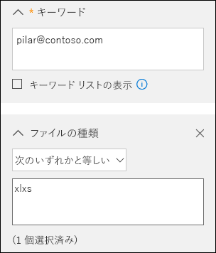
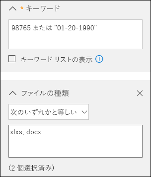
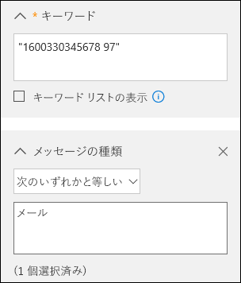

# <a name="office-365-data-subject-requests-for-the-gdpr-and-ccpa"></a>GDPR および CCPA のための Office 365 データ対象要求

## <a name="introduction-to-dsrs"></a>DSR について

EU [一般データ保護規則 (GDPR)](https://ec.europa.eu/justice/data-protection/reform/index_en.htm) では、ユーザー (規則では*データ主体*と呼ばれる) に対して、雇用主やその他の会社または組織 (*データ管理者*または単に*管理者*と呼ばれる) が収集した個人データを管理する権利を与えます。GDPR では、個人データとは、識別された、または識別可能な自然人と関連するあらゆるデータとして広範に定義されています。GDPR は個人データに対する固有の権利をデータ主体に与えます。この権利には、個人データのコピーの取得、変更の要求、処理の制限、削除、または、別の管理者に移動できるようにするための電子形式での受信が含まれます。データ主体から管理者に個人データへの操作実行を求める正式な要求は、*データ主体の要求*または DSR と呼ばれます。管理者には、各 DSR を迅速に検討し、要求された操作を行うか、管理者が DSR に対応できない理由についての説明を提供するか、どちらかの実質的な応答をする義務があります。管理者は特定の DSR に対する適切な処置に関して自社の法律顧問の助言を求めるべきです。

同様に、カリフォルニア州消費者プライバシー法 (CCPA) では、それらの個人情報の削除、アクセスおよび受信 (移植性) の権利などの GDPR のデータ主体の権利に類似している権利を含む、カリフォルニア州の消費者のプライバシーの権利および義務を規定します。 また、CCPA では、特定の開示、権利の行使を選択する際の差別に対する保護、“売上“ として分類された特定のデータ転送の “オプトアウト/オプトイン“ 要件を規定します。 「販売」は広く定義されており、有価約因に関するデータの共有を含みます。 CCPA の詳細については、「[カリフォルニア州消費者プライバシー法](offering-ccpa.md)」と「[カリフォルニア州消費者プライバシー法に関する FAQ](ccpa-faq.md)」を参照してください。

このガイドでは、DSR に対応するために個人データや個人情報を検索して処理を行えるように Office 365 製品、サービス、管理ツールを使用する方法について説明します。 具体的には、Microsoft のクラウドに保存されている個人データや個人情報の検索、アクセス、および操作方法について説明します。 このガイドに記載されているプロセスの概要を次に示します。

- **検出:** 検索および検出ツールを使用して、DSR の対象である可能性がある顧客データを簡単に検索します。 可能性のある応答ドキュメントが収集されると、以下の手順に示す 1 つ以上の DSR アクションを実行して、要求に応答できます。 または、DSR への応答に関する組織のガイドラインを要求が満たしていないと判断する場合もあります。
- **アクセス:** Microsoft クラウドにある個人データを取り出し、要求がある場合は、データ主体が利用できるコピーを作成します。
- **修正:** 必要に応じて、個人データを変更したり、要求された他の操作を個人データに対して実行したりします。
- **制限:** さまざまな Azure サービスのライセンスを削除するか、可能な場合は該当するサービスを無効にすることで、個人データの処理を制限します。 また、データを Microsoft クラウドから削除してオンプレミスまたは別の場所で保持することもできます。
- **削除:** Microsoft クラウドに格納されていた個人データを完全に削除します。
- **エクスポート/受信 (移植性):** 個人データまたは個人情報の電子コピー (コンピューターで読み取り可能な形式) をデータ主体に提供します。 CCPA における個人情報とは、識別された人、または識別可能な人に関するあらゆる情報のことです。 個人の私的、公的、または職業上の役割による区別はありません。 "個人情報" と定義された用語は、GDPR における "個人データ" とほぼ同義です。 ただし、CCPA では家族データおよび世帯データも含まれます。 CCPA の詳細については、「[カリフォルニア州消費者プライバシー法](offering-ccpa.md)」と「[カリフォルニア州消費者プライバシー法に関する FAQ](ccpa-faq.md)」を参照してください。

### <a name="terminology"></a>用語

このガイドに関連する GDPR の用語の定義を以下に示します。

- **管理者:** 単独または他者と共同で、個人データの処理に関する目的と手段を決定する自然人や法人、公的機関、団体、その他の組織。そのような処理の目的と手段が EU 法もしくは加盟国の法律によって決定される場合、管理者またはその指名に関する具体的な基準が EU 法または加盟国の法律によって提供される場合があります。
- **個人データおよびデータ主体:** 特定されたまたは特定可能な自然人 (「データ主体」) に関するあらゆる情報。特定可能な自然人とは、その者の名前、ID 番号、位置データ、オンライン ID、または当該自然人に固有の 1 つ以上の特に身体的、生理学的、遺伝的、心理的、経済的、文化的、社会的な識別情報などの要素を参照することにより、直接または間接的に特定することができる者のことです。
- **処理者:** 管理者に代わって個人データを処理する自然人または法人、公的機関、団体、その他の組織。
- **顧客データ:** これは、顧客または顧客の代理がエンタープライズ サービスの使用を通じて Microsoft に提供する、テキスト、音声、ビデオ、画像ファイル、およびソフトウェアを含むすべてのデータのことです。 顧客データには次の両方が含まれます: (1) 特定を可能にするエンド ユーザーの情報 (例: Azure Active Directory でのユーザー名と連絡先情報)、および (2) 特定のサービスでお客様がアップロードまたは作成する顧客コンテンツ (例: Word または Excel ドキュメント、または Exchange Online メールのテキスト内の顧客コンテンツ、SharePoint Online サイトに追加された、または OneDrive for Business アカウントに保存された顧客コンテンツ)。
- **システム生成ログ:** Microsoft がエンタープライズ サービスをユーザーに提供するうえで役立つ、Microsoft により生成されるログおよび関連データ。 システム生成ログには主に固有 ID などの仮名化データが含まれています。固有 ID とは一般的に、それ自体は特定の個人を識別しないものの、エンタープライズ サービスをユーザーに提供するために使われるシステム生成番号です。 また、ユーザー名などの、特定を可能にするエンド ユーザーの情報がシステム生成ログに含まれることもあります。

### <a name="how-to-use-this-guide"></a>このガイドの使用方法

ユース ケースに関連する情報が簡単に見つかるように、このガイドは 4 つの部分に分かれています。

- **[パート 1: 顧客データについての DSR への対応](#part-1-responding-to-dsrs-for-customer-data):** *顧客データ*は、日常の業務において Office 365 で生成および格納されるデータです。 データを作成できる最も一般的な Office 365 アプリケーションには、Word、Excel、PowerPoint、Outlook、OneNote などがあります。 また、Office 365 には SharePoint Online、Teams、Forms などのアプリケーションも含まれているため、他のユーザーとの連携を強化できます。 このガイドのパート 1 では、Office 365 オンライン サービスでのデータ作成と保存に使用される Office 365 アプリケーションからデータを検出、アクセス、修正、制限、削除、およびエクスポートする方法について説明します。 ここでは、Microsoft がお客様組織のデータ処理者としての役割を務めるため、テナント管理者に DSR 機能を公開している製品とサービスを扱います。
- **[パート 2: Office 365 で生成されたインサイトに関する DSR への対応](#part-2-responding-to-dsrs-with-respect-to-insights-generated-by-office-365):** Office 365 は、Delve、MyAnalytics、Workplace Analytics などのサービスを通じて特定のインサイトを提供します。 これらのインサイトが生成される方法と、そのようなインサイトに関連する DSR に対応する方法については、このガイドのパート 2 で説明します。
- **[パート 3: システム生成ログに対する DSR への対応](#part-3-responding-to-dsrs-for-system-generated-logs):** Office 365 エンタープライズ サービスを使用すると、Microsoft によってオンライン サービス機能の使用状況やパフォーマンスを記録するサービス ログなどの情報が生成されます。 サービスで生成されたデータのほとんどには、Microsoft によって生成された仮の識別子が含まれています。そのため、このドキュメントでは通常このカテゴリを、*システム生成ログ*と呼びます。 追加の情報を使用せずにこのデータを特定のデータ主体への属性を特定できませんが、一部は GDPR の「個人データ」の定義に基づいて、個人データと見なされる可能性があります。 このガイドのパート 3 では、システム生成ログのアクセス方法、削除方法、およびエクスポート方法について説明します。
- **[パート 4: DSR に役立つその他のリソース](#part-4-additional-resources-to-assist-you-with-dsrs):** このガイドのパート 4 では、特定の Office 365 製品とサービスが使用されるときに Microsoft がデータ管理者となる、限定的なシナリオを示します。

>[!NOTE]
>ほとんどの場合、組織内のユーザーが Microsoft Office 365 製品とサービスを使用する際には、ユーザーがデータ管理者、Microsoft が処理者になります。ユーザーはデータ管理者として、データ主体に直接対応する責任があります。これを支援するために、このガイドのパート 1 から 3 では、組織が DSR 要求に対応するために利用できる技術的な機能について詳しく説明します。ただし、一部の限定的なシナリオでは、特定の Office 365 製品とサービスを使用する際に Microsoft がデータ管理者になります。この場合には、パート 4 の情報が、データ主体が Microsoft に DSR 要求を提出する方法についてのガイダンスになります。

### <a name="office-365-national-clouds"></a>Office 365 国別クラウド

Microsoft Office 365 のサービスは、国別クラウド環境である [Office 365 Germany](https://support.office.com/article/learn-about-office-365-germany-8a5a4bbc-667a-4cac-8769-d8ac9015db4c)、[21Vianet が運営する Office 365 (中国)](https://support.office.com/article/Learn-about-Office-365-operated-by-21Vianet-A8AB5061-3346-4DA0-BB7C-5260822B53AE)、および [Office 365 US Government](https://technet.microsoft.com/library/mt774581.aspx) でも利用可能です。このドキュメントで説明するデータ主体の要求の管理に関するガイダンスのほとんどは、これらの国別クラウド環境に適用されますが、これらの環境は孤立しているので、いくつかの例外があります。特定のサブセクションで特に注意すべき場合には、対応する注に、例外に関する説明を記載しています。

### <a name="hybrid-deployments"></a>ハイブリッド展開

Office 365 組織を構成する Microsoft サービス/製品は、クラウドベースのサービスとオンプレミス サーバー製品の組み合わせです。一般に、ハイブリッド展開では、ユーザー アカウント (ID 管理) と、クラウドとオンプレミスに存在するリソース (メールボックス、Web サイト、データなど) が共有されます。一般的なハイブリッドのシナリオには次のものがあります。

- Exchange ハイブリッド展開。この展開では、オンプレミス メールボックスを使用するユーザーと Excnahge Online メールボックスを使用するユーザーが混在しています。
- SharePoint ハイブリッド展開。この展開では、サイトおよびファイル サーバーがオンプレミスにあり、OneDrive for Business アカウントが Office 365 にあります。
- Azure Activity Directory と同期するオンプレミスの ID 管理システム (Active Directory)。これは、Office 365 の基盤となるディレクトリ サービスです。

DSR 要求への対応時には、DSR 要求の対象であるデータが Microsoft クラウドとオンプレミス組織のいずれに存在しているかを判別してから、その要求に対応するための適切な手順を実行する必要があります。「Office 365 データ主体要求ガイド」(このガイド) では、クラウド ベースのデータへの対応に関するガイダンスを提供します。オンプレミス組織のデータに関するガイダンスについては、「[オンプレミス サーバー上の Office の GDPR](https://docs.microsoft.com/Office365/Enterprise/gdpr-for-office-servers)」を参照してください。

## <a name="part-1-responding-to-dsrs-for-customer-data"></a>パート 1: 顧客データについての DSR への対応

顧客データについての DSR に対応するためのガイダンスは、次の 4 つのセクションに分かれています。

- [コンテンツ検索の電子情報開示ツールを使用した DSR への対応](#using-the-content-search-ediscovery-tool-to-respond-to-dsrs)
- [アプリ内機能を使用した DSR への対応](#using-in-app-functionality-to-respond-to-dsrs)
- [DSR 訂正要求への対応](#responding-to-dsr-rectification-requests)
- [DSR 制限要求への対応](#responding-to-dsr-restriction-requests)

### <a name="how-to-determine-the-office-365-applications-that-may-be-in-scope-for-a-dsr-for-customer-data"></a>顧客データの DSR の対象となる可能性のある Office 365 アプリケーションを特定する方法

個人情報の検索場所や検索対象を判断するために、組織内のユーザーが Office 365 でのデータ作成や保存に使用できる Office 365 アプリケーションを特定することが役立ちます。 これを知ることで、DSR の範囲内にある Office 365 アプリケーションが絞り込まれ、DSR に関連する個人データの検索方法とアクセス方法の判断に役立ちます。 具体的には、コンテンツ検索ツールを使用できるかどうか、またはデータが作成されたアプリケーションのアプリ内機能を使用する必要があるかどうかということです。

組織内のユーザーが顧客データの作成に使用している Office 365 アプリケーションを手早く確認する方法は、組織の Office 365 サブスクリプションに含まれるアプリケーションを特定することです。これを行うには、Office 365 管理ポータルでユーザー アカウントにアクセスして、製品のライセンス情報を確認します。「[一般法人向け Office 365 ライセンスをユーザーに割り当てる](https://docs.microsoft.com/office365/admin/subscriptions-and-billing/assign-licenses-to-users)」を参照してください。

## <a name="using-the-content-search-ediscovery-tool-to-respond-to-dsrs"></a>コンテンツ検索の電子情報開示ツールを使用した DSR への対応

組織が Office 365 を使用して作成および保存している大規模なデータのセット内にある個人データを検索する際には、検索するデータの作成に使用された可能性が最も高いアプリケーションを考える必要がある場合があります。Microsoft では、Office 365 に保存されている組織のデータの 90% 以上が Word、Excel、PowerPoint、OneNote、および Outlook で作成されていると推定しています。これらの Office アプリケーションを Office 365 ProPlus または Office 永続ライセンスで購入した場合でも、これらのアプリケーションで作成されたドキュメントは、SharePoint Online サイト、ユーザーの OneDrive for Business アカウント、またはユーザーの Exchange Online メールボックスに保存されている可能性があります。そのため、コンテンツ検索の電子情報開示ツールを使用して、SharePoint Online サイト、OneDrive for Business アカウント、および Exchange Online メールボックス (Office 365 グループ、Microsoft Teams、EDU Assignments に関連付けられたサイトおよびメールボックスを含む) を検索 (および、その他の DSR 関連アクションを実行) して、調査対象の DSR に関連するドキュメントおよびメールボックス アイテムを検索できます。また、コンテンツ検索ツールを使用して、別の Office 365 アプリケーションで作成された顧客データを検出することもできます。

次の表に、「顧客が作成したコンテンツ」の作成にユーザーが使用する Office 365 アプリケーションのリストを示します。これらのアプリケーションはコンテンツ検索を使用した検出が可能です。 DSR ガイドのこのセクションでは、これらの Office 365 アプリケーションを使用して作成されたデータの検出、アクセス、エクスポート、および削除方法について説明します。

***表 1: コンテンツ検索を使用して顧客データを検索できるアプリケーション***

| | |
| :---: | :---:|
 <br> カレンダー |  <br> SharePoint  |
|  <br> Excel |  <br> Skype for Business |
|  <br> Office Lens |  <br> タスク |
|  <br> OneDrive for Business | <br> Teams |
|  <br> OneNote|  <br> やるべきこと |
|  <br> Outlook/Exchange |  <br> ビデオ |
|  <br> People |  <br> Visio |
|  <br> PowerPoint |  <br> Word
||

>[!NOTE]
>コンテンツ検索の電子情報開示ツールは、[21Vianet が運営する Office 365 (中国)](https://support.office.com/article/Learn-about-Office-365-operated-by-21Vianet-A8AB5061-3346-4DA0-BB7C-5260822B53AE) では使用できません。つまり、表 1 に示す Office 365 アプリケーションでの顧客データの検出とエクスポートに、このツールを使用できません。ただし、Exchange Online のインプレース電子情報開示ツールを使用して、ユーザーのメールボックスの内容を検索できます。また、SharePoint Online の電子情報開示センターを使用して、SharePoint サイトと OneDrive アカウントのコンテンツを検索できます。あるいは、ドキュメントの所有者に対し、コンテンツの検索、コンテンツの変更または削除、あるいはコンテンツのエクスポート (必要な場合) に関する支援を依頼できます。</br><br> • [インプレース電子情報開示検索を作成する](https://technet.microsoft.com/library/dd353189(v=exchg.150).aspx)<br> • [SharePoint Online の電子情報開示センターをセットアップする](https://support.office.com/article/Set-up-an-eDiscovery-Center-in-SharePoint-Online-A18F8975-AA7F-43B4-A7D6-001D14744D8E)

### <a name="using-content-search-to-find-personal-data"></a>コンテンツ検索を使用した個人データの検索

DSR に対応するための最初のステップは、DSR の対象となる個人データを見つけることです。 ここでは、Office 365 の電子情報開示ツールを使用して個人データを検索 (Office 365 内にあるすべての組織データで) するか、データが作成されたネイティブ アプリケーションへ直接移動します。 当該の個人データの検索と確認を行うこの最初のステップは、データ主体の要求を承認または却下するための組織の要件を DSR が満たしているかどうかを判断するために役立ちます。 たとえば、当該の個人データを検索および確認した後に、これを行うことで他人の権利と自由に悪影響を及ぼす可能性があったり、組織が正当な営業上の利益を維持している業務記録に個人データが含まれているために、要求が組織の要件を満たしていないと判断する可能性があったりします。

前述したように、Microsoft では組織のデータの 90% 以上が Word や Excel などの Office アプリケーションで作成されていると推定しています。これは、ほとんどの DSR 関連データをセキュリティ/コンプライアンス センターのコンテンツ検索を使用して検索できることを意味します。

このガイドは、DSR 要求に対応する可能性がある個人データを検索するユーザーがセキュリティ/コンプライアンス センターのコンテンツ検索ツールに精通していることを前提としています。コンテンツ検索の使用に関する一般的なガイダンスについては、「[Office 365 でのコンテンツの検索](https://support.office.com/article/Content-Search-in-Office-365-53390468-eec6-45cb-b6cd-7511f9c909e4)」を参照してください。検索を実行しているユーザーにセキュリティ/コンプライアンス センターで必要なアクセス許可が割り当てられていることを確認してください。このユーザーは、セキュリティ/コンプライアンス センターで電子情報開示マネージャー役割グループのメンバーとして追加する必要があります。「[Office 365 セキュリティ/コンプライアンス センターで電子情報開示のアクセス許可を割り当てる](https://support.office.com/article/Assign-eDiscovery-permissions-in-the-Office-365-Security-Compliance-Center-5b9a067b-9d2e-4aa5-bb33-99d8c0d0b5d7)」を参照してください。DSR の調査に携わっている組織内の他のユーザーを、電子情報開示マネージャー役割グループに追加することを検討してください。そうすることにより、検索結果のプレビューやエクスポートなど、コンテンツ検索ツールで必要な操作を実行できます。ただし、コンプライアンスの境界 ([ここ](#set-up-compliance-boundaries-to-limit-the-scope-of-content-searches)を参照) を設定しない限り、電子情報開示マネージャーは組織内のすべてのコンテンツの場所を検索できます。これには DSR の調査に関連しない可能性があるコンテンツも含まれます。

データが見つかったら、データ主体の要求に対応するために特定の操作を実行できます。

>[!NOTE]
>Office 365 Germany では、セキュリティ/コンプライアンス センターは https://protection.office.de にあります。

#### <a name="searching-content-locations"></a>コンテンツの場所の検索

コンテンツ検索ツールを使用すると、次の種類のコンテンツの場所を検索できます。

- Exchange Online メールボックス。 これには Office 365 グループと Microsoft Teams に関連付けられたメールボックスが含まれます
- Exchange Online のパブリック フォルダー
- SharePoint Online サイト。 これには Office 365 グループと Microsoft Teams に関連付けられたサイトが含まれます
- OneDrive for Business アカウント

>[!NOTE]
>このガイドでは、DSR 調査に関連するすべてのデータが Office 365 に保存されている (つまり Microsoft クラウドに保存されている) ことを前提としています。ユーザーのローカル コンピューターや組織のファイル サーバーのオンプレミスに保存されているデータは、Office 365 に保存されているデータの DSR 調査では対象外です。オンプレミス組織のデータに対する DSR 要求への対応に関するガイダンスについては、「[オンプレミス サーバー上の Office の GDPR](https://docs.microsoft.com/Office365/Enterprise/gdpr-for-office-servers)」を参照してください。

#### <a name="tips-for-searching-content-locations"></a>コンテンツの場所を検索するためのヒント

- まず、組織内のすべてのコンテンツの場所 (1 回の検索で検索できる場所) を検索して、検索クエリと一致する項目が含まれているコンテンツの場所を素早く特定します。 その後、関連項目を含む特定の場所に検索範囲を絞り込んで検索を再実行できます。
- 検索の統計を使用して、検索クエリに一致する項目が含まれる最上位の場所を特定します。「[コンテンツ検索結果のキーワード統計の表示](https://support.office.com/article/View-keyword-statistics-for-Content-Search-results-9701a024-c52e-43f0-b545-9a53478aec04)」を参照してください。
- DSR の対象ユーザーが最近行ったファイルとフォルダーのアクティビティについて、Office 365 監査ログを検索します。 監査ログの検索を実行すると、ユーザーが最近操作したリソースの名前と場所を含む監査レコードの一覧が返されます。 この情報を使用してコンテンツ検索クエリを作成できる場合があります。 詳細については、「[Office 365 セキュリティ/コンプライアンス センターで監査ログを検索する](https://support.office.com/article/Search-the-audit-log-in-the-Office-365-Security-Compliance-Center-0d4d0f35-390b-4518-800e-0c7ec95e946c)」を参照してください。

#### <a name="building-search-queries-to-find-personal-data"></a>検索クエリを作成し個人データを見つける

ほとんどの場合、調査する DSR には、個人データを検索するためのキーワード検索クエリで使用できる識別子が含まれています。 検索クエリで使用して個人データを検索できる一般的な識別子の一部を次に示します。

- メール アドレスまたはエイリアス
- 電話番号
- 郵送先住所
- 従業員の ID 番号
- 国民識別番号または EU 加盟国の社会保障番号

ほとんどの場合、調査する DSR には識別子と、検索クエリで使用できる要求の対象となる個人データに関するその他の詳細が含まれています。

電子メール アドレスや従業員 ID に限定して検索すると、多くの場合で多数の結果が返されます。 DSR に最も関連するコンテンツを返すように検索範囲を絞り込むには、検索クエリに条件を追加します。 条件を追加すると、キーワードと検索条件は **AND** ブール演算子によって論理的に結合されます。 つまり、キーワードと条件の*両方*に一致する項目のみが検索結果として返されます。

次の表に、検索範囲の絞り込みに使用できる条件のリストを示します。また、特定のドキュメントの種類やメールボックス アイテムを検索するために、各条件に使用できる値もリストされています。

***表 2: 条件を使用した検索範囲の絞り込み***

||||
| :--- | :--- |:--- |
|**条件**|**説明** |**条件値の例**|
| ファイルの種類 | ドキュメントまたはファイルの拡張子。 Office 365 アプリケーションで作成された Office ドキュメントとファイルを検索する場合は、この条件を使用します。 この条件は、SharePoint Online サイトと OneDrive for Business アカウントにあるドキュメントを検索する場合にも使用します。<br/>対応するドキュメントのプロパティはファイルの種類です。 <br/>検索可能なファイル拡張子の完全なリストについては、「SharePoint での既定のクロール対象ファイル名拡張子および解析対象ファイルの種類」(https://technet.microsoft.com/library/jj219530.aspx)) を参照してください。|&nbsp;&bull;&nbsp;&nbsp;csv – コンマ区切り値 (CSV) ファイルを検索。Excel ファイルは CSV 形式で保存できます。CSV ファイルは簡単に Excel にインポートできます<br><br>&bull;&nbsp;&nbsp;docx – Word ファイルを検索 <br><br>&bull;&nbsp;&nbsp;mpp – Project ファイルを検索<br/><br>&bull;&nbsp;&nbsp;one – OneNote ファイルを検索 <br><br>&bull;&nbsp;&nbsp;pdf – PDF 形式で保存されたファイルを検索 <br><br>&bull;&nbsp;&nbsp;pptx – PowerPoint ファイルを検索 <br><br>&bull;&nbsp;&nbsp;xlxs – Excel ファイルを検索 <br><br>&bull;&nbsp;&nbsp;vsd – Visio ファイルを検索 <br><br>&bull;&nbsp;&nbsp;wmv – Windows Media ビデオ ファイルを検索 <br>|
| メッセージの種類 | 検索するメール メッセージの種類。 検索する電子メールメッセージの種類。連絡先 (People)、会議 (予定表) タスク、または Skype for Business の会話をメールボックスで検索するには、この条件を使用します。 対応する電子メールのプロパティは "*種類*" です。|&bull;&nbsp;&nbsp;*contacts – メールボックスの [個人用の連絡先] リスト (People) を検索 <br><br>&bull;&nbsp;&nbsp;* email - メール メッセージを検索 <br><br>&bull;&nbsp;&nbsp;*im - Skype for Business の会話を検索 <br><br>&bull;&nbsp;&nbsp;* meetings - 予定や会議出席依頼 (予定表) を検索 <br><br>&bull;&nbsp;&nbsp;*tasks – [マイ タスク] リスト (タスク) を検索。この値を使用すると、Microsoft To Do で作成されたタスクも返されます。<br>|
| コンプライアンス タグ |電子メール メッセージまたはドキュメントに割り当てられたラベル。ラベルは、データ ガバナンスのために電子メールとドキュメントを分類し、ラベルで定義された分類に基づいて保持ルールを適用するために使用されます。この条件を使用して、自動または手動でラベルが割り当てられた項目を検索します。<br/>これは DSR 調査に役立つ条件です。組織がラベルを使用してデータのプライバシーに関連するコンテンツを分類したり、そのコンテンツに個人データや機密情報が含まれていたりする場合があるからです。「[ラベルの概要](https://support.office.com/article/overview-of-labels-af398293-c69d-465e-a249-d74561552d30)」の「[コンテンツ検索] を使用して、特定のラベルが適用されているすべてのコンテンツを検索する」を参照してください。|compliancetag="personal data"|
||||

より複雑な検索クエリの作成に使用できる、電子メールおよびドキュメントのプロパティと検索条件は、他にもあります。詳細については、「[コンテンツ検索のキーワード クエリと検索条件](https://support.office.com/article/Keyword-queries-and-search-conditions-for-Content-Search-c4639c2e-7223-4302-8e0d-b6e10f1c3be3)」ヘルプ トピックの次のセクションを参照してください。

- [検索可能なメール プロパティ](https://support.office.com/article/Keyword-queries-and-search-conditions-for-Content-Search-c4639c2e-7223-4302-8e0d-b6e10f1c3be3)
- [検索可能なサイト (ドキュメント) のプロパティ](https://support.office.com/article/Keyword-queries-and-search-conditions-for-Content-Search-c4639c2e-7223-4302-8e0d-b6e10f1c3be3)
- [検索条件](https://support.office.com/article/Keyword-queries-and-search-conditions-for-Content-Search-c4639c2e-7223-4302-8e0d-b6e10f1c3be3)

#### <a name="searching-for-personal-data-in-sharepoint-lists-discussions-and-forms"></a>SharePoint リスト、ディスカッション、およびフォーム内の個人データを検索する

コンテンツ検索を使用すると、ドキュメント内で個人データを検索するだけでなく、ネイティブの SharePoint Online アプリを使用して作成された別の種類のデータも検索できます。これには、SharePoint リスト、ディスカッション、およびフォームを使用して作成されたデータが含まれます。コンテンツ検索を実行して SharePoint Online サイト (または OneDrive for Business アカウント) を検索すると、検索条件に一致するリスト、ディスカッション、およびフォームのデータが検索結果に返されます。

##### <a name="examples-of-search-queries"></a>検索クエリの例

次に、キーワードと条件を使用して DSR に対応する個人データを検索する検索クエリの例を示します。 例では、クエリの 2 つのバージョンを示します。1 つはキーワード構文 (条件は [キーワード] ボックスに含まれています)、もう 1 つは条件を使用する GUI ベースのクエリのバージョンを示しています。

##### <a name="example-1"></a>例 1

この例では、指定したメール アドレスを含む SharePoint Online サイトおよび OneDrive for Business アカウントにある Excel ファイルが返されます。 メール アドレスがファイルのメタデータに含まれる場合にも、ファイルが返されることがあります。

***キーワード構文***

```Query
pilar@contoso.com AND filetype="xlxs"
```

***GUI***



##### <a name="example-2"></a>例 2

この例では、指定した従業員 ID または生年月日を含む SharePoint Online サイトおよび OneDrive for Business アカウントにある Excel または Word ファイルが返されます。

(98765 OR "01-20-1990") AND (filetype="xlxs" OR filetype="docx")

***GUI***



##### <a name="example-3"></a>例 3

この例では、指定された ID 番号 (フランスの社会保障番号 (INSEE)) を含む電子メール メッセージが返されます。

```Query
"1600330345678 97" AND kind="email"
```

***GUI***



#### <a name="working-with-partially-indexed-items-in-content-search"></a>部分的にインデックスが作成されたアイテムをコンテンツ検索で使用する

部分的にインデックスが作成されたアイテム (*インデックス未作成のアイテム*とも呼ばれます) とは、なんらかの理由で検索用にインデックスが作成されなかった Exchange Online メールボックスのアイテムと SharePoint Online および OneDrive for Business サイトのドキュメントのことです。コンテンツ検索を使用して検索できないコンテンツであることを意味します。 ほとんどの電子メール メッセージとサイト ドキュメントは [Office 365 のインデックス作成の制限](https://support.office.com/article/limits-for-content-search-in-the-office-365-security-compliance-center-78fe3147-1979-4c41-83bb-aeccf244368d?)の範囲内に収まるため、正常にインデックスが作成されます。 電子メール メッセージやファイルが検索用にインデックス作成されない理由には、次が含まれます。

- ファイルの種類が[認識できないか、インデックス作成でサポートされていない](https://support.office.com/article/partially-indexed-items-in-content-search-in-office-365-d1691de4-ca0d-446f-a0d0-373a4fc8487b?)。 ファイルの種類がインデックス作成でサポートされている場合でも、特定のファイルでインデックス作成のエラーが発生することがあります
- 電子メール メッセージに画像ファイルなど、有効なハンドラがない添付ファイルがある (これは電子メール アイテムのインデックス作成が部分的になる最も一般的な原因です)
- 電子メール メッセージに添付されたファイルが大きすぎるか、添付ファイルが多すぎる

DSR 要求に対応する際に部分的にインデックスが作成されたアイテムを使用するために、これらについて詳細を確認することをお勧めします。詳細については、次の項目を参照してください。

- [Office 365 のコンテンツ検索で部分的にインデックスが作成されたアイテム](https://support.office.com/article/partially-indexed-items-in-content-search-in-office-365-d1691de4-ca0d-446f-a0d0-373a4fc8487b?)
- [Office 365 の電子情報開示で部分的にインデックスが作成されたアイテムを調査する](https://support.office.com/article/investigating-partially-indexed-items-in-office-365-ediscovery-4e8ff113-6361-41e2-915a-6338a7e2a1ed)
- [インデックス未作成のアイテムをエクスポートする](https://support.office.com/article/Export-Content-Search-results-from-the-Office-365-Security-Compliance-Center-ed48d448-3714-4c42-85f5-10f75f6a4278#unidexeditems)

#### <a name="tips-for-working-with-partially-indexed-items"></a>部分的にインデックスが作成されたアイテムの使用のヒント

部分的にインデックスが作成されたアイテムに、DSR 調査に対応するデータが存在する可能性があります。次に、部分的にインデックスが作成されたアイテムを使用するためのヒントをいくつか示します。

- 検索を実行すると、推定される部分的にインデックスが作成されたアイテムの数が検索の統計に表示されます。 この推定には、SharePoint Online と OneDrive for Business の部分的にインデックスが作成されたアイテムは含まれていません。 コンテンツ検索のレポートをエクスポートして、部分的にインデックスが作成されたアイテムに関する情報を取得します。 **Unindexed Items.csv** レポートには、インデックス未作成のアイテムに関する情報が含まれます。これには、アイテムの場所、アイテムが SharePoint Online または OneDrive for Business にある場合の URL、件名 (メッセージの場合) またはドキュメントの名前などが含まれます。 詳細については、「[コンテンツ検索レポートのエクスポート](https://support.office.com/article/Export-a-Content-Search-report-5c8c1db6-d8ac-4dbb-8a7a-f65d452169b9)」を参照してください。

- コンテンツ検索の結果で返される、部分的にインデックスが作成されたアイテムの統計とリストは、すべて、検索されたコンテンツの場所の部分的なアイテムです。

- 潜在的に DSR 調査に対応する、部分的にインデックスが作成されたアイテムを検索するには、次のいずれかを実行します。

##### <a name="export-all-partially-indexed-items"></a>部分的にインデックスが作成されたアイテムをすべてエクスポートする

コンテンツ検索の結果と部分的にインデックスが作成されたアイテムの両方を、検索したコンテンツの場所からエクスポートします。 部分的にインデックスが作成されたアイテムのみをエクスポートすることもできます。 それらをネイティブのアプリケーションで開いて、コンテンツを確認します。 このオプションは、SharePoint Online および OneDrive for Business からアイテムをエクスポートする場合に使用する必要があります。 詳細については、「[Office 365 セキュリティ/コンプライアンス センターからコンテンツ検索の結果をエクスポートする](https://support.office.com/article/Export-Content-Search-results-from-the-Office-365-Security-Compliance-Center-ed48d448-3714-4c42-85f5-10f75f6a4278)」を参照してください。

##### <a name="export-a-specific-set-of-partially-indexed-items-from-mailboxes"></a>部分的にインデックスが作成されたアイテムの特定のセットをメールボックスからエクスポートする

部分的にインデックスが作成されたメールボックス アイテムを検索からすべてエクスポートする代わりに、コンテンツ検索を再実行し、部分的にインデックスが作成されたアイテムの特定のリストを検索して、そのアイテムをエクスポートします。 この操作は、メールボックスのアイテムに対してのみ行うことができます。 詳細については、「[Office 365 の対象指定コンテンツ検索のための CSV ファイルを準備する](https://support.office.com/article/prepare-a-csv-file-for-a-targeted-content-search-in-office-365-82c97bb4-2b64-4edc-804d-cedbda525d22)」を参照してください。

### <a name="next-steps"></a>次の手順

DSR に関連する個人データを見つけたら、そのデータを見つけるために使用した具体的なコンテンツ検索を保持してください。 多くの場合、DSR 対応プロセスの他の手順 ([個人データのコピーの取得](#providing-a-copy-of-personal-data)、[エクスポート](#exporting-personal-data)、[完全な削除など](#deleting-personal-data)) を完了するためにこの検索を再使用することになります。

### <a name="additional-considerations-for-selected-applications"></a>アプリケーションの選択に関する追加の考慮事項

ここからの各セクションでは、次に示す Office 365 アプリケーションでデータを検索する際に注意が必要な事項について説明します。

- [Office Lens](#office-lens)
- [OneDrive for Business および SharePoint エクスペリエンスの設定](#onedrive-for-business-and-sharepoint-online-experience-settings)
- [Microsoft Teams for Education](#microsoft-teams-for-education)
- [Microsoft To Do](#microsoft-to-do)
- [Skype for Business](#skype-for-business)

#### <a name="office-lens"></a>Office Lens

Office Lens (iOS、Android、および Windows を実行しているデバイスでサポートされるカメラ アプリ) を使用すると、ホワイトボード、紙の書類、名刺など、テキストが含まれているものの写真を撮影できます。 Office Lens では、光学式文字認識テクノロジを使用して画像内のテキストを抽出し、そのテキストを Office ドキュメント (Word、PowerPoint、OneNote など) や PDF ファイルに保存します。 ユーザーは、画像から抽出したテキストが含まれているファイルを Office 365 の自分の OneDrive for Business アカウントにアップロードできます。 つまり、Office Lens の画像から作成されたファイル内のデータは、コンテンツ検索ツールを使用して検索、アクセス、削除、およびエクスポートできるということです。 Office Lens の詳細については、以下をご覧ください。

- [Office Lens for iOS](https://support.office.com/article/Office-Lens-for-iOS-fbdca5f4-1b1b-4391-a931-dc1c2582397b)
- [Office Lens for Android](https://support.office.com/article/Office-Lens-for-Android-ec124207-0049-4201-afaf-b5874a8e6f2b)
- [Office Lens for Windows](https://support.office.com/article/Office-Lens-for-Windows-577ec09d-8da2-4029-8bb7-12f8114f472a)

#### <a name="onedrive-for-business-and-sharepoint-online-experience-settings"></a>OneDrive for Business および SharePoint エクスペリエンスの設定

OneDrive for Business アカウントおよび SharePoint Online サイトに保存されるユーザー作成のファイルに加えて、これらのサービスは、ユーザーに関する情報を保存します。この情報は、各種エクスペリエンスを有効にするために使用されます。組織内にいるユーザーは、製品内の機能を使用することで、この情報の多くにアクセスできます。次に示す情報では、OneDrive for Business および SharePoint Online のアプリケーション データに対するアクセス方法、表示方法、およびエクスポート方法に関するガイダンスを提供します。

##### <a name="sharepoint-user-profiles"></a>SharePoint ユーザー プロファイル

ユーザーの Delve プロファイルにより、ユーザーは SharePoint Online ユーザー プロファイルに保存されるプロパティを保守管理できます。このプロパティには、誕生日、携帯電話番号 (およびその他の連絡先情報)、自己紹介、プロジェクト、技能と専門知識、学歴、興味の対象、趣味などがあります。

###### <a name="end-users"></a>エンド ユーザー

エンド ユーザーは、Delve プロファイル エクスペリエンスを使用して、SharePoint Online ユーザー プロファイル データの検出、アクセス、および修正を実行できます。詳細については、「[Office Delve でプロファイルを表示して更新する](https://support.office.com/article/view-and-update-your-profile-in-office-delve-4e84343b-eedf-45a1-aeb9-8627ccca14ba)」を参照してください。

ユーザーが別の方法で自分の SharePoint プロファイル データにアクセスするには、自分の OneDrive for Business アカウントの [**プロフィールの編集**] ページに移動します。このページにアクセスするには、OneDrive for Business アカウントの URL で **EditProfile.aspx** パスに移動します。 たとえば、<strong>user1@contoso.com</strong> というユーザーの OneDrive for Business アカウントは次の場所になります。

```URL
`https://contoso-my.sharepoint.com/personal/user1\_contoso\_com/\_layouts/15/OneDrive.aspx`
```

[プロフィールの編集] ページの URL は次のようになります。

```URL
`https://contoso-my.sharepoint.com/personal/user1\_contoso\_com/\_layouts/15/EditProfile.aspx`
```

Azure Active Directory から取得されるプロパティは、SharePoint Online では変更できません。 ただし、ユーザーは Office 365 のヘッダーで自分の**写真**を選択して [**マイ アカウント**] を選択することで、[**アカウント**] ページに移動できます。 ユーザーがこの場所でプロパティを変更するには、ユーザー プロファイル プロパティの検出、アクセス、または修正のために管理者の協力が必要になることがあります。

###### <a name="admins"></a>管理者

管理者は、SharePoint Online 管理センターでプロファイルのプロパティへアクセスして修正できます。 **SharePoint Online 管理センター**で [**ユーザー プロファイル**] タブをクリックします。[**ユーザー プロファイルの管理**] をクリックし、ユーザー名を入力して [**検索**] をクリックします。 管理者は、任意のユーザーを右クリックして、[**個人用プロファイルの編集**] を選択できます。 Azure Active Directory から取得されるプロパティは、SharePoint Online では変更できません。

管理者は、SharePoint Online PowerShell の **Export-SPOUserProfile** コマンドレットを使用してユーザーのユーザー プロファイルのすべてのプロパティをエクスポートできます。「[Export-SPOUserProfile](https://docs.microsoft.com/powershell/module/sharepoint-online/export-spouserprofile?view=sharepoint-ps)」を参照してください。

ユーザー プロファイルの詳細については、「[SharePoint Online 管理センターでユーザー プロファイルを管理する](https://support.office.com/article/Manage-user-profiles-in-the-SharePoint-admin-center-494bec9c-6654-41f0-920f-f7f937ea9723)」を参照してください。

##### <a name="user-information-list-on-sharepoint-online-sites"></a>SharePoint Online サイトのユーザー情報リスト

ユーザーの SharePoint ユーザー プロファイルの一部は、ユーザーが参照したサイトまたはアクセス許可を持つすべてのサイトの [ユーザー情報] リストに同期されます。 これは、SharePoint Online エクスペリエンス (ドキュメント ライブラリの [ユーザー] 列など) でユーザーの基本情報 (ドキュメントの作成者名など) を表示するために使用されます。 [ユーザー情報] リストのデータは、SharePoint ユーザー プロファイルに保存された情報と一致し、ソースが変更されると自動的に修正されます。 削除されたユーザーの場合、このデータは SharePoint の列フィールドの参照整合性のために、そのユーザーが操作したサイトに残されます。 

管理者は、SharePoint Online 管理センターで、複製可能なプロパティを制御できます。そのためには、次の操作を実行します

1. **SharePoint Online 管理センター**に移動して、**[ユーザー プロファイル]** タブをクリックします。
2. **[ユーザー プロパティの管理]** をクリックして、プロパティのリストを確認します。
3. 任意のプロパティを右クリックして **[編集]** を選択し、各種の設定を調整します。
4. [**ポリシー設定**] の "replicable" プロパティでは、プロパティが [ユーザー情報] リストに表示されるかどうかを制御します。 すべてのプロパティがこの調整をサポートしているわけではありません。

管理者は、SharePoint Online PowerShell の **Export-SPOUserInfo** コマンドレットを使用して特定のサイトのユーザーのユーザー情報プロパティをすべてエクスポートできます。「[Export-SPOUserInfo](https://docs.microsoft.com/powershell/module/sharepoint-online/export-spouserinfo?view=sharepoint-ps)」を参照してください。

##### <a name="onedrive-for-business-experience-settings"></a>OneDrive for Business エクスペリエンスの設定

ユーザーの OneDrive for Business エクスペリエンスは、ユーザーが興味のあるコンテンツを見つけて移動する際に役立つ情報を保存します。エンド ユーザーは、製品内の機能を使用してこの情報のほとんどにアクセスできます。管理者は、[PowerShell Script](https://docs.microsoft.com/powershell/scripting/powershell-scripting?view=powershell-6) と [SharePoint Client-Side Object Model (CSOM)](https://docs.microsoft.com/sharepoint/dev/sp-add-ins/complete-basic-operations-using-sharepoint-client-library-code) のコマンドを使用して情報をエクスポートできます。

設定の詳細、設定の保存方法、設定のエクスポート方法については、「[OneDrive for Business エクスペリエンス設定のエクスポート](https://docs.microsoft.com/sharepoint/export-odfb-lists)」を参照してください。

##### <a name="onedrive-for-business-and-sharepoint-online-search"></a>OneDrive for Business および SharePoint Online の検索

OneDrive for Business と SharePoint Online のアプリ内検索エクスペリエンスは、検索結果の関連性が向上するように、ユーザーの検索クエリを 30 日間保存します。ユーザーの検索クエリをエクスポートする場合、管理者は SharePoint Online PowerShell の **Export-SPOQueryLogs** コマンドレットを使用できます。「[Export-SPOQueryLogs](https://docs.microsoft.com/powershell/module/sharepoint-online/export-spoquerylogs?view=sharepoint-ps)」を参照してください。

#### <a name="microsoft-teams-for-education"></a>Microsoft Teams for Education

Microsoft Teams for Education には、教師と学生が個人データの作成と保存に使用できる 2 つの追加のコラボレーション機能 (Assignments および OneNote Class Notebook) が用意されています。どちらのデータもコンテンツ検索を使用して検出できます。

##### <a name="assignments"></a>Assignments

[課題] に関連付けられた学生のファイルは、対応するチームの SharePoint Online サイトのドキュメント ライブラリに保存されます。IT 管理者は、コンテンツ検索ツールを使用して、課題に関連する学生のファイルを検索できます。たとえば、管理者は組織内のすべての SharePoint Online サイトを検索し、検索クエリに学生の名前とクラスまたは課題名を使用して DSR に関連するデータを検索できます。

クラス チームの SharePoint Online サイトに保存されない、その他の Assignments 関連のデータがあります。そのデータは、コンテンツ検索では検出できないことになります。これには、次のものが含まれます。

- 教師が課題の一部として生徒に割り当てたファイル
- 学生の成績と教師からのフィードバック
- 各学生が課題用に提出したドキュメントのリスト
- 課題のメタデータ

この種のデータの場合、IT 管理者またはデータ所有者 (教師など) が、クラス チームの [課題] に移動して DSR に関連するデータを検索することが必要になる場合があります。

##### <a name="onenote-class-notebook"></a>OneNote Class Notebook

OneNote Class Notebook は、クラス チームの SharePoint Online サイトに保存されます。クラス内の各学生が教師と共有されるプライベート ノートブックを所有しています。また、教師が学生と共有できるコンテンツ ライブラリと、クラス内のすべての学生のための共同作業スペースもあります。このような機能に関連したデータは、コンテンツ検索で検出できます。

ここでは、Class Notebook の検索に固有のガイダンスを示します。

1. 次の検索条件を使用して、コンテンツ検索を実行します。

   - すべての SharePoint Online サイトを検索する

   - 検索キーワードとしてクラス チームの名前を含める (例: "9C Biology")

2. 検索結果をプレビューして、Class Notebook に対応するアイテムを見つけます。
3. そのアイテムを選択して、詳細ウィンドウに表示されているフォルダー パスをコピーします。これは、Class Notebook のルート フォルダーです。
4. 手順 1 で作成した検索を編集して、キーワード クエリのクラス名を Class Notebook のフォルダー パスに置き換えて、そのフォルダー パスの前に **path** サイト プロパティを追加します。たとえば、**path:"<https://contosoedu.onmicrosoft.com/sites/9C> Biology/SiteAssets/9C Biology Notebook/"** のようにします。引用符と末尾のスラッシュが含まれていることを確認してください。
5. 検索条件を追加し、[ファイルの種類] 条件を選択して、ファイルの種類の値として使用します。 これにより、すべての OneNote ファイルが検索結果で返されます。 その結果としてのキーワードの構文は、次のようになります。[](#building-search-queries-to-find-personal-data)

    ```Query
   path:"<https://contosoedu.onmicrosoft.com/sites/9C> Biology/SiteAssets/9C Biology Notebook/" AND filetype="one"
   ```

6.  コンテンツ検索を再実行します。 検索結果には、クラス チームの Class Notebook のすべての OneNote ファイルが含まれるようになります。

#### <a name="microsoft-to-do"></a>Microsoft To Do

Microsoft To Do のタスク（別名 *To Do*、*やるべきことリスト*に保存）は、ユーザーの Exchange Online メールボックスにタスクとして保存されます。 つまり、コンテンツ検索ツールを使用して、To Do を検索、アクセス、削除、およびエクスポートできます。 詳細については「[Microsoft To Do のセットアップ](https://support.office.com/article/Set-up-Microsoft-To-Do-490c1a8c-2333-4952-8125-841afadb9620)」を参照してください。

#### <a name="skype-for-business"></a>Skype for Business

ここでは、Skype for Business の個人データへのアクセス方法、表示方法、およびエクスポート方法に関する追加情報を示します。

- 会議に添付されたファイルは、実際の会議に 180 日間保持され、その後でアクセスできなくなります。こうしたファイルは、会議の参加者が会議出席依頼から会議に参加して、添付されたファイルを表示またはダウンロードすることでアクセスできます。「[Skype for Business 会議で使用する添付ファイルのプリロード](https://support.office.com/article/preload-attachments-for-a-skype-for-business-meeting-fd3d9f9d-b448-4754-b813-02e49393f251)」のセクション「添付ファイルを会議で使用する」を参照してください。
- Skype for Business の会話は、ユーザーのメールボックス内の [会話履歴] フォルダーに維持されます。コンテンツ検索を使用すると、Skype の会話に含まれるデータについてメールボックスを検索できます。
- データ主体は、Skype for Business 内の自分の連絡先をエクスポートできます。これを実行するには、Skype for Business の連絡先グループを右クリックして、**[コピー]** をクリックします。これにより、電子メール アドレスのリストが、テキストや Word ドキュメントに貼り付けできるようになります。
- 会議参加者の Exchange Online メールボックスに訴訟ホールドが実施されている場合や、Office 365 保持ポリシーが割り当てられている場合、会議に添付されたファイルは参加者のメールボックス内に維持されます。参加者のメールボックス内の該当するファイルは、そのファイルの保持期間が経過していない場合、コンテンツ検索を使用して検索できます。ファイルの保持の詳細については、「[Skype for Business の会議に添付された大きなファイルを保持する](https://docs.microsoft.com/skypeforbusiness/set-up-policies-in-your-organization/retaining-large-files-attached-to-a-meeting)」を参照してください。

## <a name="providing-a-copy-of-personal-data"></a>個人データのコピーを提供する

DSR への対応の対象になる可能性のある個人データを見つけたら、担当者と組織はデータ主体にどのデータを提供するかを判断します。たとえば、実際のドキュメントのコピー、適切に編集したバージョン、または共有することが妥当であると判断した部分のスクリーン ショットを提供できます。アクセス要求に対するこのような対応ごとに、対象のデータを含むドキュメントなどのアイテムのコピーを取得する必要があります。

データ主体にコピーを提供する際には、別のデータ主体に関する個人情報などの機密情報を削除または編集することが必要になる場合があります。

### <a name="using-content-search-to-get-a-copy-of-personal-data"></a>コンテンツ検索を使用して個人データのコピーを取得する

コンテンツ検索ツールを使用して、検索の実行後に見つかったドキュメントまたはメールボックス アイテムのコピーを取得する方法は 2 つあります。

- 検索結果をプレビューして、ドキュメントまたはアイテムのコピーをダウンロードする。これは、少数のアイテムやファイルをダウンロードする場合に適しています。
- 検索結果をエクスポートして、検索で返されたすべてのアイテムのコピーをダウンロードする。 この方法は複雑になりますが、DSR に対応する多数のアイテムをダウンロードする場合に適しています。 また、検索結果のエクスポートには役立つレポートも含まれています。 こうしたレポートは、各アイテムに関する追加情報を取得するために使用できます。 **Results.csv** レポートは、エクスポートしたアイテムに関する多数の情報を含んでいるため役立ちます (たとえば、電子メール メッセージのメールボックスや、SharePoint Online および OneDrive for Business のサイトにあるドキュメントまたはリストの URL など)。 この情報は、DSR 調査プロセスでアイテムの所有者と連絡を取る必要がある場合、その所有者の特定に役立ちます。 検索結果のエクスポート時に含まれるレポートの詳細については、「[コンテンツ検索レポートのエクスポート](https://support.office.com/article/Export-a-Content-Search-report-5c8c1db6-d8ac-4dbb-8a7a-f65d452169b9)」を参照してください。

#### <a name="preview-and-download-items"></a>アイテムのプレビューとダウンロード

新しい検索を実行した後または既存の検索を開いた後で、検索クエリと一致した各アイテムをプレビューして、調査中の DSR に関連しているかどうかを確認できます。 プレビューには、検索結果で返された SharePoint リストや Web ページも含まれます。 さらに、データ主体に元のファイルを提供する必要がある場合は、そのファイルをダウンロードすることもできます。 どちらの場合も、データ主体の要求に応えるスクリーンショットを作成して情報を取得できます。

一部の種類のアイテムはプレビューできません。 プレビューがサポートされていないアイテムまたはファイルの種類の場合は、個別のアイテムをローカル コンピューターやマップ済みのネットワーク ドライブなどのネットワークの場所にダウンロードするという方法があります。 プレビューを行えるのは、[サポート対象のファイルの種類](https://support.office.com/article/content-search-in-office-365-53390468-eec6-45cb-b6cd-7511f9c909e4)のみです。

アイテムをプレビューしてダウンロードするには:

1. セキュリティ/コンプライアンス センターで、[コンテンツ検索] を開きます。
2. 結果が表示されていない場合は、**[結果のプレビュー]** をクリックします。
3. アイテムをクリックして表示します。
4. **[元のファイルのダウンロード]** をクリックして、ローカル コンピューターにアイテムをダウロードします。また、プレビューできないアイテムのダウンロードも必要になります。

検索結果のプレビューの詳細については、「[検索結果のプレビュー](https://support.office.com/article/content-search-in-office-365-53390468-eec6-45cb-b6cd-7511f9c909e4)」を参照してください。

#### <a name="export-and-download-items"></a>アイテムのエクスポートとダウンロード

コンテンツ検索の結果をエクスポートして、個人データが含まれている電子メール メッセージ、ドキュメント、リスト、および Web ページのコピーを取得することもできます。ただし、この方法はアイテムのプレビューよりも複雑になります。[コンテンツ検索の結果のエクスポート](#export-and-download-content-using-content-search)に関する詳細については、この次のセクションを参照してください。

## <a name="exporting-personal-data"></a>個人データのエクスポート

「データ ポータビリティの権利」により、データ主体は、"構造化された一般的に使用されているコンピューターが読み取り可能な形式" での個人データの電子コピーを要求できます。また、そうした電子ファイルを別のデータ管理者に送信するように要求することもできます。Microsoft は、この権利を次の 2 つの方法でサポートしています。

- ネイティブのコンピューターが読み取り可能な一般的に使用されている電子形式でデータを保存する Office 365 アプリケーションを提供しています。 Office ファイル形式の詳細については、「[Office ファイル形式 - テクニカル ドキュメント](https://msdn.microsoft.com/library/office/cc313105(v=office.12).aspx)」を参照してください。
- ネイティブのファイル形式、または別のアプリケーションに簡単にインポートできる形式 (CSV、TXT、JSON など) で組織がデータをエクスポートできるようにしています。

DSR エクスポート要求を満たすために、ネイティブのファイル形式で Office ドキュメントをエクスポートすることと、別の Office 365 アプリケーションからデータをエクスポートすることができます。

### <a name="export-and-download-content-using-content-search"></a>コンテンツ検索を使用したコンテンツのエクスポートとダウンロード

コンテンツ検索の結果をエクスポートすると、電子メール アイテムを PST ファイルとして、または個別のメッセージ (.msg ファイル) としてダウンロードできます。SharePoint Online および OneDrive for Business のサイトからドキュメントとリストをエクスポートすると、コピーがネイティブのファイル形式でエクスポートされます。たとえば、SharePoint リストは CSV ファイルとしてエクスポートされ、Web ページは .aspx または html ファイルとしてエクスポートされます。

>[!NOTE]
>コンテンツ検索を使用してユーザーのメールボックスからメールボックス アイテムをエクスポートするには、ユーザー (アイテムのエクスポート元メールボックスの所有者) に、Exchange Online プラン 2 ライセンスが割り当てられている必要があります。 

アイテムをエクスポートおよびダウンロードするには:

1. セキュリティ/コンプライアンス センターで、[コンテンツ検索] を開きます。
2. [検索] ポップアップ ページで [] [**詳細**] をクリックし、 [**結果のエクスポート**] をクリックします。 レポートをエクスポートすることもできます。
3. **[結果のエクスポート]** ポップアップ ページの各セクションに入力します。スクロール バーを使用して、すべてのエクスポート オプションを確認してください。
4. セキュリティ/コンプライアンス センターのコンテンツ検索ページに戻って、**[エクスポート]** タブをクリックします。
5. **[最新の情報に更新]** をクリックして、ページを更新します。
6. [**名前**] 列で、作成したエクスポート ジョブをクリックします。 エクスポート ジョブの名前は、コンテンツ検索の名前に "**\_Export**" が付加されたものになります。
7. [エクスポート] ポップアップ ページの [**エクスポート キー**] で、[**クリップボードにコピー**] をクリックします。 このキーは手順 10 で検索結果をダウンロードするときに使用します
8. ポップアップ ページの上部で、[] [**結果のダウンロード**] をクリックします。
9. **Microsoft Office 365 電子情報開示エクスポート ツール**をインストールするように求めるダイアログが表示されたら、**[インストール]** をクリックします。
10. **電子情報開示エクスポート ツール**で、手順 7 でコピーしたエクスポート キーを該当するボックスに貼り付けます。
11. **[参照]** をクリックして、検索結果のファイルをダウンロードする場所を指定します。
12. **[開始]** をクリックして、検索結果をコンピューターにダウンロードします。

エクスポート処理が完了すると、ダウンロード先のローカル コンピューターの場所にあるファイルにアクセスできます。コンテンツ検索の結果は、そのコンテンツ検索に関連する名前のフォルダーにダウンロードされます。サイトからのドキュメントは、**[SharePoint]** という名前のサブフォルダーにコピーされます。メールボックス アイテムは、**[Exchange]** という名前のサブフォルダーにコピーされます。

手順ごとの詳細な説明については、「[Office 365 セキュリティ/コンプライアンス センターの検索結果をエクスポートする](https://support.office.com/article/Export-Content-Search-results-from-the-Office-365-Security-Compliance-Center-ed48d448-3714-4c42-85f5-10f75f6a4278)」を参照してください。

### <a name="downloading-documents-and-lists-from-sharepoint-online-and-onedrive-for-business"></a>SharePoint Online および OneDrive for Business からドキュメントとリストをダウンロードする

SharePoint Online および OneDrive for Business からデータをエクスポートする別の方法として、SharePoint Online サイトまたは OneDrive for Business アカウントからドキュメントとリストを直接ダウンロードします。サイトへのアクセス許可を自分に割り当ててから、そのサイトに移動してコンテンツをダウンロードする必要があります。次の項目を参照してください。

- [OneDrive や SharePoint からファイルとフォルダーをダウンロードする](https://support.office.com/article/download-files-and-folders-from-onedrive-or-sharepoint-5c7397b7-19c7-4893-84fe-d02e8fa5df05)
- [SharePoint リストを Excel にエクスポートする](https://support.office.com/article/export-to-excel-from-sharepoint-bfb2ea48-6118-4fa9-abb6-cced9424e5d9)

一部の DSR エクスポート要求に対して、データ主体がコンテンツをダウンロードできるようにすることが必要になる場合があります。これは、データ主体が SharePoint Online サイトまたは共有フォルダーに移動して **[同期]** をクリックし、ドキュメント ライブラリ内のすべてのコンテンツまたは選択したフォルダーを同期することで可能になります。次の項目を参照してください。

- [次世代の OneDrive 同期クライアントを使用して SharePoint ファイルを同期する](https://support.office.com/article/Enable-users-to-sync-SharePoint-files-with-the-new-OneDrive-sync-client-22e1f635-fb89-49e0-a176-edab26f69614)
- [次世代の OneDrive 同期クライアントを使用して SharePoint ファイルを同期する](https://support.office.com/article/sync-sharepoint-files-with-the-new-onedrive-sync-client-6de9ede8-5b6e-4503-80b2-6190f3354a88)

## <a name="deleting-personal-data"></a>個人データの削除

組織のサポート データからの個人データの削除による「削除する権利」は GDPR における主要な保護の 1 つです。 個人データの削除には、ドキュメントやファイル全体の削除、またはドキュメント内やファイル内の特定のデータの削除 (操作と手順は、このガイドの「修正」セクションで説明したものと同様です) が含まれます。

DSR に対応する個人データの削除の調査または準備を実行する際には、いくつかの重要な事項を理解しておく必要があります。ここでは、Office 365 でのデータの削除 (および保持) がどのように動作するかについて説明します。

- **論理的な削除と物理的な削除:** Office 365 のサービス (Exchange Online、SharePoint Online、OneDrive for Business など) では、*論理的な削除*と*物理的な削除*という概念があります。これらの概念は、削除済みアイテムの回復性 (通常は期限付き) に関係しています。Microsoft のクラウドから完全に削除されると回復の可能性がなくなります。 このコンテキストでは、論理的に削除されたアイテムは、物理的に削除されるまでの一定期間、ユーザーや管理者が回復できます。 アイテムが物理的に削除されると、完全な削除のマークが付けられ、対応する Office 365 サービスによる処理が行われると消去されます。 次に、メールボックス内およびサイト内のアイテムに対して論理的な削除と物理的な削除がどのように作用するかについて説明します (データ所有者と管理者のどちらがアイテムを削除したかは関係ありません)。

    - **メールボックス:** アイテムが [削除済みアイテム] フォルダーから削除されたとき、またはユーザーが **Shift + Delete** キーを押してアイテムを削除したときに、アイテムは論理的に削除されます。 アイテムが論理的に削除されると、そのアイテムはメールボックス内の [回復可能なアイテム] フォルダーに移動されます。 この段階では、削除されたアイテムの保持期間が経過するまで、ユーザーによるアイテムの回復が可能です (Office 365 の場合、削除されたアイテムの保持期間は 14 日間ですが、管理者が 30 日間にまで延長できます)。 保持期間が経過すると、アイテムは物理的に削除され、非表示フォルダー (*[Purges]* フォルダー) に移動されます。 このアイテムは、次回のメールボックスの処理時に Office 365 から完全に削除 (消去) されます (メールボックスは 7 日ごとに処理されます)。

    - **SharePoint Online サイトと OneDrive for Business サイト**: ファイルやドキュメントは削除時に、サイトのごみ箱に移動されます (*第 1 段階のごみ箱*とも呼ばれ、Windows のごみ箱と同様のものです)。 このアイテムは、ごみ箱内に 93 日間 (Office 365 のサイトに対する削除済みアイテムの保持期間) 維持されます。 その期間が経過すると、アイテムは自動的にサイト コレクションのごみ箱 (*第 2 段階のごみ箱*とも呼ばれます) に移動されます (適切なアクセス許可を持つユーザーや管理者は、第 1 段階のごみ箱からアイテムを削除することもできます)。 この段階で、アイテムは論理的に削除されます。このアイテムは、サイト コレクション管理者 (SharePoint Online の場合) またはユーザーや管理者 (OneDrive for Business の場合) が回復できます。 アイテムが第 2 段階のごみ箱から削除されると (手動または自動による削除)、そのアイテムは物理的に削除されたことになり、ユーザーや IT 管理者はアクセスできなくなります。第 1 段階のごみ箱と第 2 段階のごみ箱ともに、保持期間は 93 日間です。これは、第 2 段階のごみ箱の保持はアイテムが最初に削除されたときに開始されることを意味します。 このため、両方のごみ箱で合計の最大保持期間が 93 日になるということです。

>[!NOTE]
>論理的または物理的にアイテムが削除される処理を理解することは、削除要求に対応するときに GDPR 要件を満たすようにデータを削除する方法の判断に役立ちます。

- **訴訟ホールドと保持ポリシー:** Office 365 では、メールボックスとサイトに対して「ホールド」を実施できます。 簡単に言うと、メールボックスやサイトがホールド状態の場合は、アイテムの保持期間が経過するかホールドが削除されるまで、一切のものが完全に削除 (物理的に削除) されなくなることを意味します。 これは、DSR への対応で顧客コンテンツを削除するというコンテキストで重要な点です。ホールド状態のコンテンツの場所からアイテムが物理的に削除されても、そのアイテムが Office 365 から完全に削除されることはありません。 つまり、IT 管理者によって回復される可能性があることを意味します。DSR への対応で Office 365 のデータを完全に削除して回復不可能にするという要件またはポリシーが組織にある場合は、メールボックスまたはサイトからホールドを削除して、Office 365 のデータを完全に削除する必要があります。 ほとんどの場合、組織が DSR に対応する際のガイドラインには、特定の DSR 削除要求と訴訟ホールドのどちらが優先されるかを判断するためのプロセスがあります。 アイテムの削除のためにホールドを削除した場合、そのホールドはアイテムの削除後に再実施できます。

### <a name="deleting-documents-in-sharepoint-online-and-onedrive-for-business"></a>SharePoint Online および OneDrive for Business のドキュメントを削除する

SharePoint Online サイトまたは OneDrive for Business アカウントにある削除対象のドキュメントを見つけたら (このガイドの「検出」セクションにあるガイダンスを参照)、データ プライバシー責任者または IT 管理者は、サイトにアクセスしてドキュメントを削除するために必要なアクセス許可を割り当てる必要があります。 また、必要に応じて、ドキュメントの所有者にドキュメントを削除するように指示することもできます。

ここでは、サイトからドキュメントを削除する際の手順の概要を示します。

1. サイトに移動して、ドキュメントを検索します。
2. ドキュメントを削除します。サイトからドキュメントを削除すると、そのドキュメントは第 1 段階のごみ箱に送られます。
3. 第 1 段階のごみ箱 (サイトのごみ箱) に移動して、前の手順で削除したものと同じドキュメントを削除します。そのドキュメントは第 2 段階のごみ箱に送られます。**この時点で、ドキュメントは論理的に削除されます**。
4. 第 2 段階のごみ箱 (サイト コレクションのごみ箱) に移動して、第 1 段階のごみ箱から削除したものと同じドキュメントを削除します。**この時点で、ドキュメントは物理的に削除されます**。

>[!IMPORTANT]
>ホールド (Office 365 の保持または訴訟ホールドのいずれかの機能による) 状態のサイトにあるドキュメントは削除できません。DSR 削除要求が訴訟ホールドよりも優先される場合は、その訴訟ホールドをサイトから削除する必要があり、その後でドキュメントを完全に削除できます。

詳細な手順については、次のトピックを参照してください。

- [SharePoint ドキュメント ライブラリからファイル、フォルダー、またはリンクを削除する](https://support.office.com/article/Delete-a-file-folder-or-link-from-a-SharePoint-document-library-71f3c90a-0d24-4d80-8b66-f88234b79a52#ID0EAADAAA=Online)
- [SharePoint サイトのごみ箱のアイテムを削除または空にする](https://support.office.com/article/delete-items-or-empty-the-recycle-bin-of-a-sharepoint-site-2e713599-d13e-40d6-96dc-66f0a366f74e#ID0EAADAAA=Online)
- [サイト コレクションのごみ箱からアイテムを削除する](https://support.office.com/article/Delete-items-from-the-site-collection-Recycle-Bin-dd5c00c2-aef6-4458-9d04-80b185077653#ID0EAADAAA=Online)
- [元のユーザーのデータにアクセスしてバックアップを作成する](https://support.office.com/article/get-access-to-and-back-up-a-former-user-s-data-a6f7f9ad-e3f5-43de-ade5-e5a0d7531604) (「元従業員の OneDrive for Business ドキュメントにアクセスしてバックアップを作成する」のセクション)
- [OneDrive for Business のファイルまたはフォルダーを削除する](https://support.office.com/article/Delete-files-or-folders-in-OneDrive-21fe345a-e488-4fa7-932b-f053c1bebe8a)
- [SharePoint のリストを削除する](https://support.office.com/article/delete-a-list-in-sharepoint-2a7bca5b-b8fd-4e5b-8f4b-2ac034f3070d#ID0EAADAAA=Online)
- [SharePoint Online のリスト アイテムを削除する](https://support.office.com/article/delete-list-items-in-sharepoint-online-db722233-4a38-4889-a6cf-4b33fe5c60c0)

### <a name="deleting-a-sharepoint-site"></a>SharePoint サイトの削除

DSR 削除要求に対応する最適な方法が、SharePoint サイト全体の削除だと判断することがあります。そうすることで、そのサイトに存在するデータをすべて削除します。このような削除は、SharePoint Online PowerShell でコマンドレットを実行することで可能になります。

- [Remove-SPOSite](https://docs.microsoft.com/powershell/module/sharepoint-online/remove-sposite?view=sharepoint-ps) コマンドレットは、サイトを削除して SharePoint Online のごみ箱に移動 (論理的に削除) する場合に使用します。
- [Remove-SPODeletedSite](https://docs.microsoft.com/powershell/module/sharepoint-online/remove-spodeletedsite?view=sharepoint-ps) コマンドレットは、サイトを完全に削除 (物理的に削除) する場合に使用します。

電子情報開示が実施されているサイトや保持ポリシーが割り当てられているサイトは削除できません。 サイトでの電子情報開示ホールドの適用を解除するか保持ポリシーを削除してからでないと、そのサイトのは削除できません。

### <a name="deleting-a-onedrive-for-business-site"></a>OneDrive for Business サイトの削除

同様に、DSR 削除要求への対応で、ユーザーの OneDrive for Business サイトの削除を決定することがあります。ユーザーの Office 365 アカウントを削除すると、そのユーザーの OneDrive for Business サイトは 30 日間保持されます (回復可能です)。30 日経過すると、そのサイトは SharePoint Online のごみ箱に移動されます (論理的な削除)。93 日経過すると、完全に削除されます (物理的な削除)。このプロセスを短縮するには、[Remove-SPOSite](https://docs.microsoft.com/powershell/module/sharepoint-online/remove-sposite?view=sharepoint-ps) コマンドレットを使用して OneDrive for Business サイトをごみ箱に移動してから、[Remove-SPODeletedSite](https://docs.microsoft.com/powershell/module/sharepoint-online/remove-spodeletedsite?view=sharepoint-ps) コマンドレットを使用してサイトを完全に削除します。SharePoint Online のサイトと同様に、ユーザーのアカウントが削除される前に OneDrive for Business サイトに電子情報開示ホールドまたは保持ポリシーが割り当てられていると、そのサイトは削除できなくなります。

### <a name="deleting-onedrive-for-business-and-sharepoint-online-experience-settings"></a>OneDrive for Business および SharePoint Online エクスペリエンスの設定の削除

ビジネス アカウントと SharePoint Online サイトの OneDrive for Business に保存されているユーザーが作成したファイルに加えて、これらのサービスは、さまざまなエクスペリエンスを有効にするために使用するユーザーに関する情報を保存します。 これらは、以前このドキュメントで文書化されています。 OneDrive for Business および SharePoint Online のアプリケーション データへのアクセス、表示、エクスポートの方法に関する情報については、[コンテンツ検索の電子情報開示ツールを使用して DSRに対応する](#using-the-content-search-ediscovery-tool-to-respond-to-dsrs) の下にある、[選択したアプリケーションの追加の考慮事項](#additional-considerations-for-selected-applications) セクションを参照してください。

#### <a name="deleting-a-sharepoint-user-profile"></a>SharePoint ユーザー プロファイルの削除

SharePoint ユーザー プロファイルは、Azure Active Directory でユーザー アカウントが削除されてから 30 日後に完全に削除されます。ただし、ユーザー アカウントを物理的に削除して、SharePoint ユーザー プロファイルを削除することもできます。詳細については、このガイドのセクション「[ユーザーの削除](#deleting-a-user)」を参照してください。

管理者は SharePoint Online PowerShell の **Remove-SPOUserProfile** コマンドレットを使用すると、ユーザーのユーザー プロファイルを効率よく削除できます。「[Remove-SPOUserProfile](https://docs.microsoft.com/powershell/module/sharepoint-online/remove-spouserprofile?view=sharepoint-ps)」を参照してください。このコマンドレットを使用するには、少なくとも Azure Active Directory でユーザーが論理的に削除されている必要があります。

#### <a name="deleting-user-information-lists-on-sharepoint-online-sites"></a>SharePoint Online サイトのユーザー情報リストの削除

組織を離れたユーザーの場合、このデータは SharePoint の列フィールドの参照整合性のために、そのユーザーが操作したサイトに残されます。管理者は、SharePoint Online PowerShell の **Remove-SPOUserInfo** コマンドを使用して、特定のサイトのユーザーのユーザー情報プロパティをすべて削除できます。この PowerShell コマンドレットの実行の詳細については、「[Remove-SPOUserInfo](https://docs.microsoft.com/powershell/module/sharepoint-online/remove-spouserinfo?view=sharepoint-ps)」を参照してください。

既定では、このコマンドはユーザーの表示名や削除されたプロパティ (電話番号、電子メール アドレス、技能と専門知識、その他の SharePoint Online ユーザー プロファイルからコピーされたプロパティ) を保持します。 管理者は **RedactUser** パラメーターを使用して、[ユーザー情報] リスト内のユーザーに代替の表示名を指定できます。 これは、ユーザー エクスペリエンスの複数のパーツに影響し、サイト内のファイルの履歴を調べるときに情報が損失します。

最後に、改訂機能では、ユーザーを参照しているすべてのメタデータやコンテンツはドキュメントから削除されません。ファイルのコンテンツやメタデータの改訂を実現する方法については、このガイドのセクション「[OneDrive for Business と SharePoint Online のコンテンツに変更を加える](#making-changes-to-content-in-onedrive-for-business-and-sharepoint-online)」を参照してください。この方法では、ファイルのコピーをダウンロードおよび削除し、改訂したファイルのコピーをアップロードします。

#### <a name="deleting-onedrive-for-business-experience-settings"></a>OneDrive for Business エクスペリエンスの設定の削除

OneDrive for Business エクスペリエンスの設定と情報のすべてを削除する場合に推奨される方法は、残されているファイルを別のユーザーに再割り当てしてから、ユーザーの OneDrive for Business サイトを削除することです。管理者は、[PowerShell Script](https://docs.microsoft.com/powershell/scripting/powershell-scripting?view=powershell-6) および [SharePoint Client-Side Object Model (CSOM)](https://docs.microsoft.com/sharepoint/dev/sp-add-ins/complete-basic-operations-using-sharepoint-client-library-code) のコマンドを使用してこれらのリストを削除できます。設定の詳細、設定の保存方法および削除方法については、「[OneDrive for Business エクスペリエンスの設定の削除](https://docs.microsoft.com/sharepoint/delete-odfb-lists)」を参照してください。

#### <a name="onedrive-for-business-and-sharepoint-online-search-queries"></a>OneDrive for Business および SharePoint Online の検索クエリ

OneDrive for Business および SharePoint Online の検索エクスペリエンスで作成したユーザーの検索クエリは、ユーザーがクエリを作成してから 30 日経過後に自動的に削除されます。

### <a name="deleting-items-in-exchange-online-mailboxes"></a>Exchange Online メールボックス内のアイテムの削除

DSR 削除要求に応えるために、Exchange Online メールボックス内のアイテムの削除が必要になることがあります。 IT 管理者がメールボックス内のアイテムを削除する方法には 2 つあり、対象のアイテムを論理的に削除するか物理的に削除するかによって異なります。 SharePoint Online または OneDrive for Business のサイトにあるドキュメントと同様に、ホールド状態のメールボックス内のアイテムを Office 365 から完全に削除することはできません。 アイテムを削除する前に、ホールドを削除する必要があります。 前述したように、メールボックスのホールドと DSR 削除要求のどちらが優先されるかを判断する必要があります。

#### <a name="soft-delete-mailbox-items"></a>メールボックス アイテムの論理的な削除

コンテンツ検索の処理機能を使用すると、コンテンツ検索で返されたアイテムの論理的な削除を実行できます。 前述したように、論理的に削除されたアイテムは、メールボックス内の [回復可能なアイテム] フォルダーに移動されます。

ここでは、このプロセスの簡単な概要を示します。

1. ユーザーのメールボックスから削除するアイテムを検索するには、コンテンツ検索を作成して実行します。 削除するアイテムのみを検索結果で取得するには、検索を再実行して検索結果を絞り込む必要がある場合があります。
2. Office 365 PowerShell で **New-ComplianceSearchAction** **-Purge** コマンドを使用して、前の手順で作成したコンテンツ検索によって返されたアイテムを論理的に削除します。

詳細な手順については、「[Office 365 組織でのメール メッセージの検索と削除](https://support.office.com/article/Search-for-and-delete-email-messages-in-your-Office-365-organization-Admin-Help-3526fd06-b45f-445b-aed4-5ebd37b3762a)」を参照してください。

#### <a name="hard-delete-mailbox-items"></a>メールボックス アイテムの物理的な削除

DSR 削除要求への対応で、メールボックス アイテムの物理的な削除が必要になった場合は、Exchange Online PowerShell で **Search-Mailbox -DeleteContent** コマンドを使用できます。この方法を使用する場合は、削除するアイテムのみが検索結果で返されるように、コンテンツ検索を使用して検索クエリを作成および調整することを検討してください。そうすることで、**Search-Mailbox -DeleteContent** コマンドの実行に、そのクエリ構文を使用できます。

詳細な手順については、「[メッセージを検索して削除する](https://technet.microsoft.com/library/ff459253(v=exchg.150).aspx)」を参照してください。

#### <a name="hard-delete-items-in-a-mailbox-on-hold"></a>ホールド状態のメールボックス アイテムの物理的な削除

前述したように、ホールド状態のメールボックス内のアイテムを物理的に削除しても、アイテムはメールボックスから削除されません。そうしたアイテムは、[回復可能なアイテム] フォルダー内の非表示フォルダー (**[Purges]** フォルダー) に移動され、そのアイテムのホールド期間が経過するか、メールボックスからホールドが削除されるまで、そのフォルダーに残されます。そのどちらかが発生すると、アイテムはメールボックスの次回処理時に Office 365 から消去されます。

ホールド期間が経過したときにアイテムが完全に削除されることで、DSR 削除要求の要件が満たされると組織が判断することもあります。ただし、すぐに Office 365 からアイテムを消去する必要があると判断した場合は、メールボックスからホールドを削除してから、そのメールボックスからアイテムを物理的に削除する必要があります。詳細な手順については、「[クラウドベースの保留中のメールボックスの回復可能なアイテム フォルダーのアイテムを削除する - 管理者向けヘルプ](https://support.office.com/article/Delete-items-in-the-Recoverable-Items-folder-of-cloud-based-mailboxes-on-hold-Admin-Help-a85e1c87-a48e-4715-bfa9-d5275cde67b0)」を参照してください。

>[!NOTE]
>DSR 削除要求に応えるために、前のトピックの手順に従ってメールボックス アイテムを物理的に削除する場合は、メールボックスがホールド状態にある間に該当するアイテムを論理的に削除して、そのアイテムを回復可能なアイテム フォルダーに移動しておく必要があります。

## <a name="deleting-a-user"></a>ユーザーの削除

DSR 削除要求への対応で個人データを削除することに加えて、Office 365 ユーザー アカウントの削除によって、データ主体の「忘れられる権利」も守られるようになります。ここでは、ユーザーを削除する理由の一部について説明します。

- データ主体が組織から退職した (または退職手続き中である)。
- データ主体が自分に関して収集されたシステム生成ログの削除を要求している。システム生成ログに含まれるデータの例として、Office 365 アプリおよびサービスの使用状況データ、データ主体が実行した検索要求に関する情報、システム機能およびユーザーまたは別のシステムの操作による結果としてシステムおよびサービスによって生成されたデータなどが挙げられます。詳細については、このガイドの「[パート 3: システム生成ログに対する DSR への対応](#part-3-responding-to-dsrs-for-system-generated-logs)」を参照してください。
- データ主体による Office 365 のデータのアクセスや処理を完全に防止する (セクション「[DSR 制限要求への対応](#responding-to-dsr-restriction-requests)」で説明する方法による一時的なアクセスを制限とは対照的)。

Office 365 ユーザー アカウントを削除すると、次のようになります。

- ユーザーは Office 365 にサインインできなくなるか、組織の Office 365 リソース (OneDrive for Business アカウント、SharePoint Online サイト、Exchange Online メールボックスなど) のいずれにもアクセスできなくなります。
- ユーザー アカウントに関連付けられた個人データ (電子メール アドレス、エイリアス、電話番号、郵送先住所など) が削除されます
- 一部の Office 365 アプリでは、ユーザーに関する情報が削除されます。 たとえば、Microsoft Flow では、削除されたユーザーは共有フローの所有者の一覧から削除されます。
- データ主体に関するシステム生成ログは、ユーザー アカウントの削除後 30 日で削除されます。詳細については、「[システム生成ログの削除](#deleting-system-generated-logs)」というセクションを参照してください。

>[!IMPORTANT]
>ユーザー アカウントを削除すると、その個人は Office 365 にサインインできなくなり、その個人が学校または職場アカウントに依存していた製品やサービスにサインインできなくなります。さらに、その人物は Microsoft がデータ管理者に該当する DSR 要求を直接 Microsoft を通じて開始することもできなくなります。詳細については、このガイドの「パート 4」のセクション「[Microsoft がデータ管理者である Org ID で認証された製品とサービス](#product-and-services-authenticated-with-an-org-id-for-which-microsoft-is-a-data-controller)」を参照してください。

>[!NOTE]
>現在 FastTrack の移行を実施しているお客様の場合、Office 365 ユーザー アカウントを削除しても、Microsoft FastTrack チームが保持しているデータのコピーは削除されません。このコピーは、移行を完了する目的でのみ保持されています。移行中に、Microsoft FastTrack チームによるデータ コピーの削除を希望される場合は、[その旨を依頼できます](https://go.microsoft.com/fwlink/?linkid=874544)。Microsoft FastTrack は、通常の業務の流れとして、移行完了後にすべてのデータ コピーを削除します。

個人データの削除に関する前述のセクションでは、データの論理的な削除と物理的な削除について説明しましたが、ユーザー アカウントを削除する場合にも、論理的な削除と物理的な削除の状態が存在します。

- (管理センターまたは Azure portal でユーザーを削除することにより) ユーザー アカウントが最初に削除されたときは、そのユーザー アカウントは論理的に削除され、Azure のごみ箱に 30 日間移動されます。 この時点では、ユーザー アカウントの復元が可能です。
- ユーザー アカウントを完全に削除すると、そのユーザー アカウントは物理的に削除され、Azure のごみ箱からも削除されます。この時点で、ユーザー アカウントは復元できなくなり、そのユーザー アカウントに関連付けられていたデータは Microsoft のクラウドから完全に削除されます。データ主体に関するシステム生成ログは、ユーザー アカウントの物理的な削除後に削除されます。

ここでは、Office 365 組織からユーザーを削除する際の手順の概要を示します。

1. 管理センターまたは Azure portal に移動して、ユーザーを見つけます。

2. ユーザーを削除します。最初にユーザーを削除したときには、ユーザーのアカウントがごみ箱に送られます。この時点で、ユーザーは論理的に削除されます。アカウントは論理的な削除の状態で 30 日間維持されます。この間は、アカウントの復元が可能です。30 日経過後、アカウントは自動的に物理的に削除されます。具体的な手順については、「[Azure AD からユーザーを削除する](https://docs.microsoft.com/azure/active-directory/add-users-azure-active-directory)」を参照してください。<br><br> ユーザーア カウントは管理センターでも削除できます。 詳細については、「[組織からユーザーを削除する](https://support.office.com/article/Delete-a-user-from-your-organization-D5155593-3BAC-4D8D-9D8B-F4513A81479E)」を参照してください。

3. ユーザー アカウントが物理的に削除されるまで 30 日間待機できない場合は、手動による物理的な削除が可能です。 この操作を Azure portal で実行する場合は、最近削除されたユーザーのリストに移動して、そのユーザーを完全に削除します。 ユーザーはこの時点で物理的に削除されます。 手順については、「[最近削除されたユーザーを完全に削除する方法](https://docs.microsoft.com/azure/active-directory/active-directory-users-restore)」を参照してください。

Office 365 管理ポータルでは、ユーザーの物理的な削除は実行できません。

>[!NOTE]
>21Vianet が運営する Office 365 (中国) では、前述したようにユーザーを完全に削除することはできません。ユーザーを完全に削除するには、この [URL](https://portal.partner.microsoftonline.cn/AdminPortal/Home#/homepage) を使用して Office 365 管理ポータルから削除リクエストを送信します。**[Commerce]** に移動し、**[Subscription]** -> **[Privacy]** ->  **[GDPR]** を選択して、必要な情報を入力します。

### <a name="removing-exchange-online-data"></a>Exchange Online データの削除

ユーザーを削除する際には、ユーザーの Exchange Online メールボックスで何が起こるかについて理解しておく必要があります。 ユーザー アカウントの物理的な削除後に (前述の手順 3 の段階で)、削除されたユーザーのメールボックスが Office 365 から自動的に消去されるわけではありません。 ユーザー アカウントの物理的な削除後、メールボックスが Office 365 から完全に削除されるまでに最大 60 日かかります。 ユーザー アカウント削除後のメールボックスのライフサイクルおよびその間のメールボックス データの状態について以下に説明します。

- **1 日から 30 日** — 倫理削除されたユーザー アカウントを復元することで、メールボックスを完全に回復できます。
- **31 日から 60 日** — ユーザー アカウントが物理削除されてから 30 日間は、組織の管理者がメールボックス内のデータを回復し、そのデータを別のメールボックスにインポートできます。 これにより Office 365 の組織は、メールボックス データを必要に応じて回復できるようになります。
- **61 日から 90 日**-管理者は、メールボックス内のデータを回復できません。 メールボックス データには永久削除のマークが付けられますが、Office 365 からメールボックス データが消去されるまでにはさらに最大で 30 日かかります。

このメールボックスのライフサイクルが、DSR の削除要求に対応するための組織の要件を満たしていないと判断した場合は、ユーザー アカウントの物理的な削除*後*に [Microsoft サポート に問い合わせ](https://support.microsoft.com/)、メールボックス データを完全に削除するためのプロセスを手動で開始するように要求してください。 メールボックス データを完全に削除するためのこのプロセスはライフサイクルが 61 日経過すると自動的に開始されるため、ライフサイクルのこの時点以降では、Microsoft に連絡する必要はありません。

## <a name="using-in-app-functionality-to-respond-to-dsrs"></a>アプリ内機能を使用した DSR への対応

ほとんどの顧客データは前述のセクションで説明したアプリケーションを使用して作成および生成されますが、Office 365 では、その他にも顧客データの生成と保存に使用できる多数のアプリケーションが提供されています。ただし、現時点では、そのような別の Office 365 アプリケーションで作成したデータをコンテンツ検索で検索することができません。そのようなアプリケーションで生成したデータを検索するには、担当者またはデータの所有者が、製品内の機能を使用して DSR に関連する可能性のあるデータを検索する必要があります。次の表に、該当する Office 365 アプリケーションの一覧を示します。アプリケーション アイコンをクリックすると、そのアプリケーションで作成したデータに対する DSR 要求に対応する方法について説明したセクション (このガイド内) に移動します。

***表 3: 顧客データの検索にアプリ内の機能を使用できるアプリケーション***

||||
|:-----:|:-----:|:-----:|:-----:|
|  <br> [Access](#access) |  <br> [Office 365<br> のビジネス アプリ](#business-apps-for-office-365) |  <br> [Education](#education)|
|  <br> [Flow](#flow) |  <br> [Forms](#forms) | <br> [Kaizala](#kaizala) |
|  <br> [Planner](#planner) | <br> [Power Apps](#powerapps) | <br> [Power BI](#power-bi) |
| <br> [Project](#project-online) | <br> [Publisher](#publisher) | <br> [Stream](#stream) | <br> [Sway](#sway) |  <br> [Whiteboard](#whiteboard) |
| <br> [Yammer](#yammer) |
|||

### <a name="access"></a>Access

次の各セクションでは、Microsoft Access のアプリ内機能を使用して、個人データの検索、アクセス、エクスポート、および削除を実行する方法について説明します。

##### <a name="discover"></a>検索

Access データベース内で DSR 要求の対象の可能性があるレコードを検索する方法は複数あります。DSR 調査の場合、データ主体に関連するレコード、または特定のデータが含まれているレコードを検索できます。たとえば、データ主体に対応するレコードを検索するか、またはそのレコードに移動することができます。あるいは、データ主体に関する個人データなどの特定のデータを含むレコードを検索できます。詳細については、以下の情報を参照してください。

- [Access データベース内でレコードを検索する](https://support.office.com/article/find-records-in-an-access-database-705220b7-0255-4ef9-9349-6bd7442d1b7e) 
- [単純な選択クエリを作成する](https://support.office.com/article/create-a-simple-select-query-de8b1c8d-14e9-4b25-8e22-70888d54de59)

##### <a name="access"></a>Access

DSR 要求に関連するレコードまたはフィールドが見つかったら、データのスクリーンショットを作成するか、またはデータを Excel ファイル、Word ファイル、テキスト ファイルのいずれかにエクスポートできます。また、レコード ソースまたはデータ検索のために作成した選択クエリに基づいて、レポートを出力できます。以下の情報を参照してください。

- [Access のレポートの概要](https://support.office.com/article/introduction-to-reports-in-access-e0869f59-7536-4d19-8e05-7158dcd3681c)
- [Excel にデータをエクスポートする](https://support.office.com/article/export-data-to-excel-64e974e6-ae43-4301-a53e-20463655b1a9)
- [Word 文書にデータをエクスポートする](https://support.office.com/article/export-access-data-to-a-word-document-6e954c8e-2243-4cb9-8544-607e5b7bfc12)
- [テキスト ファイルにデータをエクスポートする](https://support.office.com/article/export-data-to-a-text-file-f72dfc38-a8a0-4c5b-8c2c-bf2950814140)

##### <a name="export"></a>エクスポート

前述のとおり、Access データベースからデータはさまざまなファイル形式でエクスポートできます。 選択するエクスポート ファイル形式は、データ主体からの特定の DSR エクスポート要求に基づいて決定されることがあります。 Access データを異なるファイル形式でエクスポートする方法を説明するトピックの一覧については、「[インポートおよびエクスポート](https://support.office.com/article/import-and-export-c060505b-d8ac-4499-8879-733e56c6106f)」を参照してください。

##### <a name="delete"></a>削除

レコード全体または 1 つのフィールドだけを Access データベースから削除できます。 Access データベースからレコードを削除する最も簡単な方法は、データシート ビューでテーブルを開き、削除するレコード (行) またはフィールドのデータだけを選択して、[削除] をクリックする方法です。 また、データ検索用に作成した選択クエリを、削除クエリに変換することもできます。 以下の情報を参照してください。

- [データベースから 1 つまたは複数のレコードを削除する](https://support.office.com/article/delete-one-or-more-records-from-a-database-002b850d-1efa-473d-9297-0994ce46c66a)
- [削除クエリ作成し、実行する](https://support.office.com/article/create-and-run-a-delete-query-6da65fe1-0fc7-4a64-8ef0-c052cd4c3ec5)

### <a name="business-apps-for-office-365"></a>Office 365 のビジネス アプリ

このセクションでは、次の Office 365 の各ビジネス アプリでアプリ内機能を使用して DSR 要求に対応する方法を説明します。

- [Bookings](#bookings)
- [Listings](#listings)
- [Connections](#connections)
- [Outlook Customer Manager](#outlook-customer-manager)
- [Invoicing](#invoicing)

#### <a name="bookings"></a>Bookings

次の各セクションでは、Microsoft Bookings のアプリ内機能を使用して、個人データの検索、アクセス、エクスポート、および削除を実行する方法について説明します。 この説明は、スタンドアロンの Bookings アプリと、ビジネス センターからアクセスする Bookings の両方に適用されます。

Microsoft Bookings では、組織に Booking ライセンスがある場合に、管理者とユーザーまたはスタッフが予約ページをセットアップできます。これにより、顧客がスケジュールを立て、予約を変更し、確認、更新、キャンセルのメール、およびメールアラームを受信できます。またビジネス オーナーとそのスタッフは、Booking で顧客に代わってイベントを予約できます。 

顧客、管理者、またはスタッフが作成するデータの種類を以下に示します。

- **顧客、パートナー、または友人の連絡先情報** - このデータには、名前、電話番号、メール アドレス、住所、メモが含まれます。

    - Web、iOS、および Android の Bookings クライアントを使用して、すべてのユーザーの連絡先を手動で作成できます。
    
    - C1 のモバイル デバイスから iOS または Android の Bookings クライアントを使用して、すべてのユーザーの連絡先を Bookings にインポートできます。
    
    - 顧客に代わってユーザーが予約を作成するか、または顧客がオーナーの予約ページから予約を作成するかどうかにか関わらず、予約ワークフローで予約を作成する時点で、予約するユーザーの連絡先も自動的に作成されます。

- **Bookings イベント** - これらは、事業主や事業主が指定したスタッフと顧客との間の会議で、事業主または顧客が、事業主の公開予約ページを使用して作成します。 このデータには、名前、住所、メール アドレス、電話番号、および事業主が予約時にユーザーから収集した情報が含まれています。

- **メールの確認 / 取り消し / 更新** - これらは、特定の予約イベントに関して、システムが作成、送信するメール メッセージです。 これらのメッセーには、関連サービスを提供するスタッフの個人情報が含まれます。また事業主や顧客が予約時に入力した顧客の個人情報も含まれます。

顧客コンテンツはすべて、組織の Bookings をホストする Exchange Online メールボックスに保存されます。 このコンテンツは、ビジネス オーナーまたは顧客がサービス内でアクティブである間は常に保存されます。ただし、事業主または顧客がデータの削除を明示的に依頼する場合、またはサービスの利用を終了する場合を除きます。 このコンテンツを削除するには、製品内 UI またはコマンドレットを使用するか、該当する予約メールボックスを削除します。 削除アクションが開始されると、事業主が設定した期間内にデータが削除されます。 

顧客がサービスの利用を終了することにした場合、顧客コンテンツは 90 日後に削除されます。 ユーザー アカウントの削除後にメールボックスの内容が削除されるタイミングについての詳細は、「[Exchange Online データの削除](#removing-exchange-online-data)」を参照してください。

#### <a name="end-user-identifiable-information"></a>エンドユーザーを特定できる情報

エンドユーザーを特定できる情報 (EUII) には、Bookings でスケジュールされたスタッフの個人情報と連絡先情報が含まれます。ビジネス オーナーが Bookings をセットアップするときと、セットアップ後に変更を行うときに、この情報がスタッフの詳細情報ページに追加されます。この情報には、スタッフ メンバーの名前、イニシャル、メール アドレス、電話番号が含まれます。このデータは、Bookings をホストする Exchange Online メールボックスに保存されます。

このデータは、ビジネス オーナーまたは管理者がアプリ内 UI を使用して削除するか、または関連する予約メールボックスの削除に伴い削除される場合を除き、スタッフ メンバーがこのサービスでアクティブである限り保持されます。管理者がスタッフの詳細情報を削除する場合、またはスタッフ メンバーがサービスの利用を終了する場合には、ビジネス オーナーまたは管理者が設定した Exchange Online メールボックスのコンテンツ保持ポリシーに基づいて詳細情報が削除されます。

##### <a name="discoveraccess"></a>検出/アクセス

Bookings では、次の種類のデータが収集および保存されます。

- **ビジネス プロファイル情報:** Bookings を使用するビジネスに関する顧客コンテンツは、Bookings のビジネス情報フォーム経由で収集され、顧客が Bookings とビジネス センターを併用している場合にはビジネス センター ビジネス プロファイルと同期されます。 このデータに関連付けられている唯一の EUII は、C1 のメールアドレスです。 このアドレスに、新しい予約通知と更新のメールが送信されます。
- **顧客の連絡先:** このコンテンツは、Bookings Web、iOS、Android のクライアントで手動で作成することも、モバイル デバイスからインポートすることもできます。 連絡先は、セルフ サービス予約ページを使用する場合にも自動的に作成されます。 これらには、EUII が含まれ、Bookings メールボックスに保存されます。
- **スタッフの詳細情報:** 顧客コンテンツには、Bookings Web、iOS、または Android クライアントから作成されたサービスを提供する資格を持つスタッフに関するデータが含まれます。 スタッフの詳細情報には、名前、メール アドレス、電話番号が含まれます。
- **予約イベント:** これらは、ビジネスが Web クライアントまたは Android/iOS アプリを使用して作成したか、もしくは公開されている予約ページ (または Facebook ページ) から顧客が作成した、顧客の会議および関連する顧客コンテンツです。 これらのイベントには、名前、住所、メール アドレス、電話番号、予約の詳細が含まれています。
- **会議出席依頼、メールの確認 / 取り消し / 更新 / リマインダー:** これらは、特定の予約イベントに関して、システムが送信するメール メッセージです。 これらには、スタッフのデーダ、および予約時に入力された顧客データが含まれます。

##### <a name="export"></a>エクスポート

ビジネス オーナー、スタッフ、および顧客に対応するデータをエクスポートするには、ビジネス センター プライバシー ポータルを使用します。「[ビジネス センター プライバシー ポータルでユーザー データをエクスポートまたは削除する](https://support.office.com/article/export-or-delete-user-data-using-business-center-privacy-portal-eb48e2c1-4c91-4421-988d-5de497d1e8d8)」を参照してください。

##### <a name="delete"></a>削除

DSR 削除要求に対応して削除できる Bookings データを次に示します。

- **ビジネス プロファイル情報と連絡先:** Bookings メールボックスは管理センターで削除できます。 削除したあと、30 日間はメールボックスを復元できます。 30 日後、ユーザー アカウントとメールボックスは完全に削除され、回復不可能になります。 ユーザー アカウントを削除する方法の詳細は、[ユーザーを削除する](#deleting-a-user)セクションを参照してください。
- **スタッフの詳細情報:** スタッフを Bookings ダッシュ ボードから削除できます。 スタッフを完全に削除するには、スタッフの Office 365 アカウントを削除します。
- **予約イベント:** Bookings カレンダーから予約イベントを削除できます。これにより、顧客の情報が削除されます。
- **会議出席依頼、メールの確認 / 取り消し / 更新 / リマインダー:** Bookings カレンダーからこれらの情報を削除できます。これにより、顧客の情報が削除されます。

ビジネス オーナーと管理者は、ビジネス センター プライバシー ポータルを使用して顧客のデータを削除できます。「[ビジネス センター プライバシー ポータルでユーザー データをエクスポートまたは削除する](https://support.office.com/article/export-or-delete-user-data-using-business-center-privacy-portal-eb48e2c1-4c91-4421-988d-5de497d1e8d8)」を参照してください。

また、ビジネス オーナーとスタッフのデータを削除できます。このためには、該当する Office 365 ユーザー アカウントを削除します。「[ユーザーの削除](#deleting-a-user)」セクションを参照してください。

#### <a name="listings"></a>Listings

次の各セクションでは、Microsoft Listings のアプリ内機能を使用して、個人データの検索、アクセス、エクスポート、および削除を実行する方法について説明します。

##### <a name="discover"></a>検索

Listings オーナーは、各自のビジネスを Google、Bing、Yelp、および Facebook に接続して、評価とレビューを集計して確認できます。 Listings で収集および保存されるデータの種類を次に示します。

- Google のレビューと評価
- Bing のレビューと評価
- Yelp のレビューと評価
- Facebook のレビューと評価

##### <a name="access"></a>Access
Listings オーナーは、Listings ダッシュボードにサインインしてレビューと評価を確認できます。

##### <a name="export"></a>エクスポート

ビジネス オーナー、スタッフ、および顧客のデータをエクスポートするには、ビジネス センター プライバシー ポータルを使用します。「[ビジネス センター プライバシー ポータルでユーザー データをエクスポートまたは削除する](https://support.office.com/article/export-or-delete-user-data-using-business-center-privacy-portal-eb48e2c1-4c91-4421-988d-5de497d1e8d8)」を参照してください。

##### <a name="delete"></a>削除

Listings オーナーが自分の Listings 情報を削除するには、Listings ページでプロバイダーとの接続を解除します。解除後に、Listings の情報が削除されます。

#### <a name="connections"></a>接続

次の各セクションでは、Microsoft Connections のアプリ内機能を使用して、個人データの検索、アクセス、エクスポート、および削除を実行する方法について説明します。

##### <a name="discover"></a>検索

Connections で収集および保存されるデータの種類を次に示します。 

- 顧客/連絡先は、Web クライアントまたはモバイル アプリ (iOS、Android) を使用してビジネスにより作成されるか、または取引先担当者にマーケティング キャンペーン メールを送信するときにアプリを使用して作成されます。 顧客データには、名前、住所、メール アドレス、税 ID 番号が含めることができます。 連絡先は、すべてのビジネス センター アプリで共有されます。
- 顧客は Connections の新規登録ページで登録し、各自の個人データを保存できます。
- キャンペーン メールからのリンク

##### <a name="access"></a>Access

Connections オーナーは、Connections ダッシュボードにサインインし、送信済みのキャンペーン メールを確認できます。

##### <a name="export"></a>エクスポート

ビジネス オーナー、スタッフ、および顧客のデータをエクスポートするには、ビジネス センター プライバシー ポータルを使用します。「[ビジネス センター プライバシー ポータルでユーザー データをエクスポートまたは削除する](https://support.office.com/article/export-or-delete-user-data-using-business-center-privacy-portal-eb48e2c1-4c91-4421-988d-5de497d1e8d8)」を参照してください。

##### <a name="delete"></a>削除

Connections オーナーがキャンペーン メールを送信した後は、キャンペーンを削除できません。削除したい下書き状態のキャンペーンがある場合は、Connections ダッシュボードにサインインし、下書き状態のキャンペーンを削除できます。

#### <a name="outlook-customer-manager"></a>Outlook Customer Manager

次の各セクションでは、Outlook Customer Manager のアプリ内機能を使用して、個人データの検索、アクセス、エクスポート、および削除を実行する方法について説明します。

##### <a name="discover"></a>検索

Outlook Customer Manager は、Outlook Customer Manager のオーナーおよび顧客と取引先担当者の両方のユーザー情報を収集および保存します。

- オーナー データ。これには名前、住所、メール アドレスが含まれます。オーナーが顧客と共有するドキュメントとファイルは、OneDrive for Business と SharePoint Online に保存され、Outlook にはタスクとして保存されます。
- 顧客および取引先担当者データ。顧客データには名前、住所、メール アドレスが含まれます。顧客データと連絡先データは、Outlook または Outlook Web アプリでビジネスにより作成されます。連絡先はビジネス センターで共有されます。顧客がビジネスと共有するドキュメントとファイルは、OneDrive for Business と SharePoint Online に保存され、Outlook にはタスクとして保存されます。

また Outlook Customer Manager は、顧客に関するアクティビティとインサイトを Exchange に保存します。

##### <a name="access"></a>Access

Outlook Customer Manager オーナーは、Outlook または Outlook Web App にサインインし、Outlook Customer Manager ダッシュ ボードに移動して、顧客とのこれまでのやりとりを確認できます。

##### <a name="export"></a>エクスポート

ビジネス オーナーまたは顧客のデータをエクスポートするには、Outlook Customer Manager プライバシー ポータルを使用します。詳細については、「[Outlook Customer Manager プライバシー ポータルでユーザー データをエクスポートまたは削除する](https://support.office.com/article/export-or-delete-user-data-using-business-center-privacy-portal-eb48e2c1-4c91-4421-988d-5de497d1e8d8)」を参照してください。

##### <a name="delete"></a>削除

顧客データを削除するには、Outlook Customer Manager プライバシー ポータルを使用します。「[Outlook Customer Manager プライバシー ポータルでユーザー データをエクスポートまたは削除する](https://support.office.com/article/export-or-delete-user-data-using-business-center-privacy-portal-eb48e2c1-4c91-4421-988d-5de497d1e8d8)」を参照してください。

#### <a name="invoicing"></a>Invoicing

次の各セクションでは、Microsoft Invoicing のアプリ内機能を使用して、個人データの検索、アクセス、エクスポート、および削除を実行する方法について説明します。

##### <a name="discover"></a>検索

Invoicing で収集および保存されるデータの種類を次に示します。

- **連絡先:** これらは、顧客 / 取引先に請求書または見積書が作成されるときに、ビジネスによって作成されます。 連絡先は、ビジネス センター間で共有されます。 顧客データには、名前、住所、メール アドレス、納税者番号が含まれます。
- **請求書:** 債務と課税額の両方が記載されており、作成されて顧客に送信されます。
- **見積書:** ビジネスは、お客様に見積書も送信できます。 見積もりが受理されると、請求書に変換されます。 見積もりは、顧客によって受理されたあと、請求書に変換されます。 見積書の記録は、請求書に変換されたあとは保存されません。

##### <a name="access"></a>Access

ユーザーは各自のビジネス センターの Invoicing ダッシュボードに移動して、作成した請求書の下書きや、顧客に送信された請求書を確認できます。

##### <a name="export"></a>エクスポート

顧客の請求書データをエクスポートするには、ビジネス センター プライバシー ポータルを使用します。「[ビジネス センター プライバシー ポータルでユーザー データをエクスポートまたは削除する](https://support.office.com/article/export-or-delete-user-data-using-business-center-privacy-portal-eb48e2c1-4c91-4421-988d-5de497d1e8d8)」を参照してください。

##### <a name="delete"></a>削除

会計法に基づき、請求書を作成して送信した後は、その請求書は削除できません。Invoicing オーナーは、Microsoft が Office 365 からそのオーナーの情報の一部またはすべてを削除するように依頼できます。

あるいは、Invoicing オーナーのユーザー アカウントを Office 365 から削除できます。「[ユーザーの削除](#deleting-a-user)」セクションを参照してください。

### <a name="education"></a>Education

このセクションでは、次の Microsoft Education アプリのアプリ内機能を使用して DSR 要求に対応する方法を説明します。

- Assignments
- Class Notebook

#### <a name="assignments"></a>Assignments

次の各セクションでは、Assignments のアプリ内機能を使用して、個人データの検索、アクセス、エクスポート、および削除を実行する方法について説明します。

##### <a name="discoveraccess"></a>検出/アクセス

Assignments には、教師と学生が作成する情報が保存されます。この情報には、SharePoint に保存されるものと、ShaPoint 以外の場所に保存されるものがあります。

##### <a name="finding-assignments-data-stored-in-sharepoint"></a>SharePoint に保存されている Assignments データの検索

課題提出に関連付けられている学生のファイルは、ドキュメント ライブラリ (**[学生の作業]**) に保存され、教師が作成した (学生がアクセスできる) 課題に関連付けられているファイルは別のドキュメント ライブラリ (**[クラスのファイル]**) に保存されます。これらのドキュメント ライブラリはいずれも、対応する Class Team SharePoint サイトにあります。

管理者は、Office 365 セキュリティ/コンプライアンス センターのコンテンツ検索ツールを使用して、([学生の作業] および [クラス ファイル] ライブラリ内にある) 課題提出に関連する学生のファイルや課題関連のファイルを検索できます。 たとえば、管理者は組織内のすべての SharePoint サイトを検索し、検索クエリに、学生の名前とクラスまたは課題の名前を使用して DSR 要求に関連するデータを検索できます。

同様に、管理者は教師が学生に配布するファイルの課題に関連する教師ファイルを検索できます。 たとえば、管理者は組織内のすべての SharePoint サイトを検索し、検索クエリに、教師の名前とクラスまたは課題の名前を使用して DSR に関連するデータを検索できます。

詳細については、以下を参照してください。

- [課題の管理ドキュメント](https://docs.microsoft.com/microsoft-365/education/deploy/assignments-admin-documentation)
- このガイドの [コンテンツ検索の電子情報開示ツールを使用した DSR への対応](#using-the-content-search-ediscovery-tool-to-respond-to-dsrs)

##### <a name="finding-assignments-data-not-stored-in-sharepoint"></a>SharePoint に保存されない Assignments データの検索

次の種類の Assignments データはクラス チームの SharePoint サイトには保存されないため、コンテンツ検索では検出できません。 このデータには次が含まれます。

- 学生の成績と教師からのフィードバック
- 各学生が課題用に提出したドキュメントのリスト
- 課題の詳細情報 (提出期限など)

データを検索するには、管理者または教師が Class Team サイトの [課題] に移動して、DSR 要求に関連する可能性のあるデータを検索する必要があります。管理者は、自分自身をオーナーとしてクラスに追加し、そのクラス チームのすべての課題を確認できます。

学生がクラスに在籍しなくなった場合でも、学生のデータはクラスに残り、「登録なし」としてマークされる場合があります。 この場合、DSR 要求を提出する学生は、以前に登録していたクラスのリストを管理者に提出する必要があります。

##### <a name="export"></a>エクスポート

PowerShell スクリプトを使用して登録した学生のすべてのクラスにおいて、特定の学生の Assignments データをエクスポートできます。その学生のクラスのリストを取得し、PowerShell スクリプトを使用してデータをエクスポートします。 参照:

- [チームの割り当てを構成する](https://docs.microsoft.com/microsoft-365/education/deploy/configure-assignments-for-teams)
- [特定の学生のクラスのリストを取得する](https://docs.microsoft.com/microsoft-365/education/deploy/assignments-script-get)
- [Assignments から学生と教師のデータをエクスポートする](https://docs.microsoft.com/microsoft-365/education/deploy/assignments-script-export)

学生が Class Team サイトから削除されている場合、管理者はエクスポート スクリプトを実行する前にその学生をサイトに再度追加できます。あるいは、管理者がスクリプトの入力ファイルを使用して、その学生がこれまでに登録していたすべてのクラスを指定できます。また、課題エクスポート スクリプトを使用して、教師がアクセスできるすべての課題の提出データをエクスポートすることもできます。

##### <a name="delete"></a>削除

PowerShell スクリプトを使用して登録した学生のすべてのクラスにおいて、特定の学生の Assignments データを削除できます。その学生のクラスのリストを取得し、PowerShell スクリプトを使用してデータを削除します。 この操作は、その学生をクラスから削除する前に行う必要があります。 参照:

- [チームの割り当てを構成する](https://docs.microsoft.com/microsoft-365/education/deploy/configure-assignments-for-teams)
- [特定の学生のクラスのリストを取得する](https://docs.microsoft.com/microsoft-365/education/deploy/assignments-script-get)
- [Assignments から学生のデータを削除する](https://docs.microsoft.com/microsoft-365/education/deploy/assignments-script-delete)

Class Team サイトから学生が削除されている場合、管理者はエクスポート スクリプトを実行する前にその学生をサイトに再び追加できます。あるいは、管理者がスクリプトの入力ファイルを使用して、その学生がこれまでに登録していたすべてのクラスを指定できます。教師データを削除する場合には、課題削除スクリプト使用できません。これは、すべての課題は Class Team サイトで共有されているためです。この代わりに、管理者は自分自身を Class Team サイトに追加し、特定の課題を削除できます。

#### <a name="class-notebook"></a>Class Notebook

Class Notebook でコンテンツを検索する方法については、このガイドの上の方に説明があります。 「[OneNote Class Notebook](#onenote-class-notebook)」セクションを参照してください。 コンテンツ検索ツールを使用して、Class Notebook からデータをエクスポートすることもできます。 また、管理者またはデータ主体が Class Notebook からデータをエクスポートするという方法もあります。 「[Class Notebook のコピーを保存する](https://support.office.com/article/44733e18-0ef1-4d4b-be51-fc2ac5bfe9ec)」を参照してください。

### <a name="flow"></a>Flow

次の各セクションでは、Microsoft Flow のアプリ内機能を使用して、個人データの検索、アクセス、エクスポート、および削除を実行する方法について説明します。

#### <a name="discover"></a>検出

Flow を使用すると、アプリケーション間でファイルを同期する、Office 365 サービス間でファイルをコピーする、Office 365 アプリからデータを収集して別のアプリに保存するなど、データに関連したタスクを実行できます。たとえば、ユーザーは Outlook の電子メール添付ファイルを自分の OneDrive for Business アカウントに保存するように Flow を設定できます。この例では、コンテンツ検索ツールを使用して、添付ファイルが含まれた電子メール メッセージについてユーザーのメールボックスを検索することも、そのファイルについてユーザーの OneDrive for Business アカウントを検索することもできます。これは、Flow ワークフローで接続された Office 365 サービスで、Flow によって処理されるデータが検出できる場合の例です。

さらに、Flow を使用すると、Office 365 から Dropbox などの外部のサービスにコピーまたはアップロードできます。この場合、外部サービスにあるデータに関する DSR 要求は、その外部サービスに提出する必要があります。この種のシナリオでは、外部サービスがデータを処理します。

管理者が DSR 要求を受理した場合、管理者はユーザーのフローの所有者として自分自身を追加できます。 これにより、管理者はフロー定義および実行履歴のエクスポートやフローのアクセス許可の再割り当ての実行などの機能を実行できるようになります。 詳細については、「[管理センターでフローを管理する](https://flow.microsoft.com/blog/managing-flow-resources-in-the-admin-center/)」を参照してください。

管理者が自分自身を Flow の所有者として追加できるようにするには、次のアクセス許可があるアカウントが必要になります。

- Flow/PowerApps プラン 2 ライセンス (有料版または試用版)

- [Office 365 グローバル管理者\ ](https://support.office.com/article/assign-admin-roles-in-office-365-for-business-eac4d046-1afd-4f1a-85fc-8219c79e1504)

    または

- [Azure Active Directory 全体管理者](https://docs.microsoft.com/azure/active-directory/active-directory-assign-admin-roles-azure-portal)

これらの権限がある場合、管理者は Flow 管理センターを使用して、組織内のすべての Flow にアクセスできます。

フローの所有者として自分を追加するには:

1. <https://admin.flow.microsoft.com> に移動します。
2. Office 365 の資格情報でサインインします。
3. [**環境**] ページで、アクセスするフローの環境をクリックします。 Office 365 組織には既定の環境があります。
4. 選択した環境のページで、**[リソース]**、**[フロー]** の順にクリックします。環境内のすべてのフローのリストが表示されます。
5. 自分をメンバーとして追加するフローの **[詳細の表示]** をクリックします。
6. **[所有者]** で、**[共有の管理]** をクリックします。
7. **[共有]** ポップアップで、自分をメンバーとして追加して、その変更を保存します。

自分を所有者にしたら、[**Flow**] \> [**自分のフロー**] \> **[** チームのフロー] に移動してフローにアクセスします。 ここでは、実行履歴のダウンロードやフローのエクスポートを実行できます。 以下の情報を参照してください。

- [フロー実行履歴のダウンロード](https://flow.microsoft.com/blog/download-history-recurrence/)
- [パッケージによる複数の環境におよぶフローのエクスポートおよびインポート](https://flow.microsoft.com/blog/import-export-bap-packages/)

#### <a name="access"></a>Access

ユーザーは、自分のフローの定義と実行履歴にアクセスできます。

- **フロー定義:** ユーザーはフローの定義をエクスポートできます (Flow パッケージ (JSON 形式の Zip ファイル) としてエクスポートされます)。 「[パッケージによる複数の環境におよぶフローのエクスポートおよびインポート](https://flow.microsoft.com/blog/import-export-bap-packages/)」を参照してください。
- **フロー実行履歴 :** ユーザーは自分の各フローの実行履歴をダウンロードできます。 フロー実行履歴は CSV ファイルとしてダウンロードされ、フィルター処理や検索のために Excel で開くことができます。 ユーザーは、複数のフローの実行履歴をダウンロードすることもできます。 「[フロー実行履歴のダウンロード](https://flow.microsoft.com/blog/download-history-recurrence/)」を参照してください。

#### <a name="delete"></a>削除

管理者は、Flow 管理センターで、自分自身をユーザーのフローの所有者として追加できます。 ユーザーが組織を退職して Office 365 のアカウントが削除された場合、そのユーザーのみが所有者であるフローは保持されます。 これにより、組織はより簡単にフローを新しい所有者に引き継がせることができ、共有されたビジネス プロセスに使用されているフローがある場合は、フローを原因とした業務の中断を防ぎます。 管理者は、そのユーザーが所有していたフローを削除するのか、それとも新しい所有者に再割り当てるのかを判断し、そのアクションを実行する必要があります。

共有フローについては、ユーザーが組織から削除されたときに、そのユーザーの名前が所有者のリストから削除されます。

#### <a name="export"></a>エクスポート

管理者は、ユーザーのフローの定義と実行履歴をエクスポートできます。これを実行するには、Flow 管理センターで管理者が自分自身をユーザーのフローの所有者として追加する必要があります。

- **フロー定義:** 管理者はフローの所有者として自分自身を追加してから、[**Flow**] \> [**自分のフロー**] \> [**チームのフロー**] に移動すると、フロー定義をエクスポートできます (Flow パッケージ ( JSON 形式の Zip ファイル) としてエクスポートされます)。 「[パッケージによる複数の環境におよぶフローのエクスポートおよびインポート](https://flow.microsoft.com/blog/import-export-bap-packages/)」を参照してください。

- **フロー実行履歴:** 同様に、フロー実行履歴をエクスポートするには、管理者はフローの所有者として自分自身を追加する必要があります。 フロー実行履歴は、CSV ファイルとしてダウンロードされるため、フィルター処理や検索のために Excel を使用できます。 また、複数のフローの実行履歴をダウンロードすることもできます (所有権がある場合)。 「[フロー実行履歴のダウンロード](https://flow.microsoft.com/blog/download-history-recurrence/)」を参照してください。

#### <a name="connections-and-custom-connectors-in-flow"></a>Flow の接続およびカスタム コネクタ

接続するには、ユーザーは API、SaaS アプリケーションおよび独自開発されたシステムへの接続のための資格情報を提供する必要があります。 これらの接続は、接続を確立したユーザーが所有し、製品内で[管理](https://docs.microsoft.com/flow/add-manage-connections)できます。 フローの再割り当ての完了後は、管理者は PowerShell コマンドレットを使用して、ユーザー データの削除の一環として、これらの接続の一覧表示と削除を実行できます。

カスタム コネクタにより、組織は既定のコネクタが利用できないシステムに接続することで Flow の機能を拡張できます。 カスタム コネクタの作成者は、そのコネクタを組織内の別のユーザーと[共有](https://docs.microsoft.com/flow/register-custom-api)できます。 DSR 削除要求の受理後、管理者は業務の中断を避けるために、該当するコネクタの所有権を再割り当てすることを検討してください。 このプロセスを促進するために、管理者は PowerShell コマンドレットを使用して、カスタム コネクタの一覧表示、再割り当てまたは削除を実行できます。

### <a name="forms"></a>フォーム

次の各セクションでは、Microsoft Forms のアプリ内機能を使用して、個人データの検索、アクセス、エクスポート、および削除を実行する方法について説明します。

#### <a name="discover"></a>検索

Forms のユーザーは、<https://forms.office.com> に移動して **[マイ フォーム]** を選択すると、そのユーザーが作成したフォームを確認できます。また、**[共有アイテム]** を選択して、別のユーザーが共有にしているフォームをリンクで確認することもできます。分類するフォームが多数ある場合、ユーザーは製品内の検索バーを使用して、タイトルまたは作成者によってフォームを検索できます。DSR に対応する個人データが Microsoft Forms に存在している可能性があるかどうかを判断するには、データ主体に対して、**[共有アイテム]** リストを検索してデータ主体にフォームを送信したユーザー (「フォームの所有者」) を特定するように依頼します。その後で、フォームの所有者に対して、ナビゲーション バーの上部にある **[共有]** を選択して特定のフォームへのリンクを送信するように依頼し、そのフォームを表示して DSR に該当するものであるかどうかを判断します。

#### <a name="access"></a>Access

関連するフォームが見つかると、[**回答**] タブをクリックしてフォームへの応答にアクセスできます。[クイズの結果の確認方法](https://support.office.com/article/c4a9b45c-d62f-4eb7-b5db-ad81892c7c07)や[フォームの結果の確認方法](https://support.office.com/article/02859424-341d-406f-b32a-9a0fbaf357af)をご覧ください。 Excel で回答結果を確認するには、[**回答**] タブを選択して、[**Excel で開く**] をクリックします。 データ主体にフォームのコピーを送信する場合は、アプリケーション内でリッチ テキスト形式で表示される関連する質問と回答のスクリーンショットを作成することも、結果の Excel コピーをデータ主体に送信することもできます。 Excel を使用しているときに、アンケート結果の一部のみをデータ主体と共有する場合は、結果を共有する前に、特定の行や列を削除したり残りのセクションを編集したりできます。 また、**[共有] \> [複製のためのリンクを取得]** ([テンプレートとして共有] の下) に移動して、データ主体にフォーム全体の複製を提供することもできます。

#### <a name="delete"></a>削除

アンケート、クイズ、調査または投票は、その所有者が完全に削除できます。DSR の「忘れられる権利」を尊重してフォーム全体を削除する場合は、フォームのリストからフォームを見つけて、フォームのプレビュー ウィンドウの右上にある連続するドット (省略記号) を選択して **[削除]** をクリックします。フォームが削除されると、そのフォームは取得できなくなります。詳細については、「[フォームを削除する](https://support.office.com/article/delete-a-form-2207e468-ce1b-4c4a-a256-caf631d87af0)」を参照してください。

#### <a name="export"></a>エクスポート

フォームの質問と回答を Excel ファイルにエクスポートするには、フォームを開いて **[回答]** タブを選択し、**[Excel で開く]** を選択します。

### <a name="kaizala"></a>Kaizala

次の各セクションでは、Microsoft Kaizala のアプリ内機能を使用して、個人データの検索、アクセス、エクスポート、および削除を実行する方法について説明します。

#### <a name="discover"></a>検索

管理者は、Kaizala 管理ポータルからユーザーの組織データ (組織グループ間で共有されているデータ) にアクセスできます。組織データは、組織の保持ポリシーで指定されている期間にわたり保持されます。Kaizala サーバーではユーザー データの他に、次の組織データも保存されます。

- 組織のグループに所属するメンバーのリスト
- 組織グループのメッセージ データ (組織グループ間で共有されるメッセージと応答)
- 組織内のユーザーのリスト
- 組織内のすべてのユーザーについて取得された製品とサービスの利用状況データ。
- 組織により作成された Kaizala アクション
- Kaizala コネクタ データ

データ主体は、コンシューマー データ用の Kaizala モバイル アプリを使用してユーザーのコンシューマー データにアクセスできます。コンシューマー データには次のデータが含まれます。

- Kaizala のプライベート グループに属するデータ (Kaizala サーバーに 90 日間保存)
- ユーザーのプロファイル情報とユーザーの連絡先
- ユーザーと同じグループに所属するメンバーのリスト
- グループ間で共有されるグループのメッセージと応答
- ユーザーの連絡先リスト (Kaizala サービスに保存)
- Kaizala でユーザーが実行したトランザクション (インドの Kaizala ユーザーのみに適用)
- ユーザーの製品およびサービスの利用状況データ

#### <a name="access"></a>Access

Kaizala ユーザーはモバイル デバイスに移動して、デバイスで作成した Kaizala コンテンツを確認できます。Kaizala モバイル アプリに、DSR に関連する個人データが保存されているかどうかを確認するには、データ主体に対し、要求する情報を Kaizala アプリで検索するように指示します。

#### <a name="export"></a>エクスポート

組織内のユーザーが Kaizala を使用すると、コンシューマー データが生成されます。ユーザーが組織グループに所属している場合は組織データが生成されます。管理者は Kaizala 管理ポータルからユーザーの組織データをエクスポートできます。Kaizala コンシューマー ユーザーは、Kaizala モバイル アプリから自分のプライベート データをエクスポートできます。いずれの場合でも、管理者またはユーザーが Kaizala データをエクスポートすると、製品とサービスの利用状況データもエクスポートされることに注意してください。詳細については、以下の情報を参照してください。

- [Kaizala でユーザーの組織データをエクスポートまたは削除する](https://support.office.com/article/export-or-delete-a-user-s-organizational-data-in-kaizala-150ec214-a070-4e8a-8509-82f46d84bbb6)
- [Kaizala モバイル アプリでデータをエクスポートまたは削除する](https://support.office.com/article/export-or-delete-your-data-in-the-kaizala-mobile-app-65f83dbc-4f10-4644-9b2d-9945c967684e)

#### <a name="delete"></a>削除

Kaizala 管理者は、Kaizala 管理ポータルで Kaizala ユーザーのアカウントを削除できます。ユーザー アカウントが削除されたら、そのユーザーは組織に属するすべてのグループから削除され、ユーザーのデバイスから組織データが削除されます。 

ユーザーのモバイル デバイスからすべてのプライベート データを削除するには、Kaizala ユーザーは自分の Kaizala アカウントを削除します。アカウントを削除すると、関連するすべての Kaizala コンテンツ (グラフ、写真などのデータ) がデバイスから削除されます。

詳細については、以下を参照してください。

- [Kaizala でユーザーの組織データをエクスポートまたは削除する](https://support.office.com/article/export-or-delete-a-user-s-organizational-data-in-kaizala-150ec214-a070-4e8a-8509-82f46d84bbb6)
- [Kaizala モバイル アプリでデータをエクスポートまたは削除する](https://support.office.com/article/export-or-delete-your-data-in-the-kaizala-mobile-app-65f83dbc-4f10-4644-9b2d-9945c967684e)

### <a name="planner"></a>Planner

次の各セクションでは、Microsoft Planner のアプリ内機能を使用して、個人データの検索、アクセス、エクスポート、および削除を実行する方法について説明します。

#### <a name="discover"></a>検索

Planner の計画は、Office 365 グループに関連付けられ、Office 365 グループのファイルはグループに関連付けられた SharePoint Online サイトに保存されます。 そのため、Planner のファイルはコンテンツ検索を使用して、Office 365 グループのサイトを検索することで見つけることができます。 これを実行するには、Office 365 グループの URL が必要になります。 Office 365 グループに関する情報の取得に関するヒントについては、ヘルプ トピック「Office 365 のコンテンツ検索」の「[Microsoft Teams および Office 365 グループの検索](https://support.office.com/article/Content-Search-in-Office-365-53390468-eec6-45cb-b6cd-7511f9c909e4)」を参照してください。これは、対応する SharePoint Online サイト内の Planner ファイルを検索する際に役立ちます。

#### <a name="access"></a>Access

前述のように、SharePoint Online サイト、およびプランに関連付けられているメールボックスを検索できます。 プレビューで表示したり、データへのアクセスに関連する検索結果をダウンロードできます。

#### <a name="delete"></a>削除

ユーザーの個人情報は、そのユーザーが参加している計画にアクセスするためのアクセス許可を自分に付与するか、変更を実行するユーザーとしてサインインすることで手動で削除できます。「[Microsoft Planner のユーザー データを削除する](https://support.office.com/article/delete-user-data-in-microsoft-planner-4349ded2-1891-4896-8e27-05fd40f3929f)」を参照してください。

#### <a name="export"></a>エクスポート

PowerShell スクリプトを使用して、Planner からユーザーのデータをエクスポートできます。データをエクスポートすると、ユーザーが参加している計画ごとに個別の JSON ファイルがエクスポートされます。「[Microsoft Planner からユーザー データをエクスポートする](https://support.office.com/article/export-user-data-from-microsoft-planner-91258c96-b353-4da1-b6d9-d78e4809cf08)」を参照してください。

### <a name="power-bi"></a>Power BI

次の各セクションでは、Microsoft Power BI のアプリ内機能を使用して、個人データの検索、アクセス、エクスポート、および削除を実行する方法について説明します。

#### <a name="discover"></a>検索
Power BI の各種ワークスペースでコンテンツ (ダッシュボード、レポート、ワークブック、データシートなど) を検索できます。各種ワークスペースには、そのワークスペース内を検索するために使用できる検索フィールドがあります。「[ナビゲーション: Power BI サービスでコンテンツの検索、探索、並べ替えを行う](https://docs.microsoft.com/power-bi/service-navigation-search-filter-sort)」を参照してください。

#### <a name="access"></a>Access

Power BI のレポートから、ダッシュボード、レポートおよびビジュアルを印刷して、物理的なコピーを作成できます。 レポート全体を印刷することはできず、一度に印刷できるのは 1 ページのみです。 これを実行するには、レポートに移動し、検索フィールドを使用して特定のデータを見つけ、そのページを印刷します。 詳細については、「[Power BI サービスからの印刷](https://docs.microsoft.com/power-bi/service-print)」を参照してください。

#### <a name="delete"></a>削除

ダッシュボード、レポート、およびブックを削除する場合は、「[Power BI サービスのほとんどすべてのものを削除する](https://docs.microsoft.com/power-bi/service-delete)」を参照してください。

ダッシュボード、レポート、またはブックを削除しても、基礎となるデータセットを削除することにはなりません。Power BI は、基礎となるソース データへのライブ接続に依存して完全性と正確性を実現するため、そのソース データで個人データの削除を実行する必要があります (たとえば、ライブ データ ソースとして Dynamics 365 for Sales に接続する Power BI レポートを作成する場合、データの修正は Dynamics 365 for Sales で実行する必要があります)。

データの削除後に、Power BI の[スケジュールされたデータ更新](https://docs.microsoft.com/power-bi/refresh-scheduled-refresh)機能を利用することで、Power BI に保存されたデータセットを更新できます。その後、削除したデータは、そのデータを利用していた Power BI レポートまたはダッシュボードに反映されなくなります。 GDPR 要件に準拠できるようにするために、適切な周期で確実にデータを更新するポリシーの実施が必要になります。

#### <a name="export"></a>エクスポート

データ ポータビリティ要求への対応を促進するために、Power BI のダッシュボードとレポートをエクスポートできます。

- ダッシュボードおよびレポートの基礎となるデータは、静的な Excel ファイルにエクスポートできます。「[Power BI サービスからの印刷](https://docs.microsoft.com/power-bi/service-print)」のビデオを視聴してください。Excel を使用すると、ポータビリティ要求に含める個人データを編集して、そのデータを .csv や .xml などの一般的なコンピューターが読み取り可能な形式で保存できます。
- レポートは、Office 365 の Power BI サービスから .pbix フィルにエクスポート (ダウンロード) できます (そのレポートが最初に Power BI Desktop を使用して公開されていた場合)。このファイルは、Power BI Desktop にインポートして、別の組織の Power BI サービスに公開 (エクスポート) できます。「[Power BI サービスからデスクトップにレポートをエクスポートする](https://docs.microsoft.com/power-bi/service-export-to-pbix)」を参照してください。

### <a name="powerapps"></a>PowerApps

次のセクションでは、Microsoft PowerApps のアプリ内機能を使用して、個人データの検索、アクセス、エクスポート、削除を実行する方法について説明します。 ここでは、管理者がビジネスの中断を抑えて、アプリと依存リソースを新しい所有者に移行する方法の概要手順を示します。

#### <a name="discover"></a>検索

PowerApps は、組織内で共有および使用できるアプリを作成するためのサービスです。 アプリの作成および実行プロセスの一環として、ユーザーは複数の種類のリソースとデータを PowerApps サービスに保存することになります。このデータとリソースには、アプリ、環境、カスタム コネクタ、およびアクセス許可が含まれます。

PowerApps に関連する DSR 要求を支援するために、[PowerApps 管理センター](https://admin.powerapps.com/)および[PowerApps 管理 PowerShell コマンドレット](https://go.microsoft.com/fwlink/?linkid=871804)で公開されている管理操作を利用できます。 こうしたツールにアクセスするには、次のアクセス許可があるアカウントが必要になります。

- 有料版の PowerApps プラン 2 ライセンスまたは PowerApps プラン 2 試用版ライセンス。 30 日間の試用版ライセンスは、[ここから](https://web.powerapps.com/trial)サインアップできます。
- [Office 365 全体管理者](https://support.office.com/article/assign-admin-roles-in-office-365-for-business-eac4d046-1afd-4f1a-85fc-8219c79e1504)または
- [Azure Active Directory 全体管理者](https://docs.microsoft.com/azure/active-directory/active-directory-assign-admin-roles-azure-portal)

個人データの検索の詳細については、「[データ主体の権利 (DSR) による PowerApps 顧客データに対する要求への対応](https://go.microsoft.com/fwlink/?linkid=871880)」を参照してください。

PowerApps サービスには、Common Data Service for Apps も含まれています。これにより、ユーザーは Common Data Service データベース内の標準およびカスタムのエンティティにデータを保存できます。 こうしたエンティティに保存されたデータは、[PowerApps メーカー ポータル](https://web.powerapps.com)で表示できます。また、製品内の検索機能 [[高度な検索](https://docs.microsoft.com/dynamics365/customer-engagement/basics/save-advanced-find-search)] を使用してエンティティ内の特定のデータを検索できます。 Common Data Service 内の個人データの検出に関する詳細については、「[データ主体の権利 (DSR) による Common Data Service for Apps の顧客データに対する要求への応答](https://go.microsoft.com/fwlink/?linkid=871881)」を参照してください。

#### <a name="access"></a>Access

管理者は、アプリと関連リソース (フロー、接続、およびカスタム コネクタを含む) にアクセスして実行する権限を自分自身に割り当てることができます。これには、[PowerApps 管理センター](https://admin.powerapps.com/)または [PowerApps 管理 PowerShell コマンドレット](https://go.microsoft.com/fwlink/?linkid=871804)を使用します。

ユーザーのアプリにアクセスできるようになると、Web ブラウザーを使用してアプリを起動できます。アプリの起動後に、データのスナップショットを作成できます。「[クイック スタート: アプリを Web ブラウザーで実行する](https://docs.microsoft.com/powerapps/run-app-browser)」を参照してください。

#### <a name="delete"></a>削除

PowerApps を使用すると、ユーザーは組織の日常業務にとって重要な部分になる基幹業務アプリケーションを作成できるようになるため、ユーザーが組織を退職して Office 365 アカウントが削除されたときに、管理者は、そのユーザーが所有していたアプリを削除するか、単に新しい所有者に再割り当てするかを判断する必要があります。 これにより、組織はより簡単にアプリを新しい所有者に引き継がせることができ、共有されたビジネス プロセスに使用されているアプリがある場合は、アプリを原因とした業務の中断を防ぎます。

アプリのような共有データについては、そのユーザーの共有データを完全に削除するか、またはデータを自分自身または組織内の別のユーザーに再割り当てして保持するかを管理者が判断する必要があります。 詳細については、「[データ主体の権利 (DSR) による PowerApps 顧客データの削除要求への応答](https://go.microsoft.com/fwlink/?linkid=871883)」を参照してください。

ユーザーがアプリ用 Common Data Service データベースに保存したデータについても確認が必要になります。必要な場合は、管理者が製品内の機能を使用してデータを削除する必要があります。「[データ主体の権利 (DSR) による Common Data Service for Apps の顧客データに対する要求への応答](https://go.microsoft.com/fwlink/?linkid=871886)」を参照してください。

#### <a name="export"></a>エクスポート

管理者は、PowerApps サービス内でユーザー用に保存された個人データをエクスポートできます。エクスポートには、[PowerApps 管理センター](https://admin.powerapps.com/)および [PowerApps 管理 PowerShell コマンドレット](https://go.microsoft.com/fwlink/?linkid=871804)を使用します。「[データ主体の権利 (DSR) による PowerApps 顧客データの削除要求への応答](https://go.microsoft.com/fwlink/?linkid=871883)」を参照してください。

製品内の検索機能 [[高度な検索]](https://docs.microsoft.com/dynamics365/customer-engagement/basics/save-advanced-find-search) を使用して、エンティティ内のユーザーの個人データを検索することもできます。Common Data Service 内の個人データのエクスポートに関する詳細については、「[データ主体の権利 (DSR) による Common Data Service for Apps の顧客データに対する要求への応答](https://go.microsoft.com/fwlink/?linkid=871889)」を参照してください。

#### <a name="connections-and-custom-connectors-in-powerapps"></a>PowerApps の接続およびカスタム コネクタ

接続するには、ユーザーは API、SaaS アプリケーションおよび独自開発されたシステムへの接続のための資格情報を提供する必要があります。 これらの接続は、接続を確立したユーザーが所有し、製品内で[管理](https://docs.microsoft.com/powerapps/maker/canvas-apps/add-data-connection)できます。 PowerApps の再割り当ての完了後は、管理者は PowerShell コマンドレットを使用して、ユーザー データの削除の一環として、これらの接続の一覧表示と削除を実行できます。

カスタム コネクタにより、組織は既定のコネクタが利用できないシステムに接続することで PowerApps の機能を拡張できます。 カスタム コネクタの作成者は、そのコネクタを組織内の別のユーザーと[共有](https://docs.microsoft.com/connectors/custom-connectors/use-custom-connector-powerapps)できます。 DSR 削除要求の受理後、管理者は業務の中断を避けるために、該当するコネクタの所有権を再割り当てすることを検討してください。 このプロセスを促進するために、管理者は PowerShell コマンドレットを使用して、カスタム コネクタの一覧表示、再割り当てまたは削除を実行できます。

### <a name="project-online"></a>Project Online

次の各セクションでは、Microsoft Project Online のアプリ内機能を使用して、個人データの検索、アクセス、エクスポート、および削除を実行する方法について説明します。

#### <a name="discover-and-access"></a>検出とアクセス

コンテンツ検索を使用して、Project に関連付けられている SharePoint Online サイトを検索できます (Project の最初の作成時に、関連付ける SharePoint Online サイトを作成するオプションがあります)。コンテンツ検索では、Project Online の実際のプロジェクトに含まれるデータは検索されず、関連付けられたサイトのみが検索されます。 コンテンツ検索により、プロジェクトに関するメタデータ (件名でメンションされたユーザーなど) が検索されますが、これは、DSR に関連するデータが含まれる Project を見つける (およびアクセスする) 際に役立つことがあります。

>[!TIP]
>サイトが Project に関連付けられている組織のサイト コレクションの URL は、**https://\<<ユーザーの組織>\>.sharepoint.com/sites/pwa** です (例: **https://contoso.sharepoint.com/pwa**)。この特定のサイト コレクションは、コンテンツ検索の場所として使用して、検索クエリで Project の名前として使用できます。さらに、IT 管理者は、SharePoint Online 管理センターの [サイト コレクション] ページを使用して、組織の PWA サイト コレクションのリストを取得できます。

#### <a name="delete"></a>削除

Project Online 環境からユーザーに関する情報を削除できます。「[Project Online からユーザー データを削除する](https://support.office.com/article/delete-user-data-from-project-online-252fa593-9c25-47ed-b861-643fe8bf1cb7)」を参照してください。

#### <a name="export"></a>エクスポート

Project Online 環境から特定のユーザーのコンテンツをエクスポートできます。このデータは、JSON 形式の複数のファイルにエクスポートされます。手順ごとの指示については、「[Project Online からユーザー データをエクスポートする](https://support.office.com/article/export-user-data-from-project-online-27f3838d-3dbe-4b98-80dc-df55f851154d)」を参照してください。エクスポートされるファイルの詳細については、「[Project Online のエクスポート JSON オブジェクトの定義](https://support.office.com/article/project-online-export-json-object-definitions-ce5faeae-9af4-4696-b847-a1f4f20327c7)」を参照してください。

### <a name="publisher"></a>Publisher

次のセクションでは、Microsoft Publisher のアプリ内機能を使用して、個人データの検索、アクセス、エクスポート、削除を実行する方法について説明します。

#### <a name="discover"></a>検索

ほとんどの Office アプリケーションと同じように Publisher ファイルのテキストを検索するには、アプリ内の検索機能を使用します。 [テキストを検索して変換する](https://support.office.com/article/find-and-replace-text-bfe54275-b7c7-4d0f-904d-a2f38d322268)を参照してください。

#### <a name="access"></a>Access

データを見つけたら、スクリーン ショットを撮るか、または Word やテキストファイルへコピーペーストし、ユーザーに提供します。 Word、PDF または XPS ファイルとしてテキストを保存することもできます。 参照:

  - [Word 文書として保存する ](https://support.office.com/article/save-a-publication-as-a-word-document-b5eaaae5-6f1b-48c1-bebc-44460376b693)
  - [名前を付けて保存するか、Publisher を使用して .pdf か .xps に変換する ](https://support.office.com/article/657332d0-d2c2-464a-9870-e9b3d22e6469)

#### <a name="export"></a>エクスポート

実際の Publisher ファイルをユーザーに提供するか、または前述のように、Word、PDF、XPS ファイルとして保存もできます。 参照:

  - [Word 文書として保存する ](https://support.office.com/article/save-a-publication-as-a-word-document-b5eaaae5-6f1b-48c1-bebc-44460376b693)
  - [名前を付けて保存するか、Publisher を使用して .pdf か .xps に変換する ](https://support.office.com/article/657332d0-d2c2-464a-9870-e9b3d22e6469)

#### <a name="delete"></a>削除

文書からコンテンツを削除、ページ全体の削除、または Publisher ファイル全体を削除できます。 [ページを追加、または削除する](https://support.office.com/article/add-or-delete-pages-daf71e39-86e0-4bbc-a186-d5ec70450b08)を参照してください。

### <a name="stream"></a>Stream

次の各セクションでは、Microsoft Stream のアプリ内機能を使用して、個人データの検索、アクセス、エクスポート、および削除を実行する方法について説明します。

#### <a name="discover"></a>検索

Stream で生成またはアップロードされ、データ主体要求に関連する可能性のあるコンテンツを検出する場合は、Stream 管理者はユーザー レポートを実行し、Stream ユーザーがアップロード、作成、または投稿したビデオ、ビデオの説明、グループ、チャネル、コメントを確認します。 レポートの生成手順については、「[Microsoft Stream でユーザー データを管理する](https://docs.microsoft.com/stream/managing-user-data)」を参照してください。 レポートは HTML 形式で出力され、関連する可能性のあるビデオに移動するためのハイパーリンクが含まれています。 カスタム アクセス許可が設定されており、自分が対象ユーザーではないビデオを閲覧するには、管理者モードでビデオを閲覧します。詳細については、「[Microsoft Stream での管理機能](https://docs.microsoft.com/stream/manage-content-permissions)」を参照してください。  

#### <a name="access"></a>Access

データ主体要求の特性によっては、前述のレポートのコピーを使用すると、データ主体の要求に対応する際に役立つ可能性があります。ユーザー レポートには、Stream ユーザーの名前と一意の ID、ユーザーがアップロードしたビデオのリスト、ユーザーがアクセスしたビデオのリスト、ユーザーが作成したチャネルのリスト、ユーザーがメンバーであるすべてのグループのリスト、ユーザーがビデオに投稿したすべてのコメントのリストが表示されます。このレポートにはさらに、ユーザー レポートにリストされている各ビデオをユーザーが閲覧したかどうかも示されます。DSR に対応するためにデータ主体にデータへのアクセスを許可する場合は、ビデオを共有します。

#### <a name="export"></a>エクスポート

Stream の「アクセス」セクションを参照してください。 

#### <a name="delete"></a>削除

ビデオやその他の Stream コンテンツを削除または編集するには、Stream 管理者が管理者モードでビューを選択し、必要な機能を実行します。「[Microsoft Stream での管理機能](https://docs.microsoft.com/stream/manage-content-permissions)」を参照してください。ユーザーが組織を離れており、アップロードしたビデオの横に自分の名前が表示されないようにしたい場合には、名前を削除するか、または別の名前に置き換えることができます。「[Microsoft Stream で削除済みユーザーを管理する](https://docs.microsoft.com/stream/managing-deleted-users)」を参照してください。

### <a name="sway"></a>Sway

次の各セクションでは、Microsoft Sway のアプリ内機能を使用して、個人データの検索、アクセス、エクスポート、および削除を実行する方法について説明します。

#### <a name="discover"></a>検索

Sway を使用して作成したコンテンツ ([www.sway.com](https://www.sway.com) にあります) を表示できるのは、作成者により Sway の表示を許可されたユーザーおよび所有者だけです。 詳細については、「[Sway のプライバシー設定](https://support.office.com/article/privacy-settings-in-sway-394b551c-be6f-4bd7-a70a-f318d72bf217)」を参照してください。 DSR に対応する個人データが Sway に存在している可能性があるかどうかを判断するには、データ主体およびデータ主体に関するコンテンツを作成した可能性の高い組織のユーザーに各々の Sway を検索するよう依頼し、データ主体の要求に対応する個人データが含まれている可能性が高い Sway を管理者と共有してもらいます。 Sway の共有方法については、記事「[Sway を共有する](https://support.office.com/article/share-your-sway-1cf853b8-ef7e-46b0-b704-003e58d28998)」の「組織のアカウントから Sway を共有する」を参照してください。

#### <a name="access"></a>Access

データ主体と共有する必要のある個人データをいずれかの Sway で見つけた場合、いくつかの方法でそのデータへのアクセス権をデータ主体に提供できます。 データ主体に Sway のオンライン バージョンのコピーを提供する (上記の説明を参照)、共有したい Sway の関連部分のスクリーンショットを作成する、または Sway を印刷するか Word にダウンロードまたは PDF に変換することができます。 Sway のダウンロード方法については、下記の「エクスポート」のセクションで詳しく説明します。

#### <a name="delete"></a>削除

Sway の削除方法については、「[Sway のプライバシー設定](https://support.office.com/article/privacy-settings-in-sway-394b551c-be6f-4bd7-a70a-f318d72bf217)」のセクション「自分の Sway の削除方法」を参照してください。

#### <a name="export"></a>エクスポート

Sway をエクスポートするには、ダウンロードする Sway を開いて、右上にある連続するドット (省略記号) を選択して、**[エクスポート]** → **[Word]** または **[PDF]** を選択します。

### <a name="whiteboard"></a>Whiteboard

次の各セクションでは、Microsoft Whiteboard のアプリ内機能を使用して、個人データの検索、アクセス、エクスポート、および削除を実行する方法について説明します。

- [Surface Hub での Whiteboard 2016](#whiteboard-2016-on-surface-hub)
- [その他すべてのプラットフォームでの Whiteboard](#whiteboard-for-pc-surface-hub-and-other-platforms)

#### <a name="whiteboard-2016-on-surface-hub"></a>Surface Hub での Whiteboard 2016

このセクションでは、Surface Hub で組み込みの Whiteboad 2016 アプリを使用して作成したデータに対する DSR 要求への対応について説明します。

##### <a name="discover"></a>検出

Whiteboard ファイル (.wbx ファイル) は、ユーザーの OneDrive for Business アカウントに保存されます。データ主体またはその他のユーザーに対し、各自が作成したホワイトボードに、DSR 要求に関連する個人データが含まれているかどうかを問い合わせることができます。データ主体またはその他のユーザーとホワイトボードを共有するか、データ主体に提供するホワイトボードのコピーを取得できます。

ホワイトボードにアクセスして転送するには、以下の操作を実行します。 

1. ユーザーの OneDrive for Business アカウントへのアクセスを自分自身に許可します。「[元のユーザーのデータにアクセスしてバックアップを作成する](https://support.office.com/article/get-access-to-and-back-up-a-former-user-s-data-a6f7f9ad-e3f5-43de-ade5-e5a0d7531604)」の「元従業員の OneDrive for Business ドキュメントにアクセスしてバックアップを作成する」セクションを参照してください。
2. ユーザーの OneDrive for Business アカウントで Whiteboard App Data フォルダーに移動し、転送するホワイトボードの .wbx ファイルをコピーします。
3. データ主体の OneDrive for Business アカウントへのアクセスを自分自身に許可し、Whiteboard App Data フォルダーに移動します。
4. 前の手順でコピーした .wbx ファイルを貼り付けます。

##### <a name="access"></a>Access

ホワイト ボードで DSR アクセス要求に関連する個人データを検出した場合に、データ主体にホワイトボードへのアクセスを提供する方法はいくつかあります。

- ホワイトボードの該当する部分のスクリーンショットを作成します。
- データ主体の OneDrive for Business アカウントに .wbx ファイルのコピーをアップロードします。.wbx ファイルのアクセスと転送の手順については、前のセクションを参照してください。
- ホワイトボードのコピーを .png ファイルとしてエクスポートします。

##### <a name="export"></a>エクスポート

ホワイトボードのコピーを取得した場合は、そのコピーをエクスポートできます。 

1. Surface Hub で Whiteboard を起動します。
2. [共有] ボタンをタップし、[コピーをエクスポート] を選択します。ホワイトボードを OneNote (.one) ファイルまたは画像 (.png) ファイルにエクスポートできます。

##### <a name="delete"></a>削除

ユーザーの OneDrive for Business アカウントへのアクセスを自分自身に許可し、ホワイトボードを削除します。

1. データ主体の OneDrive for Business アカウントへのアクセスを自分自身に許可します。「[元のユーザーのデータにアクセスしてバックアップを作成する](https://support.office.com/article/get-access-to-and-back-up-a-former-user-s-data-a6f7f9ad-e3f5-43de-ade5-e5a0d7531604)」の「元従業員の OneDrive for Business ドキュメントにアクセスしてバックアップを作成する」セクションを参照してください。
2. Whiteboard App Data フォルダーに移動し、このフォルダーの内容を削除します。

#### <a name="whiteboard-for-pc-surface-hub-and-other-platforms"></a>PC、Surface Hub、およびその他のプラットフォーム用の Whiteboard

新しい Whiteboard アプリのデータに対する DSR 要求を受け取った管理者は、Whiteboard PowerShell を使用して自分自身 (または他のユーザー) を、ユーザーのホワイトボードの所有者として追加します。これにより、管理者はホワイトボードへのアクセス、エクスポート、削除などの操作を実行できます。**Set-WhiteboardOwner** コマンドレットを使用して自分自身または他のユーザーをホワイトボードの所有者として追加するか、または **Invoke-TransferAllWhiteboards** コマンドレットを使用して特定ユーザーのすべてのホワイトボードの所有権を新しい所有者に移行します。これらのコマンドレットの使用法と Whiteboard PowerShell モジュールのインストールの詳細については、「Microsoft Whiteboard コマンドレット リファレンス」を参照してください。管理者または他のユーザーがホワイトボードの所有者になった後は、「[Microsoft Whiteboard コマンドレット リファレンス](https://docs.microsoft.com/powershell/module/whiteboard/?view=whiteboard-ps)」を参照してください。

管理者または他のユーザーがホワイトボードの所有者になった後の、ホワイトボードへのアクセス、ホワイトボードのエクスポート、およびホワイトボードの削除の詳細については、「[ホワイトボードのサポート記事](https://go.microsoft.com/fwlink/?linkid=872780)」を参照してください。

### <a name="yammer"></a>Yammer

次の各セクションでは、Microsoft Yammer のアプリ内機能を使用して、個人データの検索、アクセス、エクスポート、および削除を実行する方法について説明します。

#### <a name="discover"></a>検索

Yammer 管理センターでは、Yammer 認証管理者 (Office 365 全体管理者または Yammer で設定された認証管理者) が、特定のユーザーに関連するデータをエクスポートできます。 このエクスポートには、ユーザーが投稿したメッセージとファイルに加えて、ユーザーが作成したトピックとグループに関する情報も含まれます。 ユーザー固有のデータのエクスポートを実行すると、管理者には、ユーザーのアカウント アクティビティのデータが含まれる受信トレイ メッセージも送られてきます。管理者は、このデータをユーザーに提供することもできます。 詳細な手順については、「[Yammer Enterprise: プライバシー](https://support.office.com/article/enterprise-privacy-yammer-eae49f12-4661-4ba5-aa72-01248f0709bf)」を参照してください。

ユーザー固有のエクスポートは単一のネットワークに対応しているため、ユーザーが外部の Yammer ネットワークに存在する場合、管理者は、その外部ネットワーク用とホーム ネットワーク用にデータをエクスポートする必要があります。

データ エクスポートに含まれていないデータにアクセスする場合は、ユーザーのプロファイル、設定、グループ メンバーシップ、ブックマークしたメッセージ、フォローしているユーザー、およびフォローしているトピックのスクリーンショットを作成できます。 この情報は、ユーザーまたは管理者が収集できます。 詳細については、「[Yammer Enterprise: プライバシー](https://support.office.com/article/enterprise-privacy-yammer-eae49f12-4661-4ba5-aa72-01248f0709bf)」を参照してください。

#### <a name="access"></a>Access

エクスポートしたファイルのデータ (メッセージの完全なテキストとファイルのコンテンツを含む) を表示できます。エクスポートしたファイル内のリンクをクリックすると、Yammer で投稿したメッセージとファイル、ユーザーが作成したグループとトピック、ユーザーがお気に入りに追加したメッセージ、ユーザーが @ メンションされたメッセージ、ユーザーが参加した投票、およびユーザーが追加したリンクに直接移動することもできます。

ユーザーごとのデータのエクスポートには、次の情報は含まれません。

- ユーザーのプロファイル:
    - ユーザーが Yammer ID を持っている場合は、自分のプロファイルに対するフル コントロールを持ちます。プロファイルの表示方法および変更方法については、「[自分の Yammer プロファイルと設定を変更する](https://support.office.com/article/change-my-yammer-profile-and-settings-a3aeca0e-de34-4897-9b59-de6516542851)」を参照してください。
    
    - ユーザーが Office 365 ID を持っている場合は、Yammer ユーザー プロファイルが Office 365 から自動的に採用されます。このプロファイル情報は Azure Active Directory (AAD) から取得されます。Yammer ユーザーは自分のプロファイルを Yammer で一時的に変更できますが、こうした変更は AAD で変更があったときに上書きされるため、ディレクトリ データの表示と変更は AAD で実行する必要があります。「[Office 365 から Yammer ユーザーのライフサイクル全体を管理する](https://support.office.com/article/Manage-Yammer-users-across-their-life-cycle-from-Office-365-6c4c8fff-6444-404a-bffc-f9da0bcc3039)」および「[Azure Active Directory でユーザーのプロファイル情報を追加または変更する](https://docs.microsoft.com/azure/active-directory/active-directory-users-profile-azure-portal)」を参照してください。

-   ユーザーの設定:

- ユーザーは、自分用の設定を表示および変更できます。ユーザー設定の表示方法と変更方法については、「[自分の Yammer プロファイルと設定を変更する](https://support.office.com/article/change-my-yammer-profile-and-settings-a3aeca0e-de34-4897-9b59-de6516542851)」を参照してください。管理者は、この情報の表示とスクリーンショットの作成が可能ですが、変更はできません。Yammer の設定 \> **[ユーザー]** に移動して、ユーザーの名前をクリックします。<br/>
    - ユーザーのグループ メンバーシップ、ブックマークしたメッセージ、フォローしているユーザー、およびフォローしているトピック。
    
    - ユーザーは、この情報を表示できます。その方法については、「[Yammer で整理された状態を維持するためのヒント](https://support.office.com/article/tips-for-staying-organized-in-yammer-40ae9666-75c0-4254-a84c-d87a9542f380)」を参照してください。管理者は、この情報の表示とスクリーンショットの作成が可能ですが、変更はできません。Yammer の設定 \> **[ユーザー]** に移動して、ユーザーの名前をクリックします。

#### <a name="export"></a>エクスポート

データのエクスポート方法については、「[Yammer Enterprise の GDPR データ主体の要求を管理する](https://support.office.com/article/enterprise-privacy-yammer-eae49f12-4661-4ba5-aa72-01248f0709bf)」を参照してください。ユーザーごとのエクスポートは、そのユーザーがメンバーとして所属している Yammer ネットワーク別に実行する必要があります。

Yammer にはデータ保存設定があり、ユーザーがメッセージやファイルを削除したときに、データは論理的または物理的のどちらかで削除されます。 論理的な削除に設定されている場合、ユーザーが削除したデータはエクスポートに含まれます。 Yammer のデータ保存設定が物理的な削除に設定されている場合、削除された情報は Yammer に保存されなくなり、エクスポートには含まれなくなります。

#### <a name="delete"></a>削除

Yammer では、認証管理者は DSR を受理したときに、Yammer 管理センターから GDPR 準拠の削除を実行できます。このオプションは「ユーザーの消去」と呼ばれ、ユーザーを 14 日間保留した後で、そのユーザーのすべての個人データを削除します (ファイルとメッセージを除く)。ユーザーがゲスト ユーザーの場合は、そのゲスト ユーザーが所属している外部ネットワークごとに、この操作を実行する必要があります。

>[!NOTE]
>管理者が 14 日間の期間中にユーザーのファイルとメッセージを削除するには、ユーザー レベルのエクスポートを実行してファイルとメッセージを特定して、製品内の削除または PowerShell スクリプトを使用して削除するファイルとメッセージを決定する必要があります。14 日間の期間が経過すると、管理者は、ユーザーのファイルやメッセージをユーザーに関連付けられなくなります。

「ユーザーの消去」オプションでユーザーが削除されると、すべてのネットワーク管理者と認証管理者の Yammer 受信トレイに通知が送信されます。「ユーザーの消去」オプションにより、ユーザーの Yammer プロファイルが削除されますが、Office 365 プロファイルまたは Azure Active Directory プロファイルは削除されません。

ユーザーを削除する詳細な手順については、「[Yammer Enterprise の GDPR データ主体の要求を管理する](https://support.office.com/article/enterprise-privacy-yammer-eae49f12-4661-4ba5-aa72-01248f0709bf)」を参照してください。

## <a name="responding-to-dsr-rectification-requests"></a>DSR 訂正要求への対応

データ主体が、Office 365 に保存されている組織のデータに存在する個人データの修正を求めた場合、担当者および組織は、その要求に応じることが適切かどうかを判断する必要があります。 要求に応じる場合、データの訂正には、ドキュメントや他の種類のアイテムに含まれている個人情報の編集、修正、または削除などの処置が伴います。 そのための最も簡単な方法は、データ/ドキュメントの所有者に依頼して、適切な Office 365 アプリケーションを使用して要求された変更を実行してもらうことです。 または、組織内の IT 管理者が、その変更を実行します。 多くの場合、IT 管理者 (または、適切な権限を持つ SharePoint Online サイト コレクション管理者などの組織内の別のユーザー) は、自分または DSR の作業担当者に、ドキュメントまたはドキュメントが保存されているコンテンツの場所へのアクセスに必要な権限を割り当てる必要があります。その上で、ドキュメントで直接変更を実行します。

### <a name="requesting-that-the-data-owner-to-make-the-approved-change"></a>承認された変更を実行するようにデータ所有者に要求する

最も直接的な個人データの修正方法は、データ所有者に変更を依頼することです。DSR の対象になるデータの特定後に、データ所有者が変更を実行できるように、次に示す情報を提供します。

- 変更が必要なアイテムの場所とファイル名 (ドキュメントやファイルの場合)。 対象のデータの特定は、前述の[検出プロセス](#using-content-search-to-find-personal-data)の一部です。
- データ所有者が実行する必要のある承認された変更

要求された変更が実行されたことを DSR 調査の関係者が確認する、確認プロセスの実施について検討してください。

### <a name="gaining-access-to-a-sharepoint-online-site-or-onedrive-for-business-account-to-make-changes"></a>変更を加える SharePoint Online サイトまたは OneDrive for Business アカウントへのアクセス権を取得する

データの所有者にはデータ訂正要求の実施が不可能な場合は、組織内の IT 管理者または SharePoint 管理者がコンテンツの場所にアクセスして、必要な変更を加えることができます。また、管理者は、自分またはデータ プライバシー責任者に必要なアクセス許可を割り当てることができます。

#### <a name="sharepoint-online"></a>SharePoint Online

SharePoint Online サイトへの管理者アクセス許可または所有者アクセス許可を割り当てて、別の担当者が対象のドキュメントにアクセスして編集できるようにする場合は、次を参照してください。

- [サイト コレクションの管理者を管理する](https://support.office.com/article/Manage-administrators-for-a-site-collection-9A7E46F9-3FC4-4297-955A-82CB292A5BE0)

- [SharePoint リストまたはライブラリのアクセス許可を編集および管理する](https://support.office.com/article/Edit-and-manage-permissions-for-a-SharePoint-list-or-library-02d770f3-59eb-4910-a608-5f84cc297782)

#### <a name="onedrive-for-business"></a>OneDrive for Business

Office 365 全体管理者は、Office 365 管理センターを使用して、ユーザーの OneDrive for Business アカウントにアクセスできます。

1. 全体管理者の資格情報で Office 365 にサインインします。
2. 管理センターにアクセスします。
3. **[アクティブなユーザー]** に移動して、ユーザーを選択します。
4. 詳細ウィンドウの **[OneDrive for Business の設定]** を展開して、**[ファイルにアクセスする]** をクリックします。
5. URL をクリックして、ユーザーの OneDrive for Business アカウントに移動します。

### <a name="gaining-access-to-an-exchange-online-mailbox-to-make-changes-to-data"></a>データに変更を加える Exchange Online メールボックスへのアクセス権を取得する

Office 365 全体管理者は、別のユーザーのメールボックス内のアイテムを開いて編集 (または削除) するために必要なアクセス許可を自分に割り当てることが可能です (そのメールボックスの所有者のように操作できるようになります)。全体管理者は、そうしたアクセス許可を別のユーザーに割り当てることもできます。具体的には、全体管理者が**読み取りと管理**のアクセス許可を追加する必要があります。これは、Exchange Online のフル アクセス許可です。詳細については、次を参照してください。

- [Office 365 の別のユーザーにメールボックス アクセス許可を付与する - 管理者ヘルプ](https://support.office.com/article/Give-mailbox-permissions-to-another-user-in-Office-365-Admin-Help-1DBCF12F-A9DE-4D1D-B0B3-A227F8A736D8)
- [別のユーザーのメールボックスにアクセスする](https://support.office.com/article/Access-another-person-s-mailbox-A909AD30-E413-40B5-A487-0EA70B763081)

ユーザーのメールボックスが訴訟ホールドの状態にある場合や、アイテム保持ポリシーが適用されている場合、メールボックスのすべてのバージョンは、保持期間が経過するか、ホールドがメールボックスから削除されるまで維持されます。 つまり、DSR 訂正要求への対応でメールボックス アイテムが変更される場合でも、元の (変更を加える前の) アイテムのコピーが、ユーザーのメールボックスの [回復可能なアイテム] フォルダー内の非表示フォルダーに残されて保存されることになります。

### <a name="making-changes-to-content-in-onedrive-for-business-and-sharepoint-online"></a>OneDrive for Business と SharePoint Online のコンテンツに変更を加える

管理者またはデータ所有者は、SharePoint Online のドキュメント、リスト、およびページに変更を加えることができます。SharePoint のコンテンツに変更を加える際には、次の点に注意してください。

- ドキュメントを更新すると、変更が含まれている新しいバージョンのドキュメントが保存されます。 ドキュメントの古いバージョンは更新されません。 これは、DSR 訂正要求の対象になっているデータが、トピックの古いバージョンに残ってしまう可能性があることを意味します。 トピックの古いバージョンは削除して、Office 365 から完全に削除できます。 このガイドの「 [SharePoint Online および OneDrive for Business のドキュメントを削除する](#deleting-documents-in-sharepoint-online-and-onedrive-for-business)」セクションを参照してください。
- データ主体のトレース (ファイルのすべてのバージョンとデータ主体が実行したアクティビティのすべての記録を含む) をすべてファイルから削除する方法で SharePoint ファイルを完全に修正するには、次の手順を実行する必要があります。

    1. ファイルのコピーをローカル コンピューターにダウンロードします。
    2. SharePoint Online からファイルを完全に削除します (ファイルの削除後に、そのファイルを第 1 段階と第 2 段階のごみ箱から削除します)。このガイドのセクション「[SharePoint Online および OneDrive for Business のドキュメントを削除する](#deleting-documents-in-sharepoint-online-and-onedrive-for-business)」を参照してください。
    3. ローカル コンピューター上のドキュメントのコピーに変更を加えます。
    4. 変更したファイルを元の SharePoint Online の場所にアップロードします。

- SharePoint リスト内のデータは編集可能です。「[リスト アイテムを追加、編集、または削除する](https://support.office.com/article/add-edit-or-delete-list-items-a4b31f53-f044-470e-9823-4526594bacde)」を参照してください。

IT 管理者は、ドキュメントに関連付けられた特定の個人的なプロパティを修正することもできます。

SharePoint の [ユーザー プロファイル] や Office 365 から得られるユーザー情報は、多くの場合、そのユーザーを表すために OneDrive for Business および SharePoint Online のドキュメントに関連付けられています。たとえば、ドキュメントやリストの作成者や更新者の列にあるユーザー名が挙げられます。このユーザー情報は、ソースに応じて複数の方法で訂正できます。

- ユーザーの所有するオンプレミスの Active Directory でユーザー プロパティを修正する。 「表示名」や「氏名 (名)」などのユーザーのプロパティをオンプレミスの AD から同期している場合は、該当するプロパティはその AD で修正する必要があります。 適切にマップされたプロパティは、Office 365 に送られてから OneDrive for Business および SharePoint Online に送られます。
- 管理センターでユーザー プロパティを修正する。 管理センターで行われたアカウント情報の変更は、OneDrive for Business および SharePoint Online のエクスペリエンスに自動的に反映されます。 詳細については、「[Azure Active Directory でユーザーのプロファイル情報を追加または変更する](https://go.microsoft.com/fwlink/?linkid=864809)」を参照してください。 Office 365 から取得されるプロパティは、SharePoint 側では変更できません。
- SharePoint Online 管理センターの SharePoint ユーザー プロファイル エクスペリエンスでユーザー プロパティを修正する。SharePoint Online 管理センターの [ユーザー プロファイル] タブで、管理者は **[ユーザー プロファイルの管理]** をクリックして、ユーザーのプロパティを検索できます。その後で、ユーザーのプロパティの編集が可能になります。
- カスタムのソースでユーザーのプロパティを修正する。カスタムの SharePoint プロファイルのプロパティは、Microsoft Identity Manager (MIM) などの方法でカスタムのソースから同期できます。

古い情報が保持されているエクスペリエンスがある可能性があるため、これはすべてのエクスペリエンスに影響するわけではありません。 たとえば、ユーザーの名前がドキュメント内でテキストとして保持されているかもしれません。

### <a name="making-changes-to-content-in-power-bi"></a>Power BI のコンテンツに変更を加える

Power BI は、ダッシュボードとレポートで使用される基礎となるソース データに依存して完全性と正確性を実現するため、不正確または不完全なソース データの修正は、そのソース データに対して実行する必要があります。たとえば、ライブ データ ソースとして Dynamics 365 for Sales に接続する Power BI レポートを作成する場合、データの修正は Dynamics 365 for Sales で実行する必要があります。

こうした変更を加えた後で、[スケジュールされたデータ更新](https://docs.microsoft.com/power-bi/refresh-scheduled-refresh)機能を利用することで、Power BI に保存されたデータセットを更新して、Power BI の依存アセットに修正したデータを反映できます。GDPR 要件に準拠できるようにするために、適切な周期で確実にデータを更新するポリシーの実施が必要になります。

### <a name="making-changes-to-content-in-yammer"></a>Yammer のコンテンツに変更を加える

メッセージについては、ユーザーが特定のメッセージを編集して間違いを修正できます。ユーザーは自分のメッセージのすべてのリストを Yammer 認証管理者に要求できます。各メッセージは、ファイル内のリンクをクリックして確認します。

ファイルについては、ユーザーが特定のファイルを編集して間違いを修正できます。ユーザーは自分が投稿したすべてのファイルのリストを Yammer 認証管理者に要求して、Yammer でファイルにアクセスできます。[ファイル] フォルダーにエクスポートされたファイルは、そのファイルを番号で検索することで表示できます。たとえば、エクスポートに含まれる 12345678.ppx というファイルについては、Yammer の [検索] ボックスを使用して 1235678.ppx を検索します。または、<strong>https://www.yammer.com/\<network\_name\>/\#/files/\<file\_number\></strong> にアクセスします (例: <strong>https://www.yammer.com/contosomkt.onmicrosoft.com/\#/files/12345678</strong>)。

ユーザーが自分のプロファイルおよび設定からアクセスできるデータについては、ユーザーが必要な変更を実行できます。

- ユーザーのプロファイル:

    - ユーザーが Yammer ID を持っている場合は、自分のプロファイルに対するフル コントロールを持ちます。プロファイルの表示方法および変更方法については、「[自分の Yammer プロファイルと設定を変更する](https://support.office.com/article/change-my-yammer-profile-and-settings-a3aeca0e-de34-4897-9b59-de6516542851)」を参照してください。
    - ユーザーが Office 365 ID を持っている場合は、Yammer ユーザー プロファイルが Office 365 から自動的に採用されます。このプロファイル情報は Azure Active Directory (AAD) から取得されます。 Yammer ユーザーは自分のプロファイルを Yammer で一時的に変更できますが、こうした変更は AAD で変更があったときに上書きされるため、ディレクトリ データの表示と変更を行う最適の場所は AAD です。 ユーザーは、AAD の更新をリクエストする必要があります。 詳細については、「[Office 365 から Yammer ユーザーのライフサイクル全体を管理する](https://support.office.com/article/Manage-Yammer-users-across-their-life-cycle-from-Office-365-6c4c8fff-6444-404a-bffc-f9da0bcc3039)」および「[Azure Active Directory でユーザーのプロファイル情報を追加または変更する](https://docs.microsoft.com/azure/active-directory/active-directory-users-profile-azure-portal)」を参照してください。

- ユーザーの設定:

    - ユーザーは自分専用の設定を変更できます。ユーザー設定の表示方法と変更方法については、「[自分の Yammer プロファイルと設定を変更する](https://support.office.com/article/change-my-yammer-profile-and-settings-a3aeca0e-de34-4897-9b59-de6516542851)」を参照してください。
    - ユーザーのグループ メンバーシップ、ブックマークしたメッセージ、フォローしているユーザー、およびフォローしているトピックについての情報は、ユーザーが変更できます。「[Yammer で整理された状態を維持するためのヒント](https://support.office.com/article/tips-for-staying-organized-in-yammer-40ae9666-75c0-4254-a84c-d87a9542f380)」を参照してください。

## <a name="responding-to-dsr-restriction-requests"></a>DSR 制限要求への対応

次に、Office 365 のデータの処理を制限する方法を示します。

- Office 365 アプリケーションのライセンスを削除して、ユーザーがアプリケーションからデータにアクセスできないようにする
- ユーザーが OneDrive for Business アカウントにアクセスできないようにする
- Office 365 サービスによるデータの処理をオフにする
- SharePoint Online と OneDrive for Business から一時的にデータを削除してオンプレミスに保持する
- SharePoint Online サイトへのすべてのアクセスを一時的に制限する
- ユーザーが Office 365 にサインインできないようにする

組織が後になって制限の適用が必要ないと判断した場合は、制限を適用した際の手順を逆に実行 (ライセンスを再割り当てする、サービスをオンに戻す、ユーザーが Office 365 にサインインできるようにするなど) して制限を停止できます。

### <a name="removing-the-license-for-an-office-365-application"></a>Office 365 アプリケーションのライセンスを削除する

前述したように、組織の Office 365 サブスクリプションに含まれるすべての Office 365 アプリケーションのライセンスは、既定ですべてのユーザーに割り当てられます。 DSR の対象になるデータへのアクセスを制限する必要がある場合、IT 管理者は Office 365 管理ポータルを使用して、ユーザーのアプリケーションのライセンスを一時的にオフにできます。 その後でユーザーが対象のアプリケーションを使用しようとすると、ライセンスされていない製品の通知、またはアクセス許可がなくなったことを示すメッセージが表示されます。 詳細については、「[一般法人向け Office 365 のユーザーからライセンスを削除する](https://support.office.com/article/Remove-licenses-from-users-in-Office-365-for-business-9B497C85-D0A4-4735-80FA-D3565BC05BD1)」を参照してください。

**注:**

- ユーザーの Yammer へのアクセスを制限するには、まず、[Yammer ユーザーに Office 365 ID を適用](https://support.office.com/article/Enforce-office-365-identity-for-Yammer-users-008f940b-6bec-47fc-bcc6-9c6133467562)する必要があり、その後でユーザーの Yammer ライセンスを削除します。

- Power BI Embedded を利用するシナリオの場合、コンテンツが埋め込まれている ISV (独立系ソフトウェア ベンダー) アプリケーションへのアクセスを制限できます。

### <a name="preventing-users-from-accessing-their-onedrive-for-business-account"></a>ユーザーが自分の OneDrive for Business アカウントにアクセスできないようにする

ユーザーの SharePoint Online ライセンスを削除しても、OneDrive for Business アカウントがある場合、そのユーザーは OneDrive for Business アカウントにアクセスできてしまいます。 OneDrive for Business アカウントへのユーザーの権限を削除する必要があります。 これは、ユーザーが持つ、OneDrive for Business アカウントのサイト コレクション所有者の権限を削除することで実行できます。 具体的には、ユーザーのユーザー プロファイルで、サイト コレクション管理者 (プライマリ) およびサイト コレクション管理者のグループからユーザーを削除する必要があります。 詳細については、「[SharePoint Online 管理センターでユーザー プロファイルを管理する](https://support.office.com/article/Manage-user-profiles-in-the-SharePoint-admin-center-494bec9c-6654-41f0-920f-f7f937ea9723)」の「OneDrive for Business アカウントに対する管理者の追加および削除」セクションを参照してください。

### <a name="turning-off-an-office-365-service"></a>Office 365 サービスをオフにする

データ処理の制限についての DSR 要求に対応するために、Office 365 サービスをオフにするという方法もあります。 この方法は組織全体に影響を与え、すべてのユーザーがサービスの使用やサービスのデータへのアクセスができなくなります。

最も簡単にサービスをオフにする方法は、Office 365 PowerShell を使用して、組織内のすべてのユーザーから対応するユーザー ライセンスを削除することです。これにより、事実上すべてのユーザーに対し、そのサービスのデータへのアクセスが制限されます。詳細な手順については、「[Office 365 PowerShell を使用してサービスへのアクセスを無効にする](https://docs.microsoft.com/office365/enterprise/powershell/disable-access-to-services-with-office-365-powershell)」を参照して、単一のライセンス プランからユーザーの Office 365 サービスを無効にする手順に従ってください。

>[!NOTE]
>Yammer の場合、ユーザー アカウントから Yammer ライセンスを削除することに加えて、ユーザーが Yammer の資格情報で Yammer にサインインできなくする (サインイン時に、Office 365 の資格情報を使用するように強制する) 必要があります。詳細な手順については、「[Office 365 ユーザーの Yammer へのアクセスをオフにする](https://support.office.com/article/Turn-off-Yammer-access-for-Office-365-users-1f79bfad-f713-4143-aa5d-5584985ce53a)」を参照してください。

### <a name="temporarily-removing-data-from-sharepoint-online-or-onedrive-for-business-sites"></a>SharePoint Online または OneDrive for Business のサイトから一時的にデータを削除する

DSR に応えて、個人データの処理を制限するには、Office 365 から一時的に個人データを削除するという方法もあります。制限の適用が不要になったと組織が判断した際には、Office 365 に削除したデータをインポートして元に戻すことができます。

ほとんどの Office ドキュメントは SharePoint Online または OneDrive for Business のサイトにあるため、ここでは、サイトからドキュメントを削除して、そのドキュメントを再インポートする手順の概要を示します。

1. 制限要求の対象になるドキュメントのコピーを取得します。サイトへのアクセス権を要求するか、Office 365 全体管理者またはサイト コレクション管理者にドキュメントのコピーを提供するように依頼する必要があります。
2. そのドキュメントをオンプレミスの場所 (ファイル サーバーやファイル共有) や Microsoft クラウド内の Office 365 テナント以外の場所に保存します。
3. Office 365 から元のドキュメントを完全に削除 (消去) します。次に示す 3 段階の手順を実行します。

    a.  ドキュメントのオリジナル コピーを削除します。サイトからドキュメントを削除すると、そのドキュメントはごみ箱に送られます (*第 1 段階のごみ箱*とも呼ばれます)。

    b.  サイトのごみ箱に移動して、対象ドキュメントのコピーを削除します。サイトのごみ箱からドキュメントを削除すると、そのドキュメントはサイト コレクションのごみ箱に送られます (*第 2 段階のごみ箱*とも呼ばれます)。「[SharePoint ドキュメント ライブラリからファイル、フォルダー、またはリンクを削除する](https://support.office.com/article/Delete-a-file-folder-or-link-from-a-SharePoint-document-library-71f3c90a-0d24-4d80-8b66-f88234b79a52)」を参照してください。

    c.  サイト コレクションのごみ箱に移動して対象ドキュメントのコピーを削除します。これにより、そのドキュメントは Office 365 から完全に削除されます。「[サイト コレクションのごみ箱からアイテムを削除する](https://support.office.com/article/Delete-items-from-the-site-collection-Recycle-Bin-dd5c00c2-aef6-4458-9d04-80b185077653)」を参照してください。

4. 制限の適用が不要になったときには、オンプレミスに保存しておいたドキュメントのコピーを Office 365 のサイトに再アップロードできます。

>[!IMPORTANT]
>上記の手順は、ドキュメントがホールド (Office 365 の保留または訴訟ホールドのいずれかの機能による) 状態のサイトにある場合は機能しません。DSR の制限要求が訴訟ホールドよりも優先される場合は、その訴訟ホールドをサイトから削除する必要があり、その後でドキュメントを完全に削除します。さらに、削除したドキュメントのドキュメント履歴も完全に削除します。

### <a name="temporarily-restricting-access-to-sharepoint-online-sites"></a>SharePoint Online サイトへのアクセスを一時的に制限する

SharePoint Online の管理者は、サイト コレクションをロックすることで、一時的にすべてのユーザーが SharePoint Online サイト コレクションにアクセスできないようにすることが可能です (SharePoint Online PowerShell で "**Set-SPOSite -LockState**" コマンドを使用します)。 これにより、ユーザーはサイト コレクションおよびサイトにあるコンテンツとデータにアクセスできなくなります。 その後、ユーザーがサイトにアクセスできる状態にすることが適切であると判断した場合は、管理者はサイトのロックを解除できます。 この PowerShell コマンドレットの実行の詳細については、「[Set-SPOSite](https://docs.microsoft.com/powershell/module/sharepoint-online/set-sposite)」を参照してください。

### <a name="preventing-a-user-from-signing-in-to-office-365"></a>ユーザーが Office 365 にサインインできないようにする

IT 管理者は、ユーザーが Office 365 にサインインできないようにすることも可能です。これにより、ユーザーは Office 365 のオンライン サービスにアクセスすることも、Office 365 に保存されたデータを処理することもできなくなります。「[Office 365 から元従業員を削除する](https://support.office.com/article/Remove-a-former-employee-from-Office-365-44d96212-4d90-4027-9aa9-a95eddb367d1)」を参照してください。

## <a name="part-2-responding-to-dsrs-with-respect-to-insights-generated-by-office-365"></a>パート 2: Office 365 で生成されたインサイトに関する DSR への対応

Microsoft の Office 365 サービスのスイートには、選択されたユーザーおよび組織にインサイトを提供するオンライン サービスが含まれています。

- Delve および MyAnalytics は、個別のユーザーにインサイトを提供します
- Workplace Analytics は、組織にインサイトを提供します。

これらのサービスについては、次の各セクションで説明します。

### <a name="delve"></a>Delve

Delve では、ユーザーは自分の Office 365 プロファイルを管理でき、自分と関係している可能性のある他のユーザーやドキュメントを検出すこともできます。 ユーザーは、自分がアクセス許可を持つドキュメントのみを表示できます。 Delve に関して役立つ一連の記事については、「[Office Delve](https://support.office.com/article/What-is-Office-Delve-1315665a-c6af-4409-a28d-49f8916878ca)」を参照してください。

#### <a name="access-and-export"></a>アクセスとエクスポート

管理者は、ユーザーの Delve データにアクセスすることもエクスポートすることもできません。そのため、Delve データに対するアクセスおよびエクスポートは、ユーザーが自分で実行する必要があります。ほとんどの種類のデータは、Delve から直接アクセスおよびエクスポートできますが、別のサービスからのみ使用可能になるデータの種類もあります。

##### <a name="data-available-in-the-delve-user-interface"></a>Delve ユーザー インターフェイスで使用可能なデータ

- **プロファイル データ:** これは、Azure Active Directory の組織のグローバル アドレス リストからのプロファイル情報で、ユーザーが追加したユーザー自身に関する省略可能の情報です。 Delve のプロファイル データへのアクセスまたはエクスポートを行うには、[**自分**] \> [**プロファイルの更新**] の順にクリックします。 ユーザーは、ページからコンテンツを直接コピーすることも、スクリーンショットを作成することもできます。
- **ブログ データ:** ユーザーが公開するブログ投稿です。 ユーザーが、アクセスまたはブログ データをエクスポートするには、**ここ**をクリックして \> **すべての投稿**します。 ページから直接コンテンツをコピーするか、スクリーン ショットを撮ります。
- **最近使用したユーザー データ:** これらのユーザーは、Delve が推定する、特定の時点で最もユーザーに関係のある組織内のユーザーです。 ユーザーが、「作業中の内容が見たいユーザーをクリックする」ウィンドウの**ここ** \> **すべて表示**をクリックすると、Delve が特定の時点で最もユーザーに関係のある組織内のユーザーを表示します。

##### <a name="data-available-through-an-export-link-in-delve"></a>Delve のエクスポート リンクから使用可能なデータ

- **ユーザー リスト データ:** ユーザーが Delve で表示したユーザーです。 ホームページの左のウィンドウに **ユーザー**リストが表示されます。 ユーザーは、Delve で最後に表示したユーザーのリストをエクスポートできます。
- **お気に入りデータ:** ユーザーがお気に入りとしてマークしたボードやドキュメントです。 この**お気に入り** ページは、ユーザーがお気に入りに追加したボードやドキュメントを表示します。 ユーザーは、現在のお気に入りのボードやドキュメントのリストをエクスポートできます。
- **機能設定データ:** ユーザーが Delve を使用することで得られる Delve の構成またはアクションです。 ユーザーは、機能設定のすべてのリストをエクスポートできます。

上記のデータにアクセスするかまたはデータをエクスポートするには、Delve の右上隅にある歯車アイコンをクリックし、次に **[機能の設定]** > **[データのエクスポート]** をクリックします。情報は JSON 形式でエクスポートされます。

##### <a name="data-thats-available-through-other-services"></a>その他のサービスから利用可能なデータ

- **よく使われるドキュメント データ:** ユーザーに関連する可能性のあるドキュメントやメールの添付ファイルです。 Delve は、これらのドキュメントおよびメール メッセージを Office 365 でのユーザーのアクティビティや連携するユーザーに基づいて編成します。 ユーザーが Delve を開くか、**ホーム**をクリックすると、Delve が、特定の時点で最も関連のあるドキュメントや添付ファイルを表示します。 ユーザーは、ドキュメントや添付ファイルを利用できる Office 365 サービス (Office.com、SharePoint Online、OneDrive for Business、または Exchange Online のような) に移動でき、実際のドキュメントや添付ファイルにアクセス、またはエクスポートできます。
- **最近使用したドキュメントやメールの添付ファイル データ:** ユーザーが一番最後に変更したドキュメントとメールの添付ファイルです。 ユーザーが、「最近使用したドキュメントとメールの添付ファイルに戻る」ウィンドウの **ここ**をクリックし、\> **すべて表示**すると、ユーザーが一番最後に変更したドキュメントとメールの添付ファイルを Delve が表示します。 ユーザーは、ドキュメントや添付ファイルを利用できる Office 365 サービス (Office.com、SharePoint Online、OneDrive for Business、または Exchange Online のような) に移動でき、実際のドキュメントや添付ファイルにアクセス、またはエクスポートできます。
- **関連のあるユーザーからのドキュメント データ:** Delve が推定する、特定の時点で最もユーザーに関係のあるドキュメントです。 ユーザーが、「関連のあるユーザーからのドキュメントを検索する」ウィンドウの**ここ** \> **すべて表示**をクリックすると、Delve が特定の時点で最もユーザーに関係のあるドキュメントを表示します。 ユーザーが実際のドキュメントにアクセス、またはエクスポートするには、ドキュメントを公開する際に使用された Office 365 サービス (Office.com、SharePoint Online、OneDrive for Business、Exchange Online など) に移動します。

#### <a name="rectify"></a>修正

ユーザーは、次に示す Delve の情報を変更できます。

- **プロファイル情報:** ユーザーは、[**自分**] \> [**プロファイルの更新**] の順にクリックして自分の情報を更新できます。 グローバル アドレス リストの組織の設定によっては、ユーザーは、名前や役職などの自身のプロファイル情報を変更できない場合があります。
- **機能の設定:** Delve の右上隅にあるギア アイコンをクリックして、[**機能の設定**] をクリックすると \> 目的の設定を変更できます。

#### <a name="restrict"></a>制限

組織の Delve の処理を制限するには、Office Graph をオフにします。詳細については、[ここ](https://support.office.com/article/office-delve-for-office-365-admins-54f87a42-15a4-44b4-9df0-d36287d9531b#bkmk_delveonoff)を参照してください。

#### <a name="delete"></a>削除

ユーザーは、次に示す Delve の情報を削除できます。

- **プロファイル情報:** プロファイル情報を削除するには、[**自分**] \> [**プロファイルの更新**] の順にクリックし、自由形式のテキストを削除します。 グローバル アドレス リストの組織の設定によっては、ユーザーは、名前や役職などの自身のプロファイル情報を変更できない場合があります。
- **ドキュメントとメール添付ファイル:** ドキュメントまたは添付ファイルを削除するには、ドキュメントまたは添付ファイルの保存されているサービス (SharePoint Online、OneDrive for Business、Exchange Online など) に移動して、そのサービスでドキュメントを削除する必要があります。

### <a name="myanalytics"></a>MyAnalytics

MyAnalytics は、ユーザーが仕事に費やした時間について理解するために役立つ統計を提供します。個人用ダッシュボードに表示されるデータと、そのデータの算出方法について正しく理解できるようにするために、ヘルプ トピック「[MyAnalytics の個人用ダッシュボード](https://docs.microsoft.com/workplace-analytics/myanalytics/use/dashboard-2)」を参照するようにユーザーに指示してください。

#### <a name="access-and-export"></a>アクセスとエクスポート

組織で MyAnalytics を使用している場合、すべてのユーザーに関するインサイトが Microsoft により生成されます。 MyAnalytics のすべてのインサイトは、ユーザーのメールボックスのメールと会議のヘッダーに基づきます。 ユーザーは、Office 365 アカウントにサインインしている場合に [MyAnalytics ダッシュボード](https://delve.office.com)に移動し、各自の作業時間の過ごし方に関して生成されたインサイトを確認できます。 各自の情報の永続コピーが必要な場合には、MyAnalytics インサイトのスクリーンショットを作成できます。

#### <a name="rectify"></a>修正

MyAnalytics で生成されるすべてのインサイトは、ユーザーのメールおよび予定表アイテムから導出されます。そのため、ソースのメールまたは予定表アイテム以外に修正するものはありません。

#### <a name="restrict"></a>制限

特定のユーザーの処理を制限するために、そのユーザーを MyAnalytics から除外できます。その方法については、「[MyAnalytics のユーザー設定を構成する](https://docs.microsoft.com/workplace-analytics/myanalytics/setup/configure-myanalytics)」を参照してください。

#### <a name="delete"></a>削除

メールボックスのすべての内容は、ユーザーが Active Directory から「物理的に削除」されるときに、MyAnalytics のデータも含めて削除されます。詳しくは、このガイドの「[ユーザーの削除](#deleting-a-user)」を参照してください。

### <a name="workplace-analytics"></a>Workplace Analytics

Workplace Analytics により、組織は、組織の生産性、共同作業のパターン、および従業員エンゲージメントに関するインサイトを得るために、Office 365 のデータを組織独自の業務データで補強できるようになります。[この記事](https://docs.microsoft.com/workplace-analytics/index-orig)では、Workplace Analytics で処理されるデータと、そのデータにアクセスできるユーザーを組織が制御する方法について説明しています。

Workplace Analytics で DSR を支援するには、次の操作を実行します。 

1. 組織で Workplace Analytics を使用しているかどうかを確認します。詳細については、「[一般法人向け Office 365 ライセンスをユーザーに割り当てる](https://docs.microsoft.com/office365/admin/subscriptions-and-billing/assign-licenses-to-users)」を参照してください。組織で Workplace Analytics を使用していない場合は、これ以降の操作は不要です。

2. 組織が Workplace Analytics を使用している場合は、Workplace Analytics 管理者の役割が割り当てられている組織内のユーザーを調べます。 また、データ主体のメールボックスに Workplace Analytics のライセンスが付与されているかどうかも確認する必要があります。 必要に応じて、次の DSR を処理する際には、Workplace Analytics 管理者が Microsoft サポートに問い合わせるようにしてください。 

#### <a name="access-and-export"></a>アクセスとエクスポート

ユーザーが作成した Workplace Analytics インサイト レポートには、組織が Workplace Analytics のライセンスを付与したユーザーの個人データが含まれていることも、含まれていないこともあります。これは、組織が Office 365 のデータを補完するために使用した情報によって決まります。 Workplace Analytics 管理者は、該当するレポートにユーザーの個人データが含まれているかどうかを確認する必要があります。 レポートにユーザーの個人情報が含まれている場合は、そのレポートのコピーをユーザーに提供するかどうかを判断する必要があります。 Workplace Analytics では、レポートのエクスポートが可能です。 

#### <a name="rectify"></a>修正

前述したように、Workplace Analytics では、ユーザーにとって有用なレポートを生成するために、Office 365 のデータとユーザーが指定した組織のデータを組み合わせて使用します。 Office 365 のデータは、ユーザーの電子メールと予定表のアクティビティに基づいているために修正できません。 ただし、レポートの生成のために Workplace Analytics にアップロードした組織のデータは修正できます。 そのためには、ソース データを修正して、そのデータをアップロードしてからレポートを再実行することで、新しい Workplace Analytics レポートを生成する必要があります。

#### <a name="restrict"></a>制限

特定のユーザーの処理を制限するには、そのユーザーの Workplace Analytics ライセンスを削除します。

#### <a name="delete"></a>削除

データ主体が、特定の Workplace Analytics レポートまたは一連のレポートからの削除を希望する場合は、そのレポートを削除できます。レポートの生成に使用したすべての組織データからユーザーを削除し、データを再アップロードする必要があります。ユーザー アカウントが Azure Active Directory から「物理的に削除」されると、ユーザーに関するすべてのデータが削除されます。 

データ主体の個人データを削除するには、Office 365 全体管理者が次の手順を実行できます。 

1. データ主体から Workplace Analytics ライセンスを削除します。
2. データ主体の Azure Active Directory (AAD) エントリを削除します。(詳細については、「[ユーザーの削除](https://docs.microsoft.com/azure/active-directory/fundamentals/add-users-azure-active-directory#delete-a-user)」を参照してください)
3. サポートに連絡し、データ主体権限 (DSR) のユーザー削除要求のチケットを開くことを依頼します。このチケットでは、ユーザー プリンシパル名 (UPN) を使用してデータ主体を識別します。
4. 会社の人事システムから人事データのコピーをエクスポート (「[データのエクスポート](https://docs.microsoft.com/workplace-analytics/setup/prepare-organizational-data)」を参照) し、その人事データ ファイルからデータ主体の情報を削除し、編集後の人事データ ファイルを .csv 形式で Workplace Analytics にアップロードします (「[組織データをアップロードする](https://docs.microsoft.com/workplace-analytics/setup/upload-organizational-data)」を参照)。

## <a name="part-3-responding-to-dsrs-for-system-generated-logs"></a>パート 3: システム生成ログに対する DSR への対応

Microsoft は、GDPR における「個人データ」の広範な定義の下で個人のものと見なされるシステム生成ログに対して、アクセス、エクスポート、および削除するための機能も提供しています。次に、GDPR の下で個人のものと見なされるシステム生成のログの例を示します。

- 製品およびサービスの利用状況データ (ユーザー アクティビティ ログなど)
- ユーザー検索要求およびクエリ データ
- ユーザーまたはその他のシステムによるシステム機能および相互作用の結果として製品およびサービスによって生成されたデータ

システム生成ログのデータを制限または修正する機能はサポートされていません。 システム生成ログのデータは、Microsoft のクラウド内で実行された実際のアクションや診断データを構成しているため、そのようなデータを変更すると、アクションの履歴記録が損なわれ、詐欺やセキュリティのリスクが増大します。

### <a name="accessing-and-exporting-system-generated-logs"></a>システム生成ログのアクセスとエクスポート

「データ移植性の権利」により、データ主体は、別のデータ コントローラーに送信できる電子的な形式 (つまり構造化され、一般使用される、マシン読み取り可能かつ相互運用可能な形式) の個人データのコピーを要求できます。 Azure では、ユーザーの組織がネイティブ JSON 形式のデータを指定の Azure Storage コンテナーにエクスポートできるようにすることでこれをサポートしています。

>[!IMPORTANT]
>ユーザー データをテナントからエクスポートするには、テナント管理者である必要があります。

#### <a name="azure-active-directory"></a>Azure Active Directory

顧客データに関して、お客様企業のテナント管理者はポータルと製品エクスペリエンスの両方を利用して、エンド ユーザーに関する特定可能な情報のエクスポート要求を管理することができます。

#### <a name="service-specific-interfaces"></a>サービス固有のインターフェイス

特定のサービス用の既存のアプリケーション プログラミング インターフェイス (API) またはユーザー インターフェイス (UI) を介して顧客データを直接検出できます。各サービスの参照ドキュメントに詳細が記載され、該当する CRUD (作成、読み取り、更新、削除) 操作について記述しています。

### <a name="deleting-system-generated-logs"></a>システム生成ログの削除

アクセス要求によって取得したシステム生成ログを削除するには、サービスからユーザーを削除して、そのユーザーの Azure Active Directory アカウントを完全に削除する必要があります。ユーザーの完全な削除の手順については、このガイドのセクション「[ユーザーの削除](#deleting-a-user)」を参照してください。ユーザー アカウントの完全な削除は、開始後に取り消すことができなくなる点に注してください。

ユーザーのアカウントを完全に削除すると、ユーザーのデータはほぼすべての Office 365 サービスのシステム生成ログから 30 日以内に削除されます。 これには 1 つ例外があり、Exchange Online ではユーザー アカウントを完全に削除するのに 30 日以上かかります。 Exchange Online コンテンツの重要性と不慮のデータ損失を防止するために、 このシステムは、ユーザー アカウントの完全な削除から最大 60 日間、意図的にデータを保持状態にするように設計されています。 ユーザーの Exchange Online データを 30 日の期間中に完全に削除するには、そのユーザー アカウントを Azure Active Directory で完全に削除し、その後[Microsoft サポート](https://support.microsoft.com/)に連絡して、ユーザーの Exchange Online データをスケジュールされた削除プロセスとは別に手動で削除するように依頼してください。 詳細については、このガイドで前述した「[Exchange Online データの削除](#removing-exchange-online-data)」を参照してください。

ユーザー アカウントを削除した場合、Yammer と Kaizala でシステム生成されたログは削除されません。これらのアプリケーションからデータを削除するには、次のいずれかを参照してください。

- Yammer: [Yammer Enterprise の GDPR データ主体の要求を管理する](https://docs.microsoft.com/yammer/manage-security-and-compliance/gdpr-requests-in-yammer-enterprise)
- Kaizala: [Kaizala でユーザーの組織データをエクスポートまたは削除する](https://docs.microsoft.com/office365/kaizala/export-or-delete-a-user-s-data)

#### <a name="national-clouds"></a>国別クラウド

次に示す国別クラウドでシステム生成ログを削除するには、グローバル IT 管理者が次の操作を実行する必要があります。

- Office 365 Germany - ユーザー アカウントが完全に削除される場合、システム生成ログも削除されます。 
- Office 365 US Government - [Office 365 管理ポータル](https://portal.office365.us)から Microsoft サポートにリクエストを送信します。
- 21Vianet が運営する Office 365 (中国) - Office 365 管理ポータル ([URL](https://portal.partner.microsoftonline.cn/AdminPortal/Home#/homepage)) から Microsoft サポートにリクエストを送信します。**[Commerce]** に移動し、**[Subscription]** -> **[Privacy]** -> **[GDPR]** を選択し、必要な情報を入力します。

## <a name="part-4-additional-resources-to-assist-you-with-dsrs"></a>パート 4: DSR に役立つその他のリソース

### <a name="dsr-guides-for-other-microsoft-enterprise-services"></a>その他の Microsoft エンタープライズ サービスについての DSR ガイド

このガイドは、Office 365 の製品、サービス、および管理ツールの使用時に DSR に対応するための個人データの検索方法と操作方法についてのみ説明しています。 その他の Microsoft エンタープライズ サービスに関する同様のガイドについては、[Microsoft Service Trust Portal](https://servicetrust.microsoft.com/) からアクセスできます。

### <a name="microsoft-support"></a>Microsoft サポート

「サポート データ」とは、組織やユーザーが Office 365 などの Microsoft 製品およびサービスに関連する製品サポート (たとえば、予期しない製品動作のトラブルシューティングなど) を Microsoft に依頼する際に Microsoft に提出するデータのことです。このデータには、個人データが含まれていることがあります。詳細については、「[GDPR のための Microsoft サポート/プロフェッショナル サービス データ主体要求](https://docs.microsoft.com/microsoft-365/compliance/gdpr-dsr-prof-services)」を参照してください。

### <a name="product-and-services-authenticated-with-an-org-id-for-which-microsoft-is-a-data-controller"></a>Microsoft がデータ管理者である Org ID で認証された製品とサービス

このガイドのパート 1 からパート 3 では、Microsoft がお客様組織のデータ処理者の役割を務め、そのためテナント管理者が DSR 機能を利用可能な製品とサービスを扱います。 お客様組織のユーザーは、さまざまな状況で Microsoft がデータ管理者である Microsoft 製品およびサービスに組織のユーザーがサインインするために職場または学校アカウント (「Azure Active Directory ID」または「AAD」とも呼ばれる) を使用します。 そのような製品およびサービスのすべてについて、ユーザーはデータ主体要求を Microsoft に自分で直接申し込む必要があり、Microsoft はその要求を直接ユーザーに対して履行します。 ユーザーが作成したコンテンツを格納する製品やサービスでは、設計上、製品本来の機能の一部として、ユーザーはユーザーが作成したコンテンツに対するアクセス、エクスポート、修正、および削除ができます。 これが適用されるシナリオには、次のようなものがあります。

- **オプションの接続型オンライン サービス:** Office 365 ProPlus では、ユーザーは特定のオプションの接続型オンライン サービスを利用できます。 これらのサービスと関連するユーザー コントロールの一覧は、[こちら](https://support.office.com/article/microsoft-s-other-connected-services-92c234f1-dc91-4dc1-925d-6c90fc3816d8)に記載されています。 管理者は、エンド ユーザーがこれらのサービスを使用できるようにするかどうかを決定できます。 詳細については、「[Office 365 ProPlus での管理者によるコントローラー サービスの管理方法](https://docs.microsoft.com/DeployOffice/manage-controller-services-office-365-proplus)」を参照してください。 これらのオプションのサービスで個人データが処理される場合は、Microsoft がこれらのサービスのデータ管理者になります。
- **ユーザーからのフィードバック:** ユーザーが Microsoft 製品およびサービスに関するフィードバックを提供するようにしている場合、フィードバックに個人情報が含まれている場合は、Microsoft がデータ管理者になります。 Microsoft は、Microsoft によって収集されるフィードバック (Microsoft の副処理者によって管理されるフィードバックを含む) に対するデータ主体要求に応えます。ただし、Microsoft がフィードバック収集処理中に個人データを含めないようにユーザーに指示した場合を除きます。 例外事項: フィードバック収集処理中に個人情報を含めないように Microsoft がユーザーに指示していた場合、Microsoft はその指示に依拠して個人データが提供されなかったと見なします。 サードパーティのフィードバック サービス プロバイダーで別のアカウントを作成したユーザーは、それらのプロバイダーに対して DSR を直接実行する必要があります。
- **職場または学校アカウントで認証された Windows:** 組織が Windows ライセンスを購入していて、組織が提供する Windows に対して職場または学校アカウントでユーザーを認証する場合、Microsoft はデータ管理者の役割を果たします。
- **ユーザーが取得した製品またはサービス:** 認証に AAD を使用する Microsoft の製品やサービス (Office アドオンまたは Microsoft Store で入手可能なアプリケーションなど) をユーザーが個人の裁量で取得できるようにしている場合は、Microsoft がデータ管理者になる可能性があります。 そのような Microsoft の製品やサービスについては、DSR を開始するために Microsoft に直接お問い合わせいただく必要があります。

>[!IMPORTANT]
>Azure Active Directory 経由で有効化されているユーザーを削除すると、元のユーザーは、それまで職場または学校アカウントに依存していた製品やサービスにサインインできなくなります。さらに、Microsoft は、Microsoft がデータ管理者である製品やサービスの DSR 要求に関連して、ユーザーを認証できなくなります。そのようなサービスに対してユーザーが DSR 要求を開始できるようにするには、ユーザーの AAD アカウントを削除する前に、そうした要求を実行するようにユーザーに指示することが重要です。

### <a name="personal-accounts"></a>個人アカウント

ユーザーが Microsoft アカウント (つまり、個人アカウント) を使用して Microsoft から製品およびサービスを個人的な使用のために取得していて、Microsoft がデータ管理者である場合、該当するユーザーは [Microsoft のプライバシー ダッシュボード](https://account.microsoft.com/account/privacy)から DSR 要求を開始できます。

### <a name="third-party-products"></a>サード パーティ製品

組織または個人の裁量権があるユーザーがサード パーティから製品やサービスを取得していて、認証のために Microsoft の職場または学校アカウントを使用する場合、データ主体要求は該当するサード パーティに直接請求する必要があります。

## <a name="appendix-a-preparing-for-dsr-investigations"></a>付録 A: DSR 調査の準備

Office 365 サービスを使用した DSR 調査の実施を準備する際には、次の推奨事項について考慮してください。

- Office 365 セキュリティ/コンプライアンス センターの DSR 電子情報開示ケース ツールを使用して DSR 調査を管理する
- コンテンツ検索の範囲を制限するためにコンプライアンスの境界を使用する
- DSR 調査で Office 365 監査ログの検索ツールを使用する

### <a name="use-the-dsr-case-tool-to-manage-dsr-investigations"></a>DSR ケース ツールを使用して DSR 調査を管理する

DSR 調査には、セキュリティ/コンプライアンス センターの DSR ケース ツールを使用することをお勧めします。DSR ケース ツールを使用すると、次のことが可能になります。

- DSR 調査ごとに個別のケースを作成する。

- 組み込みの検索クエリを使用して、特定のデータ主体に関連するすべてのコンテンツについて検索する。 ケースを作成して検索を開始すると、次に示すコンテンツの場所が検索されます。

   - 組織内のすべてのメールボックス (すべての Microsoft Teams および Office 365 グループに関連付けられているメールボックスを含む)
   - 組織内のすべての SharePoint サイトおよび OneDrive for Business アカウント
   - 組織内のすべての Microsoft Teams サイトおよび Office 365 グループ サイト
   - Exchange Online のすべてのパブリック フォルダー

- 既定の検索クエリを修正して、検索結果を絞り込むために検索を再実行する。

- ケースのメンバーとして人員を追加して、ケースにアクセスできる担当者を制御する。ケースにはメンバーのみがアクセス可能です。また、そのメンバーのケースのみがセキュリティ/コンプライアンス センターの DSR ケース ページのケースのリストで自分のケースを表示できるようになります。 さらに、同一のケースのメンバーごとに異なるアクセス許可を割り当てることも可能です。 たとえば、一部のメンバーにはケースとコンテンツ検索の結果の表示のみを許可し、別のメンバーには検索の作成と検索結果のエクスポートを許可することができます。

- DSR エクスポート要求への対応で検索結果をエクスポートするためのエクスポート ジョブを作成する。 コンテンツ検索によって返されるすべてのコンテンツをエクスポートできます。 データ主体に関連する他の Office 365 データもエクスポートされます。

- DSR エクスポート要求への対応で検索結果をエクスポートするためのエクスポート ジョブを作成する。 コンテンツ検索によって返されるすべてのコンテンツをエクスポートできます。 Office ローミングサービス用にシステム生成ログをエクスポートすることもできます。

- DSR 調査プロセスが完了したときにケースを削除する。 これにより、そのケースに関連付けられたすべてのコンテンツ検索とエクスポート ジョブを削除します。

DSR ケースの使用を開始するには、「[Office 365 セキュリティ/コンプライアンス センターで DSR ケース ツールを使用して GDBR データ主体要求を管理する](https://support.office.com/article/manage-dsr-cases-in-the-office-365-security-compliance-center-ce9eb942-3589-42cb-88fd-1576ecb09c5c)」を参照してください。

>[!IMPORTANT]
>電子情報開示の管理者は、組織内のすべての DSR ケースを表示および管理できます。電子情報開示に関連する各種役割の詳細については、「[候補のケース メンバーに電子情報開示のアクセス許可を割り当てる](https://docs.microsoft.com/Office365/SecurityCompliance/assign-ediscovery-permissions)」を参照してください。

### <a name="set-up-compliance-boundaries-to-limit-the-scope-of-content-searches"></a>コンテンツ検索の範囲を制限するためにコンプライアンスの境界を使用する

コンプライアンスの境界は、セキュリティ/コンプライアンス センターで検索権限のフィルター処理機能を使用することで実装します。コンプライアンスの境界により、組織内に検索の論理的な境界を作成して、IT 管理者や法令遵守責任者が検索できるコンテンツの場所 (たとえば、Exchange Online のメールボックスや SharePoint Online のサイトなど) を制御/制限します。コンプライアンスの境界は、地理的な境界を重視する必要がある多国籍企業、各種機関を分離する必要がある政府組織、事業単位や部署に分割された事業組織にとって役立ちます。こうしたシナリオのすべてについて、コンプライアンスの境界は、調査の関係者が検索できるメールボックスおよびサイトを制限するために、DSR 調査で使用できます。

コンプライアンスの境界は、電子情報開示のケースと併用することで、調査で検索できるコンテンツの場所を特定の機関内や事業単位内に制限することができます。

次に、DSR 調査用にコンプライアンスの境界を (電子情報開示のケースと共に) 実装する方法の概要を示します。

1. コンプライアンスの境界として指定する組織内の機関を決定します。

2. コンプライアンスの境界を定義するために使用する Azure Active Directory のユーザー オブジェクト属性を決定します。たとえば、Country 属性、CountryCode 属性または Department 属性を選択して、次に示す手順で作成する管理者役割グループのメンバーが、その属性に指定された値を持つユーザーのコンテンツの場所のみを検索できるようにします。この方法で、特定の機関のコンテンツを検索できる担当者を制限します。

>[!NOTE]
>現時点では、OneDrive for Business アカウントに属性を同期するには、OneDrive for Business に対する追加の手順を実行して、Microsoft サポートにリクエストを申し込む必要があります。

4. Office 365 セキュリティ/コンプライアンス センターで、コンプライアンスの境界ごとに、管理者役割グループを作成します。こうした役割グループを作成する場合は、組み込みの電子情報開示マネージャーの役割グループをコピーして、必要に応じて役割を削除することをお勧めします。

5. 特定の役割グループごとに、電子情報開示マネージャーとしてメンバーを追加します。 メンバーは、DSR の調査と対応の責任者になり、通常は IT 管理者、データ プライバシー担当者、コンプライアンス マネージャー、および人事担当者で構成されます。

6. コンプライアンスの境界ごとに検索権限フィルター作成して、対応する管理者役割グループのメンバーが、その機関/コンプライアンスの境界の範囲内でのみユーザーのメールボックスおよびサイトを検索できるようにします。 検索権限フィルターにより、対応する役割グループのメンバーは、機関/コンプライアンスの境界に対応するユーザー オブジェクトの属性値を持つコンテンツの場所のみを検索できるようになります。

詳細な手順については、「[Office 365 での電子情報開示調査のためにコンプライアンスの境界を設定する](https://support.office.com/article/1b45c82f-26c8-44fb-9f3b-b45436fe2271)」を参照してください。

### <a name="use-the-office-365-audit-log-search-tool-in-dsr-investigations"></a>DSR 調査で Office 365 監査ログの検索ツールを使用する

IT 管理者は、セキュリティ/コンプライアンス センターで監査ログの検索ツールを使用することで、ユーザーが作成、アクセス、変更、または削除したドキュメントやファイルなどの Office 365 リソースを特定できます。この種のアクティビティの検索は、DSR 調査で役立ちます。たとえば、SharePoint Online と OneDrive for Business では、ユーザーが次に示すアクティビティを実行したときに、ログに監査イベントが記録されます。

- ファイルにアクセスした
- ファイルを変更した
- ファイルを移動した
- ファイルをアップロードまたはダウンロードした

特定のアクティビティ、アクティビティの種類、特定のユーザーが実行したアクティビティ、およびその他の検索基準で監査ログの検索が可能です。 SharePoint Online および OneDrive for Business のアクティビティに加えて、Flow、Power BI、および Microsoft Teams でのアクティビティについても検索できます。 監査レコードは 90 日間保持されます。 そのため、90 日より以前に発生したユーザーのアクティビティは検索できません。 監査対象のアクティビティの完全なリストと監査ログの検索方法については、「[Office 365 セキュリティ/コンプライアンス センターで監査ログを検索する](search-the-audit-log-in-security-and-compliance.md)」を参照してください。

>[!TIP]
>上記の 90 日間の制限を回避して、組織の監査レコードの実行履歴を維持するには、定期的なスケジュールで (たとえば、30 日ごとに) すべてのアクティビティをエクスポートして、組織の監査レコードの継続的な記録を保持するようにします。

## <a name="appendix-b-change-log"></a>付録 B: 変更ログ

次の表に、2018 年 5 月 25 日の初回発行以降の Office 365 DSR ガイドの変更点を示します。

|日付  |セクション/アプリ |変更  |
|:---------|:---------|:---------|
|9/18/2018 | [Whiteboard](#whiteboard) |Whiteboard プレビューは既にプレビューではなく、リリースされて一般提供されています。したがって、Whiteboard プレビューのセクションは「PC、Surface Hub、およびその他のプラットフォーム用の Whiteboard」に変更されました。このセクションからデータのアクセス、エクスポート、および削除の手順が削除され、Whiteboard のサポート記事へのリンクに置き換えられました。|
|2018 年 11 月 8 日 | [Workplace Analytics](#workplace-analytics) |Workplace Analytics からデータ主体を削除し、Workplace Analytics レポートからデータ主体の情報を削除する方法を示す具体的な手順を削除セクションに追加しました。|
|2018 年 11 月 12 日| すべて| 壊れたブックマークと外部トピックへのリンクを修正しました。|
|2019 年 1 月 9 日| StaffHub |[削除] セクションで、ユーザー アカウントが完全に削除された場合の動作の説明を更新しました。|
|2019/5/8| [Publisher](#publisher)|Publisher の DSR への対応に関する追加のコンテンツです。|
|2019/7/11| [MyAnalytics](#myanalytics)|すべてのユーザーが MyAnalytics アプリでデータを表示できるようになったため、管理者が Office 365 セキュリティ/コンプライアンス センターの DSR ケース ツールを使用して MyAnalytics データをエクスポートする機能は削除されました。 |
|2019 年 11 月 6 日|[教育](#education)|PowerShell スクリプトを使用して特定の学生のクラスのリストを取得し、そのデータをエクスポートまたは削除する方法についての新しいトピックにリンクされています。|
|2020/1/28| すべて | ドキュメントから StaffHub を削除し、StaffHub は廃止されました。 |
||||
