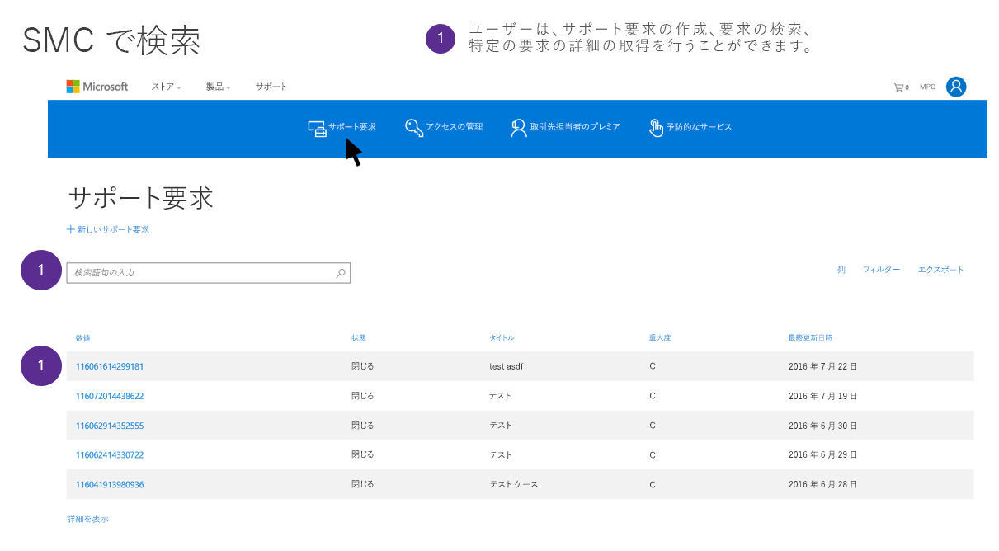

# GDPR のための Microsoft サポート/プロフェッショナル サービス データ サブジェクト要求Microsoft Support and Professional Services Data Subject Requests for the GDPR

## Microsoft プロフェッショナル サービスの概要Introduction to Microsoft Professional Services

Microsoft プロフェッショナル サービスは、技術設計者、エンジニア、コンサルタント、サポート プロフェッショナルで構成されています。この多様性に溢れるグループが、お客様により多くの可能性を提供し、より多くの成果を達成していただくという Microsoft のミッションを果たすために取り組んでいます。191 か国で働く 21,000 人以上のコンサルタント、デジタル アドバイザー、Premier サポート、エンジニア、販売担当者が所属する Microsoft プロフェッショナル サービス チームは、46 か国語で対応し、毎月数百万回のエンゲージメントを提供しています。お客様やパートナーとのやり取りには、客先、電話、Web、コミュニティ、自動化されたツールで対応します。この組織は、大規模なパートナー ネットワーク、技術コミュニティ、ツール、診断、および企業のお客様と Microsoft とをつなげるチャネルを利用して、Microsoft ポートフォリオ全体にわたる幅広い専門知識を提供します。Microsoft Professional Services includes a diverse group of technical architects, engineers, consultants, and support professionals dedicated to delivering on the Microsoft mission of empowering customers to do more and achieve more. Our Professional Services team includes more than 21,000+ total consultants, Digital Advisors, Premier Support, engineers, and sales professionals working across 191 countries, supporting 46 different languages, managing several million engagements per month, and engaging in customer and partner interactions through on-premise, phone, web, community and automated tools. The organization brings broad expertise across the Microsoft portfolio, leveraging an extensive network of partners, technical communities, tools, diagnostics and channels that connect us with our enterprise customers.

Microsoft プロフェッショナル サービスの詳細を確認するには、Microsoft Trust Center (<https://www.microsoft.com/trustcenter/professional-services>) で Microsoft プロフェッショナル サービスのセクションに移動してください。Find out more about Microsoft Professional Services by going to the Microsoft Professional Services section on the Microsoft Trust Center (<https://www.microsoft.com/trustcenter/professional-services>). Microsoft プロフェッショナル サービスでは、一般データ保護規則 (GDPR) の下での義務を重く受け止めています。Microsoft Professional Services takes its obligations under the General Data Protection Regulation (GDPR) seriously. このドキュメント内の情報は、Microsoft のサポートおよびコンサルティング サービスが GDPR の下でのデータ主体の要求 (DSR) の義務にどのように対応し、お客様を支援するかに関するお客様の質問に回答するために用意されました。The information in this document is designed to answer customer questions about how Microsoft’s support and consulting offerings will respond to and assist customers in responding to Data Subject Request (DSR) obligations under GDPR.

### DSR についてIntroduction to DSRs 

GDPR では、ユーザー (規則では*データ主体*と呼ばれる) に対して、雇用主やその他の会社または組織 (*データ コントローラー*または単に*コントローラー*と呼ばれる) が収集した個人データを管理する権利を与えます。GDPR の下で個人データは広範な定義がなされ、識別された、または識別可能な自然人と関連するあらゆるデータのことです。GDPR はデータ主体に個人データ固有の権利を与えます。この権利には、個人データのコピーの取得、変更の要求、処理の制限、削除が含まれます。データ主体からコントローラーに個人データへのアクション実行を求める正式な要求は、*データ主体要求* (DSR) と呼ばれます。また、GDPR では、コントローラーに代わって作業する会社 (*データ プロセッサ*または単に*プロセッサ*と呼ばれる) は DSR を履行するにあたりコントローラーを合理的に支援することが義務付けられています。The GDPR gives rights to people (known in the regulation as *data subjects*) to manage the personal data that has been collected by an employer or other type of agency or organization (known as the *data controller* or just *controller*). Personal data is defined very broadly under the GDPR as any data that relates to an identified or identifiable natural person. The GDPR gives data subjects specific rights to their personal data; these rights include obtaining copies of it, requesting changes to it, restricting the processing of it, and deleting it. A formal request by a data subject to a controller to take an action on their personal data is called a *Data Subject Request* or DSR. Additionally, it obligates companies working on behalf of a controller (known as the *data processor* or just *processor*) to reasonably assist the controller in fulfilling DSRs.

このガイドでは、サポートおよびその他のプロフェッショナル サービス オファリングを提供するために収集されている可能性がある、Microsoft の IT システム内に存在する個人データの検索、アクセス、および操作の方法について説明します。This guide discusses how to find, access, and act on personal data that reside in Microsoft IT systems that may have been collected to provide Support and other Professional Services offerings.

DSR の対応を策定する際に、Microsoft のお客様はサポートおよびコンサルティング データがオンライン サービスに含まれるお客様データまたはお客様やお客様のデータ主体が Microsoft に提供した可能性のあるデータとは異なることを理解するのが重要です。オンライン サービス向けに提供されているツールとプロセス、Microsoft プライバシー ダッシュボード、その他の DSR 応答用の Microsoft システムは Microsoft サポートまたはその他のプロフェッショナル サービスによって保持される個人データに対する DSR 対応には使用できません。In developing a response for DSRs, it is important for Microsoft’s customers to understand that Support and Consulting Data is separate from Customer Data in the Online Services or other data that they or their data subjects may have provided to Microsoft. Tools and processes provided for Online Services, the Microsoft Privacy Dashboard, or other Microsoft systems for responding to DSRs cannot be used to respond to DSRs for personal data held by Microsoft Support or other Professional Services.

以下に示すように、すべての要求はサポート担当者を通じて行う必要があります。現在、お客様がプロフェッショナル サービス組織内の個人データにアクセスするためのセルフサービス ツールはありません。All requests must be made through a support representative, as described below. Currently there is no self-serve tool for customers gain access to personal data within the Professional Services organizations.

#### このガイドで説明されているプロセスの概要Overview of the processes outlined in this guide

- **検出:** 検索/検出ツールを使用することで、DSR の対象となる可能性がある顧客データをより簡単に見つけます。対応の対象となる可能性のあるドキュメントが収集されたら、以下のステップの DSR アクションを 1 つまたは複数実行して要求に対応できます。あるいは、DSR 対応に関する組織のガイドラインを要求が満たしていないと判断する場合もあります。**Discover**—Use search and discovery tools to more easily find customer data that may be the subject of a DSR. Once potentially responsive documents are collected, you can perform one or more of the DSR actions described in the following steps to respond to the request. Alternatively, you may determine that the request doesn't meet your organization’s guidelines for responding to DSRs.
- **アクセス:** Microsoft クラウドにある個人データを取り出し、要求がある場合は、データ主体が利用できるコピーを作成します。**Access**—Retrieve personal data that resides in the Microsoft cloud and, if requested, make a copy of it that can be available to the data subject.
- **修正:** 必要に応じて、個人データを変更したり、要求された他の操作を個人データに対して実行したりします。**Rectify.** Make changes or implement other requested actions on the personal data.
- **制限:** さまざまな Azure サービスのライセンスを削除するか、可能な場合は該当するサービスを無効にすることで、個人データの処理を制限します。**Restrict**—Restrict the processing of personal data, either by removing licenses for various Azure services or turning off the desired services where possible. You can also remove data from the Microsoft cloud and retain it on-premises or at another location. また、データを Microsoft クラウドから削除してオンプレミスまたは別の場所で保持することもできます。Restrict—Restrict the processing of personal data, either by removing licenses for various online services or turning off the desired services where possible. You can also remove data from the Microsoft cloud and retain it on-premises or at another location.
- **削除:** Microsoft クラウドに格納されていた個人データを完全に削除します。**Delete**—Permanently remove personal data that resided in the Microsoft cloud.
- **エクスポート:** 個人データの電子コピー (コンピューターで読み取り可能な形式) をデータ主体に提供します。**Export**—Provide an electronic copy (in a machine-readable format) of personal data to the data subject.

### 用語集Terminology

このガイド向けに GDPR の用語の関連定義を以下に示します。Below are the relevant definitions of terms from the GDPR for this guide:

- **管理者:** 単独または他者と共同で、個人データの処理に関する目的と手段を決定する自然人や法人、公的機関、団体、その他の組織。そのような処理の目的と手段が EU 法もしくは加盟国の法律によって決定される場合、コントローラーまたはその指名に関する具体的な基準が EU 法または加盟国の法律によって提供される場合があります。**Controller.** The natural or legal person, public authority, agency or other body which, alone or jointly with others, determines the purposes and means of the processing of personal data; where the purposes and means of such processing are determined by Union or Member State law, the controller or the specific criteria for its nomination may be provided for by Union or Member State law.
- **個人データおよびデータ主体:** 特定されたまたは特定可能な自然人 (「データ主体」) に関するあらゆる情報。特定可能な自然人とは、その者の名前、ID 番号、位置データ、オンライン ID、または当該自然人に固有の 1 つ以上の特に身体的、生理学的、遺伝的、心理的、経済的、文化的、社会的な識別情報などの要素を参照することにより、直接または間接的に特定することができる者のことです。**Personal data and data subject.** Any information relating to an identified or identifiable natural person (‘data subject’); an identifiable natural person is one who can be identified, directly or indirectly, in particular by reference to an identifier such as a name, an identification number, location data, an online identifier or to one or more factors specific to the physical, physiological, genetic, mental, economic, cultural or social identity of that natural person.
- **処理者:** 管理者に代わって個人データを処理する自然人または法人、公的機関、団体、その他の組織。**Processor.** A natural or legal person, public authority, agency or other body which processes personal data on behalf of the controller.

#### このガイドを理解するうえで役立つ可能性があるその他の用語と定義Additional terms and definitions that may helpful in understanding this guide

- **サポートおよびコンサルティング データ:** サポートまたはプロフェッショナル サービスを得るために、Microsoft との連携を通じてお客様により、またはお客様に代わって Microsoft に提供される (または Microsoft がオンライン サービスから取得することをお客様が認める) テキスト、サウンド、ビデオ、画像ファイル、またはソフトウェアを含むすべてのデータです。**Support and Consulting Data** is all data, including all text, sound, video, image files, or software, that are provided to Microsoft by, or on behalf of, Customer (or that Customer authorizes Microsoft to obtain from an Online Service) through an engagement with Microsoft to obtain Support or Professional Services. To clarify, this does not include data collected where Microsoft is the data controller including Customer Contact Data. なお、この中にはお客様連絡先データなど、Microsoft がデータ コントローラーである場合に収集されるデータは含まれません。To clarify, this does not include data collected where Microsoft is the data controller including Customer Contact Data.
- **お客様連絡先:** お客様連絡先情報に含まれる個人データなど、Microsoft との取引関係の一部である可能性がある個人データです。**Customer Contact:** Personal data that may be part of your business relationship with Microsoft, such as personal data contained within your customer contact information. この中にはプレミア契約サービス マネージャー (CSM)、オンライン サービスのグローバルまたは IT 管理者、または同様の役割の名前、電子メール、または電話番号が含まれることがあります。Customer Contact is personal data that may be part of your business relationship with Microsoft, such as personal data contained within your customer contact information. This may include your name, e-mail, or phone number of the Premier Contract Service Manager (CSM), the Global or IT Administrator for an Online Service, or similar roles.
- **仮名化データ:** Microsoft のエンタープライズ製品およびサービスに対して Microsoft サポートを利用する場合、Microsoft はサポートを提供するために Microsoft 数値識別子に関連付けられた情報を生成します。**Pseudonymized Data:** When you use Microsoft support for Microsoft’s enterprise products and services, Microsoft generates some information linked to a Microsoft numeric identifier to provide the support. これはしばしば「仮名化データ」と呼ばれます。このデータは追加情報を使用せずに特定のデータ主体に帰属させることはできませんが、一部は GDPR の個人データに対する広範な定義の下で個人データとみなされる場合があります。Pseudonymized Data When you use Microsoft support for Microsoft’s enterprise products and services, Microsoft generates some information linked to a Microsoft numeric identifier to provide the support. This is often referred to as “Pseudonymized Data”, Although this data cannot be attributed to a specific data subject without the use of additional information, some of it may be deemed personal under GDPR's broad definition for personal data. Within Professional Services, requests to fulfill or assist in fulfilling DSRs will always automatically include addressing pseudonymized data. プロフェッショナル サービスにおいて、DSR の履行または履行支援の要求は常に仮名化データの対応を自動的に含みます。Within Professional Services, requests to fulfill or assist in fulfilling DSRs will always automatically include addressing pseudonymized data.

### このガイドの使用方法How to use this guide

このガイドでは、お客様が Microsoft プロフェッショナル サービスを使用した場合に遭遇する可能性がある 4 つのシナリオについて説明します。This guide covers four scenarios a customer may encounter if they have utilized Microsoft Professional Services.

- **Microsoft と連携するお客様連絡先の DSR:** データ主体の権利行使を目的にしたお客様連絡先または IT 管理者からの要求に Microsoft がどのように対応するかについての説明です。Explanation for how Microsoft will respond to requests from a customer contact or IT administrator to exercise their data subject rights.
- **Microsoft と連携するエンド ユーザーの DSR:** 権利行使を目的にしたお客様の従業員またはその他のデータ主体からの要求に Microsoft がどのように対応するかについての説明です。Explanation for how Microsoft will respond to requests from a customer’s employees or other data subjects to exercise their rights.
- **お客様提供のデータの DSR: 商用サポート:** お客様が権利の行使を目的にした従業員その他のデータ主体からの要求を受け取り、そのデータ主体の個人データがサポート作業時に Microsoft サポートによって収集された場合、Microsoft からどのように支援を受けるかについての説明です。Explanation for how to receive assistance from Microsoft when a customer has received a request from their employee or other data subjects to exercise their rights, and that data subject’s personal data was collected by Microsoft Support during a support engagement.
- **お客様提供のデータの DSR: FastTrack 移行サービスを含むコンサルティング サービス:** お客様が権利の行使を目的にした従業員その他のデータ主体からの要求を受け取り、そのデータ主体の個人データがコンサルティング作業時に Microsoft によって収集された場合、Microsoft からどのように支援を受けるかについての説明です。Explanation for how to receive assistance from Microsoft when a customer has received a request from their employee or other data subjects to exercise their rights, and that data subject’s personal data was collected by Microsoft during a consulting engagement.

## Microsoft と連携するお客様連絡先の DSRDSR for a Customer Contact Engaging Microsoft

*Microsoft はデータ主体の権利行使を目的にしたお客様連絡先または IT 管理者からの要求にどのように対応するか。**How Microsoft responds to requests by a customer contact or IT admin to exercise their data subject rights.*

お客様がサポートまたはコンサルティング サービスを受けるために Microsoft と連携する際、Microsoft サポートは取引先レコードからお客様連絡先 (例: プレミア CSM、グローバル管理者、IT 管理者) の個人データを自動的に収集または取得します。When a customer engages with Microsoft to receive support or consulting services, Microsoft Support automatically collects or retrieves from account records the personal data of the Customer Contact (e.g. Premier CSM, Global Admin, IT Admin). This likely includes the name, email, phone and other personal data of the individual seeking support or consulting services. この中にはサポートまたはコンサルティング サービスを受けようとする個人の名前、メール、電話、その他の個人データが含まれる可能性があります。This likely includes the name, email, phone, and other personal data of the individual seeking support or consulting services.

お客様連絡先の個人データは Microsoft のお客様との取引関係の一部であり、Microsoft はデータ コントローラーです。お客様連絡先が引き続きその組織と関係があるかどうかにかかわらず、Microsoft はお客様連絡先からの DSR に対応します。The Customer Contact’s personal data is part of Microsoft’s business relationship with the customer, and Microsoft is the data controller. Microsoft will respond to DSRs from the Customer Contact around their personal data, regardless of whether they are still with the organization.

DSR にはお客様連絡の個人データのみが含まれ、Microsoft はデータ プロセッサであるため、連携の一部として提出されるすべてのお客様データ (例: トランスクリプト、ケースの説明、ファイル、作業生産物) について変更または削除は一切行われないことを、お客様にご理解いただく必要があります。Customers should understand that the DSR only covers the personal data of the Customer Contact, and no changes or deletions will be made to any of the customer’s data submitted as part of engagements (e.g. transcripts, case descriptions, files, work product), since Microsoft is the data processor. Additionally, to maintain the engagement’s historical record no changes at all will be made to closed engagements, including the record of who opened an engagement. また、連携の履歴レコードを維持するために、連携を開始した人のレコードを含め、終了した連携に対して変更は一切行われません。Additionally, to maintain the engagement’s historical record no changes at all will be made to closed engagements, including the record of who opened an engagement.

お客様連絡先から DSR に関する照会を受けた場合、Microsoft 担当者はお客様連絡先に [Microsoft プライバシー サポート](http://go.microsoft.com/fwlink/?LinkId=321116)を案内します。これはプライバシーの照会と苦情に対する Microsoft の主要な入力メカニズムです。照会を受けた後、Microsoft プライバシー チームはこれが商用または組織のアカウントの一部であることを識別し、適切に対応します。Upon receiving an inquiry from a Customer Contact regarding a DSR, Microsoft personnel will refer a customer contact to [Microsoft Privacy Support](http://go.microsoft.com/fwlink/?LinkId=321116). This is Microsoft’s primary input mechanism for privacy inquiries and complaints. Upon receiving an inquiry, the Microsoft Privacy Team will identify that this is part of a commercial or organizational account and respond accordingly.

お客様のビジネス継続性を保つために、代替の連絡先が確認されるまで、Microsoft は連携に関連する DSR も処理しません。新しい連絡先の確認後、Microsoft は、処理中の連携において、古い連絡先を新しい連絡先に置き換えます。To maintain customer’s business continuity, Microsoft will also not process a DSR associated with an engagement until a replacement contact is confirmed. Upon confirmation of a new contact, Microsoft will swap out the old contact with the new one in open engagements.

お客様はこの DSR とは別に通常のサポートまたはコンサルティング チャネルを通じて、プロフェッショナル サービスの連携時に収集されたデータを変更することもできます。たとえば、Microsoft は要求に応じてサポート連携の抹消を支援できます (後述の*お客様提供データの DSR ガイド*のセクションをご参照ください)。Customers may choose to make changes to their data collected during Professional Services engagements through normal support or consulting channels, separate from this DSR. For instance, Microsoft can assist in expunging support engagements, on request (see below in *DSR Guide for Customer Provided Data* section).

***説明目的のみの例******Example for Illustration Purposes Only***

John は O365 企業顧客を担当する IT 管理者で、処理中のサポート連携が 1 件、終了済みの連携が 2 件あります。現在 John は離職を検討しており、自分のデータを削除したいと考えています。John は PRC に問い合わせ、IT 管理者として識別されます。John は以前 (終了済み) の連携や処理中のすべての連携から自分の名前を削除できないことを知らされます。ただし、John が代替の連絡先を特定すれば PRC は現在処理中のチケットに含まれる連絡先としての John を置き換えます。John は Microsoft に Jane が代替の連絡先になることを知らせることが可能で、Microsoft は変更をすべてのサポート システムに反映させます。John is an IT Admin for an O365 enterprise customer, with one open support engagement and two closed engagements. Now John is leaving his company and wants his data deleted. John contacts the PRC, who identifies him as the IT Admin. John is informed his name cannot be deleted from the prior (closed) engagements or from any data within the open engagements. However, the PRC will replace John as the contact on the current open ticket if he will identify a replacement contact. John lets Microsoft know that Jane will be his replacement contact, and Microsoft makes the change across all support systems.

## Microsoft と連携するエンド ユーザーの DSRDSR for an End User Engaging Microsoft

*権利行使を目的にしたお客様の従業員またはその他のデータ主体からの要求に Microsoft がどのように対応するか。**How Microsoft responds to requests from a customer’s employees or other data subjects to exercise their rights.*

Microsoft がデータ プロセッサとして収集したデータに対する権利行使を目的にして、お客様の従業員またはその他のデータ主体が Microsoft に問い合わせた場合、そのデータ主体には権利行使のためにデータ コントローラーである Microsoft のお客様に問い合わせる必要があることが通知されます。Microsoft はそれ以上のアクションを一切行いません。If a customer’s employee or other data subject contacts Microsoft to exercise their rights over data that Microsoft has collected as the data processor, then that data subject will be informed that they need to contact Microsoft’s customer, as the data controller, to exercise those rights. Microsoft will take no further action.

データ主体が、Microsoft がデータ コントローラーである状況で Microsoft が収集したデータに対する権利の行使についても Microsoft に問い合わせた場合 (例: 消費者サポート、商用顧客連絡先)、Microsoft は個人データに対するデータ主体の権利要求に個別に対応します。If the data subject has also contacted Microsoft about exercising their rights for data Microsoft has collected in situations where Microsoft is the data controller (e.g. consumer support, commercial customer contact) then Microsoft will separately respond to the individual’s data subject right request for that personal data.

***説明目的のみの例******Example for Illustration Purposes Only***

Jane は企業顧客 Contoso の従業員で、Dynamics 365 アカウントを付与されています。Jane is an employee of an Enterprise customer, Contoso, that has given her a Dynamics 365 account. Jane が自分のデータを削除してもらうために Microsoft に連絡すると、プライバシー レスポンス センターを案内されます。She contacts Microsoft to have all her data deleted and is referred to the Privacy Response Center. Jane は要求フォームに入力します。Jane fills out the request form. プライバシー レスポンス センターは Jane を企業エンド ユーザーとして識別し、企業データの削除については Contoso の社内で手続きを行う必要があることを知らせます。The Privacy Response Center identifies her as an enterprise end user and lets her know she needs to work through Contoso for the deletion of her enterprise data. プライバシー レスポンス センターは Jane を Microsoft X-Box ユーザーとしても識別し、コンシューマー Microsoft アカウントから Jane のデータを削除します。They also identify her as a Microsoft X-Box user and delete her data out of her consumer Microsoft account.

## お客様提供のデータの DSR: 商用サポートDSR for Customer Provided Data: Commercial Support

*お客様が権利の行使を目的にした従業員その他のデータ主体からの要求を受け取り、そのデータ主体の個人データがサポート作業時に Microsoft サポートによって収集された場合、Microsoft からどのように支援を受けるかについて。**How to receive assistance from Microsoft when a customer has received a request from their employee or other data subjects to exercise their rights, and that data subject’s personal data was collected by Microsoft Support during a support engagement.*

お客様が Microsoft サポートと連携すると、Microsoft はサポート連携を必要とした問題を解決するために、お客様からサポート データを収集します。When a customer engages with Microsoft Support, Microsoft collects Support Data from the customer to resolve any issues that required a support engagement. このサポート データには Microsoft のお客様とのやり取り (例: チャット、電話、メール、Web 送信) に加え、お客様が Microsoft に送信するか、サポート問題の解決のためにお客様の許可を得て Microsoft がお客様の IT 環境またはオンライン サービス テナントから抽出したコンテンツ ファイルが含まれます。This Support Data includes Microsoft’s interaction with the customer (for example, chat, phone, email, web submission) plus any content files the customer sends to Microsoft or Microsoft has, with customer’s permission, extracted from the customer’s IT environment or Online Services tenancy to resolve the support issue. プレミア サポートの場合、将来の問題を未然に防止するために収集されるデータが含まれます。In the case of Premier support, this would also include any data we collect from you to proactively prevent future issues. ただし、お客様連絡先情報または Microsoft のお客様との取引関係に関するその他の情報 (例: 請求レコード) は除外されます。However, this excludes Customer Contact information or other information from Microsoft’s business relationship with the customer (for example, billing records).

すべてのサポート データに関して、Microsoft はデータ プロセッサです。そのため、サポート データが Microsoft 商用顧客に関連する場合、Microsoft はデータ主体からの直接の要求に対応しません。Microsoft は DSR 対応の支援を行うために通常のサポート チャネルを通じてお客様と連携します。For all Support Data, Microsoft is the data processor. As such, Microsoft’s will not respond to direct requests from data subjects regarding Support Data provided when they were associated with a Microsoft commercial customer. Microsoft will work with the customer through their normal support channels to assist them in responding to DSRs.

## ステップ 1: 検出Step 1: Discover

DSR 対応で Microsoft の支援を得る際の最初のステップは DSR の対象となる個人データを見つけることです。The first step in obtaining Microsoft’s assistance in responding to a DSR is to find the personal data that is the subject of the DSR. This first step - finding and reviewing the personal data at issue - will help a customer determine whether a DSR meets the organization's policies for honoring a data subject request. 問題となっている個人データの発見と確認というこの最初のステップは、お客様にとって DSR がデータ主体要求の尊重に関する組織のポリシーに合致しているかどうかを判断するのに役立ちます。The first step in obtaining Microsoft’s assistance in responding to a DSR is to find the personal data that is the subject of the DSR. This first step - finding and reviewing the personal data at issue - will help a customer determine whether a DSR meets the organization's policies for honoring a data subject request.

お客様がデータを発見した後、お客様はデータ主体による要求を満たすために特定のアクションを実行できます。お客様が実行しようとする内容に応じて、お客様が連携する必要がある発見のレベルが定まります。After the customer finds the data, the customer can then perform the specific action to satisfy the request by the data subject. Depending on what the customer is trying to do will determine what level of discovery the customer needs to engage in.

DSR の解決に関して Microsoft がお客様を支援する場合、これはビジネス機能であり、要求は通常のサポート チャネルを通じて行われ、Microsoft プライバシー チームを経由しません。Where Microsoft assists a customer with the resolution of a DSR then this is a business function, and the request is made through your regular support channel and not through a request to the Microsoft Privacy Team.

関連するデータを検出し、Microsoft の支援を得る際、お客様は DSR に対応する方法についていくつかの選択肢があります。In discovering relevant data and obtaining Microsoft’s assistance, a customer has several options for how to approach the DSR:

*オプション A: Microsoft サポート顧客 DSR*。Microsoft のサポート環境全体でお客様のすべてのサポート データに DSR を適用します。これを行うために、お客様は単純に Microsoft に対して、収集されたすべてのサポート データに DSR を適用するよう依頼できます。*Option A – Cross-Microsoft Support Customer DSR*. Apply the DSR to all the customer’s support data across Microsoft’s support environment. To do this, a customer can just ask Microsoft to apply the DSR to all Support Data collected.

*オプション B: 特定顧客連携。**Option B — Specific Customer Engagements.* オンライン システムを使用してチケットを確認した後で、関連する個人データを含む特定の連携を識別し、それらを Microsoft に報告します。Use online systems to review tickets, then identify specific engagements containing the relevant personal data and report them Microsoft. お客様が連携 (チケット) 全体を検索することができない場合、Microsoft は検索実行の支援の提供を試みます。Option B – Specific Customer Engagements. Use online systems to review tickets, then identify specific engagements containing the relevant personal data and report them Microsoft. Microsoft will attempt to provide assistance to to perform a search if the customer does not have the ability to search across engagements (tickets).

***連携が識別された後で、該当レコードの特定の部分または Microsoft 全体でそのレコードに関するすべてのものに DSR を適用します。***\*\*\*\*\*Once engagements are identified, request to apply the DSR to either a specific part of the record or everything related to that engagement across Microsoft.\*\*\*

特定の連携を識別するために、お客様は連携全体を検索する必要があります。プレミア顧客の場合、お客様の契約サービス マネージャー (“CSM”) は契約スケジュールの下で作成されたすべてのサポート要求 (SR) を確認できます。プレミアでない場合、オンライン サービス サポート エリアなど、同等のサポート連携ポータルを使用できます。To identify specific engagements, customers need to search across their engagements. For Premier customers, the Contract Service Manager (“CSM”) for a customer has visibility across all Support Requests (SRs) that are created under that Contract Schedule. For Non-Premier, equivalent support engagement portals are available, such as through Online Services support areas.

CSM は Support.Microsoft.Com ([https://support.microsoft.com/\<local言語コード\>/premier](https://support.microsoft.com/%3clocal%20language%20code%3e/premier)) (“SMC”) でポータルにアクセスし、サポート要求を選択および確認できます (注: URL 内のローカル言語コードを置き換えてください)。The CSM can go to the portal at Support.Microsoft.Com ([https://support.microsoft.com/\<local language code\>/premier](https://support.microsoft.com/%3clocal%20language%20code%3e/premier)) (“SMC”) and select and review Support Requests. (Note: In the URL, please substitute for your local language code).

>[!IMPORTANT]
>SMC 内のケース履歴に加えて、お客様はサポート連携時に Microsoft によって収集された (またはお客様の許可の下でオンライン サービスから削除された) ファイル内にエンド ユーザーの個人データを保有している場合があります。In addition to the case history in SMC, customers may also have personal data of an end user in files that was collected by Microsoft (or, with customer’s permission, removed from the Online Service) during a support engagement. 例としてお客様の Exchange メールボックス、Azure VM、データベースのコピーなどがあります。Examples may include copies of customer’s exchange mailboxes, Azure VMs, or databases. こうした個人データは特定の連携に関するケース事例 (つまりチケット) の中で記述されている場合と記述されていない場合があります。This personal data may or may not be mentioned in the case history (i.e. ticket) for a particular engagement. そのデータを確認するために、お客様連絡先は、Microsoft サポート データ転送および管理ツール (DTM) 内のワークスペースの URL を受け取っている特定の認証済み (AAD または MSA による) サポート要求連絡先である必要があります。To review that data, the Customer Contact must be a specific authenticated (via AAD or MSA) Support Request contact that has received a URL for a workspace in Microsoft Support Data Transfer and Management tool (DTM). お客様連絡先はファイルにアクセスできますが、グローバル表示は使用できません。また、SMC はファイルが存在するかどうかを示しません。A Customer Contact will have access to the files, but no global view is available, and SMC will not indicate if files exist.

お客様が選択したサポート チケット内で関連するすべてのデータを識別すると、お客様はチケットに関連するすべてのものを削除することを要求するか、個人データの個別の事例に DSR を選択的に適用するかを決定できます。Once customers have identified all the relevant data in the selected support tickets, customers can decide whether to request the deletion of everything related to a ticket or selectively apply the DSR to individual instances of personal data.

## ステップ 2: アクセスStep 2: Access

お客様が DSR に対応する可能性がある個人データを含むサポート データを発見した後、どの個人データを対応に含めるかの決定はお客様に任されます。たとえば、お客様は他のデータ主体および機密情報に関する個人データを削除することを選択できます。After a customer has found Support Data containing personal data that is potentially responsive to a DSR, it is up to the customer to decide which personal data to include in the response. For example, the customer may choose to remove personal data about other data subjects and any confidential information.

DSR への対応には実際のドキュメントのコピー、適切に編集されたバージョン、共有することが適切であるとお客様が判断した部分のスクリーンショットが含まれる場合があります。アクセス要求に対するこうした対応のそれぞれについて、お客様はドキュメントのコピーまたは対応データを含むその他の項目を取得する必要があります。Response to the DSR may include a copy of the actual document, an appropriately redacted version, or a screenshot of the portions the customer has deemed appropriate to share. For each of these responses to an access request, the customer will have to retrieve a copy of the document or other item that contains the responsive data.

エンド ユーザーの個人データに対するアクセスはさまざまなタイプのコンテンツ ドキュメントの中に記述または注釈として含まれる場合があります。Access to the personal data of an end user may be from a mention or notation in the various types of content documentation. Since customers may access the engagement ticket and the content they can provide a summary of personal data themselves without further assistance from Microsoft. お客様は連携チケットおよびコンテンツにアクセスできるため、Microsoft からの支援を特に受けることなく、個人データの概要を自ら提供できます。Access to the personal data of an end user may be from a mention or notation in the various types of content documentation. Since customers may access the engagement ticket and the content they can provide a summary of personal data themselves without further assistance from Microsoft.

まれなケースとして、お客様は Microsoft 担当者とお客様の代表者との間のサポートでのやり取りのデータ (例: メール、電話記録のトランスクリプト、チャットのトランスクリプト) を取得する必要があります。In rare cases, customer may have need to obtain copies of support interaction data (e.g. emails, transcribed copies of phone recordings; chat transcripts) between a Microsoft Representative and the Customer’s Representative. To the extent required, Microsoft may provide redacted copies of these transcripts based on need, sensitivity, and difficulty. 必要な範囲において、Microsoft は要件、機密性、難易度に基づき、これらのトランスクリプトの編集されたコピーを提供する場合があります。To the extent required, Microsoft may provide redacted copies of these transcripts based on need, sensitivity, and difficulty.

## ステップ 3: 修正Step 3: Rectify

データ主体がお客様に対して組織のサポート データ内に存在する個人データの修正を求めた場合、お客様は要求を尊重することが適切かどうかを判断する必要があります。お客様が要求の尊重を選択した場合、お客様は Microsoft に対して変更を要求できます。Microsoft はデータの修正またはサポート システムからのお客様データの削除を行い、お客様に対して修正された形式でのデータの再送信を依頼する場合があります。If a data subject has asked the customer to rectify the personal data that resides in their organization’s Support Data, the customer will have to determine whether it’s appropriate to honor the request. If the customer chooses to honor the request, then the customer may request that Microsoft make the change. Microsoft may rectify data or may delete customer’s data from the support systems and request that the customer resubmit it to Microsoft in corrected format.

## ステップ 4: 制限Step 4: Restrict

お客様はいつでも連携を終了するか、Microsoft に連絡して連携終了を要求することができます。The customer may at any time close an engagement or contact Microsoft and request the engagement be closed. A closed engagement will prevent any work from being performed. 連携の終了により作業は実行できなくなります。A closed engagement will prevent any work from being performed.

正確を期すために、お客様は Microsoft に連絡して、お客様の許可がない限りどのような理由であってもケースを再開できないことを指示する注意事項を連携チケット システムに記載することを要求できます。For extra assurance, customer may contact Microsoft and request a note be placed in the engagement ticketing system instructing that the case should not be re-opened for any reason absent the customer’s permission.

注: 連携 (チケット) はデータ、サービス、およびシステムの機密性に基づく保持および削除スケジュールに従っても削除されます。Note: Engagements (tickets) will also be deleted according on a retention and deletion schedule, based on the sensitivity of data, service, and system. If customer requires a copy of data, they should ensure they have extracted data prior to deletion. お客様がデータのコピーを要求した場合、削除の前にデータを抽出したことを確認する必要があります。If customer requires a copy of data, they should ensure that they have extracted data prior to deletion.

## ステップ 5: 削除Step 5: Delete

組織のサポート データからの個人データの削除による「削除する権利」は GDPR における主要な保護の 1 つです。The “right to erasure” by the removal of personal data from an organization’s Support Data is a key protection in the GDPR. Removing personal data includes deleting entire engagements, documents or files or deleting specific data within an engagement, document or file. 個人データの削除には、連携、ドキュメント、またはファイルの全体の削除または特定の連携、ドキュメント、またはファイルに含まれる特定のデータの削除が含まれます。The “right to erasure” by the removal of personal data from an organization’s Support Data is a key protection in the GDPR. Removing personal data includes deleting entire engagements, documents or files or deleting specific data within an engagement, document or file.

お客様が DSR に対応する個人データを削除するために調査または準備する際、Microsoft サポートにとって削除がどのように作用するかについて理解する必要があるいくつかの重要な事項があります。As a customer investigates or prepares to delete personal data in response to a DSR, here are a few important things to understand about how deletion works for Microsoft Support.

Microsoft に存在するすべてのデータには保持および削除のポリシーが適用され、ポリシーはリスクその他の要因によって異なります。All data at Microsoft has a retention and deletion policy applied to it, which will vary depending on risk and other factors.

サポート システム全体でデータ主体の個人データを削除することを求めるお客様は、TAM を経由するか、SMC または同等システムでサポート要求 (SR) を入力することで実行できます。GDPR における DSR の支援を要求することを示す*必要*があります。Customers requesting the deletion of a data subject’s personal data universally cross Support systems may do that through your TAM or by filing a Support Request (SR) in SMC or equivalent system. You *must* indicate that this is a request to assist with a DSR under GDPR.

*オプション A: Microsoft サポート顧客 DSR*。*Option A — Cross-Microsoft Support Customer DSR*. システム全体の DSR の場合、要求されるデータを Microsoft が識別するために必要な個人データ (例: メール アドレス、電話番号) をお客様は提供する必要があります。For a cross system DSR, customer must provide the personal data that Microsoft needs to identify the required data (for example, email address; phone number). Microsoft はレコードの関連付けや調査を行わず、お客様から提供される識別子に関して直接の調査のみを行います。Microsoft will not correlate or research records and will only search directly on identifiers provided by the customer. データが見つかると、Microsoft はすべての連携とすべての関連データを削除します。When data is found, Microsoft will delete all engagements and all associated data.

> [!IMPORTANT]
> 重要な注意事項: \*\* この処理によりお客様の組織にとって重要な履歴記録が失われる場合があります。Important Note:\*\* this may result in loss of historical records that are important to customer’s organization.

*オプション B: 特定顧客連携*。*Option B — Specific Customer Engagements*. お客様が識別し、削除を望む特定の連携に関しては、SMC からチケットを削除しないでください。For specific engagements that the customer has identified and wants deleted, do not delete tickets out of SMC. その結果、個人データがログおよび下流システムに残留し、必要な時間枠の中で削除されない可能性があります。This will result in personal data remaining in logs and downstream systems that may not be deleted within the needed timeframe. 代わりに、削除する必要のあるチケットまたはチケット内の個人データを識別し、Microsoft サポートに連絡して、該当データの削除について支援を求めます。Instead, identify the ticket or personal data within the ticket that must be deleted, and contact Microsoft Support to assist you in deleting that data.

### Microsoft サポート データ転送および管理ツール (DTM) の操作方法Microsoft Support Data Transfer and Management tool (DTM) instructions

これらのすべての検索について、ファイル内に機密性の高いコンテンツが含まれる可能性があるため、Microsoft は DTM 全体を検索しません。ただし、お客様が要望する場合、Microsoft は、DTM に含まれ、お客様のアカウントに関連付けられているすべてのファイルを削除します。お客様に深刻な影響が出る可能性があるため、Microsoft はお客様から DTM ファイルの削除を指定する個別の要求を求めます。For all these searches, Microsoft will not search across DTM due to the potential sensitivity of content in files. However, if the customer desires, Microsoft will delete all files contained in DTM associated with the customer’s account. Due to the potential for serious customer impact, Microsoft requires a separate request from customer specifying the deletion of DTM files.

- オープン ケースについて、お客様連絡先は DTM にアクセスし、ファイルを削除できます。For open cases, the Customer Contact can go into DTM and delete files.
- 終了してから 90 日未満のケースについて、ファイル削除の要求は TAM 宛てまたは SR 内で行う必要があります。For cases closed less than 90 days, a request must be made to a TAM or in an SR to have the files removed.
- 終了してから 90 日以上超過したケースについて、ファイルは既に自動的に削除されています。For cases closed after than 90 days, files have already been automatically deleted.
- 個人データが削除済みのファイル内だけにあった場合でも、一部のデータはサポート提供の過程で DTM から削除されている可能性があるため、お客様は Microsoft にシステム全体で個人データをチェックしてもらう必要があります。Even if the personal data was only located within a file that has been deleted, customers must still have Microsoft run a check across systems for the personal data as some data may have been removed from DTM in the course of providing support.

## ステップ 6: エクスポートStep 6: Export

「データ ポータビリティの権利」により、データ主体は個人データの電子形式のコピーを要求し、自分の組織がそのコピーを別のコントローラーに転送することを要求できます。サポート データの場合、Microsoft が持つすべての再利用可能な情報は再通信または別のコントローラーへのアップロードを行うために返却可能な連携情報またはファイルの形式になります。The “right of data portability” allows a data subject to request a copy of their personal data in an electronic format and request that your organization transmit it to another controller. In the case of Support Data, any usable information that Microsoft has would be in the form of engagement information or files that can be returned to you for re-communication or uploading to another controller.

注: エクスポートされるデータに Microsoft の知的財産またはサービスの安定性やセキュリティを侵害する可能性があるデータを含めることはできません。Note: Exported data may not include Microsoft’s intellectual property or any data that may compromise the security or stability of the service.

***説明目的のみの例******Example for Illustration Purposes Only***

John は企業顧客である Contoso のプレミア CSM です。Contoso 従業員の電子メールに O365 を利用し、Contoso SQL データベースのホスティングに Azure を利用しています。Contoso にはオープンおよびクローズ チケットが複数あります。最近、Microsoft サポートはサポートとトラブルシューティングのために、Contoso の許可を得て SQL データベースのコピーを DTM に移行しました。John is a Premier CSM for an Enterprise customer, Contoso, that uses O365 for its employee e-mail and Azure to host a Contoso SQL database. Contoso has multiple open and closed tickets. Recently, Microsoft Support, with Contoso’s permission, moved a copy of the SQL database into DTM for support and troubleshooting.

John は Jane から Jane のすべてのデータを削除することを求める DSR を受け取ります。John は SMC にアクセスして連携全体を検索し、Jane に電子メール アカウントの問題があり、名前と電子メール アドレスにより 2 件のチケットで参照されていたことを識別します。John は TAM に連絡して、TAM に識別子として Jane の名前と電子メール アドレスを提供し、それら 2 件のチケットとそれらのチケットから生成された可能性のある下流データを削除するように要求します。John receives a DSR from Jane asking that all her data be deleted. John goes into SMC and searches across engagements to identify that Jane had email account issues and so was referenced in two tickets by name and email address. He contacts his TAM, provides the TAM with Jane’s name and e-mail address as an identifier, and requests that those two tickets be deleted, along with all downstream data that may have been generated out of those tickets.

また、John はサポート担当者とのチャット会話で Jane について言及した可能性があると考えたため、そのチャット ログの削除も要求します。He also suspects he was engaged in a chat conversation with support personnel where he mentions Jane, so he requests that chat log to be deleted.

John は Jane の個人データが SQL データベース内にあることも知っています。SQL VM が DTM に移行されてから 90 日経過していないため、TAM に個別に連絡して DTM からのデータベースの削除をすぐに実行するように支援を求めます。He also knows that Jane’s personal data is in the SQL Database. Since the SQL VM was moved into DTM less than 90 days ago, he asks his TAM separately to assist in the immediate deletion of the database out of DTM.

最後の、John はサポートの提供時に DTM ファイルからデータが削除された可能性があることを知っていするため、Microsoft に対して SQL データベースからの Jane の個人データについて、IT システム全体でチェックを実行するよう求めます。Lastly, since he knows that data may have been removed from the DTM file during providing support, he asks Microsoft to run a check across IT systems for Jane’s personal data from the SQL database.

Microsoft サポートはこれらの削除をすべて実行し、お客様の要求に基づいて、TAM は John に要求されたデータが削除されたという構成証明ステートメントを提供します。Microsoft Support performs all these deletions and, based on customer request, the TAM provides him with an attestation statement that the required data has been deleted.

## 移行サービスを含むコンサルティング サービスにおける、お客様提供データの DSR ガイド DSR Guide for Customer Provided Data in Consulting Services including Migration Services

*お客様が権利の行使を目的にした従業員その他のデータ主体からの要求を受け取り、そのデータ主体の個人データがコンサルティング作業時に Microsoft によって収集された場合、Microsoft からどのように支援を受けるか。**How to receive assistance from Microsoft when a customer has received a request from their employee or other data subjects to exercise their rights, and that data subject’s personal data was collected by Microsoft during a consulting engagement.*

## Microsoft コンサルティング サービスMicrosoft Consulting Services

Microsoft プロフェッショナル サービスのデータ保護補遺 (<http://aka.ms/professionalservicesdpa>) が適用される場合に契約される Microsoft コンサルティング サービス連携について。For Microsoft Consulting Services engagements contracted where the Microsoft Professional Services Data Protection Addendum (<http://aka.ms/professionalservicesdpa>) applies.

Microsoft は連携チームと共に作業するお客様連絡先のデータ コントローラーです。そうした個人はデータ主体の権利を履行するために [Microsoft プライバシー サポート](http://go.microsoft.com/fwlink/?LinkId=321116)に連絡する必要があります。Microsoft is the data controller for Customer Contacts working with the engagement team. Those individuals should contact [Microsoft Privacy Support](http://go.microsoft.com/fwlink/?LinkId=321116) to fulfill data subject rights.

Microsoft はコンサルティング連携時に提供されるデータ内に存在する DSR のデータ プロセッサです。お客様は収集されるデータと提供される特定のタイプのコンサルティング サービスに基づき、DSR 対応支援の計画策定のために連携マネージャーに連絡する必要があります。要求が通常 Microsoft コンサルティング サービス連携中に見られる一定レベルの活動を構成する範囲において、追加の作業指示が必要になる場合があります。また、コンサルティング連携のタイプに応じて、一定の時間枠内で各コンサルティング連携の後で個人データが削除されます。お客様はより早い時点でデータの削除を要求し、削除の構成証明を要求できます。Microsoft is the data processor for a DSR located within data provided during a consulting engagement. The customer should contact the engagement manager to build in a plan to assist in responding to a DSR based on the data collected and then specific type of consulting services provided. To the extent your request constitutes a level of effort typically seen within a Microsoft Consulting Services engagement, there may be an additional work order required. Additionally, personal data will be deleted after each consulting engagement within a timeframe dependent on the type of consulting engagement. Customer can request data to be deleted sooner and request an attestation of deletion.

## Microsoft FastTrack サービスMicrosoft FastTrack Services

[Microsoft FastTrack](https://na01.safelinks.protection.outlook.com/?url=https%3A%2F%2Ffasttrack.microsoft.com%2Fabout&data=02%7C01%7C%7Cd0521d8739c841df674508d596834585%7C72f988bf86f141af91ab2d7cd011db47%7C1%7C0%7C636580412901207944&sdata=PO5eh56pm9IYk5Y%2Ff%2F31e%2BRVPmrC2Qi%2FCsw1NphR8gY%3D&reserved=0) は、Microsoft 365、Azure、Dynamics 365 などの Microsoft クラウド サービスの組織での導入と利用を支援するための IT コンサルティング サービスを提供します。[Microsoft FastTrack](https://na01.safelinks.protection.outlook.com/?url=https%3A%2F%2Ffasttrack.microsoft.com%2Fabout&data=02%7C01%7C%7Cd0521d8739c841df674508d596834585%7C72f988bf86f141af91ab2d7cd011db47%7C1%7C0%7C636580412901207944&sdata=PO5eh56pm9IYk5Y%2Ff%2F31e%2BRVPmrC2Qi%2FCsw1NphR8gY%3D&reserved=0) provides IT consulting services to organizations to help them onboard and use Microsoft cloud services such as Microsoft 365, Azure and Dynamics 365.

Microsoft は FastTrack チームと共に作業するお客様連絡先のデータ コントローラーです。お客様連絡先が Microsoft FastTrack レコードに対して連絡先情報のアクセス、修正、および削除を要望する場合、お客様はデータ主体に要求を直接 Office 365 FastTrack GDPR 要求受信トレイ \<<o365ftgdpr@microsoft.com>\> に送信してもらうことができます。Microsoft is the data controller for Customer Contacts working with the FastTrack team. If Customer Contacts wish to access, revise or remove contact information from Microsoft’s FastTrack records, customers can have the data subject send the request directly to Office 365 FastTrack GDPR Request inbox \<<o365ftgdpr@microsoft.com>\>.

FastTrack 移行サービスに関して、Microsoft はデータ プロセッサです。FastTrack の追加のプライバシーの漏洩に関する声明に基づいて、移行中のすべてのデータは「移行データ」と見なされます。所属している組織が FastTrack の移行プロジェクトに参加している間に DSR を実行する必要がある場合は、特別な注意が必要です。For FastTrack migration services, Microsoft is the data processor. In accordance with our Fast Track additional privacy disclosure statement, all data in migration is considered “migration data.”  If you need to execute DSRs while your organization is engaged in a FastTrack migration project, special care is required.
  
ユーザーのデータが FastTrack の移行システムを通じて処理されている間にアクセスの処理、修正、DSR 要求のエクスポートを行う必要がある場合、ユーザー データが保存されている既存のソース システムを通じてそれらの DSR を履行するのはお客様の責任です。If you need to process any access, rectify, or export DSR requests while a user’s data is being processed through FastTrack migration systems, it will be the customer’s responsibility to fulfill such DSRs through your existing source systems in which the user data is stored. Once the user’s migration is complete and the data has been migrated to the destination Microsoft cloud service, the guidance provided by Microsoft on how customers can use Microsoft products, services and administrative tools to find and act on personal data to respond to data subject request will then apply. To view this guidance see Data Subject Requests for the GDPR. ユーザーの移行が完了し、データが移行先の Microsoft クラウド サービスに移行されると、お客様がデータ主体要求に対応するために Microsoft 製品、サービス、および管理ツールを使って個人データの検索と操作を行う方法についてのガイダンス (Microsoft 提供) が適用されます。If you need to process any access, rectify, or export DSR requests while a user’s data is being processed through FastTrack migration systems, it will be the customer’s responsibility to fulfill such DSRs through your existing source systems in which the user data is stored. Once the user’s migration is complete and the data has been migrated to the destination Microsoft cloud service, the guidance provided by Microsoft on how customers can use Microsoft products, services and administrative tools to find and act on personal data to respond to data subject request will then apply. To view this guidance see Data Subject Requests for the GDPR. このガイダンスを確認するには、「[GDPR におけるデータ主体による要求](https://docs.microsoft.com/microsoft-365/compliance/gdpr-data-subject-requests)」参照してください。To view this guidance see [Data Subject Requests for the GDPR](https://docs.microsoft.com/microsoft-365/compliance/gdpr-data-subject-requests). 

DSR の削除要求への対応として、継続中の FastTrack 移行プロジェクトに組織が参加している間に Office 365 ユーザー アカウントを削除する必要がある場合、ユーザーの移行完了後しばらくの間、ユーザー移行データのコピーが移行システムによって保持され、Office 365 ユーザー アカウントを削除しても、FastTrack 移行システムに保管されているそれらのユーザー移行データは自動的に削除されないことに注意してください。Microsoft FastTrack チームにユーザー移行データの削除を依頼する場合は、[要求を提出する](https://go.microsoft.com/fwlink/?linkid=874544)ことができます。通常の業務では、組織の移行が完了すると Microsoft FastTrack によってすべてのデータのコピーが削除されます。If you need to delete an Office 365 user account in response to a DSR delete request while your organization is engaged in an ongoing FastTrack migration project, you should be aware that migration systems may retain a copy of user migration data for a period of time following completion of the user’s migration and deleting the Office 365 user account will not automatically delete such user migration data stored in FastTrack migration systems.  If you would like the Microsoft FastTrack team to delete user migration data, you can [submit a request](https://go.microsoft.com/fwlink/?linkid=874544). In the ordinary course of business, Microsoft FastTrack will delete all data copies once your organization’s migration is complete.

## その他のコンサルティング サービスOther Consulting Services

Microsoft からその他のプロフェッショナル サービスを受けるお客様はすべての GDPR 要件を履行するために連携チームを通じて作業する必要があります。連携チームが GDPR DSR 履行に関する明確な指示を提供できない場合、お客様は [Microsoft プライバシー サポート](http://go.microsoft.com/fwlink/?LinkId=321116)に連絡して支援を受けることができます。Customer receiving other Professional Services through Microsoft should work through the engagement team for fulfillment of all GDPR requirements. If the engagement team is not able to provide clear instructions on GDPR DSR fulfillment, customers may contact [Microsoft Privacy Support](http://go.microsoft.com/fwlink/?LinkId=321116) for assistance.
