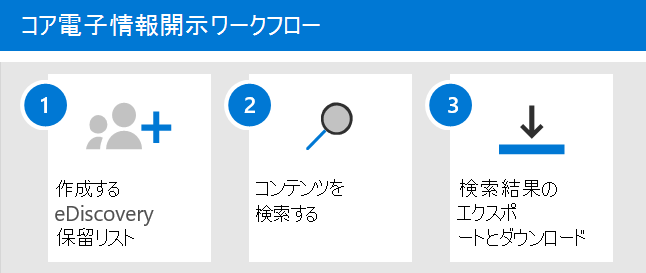

# Microsoft Purviewでの電子情報開示 (Standard) を使用した概要

[!include[Purview banner](../includes/purview-rebrand-banner.md)]

Microsoft PurviewのMicrosoft Purview eDiscovery (Standard) は、組織がMicrosoft 365およびOffice 365でコンテンツを検索およびエクスポートするために使用できる基本的な電子情報開示ツールを提供します。 電子情報開示 (Standard) を使用して、Exchange メールボックス、SharePoint サイト、OneDrive アカウント、Microsoft Teamsなどのコンテンツの場所に電子情報開示ホールドを配置することもできます。 電子情報開示 (Standard) を展開するには何も必要ありませんが、組織が電子情報開示 (Standard) を使用してコンテンツの検索、エクスポート、および保持を開始する前に、IT 管理者と電子情報開示マネージャーが完了する必要がある前提条件がいくつかあります。

この記事では、電子情報開示 (Standard) を設定するために必要な手順について説明します。 これには、電子情報開示 (Standard) にアクセスし、コンテンツの場所に電子情報開示を保持するために必要な適切なライセンスを確保するだけでなく、IT、法的、および調査チームがケースにアクセスして管理できるようにアクセス許可を割り当てることも含まれます。 この記事では、ケースを使用してコンテンツを検索およびエクスポートする概要についても説明します。

## 手順 1: 適切なライセンスを確認して割り当てる

電子情報開示 (Standard) のライセンスには、適切な組織のサブスクリプションとユーザーごとのライセンスが必要です。

- **組織のサブスクリプション:** Microsoft Purview コンプライアンス ポータルで電子情報開示 (Standard) にアクセスし、保留機能とエクスポート機能を使用するには、組織にオンラインプラン 2 以上のExchangeまたはMicrosoft 365 E3またはOffice 365 E3サブスクリプションが必要です。 フロントライン組織Microsoft 365 F5 サブスクリプションが必要です。

- **ユーザーごとのライセンス:** メールボックスとサイトに電子情報開示ホールドを設定するには、組織のサブスクリプションに応じて、次のいずれかのライセンスをユーザーに割り当てる必要があります。

  - Microsoft 365 E3以上のライセンスOffice 365 E3

   または

  - Exchange Online プラン 2 または Exchange Online Archiving アドオン ライセンスを使用してライセンスをOffice 365 E1する

   または

  - Microsoft 365 フロントライン F5 コンプライアンスまたは F5 セキュリティ & コンプライアンス アドオン ライセンス  

  AND

  - SharePoint Online プラン 2 または OneDrive for Business プラン 2 アドオン ライセンスでライセンスをOffice 365 E1する
  
  ライセンスを割り当てる方法については、「 [ユーザーにライセンスを割り当てる」を参照してください](../admin/manage/assign-licenses-to-users.md)。

セキュリティとコンプライアンスに関する情報とガイダンス:

- [Microsoft 365比較表](https://aka.ms/M365EnterprisePlans)の電子情報開示と監査のセクションをダウンロードして確認します。

- [セキュリティ&コンプライアンスのMicrosoft 365ガイダンスを参照してください - サービスの説明 |Microsoft Docs](/office365/servicedescriptions/microsoft-365-service-descriptions/microsoft-365-tenantlevel-services-licensing-guidance/microsoft-365-security-compliance-licensing-guidance)。

## 手順 2: 電子情報開示のアクセス許可を割り当てる

電子情報開示 (Standard) にアクセスしたり、電子情報開示 (Standard) ケースのメンバーとして追加したりするには、ユーザーに適切なアクセス許可を割り当てる必要があります。 具体的には、コンプライアンス ポータルで電子情報開示マネージャーの役割グループのメンバーとしてユーザーを追加する必要があります。 この役割グループのメンバーは、電子情報開示 (Standard) ケースを作成および管理できます。 メンバーの追加と削除、ユーザーへの電子情報開示ホールドの配置、検索の作成と編集、電子情報開示 (Standard) ケースからのコンテンツのエクスポートを行うことができます。

電子情報開示マネージャーの役割グループにユーザーを追加するには、次の手順を実行します。

1. コンプライアンス ポータルに移動し、Microsoft 365またはOffice 365組織の管理者アカウントの資格情報を使用してサインインします。

2. [ <a href="https://go.microsoft.com/fwlink/p/?linkid=2173597" target="_blank">**アクセス許可]**</a> ページで、 **電子情報開示マネージャー** の役割グループを選択します。

3. [電子情報開示マネージャー] ポップアップ ページで、[**電子情報開示マネージャー**] セクションの横にある **[編集]** をクリックします。

4. 役割グループの編集ウィザードの [ **電子情報開示マネージャーの選択** ] ページで、[ **探索マネージャーの選択**] をクリックします。

5. [ **追加]** をクリックし、役割グループに追加するすべてのユーザーのチェック ボックスをオンにします。

6. [ **追加]** をクリックして選択したユーザーを追加し、[完了] をクリック **します**。

7. [ **保存] を** クリックしてロール グループにユーザーを追加し、[ **閉じる** ] をクリックして手順を完了します。

### 電子情報開示マネージャーの役割グループの詳細

電子情報開示マネージャーの役割グループには 2 つのサブグループがあります。 これらのサブグループの違いは、スコープに基づきます。

- **電子情報開示マネージャー**: 作成またはメンバーである電子情報開示 (Standard) ケースを表示および管理できます。 別の電子情報開示マネージャーがケースを作成したが、そのケースのメンバーとして 2 つ目の電子情報開示マネージャーを追加しない場合、2 番目の電子情報開示マネージャーは、コンプライアンス センターの [電子情報開示 (Standard)] ページでケースを表示または開くことはできません。 一般に、組織内のほとんどのユーザーを電子情報開示マネージャー サブグループに追加できます。

- **電子情報開示管理者**: 電子情報開示マネージャーが実行できるすべてのケース管理タスクを実行できます。 さらに、電子情報開示管理者は、次のことができます。

  - 電子情報開示 (Standard) ページに一覧表示されているすべてのケースを表示します。
  
  - 自分自身をケースのメンバーとして追加した後、組織のすべてのケースを管理します。

  - 組織内のすべてのケースのケース データにアクセスしてエクスポートします。
  
  - 電子情報開示ケースからメンバーを削除します。 ケースからメンバーを削除できるのは、電子情報開示管理者のみです。 電子情報開示マネージャー サブグループのメンバーであるユーザーは、ユーザーがケースを作成した場合でも、ケースからメンバーを削除できません。

  アクセス範囲が広いため、電子情報開示管理者のサブグループのメンバーになっている管理者は少数です。

電子情報開示のアクセス許可と、電子情報開示マネージャーの役割グループに割り当てられている各ロールの詳細については、「 [電子情報開示アクセス許可の割り当て](assign-ediscovery-permissions.md)」を参照してください。

## 手順 3: 電子情報開示 (Standard) ケースを作成する

次の手順では、ケースを作成し、電子情報開示 (Standard) の使用を開始します。 次の手順を実行してケースを作成し、メンバーを追加します。 ケースを作成したユーザーは、メンバーとして自動的に追加されます。

1. <a href="https://go.microsoft.com/fwlink/p/?linkid=2077149" target="_blank">コンプライアンス ポータル</a>に移動し、適切な電子情報開示アクセス許可が割り当てられているユーザー アカウントの資格情報を使用してサインインします。 組織管理役割グループのメンバーは、電子情報開示 (Standard) ケースを作成することもできます。

2. コンプライアンス ポータルの左側のナビゲーション ウィンドウで、[ **すべて表示**] をクリックし、[ **電子情報開示** > <a href="https://go.microsoft.com/fwlink/p/?linkid=2174007" target="_blank">**コア**</a>] をクリックします。

3. **[電子情報開示 (Standard)]** ページで、[**ケースの作成**] をクリックします。

4. [ **新しいケース** ] ポップアップ ページで、ケースに名前 (必須) を指定し、省略可能な説明を入力します。 ケース名は、組織内で一意である必要があります。

5. [ **保存] を** クリックしてケースを作成します。

   新しいケースが作成され、電子情報開示 (Standard) ページに表示されます。 新しいケースを表示するには、[ **更新** ] をクリックする必要がある場合があります。

## 手順 4 (省略可能): 電子情報開示 (Standard) ケースにメンバーを追加する

手順 3 でケースを作成し、そのケースを使用する唯一のユーザーである場合は、この手順を実行する必要はありません。 ケースの使用を開始して、電子情報開示保留の作成、コンテンツの検索、検索結果のエクスポートを行うことができます。 他のユーザー (またはロール グループ) にケースへのアクセス権を付与する場合は、この手順を実行します。

1. コンプライアンス ポータルの **[電子情報開示 (Standard)]** ページで、メンバーを追加するケースの名前をクリックします。

2. ケース ホーム ページで、[**設定**] タブを選択し、[**アクセス許可&** 選択します。

3. [ **アクセス&アクセス許可** ] ポップアップ ページの [ **メンバー**] の [ **追加** ] をクリックして、ケースにメンバーを追加します。

    ロール グループをケースのメンバーとして追加することもできます。 [ **ロール グループ**] の [ **追加**] をクリックします。 ケースに割り当てることができるのは、自分がメンバーであるロール グループだけです。 これは、役割グループが電子情報開示ケースにメンバーを割り当てることができるユーザーを制御するためです。

4. ケースのメンバーとして追加できるユーザーまたは役割グループの一覧で、追加するユーザー (またはロール グループ) の名前の左側をクリックします。 メンバーとして追加できるユーザーまたは役割グループの大きなリストがある場合は、[ **検索** ] ボックスを使用して、リスト内の特定の人物または役割グループを検索します。
  
5. ケースのメンバーとして追加するユーザーまたは役割グループを選択したら、[ **保存]** をクリックして新しいメンバーまたは役割グループを保存します。

> [!IMPORTANT]
>
>- ケースのメンバーとして追加した役割グループにロールが追加または削除された場合、ロール グループはケースのメンバー (またはロール グループがメンバーである場合) として自動的に削除されます。 その理由は、ケースのメンバーに追加のアクセス許可を誤って提供しないように組織を保護するためです。 同様に、役割グループが削除された場合は、そのロール グループがメンバーであったすべてのケースから削除されます。 詳細については、「[電子情報開示のアクセス許可を割り当てる](assign-ediscovery-permissions.md#adding-role-groups-as-members-of-ediscovery-cases)」を参照してください。電子情報開示のアクセス許可を割り当てる」を参照してください。 
>
>- 前述のように、電子情報開示管理者のみがケースからメンバーを削除できます。 電子情報開示マネージャー サブグループのメンバーであるユーザーは、ユーザーがケースを作成した場合でも、ケースからメンバーを削除できません。
>

## 電子情報開示 (Standard) ワークフローを調べる

電子情報開示 (Standard) の使用を開始するには、関心のあるユーザーの電子情報開示ホールドを作成し、調査に関連するコンテンツを検索し、そのデータをエクスポートしてそのデータをエクスポートして詳細を確認する簡単なワークフローを次に示します。 これらの各手順では、探索できる拡張電子情報開示 (Standard) 機能についても説明します。

1. **[電子情報開示ホールドを作成します](create-ediscovery-holds.md)**。 ケースを作成した後の最初の手順は、調査に関心のあるユーザーのコンテンツの場所に *ホールド (電子情報開示ホールド* とも呼ばれます) を配置することです。 コンテンツの場所には、Exchangeメールボックス、SharePoint サイト、OneDrive アカウント、Microsoft TeamsとMicrosoft 365 グループに関連付けられているメールボックスとサイトが含まれます。 この手順は省略可能ですが、電子情報開示ホールドを作成すると、調査中にケースに関連する可能性のあるコンテンツが保持されます。 電子情報開示ホールドを作成する場合は、特定のコンテンツの場所のすべてのコンテンツを保持するか、クエリ ベースの保留を作成して、保留クエリに一致するコンテンツのみを保持できます。 コンテンツを保持するだけでなく、電子情報開示保留を作成するもう 1 つの正当な理由は、次の手順で検索を作成して実行するときに、(検索する各場所を選択する代わりに) コンテンツの場所をすばやく検索することです。 調査が完了したら、作成した保留を解放できます。

2. **[コンテンツを検索します](search-for-content-in-core-ediscovery.md)**。 電子情報開示保留を作成したら、組み込みの検索ツールを使用して、保留中のコンテンツの場所を検索します。 ケースに関連する可能性があるデータについて、他のコンテンツの場所を検索することもできます。 ケースに関連付けられたさまざまな検索を作成して実行できます。 キーワード、プロパティ、および条件を使用して、ケースに最も関連する可能性が高いデータで検索結果を返す検索 [クエリを作成](keyword-queries-and-search-conditions.md) します。 以下のことも実行できます。

   - 検索クエリを絞り込んで結果を絞り込むのに役立つ可能性がある検索統計情報を表示します。

   - 検索結果をプレビューして、関連するデータが見つかったかどうかを迅速に確認します。

   - クエリを修正し、検索を再実行します。

3. **[検索結果をエクスポートしてダウンロードします](export-content-in-core-ediscovery.md)**。 調査に関連するデータを検索して見つけたら、調査チームの外部のユーザーがレビューするためにOffice 365からエクスポートできます。 データのエクスポートは 2 段階のプロセスです。 最初の手順では、ケース内の検索結果をOffice 365からエクスポートします。 これは、Microsoft が提供するAzure Storageの場所に検索結果をコピーすることで実現されます。 次の手順では、電子情報開示エクスポート ツールを使用してコンテンツをローカル コンピューターにダウンロードします。 エクスポートされたデータ ファイルに加えて、エクスポート パッケージにはエクスポート レポート、概要レポート、エラー レポートが含まれます。
