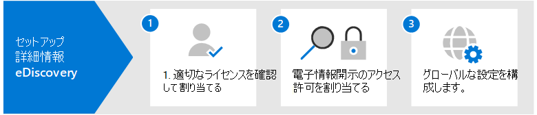

# 設定Microsoft 365 Advanced eDiscovery

Advanced eDiscovery Microsoft 365では、組織の内部および外部調査に対応するデータを保存、収集、レビュー、分析、およびエクスポートするためのエンドツーエンドのワークフローを提供します。 Advanced eDiscovery を展開するために必要なタスクは何もありませんが、組織が Advanced eDiscovery ケースの作成と使用を開始して調査を管理するには、IT 管理者と電子情報開示マネージャーが完了する必要があるいくつかの前提条件タスクがあります。

この記事では、セットアップに必要な以下の手順について説明Advanced eDiscovery。

これには、Advanced eDiscovery にアクセスしてケースにカストディアンを追加するために必要な適切なライセンスを確保し、ケースにアクセスして管理するための権限を法務および調査チームに割り当てる必要があります。

## 手順 1: 適切なライセンスを確認して割り当てる

ユーザーのライセンスAdvanced eDiscovery適切な組織のサブスクリプションとユーザーごとのライセンスが必要です。 ライセンス要件の一覧については、「サブスクリプションAdvanced eDiscoveryライセンス」[を参照してください](overview-ediscovery-20.md#subscriptions-and-licensing)。

## 手順 2: 電子情報開示のアクセス許可を割り当てる

ケースのAdvanced eDiscoveryメンバーとしてアクセスまたは追加するにはAdvanced eDiscovery適切なアクセス許可をユーザーに割り当てる必要があります。 具体的には、ユーザーを電子情報開示マネージャーの役割グループのメンバーとして追加する必要Microsoft 365 コンプライアンス センター。 この役割グループのメンバーは、すべてのケースを作成Advanced eDiscovery管理できます。 メンバーの追加と削除、保管担当者とコンテンツの場所の保留、法的保留通知の管理、ケースに関連付けられた検索の作成と編集、レビュー セットへの検索結果の追加、レビュー セット内のデータの分析、Advanced eDiscovery ケースからのエクスポートとダウンロードを行います。

電子情報開示マネージャーの役割グループにユーザーを追加するには、次の手順を実行します。

1. 組織の <https://compliance.microsoft.com/permissions> 管理者アカウントの資格情報を使用して、アクセスしてサインインMicrosoft 365します。

2. [アクセス許可 **] ページで** 、電子情報開示マネージャー **の役割グループを** 選択します。

3. [電子情報開示マネージャー] フライアウト ページで、[電子情報開示マネージャー] セクション **の横** にある [ **編集] をクリック** します。

4. 役割グループ **の編集ウィザードの [電子情報開示マネージャー** の選択] ページで、[電子情報開示マネージャーの選択] **をクリックします**。

5. [ **追加]** をクリックし、役割グループに追加するすべてのユーザーのチェック ボックスをオンにします。

6. [追加 **] を** クリックして選択したユーザーを追加し、[完了] を **クリックします**。

7. [ **保存]** をクリックしてユーザーを役割グループに追加し、[閉じる] をクリック **して** 手順を完了します。

### 電子情報開示マネージャー役割グループの詳細

電子情報開示マネージャーの役割グループには、2 つのサブグループがあります。 これらのサブグループの違いは、スコープに基づきます。

- **電子情報開示マネージャー**: ユーザーが作成またはメンバー Advanced eDiscoveryケースを表示および管理できます。 別の電子情報開示マネージャーがケースを作成しても、そのケースのメンバーとして 2 番目の電子情報開示マネージャーを追加しない場合、2 番目の電子情報開示マネージャーはコンプライアンス センターの Advanced eDiscovery ページでケースを表示または開くことができません。 一般に、組織内のほとんどのユーザーは、電子情報開示マネージャー サブグループに追加できます。

- **電子情報開示管理者**: 電子情報開示マネージャーが実行できるすべてのケース管理タスクを実行できます。 さらに、電子情報開示管理者は、次のことができます。

  - [Advanced eDiscovery] ページにリストされたすべてのケースを表示します。
  
  - 自分自身をケースのメンバーとして追加した後、組織のすべてのケースを管理します。

  - 組織内のすべてのケースのケース データにアクセスしてエクスポートします。

  アクセス範囲が広いため、電子情報開示管理者のサブグループのメンバーになっている管理者は少数です。

電子情報開示のアクセス許可と、電子情報開示マネージャー役割グループに割り当てられている各役割の説明の詳細については、「Assign [eDiscovery permissions」を参照してください](assign-ediscovery-permissions.md)。

## 手順 3: サーバーのグローバル設定を構成Advanced eDiscovery

組織のユーザーがケースの作成と使用を開始する前に完了する最後の手順は、組織内のすべてのケースに適用されるグローバル設定を構成します。 現時点では、唯一のグローバル設定は *、弁護士とクライアントの* 特権の検出です (今後、より多くのグローバル設定が利用可能になります)。 この設定を使用すると、レビュー セット内のデータを分析するときに、弁護士とクライアントの特権モデルを実行できます。 モデルでは、機械学習を使用して、ドキュメントに実際に合法なコンテンツが含まれている可能性を判断します。 また、ドキュメントの参加者と弁護士リスト (モデルのセットアップ時に提出する) を比較して、ドキュメントに弁護士である参加者が少なくとも 1 人いるかどうかを判断します。

弁護士クライアント特権検出モデルのセットアップと使用の詳細については、「管理者向けアプリケーションでの弁護士とクライアントの特権の検出のセットアップ」[を参照Advanced eDiscovery。](attorney-privilege-detection.md)

> [!NOTE]
> これは、いつでも実行できるオプションの手順です。 弁護士クライアント特権検出モデルを実装しない場合でも、ユーザーが特定のケースを作成して使用Advanced eDiscoveryではありません。

## 次の手順

ファイルを設定Advanced eDiscovery、ケースを[作成する準備ができました](create-and-manage-advanced-ediscoveryv2-case.md)。