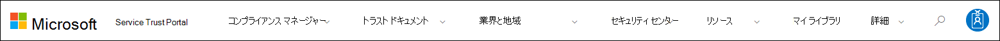

# Microsoft Service Trust Portal を使い始める

Microsoft Service Trust Portal は、Microsoft のセキュリティ、プライバシー、およびコンプライアンスのプラクティスについて、さまざまなコンテンツ、ツール、およびその他のリソースを提供します。

## サービス信頼ポータルへのアクセス

Service Trust Portal には、クラウドサービスおよびお客様のデータを保護する Microsoft の制御とプロセスの実装に関する詳細が含まれています。 サービス信頼ポータルの一部のリソースにアクセスするには、Microsoft クラウドサービスアカウント (Azure Active Directory 組織アカウントまたは Microsoft アカウント) を使用して認証済みユーザーとしてログインし、法令遵守のための Microsoft の機密保持契約書を確認して同意する必要があります。

### 既存のお客様

既存のお客様は、 <https://aka.ms/STP> 次のオンラインサブスクリプション (試用版または有料版) のいずれかでサービス信頼ポータルにアクセスできます。

- Microsoft 365
- Dynamics 365
- Azure

 > [!NOTE]
 > 組織に関連付けられている Azure Active Directory アカウントは、コンプライアンスマネージャーのようなあらゆるドキュメントや機能にアクセスできます。 個人使用のために作成された Microsoft アカウントは、サービス信頼ポータルコンテンツへのアクセスを制限します。

### Microsoft online services を評価する新しいお客様とお客様

新しいアカウントを作成するか、試用版アカウントを作成するには、次のサインアップフォームのいずれかを使用します (試用版アカウントにも使用されます)。

- 新しい[Microsoft 365 Apps for business 試用版アカウント](https://go.microsoft.com/fwlink/p/?LinkID=507653)または新しい[Office 365 Enterprise 試用版アカウント](https://go.microsoft.com/fwlink/p/?LinkID=698279)にサインアップする

- 新しい[Dynamics 365 試用版アカウント](https://go.microsoft.com/fwlink/?LinkId=252780)にサインアップする

- 新しい [Azure 試用版アカウント](https://go.microsoft.com/fwlink/?LinkId=722737)にサインアップします。

無料試用版またはサブスクリプションのいずれかにサインアップする場合は、Azure Active Directory を有効にして、STP へのアクセスをサポートする必要があります。

## Service Trust Portal の使用

サービス信頼ポータルの機能とコンテンツは、メインメニューからアクセスできます。

次のセクションでは、メインメニューの各項目について説明します。

### Service Trust Portal

**Service Trust Portal**リンクには、ホームページが表示されます。 これにより、ホームページにすばやく戻ることができます。

### コンプライアンス マネージャー

コンプライアンスマネージャーは、microsoft 365、Dynamics 365、Azure などの Microsoft クラウドサービスに関連する組織のコンプライアンスアクティビティを追跡、割り当て、検証するために役立つ、ワークフローベースのリスク評価ツールです。 コンプライアンスマネージャーを使用して、クラウドの共有責任モデルで法令遵守を管理します。 使用するコンプライアンスマネージャーのバージョンに応じて、詳細については次の記事を参照してください。

- [Microsoft コンプライアンスマネージャー (クラシック)](meet-data-protection-and-regulatory-reqs-using-microsoft-cloud.md)

- [Microsoft コンプライアンスマネージャー (プレビュー)](compliance-manager-overview.md)

### トラスト ドキュメント

さまざまなセキュリティの実装と設計情報を提供し、Microsoft Cloud services がデータを安全に保持する方法について理解することで、コンプライアンスの目標を簡単に達成できるようにすることを目標としています。 コンテンツを確認するには、[ **信頼ドキュメント** ] プルダウンメニューから次のいずれかのオプションを選択します。

- **監査レポート:** Microsoft のクラウドサービスに関する個別の監査および評価レポートの一覧が表示されます。 これらのレポートは、次のようなデータ保護標準および規制要件に対する Microsoft Cloud services のコンプライアンスに関する情報を提供します。

  - 国際標準化機構 (ISO)
  - Service Organization Controls (SOC)
  - アメリカ国立標準技術研究所 (NIST)
  - Federal Risk and Authorization Management Program (FedRAMP)
  - EU 一般データ保護規則 (GDPR)

- **データ保護:** 監査対象のコントロール、ホワイトペーパー、Faq、ペネトレーションテスト、リスク評価ツール、コンプライアンスガイドなど、豊富なリソースが含まれています。

- **Azure のセキュリティとコンプライアンスの青写真:** セキュリティで保護された、互換性のあるクラウドベースアプリケーションの構築に役立つリソース。 この領域には、政府機関、金融、医療、および小売業向けのブループリントガイダンスが含まれています。

### 業界と地域

Microsoft クラウドサービスに関する業界固有または地域固有のコンプライアンス情報を提供します。

- **業界:** 現時点では、このページには金融サービス業界向けの業界固有のランディングページが用意されています。 これには、コンプライアンスオファーリング、Faq、成功事例などの情報が含まれています。 今後、より多くの業種のリソースがリリースされる予定ですが、STP の「 **Trust Documents > Data Protection** 」ページにアクセスして、より多くの業種のリソースを見つけることができます。

- **地域:** Microsoft クラウドサービスコンプライアンスに関して、さまざまな国のさまざまな法律に関する法的な意見を提供します。 特定の国には、オーストラリア、カナダ、チェコ共和国、デンマーク、ドイツ、ポーランド、ルーマニア、スペイン、英国が含まれます。

### セキュリティ センター

Microsoft セキュリティ [センター](https://www.microsoft.com/trust-center)へのリンク。これにより、microsoft クラウドでのセキュリティ、コンプライアンス、およびプライバシーに関する詳細情報が提供されます。 これには、Microsoft クラウドサービスの機能に関する情報が含まれており、GDPR の特定の要件に対応するために使用できます。また、GDPR のアカウンタビリティに役立つドキュメント、および GDPR をサポートするために Microsoft が実施した技術および組織の方策について理解しています。

### マイ ライブラリ

この新機能を使用すると、ドキュメントを保存 (または *pin*) して、自分のライブラリページにすばやくアクセスできるようにすることができます。 また、個人用ライブラリのドキュメントが更新されたときに Microsoft が電子メールメッセージを送信するように通知を設定することもできます。 詳細については、この記事の「 [My Library](#my-library-1) 」セクションを参照してください。

### その他

グローバル管理者アカウントのみが使用できる管理機能にアクセスするには **> 管理** 者に移動します。 このオプションは、全体管理者としてサインインしている場合にのみ表示されます。 **管理者**プルダウンメニューには、次の2つのオプションがあります。

- **設定:** このページでは、コンプライアンスマネージャーに役割ベースのアクセス ( *ユーザーの役割*と呼ばれる) を割り当てることができます。  詳しくは、以下を参照してください。

  - [コンプライアンスマネージャーでのアクセス許可 (クラシック)](meet-data-protection-and-regulatory-reqs-using-microsoft-cloud.md#permissions-and-role-based-access-control)

  - [コンプライアンスマネージャーでのアクセス許可 (プレビュー)](compliance-manager-overview.md#permissions)

  また、コンプライアンスマネージャーのアクションが、セキュリティで保護されたスコアの同じアクションの状態に基づいて更新されるかどうかを構成することもできます。 この機能は、コンプライアンスマネージャーの最新バージョンを使用している場合にのみサポートされます。 詳細については、「 [自動セキュリティスコア更新プログラムの制御](working-with-compliance-manager.md#controlling-automatic-secure-score-updates)」を参照してください。

- **ユーザーのプライバシー設定:** このページでは、特定のユーザーのコンプライアンスマネージャーで、アクションアイテムの割り当てを含むレポートをエクスポートできます。 また、すべてのアクションアイテムを別のユーザーに再割り当てし、指定されたユーザーから割り当てられたアクションアイテムを削除することもできます。 詳細については、「 [ユーザーのプライバシー設定](meet-data-protection-and-regulatory-reqs-using-microsoft-cloud.md#user-privacy-settings)」を参照してください。

### 検索

[サービス信頼ポータル] ページの右上隅にある虫眼鏡をクリックして、ボックスを展開し、検索語句を入力 **して enter キーを**押します。 検索 **ページが** 表示されます。検索語が検索ボックスに表示され、下に表示されている検索結果が表示されます。

既定では、th 検索はドキュメントの結果を返します。 ドロップダウンリストを使用して、表示されているドキュメントの一覧を絞り込むことにより、結果をフィルター処理することができます。 複数のフィルターを使用して、ドキュメントの一覧を絞り込むことができます。 フィルターには、特定のクラウドサービス、コンプライアンスのカテゴリ、セキュリティプラクティス、地域、業界などが含まれます。 ドキュメント名のリンクをクリックして、ドキュメントをダウンロードします。

コンプライアンスマネージャーの評価からコントロールをリストするには、検索用語をクリックして、[ **コンプライアンスマネージャー**] をクリックします。 検索結果には、評価が作成された日付、評価グループの名前、適用可能な Microsoft クラウドサービス、およびそのコントロールが Microsoft であるか顧客が管理されているかが表示されます。 コントロールの名前をクリックして、コンプライアンスマネージャーの評価でコントロールを表示します。

> [!NOTE]
> Service Trust Portal のレポートとドキュメントは、発行後、または新しいバージョンのドキュメントが使用可能になるまで、少なくとも12か月間ダウンロードできます。

## マイ ライブラリ

My Library 機能を使用して、サービス信頼ポータルのドキュメントとリソースを [My Library] ページに追加します。 これにより、関連するドキュメントを1か所でアクセスできるようになります。  自分のライブラリにドキュメントを追加するには、ドキュメントの右側にある [.. **.** ] メニューをクリックし、[ **ライブラリに保存**] を選択します。 1つまたは複数のドキュメントの横にあるチェックボックスをクリックし、ページの上部にある [ **ライブラリに保存** ] をクリックすることによって、複数のドキュメントを My Library に追加することができます。

また、通知機能を使用すると、個人用ライブラリに追加したドキュメントが Microsoft によって更新されたときに電子メールメッセージが送信されるように、個人用ライブラリを構成することができます。 通知を設定するには、[マイライブラリ] に移動して [ **通知設定**] をクリックします。 通知の頻度を選択し、組織内で通知の送信先となる電子メールアドレスを指定することができます。 電子メール通知には、更新されたドキュメントへのリンクと、更新プログラムの簡単な説明が含まれます。

また、通知を有効にするかどうかに関係なく、過去30日間以内に更新された My ライブラリ内のドキュメントを識別することにも注意してください。 更新プログラムの簡単な説明もツールヒントに表示されます。

## スターターパック

Starter pack は、特定の業界向けの Microsoft クラウドサービスに関するドキュメントの合わせセットです。 現在、Service Trust Portal は、金融サービス組織に対して次の3つのスターターパックを提供しています。 これらのスターターパックを使用すると、組織は Microsoft クラウドのセキュリティ、コンプライアンス、およびプライバシーを評価および評価し、高度な規制のある金融サービス業界に Microsoft Cloud services を実装するのに役立つガイダンスを提供します。

- **評価版のスターターパック:** 金融サービス組織のための Microsoft クラウドの初期評価に使用します。

- **評価スターターパック:** 評価の後、このスターターパックのチェックリストとその他のガイダンスを使用して、組織でセキュリティ、コンプライアンス、およびプライバシーに関連するリスクを評価できるようにします。

- **Audit スターターパック:** ユーザーこのスターターパックでは、監査コントロールとその他のツールを使用して、組織のリスクを軽減するように Microsoft クラウドサービスの実装を支援するためのガイダンスを提供します。

これらのスターターパックにアクセスするには、 **Service Trust Portal > の業種 & 地域の > 業界ソリューション > 金融サービス**に移動します。 スターターパックからドキュメントを開いたり、ダウンロードしたり、自分のライブラリに保存したりすることができます。

## ローカライズのサポート

Service Trust Portal では、ページコンテンツを異なる言語で表示できます。 ページの言語を変更するには、ページの左下隅にある地球のアイコンをクリックして、任意の言語を選択します。

## フィードバックを送信

サービス信頼ポータル、またはポータルの使用時に発生するエラーについてのご質問にお答えすることができます。 また、STP ページの下部にある [フィードバック] リンクを使用して、サービス信頼ポータルコンプライアンスレポートに関する質問やフィードバックをお寄せいただくこともできます。

お客様からのフィードバックを重視しています。 ページの下部にある [フィードバック] ボタンをクリックして、お客様や製品の機能を向上させるためのご意見やご提案をお寄せください。

