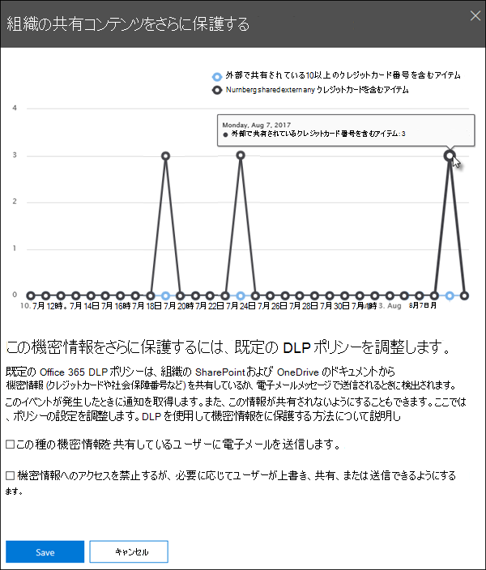

# 既定の DLP ポリシーの使用を開始する

最初のMicrosoft Purview データ損失防止 (DLP) ポリシーを作成する前に、DLP は既定のポリシーを使用して機密情報を保護するのに役立ちます。 この既定のポリシーとその推奨事項 (以下に示します) は、クレジット カード番号を含む電子メールやドキュメントが組織外のユーザーと共有されたときに通知することで、機密コンテンツを安全に保つのに役立ちます。 この推奨事項は、Microsoft Purview コンプライアンス ポータルの **ホーム** ページに表示されます。 
  
このウィジェットを使用すると、共有された機密情報のタイミングと量をすばやく表示し、クリックまたは 2 回のクリックだけで既定の DLP ポリシーを絞り込むことができます。 また、既定の DLP ポリシーは完全にカスタマイズ可能であるため、いつでも編集できます。 最初に推奨事項が表示されない場合は、推奨 **されるセクションの** 下部にある **[+その他**] をクリックしてみてください。 
  

  
## レポートを表示し、既定の DLP ポリシーを調整する

ウィジェットで、ユーザーが組織外のユーザーと機密情報を共有していることを示す場合は、下部にある **[DLP ポリシーの絞り込み** ] を選択します。 
  
詳細レポートには、過去 30 日間にクレジット カード番号を含むコンテンツが共有された日時と量が表示されます。 ルールの一致は、ウィジェットに表示されるまでに最大で 48 時間かかる場合があることに注意してください。
  
機密情報を保護するために、既定の DLP ポリシーは次のとおりです。
  
- 少なくとも 1 つのクレジット カード番号を含む Exchange、SharePoint、OneDrive 内のコンテンツが組織外のユーザーと共有されるタイミングを検出します。
    
- ポリシー ヒントを表示し、組織外のユーザーとこの機密情報を共有しようとしたときに、ユーザーに電子メール通知を送信します。 これらのオプションの詳細については、「 [電子メール通知を送信し、DLP ポリシーのポリシーヒントを表示する」を](use-notifications-and-policy-tips.md)参照してください。
    
- 詳細なアクティビティ レポートを生成して、組織外のユーザーとコンテンツを共有したユーザーや、コンテンツをいつ共有したかなどを追跡できるようにします。 [DLP レポート](view-the-dlp-reports.md)と [監査ログ データ](search-the-audit-log-in-security-and-compliance.md) (**アクティビティ** = **DLP**) を使用して、この情報を表示できます。
    
既定の DLP ポリシーをすばやく絞り込むには、次の方法を選択できます。
  
- ユーザーがこの機密情報を組織外のユーザーと共有するときに、インシデント レポートの電子メールを送信します。
    
- 電子メール インシデント レポートに他のユーザーを追加します。
    
- 機密情報を含むコンテンツへのアクセスをブロックしますが、必要に応じてユーザーがオーバーライドして共有または送信できるようにします。
    
インシデント レポートまたはアクセスの制限の詳細については、「 [データ損失防止リファレンス」を参照してください](data-loss-prevention-policies.md)。
  
これらのオプションを後で変更する場合は、いつでも既定の DLP ポリシーを編集できます。次のセクションを参照してください。
  

  
## 既定の DLP ポリシーを編集する

このポリシーは **既定の DLP ポリシー** という名前で、Microsoft Purview コンプライアンス ポータルの **[ポリシー**] ページの [**データ損失防止**] に表示されます。 
  
このポリシーは完全にカスタマイズ可能であり、最初から自分で作成する DLP ポリシーと同じです。 ポリシーをオフまたは削除して、ユーザーがポリシーのヒントや電子メール通知を受信しないようにすることもできます。
  

  
## ウィジェットが表示される場合と表示されない場合

[**共有コンテンツをさらに保護** する] という名前のウィジェットが、Microsoft Purview コンプライアンス ポータルの **ホーム** ページの **[推奨される** コンテンツ] セクションに表示されます。 
  
このウィジェットは、次の場合にのみ表示されます。
  
- Microsoft Purview コンプライアンス ポータルまたは Exchange 管理センターには、データ損失防止ポリシーはありません。 このウィジェットは DLP の使用を開始するのに役立つため、DLP ポリシーが既にある場合は表示されません。
    
- 過去 30 日間に、少なくとも 1 つのクレジット カードを含むコンテンツが組織外のユーザーと共有されました。
    
ルールの一致はウィジェットで使用できるようになるまでに最大 48 時間かかる可能性があるため、外部で共有される機密情報が検出された後、推奨事項が表示されるまでに最大 2 日かかる場合があることに注意してください。
  
最後に、ウィジェットを使用して既定の DLP ポリシーを調整すると、ウィジェットは **ホーム** ページから消えます。 
  

