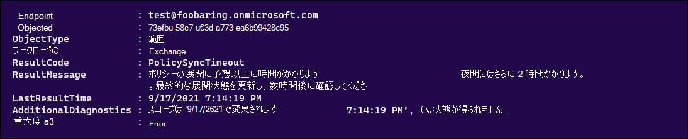

# <a name="troubleshoot-ediscovery-hold-errors"></a>電子情報開示の保持エラーのトラブルシューティング

この記事では、電子情報開示ホールドで発生する可能性のある一般的な問題と、それらを解決する方法について説明します。 この記事には、これらの問題を軽減または回避するための推奨プラクティスも含まれています。

## <a name="recommended-practices"></a>推奨プラクティス

電子情報開示ホールドに関連するエラーの数を減らすには、次の方法をお勧めします。

- 保留配布がまだ保留中の場合は、保留配布が完了するまで待機してから、それ以上の更新 `On (Pending)` `Off (Pending)` を行います。

- 保留ポリシーが保留中であるかどうかを確認してから、保留ポリシーを更新します。 次のコマンドを実行するか、PowerShell スクリプトに保存します。

    ```powershell
    $status = Get-CaseHoldPolicy -Identity <policyname> -DistributionDetail
    if($status.DistributionStatus -ne "Pending"){
        # policy no longer pending
        Set-CaseHoldPolicy -Identity <policyname> -AddExchangeLocation $user1
    }else{
        # policy still pending
        Write-Host "Hold policy still pending."
    }
   ```

- トランザクションごとに保持ポリシーを繰り返し更新するのではなく、1 つの一括要求で更新プログラムを電子情報開示保留にマージします。 [たとえば、Set-CaseHoldPolicy](/powershell/module/exchange/set-caseholdpolicy)コマンドレットを使用して既存の保持ポリシーに複数のユーザー メールボックスを追加するには、コマンドを実行 (またはスクリプトにコード ブロックとして追加) して、複数のユーザーを追加するために 1 回だけ実行します。

  **正しい例**

    ```powershell
    Set-CaseHoldPolicy -Identity "policyname" -AddExchangeLocation "User1", "User2", "User3", "User4", "User5"
    ```

   **正しくない例**

    ```powershell
    $users = "User1", "User2", "User3", "User4", "User5"
    ForEach($user in $users)
    {
        Set-CaseHoldPolicy -Identity "policyname" -AddExchangeLocation $user
    }
    ```

   前の不適切な例では、コマンドレットを 5 回実行してタスクを完了します。 ユーザーを保留ポリシーに追加するための推奨プラクティスの詳細については、「詳細」 [セクションを参照](#more-information) してください。

- 電子情報開示ホールドの問題について Microsoft サポートに問い合わせする前に、ResultCode に基づいて DistributionResults にチェックインして、ポリシーが失敗する原因を確認してください。

   ```powershell
   Get-CaseHoldPolicy -Identity "policyname" -DistributionDetail | Select -ExpandProperty DistributionResults
   ```

   

## <a name="error-policysynctimeout"></a>エラー: PolicySyncTimeout

**ResultCode: PolicySyncTimeout** と次のエラー メッセージにこのエラーが表示される場合は、LastResultTime を確認して、同期がタイムアウトに達してから 2 時間以上経過した場合に確認してください。

> ポリシーの展開に予想以上に時間がかかります。 最終的な展開状態を更新するにはさらに 2 時間かかる場合があります。数時間後に確認してください。

### <a name="resolution"></a>解決方法

**Set-CaseHoldPolicy -Identity "policyname" -RetryDistribution** を実行すると、問題が解決します。

   ```powershell
   Set-CaseHoldPolicy "policyname" -RetryDistribution
   ```

また、[再試行] をクリックしてMicrosoft 365 コンプライアンス センターポリシーを再展開 **することもできます**。

![CaseHold の [再試行] ボタン](../media/RetryCaseHold.png)

## <a name="error-policynotifyerror"></a>エラー: PolicyNotifyError

**ResultCode: PolicyNotifyError** でこのエラーが表示され、次のエラー メッセージが表示された場合、データセンターの問題によってポリシーの同期が中断されます。

> データセンターの一時的な問題により、ポリシーをコンテンツ ソースOffice 365できません。 現在のポリシーはソース内のコンテンツには適用されないので、ブロックされた展開による影響はありません。 この問題を解決するには、ポリシーを再展開してみてください。

### <a name="resolution"></a>解決方法

**Set-CaseHoldPolicy -Identity "policyname" -RetryDistribution** を実行すると、問題が解決します。

   ```powershell
   Set-CaseHoldPolicy "policyname" -RetryDistribution
   ```

また、[再試行] をクリックしてMicrosoft 365 コンプライアンス センターポリシーを再展開 **することもできます**。

![CaseHold の [再試行] ボタン](../media/RetryCaseHold.png)

## <a name="error-internalerror"></a>エラー: InternalError

**ResultCode: InternalError** と次のエラー メッセージにこのエラーが表示される場合は、Microsoft によってこの問題を解決する必要があります。

> ポリシーの展開は、予期しないデータ センターの問題Office 365中断されています。 展開の問題を解決するには、Microsoft サポートにお問い合わせください。

### <a name="resolution"></a>解決方法

次の情報を Microsoft サポートにお問い合わせください。

- ポリシー名
- Microsoft 365 サービスまたは機能
- 結果コード
- 結果メッセージ
- その他の診断

## <a name="error-failedtoopencontainer"></a>エラー: FailedToOpenContainer

保管担当者とデータ ソースを保留にするときに **ResultCode: FailedToOpenContainer** と次のエラー メッセージにこのエラーが表示される場合は、解決手順を使用して問題のトラブルシューティングを行います。

> メールボックスまたはサイトSharePoint存在しない可能性があります。  これが正しくない場合は、Microsoft サポートにお問い合わせください。  それ以外の場合は、このポリシーから削除してください。

### <a name="resolution"></a>解決方法

- PowerShell[で Get-Mailbox](/powershell/module/exchange/get-mailbox)をExchange Online、ユーザー メールボックスが組織内に存在するかどうかを確認します。

- オンライン[PowerShell で Get-SPOSite](/powershell/module/sharepoint-online/get-sposite)コマンドレットをSharePoint組織にサイトが存在するかどうかを確認します。

- サイトの URL が変更された場合に確認します。

- オブジェクトが存在しない場合は、ポリシーからメールボックスまたはサイトを削除します。

## <a name="error-siteinreadonlyornotaccessible"></a>エラー: SiteInReadonlyOrNotAccessible

**ResultCode: SiteInReadonlyOrNotAccessible** でこのエラーが表示され、次のエラー メッセージが表示された場合、SharePoint サイトは読み取り専用モードになります。

> サイトSharePoint読み取り専用またはアクセスできない。 サイトを書き込み可能にし、このポリシーを再展開するには、サイト管理者に問い合わせてください。

### <a name="resolution"></a>解決方法

この問題を解決するには、サイトのロックを解除します (または管理者にロック解除を求める)。 サイトのロック状態を変更する方法の詳細については、「サイトのロックとロック解除 [」を参照してください](/sharepoint/manage-lock-status)。

## <a name="error-siteoutofquota"></a>エラー: SiteOutOfQuota

**ResultCode: SiteOutOfQuota** と次のエラー メッセージにこのエラーが表示された場合は、SharePointがストレージ クォータに達しました。

> サイトSharePointクォータが十分ではありません。 サイト コレクションにさらにクォータを割り当て、このポリシーを再展開してください。

### <a name="resolution"></a>解決方法

サイトにストレージを追加する (または管理者にストレージの追加を求める) をサイト コレクションに追加します。 サイトの記憶域クォータを管理する方法の詳細については、「Manage site collection storage [limits」を参照してください](/sharepoint/manage-site-collection-storage-limits)。

より多くの記憶域クォータがサイトに追加された後、ポリシーを再展開する必要があります。

   ```powershell
   Set-CaseHoldPolicy "policyname" -RetryDistribution
   ```

また、[再試行] をクリックしてMicrosoft 365 コンプライアンス センターポリシーを再展開 **することもできます**。

![CaseHold の [再試行] ボタン](../media/RetryCaseHold.png)

## <a name="error-recipienttypenotallowed"></a>エラー: RecipientTypeNotAllowed

**ResultCode: RecipientTypeNotAllowed** と次のエラー メッセージにこのエラーが表示された場合、メールボックスである Exchange 場所がポリシーに割り当てられます。

> 受信者の種類は保留に対して許可されません。

### <a name="resolution"></a>解決方法

PowerShell[で Get-Recipient](/powershell/module/exchange/get-recipient)をExchange Onlineして、エンドポイント内のアドレスが有効なメールボックスか確認します。

上記のコマンドレットで SMTP アドレスが有効なメールボックスでない場合は、ポリシーから削除します。

```powershell
Set-CaseHoldPolicy "policyname" -RemoveExchangeLocation "non-mailbox user"
```

## <a name="more-information"></a>詳細

「推奨されるプラクティス」セクションの複数のユーザーの保留ポリシーの更新に関するガイダンスは、システムが保留ポリシーへの同時更新をブロックしているという事実から生じます。 つまり、更新された保留ポリシーが新しいコンテンツの場所に適用され、保留ポリシーが保留中の状態である場合、追加のコンテンツの場所を保留ポリシーに追加できない。 この問題の軽減に役立ついくつかの注意が必要な情報を次に示します。
  
- 更新された保留が更新されるたび、保留状態に直ちに入ります。 保留中の状態は、保留がコンテンツの場所に適用されている状態を意味します。
  
- ループを実行し、ポリシーに場所を 1 つ 1 つ追加するスクリプトがある場合 (「推奨されるプラクティス」セクションに示されている不適切な例と同様)、最初のコンテンツの場所 (ユーザー メールボックスなど) が、保留中の状態をトリガーする同期プロセスを開始します。 つまり、後続のループでポリシーに追加された他のユーザーはエラーになります。
  
- 組織がループを実行して保留ポリシーのコンテンツの場所を更新するスクリプトを使用している場合は、スクリプトを更新して、単一の一括操作で場所を更新する必要があります (「推奨されるプラクティス」セクションの正しい例に示すように)。
