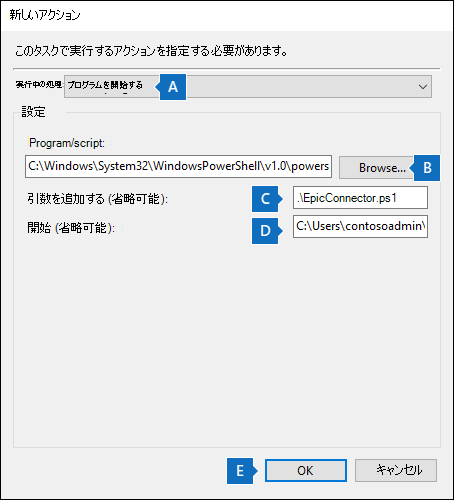
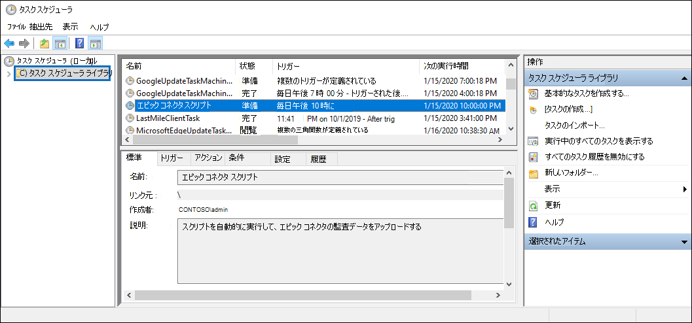

# <a name="set-up-a-connector-to-import-epic-ehr-audit-data-preview"></a>Epic EHR 監査データをインポートするコネクタをセットアップする (プレビュー)

組織のEHR (EHR) システムで、Microsoft 365 コンプライアンス センターデータ コネクタをセットアップして、ユーザー アクティビティの監査レコードをインポートできます。 エピック EHR システムからの監査レコードには、患者の健康記録へのアクセスに関連するイベントのレコードが含まれます。 エピック EHR 監査レコードは、Microsoft 365インサイダー[](insider-risk-management.md)リスク管理ソリューションで使用して、患者情報への不正アクセスから組織を保護できます。

Epic コネクタのセットアップは、次のタスクで構成されます。

- エピック EHR 監査レコードAzure Active Directoryタブ区切りテキスト ファイルを受け入れる API エンドポイントにアクセスするためのアプリを作成する (Azure AD) 。

- コネクタ スキーマで定義されている必要なすべてのフィールドを含むテキスト ファイルを作成します。

- アプリケーションで Epic コネクタ インスタンスを作成Microsoft 365 コンプライアンス センター。

- スクリプトを実行して、Epic EHR 監査レコードを API エンドポイントにプッシュします。

- 必要に応じて、監査レコードをインポートするためにスクリプトを自動的に実行するスケジュールを設定します。

## <a name="before-you-set-up-the-connector"></a>コネクタをセットアップする前に

- 手順 3 で Epic コネクタを作成するユーザーには、ユーザーにメールボックスインポートエクスポートの役割が割りExchange Online。 既定では、この役割は Exchange Online のどの役割グループにも割り当てられていません。 [メールボックスのインポートエクスポート] 役割は、組織の [組織の管理] 役割グループに追加Exchange Online。 または、新しい役割グループを作成し、メールボックスインポートエクスポートの役割を割り当て、適切なユーザーをメンバーとして追加できます。 詳細については、「グループ内の[役割グループを](\Exchange\permissions-exo\role-groups#create-role-groups)管理[](\Exchange\permissions-exo\role-groups#modify-role-groups)する」の「役割グループの作成」または「役割グループの変更」セクションを参照Exchange Online。

- 組織の Epic EHR システムから (日単位で) データを取得またはエクスポートする方法を決定し、手順 2 で説明するテキスト ファイルを作成する必要があります。 手順 4 で実行するスクリプトは、テキスト ファイル内のデータを API エンドポイントにプッシュします。

- 手順 4 で実行するサンプル スクリプトは、エピック EHR 監査レコードをテキスト ファイルからコネクタ API にプッシュして、インサイダー リスク管理ソリューションで使用できます。 このサンプル スクリプトは、Microsoft 標準サポート プログラムまたはサービスではサポートされていません。 サンプル スクリプトは現状のまま提供され、いかなる保証も伴いません。 さらに、Microsoft は、商品性、特定目的への適合性の黙示の保証を含む、一切の黙示の保証をいたしかねます。 本サンプル スクリプトおよびドキュメントの使用または性能に起因するすべてのリスクは、お客様が負うものとします。 サンプル スクリプトおよびドキュメントを使用したこと、または使用できなかったことに伴って生じるいかなる損害 (業務利益の損失、業務の中断、業務情報の損失、金銭上の損失、その他一切の損害) についても、Microsoft、Microsoft に帰属する作者、スクリプトの作成、製造、または納入に関与したその他のすべての人員は、いかなる場合も責めを負わないものとします。

## <a name="step-1-create-an-app-in-azure-active-directory"></a>手順 1: アプリをアプリで作成Azure Active Directory

最初の手順は、新しいアプリを作成し、アプリに登録Azure Active Directory (Azure AD)。 アプリは、手順 3 で作成した Epic コネクタに対応します。 このアプリを作成するとAzure AD EHR 監査レコードを含むテキスト ファイルのプッシュ要求を認証できます。 このアプリの作成中Azure AD情報を保存してください。 これらの値は、後の手順で使用されます。

- Azure AD ID (アプリ ID またはクライアント *ID* とも *呼* ばれる)

- Azure AD シークレット (クライアント シークレットとも *呼ばれる*)

- テナント ID (ディレクトリ *ID とも呼ばれる*)

アプリを作成する手順については、「アプリケーションをアプリに登録する」をAzure ADを参照[Microsoft ID プラットフォーム。](\azure\active-directory\develop\quickstart-register-app)

## <a name="step-2-prepare-a-text-file-with-epic-ehr-audit-records"></a>手順 2: エピック EHR 監査レコードを使用してテキスト ファイルを準備する

次の手順では、組織の Epic EHR システムで従業員が患者の健康記録にアクセスする情報を含むテキスト ファイルを作成します。 前に説明したように、このテキスト ファイルを Epic EHR システムから生成する方法を決定する必要があります。 Epic コネクタ ワークフローでは、タブ区切りの値を持つテキスト ファイルが必要で、テキスト ファイル内のデータを必須のコネクタ スキーマにマップする必要があります。 サポートされるファイル形式は、パイプまたはタブで区切られたファイル.txtです。

> [!NOTE]
> 監査データを含むテキスト ファイルの最大サイズは 3 GB です。 行の最大数は 500 万行です。 また、必ず、医療 EHR システムからの関連する監査データのみを含める必要があります。

次の表に、インサイダー リスク管理シナリオを有効にするために必要なフィールドを示します。 これらのフィールドのサブセットは必須です。 これらのフィールドはアスタリスク (*)で強調表示されます。 テキスト ファイルに必須フィールドが存在しない場合、ファイルは検証されません。ファイル内のデータはインポートされません。

|Field|カテゴリ|
|:----|:----------|
| ACCESS_LOG。*<br/> ACCESS_TIME ACCESS_LOG_METRIC。METRIC_NAME*<br/>ACCESS_LOG。WORKSTATION_ID<br/>ZC \_ METRIC \_ GROUP.NAME<br/>ZC \_ ACCESS \_ ACTION.NAME |これらのフィールドは、Epic EHR システムのアクセス アクティビティ イベントを識別するために使用されます。|
| PATIENT。PAT_MRN_ID<br/>PATIENT。PAT_FIRST_NAME* <br/>PATIENT。PAT_MIDDLE_NAME <br/>PATIENT。PAT_LAST_NAME* <br/>PATIENT。ADD_LINE_1* <br/>PATIENT。ADD_LINE_2  <br/>PATIENT。CITY* <br/>PATIENT.ZIP*  <br/>ZC_STATE.NAME <br/>ZC_COUNTRY.NAME <br/>CLARITY_DEP。DEPARTMENT_NAME              | これらのフィールドは、患者プロファイル情報を識別するために使用されます。|
| ZC_BTG_REASON.NAME*<br/> PAT_BTG_AUDIT。BTG_EXPLANATION | これらのフィールドは、制限付きレコードへのアクセスを識別するために使用されます。|
| EMP。SYSTEM_LOGIN*<br/>CLARITY_EMP。USER_ID <br/> employee_last_name<sup>1</sup> <br/> employee_first_name<sup>1</sup>                | これらのフィールドは、家族/近隣/従業員レコードへのアクセスを決定するために必要な住所と名前の照合に関する従業員プロファイル情報を識別するために使用されます。 |
|||

> [!NOTE]
> 関連するログ 指標のみを Epic からエクスポートする必要があります。 
> <sup>1</sup>このフィールドは、既定では[エピック]では使用できません。 テキスト ファイルにこのフィールドが含まれているか確認するには、エクスポートを構成する必要があります。

## <a name="step-3-create-the-epic-connector"></a>手順 3: Epic コネクタを作成する

次の手順では、アプリ内に Epic コネクタをMicrosoft 365 コンプライアンス センター。 手順 4 でスクリプトを実行すると、手順 2 で作成したテキスト ファイルが処理され、手順 1 でセットアップした API エンドポイントにプッシュされます。 この手順では、コネクタの作成時に生成される JobId を必ずコピーします。 スクリプトの実行時に JobId を使用します。

1. に移動 <https://compliance.microsoft.com> し、左側の **ナビゲーションで [** データ コネクタ] をクリックします。

2. [データ コネクタ **] ページの [Epic** コネクタ] **で、[表示**] を **クリックします**。

3. [Epic コネクタ **] ページで、[** コネクタの追加 **] をクリックします**。

4. [接続の **セットアップ] ページで** 、次の操作を行い、[次へ] を **クリックします**。

    1. 手順 2 でAzure ADした Azure アプリのアプリケーション ID を入力または貼り付けます。

    2. Epic コネクタの名前を入力します。

5. [確認 **] ページで** 設定を確認し、[完了] を **クリックして** コネクタを作成します。

   コネクタが作成されたのを確認する状態ページが表示されます。 このページには、次の手順を実行して、Epic EHR 監査レコード データをアップロードするサンプル スクリプトを実行するために必要な 2 つの重要な点が含まれます。

    ジョブ ID を含むページを確認し、サンプル スクリプトの github へのリンク

    1. **ジョブ ID。** 次の手順でスクリプトを実行するには、このジョブ ID が必要です。 このページまたはコネクタ のフライアウト ページからコピーできます。

    2. **参照スキーマ。** スキーマを参照して、コネクタで受け入れられるエピック システムのフィールドを把握します。 これにより、必要なすべての Epic データベース フィールドを含むファイルを作成できます。

    3. **サンプル スクリプトへのリンク。** サンプル スクリプト **にアクセス** するには、GitHubリンクをクリックします (リンクによって新しいウィンドウが開きます)。 手順 4 でスクリプトをコピーできるよう、このウィンドウを開いた状態にしてください。 または、スクリプトの実行時にもう一度アクセスできるよう、コピー先をブックマークするか、URL をコピーすることもできます。 このリンクは、コネクタ のフライアウト ページでも使用できます。

6. **[完了]** をクリックします。

   新しいコネクタが [コネクタ] タブの一覧 **に表示** されます。

7. 作成した Epic コネクタをクリックして、コネクタに関するプロパティや他の情報を含むフライアウト ページを表示します。

まだ実行していない場合は **、Azure App ID** と Connector ジョブ ID の値 **をコピーできます**。 次の手順でスクリプトを実行するには、これらを実行する必要があります。 スクリプトは、フライアウト ページからダウンロードすることもできます (または、次の手順のリンクを使用してダウンロードすることもできます)。

[編集] を **クリック** して、Azure App ID または [ファイル マッピング] ページで定義した列ヘッダー名 **を変更** することもできます。

## <a name="step-4-run-the-sample-script-to-upload-your-epic-ehr-audit-records"></a>手順 4: サンプル スクリプトを実行して、Epic EHR 監査レコードをアップロードする

Epic コネクタをセットアップする最後の手順は、テキスト ファイル (手順 1 で作成した) の Epic EHR 監査レコード データを Microsoft クラウドにアップロードするサンプル スクリプトを実行することです。 具体的には、スクリプトはデータを Epic コネクタにアップロードします。 スクリプトを実行した後、手順 3 で作成した Epic コネクタは、Epic EHR 監査レコード データを Microsoft 365 組織にインポートし、Insider リスク管理ソリューションなどの他のコンプライアンス ツールからアクセスできます。 スクリプトを実行した後、タスクをスケジュールして毎日自動的に実行し、最新の従業員終了データが Microsoft クラウドにアップロードされるのを検討してください。 [「(省略可能)手順 6: スクリプトを自動的に実行するスケジュールを設定する」を参照してください](#optional-step-6-schedule-the-script-to-run-automatically)。

> [!NOTE]
> 前に述べたように、監査データを含むテキスト ファイルの最大サイズは 3 GB です。 行の最大数は 500 万行です。 この手順で実行するスクリプトは、大きなテキスト ファイルから監査データをインポートするために約 30 ~ 40 分かかります。 さらに、スクリプトは大きなテキスト ファイルを 100K 行の小さなブロックに分割し、それらのブロックを順番にインポートします。

1. 前の手順で開いたウィンドウに移動し、サンプル スクリプトを使用してGitHubサイトにアクセスします。 または、ブックマークされたサイトを開くか、コピーした URL を使用します。 ここでスクリプトにアクセス [することもできます](https://github.com/microsoft/m365-compliance-connector-sample-scripts/blob/main/sample_script.ps1)。

2. [Raw] **ボタンを** クリックして、スクリプトをテキスト ビューに表示します。

3. サンプル スクリプト内のすべての行をコピーし、テキスト ファイルに保存します。

4. 必要に応じて、組織のサンプル スクリプトを変更します。

5. ファイル名のサフィックスを使用Windows PowerShellスクリプト ファイルとしてテキスト ファイルを保存します `.ps1` 。たとえば、 `EpicConnector.ps1` 。

6. ローカル コンピューターでコマンド プロンプトを開き、スクリプトを保存したディレクトリに移動します。

7. 次のコマンドを実行して、テキスト ファイル内の Epic 監査データを Microsoft クラウドにアップロードします。例えば：

   ```powershell
   .\EpicConnector.ps1 -tenantId <tenantId> -appId <appId>  -appSecret <appSecret>  -jobId <jobId>  -filePath '<filePath>'
   ```

次の表では、このスクリプトで使用するパラメーターとその必要な値について説明します。 前の手順で取得した情報は、これらのパラメーターの値で使用されます。

|パラメーター  |説明|
|:----------|:----------|
|tenantId|これは、手順 1 で取得Microsoft 365組織の ID です。 組織のテナント ID は、管理センターの[概要] ブレードAzure ADすることもできます。 これは、組織を識別するために使用されます。|
|appId|これは、手順 1 Azure ADで作成したアプリのAzure AD ID です。 これは、スクリプトが組織Azure ADアクセスしようとするときに、認証に使用Microsoft 365されます。|
|appSecret|これは、手順 1 Azure ADで作成したアプリのアプリケーション Azure ADシークレットです。 これは、認証にも使用されます。|
|jobId|これは、手順 3 で作成した Epic コネクタのジョブ ID です。 これは、Microsoft クラウドにアップロードされた Epic EHR 監査レコードを Epic コネクタに関連付ける場合に使用します。|
|filePath|これは、手順 2 で作成したテキスト ファイル (スクリプトと同じシステムに格納されている) のファイル パスです。 ファイル パス内のスペースを避けるようにします。それ以外の場合は、単一引用符を使用します。|
|||

各パラメーターの実際の値を使用する、Epic コネクタ スクリプトの構文の例を次に示します。

```powershell
.\EpicConnector.ps1 -tenantId d5723623-11cf-4e2e-b5a5-01d1506273g9 -appId 29ee526e-f9a7-4e98-a682-67f41bfd643e -appSecret MNubVGbcQDkGCnn -jobId b8be4a7d-e338-43eb-a69e-c513cd458eba -filePath 'C:\Users\contosoadmin\Desktop\Data\epic_audit_records.txt'
```

アップロードが成功した場合、スクリプトは成功したメッセージアップロード **表示** します。

> [!NOTE]
> 実行ポリシーのために前のコマンドを実行する際に問題がある場合は、「実行[](\powershell\module\microsoft.powershell.core\about\about_execution_policies)ポリシーについて」および[「Set-ExecutionPolicy」](\powershell\module\microsoft.powershell.security\set-executionpolicy)を参照して、実行ポリシーの設定に関するガイダンスを参照してください。

## <a name="step-5-monitor-the-epic-connector"></a>手順 5: Epic コネクタを監視する

Epic コネクタを作成し、EHR 監査レコードをプッシュした後、コネクタを表示し、そのコネクタの状態をアップロードMicrosoft 365 コンプライアンス センター。 スクリプトを定期的に自動的に実行するスケジュールを設定した場合は、前回スクリプトを実行した後に現在の状態を表示することもできます。

1. 左側の <https://compliance.microsoft.com> ナビゲーションで [ **データ コネクタ] に** 移動してクリックします。

2. [コネクタ **] タブをクリック** し、エピック コネクタを選択して、フライアウト ページを表示します。 このページには、コネクタに関するプロパティと情報が含まれる。

3. [ **最後のインポート]** で、[ログのダウンロード] リンク **を** クリックして、コネクタの状態ログを開く (または保存) します。 このログには、スクリプトが実行され、テキスト ファイルから Microsoft クラウドにデータをアップロードする度に関する情報が含まれます。

    Epic コネクタ ログ ファイルには、アップロードされたテキスト ファイルの行数が表示されます。

    フィールド `RecordsSaved` は、アップロードされたテキスト ファイル内の行数を示します。 たとえば、テキスト ファイルに 4 行が含まれている場合、スクリプトがテキスト ファイル内のすべての行を正常にアップロードした場合、フィールドの値は `RecordsSaved` 4 になります。

手順 4 でスクリプトを実行していない場合、スクリプトをダウンロードするリンクが [最後のインポート] の下 **に表示されます**。 スクリプトをダウンロードし、手順に従ってスクリプトを実行できます。

## <a name="optional-step-6-schedule-the-script-to-run-automatically"></a>(省略可能)手順 6: スクリプトを自動的に実行するスケジュールを設定する

Epic EHR システムの最新の監査レコードをインサイダー リスク管理ソリューションのようなツールで利用するには、スクリプトを毎日自動的に実行するスケジュールを設定することをお勧めします。 また、同じテキスト ファイル内のエピック監査レコード データを同様の (同じではないにした場合) スケジュールに更新して、従業員による患者レコード アクセス アクティビティに関する最新情報が含まれる必要があります。 目標は、最新の監査レコードをアップロードして、エピック コネクタがインサイダー リスク管理ソリューションで使用できるようです。 

タスク スケジューラ アプリを使用すると、Windowsスクリプトを自動的に実行できます。

1. ローカル コンピューターで、[スタート] ボタンをクリックWindows **タスク** スケジューラと **入力します**。

2. タスク スケジューラ **アプリをクリック** して開きます。

3. [アクション] **セクションで** 、[タスクの作成] **をクリックします**。

4. [全般 **] タブ** で、スケジュールされたタスクのわかりやすい名前を入力します。たとえば **、Epic コネクタ スクリプト**. オプションの説明を追加できます。

5. [ **セキュリティ オプション] で**、次の操作を行います。

    1. コンピューターにログオンしている場合にのみスクリプトを実行するか、ログオンしていないときに実行するかどうかを決定します。

    2. [最高の権限で **実行する] チェック ボックスが** オンになっていることを確認します。

6. [トリガー] **タブを選択** し、[ **新規**] をクリックし、次の操作を行います。

    1. **[設定]** で [**日** 次] オプションを選択し、スクリプトを初めて実行する日時を選択します。 スクリプトは、毎日同じ指定された時刻に実行されます。

    2. [ **詳細設定] で**、[有効] **チェック ボックスが** オンになっていることを確認します。

    3. [**OK**] をクリックします。

7. [操作] **タブを** 選択し、[ **新規**] をクリックし、次の操作を行います。

   

    1. [アクション **] ドロップダウン** リストで、[プログラムの開始 **] が選択されている** 必要があります。

    2. [プログラム **/スクリプト] ボックス** で、[参照] をクリックし、次の場所に移動して選択して、パスがボックスに表示C:.0.exe。

    3. [引数 **の追加 (オプション)]** ボックスに、手順 4 で実行したのと同じスクリプト コマンドを貼り付けます。 たとえば、`.\EpicConnector.ps1 -tenantId "d5723623-11cf-4e2e-b5a5-01d1506273g9" -appId "c12823b7-b55a-4989-faba-02de41bb97c3" -appSecret "MNubVGbcQDkGCnn" -jobId "e081f4f4-3831-48d6-7bb3-fcfab1581458" -filePath "C:\Epic\audit\records.txt"` のように指定します。

    4. [スタート **] (オプション) ボックス** に、手順 4 で実行したスクリプトのフォルダーの場所を貼り付けます。 たとえば、C:\Epic\audit。

    5. **[OK] を** クリックして、新しいアクションの設定を保存します。

8. [タスクの **作成] ウィンドウで****、[OK] をクリックして**、スケジュールされたタスクを保存します。 ユーザー アカウントの資格情報の入力を求めるメッセージが表示される場合があります。

   新しいタスクがタスク スケジューラ ライブラリに表示されます。

   

   スクリプトが最後に実行された時刻と、次回の実行がスケジュールされている時間が表示されます。 タスクをダブルクリックして編集できます。

   コンプライアンス センターの対応する Epic コネクタのフライアウト ページでスクリプトが最後に実行された時刻を確認することもできます。
