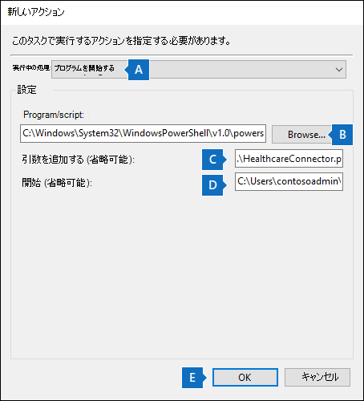
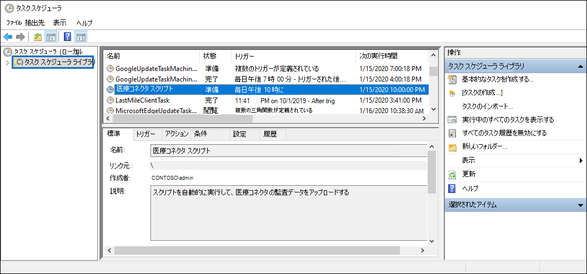

# <a name="set-up-a-connector-to-import-healthcare-ehr-audit-data-preview"></a>ヘルスケア EHR 監査データをインポートするコネクタをセットアップする (プレビュー)

組織の電子医療記録 (EHR) システムMicrosoft 365 コンプライアンス センターアクティビティの監査データをインポートするには、データ コネクタを Microsoft 365 コンプライアンス センターで設定できます。 医療 EHR システムからのデータの監査には、患者の健康記録へのアクセスに関連するイベントのデータが含まれます。 ヘルスケア EHR 監査データは、Microsoft 365インサイダー リスク管理ソリューションで使用[](insider-risk-management.md)して、患者情報への不正アクセスから組織を保護できます。

ヘルスケア コネクタのセットアップは、次のタスクで構成されます。

- ヘルスケア EHR 監査データAzure Active Directoryタブ区切りテキスト ファイルを受け入れる API エンドポイントにアクセスするためのアプリを Azure Active Directory (Azure AD) で作成します。

- コネクタ スキーマで定義されている必要なすべてのフィールドを含むテキスト ファイルを作成します。

- ヘルスケア コネクタ インスタンスを作成する方法は、Microsoft 365 コンプライアンス センター。

- ヘルスケア EHR 監査データを API エンドポイントにプッシュするスクリプトを実行する。

- 必要に応じて、監査データをインポートするためにスクリプトを自動的に実行するスケジュールを設定します。

## <a name="before-you-set-up-the-connector"></a>コネクタをセットアップする前に

- 手順 3 で Healthcare コネクタを作成するユーザーには、メールボックスインポートエクスポートの役割が割り当てられている必要Exchange Online。 既定では、この役割は Exchange Online のどの役割グループにも割り当てられていません。 [メールボックスのインポートエクスポート] 役割は、組織の [組織の管理] 役割グループに追加Exchange Online。 または、新しい役割グループを作成し、メールボックスインポートエクスポートの役割を割り当て、適切なユーザーをメンバーとして追加できます。 詳細については、「役割グループの[管理」の](/Exchange/permissions-exo/role-groups#create-role-groups)記事[](/Exchange/permissions-exo/role-groups#modify-role-groups)の「役割グループの作成」または「役割グループの変更」セクションExchange Online。

- 組織のヘルスケア EHR システムから (日単位で) データを取得またはエクスポートする方法を決定し、手順 2 で説明するテキスト ファイルを作成する必要があります。 手順 4 で実行するスクリプトは、テキスト ファイル内のデータを API エンドポイントにプッシュします。

- 手順 4 で実行するサンプル スクリプトは、ヘルスケア EHR 監査データをテキスト ファイルからコネクタ API にプッシュして、インサイダー リスク管理ソリューションで使用できます。 このサンプル スクリプトは、Microsoft 標準サポート プログラムまたはサービスではサポートされていません。 サンプル スクリプトは現状のまま提供され、いかなる保証も伴いません。 さらに、Microsoft は、商品性、特定目的への適合性の黙示の保証を含む、一切の黙示の保証をいたしかねます。 本サンプル スクリプトおよびドキュメントの使用または性能に起因するすべてのリスクは、お客様が負うものとします。 サンプル スクリプトおよびドキュメントを使用したこと、または使用できなかったことに伴って生じるいかなる損害 (業務利益の損失、業務の中断、業務情報の損失、金銭上の損失、その他一切の損害) についても、Microsoft、Microsoft に帰属する作者、スクリプトの作成、製造、または納入に関与したその他のすべての人員は、いかなる場合も責めを負わないものとします。

## <a name="step-1-create-an-app-in-azure-active-directory"></a>手順 1: アプリをアプリで作成Azure Active Directory

最初の手順は、新しいアプリを作成し、アプリに登録Azure Active Directory (Azure AD)。 アプリは、手順 3 で作成したヘルスケア コネクタに対応します。 このアプリを作成すると、Azure AD EHR 監査データを含むテキスト ファイルのプッシュ要求を認証できます。 このアプリの作成中Azure AD情報を保存してください。 これらの値は、後の手順で使用されます。

- Azure AD ID (アプリ *ID* またはクライアント *ID とも呼ばれる*)

- Azure AD シークレット (クライアント シークレットとも *呼ばれる*)

- テナント ID (ディレクトリ *ID とも呼ばれる*)

アプリをアプリに作成する手順については、「Azure ADにアプリケーションを登録する」[を参照Microsoft ID プラットフォーム](\azure\active-directory\develop\quickstart-register-app)。

## <a name="step-2-prepare-a-text-file-with-healthcare-ehr-auditing-data"></a>手順 2: ヘルスケア EHR 監査データを使用してテキスト ファイルを準備する

次の手順では、組織の医療 EHR システム内の患者の健康記録への従業員のアクセスに関する情報を含むテキスト ファイルを作成します。 前に説明したように、医療 EHR システムからこのテキスト ファイルを生成する方法を決定する必要があります。 Healthcare Connector ワークフローでは、テキスト ファイル内のデータを必須のコネクタ スキーマにマップするために、タブ区切りの値を持つテキスト ファイルが必要です。 サポートされるファイル形式は、コンマ (.csv)、パイプ (.psv)、またはタブ (.tsv) で区切られたテキスト ファイルです。

> [!NOTE]
> 監査データを含むテキスト ファイルの最大サイズは 3 GB です。 行の最大数は 500 万行です。 また、必ず、医療 EHR システムからの関連する監査データのみを含める必要があります。

次の表に、インサイダー リスク管理シナリオを有効にするために必要なフィールドを示します。 これらのフィールドのサブセットは必須です。 これらのフィールドはアスタリスク (*)で強調表示されます。 テキスト ファイルに必須フィールドが存在しない場合、ファイルは検証されません。ファイル内のデータはインポートされません。

|Field|カテゴリ|
|:----|:----------|
| 作成 *TimeEvent<br/> 名*<br/>ワークステーション ID<br/>[イベント] セクション<br/>分類 |これらのフィールドは、ヘルスケア EHR システムのアクセス アクティビティ イベントを識別するために使用されます。|
| 患者 Reg Id<br/>Patient First *NamePatient<br/> Middle Name Patient <br/>Last Name* <br/>患者のアドレス行 1* <br/>患者のアドレス行 2<br/>Patient City* <br/>患者の郵便番号*  <br/>患者の状態 <br/>患者の国 <br/>患者部門              | これらのフィールドは、患者プロファイル情報を識別するために使用されます。|
| 制限付きアクセスの理由*<br/> 制限付きアクセスコメント | これらのフィールドは、制限付きレコードへのアクセスを識別するために使用されます。|
| 電子メール アドレス (UPN) または SamAccountName*<br/>従業員ユーザー名 <br/> 従業員 ID <br/> 従業員の氏名 <sup>1</sup> <br/> 従業員名 <sup>1</sup> | これらのフィールドは、家族/近隣/従業員レコードへのアクセスを決定するために必要な住所と名前の照合に関する従業員プロファイル情報を識別するために使用されます。 |
|||

> [!NOTE] 
> <sup>1</sup>このフィールドは、既定では、医療 EHR システムでは使用できない場合があります。 テキスト ファイルにこのフィールドが含まれているか確認するには、エクスポートを構成する必要があります。

## <a name="step-3-create-the-healthcare-connector"></a>手順 3: ヘルスケア コネクタを作成する

次の手順では、次の手順でヘルスケア コネクタを作成Microsoft 365 コンプライアンス センター。 手順 4 でスクリプトを実行すると、手順 2 で作成したテキスト ファイルが処理され、手順 1 でセットアップした API エンドポイントにプッシュされます。 この手順では、コネクタの作成時に生成される JobId を必ずコピーします。 スクリプトの実行時に JobId を使用します。

1. に移動し <https://compliance.microsoft.com> 、左側の **ナビゲーションで [** データ コネクタ] をクリックします。

2. [概要] **タブで** 、[ヘルスケア ] **(プレビュー) をクリックします**。

3. [ヘルスケア ( **プレビュー)] ページで** 、[コネクタの追加] **をクリックします**。

4. 利用規約に同意します。

5. [認証資格情報 **] ページで、** 次の操作を行い、[次へ] を **クリックします**。

    1. 手順 1 で作成Azure AD Azure アプリのアプリケーション ID を入力または貼り付けます。

    2. ヘルスケア コネクタの名前を入力します。

6. [ファイル マッピング **方法] ページで** 、次のいずれかのオプションを選択し、[次へ] をクリック **します**。

   - **アップロードファイルを作成します**。 このオプションを選択した場合は、[サンプル アップロード **]** をクリックして、手順 2 で準備したファイルをアップロードします。 このオプションを使用すると、ドロップダウン リストからテキスト ファイル内の列名をすばやく選択して、ヘルスケア コネクタに必要なスキーマに列をマップできます。 

    または

   - **マッピングの詳細を手動で指定します**。 このオプションを選択した場合は、テキスト ファイルに列の名前を入力して、ヘルスケア コネクタに必要なスキーマに列をマップする必要があります。

7. [ファイル マッピング **の詳細]** ページで、前の手順でサンプル ファイルをアップロードしたかどうかに応じて、次のいずれかを実行します。

   - ドロップダウン リストを使用して、サンプル ファイルの列を、ヘルスケア コネクタに必要な各フィールドにマップします。

    または

   - 各フィールドに、ヘルスケア コネクタのフィールドに対応する手順 2 で準備したファイルの列名を入力します。

8. [確認 **] ページで** 設定を確認し、[完了] を **クリックして** コネクタを作成します。

   コネクタが作成されたのを確認する状態ページが表示されます。 このページには、ヘルスケア EHR 監査データをアップロードするためにサンプル スクリプトを実行する次の手順を完了するために必要な 2 つの重要な点が含まれている。

    - **ジョブ ID。** 次の手順でスクリプトを実行するには、このジョブ ID が必要です。 このページまたはコネクタ のフライアウト ページからコピーできます。

    - **サンプル スクリプトへのリンク。** [こちら **] リンク** をクリックして、GitHubに移動してサンプル スクリプトにアクセスします (リンクによって新しいウィンドウが開きます)。 手順 4 でスクリプトをコピーできるよう、このウィンドウを開いた状態にしてください。 または、スクリプトの実行時にもう一度アクセスできるよう、コピー先をブックマークするか、URL をコピーすることもできます。 このリンクは、コネクタ のフライアウト ページでも使用できます。

9. **[完了]** をクリックします。

   新しいコネクタが [コネクタ] タブの一覧 **に表示** されます。

10. 作成した Healthcare コネクタをクリックして、コネクタに関するプロパティや他の情報を含むフライアウト ページを表示します。

まだ実行していない場合は、 **Azure App ID と Connector ジョブ ID** の値 **をコピーできます**。 次の手順でスクリプトを実行するには、これらを実行する必要があります。 スクリプトは、フライアウト ページからダウンロードすることもできます (または、次の手順のリンクを使用してダウンロードすることもできます)。

[編集] を **クリック** して、Azure App ID または [ファイル マッピング] ページで定義した列ヘッダー名 **を変更** することもできます。

## <a name="step-4-run-the-sample-script-to-upload-your-healthcare-ehr-auditing-data"></a>手順 4: サンプル スクリプトを実行して、ヘルスケア EHR 監査データをアップロードする

Healthcare コネクタをセットアップする最後の手順は、テキスト ファイル (手順 1 で作成した) のヘルスケア EHR 監査データを Microsoft クラウドにアップロードするサンプル スクリプトを実行することです。 具体的には、スクリプトはデータを Healthcare コネクタにアップロードします。 スクリプトを実行した後、手順 3 で作成した Healthcare コネクタは、ヘルスケア EHR 監査データを Microsoft 365 組織にインポートし、Insider リスク管理ソリューションなどの他のコンプライアンス ツールからアクセスできます。 スクリプトを実行した後、タスクをスケジュールして毎日自動的に実行し、最新の従業員終了データが Microsoft クラウドにアップロードされるのを検討してください。 「 [(省略可能)手順 6: スクリプトを自動的に実行するスケジュールを設定する」を参照してください](#optional-step-6-schedule-the-script-to-run-automatically)。

> [!NOTE]
> 前に述べたように、監査データを含むテキスト ファイルの最大サイズは 3 GB です。 行の最大数は 500 万行です。 この手順で実行するスクリプトは、大きなテキスト ファイルから監査データをインポートするために約 30 ~ 40 分かかります。 さらに、スクリプトは大きなテキスト ファイルを 100K 行の小さなブロックに分割し、それらのブロックを順番にインポートします。

1. 前の手順で開いたウィンドウに移動し、サンプル スクリプトを使用してGitHubサイトにアクセスします。 または、ブックマークされたサイトを開くか、コピーした URL を使用します。 ここでスクリプトにアクセス [することもできます](https://github.com/microsoft/m365-compliance-connector-sample-scripts/blob/main/sample_script.ps1)。

2. [Raw] **ボタンを** クリックして、スクリプトをテキスト ビューに表示します。

3. サンプル スクリプト内のすべての行をコピーし、テキスト ファイルに保存します。

4. 必要に応じて、組織のサンプル スクリプトを変更します。

5. ファイル名のサフィックスを使用してWindows PowerShellスクリプト `.ps1`ファイルとしてテキスト ファイルを`HealthcareConnector.ps1`保存します。

6. ローカル コンピューターでコマンド プロンプトを開き、スクリプトを保存したディレクトリに移動します。

7. 次のコマンドを実行して、テキスト ファイル内の医療監査データを Microsoft クラウドにアップロードします。例えば：

   ```powershell
   .\HealthcareConnector.ps1 -tenantId <tenantId> -appId <appId>  -appSecret <appSecret>  -jobId <jobId>  -filePath '<filePath>'
   ```

次の表では、このスクリプトで使用するパラメーターとその必要な値について説明します。 前の手順で取得した情報は、これらのパラメーターの値で使用されます。

|パラメーター  |説明|
|:----------|:----------|
|tenantId|これは、手順 1 で取得Microsoft 365組織の ID です。 組織のテナント ID は、管理センターの [概要]  ブレードAzure ADすることもできます。 これは、組織を識別するために使用されます。|
|appId|これは、手順 1 Azure ADで作成したアプリのAzure AD ID です。 これは、スクリプトが組織Azure ADアクセスしようとするときに、認証に使用Microsoft 365されます。|
|appSecret|これは、手順 1 Azure ADで作成したアプリのアプリケーション Azure ADシークレットです。 これは、認証にも使用されます。|
|jobId|これは、手順 3 で作成したヘルスケア コネクタのジョブ ID です。 これは、Microsoft クラウドにアップロードされるヘルスケア EHR 監査データをヘルスケア コネクタに関連付ける場合に使用します。|
|filePath|これは、手順 2 で作成したテキスト ファイル (スクリプトと同じシステムに格納されている) のファイル パスです。 ファイル パス内のスペースを避けるようにします。それ以外の場合は、単一引用符を使用します。|
|||

各パラメーターの実際の値を使用する Healthcare コネクタ スクリプトの構文の例を次に示します。

```powershell
.\HealthcareConnector.ps1 -tenantId d5723623-11cf-4e2e-b5a5-01d1506273g9 -appId 29ee526e-f9a7-4e98-a682-67f41bfd643e -appSecret MNubVGbcQDkGCnn -jobId b8be4a7d-e338-43eb-a69e-c513cd458eba -filePath 'C:\Users\contosoadmin\Desktop\Data\healthcare_audit_records.csv'
```

アップロードが成功した場合、スクリプトは成功したメッセージアップロード **表示** します。

> [!NOTE]
> 実行ポリシーのために前のコマンドを実行する際に問題がある場合は、「実行[](/powershell/module/microsoft.powershell.core/about/about_execution_policies)ポリシーについて」および「[Set-ExecutionPolicy](/powershell/module/microsoft.powershell.security/set-executionpolicy)」を参照して、実行ポリシーの設定に関するガイダンスを参照してください。

## <a name="step-5-monitor-the-healthcare-connector"></a>手順 5: ヘルスケア コネクタを監視する

Healthcare コネクタを作成し、EHR 監査データをプッシュした後、コネクタを表示し、そのコネクタの状態をアップロードMicrosoft 365 コンプライアンス センター。 スクリプトを定期的に自動的に実行するスケジュールを設定した場合は、前回スクリプトを実行した後に現在の状態を表示することもできます。

1. 左側のナビゲーション <https://compliance.microsoft.com> で [ **データ コネクタ] に** 移動してクリックします。

2. [コネクタ **] タブをクリック** し、ヘルスケア コネクタを選択して、フライアウト ページを表示します。 このページには、コネクタに関するプロパティと情報が含まれる。

3. [ **最後のインポート]** で、[ログのダウンロード **] リンクを** クリックして、コネクタの状態ログを開く (または保存) します。 このログには、スクリプトが実行され、テキスト ファイルから Microsoft クラウドにデータをアップロードする度に関する情報が含まれます。

    フィールド `RecordsSaved` は、アップロードされたテキスト ファイル内の行数を示します。 たとえば、テキスト `RecordsSaved` ファイルに 4 行が含まれている場合、スクリプトがテキスト ファイル内のすべての行を正常にアップロードした場合、フィールドの値は 4 になります。

手順 4 でスクリプトを実行していない場合は、スクリプトをダウンロードするリンクが [最後のインポート] の下 **に表示されます**。 スクリプトをダウンロードし、手順に従ってスクリプトを実行できます。

## <a name="optional-step-6-schedule-the-script-to-run-automatically"></a>(省略可能)手順 6: スクリプトを自動的に実行するスケジュールを設定する

インサイダー リスク管理ソリューションのようなツールで、医療 EHR システムの最新の監査データを使用するには、スクリプトを毎日自動的に実行するスケジュールを設定することをお勧めします。 また、同じテキスト ファイル内の EHR 監査データを同様の (同じではないにした場合) スケジュールに更新して、従業員による患者レコード アクセス アクティビティに関する最新情報が含まれる必要があります。 目標は、最新の監査データをアップロードして、ヘルスケア コネクタがインサイダー リスク管理ソリューションで利用できるようすることです。

タスク スケジューラ アプリを使用すると、Windowsスクリプトを自動的に実行できます。

1. ローカル コンピューターで、[スタート] ボタンをクリックWindows **タスク** スケジューラと **入力します**。

2. タスク スケジューラ **アプリをクリック** して開きます。

3. [アクション] **セクションで** 、[タスクの作成] **をクリックします**。

4. [全般 **] タブ** で、スケジュールされたタスクのわかりやすい名前を入力します。たとえば、 **Healthcare コネクタ スクリプトです**。 オプションの説明を追加できます。

5. [ **セキュリティ オプション] で**、次の操作を行います。

    1. コンピューターにログオンしている場合にのみスクリプトを実行するか、ログオンしていないときに実行するかどうかを決定します。

    2. [最高の権限で **実行する] チェック ボックスが** オンになっていることを確認します。

6. [トリガー] **タブを選択** し、[ **新規] をクリック** し、次の操作を行います。

    1. [**設定**] で [日] オプションを選択し、スクリプトを初めて実行する日時を選択します。 スクリプトは、指定された時間に毎日実行されます。

    2. [ **詳細設定] で**、[有効] **チェック ボックスが** オンになっていることを確認します。

    3. [**OK**] をクリックします。

7. [操作] **タブを** 選択し、[ **新規] をクリック** し、次の操作を行います。

   

    1. [アクション **] ドロップダウン** リストで、[プログラムの開始 **] が選択されている** 必要があります。

    2. [プログラム **/スクリプト] ボックスで**、[参照] をクリックし、次の場所に移動して選択して、パスがボックスに表示C:.0.exe。

    3. [引数 **の追加 (オプション)]** ボックスに、手順 4 で実行したのと同じスクリプト コマンドを貼り付けます。 たとえば、`.\HealthcareConnector.ps1 -tenantId "d5723623-11cf-4e2e-b5a5-01d1506273g9" -appId "c12823b7-b55a-4989-faba-02de41bb97c3" -appSecret "MNubVGbcQDkGCnn" -jobId "e081f4f4-3831-48d6-7bb3-fcfab1581458" -filePath "C:\Healthcare\audit\records.txt"` のように指定します。

    4. [スタート **] (オプション) ボックス** に、手順 4 で実行したスクリプトのフォルダーの場所を貼り付けます。 たとえば、C:\Healthcare\audit。

    5. [ **OK] を** クリックして、新しいアクションの設定を保存します。

8. [タスクの **作成] ウィンドウで** 、[ **OK] をクリックして** 、スケジュールされたタスクを保存します。 ユーザー アカウントの資格情報の入力を求めるメッセージが表示される場合があります。

   新しいタスクがタスク スケジューラ ライブラリに表示されます。

   

   スクリプトが最後に実行された時刻と、次回の実行がスケジュールされている時間が表示されます。 タスクをダブルクリックして編集できます。

   コンプライアンス センターの対応する Healthcare コネクタのフライアウト ページでスクリプトが最後に実行された時刻を確認することもできます。
