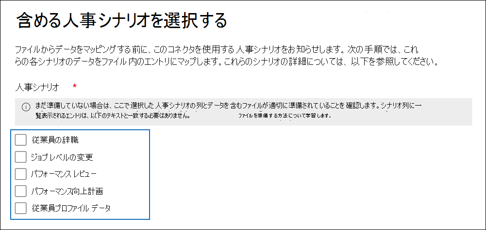

# <a name="set-up-a-connector-to-import-hr-data"></a>コネクタをセットアップして人事データをインポートする

[!include[Purview banner](../includes/purview-rebrand-banner.md)]

Microsoft Purview コンプライアンス ポータルでデータ コネクタを設定して、ユーザーの辞任やユーザーのジョブ レベルの変更などのイベントに関連する人事 (HR) データをインポートできます。 その後、人事データを [インサイダー リスク管理ソリューション](insider-risk-management.md) で使用して、組織内のユーザーによる悪意のあるアクティビティやデータ盗難の可能性を特定するのに役立つリスク インジケーターを生成できます。

インサイダー リスク管理ポリシーがリスク インジケーターを生成するために使用できる人事データのコネクタを設定するには、人事データを含む CSV ファイルを作成し、認証に使用するアプリをAzure Active Directoryに作成し、コンプライアンス ポータルで HR データ コネクタを作成し、CSV ファイルで人事データを Microsoft クラウドに取り込むスクリプト (スケジュールベース) を実行します。 をインサイダー リスク管理ソリューションに提供します。

> [!IMPORTANT]
> 新しいバージョンの HR コネクタがパブリック プレビューで使用できるようになりました。 新しい人事コネクタを作成したり、インサイダー リスク管理の医療ポリシー [シナリオの新しい従業員プロファイル シナリオ](#csv-file-for-employee-profile-data-preview) のデータをインポートしたりするには、コンプライアンス ポータルの **[データ コネクタ** ] ページに移動し、[ **コネクタ** ] タブを選択し、[ **コネクタの追加] > HR (プレビュー)** をクリックして設定を開始します。 既存の HR コネクタは、中断することなく引き続き機能します。

## <a name="before-you-begin"></a>はじめに

- Microsoft 365にインポートする人事シナリオとデータを決定します。 これにより、作成する必要がある CSV ファイルと人事コネクタの数と、CSV ファイルを生成および構造化する方法を決定するのに役立ちます。 インポートする人事データは、実装するインサイダー リスク管理ポリシーによって決まります。 詳細については、手順 1. を参照してください。

- 組織の人事システム (および定期的に) からデータを取得またはエクスポートし、手順 1 で作成した CSV ファイルにデータを追加する方法を決定します。 手順 4 で実行したスクリプトは、CSV ファイル内の人事データを Microsoft クラウドにアップロードします。

- 手順 3 で HR コネクタを作成するユーザーには、データ コネクタ管理者ロールを割り当てる必要があります。 このロールは、コンプライアンス ポータルの **[データ コネクタ** ] ページでコネクタを追加するために必要です。 このロールは、既定で複数の役割グループに追加されます。 これらの役割グループの一覧については、「セキュリティ & コンプライアンス センターのアクセス許可」の「 [セキュリティとコンプライアンス センターの](../security/office-365-security/permissions-in-the-security-and-compliance-center.md#roles-in-the-security--compliance-center)ロール」セクションを参照してください。 または、組織内の管理者は、カスタム役割グループを作成し、Data Connector 管理者ロールを割り当て、適切なユーザーをメンバーとして追加することもできます。 手順については、 [Microsoft Purview コンプライアンス ポータル](microsoft-365-compliance-center-permissions.md#create-a-custom-role-group)のアクセス許可の「カスタム ロール グループの作成」セクションを参照してください。

- 手順 4 で実行したサンプル スクリプトは、人事データを Microsoft クラウドにアップロードして、インサイダー リスク管理ソリューションで使用できるようにします。 このサンプル スクリプトは、Microsoft 標準サポート プログラムまたはサービスではサポートされていません。 サンプル スクリプトは現状のまま提供され、いかなる保証も伴いません。 さらに、Microsoft は、商品性、特定目的への適合性の黙示の保証を含む、一切の黙示の保証をいたしかねます。 本サンプル スクリプトおよびドキュメントの使用または性能に起因するすべてのリスクは、お客様が負うものとします。 サンプル スクリプトおよびドキュメントを使用したこと、または使用できなかったことに伴って生じるいかなる損害 (業務利益の損失、業務の中断、業務情報の損失、金銭上の損失、その他一切の損害) についても、Microsoft、Microsoft に帰属する作者、スクリプトの作成、製造、または納入に関与したその他のすべての人員は、いかなる場合も責めを負わないものとします。

- このコネクタは、Microsoft 365米国政府機関クラウドのGCC環境で使用できます。 サード パーティのアプリケーションとサービスには、組織の顧客データを、Microsoft 365 インフラストラクチャの外部にあるサード パーティ システムに格納、送信、処理する必要があるため、Microsoft Purview およびデータ保護のコミットメントの対象とされません。 Microsoft は、この製品を使用してサード パーティ製アプリケーションに接続することは、これらのサードパーティ アプリケーションが FEDRAMP に準拠していることを意味することを示しません。 GCC環境で HR コネクタを設定する手順については、「[米国政府で人事データをインポートするコネクタを設定する](import-hr-data-US-government.md)」を参照してください。

## <a name="step-1-prepare-a-csv-file-with-your-hr-data"></a>手順 1: 人事データを含む CSV ファイルを準備する

最初の手順では、コネクタがMicrosoft 365にインポートする人事データを含む CSV ファイルを作成します。 このデータは、インサイダー リスク ソリューションによって潜在的なリスク インジケーターを生成するために使用されます。 次の人事シナリオのデータは、Microsoft 365にインポートできます。

- 従業員の退職。 組織を離れた従業員に関する情報。

- ジョブ レベルの変更。 昇格や降格など、従業員の職務レベルの変更に関する情報。

- パフォーマンス レビュー。 従業員のパフォーマンスに関する情報。

- パフォーマンス向上計画。 従業員のパフォーマンス向上計画に関する情報。

- 従業員プロファイル (プレビュー)。 従業員に関する一般的な情報。

インポートする人事データの種類は、実装するインサイダー リスク管理ポリシーと対応するポリシー テンプレートによって異なります。 次の表は、各ポリシー テンプレートに必要な人事データ型を示しています。

|  ポリシー テンプレート |  HR データ型 |
|:------------------------------|:--------------------------------|
| 離職するユーザーによるデータ盗難 | 従業員の退職|
| 一般的なデータ漏洩                             | 該当なし|
| 優先ユーザーによるデータ漏洩                   | 該当なし |
| 不満を持つユーザーによるデータ漏洩                | ジョブ レベルの変更、パフォーマンス レビュー、パフォーマンス向上計画|
| 一般的なセキュリティ ポリシー違反             | 該当なし |
| 離職するユーザーによるセキュリティ ポリシー違反  | 従業員の退職|
| 優先ユーザーによるセキュリティ ポリシー違反   | 該当なし|
| 不満を持つユーザーによるセキュリティ ポリシー違反| ジョブ レベルの変更、パフォーマンス レビュー、パフォーマンス向上計画 |
| メールの不快な言葉                    | 該当なし |
| 医療ポリシー| 従業員プロファイル |
|||

インサイダー リスク管理のポリシー テンプレートの詳細については、「 [Insider リスク管理ポリシー](insider-risk-management-policies.md#policy-templates)」を参照してください。

人事シナリオごとに、対応する人事データを 1 つ以上の CSV ファイルに指定する必要があります。 インサイダー リスク管理の実装に使用する CSV ファイルの数については、このセクションの後半で説明します。

必要な人事データを含む CSV ファイルを作成したら、手順 4. でスクリプトを実行したローカル コンピューターに保存します。 また、更新戦略を実装して、CSV ファイルに常に最新の情報が含まれていることを確認して、スクリプトを実行する場合は、最新の人事データが Microsoft クラウドにアップロードされ、インサイダー リスク管理ソリューションからアクセスできるようにします。

> [!IMPORTANT]
> 次のセクションで説明する列名は必須パラメーターではなく、例にすぎません。 CSV ファイル内の任意の列名を使用できます。 ただし、手順 3 で HR コネクタを作成するときに、CSV ファイルで使用する列名をデータ型にマップする *必要があります* 。 また、次のセクションのサンプル CSV ファイルは NotePad ビューに表示されることにも注意してください。 Microsoft Excelで CSV ファイルを表示および編集する方がはるかに簡単です。

以降のセクションでは、人事シナリオごとに必要な CSV データについて説明します。

### <a name="csv-file-for-employee-resignation-data"></a>従業員退職データの CSV ファイル

従業員退職データの CSV ファイルの例を次に示します。

```text
EmailAddress,ResignationDate,LastWorkingDate
sarad@contoso.com,2019-04-23T15:18:02.4675041+05:30,2019-04-29T15:18:02.4675041+05:30
pilarp@contoso.com,2019-04-24T09:15:49Z,2019-04-29T15:18:02.7117540
```

次の表では、従業員退職データの CSV ファイル内の各列について説明します。

|  列   |   説明 |
|:------------|:----------------|
|**EmailAddress**| 終了したユーザーの電子メール アドレス (UPN) を指定します。|
| **ResignationDate** | 組織でユーザーの雇用が正式に終了した日付を指定します。 たとえば、これは、ユーザーが組織を離れることに関する通知を行った日付である可能性があります。 この日付は、その人の仕事の最後の日の日付と異なる場合があります。 次の日付形式を使用します `yyyy-mm-ddThh:mm:ss.nnnnnn+|-hh:mm`。これは [ISO 8601 の日付と時刻の形式です](https://www.iso.org/iso-8601-date-and-time-format.html)。|
| **LastWorkingDate** | 終了したユーザーの作業の最後の日を指定します。 次の日付形式を使用します `yyyy-mm-ddThh:mm:ss.nnnnnn+|-hh:mm`。これは [ISO 8601 の日付と時刻の形式です](https://www.iso.org/iso-8601-date-and-time-format.html)。|
|||

### <a name="csv-file-for-job-level-changes-data"></a>ジョブ レベル変更データの CSV ファイル

ジョブ レベル変更データの CSV ファイルの例を次に示します。

```text
EmailAddress,EffectiveDate,OldLevel,NewLevel
sarad@contoso.com,2019-04-23T15:18:02.4675041+05:30,Level 61 - Sr. Manager,Level 60- Manager
pillar@contoso.com,2019-04-23T15:18:02.4675041+05:30,Level 62 - Director,Level 60- Sr. Manager
```

次の表では、ジョブ レベル変更データの CSV ファイル内の各列について説明します。

|  列 | 説明 |
|:--------- |:------------- |
| **EmailAddress**  | ユーザーの電子メール アドレス (UPN) を指定します。|
| **EffectiveDate** | ユーザーのジョブ レベルが正式に変更された日付を指定します。 次の日付形式を使用します `yyyy-mm-ddThh:mm:ss.nnnnnn+|-hh:mm`。これは [ISO 8601 の日付と時刻の形式です](https://www.iso.org/iso-8601-date-and-time-format.html)。|
| **注釈**| エバリュエーターがジョブ レベルの変更について提供した注釈を指定します。 200 文字の制限を入力できます。 このパラメーターは省略可です。 CSV ファイルに含める必要はありません。|
| **OldLevel**| 変更される前のユーザーのジョブ レベルを指定します。 これはフリーテキスト パラメーターであり、組織の階層分類を含めることができます。 このパラメーターは省略可です。 CSV ファイルに含める必要はありません。|
| **NewLevel**| 変更後のユーザーのジョブ レベルを指定します。 これはフリーテキスト パラメーターであり、組織の階層分類を含めることができます。 このパラメーターは省略可です。 CSV ファイルに含める必要はありません。|
|||

### <a name="csv-file-for-performance-review-data"></a>パフォーマンス レビュー データ用の CSV ファイル

パフォーマンス データ用の CSV ファイルの例を次に示します。

```text
EmailAddress,EffectiveDate,Remarks,Rating
sarad@contoso.com,2019-04-23T15:18:02.4675041+05:30,Met expectations but bad attitude,2-Below expectation
pillar@contoso.com,2019-04-23T15:18:02.4675041+05:30, Multiple conflicts with the team
```

次の表では、パフォーマンス レビュー データ用の CSV ファイル内の各列について説明します。

|  列 | 説明 |
|:----------|:--------------|
| **EmailAddress**  | ユーザーの電子メール アドレス (UPN) を指定します。|
| **EffectiveDate** | ユーザーがパフォーマンス レビューの結果について正式に通知された日付を指定します。 これは、パフォーマンス レビュー サイクルが終了した日付を指定できます。 次の日付形式を使用します `yyyy-mm-ddThh:mm:ss.nnnnnn+|-hh:mm`。これは [ISO 8601 の日付と時刻の形式です](https://www.iso.org/iso-8601-date-and-time-format.html)。|
| **注釈**| パフォーマンス レビューのためにエバリュエーターがユーザーに提供したコメントを指定します。 これは、200 文字の制限を持つテキスト パラメーターです。 このパラメーターは省略可です。 CSV ファイルに含める必要はありません。|
| **評価**| パフォーマンス レビューに提供される評価を指定します。 これはテキスト パラメーターであり、組織が評価を認識するために使用する任意の自由形式のテキストを含めることができます。 たとえば、"3 Met expectations" や "2 Below average" などです。 これは、25 文字の制限を持つテキスト パラメーターです。 このパラメーターは省略可です。 CSV ファイルに含める必要はありません。|
|||

### <a name="csv-file-for-performance-improvement-plan-data"></a>パフォーマンス向上計画データ用の CSV ファイル

パフォーマンス向上計画データのデータの CSV ファイルの例を次に示します。

```text
EmailAddress,EffectiveDate,ImprovementRemarks,PerformanceRating
sarad@contoso.com,2019-04-23T15:18:02.4675041+05:30,Met expectation but bad attitude,2-Below expectation
pillar@contoso.com,2019-04-23T15:18:02.4675041+05:30, Multiple conflicts with the team
```

次の表では、パフォーマンス レビュー データ用の CSV ファイル内の各列について説明します。

|  列 |  説明 |
|:----------|:---------------|
| **EmailAddress**  | ユーザーの電子メール アドレス (UPN) を指定します。|
| **EffectiveDate** | ユーザーがパフォーマンス向上計画について正式に通知された日付を指定します。 次の日付形式 `yyyy-mm-ddThh:mm:ss.nnnnnn+|-hh:mm`( [ISO 8601 の日付と時刻の形式](https://www.iso.org/iso-8601-date-and-time-format.html)) を使用する必要があります。|
| **注釈**| パフォーマンス向上計画についてエバリュエーターが提供した備考を指定します。 これは、200 文字の制限を持つテキスト パラメーターです。 このパラメーターは省略可能です。 CSV ファイルに含める必要はありません。 |
| **評価**| パフォーマンス レビューに関連する評価またはその他の情報を指定します。 これはテキスト パラメーターであり、組織が評価を認識するために使用する任意の自由形式のテキストを含めることができます。 たとえば、"3 Met expectations" や "2 Below average" などです。 これは、25 文字の制限を持つテキスト パラメーターです。 このパラメーターは省略可能です。 CSV ファイルに含める必要はありません。|
|||

### <a name="csv-file-for-employee-profile-data-preview"></a>従業員プロファイル データの CSV ファイル (プレビュー)

> [!NOTE]
> 従業員プロファイル データの人事コネクタを作成する機能は、パブリック プレビュー段階にあります。 従業員プロファイル データをサポートする人事コネクタを作成するには、コンプライアンス ポータルの **[データ コネクタ**] ページに移動し、[**コネクタ**] タブを選択して、[**ConnectorHR** >  の追加 **(プレビュー)]** をクリックします。 手順 3: HR コネクタを作成する手順に従って [コネクタを作成します](#step-3-create-the-hr-connector)。

従業員プロファイル データのデータの CSV ファイルの例を次に示します。

```text
EmailAddress,UserName,EmployeeFirstName,EmployeeLastName,EmployeeAddLine1,EmployeeAddLine2,EmployeeCity,EmployeeState,EmployeeZipCode,EmployeeDept,EmployeeType,EmployeeRole
jackq@contoso.com,jackq,jack,qualtz,50 Oakland Ave,#206,City,Florida,32104,Orthopaedic,Regular,Nurse
```

次の表では、従業員プロファイル データの CSV ファイル内の各列について説明します。

|  列 |  説明 |
|:----------|:---------------|
| Emailaddress<sup>*</sup>    | 従業員のユーザー プリンシパル名 (UPN) または電子メール アドレス。|
| EmployeeFirstName<sup>*</sup>   | 従業員の名。|
| EmployeeLastName<sup>*</sup>   | 従業員の姓。|
| EmployeeAddressLine1<sup>*</sup>    | 従業員の住所。|
| EmployeeAddressLine2   | 従業員の第 2 住所情報 (アパート番号など)。|
| EmployeeCity | 従業員の居住都市。|
| EmployeeState | 従業員の居住状態。|
| EmployeeZipCode<sup>*</sup>  | 従業員用の居住地の郵便番号。 |
| EmployeeCountry| 従業員の居住国。|
| EmployeeDepartment | 組織内の従業員の部署。|
| EmployeeType |正規、適用除外、請負業者などの従業員の雇用の種類。|
| EmployeeRole |組織内の従業員のロール、指定、または役職。|
|||

> [!NOTE]
> <sup>*</sup> この列は必須です。 必須列がない場合、CSV ファイルは検証されません。ファイル内の他のデータはインポートされません。

従業員プロファイル データのみをインポートする人事コネクタを作成することをお勧めします。 このコネクタでは、従業員プロファイル データを頻繁に更新してください (できれば 15 日から 20 日ごと)。 従業員プロファイル レコードは、過去 30 日間に更新されていない場合は削除されます。

### <a name="determining-how-many-csv-files-to-use-for-hr-data"></a>人事データに使用する CSV ファイルの数を決定する

手順 3 では、人事データ型ごとに個別のコネクタを作成するか、すべてのデータ型に対して 1 つのコネクタを作成するかを選択できます。 1 つの人事シナリオのデータを含む個別の CSV ファイルを使用できます (前のセクションで説明した CSV ファイルの例など)。 または、2 つ以上の人事シナリオのデータを含む単一の CSV ファイルを使用することもできます。 人事データに使用する CSV ファイルの数を決定するのに役立つガイドラインを次に示します。

- 実装するインサイダー リスク管理ポリシーで複数の人事データ型が必要な場合は、必要なすべてのデータ型を含む単一の CSV ファイルを使用することを検討してください。

- 人事データを生成または収集する方法によって、CSV ファイルの数が決まります。 たとえば、人事コネクタの構成に使用されるさまざまな種類の人事データが組織内の 1 つの人事システムにある場合、データを単一の CSV ファイルにエクスポートできます。 ただし、データが異なる人事システムに分散されている場合は、データを異なる CSV ファイルにエクスポートする方が簡単な場合があります。 たとえば、従業員退職データは、ジョブ レベルまたはパフォーマンス レビュー データとは異なる人事システムに配置される場合があります。 この場合、データを 1 つの CSV ファイルに手動で結合するよりも、個別の CSV ファイルを作成する方が簡単な場合があります。 そのため、人事システムからデータを取得またはエクスポートする方法によって、必要な CSV ファイルの数が決まります。

- 一般的に、作成する必要がある人事コネクタの数は、CSV ファイル内のデータ型によって決まります。 たとえば、CSV ファイルにインサイダー リスク管理の実装をサポートするために必要なすべてのデータ型が含まれている場合、必要な人事コネクタは 1 つだけです。 ただし、それぞれ 1 つのデータ型を含む 2 つの個別の CSV ファイルがある場合は、2 つの HR コネクタを作成する必要があります。 例外として、CSV ファイルに **HRScenario** 列を追加する場合 (次のセクションを参照)、異なる CSV ファイルを処理できる 1 つの HR コネクタを構成できます。

### <a name="configuring-a-single-csv-file-for-multiple-hr-data-types"></a>複数の HR データ型に対して 1 つの CSV ファイルを構成する

複数の HR データ型を 1 つの CSV ファイルに追加できます。 これは、実装しているインサイダー リスク管理ソリューションで複数の人事データ型が必要な場合や、データ型が組織内の 1 つの人事システムにある場合に便利です。 CSV ファイルの数を減らすと、常に作成および管理する人事コネクタの数を減らすことができます。

複数のデータ型で CSV ファイルを構成するための要件を次に示します。

- 必要な列 (および使用する場合は省略可能) を各データ型に追加し、ヘッダー行の対応する列名を追加する必要があります。 データ型が列に対応しない場合は、値を空白のままにできます。

- 複数の種類の人事データを含む CSV ファイルを使用するには、HR コネクタは、CSV ファイル内のどの行に HR データの種類が含まれているかを認識する必要があります。 これは、CSV ファイルに **HRScenario** 列を追加することで実現されます。 この列の値は、各行の人事データの種類を識別します。 たとえば、4 つの人事シナリオに対応する値は\`、辞職\`、ジョブ レベルの変更\`、\`\`パフォーマンス レビュー\`、\`パフォーマンス向上計画\`、従業員\`プロファイルなどです\`。

- HRScenario** 列を含む複数の CSV ファイルがある場合は、各ファイルで、特定の人事シナリオを識別する同じ列名と同じ値を使用していることを確認してください。

次の例は、 **HRScenario** 列を含む CSV ファイルを示しています。 HRScenario 列の値は、対応する行のデータの種類を識別します。

```text
HRScenario,EmailAddress,ResignationDate,LastWorkingDate,EffectiveDate,Remarks,Rating,OldLevel,NewLevel
Resignation,sarad@contoso.com,2019-04-23T15:18:02.4675041+05:30,2019-04-29T15:18:02.4675041+05:30,,,,
Resignation,pilarp@contoso.com,2019-04-24T09:15:49Z,2019-04-29T15:18:02.7117540,,,,
Job level change,sarad@contoso.com,2019-04-23T15:18:02.4675041+05:30,,,,,Level 61 Sr. Manager, Level 60 Manager
Job level change,pillarp@contoso.com,2019-04-23T15:18:02.4675041+05:30,,,,,Level 62 Director,Level 60 Sr Manager
Performance review,sarad@contoso.com,,,2019-04-23T15:18:02.4675041+05:30,Met expectation but bad attitude,2 Below expectations,,
Performance review,pillarp@contoso.com,,,2019-04-23T15:18:02.4675041+05:30, Multiple conflicts with the team,,
Performance improvement plan,sarad@contoso.com,,,2019-04-23T15:18:02.4675041+05:30,Met expectations but bad attitude,2 Below expectations,,
Performance improvement plan,pillarp@contoso.com,,,2019-04-23T15:18:02.4675041+05:30,Multiple conflicts with the team,,
```

> [!NOTE]
> HR データ型を識別する列には任意の名前を使用できます。これは、手順 3. でコネクタを設定するときに、人事データ型を識別する列として CSV ファイル内の列の名前をマップするためです。 また、コネクタを設定するときに、データ型列に使用される値をマップします。

### <a name="adding-the-hrscenario-column-to-a-csv-file-that-contains-a-single-data-type"></a>単一のデータ型を含む CSV ファイルに HRScenario 列を追加する

組織の人事システムと、人事データを CSV ファイルにエクスポートする方法に基づいて、1 つの人事データ型を含む複数の CSV ファイルを作成する必要がある場合があります。 この場合でも、異なる CSV ファイルからデータをインポートするための 1 つの人事コネクタを作成できます。 これを行うには、CSV ファイルに HRScenario 列を追加し、HR データ型を指定するだけです。 その後、CSV ファイルごとにスクリプトを実行できますが、コネクタには同じジョブ ID を使用します。 [手順 4](#step-4-run-the-sample-script-to-upload-your-hr-data). を参照してください。

## <a name="step-2-create-an-app-in-azure-active-directory"></a>手順 2: Azure Active Directoryでアプリを作成する

次の手順では、Azure Active Directory (Azure AD) に新しいアプリを作成して登録します。 アプリは、手順 3 で作成した HR コネクタに対応します。 このアプリを作成すると、Azure ADが実行され、組織にアクセスしようとしたときに HR コネクタを認証できるようになります。 このアプリは、手順 4 で実行したスクリプトを認証して、人事データを Microsoft クラウドにアップロードするためにも使用されます。 このAzure AD アプリの作成中に、次の情報を保存してください。 これらの値は、手順 3 と手順 4 で使用されます。

- Azure AD アプリケーション ID (*アプリ ID* または *クライアント ID* とも呼ばれます)

- Azure AD アプリケーション シークレット (*クライアント シークレット* とも呼ばれます)

- テナント ID ( *ディレクトリ ID* とも呼ばれます)

Azure ADでアプリを作成する手順については、「Microsoft ID プラットフォーム[にアプリケーションを登録する](/azure/active-directory/develop/quickstart-register-app)」を参照してください。

## <a name="step-3-create-the-hr-connector"></a>手順 3: HR コネクタを作成する

次の手順では、コンプライアンス ポータルで人事コネクタを作成します。 手順 4 でスクリプトを実行すると、作成する HR コネクタによって、CSV ファイルから組織に人事データが取り込Microsoft 365。 コネクタを作成する前に、人事シナリオの一覧と、それぞれに対応する CSV 列名があることを確認してください。 コネクタを構成するときは、各シナリオに必要なデータを CSV ファイル内の実際の列名にマップする必要があります。 または、コネクタを構成するときにサンプル CSV ファイルをアップロードできます。ウィザードは、列の名前を必要なデータ型にマップするのに役立ちます。

この手順を完了したら、コネクタの作成時に生成されるジョブ ID を必ずコピーしてください。 スクリプトを実行するときに、ジョブ ID を使用します。

1. コンプライアンス ポータルに移動し、 <a href="https://go.microsoft.com/fwlink/p/?linkid=2173865" target="_blank">**データ コネクタ**</a>を選択します。

2. [ **データ コネクタ** ] ページで、[ **HR (プレビュー)]** をクリックします。

3. **人事 (プレビュー)** ページで、[コネクタの **追加**] をクリックします。

4. [ **接続のセットアップ] ページで** 、次の操作を行い、[ **次へ**] をクリックします。

   1. 手順 2. で作成した Azure アプリのAzure ADアプリケーション ID を入力または貼り付けます。

   2. HR コネクタの名前を入力します。

5. 人事シナリオ ページで、データをインポートする 1 つ以上の人事シナリオを選択し、[ **次へ**] をクリックします。

   

6. [ファイル マッピング方法] ページで、必要に応じてファイルの種類を選択し、次のいずれかのオプションを選択して、[ **次へ**] をクリックします。

   - **サンプル ファイルをアップロードします**。 このオプションを選択した場合は、**サンプル ファイルアップロード** クリックして、手順 1 で準備した CSV ファイルをアップロードします。 このオプションを使用すると、ドロップダウン リストから CSV ファイル内の列名をすばやく選択して、以前に選択した人事シナリオのデータ型にマップできます。

   または

   - **マッピングの詳細を手動で指定します**。 このオプションを選択する場合は、CSV ファイル内の列の名前を入力して、以前に選択した人事シナリオのデータ型にマップする必要があります。

7. [ファイル マッピングの詳細] ページで、サンプル CSV ファイルをアップロードしたかどうか、および 1 つの人事シナリオまたは複数のシナリオに対してコネクタを構成しているかどうかに応じて、次のいずれかの操作を行います。 サンプル ファイルをアップロードした場合は、列名を入力する必要はありません。 ドロップダウン リストから選択します。

    - 前の手順で 1 つの人事シナリオを選択した場合は、手順 1 で作成した CSV ファイルの列ヘッダー名 ( *パラメーター* とも呼ばれます) を適切な各ボックスに入力します。 入力する列名では大文字と小文字は区別されませんが、CSV ファイル内の列名にスペースが含まれている場合は、必ずスペースを含めます。 前述のように、これらのボックスに入力する名前は、CSV ファイル内のパラメーター名と一致している必要があります。 たとえば、次のスクリーンショットは、手順 1 で示した従業員退職人事シナリオのサンプル CSV ファイルのパラメーター名を示しています。

    - 上記の手順で複数のデータ型を選択した場合は、CSV ファイル内の HR データ型を識別する識別子列名を入力する必要があります。 識別子列名を入力した後、この HR データ型を識別する値を入力し、選択した各データ型の適切なボックスに、手順 1 で作成した CSV ファイルから選択したデータ型の列ヘッダー名を入力します。 前述のように、これらのボックスに入力する名前は、CSV ファイル内の列名と一致している必要があります。

8. [ **校閲** ] ページで設定を確認し、[ **完了]** をクリックしてコネクタを作成します。

   コネクタが作成されたことを確認する状態ページが表示されます。 このページには、HR データをアップロードするサンプル スクリプトを実行するために次の手順を完了するために必要な 2 つの重要な点が含まれています。

   

   1. **ジョブ ID。** 次の手順でスクリプトを実行するには、このジョブ ID が必要です。 このページまたはコネクタ ポップアップ ページからコピーできます。

   2. **サンプル スクリプトへのリンク。** **この** リンクをクリックしてGitHub サイトに移動し、サンプル スクリプトにアクセスします (リンクによって新しいウィンドウが開きます)。 手順 4. でスクリプトをコピーできるように、このウィンドウを開いたままにします。 または、スクリプトを実行するときにもう一度アクセスできるように、コピー先をブックマークするか、URL をコピーすることもできます。 このリンクは、コネクタ ポップアップ ページでも利用できます。

9. **[完了]** をクリックします。

   新しいコネクタ **が [コネクタ** ] タブの一覧に表示されます。

10. 先ほど作成した HR コネクタをクリックして、コネクタに関するプロパティとその他の情報を含むポップアップ ページを表示します。

   

まだ行っていない場合は、**Azure アプリ ID** と **コネクタ ジョブ ID** の値をコピーできます。 次の手順でスクリプトを実行するには、これらが必要です。 ポップアップ ページからスクリプトをダウンロードすることもできます (または、次の手順のリンクを使用してダウンロードすることもできます)。

[**編集]** をクリックして、[**ファイル マッピング**] ページで定義したAzure アプリ ID または列ヘッダー名を変更することもできます。

## <a name="step-4-run-the-sample-script-to-upload-your-hr-data"></a>手順 4: サンプル スクリプトを実行して人事データをアップロードする

HR コネクタを設定する最後の手順は、CSV ファイル (手順 1 で作成した) の HR データを Microsoft クラウドにアップロードするサンプル スクリプトを実行することです。 具体的には、スクリプトによって HR コネクタにデータがアップロードされます。 スクリプトを実行すると、手順 3 で作成した HR コネクタによって人事データがMicrosoft 365組織にインポートされます。このデータには、Insider リスク管理ソリューションなどの他のコンプライアンス ツールからアクセスできます。 スクリプトを実行した後は、最新の従業員退職データが Microsoft クラウドにアップロードされるように、タスクを毎日自動的に実行するようにスケジュールを設定することを検討してください。 [「スクリプトを自動的に実行するようにスケジュールする」を](#optional-step-6-schedule-the-script-to-run-automatically)参照してください。

1. 前の手順で開いたままにしたウィンドウに移動して、サンプル スクリプトを使用してGitHub サイトにアクセスします。 または、ブックマークされたサイトを開くか、コピーした URL を使用します。 [ここで](https://github.com/microsoft/m365-compliance-connector-sample-scripts/blob/main/sample_script.ps1)スクリプトにアクセスすることもできます。

2. **[未加工**] ボタンをクリックして、テキスト ビューにスクリプトを表示します。

3. サンプル スクリプト内のすべての行をコピーし、テキスト ファイルに保存します。

4. 必要に応じて、組織のサンプル スクリプトを変更します。

5. などの`HRConnector.ps1`ファイル名サフィックス`.ps1`を使用して、テキスト ファイルをWindows PowerShell スクリプト ファイルとして保存します。 または、スクリプト`upload_termination_records.ps1`のGitHubファイル名 (.

6. ローカル コンピューターでコマンド プロンプトを開き、スクリプトを保存したディレクトリに移動します。

7. 次のコマンドを実行して、CSV ファイル内の人事データを Microsoft クラウドにアップロードします。例えば：

    ```powershell
    .\HRConnector.ps1 -tenantId <tenantId> -appId <appId>  -appSecret <appSecret>  -jobId <jobId>  -filePath '<filePath>'
    ```

   次の表では、このスクリプトで使用するパラメーターとその必要な値について説明します。 前の手順で取得した情報は、これらのパラメーターの値で使用されます。

   | パラメーター | 説明 |
   |:-----|:-----|:-----|
   |`tenantId`|これは、手順 2 で取得したMicrosoft 365組織の ID です。 Azure AD管理センターの **[概要**] ブレードで、組織のテナント ID を取得することもできます。 これは、組織を識別するために使用されます。|
   |`appId` |これは、手順 2 のAzure ADで作成したアプリのAzure AD アプリケーション ID です。 これは、スクリプトがMicrosoft 365組織にアクセスしようとしたときに認証のためにAzure ADによって使用されます。 | 
   |`appSecret`|これは、手順 2 のAzure ADで作成したアプリのAzure ADアプリケーション シークレットです。 これは認証にも使用されます。|
   |`jobId`|これは、手順 3 で作成した HR コネクタのジョブ ID です。 これは、Microsoft クラウドにアップロードされた人事データを人事コネクタに関連付けるために使用されます。|
   |`filePath`|これは、手順 1 で作成したファイル (スクリプトと同じシステムに格納) のファイル パスです。 ファイル パス内のスペースを避けてみてください。それ以外の場合は、単一引用符を使用します。|
   |||

   各パラメーターの実際の値を使用する HR コネクタ スクリプトの構文の例を次に示します。

   ```powershell
    .\HRConnector.ps1 -tenantId d5723623-11cf-4e2e-b5a5-01d1506273g9 -appId 29ee526e-f9a7-4e98-a682-67f41bfd643e -appSecret MNubVGbcQDkGCnn -jobId b8be4a7d-e338-43eb-a69e-c513cd458eba -filePath 'C:\Users\contosoadmin\Desktop\Data\employee_termination_data.csv'
    ```

   アップロードが成功した場合、スクリプトには **成功したメッセージアップロード** 表示されます。

   > [!NOTE]
   > 実行ポリシーが原因で前のコマンドの実行に問題がある場合は、実行ポリシーの設定に関するガイダンスについては、「 [実行ポリシー](/powershell/module/microsoft.powershell.core/about/about_execution_policies) と [Set-ExecutionPolicy](/powershell/module/microsoft.powershell.security/set-executionpolicy) について」を参照してください。

## <a name="step-5-monitor-the-hr-connector"></a>手順 5: HR コネクタを監視する

HR コネクタを作成し、スクリプトを実行して人事データをアップロードしたら、コンプライアンス ポータルでコネクタとアップロード状態を表示できます。 スクリプトを定期的に自動的に実行するようにスケジュールする場合は、スクリプトが最後に実行された後の現在の状態を表示することもできます。

1. コンプライアンス ポータルに移動し、 <a href="https://go.microsoft.com/fwlink/p/?linkid=2173865" target="_blank">**データ コネクタ**</a>を選択します。

2. [ **コネクタ** ] タブをクリックし、HR コネクタを選択してポップアップ ページを表示します。 このページには、コネクタに関するプロパティと情報が含まれています。

   

3. [ **進行状況**] で、[ **ログのダウンロード** ] リンクをクリックして、コネクタの状態ログを開く (または保存) します。 このログには、スクリプトが実行され、CSV ファイルから Microsoft クラウドにデータがアップロードされるたびに関する情報が含まれます。 

   

   このフィールドは `RecordsSaved` 、アップロードした CSV ファイル内の行数を示します。 たとえば、CSV ファイルに 4 つの行が含まれている場合、スクリプトが CSV ファイル内のすべての行を正常にアップロードした場合、フィールドの値 `RecordsSaved` は 4 になります。

手順 4 でスクリプトを実行していない場合は、[ **最後のインポート**] にスクリプトをダウンロードするためのリンクが表示されます。 スクリプトをダウンロードし、手順に従ってスクリプトを実行できます。

## <a name="optional-step-6-schedule-the-script-to-run-automatically"></a>(省略可能)手順 6: スクリプトを自動的に実行するようにスケジュールする

組織の最新の人事データをインサイダー リスク管理ソリューションなどのツールで使用できるようにするには、1 日に 1 回など、定期的にスクリプトを自動的に実行するようにスケジュールすることをお勧めします。 また、CSV ファイル内の人事データを同様のスケジュール (同じではない場合) に更新して、組織を離れる従業員に関する最新情報を含める必要もあります。 目標は、人事コネクタが内部リスク管理ソリューションで利用できるように、最新の人事データをアップロードすることです。

Windowsのタスク スケジューラ アプリを使用して、毎日スクリプトを自動的に実行できます。

1. ローカル コンピューターで、[Windows **スタート]** ボタンをクリックし、「**タスク スケジューラ」** と入力します。

2. **タスク スケジューラ** アプリをクリックして開きます。

3. [ **アクション]** セクションで、[ **タスクの作成**] をクリックします。

4. [ **全般** ] タブで、スケジュールされたタスクのわかりやすい名前を入力します。たとえば、 **HR コネクタ スクリプト** です。 オプションの説明を追加することもできます。

5. [ **セキュリティ オプション**] で、次の操作を行います。

   1. コンピューターにログオンしている場合にのみスクリプトを実行するか、ログオンしているときに実行するかを決定します。

   1. **[最高の特権で実行]** チェック ボックスがオンになっていることを確認します。

6. [トリガー] タブ **を** 選択し、[ **新規**] をクリックして、次の操作を行います。

   1. **[設定**] で [**日単位**] オプションを選択し、スクリプトを初めて実行する日付と時刻を選択します。 スクリプトは、指定された時刻に毎日実行されます。

   1. [ **詳細設定]** で、[ **有効]** チェック ボックスがオンになっていることを確認します。

   1. [**OK**] をクリックします。

7. [ **アクション]** タブを選択し、[ **新規**] をクリックして、次の操作を行います。

   

   1. **[アクション**] ドロップダウン リストで、[**プログラムの開始]** が選択されていることを確認します。

   1. [ **プログラム/スクリプト** ] ボックスで [ **参照**] をクリックし、次の場所に移動して選択し、パスがボックスに表示されるようにします `C:\Windows\System32\WindowsPowerShell\v1.0\powershell.exe`。

   1. [ **引数の追加 (省略可能)]** ボックスに、手順 4 で実行したのと同じスクリプト コマンドを貼り付けます。 たとえば、`.\HRConnector.ps1 -tenantId "d5723623-11cf-4e2e-b5a5-01d1506273g9" -appId "c12823b7-b55a-4989-faba-02de41bb97c3" -appSecret "MNubVGbcQDkGCnn"  -jobId "e081f4f4-3831-48d6-7bb3-fcfab1581458" -filePath "C:\Users\contosoadmin\Desktop\Data\employee_termination_data.csv"` のように指定します。

   1. [ **Start in (省略可能)] ボックスに** 、手順 4. で実行したスクリプトのフォルダーの場所を貼り付けます。 たとえば、「 `C:\Users\contosoadmin\Desktop\Scripts` 」のように入力します。

   1. [ **OK] を** クリックして、新しいアクションの設定を保存します。

8. [ **タスクの作成** ] ウィンドウで、[ **OK] を** クリックしてスケジュールされたタスクを保存します。 ユーザー アカウントの資格情報の入力を求めるメッセージが表示される場合があります。

   新しいタスクがタスク スケジューラ ライブラリに表示されます。

   

   スクリプトが最後に実行されたときと、次回実行がスケジュールされた時刻が表示されます。 タスクをダブルクリックして編集できます。

   また、コンプライアンス センターの対応する人事コネクタのポップアップ ページでスクリプトが最後に実行されたことを確認することもできます。

## <a name="existing-hr-connectors"></a>既存の HR コネクタ

2021 年 12 月 13 日、人事コネクタの従業員プロファイル データ シナリオをリリースしました。 この日付より前に人事コネクタを作成した場合は、既存のインスタンスまたは組織の人事コネクタが移行され、人事データは引き続き Microsoft クラウドにインポートされます。 この機能を維持するために何もする必要はありません。 中断することなく、これらのコネクタを使用し続けることができます。

従業員プロファイル データ シナリオを実装する場合は、新しい人事コネクタを作成し、必要に応じて構成します。 新しい人事コネクタを作成したら、この記事で前述した [従業員プロファイル データ](#csv-file-for-employee-profile-data-preview) を含む新しいコネクタと CSV ファイルのジョブ ID を使用してスクリプトを実行します。
