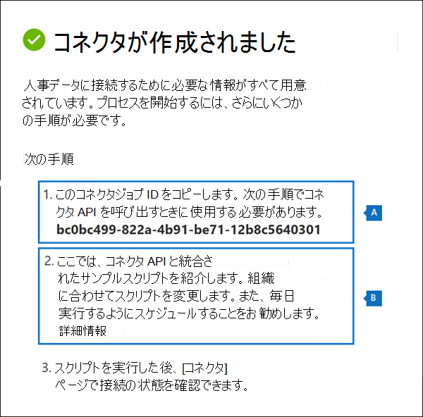
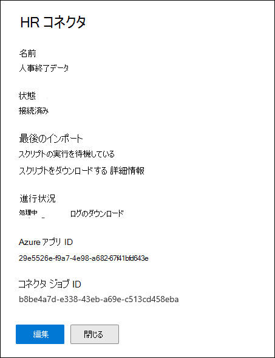
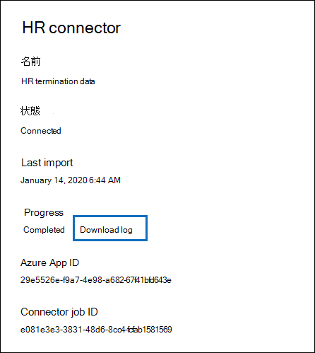
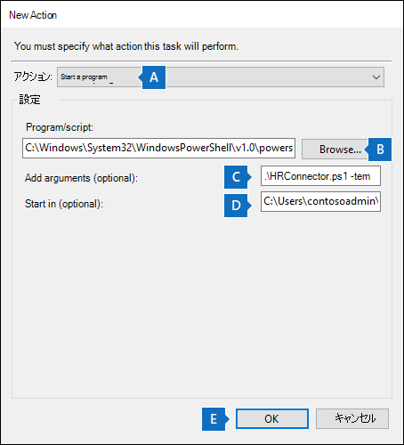
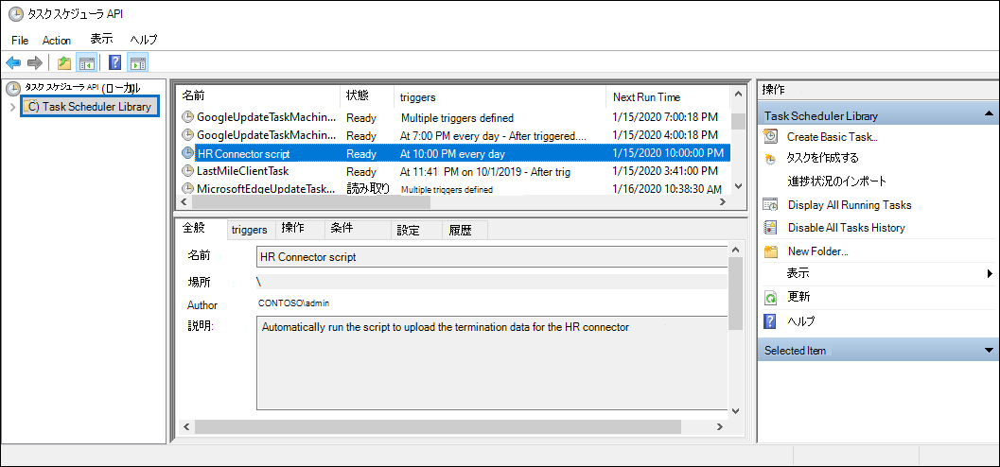

# <a name="set-up-a-connector-to-import-hr-data"></a>コネクタをセットアップして人事データをインポートする

Microsoft 365 コンプライアンス センター でデータ コネクタを設定して、ユーザーの辞任やユーザーのジョブ レベルの変更などのイベントに関連する人事 (HR) データをインポートできます。 その後、人事データをインサイダー[](insider-risk-management.md)リスク管理ソリューションで使用して、組織内のユーザーによる悪意のあるアクティビティやデータ盗難の可能性を特定するのに役立つリスク指標を生成できます。

インサイダーリスク管理ポリシーがリスク指標を生成するために使用できる人事データのコネクタをセットアップするには、人事データを含む CSV ファイルを作成し、認証に使用される Azure Active Directory でアプリを作成し、Microsoft 365 コンプライアンス センター で HR データ コネクタを作成し、CSV ファイル内の HR データを Microsoft クラウドに取り込むスクリプトを実行して、インサイダー リスク管理ソリューションで利用できます。

## <a name="before-you-begin"></a>はじめに

- ユーザーにインポートする人事シナリオとデータを決定Microsoft 365。 これにより、作成する必要がある CSV ファイルと HR コネクタの数、および CSV ファイルを生成および構成する方法を決定できます。 インポートする HR データは、実装するインサイダー リスク管理ポリシーによって決まります。 詳細については、「手順 1」を参照してください。

- 組織の人事システムから (および定期的に) データを取得またはエクスポートする方法を決定し、手順 1 で作成した CSV ファイルに追加します。 手順 4 で実行するスクリプトは、CSV ファイル内の HR データを Microsoft クラウドにアップロードします。

- 手順 3 で HR コネクタを作成するユーザーには、メールボックスのインポート エクスポートの役割が割り当てられている必要Exchange Online。 既定では、この役割は Exchange Online のどの役割グループにも割り当てられていません。 [メールボックスのインポートエクスポート] 役割は、組織の [組織の管理] 役割グループに追加Exchange Online。 または、新しい役割グループを作成し、メールボックスインポートエクスポートの役割を割り当て、適切なユーザーをメンバーとして追加できます。 詳細については、「グループ内の[役割グループを](/Exchange/permissions-exo/role-groups#create-role-groups)管理[](/Exchange/permissions-exo/role-groups#modify-role-groups)する」の「役割グループの作成」または「役割グループの変更」セクションを参照Exchange Online。

- 手順 4 で実行するサンプル スクリプトは、人事データを Microsoft クラウドにアップロードして、インサイダー リスク管理ソリューションで使用できます。 このサンプル スクリプトは、Microsoft 標準サポート プログラムまたはサービスではサポートされていません。 サンプル スクリプトは現状のまま提供され、いかなる保証も伴いません。 さらに、Microsoft は、商品性、特定目的への適合性の黙示の保証を含む、一切の黙示の保証をいたしかねます。 本サンプル スクリプトおよびドキュメントの使用または性能に起因するすべてのリスクは、お客様が負うものとします。 サンプル スクリプトおよびドキュメントを使用したこと、または使用できなかったことに伴って生じるいかなる損害 (業務利益の損失、業務の中断、業務情報の損失、金銭上の損失、その他一切の損害) についても、Microsoft、Microsoft に帰属する作者、スクリプトの作成、製造、または納入に関与したその他のすべての人員は、いかなる場合も責めを負わないものとします。

## <a name="step-1-prepare-a-csv-file-with-your-hr-data"></a>手順 1: 人事データを使用して CSV ファイルを準備する

最初の手順は、コネクタがインポートする HR データを含む CSV ファイルを作成Microsoft 365。 このデータは、潜在的なリスク指標を生成するためにインサイダー リスク ソリューションによって使用されます。 次の人事シナリオのデータは、次の人事シナリオにMicrosoft 365。

- 従業員の辞任。 組織を離したユーザーに関する情報。

- ジョブ レベルの変更。 昇格や降格など、ユーザーのジョブ レベルの変更に関する情報。

- パフォーマンスレビュー。 ユーザーのパフォーマンスに関する情報。

- パフォーマンス向上計画。 ユーザーのパフォーマンス向上計画に関する情報。

インポートする HR データの種類は、インサイダー リスク管理ポリシーと、実装する対応するポリシー テンプレートによって異なります。 次の表に、各ポリシー テンプレートに必要な HR データ型を示します。

|  ポリシー テンプレート |  HR データ型 |
|:-----------------------------------------------|:---------------------------------------------------------------------|
| 離職するユーザーによるデータ盗難                   | 従業員の辞任                                                 |
| 一般的なデータ漏洩                              | 該当なし                                                        |
| 優先ユーザーによるデータ漏洩                    | 該当なし                                                        |
| 不満を持つユーザーによるデータ漏洩                 | ジョブ レベルの変更、パフォーマンスレビュー、パフォーマンス向上計画 |
| 一般的なセキュリティ ポリシー違反              | 該当なし                                                        |
| 離職するユーザーによるセキュリティ ポリシー違反   | 従業員の辞任                                                 |
| 優先ユーザーによるセキュリティ ポリシー違反    | 該当なし                                                        |
| 不満を持つユーザーによるセキュリティ ポリシー違反 | ジョブ レベルの変更、パフォーマンスレビュー、パフォーマンス向上計画 |
| メールの不快な言葉                     | 該当なし                                                        |

インサイダー リスク管理のポリシー テンプレートの詳細については、「Insider リスク管理ポリシー [」を参照してください](insider-risk-management-policies.md#policy-templates)。

人事シナリオごとに、対応する HR データを 1 つ以上の CSV ファイルに指定する必要があります。 インサイダー リスク管理の実装に使用する CSV ファイルの数については、このセクションで後で説明します。

必要な人事データを含む CSV ファイルを作成した後、手順 4 でスクリプトを実行するローカル コンピューターに保存します。 また、スクリプトを実行する場合は、最新の人事データが Microsoft クラウドにアップロードされ、インサイダー リスク管理ソリューションにアクセス可能な状態で CSV ファイルに常に最新の情報が含まれることを確認する更新戦略を実装する必要があります。

> [!IMPORTANT]
> 次のセクションで説明する列名は必須パラメーターではなく、例のみです。 CSV ファイルには任意の列名を使用できます。 ただし、手順 3 で HRコネクタを作成する場合は、CSV ファイルで使用する列名をデータ型にマップする必要があります。 また、次のセクションのサンプル CSV ファイルは NotePad ビューに表示されます。 ファイル内の CSV ファイルを表示および編集する方がMicrosoft Excel。

以下のセクションでは、人事シナリオごとに必要な CSV データについて説明します。

### <a name="csv-file-for-employee-resignation-data"></a>従業員辞職データの CSV ファイル

従業員の辞任データの CSV ファイルの例を次に示します。

```text
EmailAddress,ResignationDate,LastWorkingDate
sarad@contoso.com,2019-04-23T15:18:02.4675041+05:30,2019-04-29T15:18:02.4675041+05:30
pilarp@contoso.com,2019-04-24T09:15:49Z,2019-04-29T15:18:02.7117540
```

次の表では、従業員の辞任データの CSV ファイル内の各列について説明します。

|  列   |   説明 |
|:------------|:----------------|
|**EmailAddress**| 終了したユーザーの電子メール アドレス (UPN) を指定します。|
| **ResignationDate** | ユーザーの雇用が組織で正式に終了した日付を指定します。 たとえば、これは、ユーザーが組織を離れる通知を行った日付です。 この日付は、その人の最終作業日の日付とは異なる場合があります。 次の日付形式を使用 `yyyy-mm-ddThh:mm:ss.nnnnnn+|-hh:mm` します。これは [ISO 8601 の日付と時刻の形式です](https://www.iso.org/iso-8601-date-and-time-format.html)。|
| **LastWorkingDate** | 終了したユーザーの作業の最終日を指定します。 次の日付形式を使用 `yyyy-mm-ddThh:mm:ss.nnnnnn+|-hh:mm` します。これは [ISO 8601 の日付と時刻の形式です](https://www.iso.org/iso-8601-date-and-time-format.html)。|
|||

### <a name="csv-file-for-job-level-changes-data"></a>ジョブ レベルの CSV ファイルがデータを変更する

ジョブ レベルの変更データの CSV ファイルの例を次に示します。

```text
EmailAddress,EffectiveDate,OldLevel,NewLevel
sarad@contoso.com,2019-04-23T15:18:02.4675041+05:30,Level 61 – Sr. Manager,Level 60- Manager
pillar@contoso.com,2019-04-23T15:18:02.4675041+05:30,Level 62 – Director,Level 60- Sr. Manager
```

次の表に、ジョブ レベルの変更データの CSV ファイル内の各列について説明します。

|  列 | 説明 |
|:--------- |:------------- |
| **EmailAddress**  | ユーザーの電子メール アドレス (UPN) を指定します。|
| **EffectiveDate** | ユーザーのジョブ レベルが正式に変更された日付を指定します。 次の日付形式を使用 `yyyy-mm-ddThh:mm:ss.nnnnnn+|-hh:mm` します。これは [ISO 8601 の日付と時刻の形式です](https://www.iso.org/iso-8601-date-and-time-format.html)。|
| **注釈**| ジョブ レベルの変更に関してエバリュエーターが提供した注釈を指定します。 200 文字の制限を入力できます。 このパラメーターは省略可です。 CSV ファイルに含める必要はない。|
| **OldLevel**| 変更前のユーザーのジョブ レベルを指定します。 これはフリーテキスト パラメーターであり、組織の階層分類を含めできます。 このパラメーターは省略可です。 CSV ファイルに含める必要はない。|
| **NewLevel**| 変更後のユーザーのジョブ レベルを指定します。 これはフリーテキスト パラメーターであり、組織の階層分類を含めできます。 このパラメーターは省略可です。 CSV ファイルに含める必要はない。|
|||

### <a name="csv-file-for-performance-review-data"></a>パフォーマンス レビュー データ用の CSV ファイル

パフォーマンス データ用の CSV ファイルの例を次に示します。

```text
EmailAddress,EffectiveDate,Remarks,Rating
sarad@contoso.com,2019-04-23T15:18:02.4675041+05:30,Met expectations but bad attitude,2-Below expectation
pillar@contoso.com,2019-04-23T15:18:02.4675041+05:30, Multiple conflicts with the team
```

次の表に、パフォーマンス レビュー データの CSV ファイル内の各列について説明します。

|  列 | 説明 |
|:----------|:--------------|
| **EmailAddress**  | ユーザーの電子メール アドレス (UPN) を指定します。|
| **EffectiveDate** | パフォーマンス レビューの結果についてユーザーに正式に通知された日付を指定します。 これは、パフォーマンス レビュー サイクルが終了した日付を指定できます。 次の日付形式を使用 `yyyy-mm-ddThh:mm:ss.nnnnnn+|-hh:mm` します。これは [ISO 8601 の日付と時刻の形式です](https://www.iso.org/iso-8601-date-and-time-format.html)。|
| **注釈**| エバリュエーターがパフォーマンス レビューのためにユーザーに提供した注釈を指定します。 これは、200 文字の制限を持つテキスト パラメーターです。 このパラメーターは省略可です。 CSV ファイルに含める必要はない。|
| **評価**| パフォーマンス レビューに提供される評価を指定します。 これはテキスト パラメーターであり、評価を認識するために組織が使用する自由形式のテキストを含めできます。 たとえば、"3 Met expectations" または "2 Below average" などです。 これは、25 文字の制限を持つテキスト パラメーターです。 このパラメーターは省略可です。 CSV ファイルに含める必要はない。|
|||

### <a name="csv-file-for-performance-improvement-plan-data"></a>パフォーマンス向上計画データ用の CSV ファイル

パフォーマンス向上計画データのデータの CSV ファイルの例を次に示します。

```text
EmailAddress,EffectiveDate,ImprovementRemarks,PerformanceRating
sarad@contoso.com,2019-04-23T15:18:02.4675041+05:30,Met expectation but bad attitude,2-Below expectation
pillar@contoso.com,2019-04-23T15:18:02.4675041+05:30, Multiple conflicts with the team
```

次の表に、パフォーマンス レビュー データの CSV ファイル内の各列について説明します。

|  列 |  説明 |
|:----------|:---------------|
| **EmailAddress**  | ユーザーの電子メール アドレス (UPN) を指定します。|
| **EffectiveDate** | ユーザーがパフォーマンス向上計画について正式に通知された日付を指定します。 次の日付形式を使用する必要 `yyyy-mm-ddThh:mm:ss.nnnnnn+|-hh:mm` [があります。これは、ISO 8601 の日付と時刻の形式です](https://www.iso.org/iso-8601-date-and-time-format.html)。|
| **注釈**| パフォーマンス向上計画に関してエバリュエーターが提供した注釈を指定します。 これは、200 文字の制限を持つテキスト パラメーターです。 このパラメーターは省略可能です。 CSV ファイルに含める必要はない。 |
| **評価**| パフォーマンス レビューに関連する評価または他の情報を指定します。 パフォーマンス向上計画。 これはテキスト パラメーターであり、評価を認識するために組織が使用する自由形式のテキストを含めできます。 たとえば、"3 Met expectations" または "2 Below average" などです。 これは、25 文字の制限を持つテキスト パラメーターです。 このパラメーターは省略可能です。 CSV ファイルに含める必要はない。|
|||

### <a name="determining-how-many-csv-files-to-use-for-hr-data"></a>人事データに使用する CSV ファイルの数の決定

手順 3 では、HR データ型ごとに個別のコネクタを作成するか、すべてのデータ型に対して 1 つのコネクタを作成することもできます。 1 つの HR シナリオのデータを含む個別の CSV ファイルを使用できます (前のセクションで説明した CSV ファイルの例など)。 または、2 つ以上の人事シナリオのデータを含む 1 つの CSV ファイルを使用することもできます。 人事データに使用する CSV ファイルの数を決定するためのガイドラインを次に示します。

- 実装するインサイダー リスク管理ポリシーで複数の HR データ型が必要な場合は、必要なすべてのデータ型を含む 1 つの CSV ファイルを使用してください。

- HR データを生成または収集する方法によって、CSV ファイルの数が決定される場合があります。 たとえば、HR コネクタの構成に使用されるさまざまな種類の HR データが組織内の 1 つの HR システムにある場合、データを 1 つの CSV ファイルにエクスポートできる場合があります。 ただし、データが異なる人事システムに分散されている場合は、データを別の CSV ファイルにエクスポートする方が簡単な場合があります。 たとえば、従業員の辞任データは、ジョブ レベルまたはパフォーマンス レビュー データとは異なる人事システムに含めさせることができます。 この場合、データを手動で 1 つの CSV ファイルに結合するよりも、別の CSV ファイルを使用する方が簡単な場合があります。 したがって、人事システムからデータを取得またはエクスポートする方法によって、必要な CSV ファイルの数がどのように決定される可能性があります。

- 一般的なルールとして、作成する必要がある HR コネクタの数は、CSV ファイル内のデータ型によって決まります。 たとえば、インサイダー リスク管理の実装をサポートするために必要なすべてのデータ型が CSV ファイルに含まれている場合、必要な HR コネクタは 1 つのみです。 ただし、それぞれ 1 つのデータ型を含む 2 つの個別の CSV ファイルがある場合は、2 つの HR コネクタを作成する必要があります。 例外として **、HRScenario** 列を CSV ファイルに追加する場合 (次のセクションを参照)、異なる CSV ファイルを処理できる単一の HR コネクタを構成できます。

### <a name="configuring-a-single-csv-file-for-multiple-hr-data-types"></a>複数の HR データ型用に 1 つの CSV ファイルを構成する

1 つの CSV ファイルに複数の HR データ型を追加できます。 これは、実装するインサイダー リスク管理ソリューションで複数の人事データ型が必要な場合、またはデータ型が組織内の 1 つの人事システムに含まれる場合に便利です。 CSV ファイルを少なくすると、作成および管理する HR コネクタの数が少なくなっています。

複数のデータ型を使用して CSV ファイルを構成するための要件を次に示します。

- 各データ型とヘッダー行の対応する列名に必要な列 (および使用する場合は省略可能) を追加する必要があります。 データ型が列に対応しない場合は、値を空白のままにできます。

- 複数の種類の HR データを含む CSV ファイルを使用するには、CSV ファイル内のどの行にどの種類の HR データが含まれているのか、HR コネクタが知る必要があります。 これは、CSV ファイルに **追加の HRScenario 列** を追加することで実現されます。 この列の値は、各行の HR データの種類を識別します。 たとえば、4 つの人事シナリオに対応する値は、辞任、ジョブ レベルの変更、パフォーマンスの確認、および \` \` パフォーマンス向上 \` \` \` \` \` 計画です \` 。

- HRScenario** 列を含む複数の CSV ファイルがある場合は、各ファイルで特定の HR シナリオを識別する同じ列名と同じ値を使用してください。

次の例は **、HRScenario** 列を含む CSV ファイルを示しています。 HRScenario 列の値は、対応する行のデータの種類を識別します。

```text
HRScenario,EmailAddress,ResignationDate,LastWorkingDate,EffectiveDate,Remarks,Rating,OldLevel,NewLevel
Resignation,sarad@contoso.com,2019-04-23T15:18:02.4675041+05:30,2019-04-29T15:18:02.4675041+05:30,,,,
Resignation,pilarp@contoso.com,2019-04-24T09:15:49Z,2019-04-29T15:18:02.7117540,,,,
Job level change,sarad@contoso.com,2019-04-23T15:18:02.4675041+05:30,,,,,Level 61 Sr. Manager, Level 60 Manager
Job level change,pillarp@contoso.com,2019-04-23T15:18:02.4675041+05:30,,,,,Level 62 Director,Level 60 Sr Manager
Performance review,sarad@contoso.com,,,2019-04-23T15:18:02.4675041+05:30,Met expectation but bad attitude,2 Below expectations,,
Performance review,pillarp@contoso.com,,,2019-04-23T15:18:02.4675041+05:30, Multiple conflicts with the team,,
Performance improvement plan,sarad@contoso.com,,,2019-04-23T15:18:02.4675041+05:30,Met expectations but bad attitude,2 Below expectations,,
Performance improvement plan,pillarp@contoso.com,,,2019-04-23T15:18:02.4675041+05:30,Multiple conflicts with the team,,
```

> [!NOTE]
> 手順 3 でコネクタをセットアップするときに、CSV ファイル内の列の名前を HR データ型を識別する列としてマップしますので、HR データ型を識別する列には任意の名前を使用できます。 コネクタをセットアップするときに、データ型列に使用される値もマップされます。

### <a name="adding-the-hrscenario-column-to-a-csv-file-that-contains-a-single-data-type"></a>単一のデータ型を含む CSV ファイルに HRScenario 列を追加する

組織の人事システムと、HR データを CSV ファイルにエクスポートする方法に基づいて、1 つの HR データ型を含む複数の CSV ファイルを作成する必要がある場合があります。 この場合も、1 つの HR コネクタを作成して、異なる CSV ファイルからデータをインポートできます。 これを行うには、CSV ファイルに HRScenario 列を追加し、HR データ型を指定する必要があります。 次に、CSV ファイルごとにスクリプトを実行できますが、コネクタには同じジョブ ID を使用します。 「手順 [4」を参照してください](#step-4-run-the-sample-script-to-upload-your-hr-data)。

## <a name="step-2-create-an-app-in-azure-active-directory"></a>手順 2: アプリをアプリで作成Azure Active Directory

次の手順では、新しいアプリを作成し、アプリに登録Azure Active Directory (Azure AD)。 アプリは、手順 3 で作成した HR コネクタに対応します。 このアプリを作成すると、Azure ADが実行され、組織にアクセスしようとするときに HR コネクタを認証できます。 このアプリは、手順 4 で実行したスクリプトを認証して、人事データを Microsoft クラウドにアップロードするためにも使用されます。 この Azure ADアプリの作成中に、必ず次の情報を保存してください。 これらの値は、手順 3 および手順 4 で使用されます。

- Azure ADアプリケーション ID (アプリ *ID* またはクライアント *ID とも呼ばれる*)

- Azure AD アプリケーション シークレット (クライアント シークレットとも *呼ばれる*)

- テナント ID (ディレクトリ *ID とも呼ばれる*)

Azure AD でアプリを作成する手順については、「アプリケーションをアプリに登録する」[を参照](/azure/active-directory/develop/quickstart-register-app)Microsoft ID プラットフォーム。

## <a name="step-3-create-the-hr-connector"></a>手順 3: HR コネクタを作成する

次の手順では、HR コネクタを作成します。Microsoft 365 コンプライアンス センター。 手順 4 でスクリプトを実行すると、作成する HR コネクタが CSV ファイルから組織に HR データMicrosoft 365されます。 コネクタを作成する前に、HR シナリオの一覧と各シナリオに対応する CSV 列名が含まれています。 コネクタを構成する場合は、各シナリオに必要なデータを CSV ファイルの実際の列名にマップする必要があります。 または、コネクタを構成するときにサンプル CSV ファイルをアップロードし、ウィザードを使用すると、列の名前を必要なデータ型にマップできます。

この手順を完了したら、コネクタの作成時に生成されるジョブ ID を必ずコピーしてください。 スクリプトの実行時にジョブ ID を使用します。

1. に移動 [https://compliance.microsoft.com](https://compliance.microsoft.com/) し、左側の **ナビゲーションで [** データ コネクタ] をクリックします。

2. [人事]**の [データ コネクタ] ページ****で、[表示**] を **クリックします**。

3. [HR ユーザー **設定] ページで** 、[コネクタの追加 **] をクリックします**。

4. [接続の **セットアップ] ページで** 、次の操作を行い、[次へ] を **クリックします**。

   1. 手順 2 で作成AD Azure アプリの Azure アプリケーション ID を入力または貼り付けます。

   1. HR コネクタの名前を入力します。

5. [人事シナリオ] ページで、データをインポートする 1 つ以上の人事シナリオを選択し、[次へ] を **クリックします**。

6. [ファイル マッピング方法] ページで、次のいずれかのオプションを選択し、[次へ] を **クリックします**。

   - **アップロード ファイルを作成します**。 このオプションを選択した場合は、[サンプル ファイルアップロード **クリック** して、手順 1 で準備した CSV ファイルをアップロードします。 このオプションを使用すると、CSV ファイル内の列名をドロップダウン リストからすばやく選択して、以前に選択した HR シナリオのデータ型にマップできます。

   または

   - **マッピングの詳細を手動で指定します**。 このオプションを選択する場合は、CSV ファイルに列の名前を入力して、以前に選択した人事シナリオのデータ型にマップする必要があります。

7. [ファイル マッピングの詳細] ページで、サンプル CSV ファイルをアップロードしたかどうか、および単一の人事シナリオまたは複数のシナリオに対してコネクタを構成するかどうかに応じて、次のいずれかを実行します。 サンプル ファイルをアップロードした場合は、列名を入力する必要があります。 ドロップダウン リストから選択します。

    - 前の手順で 1 つの HR シナリオを選択した場合は、手順 1 で作成した CSV ファイルの列ヘッダー名 ( *パラメーターとも呼* ばれる) を各適切なボックスに入力します。 入力する列名は大文字と小文字を区別しませんが、CSV ファイル内の列名にスペースが含まれている場合は、必ずスペースを含める必要があります。 前に説明したように、これらのボックスに入力する名前は、CSV ファイル内のパラメーター名と一致する必要があります。 たとえば、次のスクリーンショットは、手順 1 に示す従業員辞任 HR シナリオのサンプル CSV ファイルのパラメーター名を示しています。

    - 上記の手順で複数のデータ型を選択した場合は、CSV ファイル内の HR データ型を識別する識別子列名を入力する必要があります。 識別子列名を入力した後、この HR データ型を識別する値を入力し、手順 1 で作成した CSV ファイルから選択したデータ型の列ヘッダー名を、選択した各データ型の適切なボックスに入力します。 前に説明したように、これらのボックスに入力する名前は、CSV ファイル内の列名と一致する必要があります。

8. [確認 **] ページで** 設定を確認し、[完了] を **クリックして** コネクタを作成します。

   コネクタが作成されたのを確認する状態ページが表示されます。 このページには、HR データをアップロードするためにサンプル スクリプトを実行する次の手順を完了するために必要な 2 つの重要な点が含まれている。

   

   1. **ジョブ ID。** 次の手順でスクリプトを実行するには、このジョブ ID が必要です。 このページまたはコネクタ のフライアウト ページからコピーできます。

   1. **サンプル スクリプトへのリンク。** サンプル スクリプト **にアクセス** するには、GitHubリンクをクリックします (リンクによって新しいウィンドウが開きます)。 手順 4 でスクリプトをコピーできるよう、このウィンドウを開いた状態にしてください。 または、スクリプトの実行時にもう一度アクセスできるよう、コピー先をブックマークするか、URL をコピーすることもできます。 このリンクは、コネクタ のフライアウト ページでも使用できます。

9. **[完了]** をクリックします。

   新しいコネクタが [コネクタ] タブの一覧 **に表示** されます。

10. 作成した HR コネクタをクリックして、コネクタに関するプロパティや他の情報を含むフライアウト ページを表示します。

   

まだ実行していない場合は **、Azure App ID** と Connector ジョブ ID の値 **をコピーできます**。 次の手順でスクリプトを実行するには、これらを実行する必要があります。 スクリプトは、フライアウト ページからダウンロードすることもできます (または、次の手順のリンクを使用してダウンロードすることもできます)。

[編集] を **クリック** して、Azure App ID または [ファイル マッピング] ページで定義した列ヘッダー名 **を変更** することもできます。

## <a name="step-4-run-the-sample-script-to-upload-your-hr-data"></a>手順 4: サンプル スクリプトを実行して HR データをアップロードする

HR コネクタをセットアップする最後の手順は、CSV ファイル (手順 1 で作成した) の HR データを Microsoft クラウドにアップロードするサンプル スクリプトを実行することです。 具体的には、スクリプトはデータを HR コネクタにアップロードします。 スクリプトを実行すると、手順 3 で作成した HR コネクタが人事データを Microsoft 365 組織にインポートし、Insider リスク管理ソリューションなどの他のコンプライアンス ツールからアクセスできます。 スクリプトを実行した後、タスクをスケジュールして毎日自動的に実行し、最新の従業員終了データが Microsoft クラウドにアップロードされるのを検討してください。 「スクリプト [を自動的に実行するスケジュールを設定する」を参照してください](#optional-step-6-schedule-the-script-to-run-automatically)。

1. 前の手順で開いたウィンドウに移動し、サンプル スクリプトを使用してGitHubサイトにアクセスします。 または、ブックマークされたサイトを開くか、コピーした URL を使用します。

2. [Raw] **ボタンを** クリックして、スクリプトをテキスト ビューに表示します。

3. サンプル スクリプト内のすべての行をコピーし、テキスト ファイルに保存します。

4. 必要に応じて、組織のサンプル スクリプトを変更します。

5. ファイル名のサフィックスを使用Windows PowerShellスクリプト ファイルとしてテキスト ファイルを保存します `.ps1` 。たとえば、 `HRConnector.ps1` 。

6. ローカル コンピューターでコマンド プロンプトを開き、スクリプトを保存したディレクトリに移動します。

7. 次のコマンドを実行して、CSV ファイル内の HR データを Microsoft クラウドにアップロードします。例えば：

    ```powershell
    .\HRConnector.ps1 -tenantId <tenantId> -appId <appId>  -appSecret <appSecret>  -jobId <jobId>  -csvFilePath '<csvFilePath>'
    ```

   次の表では、このスクリプトで使用するパラメーターとその必要な値について説明します。 前の手順で取得した情報は、これらのパラメーターの値で使用されます。

   | パラメーター | 説明 |
   |:-----|:-----|:-----|
   |`tenantId`|これは、手順 2 で取得Microsoft 365組織の ID です。 組織のテナント ID は、Azure 管理センターの [概要] ブレードADすることもできます。 これは、組織を識別するために使用されます。|
   |`appId` |これは、手順 2 で Azure ADで作成したアプリの Azure AD ID です。 これは、スクリプトが組織ADアクセスしようとするときに、Azure Microsoft 365によってMicrosoft 365されます。 | 
   |`appSecret`|これは、手順 2 で Azure ADで作成したアプリの Azure ADアプリケーション シークレットです。 これは、認証にも使用されます。|
   |`jobId`|これは、手順 3 で作成した HR コネクタのジョブ ID です。 これは、Microsoft クラウドにアップロードされた HR データを HR コネクタに関連付ける場合に使用します。|
   |`csvFilePath`|これは、手順 1 で作成した CSV ファイル (スクリプトと同じシステムに格納されている) のファイル パスです。 ファイル パス内のスペースを避けるようにします。それ以外の場合は、単一引用符を使用します。|
   |||

   各パラメーターの実際の値を使用する HR コネクタ スクリプトの構文の例を次に示します。

   ```powershell
    .\HRConnector.ps1 -tenantId d5723623-11cf-4e2e-b5a5-01d1506273g9 -appId 29ee526e-f9a7-4e98-a682-67f41bfd643e -appSecret MNubVGbcQDkGCnn -jobId b8be4a7d-e338-43eb-a69e-c513cd458eba -csvFilePath 'C:\Users\contosoadmin\Desktop\Data\employee_termination_data.csv'
    ```

   アップロードが成功した場合、スクリプトは成功したメッセージアップロード **表示** します。

   > [!NOTE]
   > 実行ポリシーのために前のコマンドを実行する際に問題がある場合は、「実行[](/powershell/module/microsoft.powershell.core/about/about_execution_policies)ポリシーについて」および[「Set-ExecutionPolicy」](/powershell/module/microsoft.powershell.security/set-executionpolicy)を参照して、実行ポリシーの設定に関するガイダンスを参照してください。

## <a name="step-5-monitor-the-hr-connector"></a>手順 5: HR コネクタを監視する

HR コネクタを作成し、スクリプトを実行して HR データをアップロードした後、コネクタを表示し、そのコネクタの状態をアップロードMicrosoft 365 コンプライアンス センター。 スクリプトを定期的に自動的に実行するスケジュールを設定した場合は、前回スクリプトを実行した後に現在の状態を表示することもできます。

1. 左側の [https://compliance.microsoft.com](https://compliance.microsoft.com) ナビゲーションで [ **データ コネクタ] に** 移動してクリックします。

2. [コネクタ **] タブをクリック** し、HR コネクタを選択して、フライアウト ページを表示します。 このページには、コネクタに関するプロパティと情報が含まれる。

   

3. [ **進行状況]** で、[ログのダウンロード **] リンクを** クリックして、コネクタの状態ログを開く (または保存) します。 このログには、スクリプトが実行され、CSV ファイルから Microsoft クラウドにデータをアップロードする度に関する情報が含まれます。 

   

   この `RecordsSaved` フィールドは、アップロードされた CSV ファイル内の行数を示します。 たとえば、CSV ファイルに 4 行が含まれている場合、スクリプトが CSV ファイル内のすべての行を正常にアップロードした場合、フィールドの値は `RecordsSaved` 4 になります。

手順 4 でスクリプトを実行していない場合、スクリプトをダウンロードするリンクが [最後のインポート] の下 **に表示されます**。 スクリプトをダウンロードし、手順に従ってスクリプトを実行できます。

## <a name="optional-step-6-schedule-the-script-to-run-automatically"></a>(省略可能)手順 6: スクリプトを自動的に実行するスケジュールを設定する

組織の最新の人事データをインサイダー リスク管理ソリューションなどのツールで利用するには、スクリプトを 1 日に 1 回など定期的に自動的に実行するようにスケジュールすることをお勧めします。 また、CSV ファイル内の HR データを同様のスケジュール (同じではない場合) に更新して、組織を離れる従業員に関する最新情報が含まれる必要があります。 目標は、最新の人事データをアップロードして、HR コネクタがインサイダー リスク管理ソリューションで利用できるようすることです。

タスク スケジューラ アプリを使用すると、Windowsスクリプトを自動的に実行できます。

1. ローカル コンピューターで、[スタート] ボタンをクリックWindows **タスク** スケジューラと **入力します**。

2. タスク スケジューラ **アプリをクリック** して開きます。

3. [アクション] **セクションで** 、[タスクの作成] **をクリックします**。

4. [全般 **] タブ** で、スケジュールされたタスクのわかりやすい名前を入力します。たとえば **、HR Connector Script**. オプションの説明を追加できます。

5. [セキュリティ **オプション] で**、次の操作を行います。

   1. コンピューターにログオンしている場合にのみスクリプトを実行するか、ログオンしていないときに実行するかどうかを決定します。

   1. [最高の権限で **実行する] チェック ボックスが** オンになっていることを確認します。

6. [トリガー] **タブを選択** し、[ **新規**] をクリックし、次の操作を行います。

   1. **[設定]** で [**日** 次] オプションを選択し、スクリプトを初めて実行する日時を選択します。 スクリプトは、毎日同じ指定された時刻に実行されます。

   1. [ **詳細設定] で**、[有効] **チェック ボックスが** オンになっていることを確認します。

   1. [**OK**] をクリックします。

7. [操作] **タブを** 選択し、[ **新規**] をクリックし、次の操作を行います。

   

   1. [アクション **] ドロップダウン** リストで、[プログラムの開始 **] が選択されている** 必要があります。

   1. [プログラム **/スクリプト] ボックスで** 、[ **参照**] をクリックし、次の場所に移動して選択して、パスがボックスに表示されます `C:\Windows\System32\WindowsPowerShell\v1.0\powershell.exe` 。

   1. [引数 **の追加 (オプション)]** ボックスに、手順 4 で実行したのと同じスクリプト コマンドを貼り付けます。 たとえば、`.\HRConnector.ps1 -tenantId "d5723623-11cf-4e2e-b5a5-01d1506273g9" -appId "c12823b7-b55a-4989-faba-02de41bb97c3" -appSecret "MNubVGbcQDkGCnn"  -jobId "e081f4f4-3831-48d6-7bb3-fcfab1581458" -csvFilePath "C:\Users\contosoadmin\Desktop\Data\employee_termination_data.csv"` のように指定します。

   1. [スタート **] (オプション) ボックス** に、手順 4 で実行したスクリプトのフォルダーの場所を貼り付けます。 たとえば、`C:\Users\contosoadmin\Desktop\Scripts` などです。

   1. **[OK] を** クリックして、新しいアクションの設定を保存します。

8. [タスクの **作成] ウィンドウで****、[OK] をクリックして**、スケジュールされたタスクを保存します。 ユーザー アカウントの資格情報の入力を求めるメッセージが表示される場合があります。

   新しいタスクがタスク スケジューラ ライブラリに表示されます。

   

   スクリプトが最後に実行された時刻と、次回の実行がスケジュールされている時間が表示されます。 タスクをダブルクリックして編集できます。

   コンプライアンス センターの対応する HR コネクタのフライアウト ページでスクリプトが最後に実行された時刻を確認することもできます。

## <a name="existing-hr-connectors"></a>既存の HR コネクタ

2020 年 7 月 20 日に、HR コネクタでサポートされる追加のシナリオがリリースされました。 これらは、この記事で以前に説明した人事シナリオです。 この日付より前に作成された HR コネクタは、Employee の辞任シナリオのみをサポートします。 2020 年 7 月 20 日より前に HR コネクタを作成した場合は、人事データを引き続き Microsoft クラウドに移行するために移行しました。 この機能を維持するために何もする必要はありません。 中断することなくコネクタを使用し続けできます。

追加の人事シナリオを実装する場合は、新しい HR コネクタを作成し、リリースされた追加の人事シナリオ用に構成してください。 また、追加の人事シナリオをサポートするために、データを含む 1 つ以上の新しい CSV ファイルを作成する必要があります。 新しい HR コネクタを作成した後、新しいコネクタのジョブ ID と CSV ファイルを使用して、追加の人事シナリオのデータを使用してスクリプトを実行します。