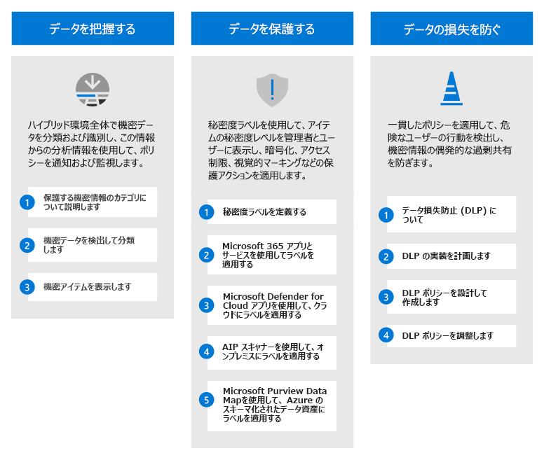
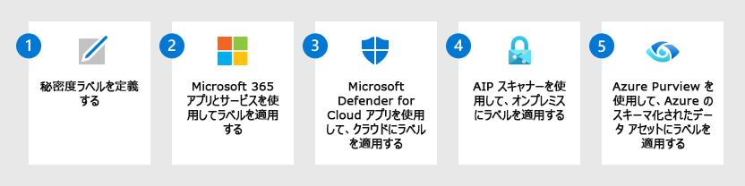
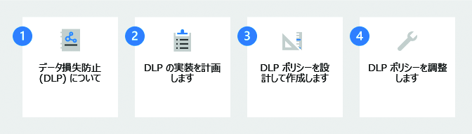

# Microsoft Purview を使用して情報保護ソリューションを展開する

>*[Microsoft 365 セキュリティとコンプライアンスのライセンス](/office365/servicedescriptions/microsoft-365-service-descriptions/microsoft-365-tenantlevel-services-licensing-guidance/microsoft-365-security-compliance-licensing-guidance)*

情報保護戦略は、ビジネス ニーズによって推進されます。 規制、法律、およびビジネス プラクティスに準拠する必要のある組織が多くあります。 さらに、組織は、特定のプロジェクトのデータなど、独自の情報を保護する必要があります。

Microsoft Purview の情報保護 (以前の Microsoft の情報保護) には、特定のビジネス目標を達成するために使用できるフレームワーク、プロセス、および機能が用意されています。 

## Microsoft Purview の情報保護フレームワーク

Microsoft Purview の情報保護を使用すれば、機密情報がどこに保存されていても、どこに移動されても、それらの情報の検出、分類、保護が可能になります。

次の Ignite セッションを見て、これらの機能がどのように相互にサポートされ、構築されているかをご覧ください。[Microsoft の情報保護を使ってデータを把握し、データを保護し、データ損失を防ぎます](https://myignite.microsoft.com/archives/IG20-OD273)。

データ ガバナンスについては、「[Microsoft Purview を使用してデータ ガバナンス ソリューションを展開する](data-governance-solution.md)」を参照してください。

## ライセンス

Microsoft Purview の情報保護機能は、Microsoft Purview に含まれています。 ライセンス要件は、構成オプションによって機能内であっても異なる場合があります。 ライセンスの要件とオプションを特定するには、[Microsoft 365 のセキュリティとコンプライアンス](/office365/servicedescriptions/microsoft-365-service-descriptions/microsoft-365-tenantlevel-services-licensing-guidance/microsoft-365-security-compliance-licensing-guidance)。

## データを把握する

機密性の高いデータが存在する場所を把握することは、多くの組織にとって最大の課題です。 Microsoft Purview の情報保護データ分類は、組織の作成する増え続けるデータを検出し、正確に分類するのに役立ちます。 グラフィカル表現は、このデータに関する分析情報を得るのに役立ちます。これにより、ポリシーを設定および監視して保護および管理できます。

|手順|説明|詳細情報|
|:---|:----------|:---------------|
|1| 保護する機密情報のカテゴリについて説明します。    組織にとって最も重要な情報の種類と、そうでない情報の種類は既に把握しています。 利害関係者と協力して、出発点となるこれらのカテゴリについて説明します。 | [機密情報の種類に関する詳細情報](sensitive-information-type-learn-about.md) 
 [トレーニング可能な分類子の詳細](classifier-learn-about.md)|
|2| 機密データを検出して分類します。    アイテム内の機密データは、既定の DLP ポリシー、ユーザーによる手動ラベル付け、機密情報の種類または機械学習を使用した自動パターン認識など、さまざまな方法を使用して見つけることができます。 | [データ分類の説明](data-classification-overview.md) 
 [ビデオ: コンプライアンス センターでのデータ分類](https://www.microsoft.com/videoplayer/embed/RE4vx8x)|
|3| 機密アイテムを表示します。     コンテンツ エクスプローラーとアクティビティ エクスプローラーを使用して、機密性の高いアイテムと、ユーザーがこれらのアイテムに対して実行しているアクションの詳細な分析を行います。| [コンテンツ エクスプローラーの使用を開始する](data-classification-content-explorer.md) 
 [アクティビティ エクスプローラーの使用を開始する](data-classification-activity-explorer.md)|

## データを保護する

機密データの場所を把握する情報を使用して、より効率的に保護します。 ただし、待機する必要はありません。手動、既定、自動のラベル付けを組み合わせてすぐにデータの保護を開始できます。 次に、前のセクションの[コンテンツ エクスプローラー](data-classification-content-explorer.md)と[アクティビティ エクスプローラー](data-classification-activity-explorer.md)を使用して、ラベル付けされる項目とラベルの使用方法を確認します。

|手順|説明|詳細情報|
|:---|-----------|:---------------|
| 1|[秘密度ラベル](sensitivity-labels.md)および組織のデータを保護するポリシーを定義します。   これらのラベルは、コンテンツの秘密度を識別するだけでなく、ヘッダー、フッター、透かし、暗号化などの保護アクションを適用できます。 | [秘密度ラベルの使用を開始する](get-started-with-sensitivity-labels.md)    [機密ラベルとそのポリシーを作成して構成する](create-sensitivity-labels.md)    [機密ラベルを使用して暗号化を適用しコンテンツへのアクセスを制限する](encryption-sensitivity-labels.md) |
| 2|Microsoft 365 Apps とサービスのアイテムにラベルを付け、保護します。   秘密度ラベルは、Microsoft 365 Word、Excel、PowerPoint、Outlook、および SharePoint サイトと OneDrive サイト、およびMicrosoft 365 グループを含むコンテナーでサポートされています。 手動ラベル付け、自動ラベル付け、既定のラベル付け、必須ラベル付けなどのラベル付け方法の組み合わせを使用します。| [Office アプリの秘密度ラベルを管理する](sensitivity-labels-office-apps.md)    [SharePoint および OneDrive で Office ファイルの機密ラベルを有効にする](sensitivity-labels-sharepoint-onedrive-files.md)    [機密度ラベルを使用して暗号化されたファイルの共同編集を有効にする](sensitivity-labels-coauthoring.md)    [秘密度ラベルをコンテンツに自動的に適用する](apply-sensitivity-label-automatically.md)    [Microsoft Teams、Microsoft 365 グループ、SharePoint サイトで秘密度ラベルを使用する](sensitivity-labels-teams-groups-sites.md)    [秘密度ラベルを使用して、SharePoint と OneDrive のサイトとドキュメントの既定の共有リンクを設定する](sensitivity-labels-default-sharing-link.md)    [Microsoft SharePoint Syntex のモデルに秘密度ラベルを適用する](/microsoft-365/contentunderstanding/apply-a-sensitivity-label-to-a-model)    [Power BI の秘密度ラベル](/power-bi/admin/service-security-sensitivity-label-overview) |
|3|秘密度ラベルで [Microsoft Defender for Cloud Apps](/cloud-app-security/what-is-cloud-app-security) を使用して、クラウド内のデータ ストアに存在する機密アイテムを検出、ラベル付け、保護します。| [クラウドに保存されている規制対象および機密データを検出、分類、ラベル付け、保護する](/cloud-app-security/best-practices#discover-classify-label-and-protect-regulated-and-sensitive-data-stored-in-the-cloud)|
|4|[Azure Information Protection 統合ラベル付けスキャナー](/azure/information-protection/deploy-aip-scanner)を秘密度ラベルと共に展開することで、オンプレミスのデータ ストアに存在する機密アイテムを検出、ラベル付け、保護します。| [Azure Information Protection 統合ラベル付けスキャナーの構成とインストール](/azure/information-protection/deploy-aip-scanner-configure-install)|
|5|[Microsoft Purview データ マップ](/azure/purview/overview)を使用して機密ラベルを Azure に拡張し、Azure Blob Storage、Azure ファイル、Azure Data Lake Storage Gen1、Azure Data Lake Storage Gen12 のアイテムを検出してラベル付けします。 | [Microsoft Purview データ マップでのラベル付け](/azure/purview/create-sensitivity-label)|

基幹業務アプリまたはサードパーティの SaaS アプリに秘密度ラベルを拡張しようとしている開発者は、「[Microsoft の情報保護 (MIP) SDK のセットアップと構成](/information-protection/develop/setup-configure-mip)」を参照してください。 

### 追加の保護機能

Microsoft Purview には、データを保護するための次の機能が含まれています。 すべてのお客様にとってこれらの機能が必要というわけではありません。また、一部のものは最新のリリースに置き換えられる可能性があります。

保護機能の完全なリストについては、「[Microsoft Purview でデータを保護する](information-protection.md)」ページを使用してください。

## データの損失を防止する

Microsoft Purview データ損失防止 (DLP) ポリシーを展開して、アプリやサービス間での機密データの不適切な共有、転送、または使用を管理および防止します。 これらのポリシーは、ユーザーが機密データを使用しているときに適切な意思決定を行い、適切なアクションを実行するのに役立ちます。

|手順|説明|詳細情報|
|:---|:----------|:---------------|
|1|データ損失防止 (DLP) について説明します。    組織は、財務データ、専有データ、クレジット カード番号、医療記録、社会保障番号などの機密情報を管理下に置いています。 これらの機密データを保護し、リスクを軽減するには、こうしたデータを保持するべきでないユーザーと不適切に共有できないようにする方法が必要です。 この方法は、データ損失防止 (DLP) と呼ばれます。| [データ損失防止について](dlp-learn-about-dlp.md)|
|2|DLP の実装を計画します。    すべての組織のビジネス ニーズ、目標、リソース、状況は各組織固有のものなので、それぞれに異なる方法でデータ損失防止 (DLP) を計画し、実装します。 ただし、成功したすべての DLP 実装に共通する要素があります。 | [データ損失防止ポリシーのサポート](dlp-overview-plan-for-dlp.md)|
|3|DLP ポリシーを設計して作成します。    データ損失防止 (DLP) ポリシーの作成はすばやく簡単ですが、多くの微調整を行う必要がある場合は、意図した結果を生成するポリシーを取得するのに時間がかかる場合があります。 ポリシーを実装する前に時間をかけて設計すると、試用版とエラーだけを使って微調整するよりも、目的となる結果を迅速に取得し、意図しない問題を少なくすることができます。| [DLP ポリシーを設計する](dlp-policy-design.md) 
 [DLP ポリシー リファレンス](dlp-policy-reference.md) 
[DLP ポリシーの作成、テスト、調整](create-test-tune-dlp-policy.md)|
|4|DLP ポリシーを調整します。    DLP ポリシーを展開すると、意図した目的をどの程度満たしているかがわかります。 その情報を使用して、パフォーマンスを向上させるためにポリシー設定を調整します。 | [DLP ポリシーの作成、テスト、調整](create-test-tune-dlp-policy.md)|

## トレーニング リソース

コンサルタントと管理者向けの学習モジュール:

- [Microsoft Purview での情報保護とデータ ライフサイクル管理の概要](/learn/modules/m365-compliance-information-governance)
- [保護とガバナンスのためにデータを分類する](/learn/modules/m365-compliance-information-classify-data)
- [Microsoft Purview で情報を保護する](/learn/modules/m365-compliance-information-protect-information)
- [Microsoft Purview でのデータ損失の防止](/learn/modules/m365-compliance-information-prevent-data-loss)

ユーザーに対して構成した秘密度ラベルを適用して使用するようにトレーニングするには、「[秘密度ラベルのユーザーのドキュメントを終了する](get-started-with-sensitivity-labels.md#end-user-documentation-for-sensitivity-labels)」を参照してください。

Teams にデータ損失防止ポリシーを展開すると、このテクノロジの概要としてエンド ユーザー ガイダンス「[データ損失防止 (DLP) および通信コンプライアンス ポリシーに関するメッセージ](https://support.microsoft.com/office/teams-messages-about-data-loss-prevention-dlp-and-communication-compliance-policies-c5631c3f-f61b-4306-a6ac-6603d9fc5ff0)」が役立つ場合があり、そこに発生し得るメッセージが記載されている可能性があります。
