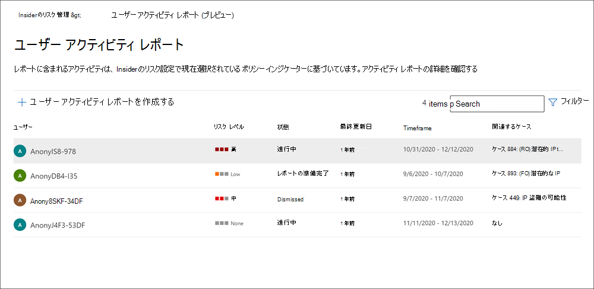
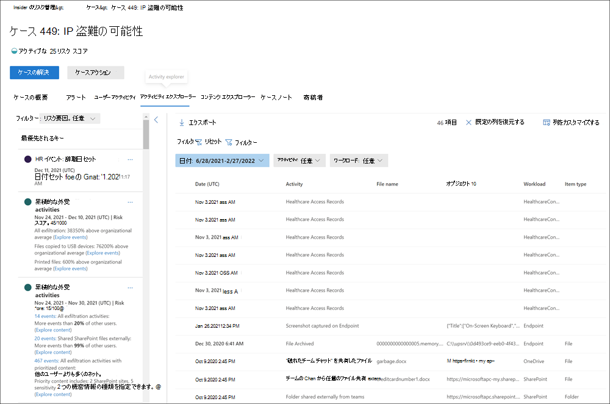
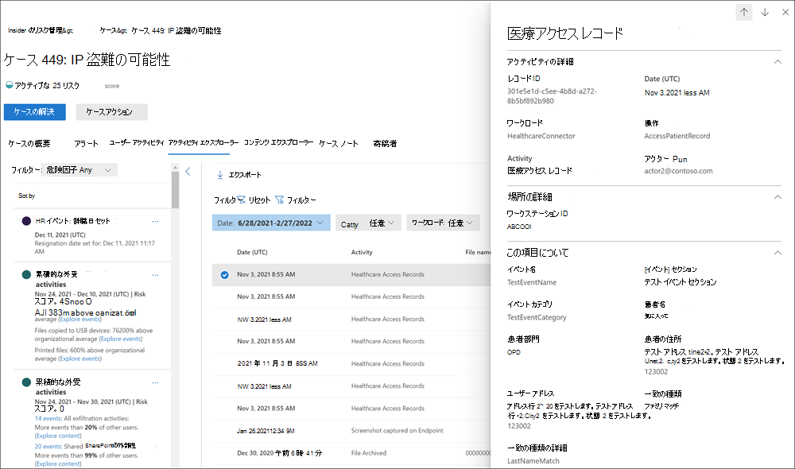

# インサイダー リスク管理アクティビティを調査する

リスクの高いユーザー アクティビティを調査することは、組織のインサイダー リスクを最小限に抑えるための重要な最初のステップです。 これらのリスクは、インサイダー リスク管理ポリシーからアラートを生成するアクティビティや、ポリシーによって検出されたが、ユーザーのインサイダー リスク管理アラートをすぐに作成しないアクティビティからのリスクである可能性があります。 これらの種類のアクティビティは、 **ユーザー アクティビティ レポート (プレビュー)** または **アラート ダッシュボード** を使用して調査できます。

## ユーザー アクティビティ レポート (プレビュー)

ユーザー アクティビティ レポートを使用すると、一時的または明示的にインサイダー リスク管理ポリシーに割り当てる必要なく、定義された期間の特定のユーザーのアクティビティを調べることができます。 ほとんどのインサイダー リスク管理シナリオでは、ユーザーはポリシーで明示的に定義され、(イベントのトリガーに応じて) ポリシー アラートと、アクティビティに関連付けられたリスク スコアを持つ場合があります。 ただし、一部のシナリオでは、ポリシーで明示的に定義されていないユーザーのアクティビティを調べることをお勧めします。 これらのアクティビティは、ユーザーと潜在的に危険なアクティビティに関するヒントを受け取ったユーザーや、通常はインサイダー リスク管理ポリシーに割り当てる必要がないユーザーの場合があります。

インサイダー リスク管理 **設定** ページでインジケーターを構成すると、選択したインジケーターに関連付けられた危険なアクティビティについてユーザー アクティビティが検出されます。 組織内のユーザーが危険なアクティビティを検出して報告するように、ユーザー アクティビティ レポートのポリシーを構成する必要はありません。 ユーザー アクティビティ レポートに含まれるアクティビティは、アクティビティを表示するためのトリガー イベントを必要としません。 この構成は、トリガー イベントがある場合、またはアラートを作成した場合に関係なく、ユーザーが検出したすべてのアクティビティを確認できることを意味します。 レポートはユーザーごとに作成され、カスタム 90 日間のすべてのアクティビティを含めることができます。 同じユーザーの複数のレポートはサポートされていません。

調査担当者は、ユーザーのアクティビティを調査した後、個々のアクティビティを無害として却下したり、レポートへのリンクを他の調査者と共有または電子メールで送信したり、インサイダー リスク管理ポリシーに一時的または明示的にユーザーを割り当てたりすることができます。 ユーザー **アクティビティ レポート** ページを表示するには、*Insider Risk Management Investigators* ロール グループにユーザーを割り当てる必要があります。  

まず、インサイダー リスク管理の **概要** ページの **[ユーザー アクティビティの調査**] セクションで [**レポート** の管理] を選択します。 ユーザーのアクティビティを表示するには、最初に [ **ユーザー アクティビティ レポートの作成** ] を選択し、[ **新しいユーザー アクティビティ レポート** ] ウィンドウで次のフィールドに入力します。

- **ユーザー**: 名前または電子メール アドレスでユーザーを検索する
- **開始日**: 予定表コントロールを使用して、ユーザー アクティビティの開始日を選択します。
- **終了日**: 予定表コントロールを使用して、ユーザー アクティビティの終了日を選択します。 選択した終了日は、選択した開始日の 2 日後より大きく、選択した開始日から 90 日以内にする必要があります。
新しいレポートは通常、レビューの準備が整うまでに最大 10 時間かかります。 レポートの準備ができたら、[ユーザー アクティビティ *] レポート* ページの **[状態]** 列にレポートの準備が完了しています。 詳細レポートを表示するユーザーを選択します。

選択した **ユーザーのユーザー アクティビティ レポート** には、[ **ユーザー アクティビティ** ] タブと [ **アクティビティ エクスプローラー** ] タブが含まれています。

- **ユーザー アクティビティ**: このグラフ ビューを使用して、アクティビティを調査し、シーケンスで発生する可能性のあるアクティビティを表示します。 このタブは、すべてのアクティビティの履歴タイムライン、アクティビティの詳細、ケース内のユーザーの現在のリスク スコア、一連のリスク イベント、調査作業に役立つフィルター処理コントロールなど、ケースを迅速に確認できるように構成されています。
- **アクティビティ エクスプローラー**: **[アクティビティ エクスプローラー** ] タブには、アクティビティに関する詳細な情報を提供する包括的な分析ツールがリスク調査担当者に提供されます。 アクティビティ エクスプローラーを使用すると、レビュー担当者は、検出された危険なアクティビティのタイムラインをすばやく確認し、アラートに関連付けられているすべてのリスク アクティビティを特定してフィルター処理できます。 アクティビティ エクスプローラーの使用の詳細については、この記事の後半の *「アクティビティ エクスプローラー* 」セクションを参照してください。

## アラート ダッシュボード

インサイダーリスク管理警告は、インサイダーリスク管理ポリシーで定義されたリスク インジケーターによって自動的に生成されます。 これらの通知で、コンプライアンスアナリストと捜査官が、現在のリスクの状態をすべて把握できるようになり、組織がトリアージでき見つかったリスクに対処できるようになります。 既定では、ポリシーは特定の重大度の低、中、高の重大度のアラートを生成しますが、ニーズに合わせて [アラートボリュームを増減](insider-risk-management-settings.md#alert-volume) できます。 また、ポリシー作成ツールを使用して新しいポリシーを作成するときに [、ポリシー インジケーターのアラートしきい値](insider-risk-management-settings.md#indicator-level-settings-preview) を構成することもできます。

リスクの高いアクティビティの詳細、コンテキスト、および関連コンテンツをアラートが提供する方法と、調査プロセスをより効果的にする方法の概要については、 [Insider Risk Management Alerts Triage Experience ビデオ](https://www.youtube.com/watch?v=KgmpxBLJLPI) を参照してください。

インサイダー リスク **アラート ダッシュボード** を使用すると、インサイダー リスク ポリシーによって生成されたアラートを表示および操作できます。 各レポート ウィジェットには、過去 30 日間の情報が表示されます。

- **確認が必要なアラートの合計数**: 確認とトリアージが必要なアラートの合計数が一覧表示されます。アラートの重大度別の内訳も含まれます。
- **過去 30 日間にアラートを開く**: ポリシーによって作成されたアラートの合計数は、過去 30 日間に一致し、高、中、低のアラート重大度レベルで並べ替えられます。
- **アラートを解決する平均時間**: 有用なアラート統計の概要:
  - 重大度の高いアラートを解決するための平均時間。時間、日、または月単位で表示されます。
  - 中程度の重大度のアラートを解決するための平均時間。時間、日、または月単位で表示されます。
  - 重大度の低いアラートを解決するための平均時間。時間、日、または月単位で表示されます。

> [!NOTE]
> インサイダー リスク管理は、組み込みのアラート調整を使用して、リスク調査を保護および最適化し、エクスペリエンスを確認します。 この調整により、誤って構成されたデータ コネクタや DLP ポリシーなど、ポリシー アラートが過負荷になる可能性がある問題から保護されます。 その結果、ユーザーに対する新しいアラートの表示に遅延が生じる可能性があります。

## アラートの状態と重大度

アラートは、次のいずれかの状態にトリアージできます。

- **確認済** み: アラートが確認され、新規または既存のケースに割り当てられます。
- **無視済み**: トリアージ プロセスで無害として無視されたアラート。 アラートを無視する理由を指定し、ユーザーのアラート履歴に使用可能なメモを含めて、将来の参照や他のレビュー担当者に追加のコンテキストを提供できます。 これらの理由は、予想されるアクティビティ、影響のないイベント、単にユーザーのアラート アクティビティの数を減らす、またはアラート ノートに関連する理由の範囲です。 理由分類の選択肢には、 *このユーザーにアクティビティが必要です*。 *アクティビティは、さらに調査するのに十分な影響を* 与え、 *このユーザーのアラートにはアクティビティが多すぎます*。
- **レビューが必要**: トリアージ アクションがまだ実行されていない新しいアラート。
- **解決済み**: クローズされた解決済みのケースの一部であるアラート。

アラート リスク スコアは、複数のリスク アクティビティ インジケーターから自動的に計算されます。 これらの指標には、リスク アクティビティの種類、アクティビティの発生回数と頻度、ユーザー リスク アクティビティの履歴、アクティビティの深刻さを高める可能性のあるアクティビティ リスクの追加が含まれます。 アラート リスク スコアは、各アラートのリスク重大度レベルのプログラムによる割り当てを推進し、カスタマイズすることはできません。 アラートが未解決のままで、リスク アクティビティが引き続きアラートに対して発生する場合、リスクの重大度レベルが高くなる可能性があります。 リスク アナリストと調査担当者は、アラート リスクの重大度を使用して、組織のリスク ポリシーと標準に従ってアラートをトリアージすることができます。

アラート リスクの重大度レベルは次のとおりです。

- **重大度が高い**: アラートのアクティビティとインジケーターによって重大なリスクが発生します。 関連するリスク アクティビティは、重大で反復的であり、他の重要なリスク要因に強く対応します。
- **中程度の重大度**: アラートのアクティビティとインジケーターは、中程度のリスクをもたらします。 関連するリスク アクティビティは、中程度で頻繁であり、他のリスク要因とある程度の相関関係があります。
- **重大度が低い**: アラートのアクティビティとインジケーターは、軽微なリスクを引き起こします。 関連するリスク アクティビティは、軽微で頻度が高く、他の重大なリスク要因には対応しません。

## アラート ダッシュボードでアラートをフィルター処理する

組織内のアクティブなインサイダー リスク管理ポリシーの数と種類によっては、大量のアラートを確認することが困難な場合があります。 アラート フィルターを使用すると、アナリストや調査担当者が複数の属性でアラートを並べ替えるのに役立ちます。 **アラート ダッシュボード** でアラートをフィルター処理するには、**フィルター** コントロールを選択します。 アラートは、1 つ以上の属性でフィルター処理できます。

- **状態**: 1 つ以上の状態値を選択して、アラート リストをフィルター処理します。 オプションは、*確認済み*、*非表示*、*レビューが必要*、*解決済み* です。
- **重大度**: 1 つ以上のアラート リスク重大度レベルを選択して、アラート リストをフィルター処理します。 オプションは、*高*、*中*、*低* です。
- **検出された時刻**: アラートが作成された日時の開始日と終了日を選択します。 このフィルターは、開始日の UTC 00:00 から終了日の UTC 00:00 までのアラートを検索します。 特定の日のアラートをフィルター処理するには、[開始日] フィールドに日付の **日付** を入力し、[終了日] フィールドに翌日の **日付** を入力します。
- **ポリシー**: 1 つ以上のポリシーを選択して、選択したポリシーによって生成されたアラートをフィルター処理します。
- **リスク要因**: その他のリスク要因のいずれかを選択して、アラート リストをフィルター処理します。 オプションは *累積流出アクティビティ*、 *アクティビティには優先度コンテンツ*、 *シーケンス アクティビティ*、 *アクティビティには未承認のドメインが含まれます*。

## アラート ダッシュボードでアラートを検索する

特定の単語でアラート名を検索するには、**検索** コントロールを選び、検索する単語を入力します。 検索結果には、検索で定義された単語を含むポリシー アラートが表示されます。

## 複数のアラートを無視する (プレビュー)

アナリストや調査担当者が複数のアラートを一度にすぐに無視するトリアージ時間を短縮するのに役立つ場合があります。 **[アラートを閉じる]** コマンド バー オプションを使用すると、ダッシュボードで *[要確認*] 状態の 1 つ以上のアラートを選択し、トリアージ プロセスで適切な場合に、これらのアラートを適切に無視することができます。 最大 400 件のアラートを選択して、一度に無視できます。

インサイダー リスク アラートを無視するには、次の手順を実行します。

1. [Microsoft 365 コンプライアンス センター](https://compliance.microsoft.com)で、**Insider リスク管理** に移動し、[**アラート**] タブを選択します。
2. **[アラート] ダッシュボード** で、閉じる *必要があるレビュー* 状態のアラート (またはアラート) を選択します。
3. [アラート] コマンド バーで、[ **アラートを閉じる**] を選択します。
4. [ **アラートの無視** ] 詳細ウィンドウで、選択したアラートに関連付けられているユーザーとポリシーの詳細を確認できます。
5. **[アラートを閉じる]** を選択してアラートを無害として解決するか、[**キャンセル]** を選択してアラートを閉じずに詳細ウィンドウを閉じます。

## Triage アラート

インサイダー リスク アラートをトリアージするには、次の手順を実行します。

1. [Microsoft 365 コンプライアンス センター](https://compliance.microsoft.com)で、**Insider リスク管理** に移動し、[**アラート**] タブを選択します。
2. [ **アラート] ダッシュボード** で、トリアージするアラートを選択します。
3. [ **アラートの詳細]** ページでは、アラートに関する情報を確認できます。 アラートを確認して新しいケースを作成したり、アラートを確認して既存のケースに追加したり、アラートを無視したりできます。 このページには、アラートの現在の状態と、アラート リスクの重大度レベル (高、中、または低) も含まれます。 アラートがトリアージされていない場合、重大度レベルは時間の経過と共に増減する可能性があります。

アラートの詳細については、アラートの詳細ページの次のセクションとタブを使用します。

### ヘッダー/概要セクション

このセクションには、ユーザーとアラートに関する一般的な情報が含まれています。 この情報は、ユーザーのアラートに含まれる検出されたアクティビティに関する詳細情報を確認するときにコンテキストで使用できます。

- **このアラートを生成したアクティビティ**: アラートの生成につながったアクティビティ評価期間中に、最もリスクの高いアクティビティとポリシーの一致を表示します。
- **トリガー イベント**: ユーザーのアクティビティへのリスク スコアの割り当てを開始するようにポリシーに指示した最新のトリガー イベントを表示します。
- **ユーザー プロファイル**: アラートに割り当てられたユーザーに関する一般的な情報を表示します。 匿名化が有効になっている場合、ユーザー名、電子メール アドレス、エイリアス、および組織のフィールドは匿名化されます。
- **ユーザー アラート履歴**: 過去 30 日間のユーザーのアラートの一覧を表示します。 ユーザーの完全なアラート履歴を表示するためのリンクが含まれています。

### すべてのリスク要因

このタブでは、ユーザーのアラート アクティビティのリスク要因の概要が開きます。 リスク要因は、レビュー中にこのユーザーのアクティビティがどれほど危険であるかを判断するのに役立ちます。 リスク要因には、次の概要が含まれます。

- **上位流出アクティビティ**: アラートの数またはイベント数が最も多い流出アクティビティを表示します。
- **累積流出アクティビティ: 累積流出アクティビティ** に関連付けられたイベントを表示します。
- **アクティビティのシーケンス**: リスク シーケンスに関連付けられている検出されたアクティビティを表示します。
- **このユーザーの異常なアクティビティ**: 異常と見なされ、通常のアクティビティから離れていると見なされるユーザーのアクティビティを表示します。
- **優先度コンテンツ: 優先度** コンテンツに関連付けられたアクティビティを表示します。
- **未承認のドメイン**: 未承認のドメインに関連付けられているイベントのアクティビティを表示します。
- **正常性レコードへのアクセス: 正常性レコードへのアクセス** に関連付けられたイベントのアクティビティを表示します。

これらのフィルターを使用すると、これらのリスク要因を含むアラートのみが表示されますが、アラートを生成したアクティビティはこれらのカテゴリのいずれにも該当しない可能性があります。 たとえば、ユーザーが USB デバイスにファイルをコピーしたという理由だけで、シーケンス アクティビティを含むアラートが生成されている可能性があります。

### 検出されたコンテンツ

[ **すべてのリスク要因** ] タブのセクションには、アラートのリスク アクティビティに関連付けられたコンテンツが含まれており、重要な領域別にアクティビティ イベントを集計します。 アクティビティ リンクを選択すると、アクティビティ エクスプローラーが開き、アクティビティの詳細が表示されます。

### アクティビティ エクスプローラー

このタブでは、アクティビティ エクスプローラーが開きます。 詳細については、この記事のアクティビティ エクスプローラーのセクションを参照してください。

### ユーザー アクティビティ

**ユーザー アクティビティ** チャートは、内部リスク管理ソリューションのアラートとケースの内部リスク分析と調査のための最も強力なツールの 1 つです。 このタブは、すべてのアラートの履歴タイムライン、アラートの詳細、ユーザーの現在のリスク スコア、一連のリスク イベントなど、ユーザーのすべてのアクティビティを簡単に確認できるように構成されています。  

1. **時間フィルター**: 既定では、過去 3 か月間のアクティビティがユーザー アクティビティ チャートに表示されます。 バブル チャートの *6 か月*、 *3 か月*、または *1 か月* のタブを選択すると、グラフ ビューを簡単にフィルター処理できます。
2. **リスク アラート アクティビティと詳細**: リスク アクティビティは、ユーザー アクティビティ チャートに色付きバブルとして視覚的に表示されます。 バブルは、さまざまなカテゴリのリスクと. バブルを選択すると、各リスク アクティビティの詳細が表示されます。 詳細は次のとおりです。
    - リスクアクティビティの **日付**。
    - **リスク アクティビティのカテゴリ**。 たとえば、*組織外に送信された添付ファイルを含む電子メール* や *、SharePoint Online からダウンロードしたファイル* などです。
    - アラートの **リスクスコア**。このスコアは、アラートリスクの重大度レベルを表すスコアの数値です。
    - アラートに関連付けられているイベント数。 リスク アクティビティに関連付けられている各ファイルまたは電子メールへのリンクも利用できます。
3. **フィルターと並べ替え (プレビュー)**:
    - **リスク カテゴリ**: 次のリスク カテゴリでアクティビティをフィルター処理します。 *リスク スコアを持つアクティビティ> 15 (シーケンス内でない場合)* と *シーケンス アクティビティ*。
    - **アクティビティの種類**: *アクセス*、 *削除*、 *コレクション*、 *流出*、 *侵入*、 *難読化*、 *セキュリティ* の各種類でアクティビティをフィルター処理します。
    - **並べ替え**: タイムライン アクティビティを *発生日* または *リスク スコア* で一覧表示します。
4. **リスク シーケンス (プレビュー)**: リスクの高いアクティビティの時系列順は、リスク調査の重要な側面であり、これらの関連するアクティビティを特定することは、組織の全体的なリスクを評価する上で重要な部分です。 関連するアラート アクティビティが接続線と共に表示され、これらのアクティビティがより大きなリスク領域に関連付けられていることが強調されます。 このアクティビティビューは、調査担当者が、分離されたイベントまたは 1 回限りのイベントと見なされた可能性があるリスク アクティビティについて、文字通り "ドットを接続" するのに役立ちます。 シーケンス内の任意のバブルを選択して、関連するすべてのリスク アクティビティの詳細を表示します。 詳細は次のとおりです。

    - シーケンスの **名前**。
    - シーケンスの **日付** または **日付** 範囲。
    - シーケンスの **リスク スコア**。 このスコアは、シーケンス内の関連する各アクティビティの組み合わされたアラート リスク重大度レベルのシーケンスの数値スコアです。
    - **シーケンス内の各アラートに関連付けられているイベントの数**。 各リスク アクティビティに関連付けられている各ファイルまたは電子メールへのリンクも利用できます。
    - **アクティビティを順番に表示します**。 バブル チャートにシーケンスを強調表示線として表示し、アラートの詳細を展開して、シーケンス内のすべての関連するアラートを表示します。

5. **リスク アクティビティの凡例**: ユーザー アクティビティ チャートの下部にある色分けされた凡例を使用すると、各アラートのリスク カテゴリをすばやく決定できます。
6. **リスク アクティビティの年表**: 対応するアラート バブルで使用可能なすべての詳細を含め、ケースに関連付けられているすべてのリスク アラートの完全な年表が一覧表示されます。
7. **ケース アクション: ケース** を解決するためのオプションは、ケース アクション ツール バーにあります。 ケースを表示する場合は、ケースを解決したり、ユーザーに電子メール通知を送信したり、データやユーザー調査のためにケースをエスカレートしたりできます。

## アクティビティ エクスプローラー

> [!NOTE]
> アクティビティ エクスプローラーは、組織でこの機能を利用できるようになった後、トリガー イベントを持つユーザーのアラート管理領域で使用できます。

アクティビティ エクスプローラーは、リスク調査担当者とアナリストに、アラートに関する詳細な情報を提供する包括的な分析ツールを提供します。 アクティビティ エクスプローラーを使用すると、レビュー担当者は、検出された危険なアクティビティのタイムラインをすばやく確認し、アラートに関連付けられているすべてのリスク アクティビティを特定してフィルター処理できます。 

アクティビティ エクスプローラーで列情報のアラートをフィルター処理するには、フィルター コントロールを選択します。 アラートの詳細ウィンドウに一覧表示されている 1 つ以上の属性でアラートをフィルター処理できます。 アクティビティ エクスプローラーでは、調査担当者やアナリストがダッシュボードに最も重要な情報に焦点を当てるのに役立つカスタマイズ可能な列もサポートされています。

アクティビティ スコープとリスク分析情報フィルターを使用して、次の領域のアクティビティと分析情報を表示および並べ替えます。

- **アクティビティ スコープ フィルター**: ユーザーのスコア付けされたすべてのアクティビティをフィルター処理します。
  - このユーザーのすべてのスコア付きアクティビティ
  - このアラートのスコア付けされたアクティビティのみ

- **リスク要因フィルター**: リスク スコアを割り当てるすべてのポリシーに適用できるリスク 要因アクティビティのフィルター これには、スコープ内ユーザーのすべてのポリシーのすべてのアクティビティが含まれます。
  - 異常なアクティビティ
  - 優先度の高いコンテンツを含むイベントが含まれます
  - 未承認のドメインを持つイベントが含まれます
  - シーケンス アクティビティ
  - 累積流出アクティビティ
  - 正常性レコードのアクセス アクティビティ

**アクティビティ エクスプローラー** を使用するには、次の手順を実行します。

1. [Microsoft 365 コンプライアンス センター](https://compliance.microsoft.com)で、**Insider リスク管理** に移動し、[**アラート**] タブを選択します。
2. [ **アラート] ダッシュボード** で、トリアージするアラートを選択します。
3. [ **アラートの詳細] ウィンドウで**、[ **展開されたビューを開く**] を選択します。
4. 選択したアラートのページで、[ **アクティビティ エクスプローラー** ] タブを選択します。

アクティビティ エクスプローラーでアクティビティを確認するときに、調査担当者とアナリストは特定のアクティビティを選択し、アクティビティの詳細ウィンドウを開くことができます。 ウィンドウには、調査担当者とアナリストがアラート トリアージ プロセス中に使用できるアクティビティに関する詳細情報が表示されます。 詳細な情報は、アラートのコンテキストを提供し、アラートをトリガーしたリスク アクティビティの完全な範囲を特定するのに役立つ場合があります。

アクティビティ タイムラインからアクティビティのイベントを選択すると、エクスプローラーに表示されるアクティビティの数が、タイムラインに一覧表示されているアクティビティ イベントの数と一致しない可能性があります。 この違いが発生する理由の例を次に示します。

- **累積流出検出**: 累積流出検出はイベント ログを分析しますが、同様のアクティビティの重複除去を含むモデルを累積流出リスクの計算に適用します。 また、既存のポリシーまたは設定を変更した場合は、アクティビティ エクスプローラーに表示されるアクティビティの数に違いがある場合もあります。 たとえば、ポリシーが作成され、アクティビティの一致が発生した後に、許可されたドメインまたは未承認のドメインを変更したり、新しいファイルの種類の除外を追加したりする場合、累積的な流出検出アクティビティは、ポリシーまたは設定が変更される前の結果とは異なります。 累積流出検出アクティビティの合計は、計算時のポリシーと設定の構成に基づいており、ポリシーと設定の変更前のアクティビティは含まれません
- **外部受信者への電子メール: 外部受信者** に送信された電子メールのアクティビティには、送信された電子メールの数に基づいてリスク スコアが割り当てられます。アクティビティ イベント ログと一致しない可能性があります。

## アラートのケースを作成する

アラートの確認とトリアージが行われると、新しいケースを作成して、リスク アクティビティをさらに調査できます。 アラートのケースを作成するには、次の手順に従います。

1. [Microsoft 365 コンプライアンス センター](https://compliance.microsoft.com)で、**Insider リスク管理** に移動し、[**アラート**] タブを選択します。
2. **[アラート] ダッシュボード** で、確認するアラートを選択し、新しいケースを作成します。
3. [**アラートの詳細] ウィンドウで**、[**ActionsConfirm** >  **alerts &ケースの作成**] を選択します。
4. [ **アラートの確認とインサイダー リスク ケースの作成** ] ダイアログで、ケースの名前を入力し、共同作成者として追加するユーザーを選択し、該当するコメントを追加します。 コメントはケース ノートとしてケースに自動的に追加されます。
5. [ **ケースの作成]** を選択して新しいケースを作成するか、[ **キャンセル]** を選択してケースを作成せずにダイアログを閉じます。

ケースが作成されると、調査担当者とアナリストはケースを管理し、対応できます。 詳細については、 [Insider リスク管理ケース](insider-risk-management-cases.md) の記事を参照してください。

## 保有期間とアイテムの制限

インサイダー リスク管理のアラートが年を取るにつれて、リスクの高いアクティビティを最小限に抑えるためのその価値は、ほとんどの組織で減少します。 逆に、アクティブなケースと関連するアーティファクト (アラート、分析情報、アクティビティ) は常に組織にとって有益であり、自動有効期限を設定しないでください。 これには、アクティブなケースに関連付けられているすべてのユーザーのアクティブな状態のすべての今後のアラートとアーティファクトが含まれます。

現在の限られた値を提供する古いアイテムの数を最小限に抑えるために、インサイダー リスク管理のアラート、ケース、およびユーザー アクティビティ レポートには、次の保有期間と制限が適用されます。

|アイテム|リテンション期間/制限|
|---|---|
|ニーズレビューの状態を含むアラート|アラートの作成から 120 日が経過した後、自動的に削除されます|
|アクティブなケース (および関連する成果物)|無期限の保持、期限切れなし|
|解決されたケース (および関連する成果物)|ケース解決から 120 日後、自動的に削除される|
|アクティブなケースの最大数|100|
|ユーザー アクティビティ レポート|アクティビティ検出から 120 日が経過した後、自動的に削除されます|

## インサイダー リスク アラート キューの管理に関するヘルプを表示する

インサイダー リスク アラートの確認、調査、および対応は、組織内のインサイダー リスクを最小限に抑えるための重要な部分です。 これらのリスクの影響を最小限に抑えるための迅速な措置を講じると、組織の時間、コスト、規制または法的影響を節約できる可能性があります。 この修復プロセスでは、アラートを確認する最初のステップは、多くのアナリストや調査担当者にとって最も困難な作業のように思えます。 状況によっては、インサイダー リスク アラートに対処する際に、いくつかの小さな障害に直面している可能性があります。 次の推奨事項を確認し、アラート レビュー プロセスを最適化する方法について説明します。

### 確認するアラートが多すぎます

インサイダー リスク管理ポリシーによって生成されるアラートの数に圧倒される可能性があります。 アラートの数は、受信するアラート ボリュームの種類に応じて、簡単な手順で迅速に対処できます。 有効なアラートが多すぎるか、古い低リスクのアラートが多すぎる可能性があります。 次のアクションを実行することを検討してください。

- **インサイダー リスク ポリシーを調整する**: 適切なインサイダー リスク ポリシーを選択して構成することは、アラートの種類と量に対処するための最も基本的な方法です。 適切な [ポリシー テンプレート](insider-risk-management-policies.md#policy-templates) から始めることは、表示されるリスク アクティビティとアラートの種類に焦点を当てるのに役立ちます。 アラートの量に影響を与える可能性があるその他の要因は、スコープ内のユーザーとグループのサイズ、 [および優先順位が付けられたコンテンツとチャネルです](insider-risk-management-policies.md#prioritize-content-in-policies)。 これらの領域を組織にとって最も重要なものに絞り込むためにポリシーを調整することを検討してください。
- **インサイダー リスク設定を変更する**: Insider リスク設定には、受信するアラートの量と種類に影響を与える可能性があるさまざまな構成オプションが含まれます。 これには、 [ポリシー インジケーター](insider-risk-management-settings.md#indicators)、 [インジケーターのしきい値](insider-risk-management-settings.md#indicator-level-settings-preview)、 [ポリシーの時間枠](insider-risk-management-settings.md#policy-timeframes)の設定が含まれます。 特定のファイルの種類を除外するための [インテリジェント検出](insider-risk-management-settings.md#intelligent-detections) オプションの構成、ポリシーによってアクティビティ アラートが報告される前の最小しきい値の定義、アラート ボリュームの構成を低い設定に変更することを検討してください。
- **アラートの一括削除 (該当する場合**): アナリストや調査担当者が [複数のアラート](insider-risk-management-activities.md#dismiss-multiple-alerts-preview) を一度にすぐに無視するトリアージ時間を短縮するのに役立つ場合があります。 最大 400 件のアラートを選択して、一度に無視できます。

### アラート トリアージ プロセスに慣れていない

インサイダー リスク管理のアラートの調査と操作は簡単です。

1. **[アラートダッシュボードで、](insider-risk-management-activities.md#alert-dashboard)ニーズレビューの状態を確認してアラートを確認します**。 これらの種類のアラートを見つけるのに役立つ必要がある場合は、アラートの *状態* で [フィルター処理](insider-risk-management-activities.md#filter-alerts-on-the-alert-dashboard)します。
2. **重大度が最も高いアラートから開始します**。 これらの種類のアラートを見つけるのに役立つ必要がある場合は、アラートの *重大度* で [フィルター処理](insider-risk-management-activities.md#filter-alerts-on-the-alert-dashboard)します。
3. **アラートを選択して詳細情報を検出し、アラートの詳細を確認します**。 必要に応じて、 [アクティビティ エクスプローラー](insider-risk-management-activities.md#activity-explorer) を使用して、関連する危険な動作のタイムラインを確認し、アラートのすべてのリスク アクティビティを特定します。
4. **アラートに対して操作します**。 アラートの [ケースを](insider-risk-management-activities.md#create-a-case-for-an-alert) 確認して作成するか、アラートを無視して解決できます。

### 組織内のリソース制約

現代の職場ユーザーは、多くの場合、自分の時間に対してさまざまな責任と要求を持っています。 リソースの制約に対処するために、いくつかのアクションを実行できます。

- **最初に、最もリスクの高いアラートにアナリストと調査者の取り組みを集中させます**。 ポリシーによっては、アクティビティをキャプチャし、リスク軽減の取り組みにさまざまな程度の影響を与えるアラートを生成している可能性があります。 重大度で [アラートをフィルター処理](insider-risk-management-activities.md#filter-alerts-on-the-alert-dashboard)し、*重要度の高いアラートに優先順位を* 付けます。
- **アナリストおよび調査担当者としてユーザーを割り当てます**。 適切なユーザーを適切なロールに割り当てることは、インサイダー リスク アラートレビュー プロセスの重要な部分です。 *Insider Risk Management アナリストおよび Insider Risk Management Investigators* ロール グループに適切なユーザー *が* 割り当てられていることを確認します。  
- **自動インサイダー リスク機能を使用して、最もリスクの高いアクティビティを見つけるのに役立ちます**。 インサイダー リスク管理 [シーケンスの検出](insider-risk-management-policies.md#sequence-detection-preview) 機能と [累積流出検出](insider-risk-management-policies.md#cumulative-exfiltration-detection-preview) 機能は、組織のリスクを見つけるのが困難な場合に迅速に検出するのに役立ちます。 [リスク スコア の強化](insider-risk-management-settings.md#indicators)、[ファイルの種類の除外](insider-risk-management-settings.md#file-type-exclusions)、[ドメイン](insider-risk-management-settings.md#domains)、ポリシーのインジケーター[のしきい値](insider-risk-management-settings.md#indicator-level-settings-preview)の最小設定を微調整することを検討してください。
