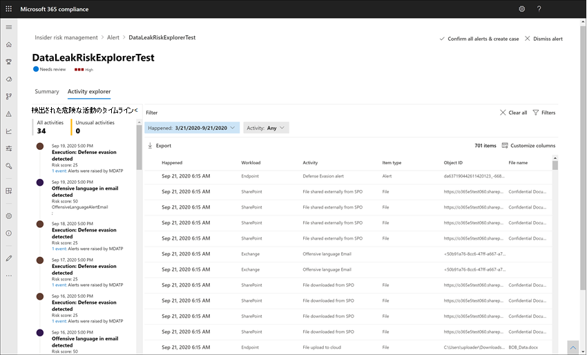

# Insider リスク管理警告

インサイダーリスク管理警告は、インサイダーリスク管理ポリシーで定義されたリスク インジケーターによって自動的に生成されます。 これらの通知で、コンプライアンスアナリストと捜査官が、現在のリスクの状態をすべて把握できるようになり、組織がトリアージでき見つかったリスクに対処できるようになります。 既定では、ポリシーによって、低、中、および高の重要度のアラートが生成されますが、必要に応じて [通知の音量を増減](insider-risk-management-settings.md#alert-volume) させることができます。 また、ポリシーウィザードを使用して新しいポリシーを作成するときに、 [ポリシーインジケーターの警告のしきい値](insider-risk-management-settings.md#indicator-level-settings-preview) を構成することもできます。

## アラート ダッシュボード

Insider リスク **警告ダッシュボード** を使用すると、insider のリスクポリシーによって生成された通知を表示し、操作することができます。 各レポートウィジェットは過去30日間の情報を表示します。

- **確認するアラート**: アラートの重要度の内訳を含む、確認とトリアージを必要とするアラートの合計数が表示されます。
- **[過去30日間にわたってアラートを開く**]: 過去30日間にわたってポリシーによって作成されたアラートの合計数 (高、中、低) のアラート重大度レベルで並べ替えられます。
- **通知の平均解決時間**: 有用な通知統計の要約:
    - 重大度の高いアラートを解決するための平均時間。時間、日、または月単位で表示されます。
    - 中程度の重大度のアラートを解決するための平均時間。時間、日、または月単位で表示されます。
    - 重大度の低いアラートを解決するための平均時間。時間、日、または月単位で表示されます。

>[!NOTE]
>インサイダー リスク管理は、組み込みのアラート調整を使用して、リスク調査を保護および最適化し、エクスペリエンスを確認します。 この調整により、誤って構成されたデータ コネクタや DLP ポリシーなど、ポリシー アラートが過負荷になる可能性がある問題から保護されます。 その結果、ユーザーに対する新しいアラートの表示に遅延が生じる可能性があります。

## アラートの状態と重大度

通知は、次のいずれかの状態にすることができます。

- **確認**済み: 警告が確認され、新規または既存のケースに割り当てられていること。
- **無視**されます: トリアージプロセスの問題を無視して通知を破棄します。
- **レビューが必要**: 新しい警告は、トリアージアクションがまだ行われていない場合です。
- **解決済み**: クローズおよび解決されたケースの一部である警告。

アラートリスクスコアは、いくつかのリスクアクティビティ指標から自動的に計算されます。 これらの指標には、リスクアクティビティの種類、アクティビティの発生回数と頻度、ユーザーリスクアクティビティの履歴、およびアクティビティの深刻さを高める可能性があるアクティビティリスクの追加が含まれます。 アラート リスク スコアは、各アラートのリスク重大度レベルをプログラムで割り当て、カスタマイズすることはできません。 通知が残っていると、untriaged が引き続きアラートに計上され、リスクの重大度レベルが増加する可能性があります。 リスクアナリストと調査担当者は、アラートのリスク重大度を使用して、組織のリスクポリシーおよび基準に従って、アラートをトリアージすることができます。

アラートリスクの重大度レベルは次のとおりです。

- **高重要度**: アラートのアクティビティとインジケーターは重大なリスクをもたらします。 関連するリスクアクティビティは、深刻かつ反復的で、corelate は、他の重要なリスク要因に強くなります。
- **中程度の重要度**: 警告のアクティビティとインジケーターは、中程度のリスクをもたらします。 関連するリスク アクティビティは、中程度で頻繁であり、他のリスク要因とある程度の相関関係があります。
- **低重要度**: アラートのアクティビティとインジケーターは、軽微なリスクをもたらします。 関連するリスクアクティビティは軽微で、不定期で、他の重要なリスク要因に corelate されません。

## 通知ダッシュボードでのフィルター通知

組織内のアクティブなインサイダー リスク管理ポリシーの数と種類によっては、大量のアラートを確認することが困難な場合があります。 通知フィルターを使用すると、アナリストや調査担当者が複数の属性で通知をソートするのに役立ちます。 **通知ダッシュボード**で通知をフィルター処理するには、[**フィルター** ] コントロールを選択します。 通知は、1つまたは複数の属性によってフィルター処理できます。

- **状態**: 1 つ以上の状態の値を選択して、通知の一覧をフィルター処理します。 オプションは、*確認済み*、*非表示*、*レビューが必要*、*解決済み*です。
- **重要度**: 1 つまたは複数のアラートリスク重大度レベルを選択して、警告リストをフィルター処理します。 オプションは、*高*、*中*、*低*です。
- [**検出時刻**]: 通知が作成された開始日と終了日を選択します。
- **Policy**: 選択したポリシーによって生成されたアラートをフィルター処理する1つまたは複数のポリシーを選択します。

## 通知ダッシュボードの検索通知

特定の単語でアラート名を検索するには、**検索**コントロールを選び、検索する単語を入力します。 検索結果には、検索で定義された単語を含むポリシー アラートが表示されます。

## 通知の優先順位付け

Insider のリスクの警告をトリアージするには、次の手順を実行します。

1. [Microsoft 365 コンプライアンスセンター](https://compliance.microsoft.com)で、[ **Insider リスク管理**] に移動し、[**通知**] タブを選択します。
2. **アラートダッシュボード**で、トリアージするアラートを選択します。
3. [ **通知の詳細] ウィンドウ**では、次のタブを確認して、アラートの優先順位を決定できます。
    - **概要**: このタブには、通知に関する一般的な情報が含まれており、警告を確認して新しいケースを作成したり、通知を破棄したりできます。 これには、アラートの現在の状態と、アラートのリスク重大度レベルが [ *高*]、[ *中*]、または [ *低*] として表示されます。 通知がトリアージされていない場合は、重大度レベルを時間の経過と共に増減させることができます。
        - 動作: アクティビティに関連付けられている違反の種類を含む、アクティビティ評価期間中に**発生**した上位3つのリスクアクティビティとポリシー一致が表示されます。
        - **ユーザーの詳細**: 通知に割り当てられているユーザーに関する一般的な情報を表示します。 匿名化が有効になっている場合、ユーザー名、電子メールアドレス、エイリアス、および組織フィールドは匿名化になります。
        - **通知の詳細**: 通知が生成されてからの時間の長さが含まれ、アラートを生成したポリシーが一覧表示され、その警告から生成されたケースが一覧表示されます。 新しい通知の場合、 **ケース** フィールドには None が表示されます。
        - **検出されたコンテンツ**: 警告のリスクアクティビティに関連付けられているコンテンツと、主な領域別にアクティビティイベントを要約します。 [アクティビティ] リンクを選択すると、アクティビティエクスプローラーが開き、アクティビティに関する追加の詳細が表示されます。
    - **ユーザーアクティビティ**: このタブには、通知に関連付けられたユーザーのアクティビティ履歴が表示されます。 この履歴には、この通知のポリシーに割り当てられたテンプレートで定義されているリスク指標に関連するその他のアラートとアクティビティが含まれています。 この履歴により、リスクアナリストと調査担当は、トリアージプロセスの一環として、従業員の過去のリスクのある動作を考慮できます。
    - **アクション**: 各通知に対して次のアクションを実行できます。
        - **[展開**されたビューを開く]: **アクティビティエクスプローラー** ダッシュボードが開きます。
        - **確認と作成ケース**: このアクションを使用して、ユーザーに関連付けられているすべての警告の新しいケースを確認して作成します。 このアクションにより、アラートの状態が [ *確認*済みに自動的に変更されます。
        - **警告を無視**する: このアクションを使用して、通知を終了します。 この操作により、アラートの状態が [ *解決済み*に変更されます。

## アクティビティエクスプローラー (プレビュー)

>[!NOTE]
>アクティビティエクスプローラーは、組織でこの機能が使用可能になった後、イベントをトリガーするユーザーのアラート管理領域で利用できます。

アクティビティエクスプローラーでは、アラートに関する詳細な情報を提供する包括的な分析ツールを使用して、リスク調査担当とアナリストを統合します。 アクティビティエクスプローラーを使用すると、レビューアーは、検出された危険なアクティビティのタイムラインをすばやく確認し、通知に関連するすべてのリスクアクティビティを識別してフィルター処理できます。 アクティビティエクスプローラーで通知にフィルターを適用するには、[フィルター] コントロールを選択します。 アラートの詳細ウィンドウに一覧表示されている1つまたは複数の属性によって、通知をフィルター処理できます。 また、アクティビティエクスプローラーは、調査担当者やアナリストがダッシュボードに焦点を当てることができるようにするための、カスタマイズ可能な列をサポートしています。

**アクティビティエクスプローラー**を使用するには、次の手順を実行します。

1. Microsoft 365 コンプライアンスセンターで、[ **Insider リスク管理** ] に移動し、[ **通知** ] タブを選択します。
2. **アラートダッシュボード**で、トリアージするアラートを選択します。
3. [ **通知の詳細] ウィンドウ**で、[ **拡張ビューを開く**] を選択します。
4. 選択した通知のページで、[ **アクティビティエクスプローラー** ] タブを選択します。

アクティビティエクスプローラーでアクティビティをレビューする場合、調査担当およびアナリストは特定のアクティビティを選択し、[アクティビティの詳細] ウィンドウを開くことができます。 このウィンドウには、調査担当とアナリストが警告のトリアージプロセス中に使用できるアクティビティに関する詳細情報が表示されます。 詳細情報は、アラートのコンテキストを提供し、アラートをトリガーしたリスクアクティビティの全範囲を特定するのに役立ちます。

## 警告のケースを作成する

アラートのレビューとトリアージが行われると、リスクアクティビティをさらに詳しく調査するための新しいケースを作成できます。 警告のケースを作成するには、次の手順を実行します。

1. [Microsoft 365 コンプライアンスセンター](https://compliance.microsoft.com)で、[ **Insider リスク管理**] に移動し、[**通知**] タブを選択します。
2. **通知ダッシュボード**で、確認して新しいケースを作成する通知を選択します。
3. [**通知の詳細] ウィンドウ**で、[**アクション**の  >  **確認] & create case**] を選択します。
4. [ **通知の確認と insider のリスクケースの作成** ] ダイアログで、ケースの名前を入力し、投稿者として追加するユーザーを選択し、必要に応じてコメントを追加します。 コメントは、ケースメモとして自動的に追加されます。
5. [ **ケースの作成** ] を選択して新しいケースを作成するか、[ **キャンセル** ] を選択して、ケースを作成せずにダイアログを閉じます。

ケースが作成されると、調査担当およびアナリストは、ケースを管理して行動することができます。 詳細については、「 [Insider リスク管理ケース](insider-risk-management-cases.md) 」を参照してください。
