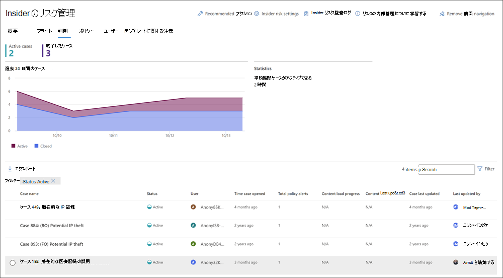

# Insider リスク管理ケース

ケースはインサイダーリスク管理の中心であり、ポリシーで定義されたリスク指標によって生成される問題を深く調査し、行動することができます。 ケースは、ユーザーのコンプライアンス関連の問題に対処するために追加のアクションが必要な場合に、アラートから手動で作成されます。 各ケースは 1 人のユーザーにスコープ設定され、ユーザーの複数の通知を既存のケースまたは新しいケースに追加できます。

ケースの詳細を調査した後、次の操作を実行できます。

- ユーザーに通知を送信する
- ケースを良性として解決する
- ケースを ServiceNow インスタンスまたは電子メール受信者と共有する
- 調査のケースをエスカレートAdvanced eDiscoveryする

インサイダー リスク管理におけるケースの調査と管理の概要については、「 [Insider Risk Management Investigation and Escalation](https://www.youtube.com/watch?v=UONUSmkRC8s) 」ビデオをご覧ください。

## ケース ダッシュボード

インサイダー リスク管理 **ケース ダッシュボードを使用** すると、ケースの表示と対応が可能です。 ダッシュボードの各レポート ウィジェットには、過去 30 日間の情報が表示されます。

- **アクティブなケース**: 調査中のアクティブなケースの総数。
- **過去 30** 日間のケース: 作成されたケースの総数 (アクティブとクローズの *状態で並**べ替* え)。
- **統計**: アクティブなケースの平均時間 (時間、日、または月で一覧表示)。

ケース キューには、次のケース属性の現在の状態に加えて、組織のすべてのアクティブなケースと終了したケースが一覧表示されます。

- **ケース名**: アラートが確認され、ケースが作成された場合に定義されるケースの名前。  
- **Status**: ケースの状態 (アクティブまたは *クローズ**)。*
- **ユーザー**: ケースのユーザー。 ユーザー名の匿名化が有効になっている場合は、匿名化された情報が表示されます。
- **タイム ケースを開いた**: ケースが開かれません。
- **ポリシーアラートの総数**: ケースに含まれるポリシー一致の数。 新しいアラートがケースに追加されると、この数は増える可能性があります。
- **最後に更新された** ケース: ケースの状態にケース ノートまたは変更が追加された後に経過した時刻。
- **最終更新者**: ケースを最後に更新したインサイダー リスク管理アナリストまたは調査者の名前。

検索コントロール **を使用** して、特定のテキストのケース名を検索し、ケース フィルターを使用して、次の属性でケースを並べ替える。

- 状態
- ケースが起きてからの時間、開始日、終了日
- 最終更新、開始日、終了日

## フィルター ケース

組織内のアクティブなインサイダー リスク管理ポリシーの数と種類に応じて、大量のケースのキューを確認する作業は困難な場合があります。 ケース フィルターを使用すると、アナリストや調査担当者が複数の属性でケースを並べ替えるのに役立ちます。 ケース ダッシュボードでアラートをフィルター **処理するには、[** フィルター] コントロール **を選択** します。 1 つ以上の属性でケースをフィルター処理できます。

- **Status**: 1 つ以上のステータス値を選択して、ケース リストをフィルター処理します。 オプションは[アクティブ *] と [閉じた* ] *です*。
- **タイム ケースを開く**: ケースを開いた日時の開始日と終了日を選択します。
- **最終更新日:** ケースが更新された日付の開始日と終了日を選択します。

## ケースの調査

適切な是正措置を取る上で、インサイダーリスク管理アラートに関するより深い調査が重要です。 Insider リスク管理ケースは、ユーザー リスクアクティビティの履歴、アラートの詳細、一連のリスク イベント、およびリスクにさらされるコンテンツとメッセージを探索するための中心的な管理ツールです。 リスク アナリストや調査担当者は、ケースを使用してレビューのフィードバックとメモを一元化し、ケース解決を処理します。

ケースを選択すると、ケース管理ツールが開き、分析担当者と調査担当者がケースの詳細を調査します。

### ケースの概要

[ **ケースの概要]** タブは、リスク アナリストと調査担当者のケースの詳細を要約します。 [このケースについて] 領域に次 **の情報が含** まれています。

- **Status**: ケースの現在の状態 (アクティブまたはクローズ)。
- **ケースの作成日時**: ケースが作成された日付と時刻。
- **ユーザーのリスク スコア**: ケースのユーザーの現在の計算されたリスク レベル。 このスコアは 24 時間ごとに計算され、ユーザーに関連付けられているすべてのアクティブなアラートのアラート リスク スコアを使用します。
- **メール**: ケースのユーザーの電子メール エイリアス。
- **組織または部署**: ユーザーが割り当てられている組織または部署。
- **マネージャー名**: ユーザーのマネージャーの名前。
- **マネージャーのメール**: ユーザーのマネージャーの電子メール エイリアス。

[ **ケースの概要]** タブには、ケース **に** 関連付けられたポリシー一致アラートに関する次の情報を含む [アラート] セクションも含まれています。

- **ポリシーの一致**: ユーザー アクティビティの一致アラートに関連付けられたインサイダー リスク管理ポリシーの名前。
- **状態**: アラートの状態。
- **重大度**: アラートの重大度。
- **検出された時間**: アラートが生成された後に経過した時間。

### アラート

[ **アラート]** タブには、ケースに含まれる現在のアラートが要約されます。 新しいアラートは既存のケースに追加され、割り当てられたアラート キューに追加されます。 次のアラート属性がキューに一覧表示されます。

- 状態
- 重要度
- 検出された時間

キューからアラートを選択して、[アラートの詳細 **] ページを表示** します。

検索コントロールを使用して、特定のテキストのアラート名を検索し、アラート フィルターを使用して、次の属性でケースを並べ替える。

- 状態
- 重要度
- 検出された時間、開始日、終了日

フィルター コントロールを使用して、次を含むいくつかの属性でアラートをフィルター処理します。

- **状態**: 1 つ以上の状態の値を選択して、アラート リストをフィルター処理します。 オプションは、*確認済み*、*非表示*、*レビューが必要*、*解決済み* です。
- **重大度:** 1 つ以上のアラート リスク重大度レベルを選択して、アラート リストをフィルター処理します。 オプションは、*高*、*中*、*低* です。
- **検出された時間**: アラートが作成された日時の開始日と終了日を選択します。
- **ポリシー**: 1 つ以上のポリシーを選択して、選択したポリシーによって生成されたアラートをフィルター処理します。

### ユーザー アクティビティ

[ **ユーザー アクティビティ]** タブを使用すると、リスク アナリストと調査担当者は、アクティビティの詳細を確認し、リスクアラートとケースに関連付けられているすべてのアクティビティを視覚的に表現できます。 たとえば、アラートトリアージ プロセスの一環として、アナリストはケースに関連付けられているすべてのリスク アクティビティを確認して詳細を確認する必要がある場合があります。 ケースでは、リスク調査担当者は、ユーザー アクティビティの詳細とバブル グラフを確認して、ケースに関連付けられたアクティビティの全体的な範囲を理解するのに役立ちます。 ユーザー アクティビティ グラフの詳細については、「Insider リスク管理アクティビティ [」の記事を参照](insider-risk-management-activities.md#user-activity) してください。

### アクティビティ エクスプローラー (プレビュー)

[ **アクティビティ エクスプローラー]** タブを使用すると、リスク アナリストと調査担当者は、リスクアラートに関連付けられたアクティビティの詳細を確認できます。 たとえば、ケース管理アクションの一環として、調査担当者とアナリストはケースに関連付けられているすべてのリスク アクティビティを確認して詳細を確認する必要があります。 アクティビティ エクスプローラー **を使用すると**、レビュー担当者は、検出された危険なアクティビティのタイムラインをすばやく確認し、アラートに関連付けられているすべてのリスク アクティビティを特定してフィルター処理できます。

アクティビティ エクスプローラーの詳細については、「Insider リスク管理アクティビティ [」の記事を参照](insider-risk-management-activities.md#activity-explorer) してください。

### コンテンツ エクスプローラー

[ **コンテンツ エクスプローラー]** タブを使用すると、リスク調査担当者は、リスクアラートに関連付けられているすべての個々のファイルと電子メール メッセージのコピーを確認できます。 たとえば、ユーザーが SharePoint Online から数百のファイルをダウンロードし、アクティビティがポリシー アラートをトリガーするときにアラートが作成された場合、アラート用にダウンロードされたファイルはすべてキャプチャされ、元のストレージ ソースからインサイダー リスク管理ケースにコピーされます。

コンテンツ エクスプローラーは、基本的で高度な検索機能とフィルター機能を備え、強力なツールです。 コンテンツ エクスプローラーの使用の詳細については、「Insider リスク管理コンテンツ エクスプローラー [」を参照してください](insider-risk-management-content-explorer.md)。

### ケースメモ

ケース **の [ケース メモ** ] タブでは、リスク アナリストと調査担当者がケースの作業に関するコメント、フィードバック、インサイトを共有します。 メモはケースに永続的に追加され、メモの保存後に編集または削除できません。 アラートからケースが作成されると、「**アラートの確認とインサイダーリスクケースの作成**」ダイアログに入力されたコメントが、ケースメモとして自動的に追加されます。

ケース ノート ダッシュボードには、メモを作成したユーザーのメモと、メモが保存された後に経過した時間が表示されます。 特定のキーワードのケース ノート テキスト フィールドを検索するには、ケース ダッシュボードの **[** 検索] ボタンを使用して、特定のキーワードを入力します。

ケースにメモを追加するには、次の方法を使用します。

1. [セキュリティ] [Microsoft 365 コンプライアンス センター](https://compliance.microsoft.com)[Insider リスク管理] **に移動し**、[ケース] タブ **を選択** します。
2. ケースを選択し、[ケース メモ] **タブを選択** します。
3. [ケース **メモの追加] を選択します**。
4. [ケース **メモの追加]** ダイアログで、ケースのメモを入力します。 [**保存] を** 選択してケースにメモを追加するか、ケースにメモを保存せずに [閉じるキャンセル] を選択します。

### 共同作成者

ケースの [**共同作成者**] タブでは、リスク分析担当者や調査担当者が、ケースに別のレビュー担当者を追加することができます。 既定では、**Insider リスク** 管理アナリストと Insider リスク管理調査員の役割を割り当てられたすべてのユーザーが、アクティブなケースとクローズされたケースごとに投稿者として一覧表示されます。 Insider Risk **Management Investigators ロールが割り** 当てられているユーザーだけが、コンテンツ エクスプローラーでファイルとメッセージを表示する権限を持ちます。

ユーザーを投稿者として追加することで、ケースへの一時的なアクセスを許可できます。 投稿者は、次の場合を除き、特定のケースに対してすべてのケース管理制御を持っています。

- アラートの確認または消去する権限
- ケースの共同作成者を編集する権限
- コンテンツ エクスプローラーでファイルとメッセージを表示するアクセス許可

ケースに投稿者を追加するには、次の方法を使用します。

1. [セキュリティ] [Microsoft 365 コンプライアンス センター](https://compliance.microsoft.com)[Insider リスク管理] **に移動し**、[ケース] タブ **を選択** します。
2. ケースを選択し、[投稿者] **タブを選択** します。
3. [投稿者 **の追加] を選択します**。
4. [投稿者 **の追加** ] ダイアログで、追加するユーザーの名前を入力し、提案されたユーザー リストからユーザーを選択します。 この一覧は、テナント サブスクリプションAzure Active Directoryから生成されます。
5. [**追加]** を選択してユーザーを投稿者として追加するか、[キャンセル] を選択して、ユーザーを投稿者として追加せずにダイアログを閉じます。

## ケースへの対処

リスク調査担当者は、ケースの重大度、ユーザーのリスクの履歴、組織のリスク ガイドラインに応じて、いくつかの方法の 1 つのケースに対してアクションを実行できます。 場合によっては、ケースをユーザーまたはデータ調査にエスカレートして、組織の他の領域と共同作業を行い、リスクアクティビティについて深く掘り下げる必要がある場合があります。 Insider リスク管理は、エンド Microsoft 365解決管理を支援するために、他のコンプライアンス ソリューションと緊密に統合されています。

### メール通知の送信

ほとんどの場合、インサイダー リスクアラートを作成するユーザーアクションは、不注意または偶発的です。 ユーザーにメールでリマインダー通知を送信する方法は、ケースレビューとアクションを文書化するための効果的な方法であり、企業ポリシーをユーザーに通知したり、リフレッシュトレーニングをポイントする方法です。 通知は、インサイダー [リスク管理インフラストラクチャ](insider-risk-management-notices.md) 用に作成した通知テンプレートから生成されます。

ユーザーに電子メール通知を送信しても、ケースは _Closed* として解決_Closedです。 場合によっては、ユーザーに通知を送信した後にケースを開いたままにしておき、新しいケースを開かなくても、より多くのリスク アクティビティを探す必要があります。 通知が送信された後にケースを解決する場合は、通知を送信した後の手順として、「**ケース解決済**」を選択しなければなりません。

ケースに割り当てられたユーザーに通知を送信するには、次の方法を実行します。

1. [セキュリティ] [Microsoft 365 コンプライアンス センター](https://compliance.microsoft.com)[Insider リスク管理] **に移動し**、[ケース] タブ **を選択** します。
2. ケースを選択し、ケース アクション ツールバー **の [メール通知** の送信] ボタンを選択します。
3. [電子 **メール通知の** 送信] ダイアログで、[通知テンプレートの **選択** ] ドロップダウン コントロールを選択して通知の通知テンプレートを選択します。 この選択により、通知の他のフィールドが事前に入力されます。
4. 通知フィールドを確認し、必要に応じて更新します。 ここで入力した値は、テンプレートの値より優先されます。
5. [**送信]** を選択して通知をユーザーに送信するか、[キャンセル] を選択して通知をユーザーに送信せずにダイアログを閉じます。 送信された通知はすべて、ケース ノート ダッシュボードのケース ノート キュー **に追加** されます。

### 調査を拡大する

ユーザーのリスク アクティビティに追加の法的レビューが必要な状況で、ユーザー調査のケースをエスカレートします。 この拡大により、Microsoft 365 組織の新しい Advanced eDiscovery ケースが開きます。 Advanced eDiscovery は、組織の内部および外部の法的調査に対応するコンテンツを保持、収集、確認、分析、エクスポートするためのエンド ツー エンドのワークフローを提供します。 また、訴訟チームが法的情報保留通知ワークフロー全体を管理して、ケースに関係するカストディアンとコミュニケーションを取ることができます。 インサイダーリスク管理ケースから作成された Advanced eDiscovery ケースのカストディアンとしてレビュー担当者を割り当てると、訴訟チームは適切な措置を講じ、コンテンツの保持を管理することができます。 Advanced eDiscovery の詳細については、「[Advanced eDiscovery in Microsoft 365の概要](overview-ediscovery-20.md)」を参照してください。

ケースをユーザー調査にエスカレートするには、次の方法を実行します。

1. [セキュリティ] [Microsoft 365 コンプライアンス センター](https://compliance.microsoft.com)[Insider リスク管理] **に移動し**、[ケース] タブ **を選択** します。
2. ケースを選択し、ケース アクション ツールバーの **[** 調査のエスカレート] ボタンを選択します。
3. [調査 **のエスカレート] ダイアログ** で、新しいユーザー調査の名前を入力します。 必要に応じて、ケースに関するメモを入力し、[エスカレート] **を選択します**。
4. 通知フィールドを確認し、必要に応じて更新します。 ここで入力した値は、テンプレートの値より優先されます。
5. [**確認] を** 選択してユーザー調査ケースを作成するか、[キャンセル] を選択して、新しいユーザー調査ケースを作成せずにダイアログを閉じます。

インサイダー リスク管理ケースが新しいユーザー調査ケースにエスカレートされた後、Microsoft 365 コンプライアンス センター の **電子情報開示** > **Advanced** 領域で新しいケースを確認できます。

### ケースのフローを使用Power Automateタスクを実行する

推奨されるデータ Power Automateを使用すると、リスク調査担当者とアナリストは次の操作を迅速に実行できます。

- インサイダー リスク ケースでユーザーに関する人事またはビジネスからの情報を要求する
- ユーザーがインサイダー リスク アラートを受け取った場合にマネージャーに通知する
- ServiceNow でインサイダー リスク管理ケースのレコードを作成する
- インサイダー リスク ポリシーに追加されたユーザーに通知する

インサイダー リスク管理ケースのPower Automateフローを実行、管理、または作成するには、次のコマンドを実行します。

1. ケース アクション **ツール バー** の [自動化] を選択します。 
2. 実行するPower Automateを選択し、[フローの実行] **を選択します**。 
3. フローが完了したら、[完了] を **選択します**。

インサイダー リスク管理のPower Automate詳細については、「Insider リスク管理設定の概要」[を参照してください](insider-risk-management-settings.md#power-automate-flows-preview)。

### ケースのチームMicrosoft Teamsまたは作成する

インサイMicrosoft Teams管理の統合を設定で有効にすると、アラートが確認され、ケースが作成されるごとに、Microsoft Teams チームが自動的に作成されます。 リスク調査担当者とアナリストは、Microsoft Teamsアクション ツール バーの [チームの表示] を選択して、Microsoft Teamsを開き、チームに直接移動できます。

Microsoft Team 統合を有効にする前に開いたケースの場合、リスク調査員とアナリストは、ケース アクション ツールバーの [Microsoft Teams チームの作成] を選択して、ケースの **新しい Microsoft Teams** チームを作成できます。

ケースが解決すると、関連付けられた Microsoft チームは自動的にアーカイブされます (非表示で読み取り専用になります)。

インサイダー リスク管理のMicrosoft Teams詳細については、「Insider リスク管理設定の概要」[を参照してください](insider-risk-management-settings.md#microsoft-teams-preview)。

### ケースを解決する

リスク アナリストと調査担当者がレビューと調査を完了した後、ケースは、現在ケースに含まれているすべてのアラートに対応するために解決できます。 ケースを解決すると、解決分類が追加され、ケースの状態が [閉じた] に変更され、解決アクションの理由がケース ノート ダッシュボードのケース ノート キューに自動的に **追加** されます。 ケースは次のいずれかの方法で解決されます。

- **良** 性: ポリシー一致アラートが低リスク、重大でない、または誤検知と評価される場合の分類。
- **ポリシー違反の確認**: ポリシー一致アラートが危険、重大、または悪意のある意図の結果として評価される場合の分類。

ケースを解決するには、次の手順を実行します。

1. [セキュリティ] [Microsoft 365 コンプライアンス センター](https://compliance.microsoft.com)[Insider リスク管理] **に移動し**、[ケース] タブ **を選択** します。
2. ケースを選択し、ケース アクション ツールバーの **[** ケースの解決] ボタンを選択します。
3. [ケース **の解決]** ダイアログで、[ **解決する]** ドロップダウン コントロールを選択して、ケースの解決分類を選択します。 オプションは、**良性ポリシー違反****または確認済みポリシー違反です**。
4. [ケース **の解決]** ダイアログで、[アクションの実行] テキスト フィールドに解決分類 **の理由を** 入力します。
5. [**解決] を** 選択してケースを閉じるか、[キャンセル] を選択して、ケースを解決せずにダイアログを閉じます。
