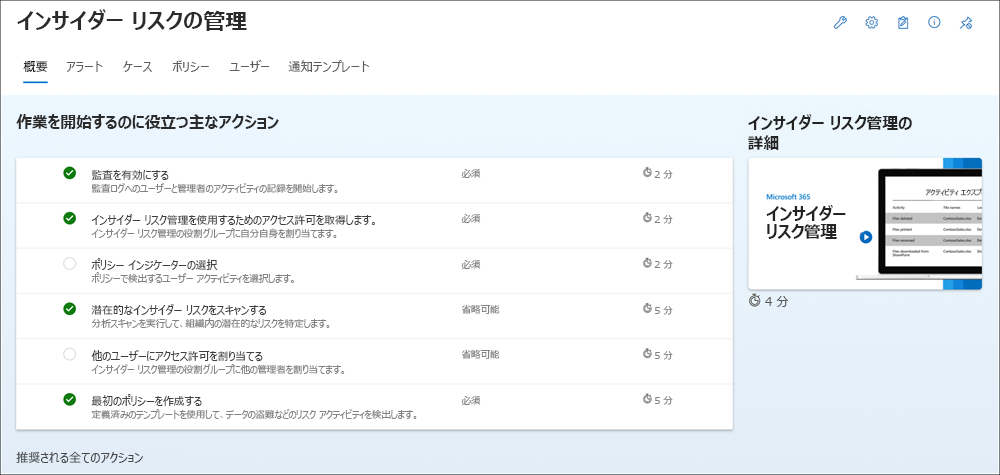

# インサイダー リスクの管理の概要

インサイダー リスク管理ポリシーを使用して、組織内のリスクアラートに対応する危険なアクティビティと管理ツールを特定します。 前提条件を設定し、インサイダー リスク管理ポリシーを構成するには、次の手順を実行します。

> [!IMPORTANT]
> インサイMicrosoft 365リスク管理ソリューションは、テナント レベルのオプションを提供し、お客様がユーザー レベルで内部ガバナンスを円滑に進めるのに役立ちます。 テナント レベルの管理者は、組織のメンバーにこのソリューションへのアクセス権を提供するアクセス許可を設定し、Microsoft 365 コンプライアンス センター でデータ コネクタをセットアップして、潜在的に危険なアクティビティのユーザー レベルの識別をサポートするために、関連するデータをインポートできます。 お客様は、個々のユーザーの行動、性格、または雇用に関連するパフォーマンスに関する分析情報を管理者が計算し、組織内の他のユーザーが利用できます。 さらに、お客様は、インサイダー リスク管理サービスからの洞察だけでなく、雇用に関連する個々のユーザーの行動、性格、またはパフォーマンスに関連する独自の完全な調査を行う必要があるという認識を持っています。 お客様は、Microsoft 365 インサイダー リスク管理サービス、および関連するすべての機能またはサービスを、個々のユーザー識別および修復アクションに関連する法律を含むすべての適用法に準拠して使用する責任を負います。

インサイダー リスク ポリシーが組織のリスク管理に役立つ方法の詳細については、「インサイダー リスク管理」を参照[Microsoft 365。](insider-risk-management.md)

## サブスクリプションとライセンス

インサイダー リスク管理を開始する前に、サブスクリプションMicrosoft 365[アドオン](https://www.microsoft.com/microsoft-365/compare-all-microsoft-365-plans)を確認する必要があります。 インサイダー リスク管理にアクセスして使用するには、組織に次のいずれかのサブスクリプションまたはアドオンが必要です。

- Microsoft 365 E5/A5/G5 サブスクリプション (有料または試用版)
- Microsoft 365 E3/A3/G3 サブスクリプション + Microsoft 365 E5/A5/G5 コンプライアンス アドオン
- Microsoft 365 E3/A3/G3 サブスクリプション + Microsoft 365 E5/A5/G5 Insider Risk Management アドオン
- Office 365 E3 サブスクリプション + Enterprise Mobility and Security E3 + Microsoft 365 E5 Compliance アドオン

インサイダー リスク管理ポリシーに含まれるユーザーには、上記のいずれかのライセンスが割り当てられている必要があります。

既存の Microsoft 365 Enterprise E5 プランをお持ちで、インサイダー リスク管理を試す場合は、Microsoft 365 を既存のサブスクリプションに追加するか[、Microsoft 365 Enterprise](/office365/admin/try-or-buy-microsoft-365) E5 の試用版にサインアップできます。 

## 推奨されるアクション (プレビュー)

推奨されるアクションは、組織を迅速に開始し、インサイダー リスク管理機能を活用するのに役立ちます。 [概要] **ページに** 含まれている推奨アクションは、ポリシーを構成および展開する手順、およびポリシーの一致からアラートを生成するユーザー アクションの調査アクションを実行する手順を示します。

インサイダー リスク管理の構成を開始または最大化するために、次の推奨事項を使用できます。

- **監査を有効にする**: オンにすると、組織内のユーザーと管理者のアクティビティが監査ログに記録Microsoft 365されます。 Insider リスク ポリシーと分析スキャンでは、このログを使用してリスク アクティビティを検出します。
- **ユーザー リスク管理へのアクセス** 許可を取得する : インサイダー リスク管理機能に対するアクセスのレベルは、割り当てられた役割グループによって異なります。 推奨されるアクションにアクセスして構成するには、ユーザーを Insider リスク管理役割グループまたは *Insider* Risk *Management Admins* 役割グループに割り当てる必要があります。
- **ポリシー インジケーターを選択** する: インジケーターは、基本的に検出して調査するユーザー アクティビティです。 インジケーターを選択すると、複数の場所やサービスMicrosoft 365アクティビティを追跡できます。
- **潜在的なインサイダー リスクをスキャン** する: 分析スキャンを実行して、組織で発生する潜在的なインサイダー リスクを検出します。結果を評価した後、推奨ポリシーを確認してセットアップします。
- **他のユーザーにアクセス** 許可を割り当てる : インサイダー リスク機能の管理を担当するチーム メンバーが追加されている場合は、適切な役割グループに割り当てる必要があります。
- **最初のポリシーを** 作成する: 潜在的に危険なアクティビティに関するアラートを受信するには、検出および調査するユーザー アクティビティを定義する定義済みのテンプレートに基づいてポリシーを設定する必要があります。
- **アクティビティがスコア付** けされているユーザーを確認する: [ユーザー] ダッシュボードでは、アクティビティがしきい値を満たしたかどうかに関係なく、現在リスク スコアが割り当てられているユーザーを表示できます。
- **警告の** 確認 : ユーザーに対してトリガー イベントが発生すると、ポリシーは検出されたアクティビティにリスク スコアを割り当て始める。 リスク スコアがポリシーのしきい値を満たす場合、そのユーザーに対してスコア付けされているすべてのアクティビティの詳細な内訳を含むアラートが表示されます。
- **ケースの調査**: 潜在的なインサイダー リスクを特定するために詳細な調査が必要な場合、ケースはアラートから手動で作成されます。 各ケースは 1 人のユーザーにスコープ設定され、ユーザーの複数の通知を既存のケースまたは新しいケースに追加できます。

このエクスペリエンスに含まれる推奨される各アクションには、次の 4 つの属性があります。

- **Action**: 推奨されるアクションの名前と説明。
- **Status**: 推奨されるアクションの状態。 値は *開始されません、**進行中、**後で保存済* み、*または完了です*。
- **必須または省略可能**: インサイダー リスク管理機能が期待通り機能するために推奨されるアクションが必須かオプションかを指定します。
- **推定完了時間**: 推奨されるアクションを完了する推定時間 (分)。

一覧から推奨事項を選択して、インサイダー リスク管理の構成を開始します。 推奨されるそれぞれのアクションでは、要件、予想される内容、組織で機能を構成した場合の影響など、推奨事項に必要なアクティビティに関する説明が行われます。   推奨される各アクションは、構成時に自動的に完了としてマークされます。または、構成時にアクションを完了として手動で選択する必要があります。

## 手順 1 (必須): インサイダー リスク管理のアクセス許可を有効にする

> [!IMPORTANT]
> ロール グループを構成した後、ロール グループのアクセス許可が組織全体の割り当てられたユーザーに適用されるまでに最大 30 分かかる場合があります。

インサイダー リスク管理機能を管理するための初期アクセス許可を構成するために使用される役割グループは 6 つがあります。 Microsoft 365 コンプライアンス センター で **Insider リスク** 管理をメニュー オプションとして使用し、これらの構成手順を続行するには、次のいずれかの役割または役割グループに割り当てる必要があります。

- Azure Active Directory [*管理者の*](/azure/active-directory/roles/permissions-reference#global-administrator)役割
- Azure Active Directory [*コンプライアンス管理者の*](/azure/active-directory/roles/permissions-reference#compliance-administrator)役割
- Microsoft 365 コンプライアンス センター [*管理役割*](/microsoft-365/security/office-365-security/permissions-in-the-security-and-compliance-center)グループ
- Microsoft 365 コンプライアンス センター [*管理者役割*](/microsoft-365/security/office-365-security/permissions-in-the-security-and-compliance-center)グループ
- *Insider Risk Management* 役割グループ
- *Insider Risk Management Admin* 役割グループ

次の役割のメンバーは、Insider Risk Management Admin 役割グループに含まれるのと同じ *ソリューションアクセス許可を* 持っています。

- Azure Active Directory *管理者*
- Azure Active Directory *コンプライアンス管理者*
- Microsoft 365 コンプライアンス センター *管理*
- Microsoft 365 コンプライアンス センター *コンプライアンス管理者*

> [!IMPORTANT]
> 特定のユーザーが組織を離れた場合、インサイダー リスク管理の構成が 「管理者ゼロ」 シナリオに入らなからなく、常に Insider Risk Management または *Insider* Risk *Management Admin* 役割グループに少なくとも 1 人のユーザーが存在します (選択するオプションに応じて)。

インサイダー リスク管理ポリシーとアラートの管理方法に応じて、ユーザーを特定の役割グループに割り当て、さまざまなインサイダー リスク管理機能のセットを管理する必要があります。 コンプライアンス責任が異なるユーザーを特定の役割グループに割り当て、インサイダー リスク管理機能の異なる領域を管理するオプションがあります。 または、指定された管理者、アナリスト、調査者、および閲覧者のすべてのユーザー アカウントを *Insider リスク* 管理役割グループに割り当てる場合があります。 コンプライアンス管理の要件に最適な 1 つのロール グループまたは複数のロール グループを使用します。

インサイダー リスク管理を構成および管理する場合は、次のソリューション役割グループ オプションから選択します。

| **役割グループ** | **ロール権限** |
| :------------- | :------------------- |
| **インサイダー リスクの管理** | この役割グループを使用して、単一グループで組織のインサイダー リスク管理を管理します。 指定された管理者、アナリスト、調査員、監査人のすべてのユーザー アカウントを追加することで、1 つのグループでインサイダー リスク管理のアクセス許可を構成できます。 この役割グループには、すべてのインサイダー リスク管理アクセス許可ロールと関連するアクセス許可が含まれる。 この構成は、インサイダー リスク管理を迅速に開始する最も簡単な方法であり、個別のユーザー グループに対して個別のアクセス許可を定義する必要がない組織に適しています。 **** この構成を使用する場合は、ポリシーが期待通り動作し、ユーザーがポリシーの作成と編集、ソリューション設定の構成、ポリシーの正常性警告の確認を行う際には、常に少なくとも 1 人のユーザーがこの役割グループに割り当てられている必要があります。|
| **Insider リスク管理管理者** | この役割グループを使用して、インサイダー リスク管理を最初に構成し、後でインサイダー リスク管理者を定義されたグループに分離します。 この役割グループのユーザーは、分析インサイトを有効にして表示し、インサイダー リスク管理ポリシー、グローバル設定、役割グループの割り当てを作成、読み取り、更新、および削除できます。 **** この構成を使用する場合は、ポリシーが期待通り動作し、ユーザーがポリシーの作成と編集、ソリューション設定の構成、ポリシーの正常性警告の確認を行う際には、常に少なくとも 1 人のユーザーがこの役割グループに割り当てられている必要があります。 |
| **インサイダー リスク管理アナリスト** | このグループを使用して、インサイダー リスク ケース アナリストとして機能するユーザーに権限を割り当てます。 この役割グループのユーザーは、すべてのインサイダー リスク管理アラート、ケース、分析インサイト、および通知テンプレートにアクセスして表示できます。 インサイダー リスク コンテンツ エクスプローラーにはアクセスできません。 |
| **インサイダー リスク管理調査担当者** | このグループを使用して、インサイダー リスク データ調査担当者として機能するユーザーに権限を割り当てます。 この役割グループのユーザーは、すべてのケースについて、すべてのインサイダー リスク管理アラート、ケース、通知テンプレート、およびコンテンツ エクスプローラーにアクセスできます。 |
| **Insider リスク管理監査人** | インサイダー リスク管理アクティビティを監査するユーザーにアクセス許可を割り当てるには、このグループを使用します。 この役割グループのユーザーは、インサイダー リスク監査ログにアクセスできます。 この役割グループのユーザーは、推奨されるアクション (プレビュー) 機能にアクセスして使用できません。|

> [!NOTE]
> これらの役割グループは、現在、PIM (Privileged Identity Managementサポートされていません。 PIM の詳細については、「Assign [Azure AD ロール」を参照Privileged Identity Management。](/azure/active-directory/privileged-identity-management/pim-how-to-add-role-to-user)

### インサイダー リスク管理役割グループにユーザーを追加する

インサイダー リスク管理役割グループにユーザーを追加するには、次の手順を実行します。

1. 組織の[Microsoft 365 コンプライアンス センター](https://compliance.microsoft.com)アカウントの資格情報を使用してサインインMicrosoft 365します。

2. セキュリティ &amp; コンプライアンス センターで、**[アクセス許可]** に移動します。 Office 365 でロールの表示と管理へのリンクを選択します。

3. ユーザーを追加するインサイダー リスク管理役割グループを選択し、[役割グループの編集 **] を選択します**。

4. 左側のナビゲーション ウィンドウから **[メンバーの選択]** を選択し、**[編集]** を選択します。

5. **[追加]** を選択し、ロール グループに追加するすべてのユーザーのチェック ボックスをオンにします。

6. **[追加]** を選択し、**[完了]** を選択します。

7. **[保存]** を選択して、ユーザーをロール グループに追加します。 **[閉じる]** を選択して手順を完了します。

## 手順 2 (必須): 監査ログMicrosoft 365有効にする

Insider リスク管理では、ポリシー Microsoft 365分析の分析情報で特定されたユーザーの分析情報とアクティビティに関する監査ログを使用します。 監査Microsoft 365は、組織内のすべてのアクティビティの概要であり、インサイダー リスク管理ポリシーでは、これらのアクティビティを使用してポリシーの分析情報を生成できます。

Microsoft 365 の組織では、監査が既定で有効になっています。 組織によっては、特定の理由で監査を無効にしている場合があります。 組織の監査が無効になっている場合は、別の管理者が無効にしている可能性があります。 この手順を完了する場合は、監査を再びオンにしても問題ないか確認することをお勧めします。

監査を有効にする詳しい手順については、「[監査ログ検索を有効または無効する](turn-audit-log-search-on-or-off.md)」を参照してください。 監査を有効にすると、監査ログの準備中で、準備が完了してから数時間で検索を実行できるというメッセージが表示されます。 このアクションを行う必要があるのは 1 回だけです。 Microsoft 365 監査ログの使用に関する詳細については、「[監査ログを検索する](search-the-audit-log-in-security-and-compliance.md)」を参照してください。

## 手順 3 (オプション): インサイダー リスク分析の分析情報を有効にして表示する

Insider リスク管理分析では、インサイダー リスク ポリシーを構成することなく、組織内の潜在的なインサイダー リスクの評価を行うことができます。 この評価は、組織が高いユーザー リスクの潜在的領域を特定し、構成することを考えるべきインサイダー リスク マネジメント ポリシーの種類と範囲を特定するのに役立ちます。 この評価は、追加のライセンスや既存のポリシーの将来の最適化のニーズを判断するのにも役立ちます。 分析スキャン結果は、分析情報がレポートとして確認できるようになるまで最大 48 時間かかる場合があります。 分析の分析分析の詳細については、「Insider リスク管理設定 [: Analytics (プレビュー)」](insider-risk-management-settings.md#analytics) と「Insider Risk [Management Analytics」](https://www.youtube.com/watch?v=5c0P5MCXNXk) ビデオを参照して、分析が潜在的なインサイダー リスクの特定を加速し、迅速にアクションを実行する際に役立つ方法を理解するのに役立ちます。

Insider Risk Analytics を有効にするには、Insider リスク管理 *、Insider* リスク管理管理者、またはグローバル管理者役割グループMicrosoft 365 *メンバー* である必要があります。

インサイダー リスク分析を有効にするには、次の手順を実行します。

1. [インサイ [ダー Microsoft 365 コンプライアンス センター](https://compliance.microsoft.com)のリスク管理]**に移動します**。
2. [ **インサイダー リスク管理** の **概要]** タブの [組織のインサイダー リスクをスキャンする] カードの [スキャンの実行] **を選択** します。このアクションにより、組織の分析スキャンが有効になります。 Insider リスク設定  >  **Analytics (プレビュー)** に移動し、テナントのユーザー アクティビティをスキャンして潜在的なインサイダー リスクを特定することで、組織内のスキャンを有効に **することもできます**。
3. [分析の **詳細] ウィンドウで** 、[スキャンの実行 **] を選択して組織のスキャンを開始します**。 分析スキャン結果は、分析情報がレポートとして確認できるまで最大 24 時間かかる場合があります。

分析インサイトを確認した後、インサイダー リスク ポリシーを選択し、組織のインサイダー リスク軽減戦略に最適な関連する前提条件を構成します。

## 手順 4 (推奨): ポリシーの前提条件を構成する

ほとんどのインサイダー リスク管理ポリシーには、関連するアクティビティアラートを生成するためのポリシー インジケーター用に構成する必要がある前提条件があります。 組織に対して構成するポリシーに応じて、適切な前提条件を構成します。

### HR コネクタMicrosoft 365構成する

Insider リスク管理は、サードパーティのリスク管理および人事プラットフォームからインポートされたユーザーデータとログ データのインポートをサポートします。 Microsoft 365人事 (HR) データ コネクタを使用すると、ユーザーの終了日、最終雇用日、業績改善計画通知、パフォーマンス レビュー アクション、およびジョブ レベルの変更状態など、CSV ファイルから人事データを取得できます。 このデータは、インサイダー リスク管理ポリシーでアラート インジケーターを駆動するのに役立ち、組織で完全なリスク管理範囲を構成する上で重要な要素です。 組織に複数の HR コネクタを構成すると、インサイダー リスク管理によってすべての HR コネクタからインジケーターが自動的にプルされます。

次Microsoft 365ポリシー テンプレートを使用する場合は、HR コネクタの使用が必要です。

- 不満を持つユーザーによるデータ漏洩
- ユーザー データの盗難
- 一般的な患者データの誤用
- 離職するユーザーによるセキュリティ ポリシー違反
- 不満を持つユーザーによるセキュリティ ポリシー違反

組織の[人事コネクタ](import-hr-data.md)を構成する手順については、「人事データをインポートするコネクタをセットアップする」のMicrosoft 365を参照してください。 HR コネクタを構成した後、次の構成手順に戻ってください。

### ヘルスケア固有のデータ コネクタを構成する

Insider リスク管理は、既存の電子医療記録 (EMR) システムでサードパーティからインポートされたユーザーデータとログ データのインポートをサポートします。 Microsoft Healthcare および Epic データ コネクタを使用すると、不適切な患者レコード アクセス、疑わしいボリューム アクティビティ、編集およびエクスポートアクティビティなど、CSV ファイルを使用して EMR システムからアクティビティ データを取得できます。 このデータは、インサイダー リスク管理ポリシーでアラート インジケーターを駆動するのに役立ち、組織で完全なリスク管理範囲を構成する上で重要な要素です。

組織に対して複数の Healthcare コネクタまたは Epic コネクタを構成する場合、インサイダー リスク管理は、すべての Healthcare コネクタおよび Epic コネクタからのイベントおよびアクティビティシグナルを自動的にサポートします。
次Microsoft 365ポリシー テンプレートを使用する場合は、Healthcare コネクタまたは Epic コネクタが必要です。

- 一般的な患者データの誤用

組織の [ヘルスケア](import-healthcare-data.md) 固有のコネクタを構成する手順については、「ヘルスケア データをインポートするコネクタをセットアップする」または [「Epic EHR](import-epic-data.md) データをインポートするコネクタをセットアップする」の記事を参照してください。 コネクタを構成した後、次の構成手順に戻ってください。

### データ損失防止 (DLP) ポリシーの構成

Insider リスク管理は、DLP ポリシーを使用して、重要度の高い DLP アラートの望ましくない関係者への機密情報の意図的または偶発的な暴露を特定するのに役立ちます。 データ リーク テンプレートを使用してインサイダーリスク管理ポリシーを構成する場合、これらの種類のアラートのポリシーに特定の DLP ポリシーを割り当てるオプションがあります。

DLP ポリシーは、機密情報に対する重要度の高い DLP アラートのインサイダー リスク管理でリスク スコアリングをアクティブ化するユーザーを特定するのに役立ち、組織で完全なリスク管理範囲を構成する重要な部分です。 インサイダー リスク管理と DLP ポリシーの統合と計画に関する考慮事項の詳細については [、「Insider リスク管理ポリシー」を参照してください](insider-risk-management-policies.md#general-data-leaks)。

> [!IMPORTANT]
>次の手順を完了してください。
>
>- DLP およびインサイダー リスク管理ポリシーの両方でスコープ内ユーザーを理解し、適切に構成して、期待するポリシー範囲を作成します。
>- これらのテンプレートで使用 **されるイン** サイダー リスク管理の DLP ポリシーのインシデント レポート設定が、重大度の高いアラート用に構成されていることを確認します。 Insider リスク管理アラートは、[インシデント レポート] フィールドが[低] または [中] に設定されている DLP ポリシー *から生成**されません*。

次のポリシー テンプレートを使用する場合、DLP ポリシーはオプションです。

- 一般的なデータ漏洩
- 優先ユーザーによるデータ漏洩

組織の [DLP ポリシーを](create-test-tune-dlp-policy.md) 構成する手順については、「DLP ポリシーの作成、テスト、調整」の記事を参照してください。 DLP ポリシーを構成した後、次の構成手順に戻ってください。

### 優先度のユーザー グループを構成する

Insider リスク管理には、重要なポジションを持つユーザー、高レベルのデータとネットワーク アクセス、または過去のリスク行動の履歴を持つユーザーに固有のリスク アクティビティを識別するために、優先度の高いユーザー グループをポリシーに割り当てるサポートが含まれます。 優先度の高いユーザー グループを作成し、グループにユーザーを割り当てると、これらのユーザーが提示する固有の状況にポリシーをスコープ設定できます。

次のポリシー テンプレートを使用する場合は、優先度の高いユーザー グループが必要です。

- 優先ユーザーによるセキュリティ ポリシー違反
- 優先ユーザーによるデータ漏洩

優先度の高 [いユーザー グループを作成する手順については、「Insider リスク](insider-risk-management-settings.md#priority-user-groups-preview) 管理設定の使用を開始する」の記事を参照してください。 優先度ユーザー グループを構成した後、次の構成手順に戻ってください。

### 物理不良コネクタの構成 (オプション)

Insider リスク管理は、物理的な制御およびアクセス プラットフォームからのユーザーデータとログ データのインポートをサポートします。 物理バッド コネクタを使用すると、ユーザー ID、アクセス ポイント ID、アクセス時刻と日付、アクセス状態などの JSON ファイルからアクセス データを取得できます。 このデータは、インサイダー リスク管理ポリシーでアラート インジケーターを駆動するのに役立ち、組織で完全なリスク管理範囲を構成する上で重要な要素です。 組織に複数の物理不良コネクタを構成する場合、内部リスク管理は、すべての物理不良コネクタからインジケーターを自動的にプルします。 物理不良コネクタからの情報は、すべてのインサイダー リスク ポリシー テンプレートを使用する場合に、他のインサイダー リスクシグナルを補完します。

> [!IMPORTANT]
> インサイダー リスク管理ポリシーが、出発および終了したユーザーに関連する信号データを物理的な制御およびアクセス プラットフォームからのイベント データと使用して関連付けるには、Microsoft 365 HR コネクタも構成する必要があります。 Microsoft 365 HR コネクタを有効にせずに物理不良コネクタを有効にした場合、インサイダー リスク管理ポリシーは組織内のユーザーに対する未承認の物理的アクセスのイベントのみを処理します。

組織の [物理不良](import-physical-badging-data.md) コネクタを構成する手順については、「物理不良データをインポートするコネクタをセットアップする」の記事を参照してください。 コネクタを構成した後、次の構成手順に戻ってください。

### エンドポイント用 Microsoft Defender の構成 (オプション)

[Microsoft Defender for Endpoint は](/windows/security/threat-protection/microsoft-defender-atp/microsoft-defender-advanced-threat-protection) 、エンタープライズ ネットワークが高度な脅威を防止、検出、調査、および対応するために設計されたエンタープライズ エンドポイント セキュリティ プラットフォームです。 組織内のセキュリティ違反をよりよく可視化するには、インサイダー リスク管理のセキュリティ違反ポリシー テンプレートから作成されたポリシーで使用されるアクティビティについて、Defender for Endpoint アラートをインポートしてフィルター処理できます。

セキュリティ違反ポリシーを作成する場合は、組織内で Microsoft Defender for Endpoint を構成し、Defender セキュリティ センターで Defender for Endpoint for Insider リスク管理統合を有効にしてセキュリティ違反アラートをインポートする必要があります。 要件の詳細については、「Microsoft Defender for Endpoint の最小要件 [」を参照](/windows/security/threat-protection/microsoft-defender-atp/minimum-requirements) してください。

Defender for Endpoint を [インサイダー](/windows/security/threat-protection/microsoft-defender-atp/advanced-features#share-endpoint-alerts-with-microsoft-compliance-center) リスク管理統合用に構成する詳細なガイダンスについては、「Defender for Endpoint の高度な機能を構成する」の記事を参照してください。 Microsoft Defender for Endpoint を構成した後、次の構成手順に戻ってください。

## 手順 5 (必須): Insider リスク設定の構成

[インサイダー リスク設定](insider-risk-management-settings.md) は、ポリシー作成時に選択したテンプレートに関係なく、すべてのインサイダー リスク管理ポリシーに適用されます。 設定は、すべてのインサイダー リスクの管理タブの 1 番上にある **Insider リスク設定** コントロールを使用して構成します。 これらの設定により、プライバシー、インジケーター、監視ウィンドウ、およびインテリジェントな検出がコントロールされます。

ポリシーを構成する前に、次の内部リスク設定を定義します。

1. [セキュリティ] [Microsoft 365 コンプライアンス センター](https://compliance.microsoft.com) **[Insider** リスク管理] に移動し、任意のページの右上隅にある **[Insider** リスク設定] を選択します。
2. [プライバシー **] ページで** 、ポリシー通知のユーザー名を表示するためのプライバシー設定を選択します。
3. [インジケーター **] ページ** で、すべてのインサイダー リスク ポリシーに適用するアラート インジケーターを選択します。

    > [!IMPORTANT]
    > ポリシーで定義されている危険なアクティビティに関するアラートを受信するには、1 つ以上のインジケーターを選択する必要があります。 インサイダー リスク ポリシーでインジケーター設定構成されていない場合、インジケーターは選択できません。

4. [ポリシーの **時間枠] ページ** で、ユーザーがインサイダー リスク ポリシーの一致をトリガーするときに有効になるポリシーの時間枠を選択します。
5. [インテリジェント検出 **] ページで** 、インサイダー リスク ポリシーの次の設定を構成します。
    - [ファイルの種類の除外](insider-risk-management-settings.md#file-type-exclusions)
    - [異常なファイルアクティビティのしきい値](insider-risk-management-settings.md#threshold-for-unusual-file-activity)
    - [アラート ボリューム レベル](insider-risk-management-settings.md#alert-volume)
    - [Microsoft Defender for Endpoint アラートの状態](insider-risk-management-settings.md#microsoft-defender-for-endpoint-preview)
    - [ドメイン設定](insider-risk-management-settings.md#domains)
6. [アラートの **エクスポート] ページ** で、必要に応じて、Office 365管理 API を使用してインサイダー リスクアラート情報のエクスポートを有効にします。
7. [優先度の **ユーザー グループ] ページ** で、優先度の高いユーザー グループを作成し、手順 3 で作成されていない場合はユーザー **を追加します**。
8. [フローの **Power Automate] ページ** で、インサイダー リスク フロー テンプレートからのフローを構成するか、新しいフローを作成します。 詳細な [ガイダンスについては、「Insider リスク管理設定の](insider-risk-management-settings.md#power-automate-flows-preview) 使用を開始する」の記事を参照してください。
9. [優先度の **資産] ページ** で、物理コントロールのデータを使用し、物理バッド コネクタによってインポートされたアクセス プラットフォームを使用する優先度アセットを構成します。 詳細な [ガイダンスについては、「Insider リスク管理設定の](insider-risk-management-settings.md#priority-physical-assets-preview) 使用を開始する」の記事を参照してください。
10. [ページ] **Microsoft Teams** インサイダー リスクMicrosoft Teams統合を有効にして、ケースまたはユーザーの共同作業のためのチームを自動的に作成します。 詳細な [ガイダンスについては、「Insider リスク管理設定の](insider-risk-management-settings.md#microsoft-teams-preview) 使用を開始する」の記事を参照してください。
11. [ **保存] を** 選択して、インサイダー リスク ポリシーに対してこれらの設定を有効にします。

## 手順 6 (必須): インサイダー リスク管理ポリシーを作成する

インサイダー リスク管理ポリシーには、ユーザーが割り当てられており、アラート用に構成されているリスク インジケーターの種類が定義されています。 アクティビティがアラートをトリガーする前に、ポリシーを構成する必要があります。 ポリシー ウィザードを使用して、新しいインサイダー リスク管理ポリシーを作成します。

1. [Microsoft 365 コンプライアンス センター](https://compliance.microsoft.com)で、**インサイダー リスク管理** に移動し、**[ポリシー]** タブ を選択します。
2. **[ポリシーの作成]** を選択し、ポリシー ウィザードを開きます。
3. **[ポリシー テンプレート]** ページで、ポリシー カテゴリを選択し、新しいポリシーのテンプレートを選択します。 これらのテンプレートは、検出および調査するリスク アクティビティを定義する条件とインジケーターで構成されています。 テンプレートの前提条件を確認し、トリガーとなるイベントと検出されたアクティビティを確認し、このポリシー テンプレートがニーズに適していることを確認します。

    > [!IMPORTANT]
    > 一部のポリシー テンプレートには、ポリシーに関連するアラートを生成するための構成が必要となる前提条件があります。 該当するポリシーの前提条件を構成していない場合は、上記の **手順 4** を参照してください。

4. [**次へ**] を選んで続行します。
5. **[名前と説明]** ページで、次のフィールドを入力します。
    - **名前 (必須)**: ポリシーのフレンドリ名を入力します。 この名前は、ポリシー作成後には変更できません。
    - **説明 (省略可能)**: ポリシーの説明を入力します。

6. [**次へ**] を選んで続行します。
7. [**ユーザーとグループ**] ページで、[**すべてのユーザーとグループを含める**] または [**特定のユーザーとグループを含める**] を選び、ポリシーに含めるユーザーまたはグループを定義するか、優先ユーザーに基づくテンプレートを選んでいた場合には、[**優先ユーザー グループを追加または編集する**] を選択します。 [**すべてのユーザーとグループを含める**] を選択すると、ポリシーのリスク スコアの割り当てを開始するために、組織内のすべてのユーザーとグループのトリガー イベントを探すことになります。 [**特定のユーザーとグループを含める**] を選択すると、どのユーザーとグループにポリシーを適用するかを定義できます。 ゲスト ユーザー アカウントはサポートされていません。
8. [**次へ**] を選んで続行します。
9. [**優先するコンテンツ**] ページで、(必要に応じて) 優先するソースを割り当てることができるので、その結果、これらのソースに対して重大度 High のアラートが生成される可能性が高くなります。 次のいずれかを選択します。

    - **SharePoint サイト、秘密度ラベル、または機密情報の種類を優先コンテンツとして指定する**。 このオプションを選択すると、ウィザードでこれらのチャネルを構成する詳細ページが有効になります。
    - **優先度の高いコンテンツを現在指定しない (ポリシーの作成後に指定可能)**。 このオプションを選択すると、ウィザードのチャネル詳細ページがスキップされます。

10. [**次へ**] を選んで続行します。

11. 前の手順で優先コンテンツとして **SharePoint** サイト、機密ラベル、機密情報の種類を指定する場合は *、SharePoint* サイト、機密情報の種類、および機密ラベルの詳細ページが *表示* されます。  これらの詳細ページを使用して、ポリシーの優先順位を設定する SharePoint、機密情報の種類、および機密性のラベルを定義します。

    - **SharePoint サイト**: **[SharePoint サイトの追加]** を選択し、アクセスして優先化する SharePoint サイトを選択します。 たとえば, *"group1@contoso.sharepoint.com/sites/group1"*。
    - **機密情報の種類**: **[優先する機密情報 の種類を追加する]** を選択し、優先順位を付ける機密性の高い種類を選択します。 たとえば、"*米国の銀行口座番号*" と "*クレジット カード番号*" を入力。
    - **秘密度ラベル**: **[秘密度ラベルの追加]** を選択して優先化したいラベルを選択します。 たとえば、*"機密情報"* や *"シークレット"*。

    >[!NOTE]
    >ポリシーを構成し、優先度の高い Share Point サイトを選択するユーザーは、アクセスSharePointを持つサイトを選択できます。 現在SharePointのユーザーがポリシーで選択できない場合は、必要なアクセス許可を持つ別のユーザーがポリシーのサイトを後で選択するか、現在のユーザーに必要なサイトへのアクセス権を与えられる必要があります。

12. [**次へ**] を選んで続行します。
13. 優先ユーザー テンプレートで [全般データ リーク]または [データ リーク] を選択した場合は、[このポリシーのトリガー] ページにカスタム トリガー イベントとポリシー インジケーターのオプションが表示されます。  ポリシーに割り当てられたユーザーをアクティビティ スコアリングのスコープ内に持ち込むイベントをトリガーするための DLP ポリシーまたはインジケーターを選択できます。 [ユーザーがデータ損失防止 **(DLP)** ポリシー トリガー イベント に一致する] オプションを選択した場合は、DLP ポリシードロップダウン リストから DLP ポリシーを選択して、このインサイダー リスク管理ポリシーの DLP ポリシーのトリガーインジケーターを有効にする必要があります。 [ユーザーが **exfiltration activity triggering** イベントを実行する] オプションを選択した場合は、ポリシー トリガー イベントに一覧表示されているインジケーターを 1 つ以上選択する必要があります。
    >[!IMPORTANT]
    >リストされているインジケーターを選択できない場合は、組織で有効になっていないためです。 ポリシーを選択して割り当て可能にするには **、Insider** リスク管理およびポリシー インジケーターの  >  **インジケーター設定**  >  **有効にしてください**。

    他のポリシー テンプレートを選択した場合、カスタム トリガー イベントはサポートされません。 組み込みのポリシー トリガー イベントが適用され、ポリシー属性を定義せずに手順 23 に進みます。

14. [**次へ**] を選んで続行します。
15. 優先ユーザー テンプレートで [一般データ リーク] または [データ リーク] を選択し、[ユーザーが **exfiltration** アクティビティと関連インジケーターを実行する] を選択した場合は、選択したインジケーター トリガー イベントのカスタムしきい値または既定のしきい値を選択できます。 [既定のしきい **値を使用する (推奨) ]** または [トリガー イベントにカスタムしきい **値を使用する] のいずれかを選択します**。
16. [**次へ**] を選んで続行します。
17. [トリガー イベントにカスタムしきい値を使用する] を選択した場合は、手順 13 で選択したトリガー イベント インジケーターごとに、適切なレベルを選択して、目的のレベルのアクティビティ 通知を生成します。
18. [**次へ**] を選んで続行します。
19. [ポリシーインジケーター **] ページ** で、[Insider リスク 設定インジケーター] ページに、使用可能として定義したインジケーター **が**  >  **表示** されます。 ポリシーに適用するインジケーターを選択します。

    > [!IMPORTANT]
    > このページのインジケーターを選択できない場合、すべてのポリシーを有効にするインジケーターを選択する必要があります。 ウィザードの **[インジケーターをオンにする]** ボタンを使用するか、または **インサイダー リスクマネジメント** > **設定** > **ポリシー インジケーター** ページにあるインジケーターを選択します。

    *Office* または *Device* インジケーターが少なくとも 1 つ以上選択されている場合は、必要に応じて **リスク スコアブースター** を選択します。 リスク スコア ブースターは、選択されたインジケーターにのみ適用されます。
    *データの盗難* または *データ漏洩* ポリシー テンプレートを選択した場合は、ポリシーに適用する **シーケンス検出** メソッドを少なくとも 1 つ以上と、**累積流出検出** メソッドを 1 つ選択します。

20. [**次へ**] を選んで続行します。
21. [既定の **インジケーターしきい値** またはカスタム インジケーターのしきい値を使用するかどうかを決定する] ページで、選択したポリシー インジケーターのカスタムしきい値または既定のしきい値を選択します。 [すべてのインジケーターに **既定のしきい値** を使用する] **または選択した** ポリシー インジケーターのカスタムしきい値を指定します。 [カスタムしきい値の指定] を選択した場合は、適切なレベルを選択して、各ポリシー インジケーターに対して必要なレベルのアクティビティ通知を生成します。
22. [**次へ**] を選んで続行します。
23. [**レビュー**] ページで、ポリシーに選択した設定、選択に対する提案または警告を確認します。 [**編集**] を選んで、ポリシー値を変更するか、ポリシーを作成してアクティブ化するには [**送信**] を選択します。

## 次の手順

最初のインサイダー リスク管理ポリシーを作成するためにこれらの手順を完了すると、約 24 時間後にアクティビティ インジケーターからアラートの受信を開始します。 この記事の手順 4 のガイダンスまたは「新しいインサイダー リスク ポリシーの作成」の手順を使用して、必要に応じて追加のポリシー [を構成します](insider-risk-management-policies.md#create-a-new-policy)。

インサイダー リスク アラートとアラート ダッシュボードの調査の詳細については、「Insider リスク管理アクティビティ[」を参照してください](insider-risk-management-activities.md#alert-dashboard)。
