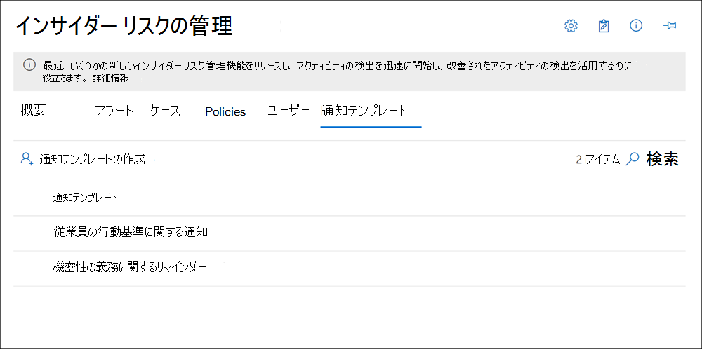

# <a name="insider-risk-management-notice-templates"></a>インサイダー リスク管理通知のテンプレート

Insider リスク管理通知テンプレートを使用すると、ユーザーのアクティビティでポリシーの一致と通知が生成された場合に、電子メール メッセージをユーザーに送信できます。 ほとんどの場合、アラートを生成するユーザー アクションは、誤った意図のない間違いや不注意なアクティビティの結果です。 通知は、ユーザーに対して、より注意深く、リフレッシュ トレーニングや企業ポリシー リソースへのリンクを提供する簡単なリマインダーとして機能します。 通知は、内部コンプライアンス トレーニング プログラムの重要な部分であり、定期的なリスク アクティビティを持つユーザーの文書化された監査証跡を作成するのに役立ちます。

問題解決プロセスの一環として、ポリシーの一致に関する通知メールをユーザーに送信する場合は、通知テンプレートを作成します。 通知は、確認中の特定のアラートに関連付けられたユーザーの電子メール アドレスにのみ送信できます。 ポリシーの一致に適用する通知テンプレートを選択する場合は、テンプレートで定義されているフィールド値を受け入れるか、必要に応じてフィールドを上書きすることもできます。

## <a name="notice-templates-dashboard"></a>通知テンプレート ダッシュボード

**通知テンプレートダッシュボード** には、構成された通知テンプレートのリストが表示され、新しい通知テンプレートを作成できます。 通知テンプレートは、最新の通知テンプレートを最初に、日付の逆順でリストに表示されます。



## <a name="html-for-notices"></a>通知の HTML

通知用の単純なテキスト ベースの電子メール メッセージ以上のメッセージを作成する場合は、通知テンプレートのメッセージ本文フィールドに HTML を使用して、より詳細なメッセージを作成できます。 次の例では、基本的な HTML ベースの電子メール通知テンプレートのメッセージ本文形式を示します。

```HTML
<!DOCTYPE html>
<html>
<body>
<h2>Action Required: Contoso User Code of Conduct Policy Training</h2>
<p>A recent activity you've performed has generated a risk alert prohibited by the Contoso User <a href='https://www.contoso.com'>Code of Conduct Policy</a>.</p>
<p>You are required to attend the Contoso User Code of Conduct <a href='https://www.contoso.com'>training</a> within the next 14 days. Please contact <a href='mailto:hr@contoso.com'>Human Resources</a> with any questions about this training request.</p>
<p>Thank you,</p>
<p><em>Human Resources</em></p>
</body>
</html>
```

> [!NOTE]
> 現在、インサイダー リスク管理通知テンプレートの HTML href 属性の実装では、URL 参照の二重引用符ではなく単一引用符のみをサポートしています。

## <a name="create-a-new-notice-template"></a>新しい通知テンプレートを作成する

新しいインサイダー リスク管理通知テンプレートを作成するには、インサイダーリスク管理ソリューションの通知ウィザードを使用Microsoft 365 コンプライアンス センター。

新しいインサイダー リスク管理通知テンプレートを作成するには、次の手順を実行します。

1. [通知] [Microsoft 365 コンプライアンス センター[Insider](https://compliance.microsoft.com)リスク管理]**に移動し**、[通知テンプレート **] タブを選択** します。
2. [通知 **テンプレートの作成] を** 選択して通知ウィザードを開きます。
3. [新しい **通知テンプレートの作成] ページで** 、次のフィールドに入力します。
    - **テンプレート名**: 通知の表示名を入力します。 この名前は、ケースから通知を送信するときに、通知ダッシュボードの通知の一覧と通知の選択リストに表示されます。
    - **[送信先**]: 通知の送信者の電子メール アドレスを入力します。 このアドレスは、ケースから通知を送信するときに変更されない限り、ユーザーに送信される通知の **[From:]** フィールドに表示されます。
    - **Cc フィールドと Bcc** フィールド: サブスクリプションの Active Directory から選択したポリシー一致の通知を受け取るオプションのユーザーまたはグループ。
    - **件名**: メッセージの件名行に表示される情報は、テキスト文字をサポートします。
    - **メッセージ本文**: メッセージ本文に表示される情報は、テキスト値または HTML 値をサポートします。
4. [**作成] を** 選択して通知テンプレートを作成して保存するか、[キャンセル] を選択して通知テンプレートを保存せずに閉じます。

## <a name="update-a-notice-template"></a>通知テンプレートの更新

既存のインサイダー リスク管理通知テンプレートを更新するには、次の手順を実行します。

1. [通知] [Microsoft 365 コンプライアンス センター[Insider](https://compliance.microsoft.com)リスク管理]**に移動し**、[通知テンプレート **] タブを選択** します。
2. 通知ダッシュボードで、管理する通知テンプレートを選択します。
3. 通知の詳細ページで、[編集] を **選択します。**
4. [編集 **] ページ** で、次のフィールドを編集できます。
    - **テンプレート名**: 通知の新しい表示名を入力します。 この名前は、ケースから通知を送信するときに、通知ダッシュボードの通知の一覧と通知の選択リストに表示されます。
    - **送信:** 通知の送信者の電子メール アドレスを更新します。 このアドレスは、ケースから通知を送信するときに変更されない限り、ユーザーに送信される通知の **[From:]** フィールドに表示されます。
    - **Cc フィールドと Bcc** フィールド: サブスクリプションの Active Directory から選択したポリシー一致の通知を受け取るオプションのユーザーまたはグループを更新します。
    - **件名**: メッセージの件名行に表示される情報を更新し、テキスト文字をサポートします。
    - **メッセージ本文**: メッセージ本文に表示される情報を更新し、テキスト値または HTML 値をサポートします。
5. [ **保存] を** 選択して通知を更新して保存するか、[キャンセル] を **選択して通知** テンプレートを保存せずに閉じます。

## <a name="delete-a-notice-template"></a>通知テンプレートを削除する

既存のインサイダー リスク管理通知テンプレートを削除するには、次の手順を実行します。

1. [通知] [Microsoft 365 コンプライアンス センター[Insider](https://compliance.microsoft.com)リスク管理]**に移動し**、[通知テンプレート **] タブを選択** します。
2. 通知ダッシュボードで、削除する通知テンプレートを選択します。
3. ツールバーの **[削除** ] アイコンを選択します。
4. 通知テンプレートを削除するには、削除ダイアログ **で [は** い] を選択します。 削除を取り消す場合は、[キャンセル] を **選択します**。
