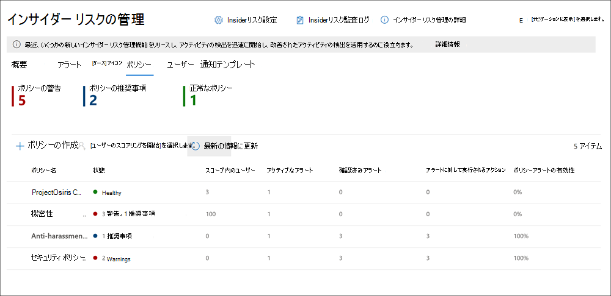
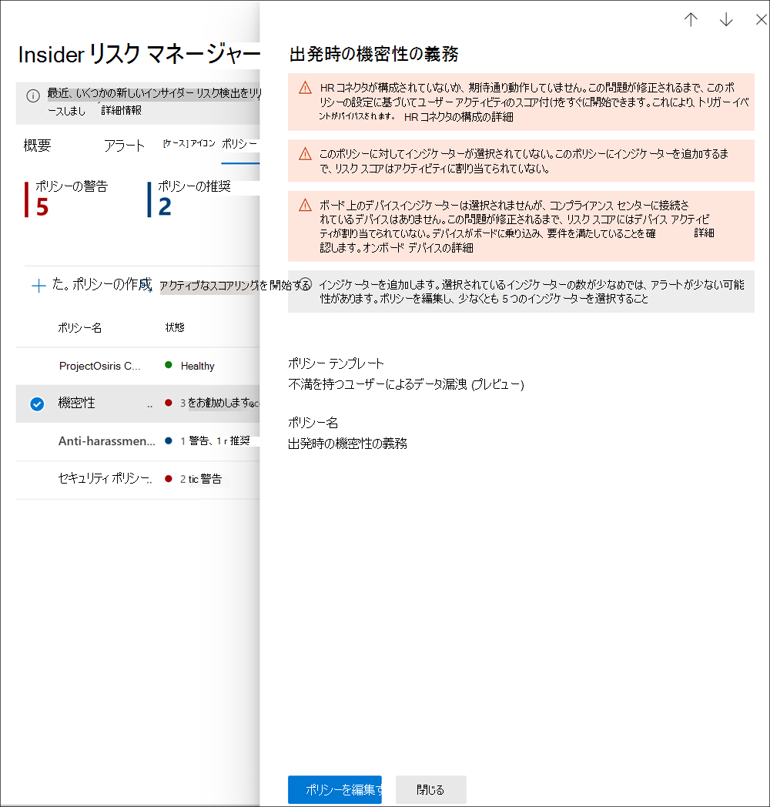

# <a name="insider-risk-management-policies"></a>インサイダー リスクの管理。

インサイダー リスク管理ポリシーには、範囲内のユーザーとアラートに設定されているリスク インジケーターの種類が定義されています。 組織内のすべてのユーザーに適用するポリシーをすばやく作成したり、ポリシーの管理のために個々のユーザーまたはグループを定義したりできます。 ポリシーは、複数または特定の Microsoft Teams、SharePoint サイト、データの秘密度レベルの種類、およびデータ ラベルにポリシー条件をフォーカスするためのコンテンツの優先度をサポートしています。 テンプレートを使用すると、特定のリスク インジケーターを選択し、ポリシー インジケーター用にイベントのしきい値をカスタマイズし、リスク スコア、リスク レベルと頻度を効果的にカスタマイズできます。 さらに、リスク スコア ブースターと異常検知機能により、重要度が高いユーザー アクティビティか、異常なユーザー アクティビティかを識別することができます。 ポリシー ウィンドウを使用すると、ポリシーを適用してアクティビティにアラートを発する期間を定義することができます。また、一度アクティブ化されたポリシーの期間を決定することもできます。

組み込みのポリシー テンプレートを使用して作成されたポリシーで、潜在的なリスクにすばやく対処する方法の概要は、[「インサイダー リスク ポリシーの構成ビデオ」](https://www.youtube.com/watch?v=kudK5ajZTUo)をご覧だください。

## <a name="policy-dashboard"></a>ポリシー ダッシュボード

**ポリシー ダッシュボード** を使用すると、組織のポリシーポリシーの正常性をすばやく表示し、ポリシーに手動でユーザーを追加し、各ポリシーに関連付けられたアラートの状態を表示することができます。

- **ポリシー名:** ポリシー ウィザードでポリシーに割り当てられた名前。
- **状態**: 各ポリシーの正常性状態。 ポリシーの警告と推奨事項の数、または問題のないポリシー *[正常性]* の状態が表示されます。  ポリシーをクリックすると、警告や推奨事項の正常性状態の詳細を表示できます。
- **アクティブなアラート:** 各ポリシーのアクティブなアラートの数。
- **確認済みのアラート:** 過去 365 日間にポリシーからのケースを引き起こしたアラートの総数。
- **アラートに対して実行されたアクション:** 過去 365 日間に確認または無視されたアラートの総数。
- **ポリシー アラートの有効性:** 確認されたアラートの総数をアラートに対して実行された確認済みのアクションの総数で除して求めた割合 (過去 1 年間に確認または無視されたアラートの合計)。



## <a name="policy-recommendations-from-analytics-preview"></a>分析からのポリシーの推奨事項 (プレビュー)

Insider リスク分析では、インサイダー リスク ポリシーを構成することなく、組織内の潜在的なインサイダー リスクの評価を行うことができます。 この評価は、組織が高いユーザー リスクの潜在的領域を特定し、構成することを考えるべきインサイダー リスク マネジメント ポリシーの種類と範囲を特定するのに役立ちます。

インサイダー リスクの分析とポリシーの推奨事項の詳細については、[「インサイダー リスク管理設定: 分析 (プレビュー)」](insider-risk-management-settings.md#analytics-preview) をご覧ください。

## <a name="policy-templates"></a>ポリシー テンプレート

インサイダー リスク管理テンプレートは、ポリシーによって監視されるリスク指標の種類を定義する、事前に定義されたポリシー条件です。 ポリシーを作成する前に、各ポリシーにポリシー作成ウィザードでテンプレートが割り当てられている必要があります。 インサイダー リスク管理では、各ポリシー テンプレートに対して最大 5 つのポリシーをサポートします。 ポリシー ウィザードを使用して新しいインサイダー リスク ポリシーを作成する場合は、次のポリシー テンプレートのうちのいずれかを選択します。

### <a name="data-theft-by-departing-users"></a>離職するユーザーによるデータ盗難

ユーザーが組織を離れる際には、離職するユーザーによるデータの盗用に典型的に関連付けられる特定のリスクがあります。 このポリシー テンプレートでは、リスクのスコアリングに抜粋のインジケーターを使用し、このリスク領域の検出とアラートに重点を当てにします。 離職するユーザーによるデータ盗難には、離職が近づく時期と離職日に、SharePoint Online からのファイルのダウンロード、ファイルの印刷、個人のクラウド メッセージングやストレージ サービスへのデータのコピーなどがあり得ます。 Microsoft 365 HR コネクタ、または組織の Azure Active Directory でのユーザー アカウント削除を自動的に監視するオプションを使用すると、このテンプレートは、これらのアクティビティに関連するリスク インジケーターと、これらのアクティビティがユーザーの雇用状態とどのように関連するかについて、スコアリングを開始します。

> [!IMPORTANT]
> このテンプレートを使用すると、Microsoft 365 HR コネクタが組織内のユーザーの離職と最終日の情報を定期的にインポートするように構成できます。 組織用の HR コネクタの段階的な構成手順については「[Microsoft 365 HR コネクタでデータをインポートする](import-hr-data.md)」を参照してください。 HR コネクタを使用しない場合は、ポリシー ウィザードでトリガー イベントを構成するときに、Azure AD オプションから削除されたユーザー アカウントを選択する必要があります。

### <a name="general-data-leaks"></a>一般的なデータ漏洩

特にユーザー、デバイス、サービスによって作成される新しいデータが急成長する中で、データの保護とデータ漏洩の防止は、ほぼすべての組織にとって常に課題です。 データ漏洩の管理をますます複雑で困難にさせているサービスやデバイス全体で、ユーザーはサービスやデバイス全体で情報の作成、保存、共有を行う権限を持ってます。 データ漏えいには、組織外での情報の偶発的な過度の共有や、悪意を持ったデータの盗用が含まれます。 データ損失防止 (DLP) ポリシーが割り当てられているか、組み込みのトリガー イベントがある場合、このテンプレートでは、不審な SharePoint Online のデータ ダウンロード、ファイルとフォルダーの共有、ファイルの印刷、個人のクラウド メッセージングやストレージ サービスへのデータのコピーをリアルタイムに検出開始します。

*データ漏洩* テンプレートを使用する場合、DLP ポリシーを割り当て、組織内の重要度が高いアラートのインサイダー リスク ポリシーのインジケーターをトリガーすることができます。 DLP ポリシー ルールによって重大度 High のアラートが生成されるたびに、Office 365 監査ログに追加されると、このテンプレートで作成されたインサイダー リスク ポリシーは、重大度の高い DLP アラートを自動的に検証します。 アラートにインサイダー リスク ポリシーで定義された範囲内のユーザーが含まれている場合、アラートはインサイダー リスク ポリシーによって新しいアラートとして処理され、Insider リスクの重大度とリスク スコアが割り当てられます。 このポリシーを使用すると、ケースに含まれる他のアクティビティとコンテキストでこのアラートを評価することができます。 DLP ポリシーを選択しない場合は、組み込みのトリガー イベントを選択する必要があります。

#### <a name="data-leaks-policy-guidelines"></a>データ漏洩ポリシーのガイドライン

インサイダー リスク管理ポリシーで使用するために DLP ポリシーを作成または変更する場合は、次のガイドラインを検討してください:

- DLP ポリシーでルールを構成するときに、データ流出イベントを優先順位付けし **インシデント レポート** 設定を *High* に割り当てるのを選択的にします。 たとえば、機密性の高いドキュメントを既知の競合他社にメールで送信するには、 *High* アラート レベルの流出イベントとする必要があります。 **インシデント レポート** の設定で *High* レベルを他の DLP ポリシー ルールに割り当て過ぎた場合、インサイダー リスク マネジメント アラート ワークフローのノイズが増える可能性があります。また、データ分析者がこれらのアラートを適切に評価するのが難しくなります。 たとえば、DLP ポリシーに *High* アラート レベルを割り当てると、本当に危険なユーザーの動作とアクティビティを評価するのが難しくなります。
- DLP およびインサイダー リスク管理ポリシーの両方で、範囲内のユーザーを理解し、適切に構成するようにします。 **データ漏洩** テンプレートを使用して、インサイダー リスク管理ポリシーの範囲として定義されているユーザーに対してだけ、重大度の高い DLP ポリシーのアラートが処理されます。 さらに、重大度の高い DLP アラートのルールで範囲として定義されているユーザーだけが、インサイダー リスク管理ポリシーで考慮対象として調査されます。 DLP とインサイダー リスク ポリシーの両方で、範囲内のユーザーを知らないうちに矛盾した構成にならないようにすることが重要です。

     たとえば、DLP ポリシー ルールの範囲が営業チームのユーザーだけで、 **データ漏洩** テンプレートから作成されたインサイダー リスク ポリシーですべてのユーザーが範囲内として定義されている場合、インサイダー リスク ポリシーは、営業チームのユーザーに対する高重大度の DLP アラートのみを処理することになります。 この場合、インサイダー リスク ポリシーは、この例で DLP ルールで定義されていない処理対象のユーザーについての高重大度の DLP アラートを受け取れなくなります。 逆に、**データ漏洩** テンプレートから作成されたインサイダー リスク ポリシーで営業チームだけを範囲に含めており、割り当てられた DLP ポリシーがすべてのユーザーを範囲内として定義されている場合、インサイダー リスク ポリシーは、営業チームのユーザーに対する高重大度の DLP アラートのみを処理することになります。 この場合、インサイダー リスク管理ポリシーでは、営業チームではないすべてのユーザーに対して重要度の高い DLP 警告を無視してしまいます。

- このインサイダー リスク管理テンプレートに使う DLP ポリシー設定での **インシデント レポート** のルール設定が重大度 *High* のアラートに設定されていることを確認してください。 重大度 *High* は、イベントをトリガーするもので、インサイダー リスク管理のアラートは、**インシデント レポート** フィールドが *Low* または *Medium* に設定された DLP ポリシーのルールからは生成されません。

    

     > [!NOTE]
     > 組み込みテンプレートを使用して新しい DLP ポリシーを作成する場合は、[**高度な DLP ルールを作成またはカスタマイズする**] オプションを選択して、の *High* 重大度レベルの [**インシデント レポート**] 設定を構成する必要があります。

**データ漏洩** テンプレートから作成される各インサイダー リスク管理ポリシーに割り当てられる DLP ポリシーは 1 つだけです。 **データ漏洩** テンプレートを使用するインサイダー リスク ポリシーをトリガーするイベントとして検出して動作させたい様々なアクティビティを組み合わせた専用の DLP ポリシーを作成することを検討してください。

組織の DLP ポリシーを構成する方法については、「[DLP ポリシーの作成、テスト、調整](create-test-tune-dlp-policy.md)」の記事をご覧ください。

### <a name="data-leaks-by-priority-users-preview"></a>優先度の高いユーザーによるデータ漏洩 (プレビュー)

組織内のユーザーのデータを保護し、データの漏洩を防ぐ方法は、機密情報へのアクセス レベル、リスク履歴によって異なる場合があります。 データ漏洩には、組織外での情報の偶発的な過度の共有や、悪意のあるデータの盗難が含まれます。 データ損失防止 (DLP) ポリシーが割り当てられている場合、このテンプレートは、不審なアクティビティのリアルタイム検出にスコアを付け始め、重大度の高いインサイダー リスク アラート、および重大度がより高いアラートの発見確率が高まります。 優先度のユーザーは、インサイダー リスク管理設定領域で [優先ユーザー グループ](insider-risk-management-settings.md#priority-user-groups-preview) として定義されます。

**データ漏洩テンプレート** を使用する場合と同様、組織内の重要度が高いアラートのインサイダー リスク ポリシーのインジケーターをトリガーできるよう、DLP ポリシーを割り当てることが必要です。 このテンプレートを使用してポリシーを作成する場合は、上記のデータ漏洩ポリシーのガイドラインに従います。 さらに、Insider リスクマネジメント **インサイダー リスク管理** > **設定** > **優先ユーザー グループ** で作成した優先ユーザー グループをポリシーに割り当てる必要があります。

### <a name="data-leaks-by-disgruntled-users-preview"></a>不満を持つユーザーによるデータ漏洩 (プレビュー)

就業上のストレスを感じ取ったユーザーは、不満を感じ、インサイダー リスク アクティビティの可能性を高める可能性があります。 このテンプレートは、不満に関連付けられたインジケーターが識別されると、ユーザー アクティビティのスコアを開始します。 たとえば、パフォーマンス向上の通知、低パフォーマンスのレビュー、ジョブ レベルの状態の変更などです。 不満を持つユーザーによるデータ盗難には、修行上のストレス要因となるイベント発生付近で、SharePoint Online からのファイルのダウンロード、ファイルの印刷、個人のクラウド メッセージングやストレージ サービスへのデータのコピーなどがあり得ます。

このテンプレートを使用する場合は、組織内のユーザーのパフォーマンス向上通知、低パフォーマンス レビュー状態、または組織内のユーザーのジョブ レベルの変更情報を定期的にインポートする Microsoft 365 HR コネクタも構成する必要があります。 組織用の HR コネクタの段階的な構成手順については「[Microsoft 365 HR コネクタでデータをインポートする](import-hr-data.md)」を参照してください。

### <a name="general-security-policy-violations-preview"></a>一般的なセキュリティ ポリシー違反 (プレビュー)

多くの組織では、ユーザーは自分のデバイスにソフトウェアをインストールしたり、タスクに役立つデバイスの設定を変更したりする権限を持っています。 誤って、または悪意のあるユーザーが、マルウェアをインストールしたり、デバイスやネットワーク リソースの情報を保護するのに役立つ重要なセキュリティ機能を無効にしたりする可能性があります。 このポリシー テンプレートでは、Microsoft Defender for Endpoint からのセキュリティ　アラートを使用して、これらのアクティビティのスコアを開始し、このリスク領域へのフォーカス検出とアラートを開始します。 このテンプレートを使用して、インサイダー リスクの可能性があるセキュリティー ポリシー違反履歴をしているかもしれないシナリオで。セキュリティー ポリシー違反に関する分析情報を得られます。

セキュリティ違反警告をインポートするには、組織に Microsoft Defender for Endpoint を構成し、Defender セキュリティ センターで Microsoft Defender for Endpoint とインサイダー リスク管理統合を有効にする必要があります。 インサイダー リスク管理統合のために Microsoft Defender for Endpoint を構成する方法の詳細については、「[Microsoft Defender for Endpoint で高度な機能を構成する](/windows/security/threat-protection/microsoft-defender-atp/advanced-features#share-endpoint-alerts-with-microsoft-compliance-center)」を参照してください。

### <a name="security-policy-violations-by-departing-users-preview"></a>離職するユーザーによるセキュリティ ポリシー違反 (プレビュー)

理由がポジティブであってもネガティブであっても、離職するユーザーはセキュリティ ポリシー違反のリスクが高くなる可能性があります。 離職するユーザーの不注意または悪意のあるセキュリティ違反から保護するために、このポリシー テンプレートでは Defender for Endpoint のアラートを使用して、セキュリティ関連のアクティビティの分析情報を提供します。 これらのアクティビティとして、ユーザーによるデバイスへのマルウェアその他有害な可能性のあるアプリケーションのインストール、セキュリティ機能の無効化などがあります。 [Microsoft 365 HR コネクタ](import-hr-data.md)、または組織の Azure Active Directory でのユーザー アカウント削除を自動的に監視するオプションを使用すると、このテンプレートは、これらのアクティビティに関連するリスク インジケーターと、これらのアクティビティがユーザーの雇用状態とどのように関連するかについて、スコアリングを開始します。

セキュリティ違反警告をインポートするには、組織に Microsoft Defender for Endpoint を構成し、Defender セキュリティ センターで Microsoft Defender for Endpoint とインサイダー リスク管理統合を有効にする必要があります。 インサイダー リスク管理統合のために Microsoft Defender for Endpoint を構成する方法の詳細については、「[Microsoft Defender for Endpoint で高度な機能を構成する](/windows/security/threat-protection/microsoft-defender-atp/advanced-features#share-endpoint-alerts-with-microsoft-compliance-center)」を参照してください。

### <a name="security-policy-violations-by-priority-users-preview"></a>優先ユーザーによるセキュリティ ポリシー違反 (プレビュー)

組織内のユーザーのセキュリティ違反を防ぐ方法は、ユーザーの地位、機密情報へのアクセス レベル、リスク履歴によって異なる場合があります。 優先ユーザーのセキュリティ違反は組織の最重要領域に大きな影響を与える可能性があるため、このポリシー テンプレートはこれらのインジケーターにスコアを付け始め、Microsoft Defender for Endpoint のアラートを使用して、これらのユーザーのセキュリティ関連のアクティビティの分析情報を提供します。 これらのアクティビティとして、優先ユーザーによるデバイスへのマルウェアその他有害な可能性のあるアプリケーションのインストール、セキュリティ機能の無効化などがあります。 優先ユーザーは、インサイダー リスク管理設定領域で優先ユーザー グループとして定義されます。

セキュリティ違反警告をインポートするには、組織に Microsoft Defender for Endpoint を構成し、Defender セキュリティ センターで Microsoft Defender for Endpoint とインサイダー リスク管理統合を有効にする必要があります。 インサイダー リスク管理統合のために Microsoft Defender for Endpoint を構成する方法の詳細については、「[Microsoft Defender for Endpoint で高度な機能を構成する](/windows/security/threat-protection/microsoft-defender-atp/advanced-features#share-endpoint-alerts-with-microsoft-compliance-center)」を参照してください。 さらに、Insider リスクマネジメント **インサイダー リスク管理** > **設定** > **優先ユーザー グループ** で作成した優先ユーザー グループをポリシーに割り当てる必要があります。

### <a name="security-policy-violations-by-disgruntled-users-preview"></a>不満を持つユーザーによるセキュリティ ポリシー違反 (プレビュー)

就業上のストレスを経験しているユーザーには、不注意または悪意のあるセキュリティ ポリシー違反のリスクが高くなる可能性があります。 これらストレス要因には、パフォーマンス向上計画に置かれたユーザー、パフォーマンス レビュー状態の低下、現在のポジションから降格しているユーザーなどが含まれる場合があります。 このポリシー テンプレートは、こういったインジケーターおよびこれらユーザーに関するこうしたイベントに関連するアクティビティに基づいて、リスク スコアリングを開始します。

このテンプレートを使用する場合は、組織内のユーザーのパフォーマンス向上通知、低パフォーマンス レビュー状態、または組織内のユーザーのジョブ レベルの変更情報を定期的にインポートする Microsoft 365 HR コネクタも構成する必要があります。 組織用の HR コネクタの段階的な構成手順については「[Microsoft 365 HR コネクタでデータをインポートする](import-hr-data.md)」を参照してください。

セキュリティ違反アラートをインポートするには、組織に Microsoft Defender for Endpoint を構成し、Defender セキュリティ センターで Microsoft Defender for Endpoint とインサイダー リスク管理統合を有効にする必要があります。 インサイダー リスク管理統合のために Microsoft Defender for Endpoint を構成する方法の詳細については、「[Microsoft Defender for Endpoint で高度な機能を構成する](/windows/security/threat-protection/microsoft-defender-atp/advanced-features#share-endpoint-alerts-with-microsoft-compliance-center)」を参照してください。

### <a name="policy-template-prerequisites-and-triggering-events"></a>ポリシー テンプレートの前提条件とトリガーとなるイベント

インサイダー リスク管理ポリシーに選択したテンプレートに応じて、トリガーとなるイベントとポリシーの前提条件は異なります。 トリガーとなるイベントは、ユーザーをインサイダー リスク マネジメント ポリシーでアクティブにするかどうかを決定する前提条件です。 ユーザーがインサイダー リスク管理ポリシーに追加されたが、トリガーとなるイベントがない場合、ユーザー ダッシュボードに手動で追加されない限り、ポリシーによってユーザー アクティビティが評価されることはありません。 ポリシーの前提条件は、ポリシーがリスクの評価に必要なシグナルまたはアクティビティを受信するために必要なアイテムです。

次の表は、各インサイダー リスク管理ポリシー テンプレートから作成されたポリシーのトリガーとなるイベントと前提条件を示しています。

| **ポリシー テンプレート** | **ポリシーでトリガーとなるイベント** | **前提条件** |
| :------------------ | :--------------------------------- | :---------------- |
| 離職するユーザーによるデータ盗難 | HR コネクタからの辞職または離職日のインジケーター | (オプション) 辞職または離職日のインジケーター用に構成された Microsoft 365 HR コネクタ、または Azure Directory 統合が有効化されたもの |
| 一般的なデータ漏洩 | 重大度の High のアラートを作成するデータ 漏洩ポリシー アクティビティ | (オプション) 重大度 High のアラートまたは組み込みのデータ流出のトリガーとなるイベント用に構成された DLP ポリシー |
| 優先ユーザーによるデータ漏洩 | *重大度 High* のアラートを作成する、または組み込みのデータ流出イベントのトリガーとなるデータ漏洩ポリシー アクティビティ | (オプション) 重大度 High のアラート用に構成された DLP ポリシー <br><br> インサイダー リスク設定で構成された優先ユーザー グループ |
| 不満を持つユーザーによるデータ漏洩 | HR コネクタからのパフォーマンスの向上、パフォーマンス低下、またはジョブ レベルの変更に関するインジケーター | 不満インジケーター用に構成された Microsoft 365 HR コネクタ |
| 一般的なセキュリティ ポリシー違反 | Microsoft Defender for Endpoint で検出されたセキュリティ コントロールまたは望ましくないソフトウェアの防御的回避 | アクティブな Microsoft Defender for Endpoint のサブスクリプション <br><br> Microsoft 365 コンプライアンス センターを構成した Microsoft Defender for Endpoint 統合 |
| 離職するユーザーによるセキュリティ ポリシー違反 | HR コネクタまたは Azure Active Directory アカウントの削除からの辞職または離職日のインジケーター | (オプション) 辞職または離職日のインジケーター用に構成された Microsoft 365 HR コネクタ <br><br> アクティブな Microsoft Defender for Endpoint のサブスクリプション <br><br> Microsoft 365 コンプライアンス センターを構成した Microsoft Defender for Endpoint 統合 |
| 優先ユーザーによるセキュリティ ポリシー違反 | Microsoft Defender for Endpoint で検出されたセキュリティ コントロールまたは望ましくないソフトウェアの防御的回避 | アクティブな Microsoft Defender for Endpoint のサブスクリプション <br><br> Microsoft 365 コンプライアンス センターを構成した Microsoft Defender for Endpoint 統合 <br><br> インサイダー リスク設定で構成された優先ユーザー グループ |
| 不満を持つユーザーによるセキュリティ ポリシー違反 | HR コネクタからのパフォーマンスの向上、パフォーマンス低下、またはジョブ レベルの変更に関するインジケーター | 不満インジケーター用に構成された Microsoft 365 HR コネクタ <br><br> アクティブな Microsoft Defender for Endpoint のサブスクリプション <br><br> Microsoft 365 コンプライアンス センターを構成した Microsoft Defender for Endpoint 統合 |

## <a name="prioritize-content-in-policies"></a>ポリシー内のコンテンツの優先化

インサイダー リスク管理ポリシーでは、コンテンツの保存場所や分類方法に応じて、コンテンツにより高い優先度を指定できます。 コンテンツを優先と指定すると、関連するアクティビティのリスク スコアが高くなります。その結果、重大度 High のアラートが生成される確率が高くなります。 ただし、関連するコンテンツに組み込みの機密情報の種類またはカスタムの機密情報の種類が含まれているか、ポリシーで優先として指定されていない限り、一部のアクティビティは通知を生成しません。

たとえば、組織に機密性の高いプロジェクト用の SharePoint 専用サイトがある場合です。 この SharePoint サイトの情報が漏洩すると、プロジェクトが侵害され、プロジェクトの成功に大きな影響を与える可能性があります。 データ漏洩ポリシーでこの SharePoint サイトを優先化すると、条件を満たすアクティビティのリスク スコアが自動的に上がっていきます。 この優先化の方法では、これらのアクティビティでインサイダー リスクのアラートが生成される可能性が高まり、アラートの重大度レベルが上がります。

ポリシー ウィザードでインサイダー リスク管理ポリシーを作成する場合、次の優先度から選択できます。

- **SharePoint サイト**: 定義された SharePoint サイト内のすべての種類のファイルに関連付けられたすべてのアクティビティに、より高いリスク スコアが割り当てられます。 
- **機密情報の種類**: [機密情報の種類](sensitive-information-type-entity-definitions.md) を含むコンテンツに関連するすべてのアクティビティに、より高いリスク スコアが割り当てられます。
- **秘密度ラベル**: [秘密度ラベル](sensitivity-labels.md) を有するコンテンツに関連するすべてのアクティビティに、より高いリスク スコアが割り当てられます。

## <a name="sequence-detection-preview"></a>シーケンスの検出 (プレビュー)

危険なアクティビティは、分離されたイベントとして発生しない場合があります。 これらのリスクは、多くの場合、大規模なイベント シーケンスの一部となっています。 シーケンスとは、次々と実行される、高いリスクが7疑われる 2 つ以上のユーザー アクティビティのグループです。 リスク全体を評価する上で、これらの関連するアクティビティを特定することが重要です。 データの盗難またはデータ漏洩のポリシーでシーケンス検出を有効にすると、インサイダー リスク管理ケース内の **[ユーザー アクティビティ]** タブにシーケンス情報アクティビティからの分析情報が表示されます。 次のポリシー テンプレートは、シーケンス検出をサポートしています。

- 離職するユーザーによるデータ盗難
- 一般的なデータ漏洩
- 優先ユーザーによるデータ漏洩
- 不満を持つユーザーによるデータ漏洩

これらのインサイダー リスク管理ポリシーでは、特定のインジケーターと、それらインジケーターの発生する順序を利用して、リスクのシーケンスの各ステップを検出します。 ファイル名は、シーケンス全体でアクティビティをマッピングするときに使用します。 これらのリスクは、 4 つ主なアクティビティ カテゴリに分類されます。

- **コレクション**: これらのカテゴリは、範囲内のポリシー ユーザーによるダウンロード アクティビティに重点を置くことを示唆しています。 このカテゴリのアクティビティ例では、SharePoint サイトからファイルをダウンロードします。
- **流出**: これらのカテゴリ信号は、範囲内のポリシー ユーザーによって内部および外部ソースへの共有または抽出アクティビティに重点を置くことを示唆しています。 このカテゴリのアクティビティ例では、組織の添付ファイルを含むメールを外部の受信者に送信します。
- **難読化**: これらのカテゴリ信号は、範囲内のポリシー ユーザーによるリスクのあるアクティビティのマスキングに重点を置くことを示唆しています。 このカテゴリのアクティビティ例では、デバイス上のファイル名が変更されます。
- **クリーンアップ**: これらのカテゴリは、範囲内のポリシー ユーザーによる削除アクティビティに重点を置くことを示唆しています。 このカテゴリのアクティビティ例では、デバイスからのファイルを削除しています。

> [!NOTE]
> シーケンス検出では、インサイダー リスク管理のグローバル設定で有効になっているインジケーターと、ポリシーで選択されているインジケーターを使用します。 適切なインジケーターが選択されていない場合、シーケンス検出は機能しません。

ポリシーで構成されている場合、シーケンス検出の種類ごとに個別のしきい値の設定をカスタマイズできます。 これらのしきい値の設定は、シーケンスに関連付けられているファイルの量に基づいて警アラートを調整します。

**[ユーザー アクティビティ]** 管理] ビューでのシーケンス検出の詳細については、[「インサイダー リスク管理ケース: ユーザー アクティビティ」](insider-risk-management-cases.md#user-activity)をご覧ください。

## <a name="cumulative-exfiltration-detection-preview"></a>累積流出検出 (プレビュー)

インサイダー リスク インジケーターは、インサイダー リスク ポリシーの範囲内のユーザーについて毎日評価を行う場合、異常なレベルのリスク アクティビティを識別するのに役立ちます。 累積流出検出では、機械学習モデルを使用して、一定時間、複数の種類の流出アクティビティを測定して、ユーザーの流出アクティビティが組織の平均を超えている場合を特定するのに役立ちます。 インサイダー リスク管理のアナリストや調査者は、累積検出分析情報を使用すれば、通常はアラートを生成しないかも知れないが、組織に通常レベル以上のアクティビティが検出できるかも知れません。 一部の例では、離職するユーザーが何日間にもわたってゆっくりとデータを流出させている場合や、組織の通常のデータ共有の頻度よりも高く複数のチャネルでデータをクリア消し共有しているユーザーがいる場合もあります。

次のポリシー テンプレートを使用すると、既定で累積流出検出が有効になります。

- 離職するユーザーによるデータ盗難
- 一般的なデータ漏洩
- 優先ユーザーによるデータ漏洩
- 不満を持つユーザーによるデータ漏洩

> [!NOTE]
> 累積流出検出では、インサイダー リスク管理のグローバル設定で有効になっている流出インジケーターと、ポリシーで選択されている流出インジケーターを使用します。 そのため、累積流出検出は、選択された必要な流出インジケーターに対してのみ評価されます。

データの盗難またはデータ漏洩のポリシーで累積流出検出を有効にすると、インサイダー リスク管理ケース内の **[ユーザー アクティビティ]** タブに累積流出アクティビティからの分析情報が表示されます。

ユーザー アクティビティ管理についての詳細は、[「インサイダー リスク管理ケース: ユーザー アクティビティ」](insider-risk-management-cases.md#user-activity)をご覧ください。

## <a name="policy-health-preview"></a>ポリシーの正常性 (プレビュー)

ポリシーの正常性状態は、インサイダー リスク管理ポリシーで発生する可能性のある問題の分析情報が得られます。 [ポリシー] タブの [状態] 列では、ユーザー アクティビティの報告を妨げる可能性があるポリシーの問題や、アクティビティアラート数が異常である理由についてアラートします。 ポリシーの正常性の状態は、ポリシーが正常であり、注意や構成変更を必要としないということも確認できます。

ポリシーに問題がある場合、ポリシーの正常性の状態には、ポリシーの問題を解決するためのアクションを実行するのに役立つ通知の警告と推奨事項が表示されます。これらの通知は、次の問題を解決するのに役立ちます:

- 不完全な構成のポリシー。これらの問題には、ポリシーにユーザーやグループが不足している場合や、その他のポリシー構成段階が不完全な場合が含まれます。
- インジケーターの構成に関して問題のあるポリシー。 インジケーターは、各ポリシーの重要な部分です。 インジケーターが構成されていない場合、またはインジケーターが少なすぎる場合は、ポリシーでリスクの高いアクティビティが期待通り評価されない場合があります。
- ポリシー トリガーが機能しない、またはポリシー トリガー要件が正しく構成されていない。 ポリシー機能は、ポリシー内のユーザーにリスク スコアの割り当てをアクティブ化するトリガー イベントを効果的に検出するために、他のサービスや構成要件に依存する場合があります。 この依存関係には、コネクタの構成の問題、Microsoft Defender for Endpoint のアラート共有、データ損失防止ポリシー構成設定が含まれる場合があります。
- ボリューム制限が近い、または上限を超えています。 インサイダー リスク管理ポリシーでは、多数の Microsoft 365 サービスとエンドポイントを使用して、リスク　アクティビティ　シグナルを集計しています。 ポリシーのユーザー数に応じて、ボリューム制限により、リスクアクティビティの識別やレポートが遅れる場合があります。 これらの制限の詳細については、この記事の「ポリシー テンプレートの制限」セクションを参照してください。

ポリシーの正常性の状態をすばやく表示するには、[ポリシー] タブと [状態] 列を移動します。 ここでは、各ポリシーに対して次のポリシー正常性状態オプションが表示されます。

- 正常: ポリシーで問題が特定されていない。
- 推奨事項: ポリシーには、ポリシーが期待どおりに動作しない可能性のある問題があります。
- 警告: リスクの高いアクティビティの特定を妨げるポリシーの問題があります。

推奨事項または警告の詳細については、**[ポリシー]** タブでポリシーを選択して、ポリシーの詳細カードを開きます。 推奨事項と警告に関する詳細情報 (これらの問題に対処する方法のガイダンスなど) は、詳細カードの [通知] セクションに表示されます。



### <a name="notification-messages"></a>通知メッセージ

次の表では、推奨事項、警告通知、および潜在的な問題を解決するために実行するアクションについて説明します。

|**通知メッセージ**|**ポリシー テンプレート**|**原因 / このアクションを試して解決する**|
|:------------------------|:-------------------|:---------------------------|
| ポリシーによるアクティビティへのリスク スコアの割り当ては行われていません。 | すべてのポリシー テンプレート | ポリシーがアクティビティにリスク スコアを割り当てできるよう、ポリシーの範囲を確認し、トリガーとなるイベントの構成を行うことができます。 <br><br> 1. ポリシーに対して選択されているユーザーを確認します。 選択したユーザーが少数の場合は、追加のユーザーを選択できます。 <br> 2. HR コネクタを使用している場合は、HR コネクタが正しいデータを送信していることを確認します。 <br> 3. DLP ポリシーをトリガーとなるイベントとして使用している場合は、DLP ポリシーの構成を確認し、このポリシーで使用するように構成されていることを確認します。 <br> 4. セキュリティ違反ポリシーについては、[インサイダー リスク設定] > [インテリジェントな検出] で選択された Microsoft Defender for Endpoint アラート トリアージの状態を確認します。アラート フィルターが狭すぎないかを確認します。 |
| ポリシーはアラートを生成していません。 | すべてのポリシー テンプレート | ポリシーの構成を確認して、注意するべきアクティビティのスコアを分析しているかを確認します。 <br><br> 1. スコアを付けしたいインジケーターを選択していることを確認します。 選択したインジケーターの数が多いほど、多くのアクティビティにリスク スコアが割り当てられます。 <br> 2. ポリシーのしきい値のカスタマイズを確認します。選択したしきい値が組織のリスク許容範囲と一致しない場合は、望みのしきい値に基づいてアラートが生成されるように選択範囲を調整します。 <br> 3.. ポリシーに対して選択されているユーザーおよびグループを確認します。 該当するユーザーおよびグループのすべてを選択していることを確認します。 <br> 4. セキュリティ違反ポリシーの場合、設定のインテリジェント検出で Microsoft Defender for Endpoint アラートのスコアを付けしたいアラート トリアージ状態が選択済みであることを確認します。|
| このポリシーには、ユーザーまたはグループは含まれません。 | すべてのポリシー テンプレート | ユーザーまたはグループがポリシーに割り当てられていない。 <br><br> ポリシーを編集し、ポリシーのユーザーまたはグループを選択します。 |
| このポリシーに対してインジケーターが選択されていない | すべてのポリシー テンプレート | このポリシーに対してインジケーターが選択されていません。 <br><br> ポリシーを編集し、ポリシーに適したポリシー インジケーターを選択します。 |
| このポリシーには、優先ユーザー グループは含まれません。 | - 優先ユーザーによるデータ漏洩 <br> - 優先ユーザーによるセキュリティ ポリシー違反 | 優先ユーザー グループがポリシーに割り当てられていない。 <br><br> さらに、インサイダー リスクマネジメント設定で優先ユーザー グループを構成し、優先ユーザー グループをポリシーに割り当てます。 |
| トリガーとなるイベントがこのポリシーでは選択されていません。 | すべてのポリシー テンプレート | トリガーとなるイベントがポリシーに対して構成されていない <br><br> リスク スコアは、ポリシーを編集してトリガーとなるイベントを選択するまで、ユーザー アクティビティには割り当てられません。 |
| HR コネクタが構成されていないか、期待どおりに機能していない | - 離職するユーザーによるデータ盗難 <br> - 離職するユーザーによるセキュリティ ポリシー違反 <br> - 不満を持つユーザーによるデータ漏洩 <br> - 不満を持つユーザーによるセキュリティ ポリシー違反 | HR コネクタに問題があります。 <br><br> 1. HR コネクタを使用している場合は、HR コネクタが正しいデータを送信していることを確認します。 <br><br> または <br><br> 2. Azure AD アカウント削除のトリガーとなるイベントを選択します。 |
| デバイスがオンボードされていない。 | - 離職するユーザーによるデータ盗難 <br> - 一般的なデータ漏洩 <br> - 不満を持つユーザーによるデータ漏洩 <br> - 優先ユーザーによるデータ漏洩 | デバイス インジケーターは選択されていますが、Microsoft 365 にオンボードされているデバイスがありません。 <br><br> デバイスがオンボード済みであり、要件を満たしていることを確認します。 |
| HR コネクタが最近データをアップロードしていない | - 離職するユーザーによるデータ盗難 <br> - 離職するユーザーによるセキュリティ ポリシー違反 <br> - 不満を持つユーザーによるデータ漏洩 <br> - 不満を持つユーザーによるセキュリティ ポリシー違反 | HR コネクタが 7 日以上データをインポートしていない。 <br><br> HR コネクタが正しく構成され、データを送信しているかを確認します。 |
| 現在、HR コネクタの状態を確認できません。後でもう一度確認してください。 | - 離職するユーザーによるデータ盗難 <br> - 離職するユーザーによるセキュリティ ポリシー違反 <br> - 不満を持つユーザーによるデータ漏洩 <br> - 不満を持つユーザーによるセキュリティ ポリシー違反 | インサイダー リスク管理ソリューションでは、HR コネクタの状態を確認できません。 <br><br> HR コネクタが正しく構成され、データを送信しているかを確認します。または、戻ってポリシー状態を確認します。  |
| トリガー イベントとして DLP ポリシーが選択されていません。 | - 一般的なデータ漏洩 <br> - 優先ユーザーによるデータ漏洩 | DLP ポリシーがトリガー イベントとして選択されていないか、選択した DLP ポリシーが削除されています。 <br><br> ポリシーを編集して、ポリシー構成でアクティブな DLP ポリシーを選択するか、トリガーとなるイベントとして 'ユーザーが流出アクティビティを実行する' を選択します。 |
| このポリシーで使用される DLP ポリシーがオフになっている | - 一般的なデータ漏洩 <br> - 優先ユーザーによるデータ漏洩 | このポリシーで使用される DLP ポリシーがオフになっています。 <br><br> 1. このポリシーに割り当てられている DLP ポリシーを有効にする。 <br><br> または <br><br> 2. ポリシーを編集して、ポリシー構成でアクティブな DLP ポリシーを選択するか、トリガーとなるイベントとして 'ユーザーが流出アクティビティを実行する' を選択します。 |
| DLP ポリシーが要件を満たしていない | - 一般的なデータ漏洩 <br> - 優先ユーザーによるデータ漏洩 | トリガーとなるイベントとして使用される DLP ポリシーを、高重大度 High のアラートを生成するように構成する必要があります。 <br><br>  1. DLP ポリシーを編集して、*重大度 High* として適正なアラートを割り当てます。 <br><br> または <br><br> 2. このポリシーを編集し、トリガーとなるイベントとして *ユーザーが流出アクティビティを実行* を選択します。 |
| 組織に Microsoft Defender for Endpoint サブスクリプションがない | - 一般的なセキュリティ ポリシー違反 <br> - 離職するユーザーによるセキュリティ ポリシー違反 <br> - 不満を持つユーザーによるセキュリティ ポリシー違反 <br> - 優先ユーザーによるセキュリティ ポリシー違反 | 組織に Microsoft Defender for Endpoint のアクティブなサブスクリプションが見つかりませんでした。 <br><br> Microsoft Defender for Endpoint のサブスクリプションが追加されるまで、これらのポリシーによりユーザー アクティビティにリスク スコアは割り当てられません。 |
| Microsoft Defender for Endpoint アラートがコンプライアンス センターと共有されていない | - 一般的なセキュリティ ポリシー違反 <br> - 離職するユーザーによるセキュリティ ポリシー違反 <br> - 不満を持つユーザーによるセキュリティ ポリシー違反 <br> - 優先ユーザーによるセキュリティ ポリシー違反 | Microsoft Defender for Endpoint アラートはコンプライアンス センターと共有されています。 <br><br> Microsoft Defender for Endpoint のアラートの共有を構成します。 |
| このポリシー テンプレートでアクティブにスコアを付けられるユーザーの最大数に近づいています。 | すべてのポリシー テンプレート | 各ポリシー テンプレートには、範囲内のユーザーの最大数があります。 テンプレートの制限に関するセクションの詳細を参照してください。 <br><br> [ユーザー] タブでユーザーを確認し、スコアを付ける必要のなくなったユーザーを削除してください。 |

## <a name="policy-template-limits"></a>ポリシー テンプレートの限界

インサイダー リスク管理ポリシー テンプレートでは、制限を使用して、範囲内のユーザーのリスク アクティビティの処理量と速度を管理するための制限を設けてり、このプロセスと Microsoft 365 サービスのサポートとの統合方法を管理しています。 各ポリシー テンプレートには、そのポリシーのリスク スコアをアクティブに割り当てることができる最大ユーザー数が決まっており、リスク アクティビティを効果的に処理しレポートできるようにしています。 範囲内のユーザーは、ポリシーのトリガーとなるイベントを持つユーザーです。

各ポリシーの制限は、ポリシー テンプレートの種類別にリスク スコアを受け取る一意のユーザーの総数に基づいて計算されます。 ポリシー テンプレートの種類のユーザー数がユーザーの制限に近い、または超過している場合、ポリシーのパフォーマンスは低下します。 ポリシーの現在のユーザー数を表示するには、[ポリシー] タブと [範囲内のユーザー] 列に移動します。 どのポリシー テンプレートにも、最大 5 つのポリシーを設定できます。 これらの上限は、任意のポリシー テンプレートを使用するすべてのポリシーにわたってユーザーに適用されます。

次の表を使用して、各ポリシー テンプレートでサポートされる範囲内のユーザーの最大数を決定します。

|**ポリシー テンプレート**|**現在の範囲内の最大ユーザー数**|
|:------------------|:--------------------------------|
| 一般的なデータ漏洩 | 15,000 |
| 不満を持つユーザーによるデータ漏洩 | 7,500 |
| 優先ユーザーによるデータ漏洩 | 1,000 |
| 離職するユーザーによるデータ盗難 | 20,000 |
| 一般的なセキュリティ ポリシー違反 | 1,000 |
| 優先ユーザーによるセキュリティ ポリシー違反 | 1,000 |
| 離職するユーザーによるセキュリティ ポリシー違反 | 15,000 |
| 不満を持つユーザーによるセキュリティ ポリシー違反 | 7,500 |

## <a name="create-a-new-policy"></a>新しいポリシーの作成

新しいインサイダー リスク管理ポリシーを作成するには、Microsoft 365 コンプライアンス センターの **インサイダー リスク管理** ソリューションのポリシー ウィザードを使用します。

次の手順を使用して、手動の変更を完成させます。

1. [Microsoft 365 コンプライアンス センター](https://compliance.microsoft.com)で、**インサイダー リスク管理** に移動し、**[ポリシー]** タブ を選択します。
2. **[ポリシーの作成]** を選択し、ポリシー ウィザードを開きます。
3. **[ポリシー テンプレート]** ページで、ポリシー カテゴリを選択し、新しいポリシーのテンプレートを選択します。 これらのテンプレートは、検出および調査するリスク アクティビティを定義する条件とインジケーターで構成されています。 テンプレートの前提条件を確認し、トリガーとなるイベントと検出されたアクティビティを確認し、このポリシー テンプレートがニーズに適していることを確認します。

    > [!IMPORTANT]
    > 一部のポリシー テンプレートには、ポリシーに関連するアラートを生成するための構成が必要となる前提条件があります。 該当するポリシーの前提条件を構成していない場合は、上記の **手順 4** を参照してください。

4. [**次へ**] を選んで続行します。
5. **[名前と説明]** ページで、次のフィールドを入力します。
    - **名前 (必須)**: ポリシーのフレンドリ名を入力します。 この名前は、ポリシー作成後には変更できません。
    - **説明 (省略可能)**: ポリシーの説明を入力します。

6. [**次へ**] を選んで続行します。
7. [**ユーザーとグループ**] ページで、[**すべてのユーザーとグループを含める**] または [**特定のユーザーとグループを含める**] を選び、ポリシーに含めるユーザーまたはグループを定義するか、優先ユーザーに基づくテンプレートを選んでいた場合には、[**優先ユーザー グループを追加または編集する**] を選択します。 [**すべてのユーザーとグループを含める**] を選択すると、ポリシーのリスク スコアの割り当てを開始するために、組織内のすべてのユーザーとグループのトリガー イベントを探すことになります。 [**特定のユーザーとグループを含める**] を選択すると、どのユーザーとグループにポリシーを適用するかを定義できます。
8. [**次へ**] を選んで続行します。
9. [**優先するコンテンツ**] ページで、(必要に応じて) 優先するソースを割り当てることができるので、その結果、これらのソースに対して重大度 High のアラートが生成される可能性が高くなります。 次のいずれかを選択します。

    - **SharePoint サイト、秘密度ラベル、または機密情報の種類を優先コンテンツとして指定する**。 このオプションを選択すると、ウィザードでこれらのチャネルを構成する詳細ページが有効になります。
    - **優先度の高いコンテンツを現在指定しない (ポリシーの作成後に指定可能)**。 このオプションを選択すると、ウィザードのチャネル詳細ページがスキップされます。

10. [**次へ**] を選んで続行します。

11. 前の手順で、**SharePoint サイト、秘密度ラベル、または機密情報の種類を優先コンテンツとして指定する** を選択した場合、*SharePoint サイト*、*機密情報の種類*、および *の機密性のラベル* の詳細ページが表示されます。 これらの詳細ページを使用して、ポリシーの優先順位を設定する SharePoint、機密情報の種類、および機密性のラベルを定義します。

    - **SharePoint サイト**: **[SharePoint サイトの追加]** を選択し、アクセスして優先化する SharePoint サイトを選択します。 たとえば, *"group1@contoso.sharepoint.com/sites/group1"*。
    - **機密情報の種類**: **[優先する機密情報 の種類を追加する]** を選択し、優先順位を付ける機密性の高い種類を選択します。 たとえば、"*米国の銀行口座番号*" と "*クレジット カード番号*" を入力。
    - **秘密度ラベル**: **[秘密度ラベルの追加]** を選択して優先化したいラベルを選択します。 たとえば、*"機密情報"* や *"シークレット"*。

12. [**次へ**] を選んで続行します。
13. **[インジケーターとトリガーされるイベント]** ページで、**インサイダー リスク設定** > **インジケーター** ページで利用可能と定義した [インジケーター](insider-risk-management-settings.md#indicators) が表示されます。 ウィザードの最初に *データ漏洩* テンプレートを選択した場合、ポリシーのインジケーターをトリガーしたり、組み込みのトリガー イベントを選択したりするには、 **DLP ポリシー** ドロップダウン リストから DLP ポリシーを選択する必要があります。

    > [!IMPORTANT]
    > このページのインジケーターを選択できない場合、すべてのポリシーを有効にするインジケーターを選択する必要があります。 ウィザードの **[インジケーターをオンにする]** ボタンを使用するか、または **インサイダー リスクマネジメント** > **設定** > **ポリシー インジケーター** ページにあるインジケーターを選択します。

    ポリシーに適用するインジケーターを選択します。 これらのインジケーターに既定のポリシーのしきい値の設定を使用しない場合は、[**Microsoft が推奨する既定のしきい値を使用する]** を無効にして、選択した各インジケーターのしきい値を入力します。

    - *Office* または *Device* インジケーターが少なくとも 1 つ以上選択されている場合は、必要に応じて **リスク スコアブースター** を選択します。 リスク スコア ブースターは、選択されたインジケーターにのみ適用されます。
    - *データの盗難* または *データ漏洩* ポリシー テンプレートを選択した場合は、ポリシーに適用する **シーケンス検出** メソッドを少なくとも 1 つ以上と、**累積流出検出** メソッドを 1 つ選択します。

14. [**次へ**] を選んで続行します。
15. [**インジケーターのしきい値**] ページで、既定のインジケーターのしきい値を使用するか、個別のインジケーターのカスタムしきい値を指定するオプションを選択します。 インジケーターごとに、アクティビティ アラートが指定のレベルで生成されるように適切なレベルを選択します。
16. [**次へ**] を選んで続行します。
17. [**レビュー**] ページで、ポリシーに選択した設定、選択に対する提案または警告を確認します。 [**編集**] を選んで、ポリシー値を変更するか、ポリシーを作成してアクティブ化するには [**送信**] を選択します。

## <a name="update-a-policy"></a>ポリシーの更新

既存のインサイダー リスク管理ポリシーを更新するには、Microsoft 365 コンプライアンス センターの **インサイダー リスク管理** ソリューションのポリシー ウィザードを使用します。

既存のポリシーを管理するには、次の手順を実行します。

1. [Microsoft 365 コンプライアンス センター](https://compliance.microsoft.com)で、**インサイダー リスク管理** に移動し、**[ポリシー]** タブ を選択します。
2. ポリシー ダッシュボードで、管理するポリシーを選択します。
3. [ポリシーの詳細] ページで、[**ポリシーの編集**] を選択します。
4. ポリシー ウィザードでは、次の内容を編集できません。
    - **ポリシー テンプレート**: ポリシーによって監視されるリスク インジケーターの種類を定義するために使用されるテンプレート。
    - **名前**: ポリシーのフレンドリ名
5. **[名前と説明]** ページで **[説明]** フィールドでポリシーの説明を更新します。
6. [**次へ**] を選んで続行します。
7. [**ユーザーとグループ**] ページで、[**すべてのユーザーとグループを含める**] または [**特定のユーザーとグループを含める**] を選び、ポリシーに含めるユーザーまたはグループを定義するか、優先ユーザーに基づくテンプレートを選んでいた場合には、[**優先ユーザー グループを追加または編集する**] を選択します。 [**すべてのユーザーとグループを含める**] を選択すると、ポリシーのリスク スコアの割り当てを開始するために、組織内のすべてのユーザーとグループのトリガー イベントを探すことになります。 [**特定のユーザーとグループを含める**] を選択すると、どのユーザーとグループにポリシーを適用するかを定義できます。
8. [**次へ**] を選んで続行します。
9. [**優先するコンテンツ**] ページで、(必要に応じて) 優先するソースを割り当てることができるので、その結果、これらのソースに対して重大度 High のアラートが生成される可能性が高くなります。 次のいずれかを選択します。

    - **SharePoint サイト、秘密度ラベル、または機密情報の種類を優先コンテンツとして指定する**。 このオプションを選択すると、ウィザードでこれらのチャネルを構成する詳細ページが有効になります。
    - **優先度の高いコンテンツを現在指定しない (ポリシーの作成後に指定可能)**。 このオプションを選択すると、ウィザードのチャネル詳細ページがスキップされます。

10. [**次へ**] を選んで続行します。

11. 前の手順で、**SharePoint サイト、秘密度ラベル、または機密情報の種類を優先コンテンツとして指定する** を選択した場合、*SharePoint サイト*、*機密情報の種類*、および *の機密性のラベル* の詳細ページが表示されます。 これらの詳細ページを使用して、ポリシーの優先順位を設定する SharePoint、機密情報の種類、および機密性のラベルを定義します。

    - **SharePoint サイト**: **[SharePoint サイトの追加]** を選択し、アクセスして優先化する SharePoint サイトを選択します。 たとえば, *"group1@contoso.sharepoint.com/sites/group1"*。
    - **機密情報の種類**: **[優先する機密情報 の種類を追加する]** を選択し、優先順位を付ける機密性の高い種類を選択します。 たとえば、"*米国の銀行口座番号*" と "*クレジット カード番号*" を入力。
    - **秘密度ラベル**: **[秘密度ラベルの追加]** を選択して優先化したいラベルを選択します。 たとえば、*"機密情報"* や *"シークレット"*。

12. [**次へ**] を選んで続行します。
13. **[インジケーターとトリガーされるイベント]** ページで、**インサイダー リスク設定** > **インジケーター** ページで利用可能と定義した [インジケーター](insider-risk-management-settings.md#indicators) が表示されます。 ウィザードの最初に *データ漏洩* テンプレートを選択した場合、ポリシーのインジケーターをトリガーしたり、組み込みのトリガー イベントを選択したりするには、 **DLP ポリシー** ドロップダウン リストから DLP ポリシーを選択する必要があります。

    > [!IMPORTANT]
    > このページのインジケーターを選択できない場合、すべてのポリシーを有効にするインジケーターを選択する必要があります。 ウィザードの **[インジケーターをオンにする]** ボタンを使用するか、または **インサイダー リスクマネジメント** > **設定** > **ポリシー インジケーター** ページにあるインジケーターを選択します。

    ポリシーに適用するインジケーターを選択します。 これらのインジケーターに既定のポリシーのしきい値の設定を使用しない場合は、[**Microsoft が推奨する既定のしきい値を使用する]** を無効にして、選択した各インジケーターのしきい値を入力します。

    - *Office* または *Device* インジケーターが少なくとも 1 つ以上選択されている場合は、必要に応じて **リスク スコアブースター** を選択します。 リスク スコア ブースターは、選択されたインジケーターにのみ適用されます。
    - *データの盗難* または *データ漏洩* ポリシー テンプレートを選択した場合は、ポリシーに適用する **シーケンス検出** メソッドを少なくとも 1 つ以上と、**累積流出検出** メソッドを 1 つ選択します。

14. [**次へ**] を選んで続行します。
15. [**インジケーターのしきい値**] ページで、既定のインジケーターのしきい値を使用するか、個別のインジケーターのカスタムしきい値を指定するオプションを選択します。 インジケーターごとに、アクティビティ アラートが指定のレベルで生成されるように適切なレベルを選択します。
16. [**次へ**] を選んで続行します。
17. [**レビュー**] ページで、ポリシーに選択した設定、選択に対する提案または警告を確認します。 [**編集**] を選んで、ポリシー値を変更するか、ポリシーを作成してアクティブ化するには [**送信**] を選択します。

## <a name="copy-a-policy"></a>ポリシーのコピー

既存のポリシーに似た新しいポリシーを作成する必要がある場合がありますが、構成の変更はわずかで済みます。 新しいポリシーを最初から作成する代わりに、既存のポリシーをコピーし、新しいポリシーで更新する必要がある領域を変更することができます。

既存のポリシーをコピーするには、次の手順を実行します。

1. Microsoft 365 コンプライアンス センターで、インサイダー リスク 管理に移動し、[ポリシー] タブを選択します。
2. ポリシー ダッシュボードで、コピーするポリシーを選択します。
3. [ポリシーの詳細] ページで、[コピー] を選択します。
4. ポリシー ウィザードで、新しいポリシーの名前を指定し、必要に応じてポリシーの構成を更新します。

## <a name="immediately-start-scoring-user-activity"></a>ユーザー アクティビティのスコアリングをすぐに開始する

インサイダー リスク管理のトリガー イベント ワークフロー以外でユーザーに対してインサイダー リスク ポリシーを使ってリスク スコアの割り当てをすぐに開始する必要があるシナリオがあるでしょう。 [**ポリシー**] タブで、[**ユーザーのスコア付けアクティビティを開始する**] を使って、特定の時間、の 1 つ以上の インサイダー リスク ポリシーにユーザーを手動で追加し、リスク スコアをアクティビティにすぐに割り当て始め、ユーザーにトリガー インジケーター (DLP ポリシーの一致など) を設定するという要件をバイパスします。 また、ユーザーをポリシーに追加する理由を追加することもできます。この理由は、ユーザーのアクティビティ タイムラインに表示されます。 ポリシーに手動で追加したユーザーは **ユーザー** ダッシュボードに表示され、アクティビティがポリシー アラートのしきい値を満たす場合にアラートが生成されます。

ユーザー アクティビティにすぐにスコアを付け始める必要があるシナリオには次のものがあります。

- ユーザーにリスクの懸念があると判断され、そのユーザーのアクティビティに対して、1 つ以上のポリシーですぐにリスク スコアを割り当て始めたい場合
- 1 つ以上のポリシーで関連するユーザーのアクティビティに対してリスク スコアの割り当てをすぐに開始する必要があるインシデントが発生した場合
- HR コネクタをまだ構成していないが、ユーザーの .csv ファイルをアップロードすることで、HR イベントのユーザー アクティビティに対してリスク スコアの割り当てを開始したい場合

> [!NOTE]
> 手動で追加した新しいユーザーが **[ユーザー]** ダッシュボードに表示されるのに数時間かかる場合があります。 これらのユーザーの過去 90 日間のアクティビティは、表示に最大 24 時間かかる場合があります。 手動で追加したユーザーのアクティビティを表示するには、[**ユーザー**] タブに移動し、 [**ユーザー**] ダッシュボードでユーザーを選び、詳細ウィンドウで [**ユーザー アクティビティ**] タブを開きます。

1 つ以上のインサイダー リスク マネジメント ポリシーでユーザーのスコアリングを手動で開始するには、次の手順を実行します。

1. [Microsoft 365 コンプライアンス センター](https://compliance.microsoft.com)で、**インサイダー リスク管理** に移動し、**[ポリシー]** タブ を選択します。
2. ポリシー ダッシュボードで、ユーザーを追加するポリシーを選択します。
3. [**ユーザーのスコアリングを開始**] を選択します。
4. [**複数のポリシーにユーザーを追加する**] ウィンドウの [**理由**] フィールドには、そのユーザーを追加する理由を入力します。
5. [**適用する期間 (5 日から 30 日の間で選ぶ)**] フィールドで、追加されたポリシーに対するユーザーのアクティビティにスコアリングを行う期間を日数で指定します。
6. Active Directory でユーザーを検索するには、[**ユーザーを検索してポリシーに追加する**] フィールドを使用します。 ポリシーに追加するユーザーの名前を入力します。 ユーザー名を選び、これを繰り返して、追加のユーザーをポリシーに割り当てします。 選択したユーザーのリストが、[複数のポリシーにユーザーを追加] ウィンドウの [ユーザー] セクションに表示されます。
7. ポリシーに追加するユーザーのリストをインポートするには、**[インポート]** を選択して、.csv (コンマ区切り値) ファイルをインポートします。 ファイルは次の形式である必要があります。ファイルにユーザー プリンシパル名をリストする必要があります。

    ```csv
    user principal name
    user1@domain.com
    user2@domain.com
    ```

8. [ポリシーにユーザーを追加] を選び、変更を承諾してユーザーをポリシーに追加するか、[キャンセル] を選び、変更を破棄してダイアログ ボックスを閉じます。

## <a name="stop-scoring-users-in-a-policy"></a>ポリシーでユーザーのスコアリングを停止する

ポリシー内のユーザーに対してスコアリングを停止するには、「[インサイダー リスク管理ユーザー: ポリシーの範囲内割り当てからユーザーを削除する」](insider-risk-management-users.md#remove-users-from-in-scope-assignment-to-policies) を参照してください。

## <a name="delete-a-policy"></a>ポリシーを削除する

> [!NOTE]
> ポリシーを削除しても、そのポリシーから生成されたアクティブなアラートまたはアーカイブ済みアラートは削除されません。

既存のインサイダー リスク管理ポリシーを削除するには、次の手順を実行します。

1. [Microsoft 365 コンプライアンス センター](https://compliance.microsoft.com)で、**インサイダー リスク管理** に移動し、**[ポリシー]** タブ を選択します。
2. ポリシー ダッシュボードで、削除する場所のポリシーを選択します。
3. ダッシュボード ツール バーで **[削除]** を選択します。
4. **[削除 ]** ダイアログで、**[はい]** を選択してポリシーを削除するか、**[キャンセル]** 選択してダイアログを閉じます。
