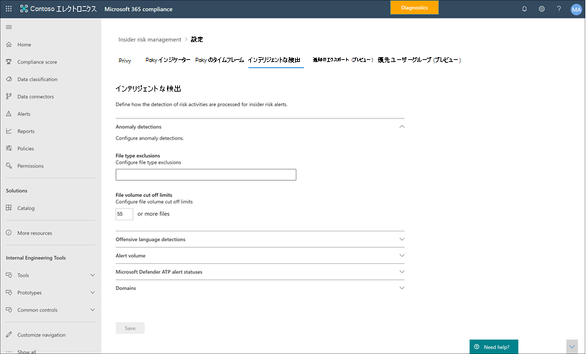

# インサイダー リスク管理設定の使用を開始する

インサイダー リスク管理の設定は、ポリシー作成時に選択したテンプレートに関係なく、すべてのインサイダー リスク管理ポリシーに適用されます。 設定は、すべてのインサイダー リスクの管理タブの 1 番上にある **Insider リスク設定** コントロールを使用して構成します。 これらの設定は、次の領域のポリシー コンポーネントを制御します。

- プライバシー
- インジケーター
- ポリシーのタイムライン
- インテリジェントな検出
- アラートをエクスポートする (プレビュー)
- 優先度のユーザー グループ (プレビュー)
- 優先度の物理資産 (プレビュー)
- Power Automate フロー (プレビュー)
- Microsoft Teams (プレビュー)

インサイダー リスク管理ポリシーを開始して作成する前に、これらの設定を理解し、組織のコンプライアンス ニーズに最適な設定レベルを選択することが重要です。

## プライバシー

ポリシー照合のあるユーザーのプライバシーの保護は重要であり、インサイダー リスクのアラートに関するデータ調査および分析レビューにおける客観性の促進に役立ちます。 インサイダー リスク ポリシーの一致を持つユーザーの場合は、次のいずれかの設定を選択できます。

- **匿名化された** バージョンのユーザー名を表示する : ユーザーの名前が匿名化され、管理者、データ調査担当者、レビュー担当者がポリシー通知に関連付けられているユーザーを確認できません。 たとえば、ユーザーの「Grace Taylor」は、インサイダー リスク管理環境のすべての領域で「AnonIS8-988」のようなランダムな仮名で表示されます。 この設定を選択すると、現在と過去のポリシー照合のあるすべてのユーザーが匿名化され、すべてのポリシーに適用されます。 インサイダー リスクアラートのユーザー プロファイル情報とケースの詳細は、このオプションが選択されている場合は使用できません。 ただし、ユーザー名は、既存のポリシーに新しいユーザーを追加する場合、またはユーザーを新しいポリシーに割り当てるときに表示されます。 この設定をオフにした場合、現在または過去のポリシーが一致しているすべてのユーザーのユーザー名が表示されます。
- **匿名化されたバージョン** のユーザー名を表示しない : ユーザー名は、アラートとケースに対する現在および過去のポリシーの一致すべてについて表示されます。 ユーザー プロファイル情報 (名前、役職、エイリアス、組織または部署) は、すべてのインサイダー リスク管理の警告とケースについてユーザーに対して表示されます。

## インジケーター

インサイダー リスク ポリシー テンプレートは、検出して調査するリスク アクティビティの種類を定義します。 各ポリシー テンプレートは、特定のトリガーとリスク アクティビティに対応する特定のインジケーターに基づいています。 すべてのインジケーターは既定で無効になっています。インサイダー リスク管理ポリシーを構成する前に、1 つ以上のポリシー インジケーターを選択する必要があります。

アラートは、ユーザーが必要なしきい値を満たすポリシー インジケーターに関連するアクティビティを実行すると、ポリシーによってトリガーされます。 インサイダー リスク管理では、次の 2 種類のインジケーターを使用します。

- **イベントのトリガー**: ユーザーがインサイダー リスク管理ポリシーでアクティブかどうかを決定するイベント。 ユーザーがインサイダー リスク管理ポリシーに追加された場合、トリガー イベントが発生しない場合、そのユーザーアクティビティはポリシーによって評価されません。 たとえば、ユーザー A は、データ盗難から作成されたポリシーにユーザー ポリシー テンプレートによって追加され、ポリシーと Microsoft 365 HR コネクタが適切に構成されます。 ユーザー A が HR コネクタによって報告された終了日を受け取るまで、ユーザー A アクティビティは、このインサイダー リスク管理ポリシーによってリスクについて評価されません。 トリガー イベントのもう 1 つの例は、ユーザーがデータ リーク ポリシーを使用するときに重大度が高い DLP ポリシーアラート *を持つ* 場合です。
- **ポリシー インジケーター**: 対象ユーザーのリスク スコアを決定するために使用されるインサイダー リスク管理ポリシーに含まれるインジケーター。 これらのポリシー インジケーターは、ユーザーに対してトリガー イベントが発生した後にのみアクティブ化されます。 ポリシー インジケーターの例としては、ユーザーが個人のクラウド ストレージ サービスまたはポータブル ストレージ デバイスにデータをコピーする場合や、ユーザーが承認されていない外部関係者と内部ファイルやフォルダーを共有する場合があります。

ポリシー インジケーターは、次の領域に分割されます。 インサイダー リスク ポリシーを作成するときに、インジケーターを選択して各インジケーター レベルのインジケーター イベント制限をアクティブ化およびカスタマイズできます。

- **Officeインジケーター**: SharePoint サイト、Teams、および電子メール メッセージングのポリシー インジケーターが含まれます。
- **デバイス インジケーター**: ネットワーク上やデバイスでファイルを共有するなどのアクティビティに関するポリシー インジケーターが含まれます。 インジケーターには、ファイルに関連Microsoft Officeアクティビティが含まれます。CSV ファイルと .PDF ファイル。 [デバイス インジケーター **] を選択** した場合、アクティビティは Windows 10 ビルド 1809 以上のデバイスでのみ処理されます。 インサイダー リスクと統合するためのデバイスの構成について詳しくは、「デバイス インジケーターとオンボード デバイスの有効化」セクション [をご覧](insider-risk-management-settings.md#OnboardDevices) ください。
- **セキュリティ ポリシー違反インジケーター**: これには、未承認または悪意のあるソフトウェアのインストールまたはセキュリティ制御のバイパスに関連する、エンドポイント用 Microsoft Defender からのインジケーターが含まれます。 インサイダー リスク管理でアラートを受信するには、アクティブな Defender for Endpoint ライセンスとインサイダー リスク統合を有効にする必要があります。 インサイダー リスク管理の統合のために Defender for Endpoint を構成する方法について詳しくは、「エンドポイント用 Microsoft Defender の高度な機能を構成する」 [をご覧ください](https://docs.microsoft.com/windows/security/threat-protection/microsoft-defender-atp/advanced-features\#share-endpoint-alerts-with-microsoft-compliance-center)。
- **リスク スコア : 異常なアクティビティ** や過去のポリシー違反のリスク スコアの引き上げが含まれます。 リスク スコアを有効にすると、リスク スコアが上がり、これらの種類のアクティビティに関するアラートが発生する可能性が高めます。 リスク スコアの評価は、1 つ以上のインジケーターが選択されている場合にのみ選択できます。

場合によっては、組織内のインサイダー リスク ポリシーに適用されるインサイダー リスク ポリシー インジケーターを制限できます。 すべてのインサイダー リスク ポリシーから無効にすることで、特定の領域のポリシー インジケーターを無効にできます。 インサイダー リスク ポリシー テンプレートのトリガー イベントは変更できません。

すべてのインサイダー リスク ポリシーで有効になっているインサイダー リスク ポリシー インジケーターを定義するには **、Insider リスク** 設定インジケーターに移動し、1 つ以上のポリシー インジケーター  >  を選択します。 ポリシー ウィザードでインサイダー リスク ポリシーを作成または編集するときに、[インジケーターの設定] ページで選択したインジケーターを個別に構成することはできません。

>[!NOTE]
>手動で追加された新しいユーザーがユーザー ダッシュボードに表示されるには、数時間かかる **場合があります**。 これらのユーザーの過去 90 日間のアクティビティは、表示に最大 24 時間かかる場合があります。 手動で追加したユーザーのアクティビティを表示するには、ユーザー ダッシュボードでユーザーを選択し、詳細ウィンドウの [**ユーザー アクティビティ**] タブを開きます。

### デバイス インジケーターを有効にしてデバイスをオンボードする

デバイス上のリスク アクティビティの監視を有効にし、これらのアクティビティのポリシー インジケーターを含めるには、デバイスが次の要件を満たしている必要があります。また、次のオンボード手順を完了する必要があります。

#### 手順 1: エンドポイントを準備する

インサイダー リスク管理でのレポート作成を計画している Windows 10 デバイスが、これらの要件を満たしていることを確認します。

1. Windows 10 x64 ビルド 1809 以降を実行し、2020 年 2 月 20 日から Windows 10 更新プログラム [(OS ビルド 17763.1075)](https://support.microsoft.com/help/4537818/windows-10-update-kb4537818) をインストールしている必要があります。
2. すべてのデバイスは[Azure Active Directory (AAD) に参加する ](https://docs.microsoft.com/azure/active-directory/devices/concept-azure-ad-join)か、Hybrid Azure AD に参加する必要があります。
3. Microsoft Chromium Edge ブラウザーをエンドポイント デバイスにインストールして、クラウド アップロード アクティビティのアクションを監視します。 「[Chromium ベースの新しい Microsoft Edge をダウンロードする](https://support.microsoft.com/help/4501095/download-the-new-microsoft-edge-based-on-chromium)」を参照してください。

#### 手順 2: オンボード デバイス

デバイスでインサイダー リスク管理アクティビティを監視する前に、デバイスの監視を有効にし、エンドポイントをオンボードする必要があります。 これらのアクションはどちらも Microsoft 365 コンプライアンスポータルで行われます。

まだオンボードされていないデバイスをオンボードする場合は、次の手順に従って適切なスクリプトをダウンロードし、展開します。

既に [Microsoft Defender for Endpoint](https://docs.microsoft.com/windows/security/threat-protection/) にオンボーディングされているデバイスがある場合、それらは管理対象デバイスのリストに表示されます。 手順 [3: 次のセクションでデバイス](insider-risk-management-settings.md#OnboardStep3) が Microsoft Defender for Endpoint にオンボードされている場合。

この展開シナリオでは、まだオンボードされていないデバイスをオンボードし、Windows 10 デバイス上のインサイダー リスクアクティビティを監視するだけの場合です。

1. [Microsoft コンプライアンスセンター](https://compliance.microsoft.com)を開きます。
2. コンプライアンスセンターの設定ページを開き、[**オンボードデバイス**]を選択します。

   > [!NOTE]
   > 通常、デバイスのオンボーディングが有効になるまで約60秒かかりますが、Microsoft サポートに連絡するまでに最大 30 分かかります。

3. [**デバイス管理**]を選択して、[**デバイス**]リストを開きます。 デバイスをオンボードするまで、リストは空になります。
4. オンボーディングプロセスを開始するには、[**オンボーディング**]を選択します。
5. 展開方法の一覧からこれらのデバイスへの展開方法を選択し、パッケージ **をダウンロードします**。
6. 「[Windows 10 マシンのオンボーディングツールと方法](https://docs.microsoft.com/windows/security/threat-protection/microsoft-defender-atp/configure-endpoints)」の適切な手順に従います。 このリンクをクリックすると、手順 5 で選択した展開パッケージと一致する Microsoft Defender for Endpoint の手順にアクセスできるランディング ページに移動します。
    - グループポリシーを使用した Windows 10 マシンのオンボード
    - Microsoft Endpoint Configuration Manager を使用した Windows 10 マシンのオンボード
    - モバイルデバイス管理ツールを使用した Windows 10 マシンのオンボード
    - ローカルスクリプトを使用した Windows 10 マシンのオンボード
    - 非永続的な仮想デスクトップインフラストラクチャ (VDI) マシンをオンボーディングします。

完了し、エンドポイントがオンボードされた後、デバイスの一覧に表示され、エンドポイントはインサイダー リスク管理への監査アクティビティ ログの報告を開始します。

> [!NOTE]
> これは、ライセンス執行時でのエクスペリエンスです。 必要なライセンスがないと、データは表示されず、アクセスできません。

#### 手順 3: デバイスが Microsoft Defender for Endpoint にオンボードされている場合

Microsoft Defender for Endpoint が既に展開され、エンドポイントが報告されている場合、これらのエンドポイントはすべて管理対象デバイスの一覧に表示されます。 引き続き新しいデバイスをインサイダー リスク管理にオンボードし、「手順 [2:](insider-risk-management-settings.md#OnboardStep2) オンボード デバイス」セクションを使用して対象範囲を拡大できます。

1. [Microsoft コンプライアンスセンター](https://compliance.microsoft.com)を開きます。
2. コンプライアンスセンターの設定ページを開き、[**デバイスの監視を有効にする**]を選択します。
3. [**デバイス管理**]を選択して、[**デバイス**]リストを開きます。 既に Microsoft Defender for Endpoint にレポートしているデバイスのリストが表示されます。
4. 追加 **のデバイスをオンボード** する必要がある場合は、[オンボード] を選択します。
5. 展開方法の一覧からこれらのデバイスへの展開方法を選択 **し、パッケージ** を **ダウンロードします**。
6. 「[Windows 10 マシンのオンボーディングツールと方法](https://docs.microsoft.com/windows/security/threat-protection/microsoft-defender-atp/configure-endpoints)」の適切な手順に従います。 このリンクをクリックすると、手順 5 で選択した展開パッケージと一致する Microsoft Defender for Endpoint の手順にアクセスできるランディング ページに移動します。
    - グループポリシーを使用した Windows 10 マシンのオンボード
    - Microsoft Endpoint Configuration Manager を使用した Windows 10 マシンのオンボード
    - モバイルデバイス管理ツールを使用した Windows 10 マシンのオンボード
    - ローカルスクリプトを使用した Windows 10 マシンのオンボード
    - 非永続的な仮想デスクトップインフラストラクチャ (VDI) マシンをオンボーディングします。

完了し、エンドポイントがオンボードされた後、[ **デバイス** ] テーブルの下に表示され、エンドポイントはインサイダー リスク管理への監査アクティビティ ログの報告を開始します。

> [!NOTE]
>これは、ライセンス執行時でのエクスペリエンスです。 必要なライセンスがないと、データは表示されず、アクセスできません。

### インジケーター レベルの設定 (プレビュー)

ポリシー ウィザードでポリシーを作成する場合、インサイダー リスク アラートのリスク スコアに日次数のリスク イベントが与える影響を構成できます。 これらのインジケーター設定を使用すると、組織内で発生するリスク イベントの数が、これらのイベントのリスク スコアとそれに関連するアラートの重大度にどのような影響を与えるのか制御できます。 必要に応じて、有効なすべてのインジケーターに対して Microsoft が推奨する既定のイベントしきい値レベルを維持することもできます。

たとえば、インサイダー リスク ポリシー設定で SharePoint インジケーターを有効にし、新しいインサイダー リスク データ漏洩ポリシーのインジケーターを構成するときに SharePoint イベントのカスタムしきい値を設定します。 インサイダー リスク ポリシー ウィザードでは、SharePoint インジケーターごとに 3 つの異なる毎日のイベント レベルを構成して、これらのイベントに関連付けられたアラートのリスク スコアに影響を与える必要があります。

最初の 1 日のイベント レベルでは、イベントのリスク スコアへの影響が低い場合は 1 日あたり *10* 以上のイベント、イベントのリスク スコアに中程度の影響を与える場合は 1 日あたり *20* 以上のイベント、1 日あたり *30* 以上のイベントはイベントのリスク スコアに高い影響を与えるしきい値を設定します。 これらの設定は、実質的に次のことを意味します。

- イベントをトリガーした後に発生する SharePoint イベントが 1 ~ 9 件ある場合、リスク スコアは影響を最小限に抑え、警告を生成しない傾向があります。
- トリガー イベントの後に発生する SharePoint イベントが 10 ~ 19 件ある場合、リスク スコアは本質的に低く、アラートの重大度レベルは低いレベルになる傾向があります。
- トリガー後に発生する SharePoint イベントが 20 ~ 29 件ある場合、リスク スコアは本質的に高く、アラートの重大度レベルは中レベルになる傾向があります。
- トリガー後に発生する SharePoint イベントが 30 以上ある場合、リスク スコアは本質的に高く、アラートの重大度レベルは高いレベルになる傾向があります。

## ポリシー期間

ポリシー期間を使用すると、インサイダー リスク管理ポリシー テンプレートのイベントおよびアクティビティに基づいて、ポリシー照合の後にトリガーされる過去および将来の確認期間を定義できます。 選択したポリシー テンプレートに応じて、次のポリシー期間を使用できます。

- **アクティブ化ウィンドウ**: すべてのポリシー テンプレートで使用できます。アクティブ化ウィンドウは、トリガー イベントが発生した後にウィンドウがアクティブ化される定義済みの日数です。 このウィンドウは、ポリシーに割り当てられたユーザーに対してトリガー イベントが発生した後、1 ~ 30 日間アクティブ化されます。 たとえば、インサイダー リスク管理ポリシーを構成し、ライセンス認証ウィンドウを 30 日に設定したとします。 ポリシーを構成してから数か月が経過し、そのポリシーに含まれているいずれかのユーザーに対してトリガー イベントが発生します。 トリガー イベントはアクティブ *化ウィンドウを* アクティブ化し、トリガー イベントが発生した後 30 日間、そのユーザーに対してポリシーがアクティブになります。
- **過去のアクティビティの** 検出 : すべてのポリシー テンプレートで使用できます。過去のアクティビティ検出は、トリガー イベントが発生する前にウィンドウがアクティブ化される定義済みの日数です。 このウィンドウは、ポリシーに割り当てられたすべてのユーザーに対してトリガー イベントが発生する前に、0 ~ 180 日間アクティブ化されます。 たとえば、インサイダー リスク管理ポリシーを構成し、過去のアクティビティ検出を 90 日間に設定したとします。 ポリシーを構成してから数か月が経過し、そのポリシーに含まれているいずれかのユーザーに対してトリガー イベントが発生します。 トリガー イベントは過去のアクティビティ検出をアクティブ化し、ポリシーはトリガー イベントの 90 日前に、そのユーザーの過去のアクティビティを収集します。

## インテリジェントな検出

インテリジェントな検出設定は、危険なアクティビティの検出をアラートに対して処理する方法を調整するのに役立ちます。 状況によっては、無視するファイルの種類を定義する必要がある場合や、ファイルの検出レベルを適用して、アラートの最小バーを定義する必要がある場合があります。 不快な言葉ポリシーを使用している場合は、報告されるポリシー照合をコントロールするために、検出感度を増減しなければならないことがあります。 これらの設定を使用して、全体的なアラート ボリューム、ファイルの種類の除外、ファイル ボリュームの制限、不快言語検出の感度を制御します。

### 異常検出

異常検出には、ファイルの種類の除外やファイルの量の制限設定が含まれます。

- **ファイルの種類の除外**: インサイダー リスク管理ポリシーの一致から特定の種類のファイルを除外するには、ファイルの種類の拡張子をコンマで区切って入力します。 たとえば、特定の種類の音楽ファイルをポリシー照合から除外するには、*ファイルの種類の除外* フィールドで **aac、mp3、wav、wma** と入力します。 これらの拡張子が付いたファイルは、すべてのインサイダー リスク管理ポリシーで無視されます。
- **ファイル ボリュームのカットオフ制限**: インサイダー リスク ポリシーでアクティビティアラートが報告される前の最小ファイル レベルを定義するには、ファイルの数を入力します。 たとえば、ポリシーでこのアクティビティが異常と見なされている場合でも、ユーザーが 10 ファイル以下をダウンロードするときにインサイダー リスクの警告を生成しない場合は、「10」と入力します。

### 不快な言葉の検出

>[!IMPORTANT]
>2020 年 10 月 16 日から、このテンプレートを使用してポリシーを作成できなくなりました。 このテンプレートを使用するアクティブなポリシーは、2021 年 1 月に完全に削除されるまで機能します。 誤検知の数が多いので、このテンプレートをサポートする不快言語の組み込み分類子は廃止されます。 不快言語のリスクの問題に対処するには、Microsoft 365 通信コンプライアンス ポリシーを [使用することをお勧](communication-compliance.md) めします。 組み込みの分類子の詳細については、「トレーニング可能な分類子の概要 [」を参照してください](classifier-get-started-with.md)。

メールテンプレートで *不快な言語* を使用中のポリシーについて、不快な言葉の分類子の感度を調整するには、以下のいずれかの設定を選択します。

- **低**: 攻撃的な言葉や感情を検出する範囲が最も広い最も低い感度レベルです。 不快な言語の照合に対する誤検知の確率が上がります。
- **中**: 攻撃的な言葉や感情を検出するバランスの取れた範囲を持つ中レベルの感度レベル。 不快な言語の照合に対する誤検知の確率は平均値となります。
- **高**: 攻撃的な言葉や感情を検出する範囲が狭い最高の感度レベルです。 不快な言語の照合に対する誤検知の確率が低くなります。

### アラート ボリューム

インサイダー リスク ポリシーによって検出されたユーザー アクティビティには、特定のリスク スコアが割り当てられます。このスコアによってアラートの重大度 (低、中、高) が決定されます。 既定では、一定量の低、中、高の重大度のアラートが生成されますが、必要に応じてボリュームを増減できます。 すべてのインサイダー リスク管理ポリシーのアラートの量を調整するには、次のいずれかの設定を選択します。

- **アラートの数が** 少ない : 重大度の高いアラートはすべて表示され、重大度が中程度のアラートは少なく、重要度が低いアラートは表示されます。 この設定レベルは、真の正の値が見つからない可能性を意味します。
- **既定のボリューム**: 重大度の高いアラートと、中程度と低の重大度のアラートのバランスの取れた量が表示されます。
- **その他の** アラート: 重大度が中程度のアラートと高いアラート、および重要度の最も低いアラートが表示されます。 この設定レベルでは、誤検知が多く発生する可能性があります。

### Microsoft Defender for Endpoint (プレビュー)

[Microsoft Defender for Endpoint は](https://docs.microsoft.com/windows/security/threat-protection/microsoft-defender-atp/microsoft-defender-advanced-threat-protection) 、エンタープライズ ネットワークが高度な脅威を防止、検出、調査、および対応するために設計されたエンタープライズ エンドポイント セキュリティ プラットフォームです。 組織内のセキュリティ違反をよりよく可視化するには、インサイダー リスク管理セキュリティ違反ポリシー テンプレートから作成されたポリシーで使用されるアクティビティについて、Defender for Endpoint アラートをインポートしてフィルター処理できます。

関心のあるシグナルの種類に応じて、Defender for Endpoint アラートトリアージの状態に基づいてインサイダー リスク管理にアラートをインポートできます。 インポートするグローバル設定で、次のアラート トリアージ状態を 1 つ以上定義できます。

- 不明
- 新規
- 処理中
- Resolved

エンドポイント用 Defender からのアラートは毎日インポートされます。 選択したトリアージの状態によっては、エンドポイント用 Defender のトリアージステータスの変更と同じアラートに対して複数のユーザー アクティビティが表示される場合があります。

たとえば、この設定で[新規]、[進行中]、および [解決済み] を選択した場合、Microsoft Defender for Endpoint アラートが生成され、ステータスが [*新規*] の場合、インサイダー リスクのユーザーに対して最初のアラート アクティビティがインポートされます。  Defender for Endpoint トリアージの状態が *[進行中*] に変わると、このアラートの 2 番目のアクティビティがインサイダー リスクのユーザーに対してインポートされます。 最終的な Defender for Endpoint トリアージの *状態である Resolved* が設定されると、このアラートの 3 番目のアクティビティがインサイダー リスクのユーザーに対してインポートされます。 この機能により、調査担当者は Defender for Endpoint のアラートの進行状況に従い、調査で必要な可視性のレベルを選択できます。

>[!IMPORTANT]
>組織で Microsoft Defender for Endpoint を構成し、Defender セキュリティ センターでインサイダー リスク管理統合のために Defender for Endpoint を有効にして、セキュリティ違反の警告をインポートする必要があります。 インサイダー リスク管理統合のための Defender for Endpoint の構成について詳しくは、「エンドポイント用 Defender の高度な機能を構成する」をご [覧ください](https://docs.microsoft.com/windows/security/threat-protection/microsoft-defender-atp/advanced-features\#share-endpoint-alerts-with-microsoft-compliance-center)。

### ドメイン (プレビュー)

ドメイン設定は、特定のドメインへの通信のリスク レベルを定義するのに役立ちます。 これらの通信には、ファイルの共有、電子メール メッセージ、コンテンツのダウンロードが含まれます。 これらの設定でドメインを指定することで、これらのドメインで行うアクティビティのリスク スコアを増減できます。 たとえば、許可されたcontoso.comとsales.wingtiptoys.comを指定するには、[許可されたドメイン] フィールドに「contoso.com sales.wingtiptoys.com」と **入力** します。

次のドメイン設定ごとに、最大 500 のドメインを入力できます。

- **許可されていないドメイン:** 許可されていないドメインを指定すると、これらのドメインで行うアクティビティのリスク スコア *が高くなります* 。
- **許可されているドメイン:** 許可ドメインを設定で指定すると、これらのドメインで行われるアクティビティはリスク スコアが低く、内部組織のアクティビティの処理方法と同様に処理されます。 たとえば、これらのドメインに対する電子メール アクティビティは、内部電子メール アクティビティの分析方法と同様に分析されます。
- **サード パーティのドメイン:** サード パーティのドメインは、組織のビジネス目的で使用されるドメインであり、機密性の高いコンテンツがこれらの場所に保存される場合があります。 サード パーティのドメインを指定すると、これらのドメインで危険なアクティビティに関するアラートを受信できます。

## アラートをエクスポートする (プレビュー)

インサイダー リスク管理アラート情報は、Office [365](https://docs.microsoft.com/office/office-365-management-api/office-365-management-activity-api-schema#security-and-compliance-alerts-schema)管理アクティビティ API スキーマを介してセキュリティ情報およびイベント管理 (SIEM) サービスにエクスポートできます。 Office 365 管理アクティビティ API を使用して、組織がインサイダー リスク情報の管理または集計に使用する可能性がある他のアプリケーションにアラート情報をエクスポートできます。

API を使用してインサイダー リスクアラート情報を確認するには:

1. Insider **リスク** Office設定のエクスポートで、365 管理アクティビティ API のサポート  >  **を有効**  >  **にします**。 既定では、この設定は Microsoft 365 組織では無効になっています。
2. *SecurityComplianceAlerts* Office 365 の一般的な監査アクティビティをフィルター処理します。
3. *InsiderRiskManagement カテゴリで SecurityComplianceAlerts をフィルター* 処理します。 

アラート情報には、セキュリティとコンプライアンスの警告スキーマ、および Office 365 マネージメント アクティビティ API 共通スキーマからの情報が含まれる。

次のフィールドと値は、セキュリティ/コンプライアンス アラート スキーマのインサイダー リスク管理&エクスポートされます。

| **Alert パラメーター** | **説明** |
|:------------------|:----------------|
| AlertType | 通知の種類はカスタム *です*。  |
| AlertId | アラートの GUID。 インサイダー リスク管理のアラートは変更可能です。 アラートの状態が変化すると、同じ AlertID を持つ新しいログが生成されます。 This AlertID can be used to correlate updates for an alert. |
| カテゴリ | アラートのカテゴリは *InsiderRiskManagement です*。 このカテゴリは、これらのアラートと他のセキュリティ/コンプライアンスアラートを区別&使用できます。 |
| コメント | アラートの既定のコメント。 値は *新しいアラート* (アラートの作成時にログに記録される) とアラート *の更新* (アラートの更新時にログに記録される) です。 AlertID を使用して、アラートの更新を関連付ける。 |
| データ | アラートのデータには、一意のユーザー ID、ユーザー プリンシパル名、およびユーザーがポリシーにトリガーされた日時 (UTC) が含まれます。 |
| 名前 | アラートを生成したインサイダー リスク管理ポリシーのポリシー名。 |
| PolicyId | アラートをトリガーしたインサイダー リスク管理ポリシーの GUID。 |
| 重要度 | アラートの重要度。 値は、*高、**中、* または *低 です*。 |
| ソース | アラートのソース。 この値は *、Office 365 Security & Compliance です*。 |
| 状態 | アラートの状態。 値は *アクティブ**(イン* サイダー リスクでのレビューが必要)、*調査**中*(インサイダー リスクで確認済み)、*解決済み**(イン* サイダー リスクで解決済み)、却下 *(イン* サイダー リスクで却下)。 |
| バージョン | セキュリティとコンプライアンスの警告スキーマのバージョン。 |

以下のフィールドと値は、Office 365 マネージメント アクティビティ API 共通スキーマに関するインサイダー リスク管理 [の警告用にエクスポートされます](https://docs.microsoft.com/office/office-365-management-api/office-365-management-activity-api-schema#common-schema)。

- UserId
- ID
- RecordType
- CreationTime
- 操作​​
- OrganizationId
- UserType
- UserKey

## 優先度のユーザー グループ (プレビュー)

組織内のユーザーは、自分の位置、機密情報へのアクセスレベル、またはリスク履歴に応じて、異なるレベルのリスクを持つ場合があります。 これらのユーザーのアクティビティの検査とスコアを優先順位付けすると、組織に高い結果をもたらす可能性がある潜在的なリスクについて警告することができます。 インサイダー リスク管理の優先度の高いユーザー グループは、より詳細な検査とより機密性の高いリスク スコアリングを必要とする組織内のユーザーを定義するのに役立ちます。 優先度ユーザーによるセキュリティポリシー違反や、優先度ユーザーポリシー テンプレートによるデータ漏洩と組み合まれており、優先度の高いユーザー グループに追加されたユーザーは、インサイダー リスクの警告や警告の重大度レベルが高くなる可能性が高くなります。

たとえば、ユーザーが機密情報にアクセスできる機密性の高いプロジェクトのデータ漏洩から保護する必要があります。 このプロジェクトに取 *り組* む組織内のユーザーに対して、プロジェクト ユーザーの優先度の高いユーザー グループを作成します。 ポリシー ウィザードと優先度ユーザーポリシー テンプレートによるデータ漏洩を使用して、新しいポリシーを作成し *、"Confidential Project Users/機密プロジェクト ユーザー* " 優先度ユーザー グループをポリシーに割り当てる。 機密プロジェクト ユーザー優先度ユーザー グループのメンバーに関するポリシーによって調べらたアクティビティはリスクに対してより機密性が高く、これらのユーザーによるアクティビティはアラートを生成する可能性が高く、重大度レベルが高いアラートを持つ可能性が高くなります。

### 優先度のユーザー グループを作成する

新しい優先度ユーザー グループを作成するには、Microsoft 365 コンプライアンス センターの **Insider リスク** 管理ソリューションで設定コントロールを使用します。 優先度のユーザー グループを作成するには *、Insider Risk Management* 役割グループまたは *Insider Risk Management Admin* 役割グループのメンバーである必要があります。

優先度ユーザー グループを作成するには、次の手順を実行します。

1. Microsoft [365](https://compliance.microsoft.com)コンプライアンス センターで、[Insider リスク管理] に移動し **、[Insider リスク** の設定] **を選択します**。
2. [優先度の **ユーザー グループ] タブを選択** する
3. [優先度 **ユーザー グループ] タブで**、[優先度ユーザー グループの作成] を選択して、グループ作成ウィザードを開始します。 
4. [グループの **定義] ページ** で、次のフィールドに入力します。
    - **Name (必須)**: 優先度ユーザー グループの表示名を入力します。 ウィザードを完了した後は、優先度のユーザー グループの名前を変更できます。
    - **説明 (オプション)**: 優先度ユーザー グループの説明を入力します。
5. [次 **へ] を** 選択して続行します。
6. [メンバーの選択] ページで、[検索するメンバーの選択] を選択し、グループに含めるメールが有効なユーザー アカウントを選択するか、[すべて選択] チェック ボックスをオンにして組織内のすべてのユーザーをグループに追加します。  [ **追加] を** 選択して続行するか **、[** キャンセル] を選択して、グループにユーザーを追加せずに閉じます。
7. [次 **へ] を選択** して続行します。
8. [ **レビュー]** ページで、優先度のユーザー グループに対して選択した設定を確認します。 グループ **の値を** 変更するには [編集]を選択し、優先度のユーザー グループを作成してアクティブ化するには [送信] を選択します。
9. 確認ページで、[完了] **を選択** してウィザードを終了します。

### 優先度のユーザー グループを更新する

既存の優先度ユーザー グループを更新するには、Microsoft 365 コンプライアンス センターの **Insider リスク** 管理ソリューションの設定コントロールを使用します。 優先度ユーザー グループを更新するには *、Insider Risk Management* 役割グループまたは *Insider Risk Management Admin* 役割グループのメンバーである必要があります。

優先度ユーザー グループを編集するには、次の手順を実行します。

1. Microsoft [365](https://compliance.microsoft.com)コンプライアンス センターで、[Insider リスク管理] に移動し **、[Insider リスク** の設定] **を選択します**。
2. [優先度の **ユーザー グループ] タブを選択** する
3. 編集する優先度のユーザー グループを選択し、[グループの編集] **を選択します**。
4. [グループの **定義] ページ** で、必要に応じて [説明] フィールドを更新します。 優先度のユーザー グループの名前は更新できない。 [次 **へ] を** 選択して続行します。
5. [メンバー **の選択] ページで** 、[メンバーの選択] コントロールを使用してグループに新 **しいメンバーを追加** します。 グループからユーザーを削除するには、削除するユーザーの横にある [X] を選択します。 [次 **へ] を** 選択して続行します。
6. [ **レビュー]** ページで、優先度ユーザー グループに対して選択した更新設定を確認します。 グループ **の値を** 変更するには [編集] を選択し、優先度のユーザー グループを更新するには [ **送信** ] を選択します。
7. 確認ページで、[完了] **を選択** してウィザードを終了します。

### 優先度のユーザー グループを削除する

既存の優先度ユーザー グループを削除するには、Microsoft 365 コンプライアンス センターの **Insider リスク** 管理ソリューションの設定コントロールを使用します。 優先度のユーザー グループを削除するには *、Insider Risk Management* 役割グループまたは *Insider Risk Management Admin* 役割グループのメンバーである必要があります。

>[!IMPORTANT]
>優先度のユーザー グループを削除すると、そのグループが割り当てられているアクティブなポリシーからそのグループが削除されます。 アクティブなポリシーに割り当てられている優先度ユーザー グループを削除すると、ポリシーにはスコープ内のユーザーが含まれるのではなく、実質的にアイドル状態であり、通知は作成されません。

優先度のユーザー グループを削除するには、次の手順を実行します。

1. Microsoft [365](https://compliance.microsoft.com)コンプライアンス センターで、[Insider リスク管理] に移動し **、[Insider リスク** の設定] **を選択します**。
2. [優先度の **ユーザー グループ] タブを選択** する
3. 編集する優先度のユーザー グループを選択し、ダッシュボード **メニューから** [削除] を選択します。
4. [削除 **] ダイアログで**、[**は** い] を選択して優先度のユーザー グループを削除するか、[キャンセル] を選択してダッシュボードに戻ります。

## 優先度の物理資産 (プレビュー)

優先度の高い物理資産へのアクセスを識別し、アクセス アクティビティをユーザー イベントに関連付けるのは、コンプライアンス インフラストラクチャの重要なコンポーネントです。 これらの物理資産は、会社の建物、データ センター、サーバー ルームなど、組織内の優先度の高い場所を表します。 インサイダー リスク アクティビティは、通常とは異なる時間に作業し、許可されていない機密性の高い領域やセキュリティで保護された領域にアクセスしようとするユーザー、および正当なニーズのない高レベルの領域へのアクセスを要求するユーザーに関連付けられている可能性があります。

優先度の物理資産を有効にし、物理不良データ コネクタを構成すると、インサイダー リスク管理は、物理制御システムおよびアクセス システムからのシグナルを他のユーザー リスク アクティビティと統合します。 物理アクセス システム全体の動作パターンを調べて、これらのアクティビティを他のインサイダー リスク イベントと関連付けすることで、インサイダー リスク管理は、コンプライアンス調査担当者やアナリストがアラートに対してより多くの情報に基づいた対応の決定を行うのに役立ちます。 優先度の高い物理資産へのアクセスは、優先度の低いアセットへのアクセスとは異なる方法でスコア付けされ、分析情報で識別されます。

たとえば、組織には、通常の作業領域や機密性の高いプロジェクト領域への物理的なアクセスを監視および承認するユーザー用のバグシステムがあります。 機密性の高いプロジェクトに取り組む複数のユーザーがいて、プロジェクトが完了すると、これらのユーザーは組織の他の領域に戻る必要があります。 機密性の高いプロジェクトが完了間近に近付く中、プロジェクト作業が機密であり、プロジェクト領域へのアクセスが厳しく管理されている必要があります。

Microsoft 365 の物理不良データ コネクタを有効にして、物理バグシステムからアクセス情報をインポートし、インサイダー リスク管理で優先度の高い物理資産を指定することができます。 バグシステムから情報をインポートし、物理的なアクセス情報をインサイダー リスク管理で識別された他のリスクアクティビティと関連付けすることで、プロジェクトのユーザーの 1 人が通常の勤務時間後にプロジェクト オフィスにアクセスし、通常の作業領域から個人のクラウド ストレージ サービスに大量のデータをエクスポートしているのに気付きます。 オンライン アクティビティに関連するこの物理的なアクセス アクティビティは、データの盗難の可能性を示している場合があり、コンプライアンス調査担当者やアナリストは、このユーザーの状況に応じて適切なアクションを実行できます。

### 優先度の物理資産を構成する

優先度の物理資産を構成するには、物理バグリング コネクタを構成し、Microsoft 365 コンプライアンス センターの **Insider リスク** 管理ソリューションで設定コントロールを使用します。 優先度の物理資産を構成するには *、Insider Risk Management* または Insider Risk Management Admin 役割グループのメンバーである *必要があります*。

優先度の物理資産を構成するには、次の手順を実行します。

1. インサイダー リスク管理の構成手順については、「インサイダー リスク管理の開始」 [の記事を参照](insider-risk-management-configure.md) してください。 手順 3 で、物理バグリング コネクタを構成します。

    >[!IMPORTANT]
    >インサイダー リスク管理ポリシーで、内部および終了したユーザーに関連する信号データを物理制御およびアクセス プラットフォームからのイベント データを使用および関連付ける場合は、Microsoft 365 HR コネクタも構成する必要があります。 Microsoft 365 HR コネクタを有効にせずに物理バグリング コネクタを有効にした場合、インサイダー リスク管理ポリシーは組織内のユーザーの物理的なアクセス アクティビティのイベントのみを処理します。

2. Microsoft [365](https://compliance.microsoft.com)コンプライアンス センターで **、Insider リスク** 管理に移動し、[インサイダー リスクの設定] の [優先度の物理  >  **資産] を選択します**。
3. [優先度 **の物理資産**] ページでは、物理バグリング コネクタによってインポートされた資産イベントを監視する物理資産の ID を手動で追加するか、または .物理バグリング コネクタによってインポートされた物理資産 ID すべての CSV ファイル:a) 物理資産 ID を手動で追加するには、[優先度の物理資産の追加] を選択し、物理資産 ID を入力して、[追加] を選択します。 その他の物理資産の IDを入力し、[優先度の高い物理資産の追加] を選択して、入力した資産を保存します。
    b) から物理資産の一覧を追加するには.CSV ファイルで、[優先度の **高い物理資産のインポート] を選択します**。 エクスプローラー のダイアログ ボックスで、 .インポートする CSV ファイルを開き、[開く] を **選択します**。 の物理資産の ID です。CSV ファイルがリストに追加されます。
4. [設定] の **[ポリシー インジケーター]** タブに移動します。
5. [ポリシー インジケーター **] ページ** で、[ **物理** アクセス インジケーター] セクションに移動し、終了後または機密資産へのアクセスが失敗した後の物理アクセスのチェック ボックス **をオンにします**。
6. 構成して **終了するには、[** 保存] を選択します。

### 優先度の物理資産を削除する

既存の優先度の物理資産を削除するには、Microsoft 365 コンプライアンス センターの Insider リスク管理ソリューションの設定コントロールを使用します。 優先度の物理資産を削除するには、Insider Risk Management 役割グループまたは Insider Risk Management Admin 役割グループのメンバーである必要があります。

>[!IMPORTANT]
>優先度の物理資産を削除すると、以前に含まれているアクティブなポリシーによって検査から削除されます。 優先度の物理資産に関連付けられたアクティビティによって生成されたアラートは削除されません。

優先度の物理資産を削除するには、次の手順を実行します。

1. Microsoft [365](https://compliance.microsoft.com)コンプライアンス センターで **、Insider リスク** 管理に移動し、[インサイダー リスクの設定] の [優先度の物理  >  **資産] を選択します**。
2. [優先度 **の物理資産] ページ** で、削除するアセットを選択します。
3. 操作 **メニューの [** 削除] を選択して、アセットを削除します。

## Power Automate フロー (プレビュー)

[Microsoft Power Automate は](https://docs.microsoft.com/power-automate/getting-started) 、アプリケーションおよびサービス間でアクションを自動化するワークフロー サービスです。 テンプレートからのフローまたは手動で作成されたフローを使用すると、これらのアプリケーションとサービスに関連付けられている一般的なタスクを自動化できます。 インサイダー リスク管理の Power Automate フローを有効にした場合、ケースとユーザーの重要なタスクを自動化できます。 Power Automate フローを構成して、ユーザー、警告、ケース情報を取得し、この情報を関係者や他のアプリケーションと共有し、インサイダー リスク管理 (ケース ノートへの投稿など) のアクションを自動化できます。 Power Automate フローは、ケースとポリシーの範囲内のすべてのユーザーに適用されます。

インサイダー リスク管理を含む Microsoft 365 サブスクリプションをお持ちのお客様は、推奨されるインサイダー リスク管理 Power Automate テンプレートを使用するために、Power Automate ライセンスを追加する必要はありません。 これらのテンプレートは、組織をサポートし、コア インサイダー リスク管理シナリオに対応するためにカスタマイズできます。 これらのテンプレートでプレミアム Power Automate 機能を使用するか、Microsoft 365 コンプライアンス コネクタを使用してカスタム テンプレートを作成するか、Microsoft 365 の他のコンプライアンス領域に Power Automate テンプレートを使用する場合は、Power Automate ライセンスが必要な場合があります。

インサイダー リスク管理のユーザーとケースのプロセス自動化をサポートするために、次の Power Automate テンプレートが提供されます。

- **ユーザー** がインサイダー リスク ポリシーに追加された場合にユーザーに通知する: このテンプレートは、内部ポリシー、プライバシー、または規制要件を持つ組織向けで、インサイダー リスク管理ポリシーの対象となる場合にユーザーに通知する必要があります。 このフローがユーザー ページでユーザーに対して構成および選択されている場合、ユーザーがインサイダー リスク管理ポリシーに追加された場合、ユーザーとそのマネージャーに電子メール メッセージが送信されます。 このテンプレートは、日付/時刻やメッセージ受信者など、通知メッセージの詳細を追跡するのに役立つ SharePoint サイトでホストされている SharePoint リストの更新もサポートしています。 プライバシー設定でユーザーを匿名化することを選択した場合、このテンプレートから作成されたフローは意図した通り機能しないので、ユーザーのプライバシーは維持されます。 このテンプレートを使用した Power Automate フローは、ユーザー ダッシュボードで **利用できます**。
- インサイダー リスクケースのユーザーに関する **人事** やビジネスからの情報を要求する: インサイダー リスク アナリストや調査担当者は、ケースに関する活動のコンテキストを理解するために、人事または他の関係者に相談する必要があります。 このフローが構成され、ケースに対して選択された場合、アナリストと調査担当者は、このフロー用に構成された人事およびビジネス関係者に電子メール メッセージを送信します。 各受信者には、事前に構成された応答オプションまたはカスタマイズ可能な応答オプションを含むメッセージが送信されます。 受信者が応答オプションを選択すると、応答はケース ノートとして記録され、受信者と日付/時刻の情報が含まれます。 [プライバシーの設定] でユーザーを匿名化することを選択した場合、このテンプレートから作成されたフローは意図した通り機能しないので、ユーザーのプライバシーは維持されます。 このテンプレートを使用した Power Automate フローは、ケース ダッシュボード **で利用できます**。
- **ユーザーがインサイダー** リスクアラートを受け取った場合にマネージャーに通知する : 組織によっては、ユーザーがインサイダー リスク管理の警告を受け取った場合に、直ちに管理通知を受け取る必要がある場合があります。 このフローを構成して選択すると、ケース ユーザーのマネージャーに、すべてのケースアラートに関する次の情報を含む電子メール メッセージが送信されます。
    - アラートに適用されるポリシー
    - アラートの日付/時刻
    - アラートの重大度レベル

    フローは、メッセージが送信され、フローがアクティブ化されたというケース ノートを自動的に更新します。 プライバシー設定でユーザーを匿名化することを選択した場合、このテンプレートから作成されたフローは意図した通り機能しないので、ユーザーのプライバシーは維持されます。 このテンプレートを使用した Power Automate フローは、ケース ダッシュボード **で利用できます**。

- インサイダー リスク ケースをフォローアップする予定表の事前通知を追加する **:** このテンプレートを使用すると、リスク調査担当者とアナリストは、ケースの予定表リマインダーを Office 365 Outlook カレンダーに追加できます。 このフローにより、ケースの処理やアラートのトリアージ処理を行う際に、ユーザーがインサイダー リスク管理ワークフローを終了または切り替える必要が排除されます。 このフローを構成して選択すると、フローを実行しているユーザーの Office 365 Outlook 予定表にリマインダーが追加されます。 このテンプレートを使用した Power Automate フローは、ケース ダッシュボード **で利用できます**。
- **ServiceNow でインサイ** ダー リスク ケースのレコードを作成する : このテンプレートは、ServiceNow ソリューションを使用してインサイダー リスク管理のケースを追跡する必要がある組織向けです。  場合によっては、インサイダー リスク アナリストと調査担当者が ServiceNow でケースのレコードを作成できます。 このテンプレートをカスタマイズして、組織の要件に基づいて ServiceNow で選択したフィールドに値を設定できます。 このテンプレートを使用した Power Automate フローは、ケース ダッシュボード **で利用できます**。 使用可能な ServiceNow フィールドについて詳しくは [、ServiceNow Connector のリファレンス記事をご覧](/connectors/service-now/) ください。

### インサイダー リスク管理テンプレートから Power Automate フローを作成する

推奨されるインサイダー リスク管理テンプレートから Power Automate フローを作成するには、Microsoft 365 コンプライアンス センターの Insider **リスク** 管理ソリューションの設定コントロールを使用するか、[ケース] または [ユーザー] ダッシュボードで直接作業する場合は、Automate コントロールの **[Power Automate** フローの管理] オプションを使用します。 

設定領域に Power Automate フローを作成するには *、Insider Risk Management* 役割グループまたは *Insider Risk Management Admin* 役割グループのメンバーである必要があります。 [Power Automate フローの管理] オプションを使用して **Power Automate** フローを作成するには、少なくとも 1 つのインサイダー リスク管理役割グループのメンバーである必要があります。

推奨されるインサイダー リスク管理テンプレートから Power Automate フローを作成するには、次の手順を実行します。

1. Microsoft [365](https://compliance.microsoft.com/)コンプライアンス センターで **、[Insider リスク** 管理] に移動し **、[Insider リスク** の設定  >  **] の [Power Automate フロー] を選択します**。 You can also access from the **Cases** or **Users dashboards pages** by choosing Automate **Manage** Power Automate  >  **flows**.
2. [Power **Automate フロー] ページで** 、ページの **[Insider リスク** 管理] セクションから推奨テンプレートを選択します。
3. フローは、フローに必要な埋め込み接続を一覧表示し、接続状態が使用可能な場合に注意を書き込む。 必要に応じて、表示されない接続を更新します。 [続行] **を選択します**。
4. 既定では、推奨されるフローは、推奨されるインサイダー リスク管理と、フローに割り当てられたタスクを完了するために必要な Microsoft 365 サービス データ フィールドで事前に構成されています。 必要に応じて、[詳細オプションの表示] コントロールを使用して、フロー コンポーネントの使用可能なプロパティを構成して、フロー コンポーネントをカスタマイズします。
5. 必要に応じて、[新しいステップ] ボタンを選択して、フローに他の **手順を追加** します。 ほとんどの場合、これは推奨される既定のテンプレートには必要ない必要があります。
6. [ **下書きの保存]** を選択して詳細な構成のフローを保存するか、[保存] **を選択して** フローの構成を完了します。
7. [ **閉じる]** を選択して Power Automate フロー **ページに戻** ります。 新しいテンプレートは [自分のフロー] タブにフローとして一覧表示され、フローを作成するユーザーのインサイダー リスク管理ケースを操作するときに自動的に **[Automate]** ドロップダウン コントロールから利用できます。

>[!IMPORTANT]
>組織内の他のユーザーがフローにアクセスする必要がある場合は、フローを共有する必要があります。

### インサイダー リスク管理用のカスタム Power Automate フローを作成する

組織の一部のプロセスとワークフローは、推奨されるインサイダー リスク管理フロー テンプレートの外部にある場合があります。また、インサイダー リスク管理領域用のカスタム Power Automate フローを作成する必要がある場合があります。 Power Automate フローは柔軟で、広範なカスタマイズをサポートしますが、インサイダー リスク管理機能と統合するには、実行する必要がある手順があります。

インサイダー リスク管理用のカスタム Power Automate テンプレートを作成するには、次の手順を実行します。

1. **Power Automate フロー ライセンスを** 確認する : インサイダー リスク管理トリガーを使用するカスタマイズされた Power Automate フローを作成するには、Power Automate ライセンスが必要です。 推奨されるインサイダー リスク管理フロー テンプレートは、追加のライセンスを必要としません。また、インサイダー リスク管理ライセンスの一部として含まれています。
2. **自動化されたフローを作成** する : インサイダー リスク管理イベントによってトリガーされた後、1 つ以上のタスクを実行するフローを作成します。 自動フローを作成する方法の詳細については [、「Power Automate](https://docs.microsoft.com/power-automate/get-started-logic-flow)でフローを作成する」を参照してください。
3. **Microsoft 365 コンプライアンス コネクタを選択** します:Microsoft 365 コンプライアンス コネクタを検索して選択します。 このコネクタを使用すると、インサイダー リスク管理のトリガーとアクションを有効にできます。 コネクタの詳細については、「コネクタ リファレンスの概要 [」の記事を参照](https://docs.microsoft.com/connectors/connector-reference/) してください。
4. **フローに対するインサイ** ダー リスク管理のトリガーを選択する: Insider リスク管理には、カスタム Power Automate フローで使用できる 2 つのトリガーがあります。
    - **選択したインサイダー リスク管理ケース** の場合: このトリガーのフローは、Insider Risk Management Cases ダッシュボード ページから選択できます。
    - **選択したインサイダー リスク管理** ユーザーの場合: このトリガーを含むフローは、インサイダー リスク管理の [ユーザー] ダッシュボード ページから選択できます。
5. フローのインサイダー リスク管理アクションを選択する: インサイダー リスク管理用のいくつかのアクションから、カスタム フローに含めるアクションを選択できます。
    - インサイダー リスク管理アラートを取得する
    - インサイダー リスク管理ケースを取得する
    - インサイダー リスク管理ユーザーを取得する
    - ケースに関するインサイダー リスク管理のアラートを取得する
    - インサイダー リスク管理ケースのメモを追加する

### Power Automate フローを共有する

既定では、ユーザーが作成した Power Automate フローは、そのユーザーだけが利用できます。 他のインサイダー リスク管理ユーザーがアクセスしてフローを使用するには、フローの作成者がフローを共有する必要があります。 フローを共有するには、Microsoft 365 コンプライアンス センターの **Insider リスク** 管理ソリューションの設定コントロールを使用するか、[ケース] または [ユーザー] ダッシュボード ページで直接作業するときに、Automate コントロールの **[Power Automate** フローの管理] オプションを使用します。  フローを共有すると、そのフローを共有しているすべてのユーザーが、[ケース] および [ユーザー] ダッシュボードの [**自動化**] コントロール ドロップダウンの **フローに****アクセスできます**。

設定領域で Power Automate フローを共有するには *、Insider Risk Management* 役割グループまたは *Insider Risk Management Admin* 役割グループのメンバーである必要があります。 Power Automate フローを Power  Automate フローの管理オプションと共有するには、少なくとも 1 つのインサイダー リスク管理役割グループのメンバーである必要があります。

Power Automate フローを共有するには、次の手順を実行します。

1. Microsoft [365](htttps://compliance.microsoft.com)コンプライアンス センターで **、[Insider リスク** 管理] に移動し **、[Insider リスク** の設定  >  **] の [Power Automate フロー] を選択します**。 You can also access from the **Cases** or **Users dashboards pages** by choosing Automate **Manage** Power Automate  >  **flows**.
2. [Power **Automate フロー] ページで** 、[自分のフロー] タブ **または [チーム フロー]** **タブを選択** します。
3. 共有するフローを選択し、[フロー オプション] **メニューから** [共有] を選択します。
4. フロー共有ページで、フローの所有者として追加するユーザーまたはグループの名前を入力します。
5. [使用された **接続** ] ダイアログで **、[OK]** を選択して、追加されたユーザーまたはグループがフローに完全にアクセスできると確認します。

### Power Automate フローを編集する

フローを編集するには、Microsoft 365 コンプライアンス センターの **Insider リスク** 管理ソリューションの設定コントロールを使用するか、[ケース] または [ユーザー  ] ダッシュボードで直接作業する場合は、Automate コントロールの **[Power Automate** フローの管理] オプションを使用 **します。**

設定領域で Power Automate フローを編集するには *、Insider Risk Management* 役割グループまたは *Insider Risk Management Admin* 役割グループのメンバーである必要があります。 [Power Automate フローの管理] オプションを使用して **Power Automate** フローを編集するには、少なくとも 1 つのインサイダー リスク管理役割グループのメンバーである必要があります。

Power Automate フローを編集するには、次の手順を実行します。

1. Microsoft [365](htttps://compliance.microsoft.com)コンプライアンス センターで **、[Insider リスク** 管理] に移動し **、[Insider リスク** の設定  >  **] の [Power Automate フロー] を選択します**。 You can also access from the **Cases** or **Users dashboards pages** by choosing Automate **Manage** Power Automate  >  **flows**.
2. [Power **Automate フロー] ページで** 、編集するフローを選択し、フロー制御メニューから **[** 編集] を選択します。
3. フロー コンポーネント **の設定を変更** するには省略記号の設定を選択し、フロー コンポーネントを削除するには省略記号  >    >  **Delete** を選択します。
4. [保存 **] を** 選択し、[閉 **じる]** を選択してフローの編集を完了します。

### Power Automate フローを削除する

フローを削除するには、Microsoft 365 コンプライアンス センターの **Insider リスク** 管理ソリューションの設定コントロールを使用するか、[ケース] または [ユーザー  ] ダッシュボードで直接作業する場合は、Automate コントロールの **[Power Automate** フローの管理] オプションを使用 **します。** フローが削除されると、すべてのユーザーのオプションとして削除されます。

設定領域で Power Automate フローを削除するには *、Insider Risk Management* 役割グループまたは *Insider Risk Management Admin* 役割グループのメンバーである必要があります。 [Power Automate フローの管理] オプションを使用して **Power Automate** フローを削除するには、少なくとも 1 つのインサイダー リスク管理役割グループのメンバーである必要があります。

Power Automate フローを削除するには、次の手順を実行します。

1. Microsoft [365](htttps://compliance.microsoft.com)コンプライアンス センターで **、[Insider リスク** 管理] に移動し **、[Insider リスク** の設定  >  **] の [Power Automate フロー] を選択します**。 You can also access from the **Cases** or **Users dashboards pages** by choosing Automate **Manage** Power Automate  >  **flows**.
2. [Power **Automate フロー] ページで** 、削除するフローを選択し、フロー制御メニューから **[** 削除] を選択します。
3. 削除確認ダイアログで、[削除] **を選択** してフローを削除するか、[キャンセル] **を選択して** 削除アクションを終了します。

## Microsoft Teams (プレビュー)

コンプライアンス アナリストと調査担当者は、インサイダー リスク管理ケースでの共同作業に Microsoft Teams を簡単に使用できます。 Microsoft Teams の他の関係者と調整し、連絡を取り合い、次の活動を行います。

- プライベート Teams チャネルのケースに対する対応アクティビティの調整と確認
- 個々のケースに関連するファイルと証拠を安全に共有および保存する
- アナリストや調査担当者による対応アクティビティの追跡と確認

Microsoft Teams でインサイダー リスク管理が有効になると、アラートが確認され、ケースが作成されるたび、専用の Microsoft Teams チームが作成されます。 既定では、チームには Insider *Risk Management、Insider Risk Management* *Analysts、* および *Insider Risk Management の調査* 者役割グループ (最大 100 人の初期ユーザー) のすべてのメンバーが自動的に含まれます。 組織の投稿者は、作成後に必要に応じてチームに追加できます。 Microsoft Teams を有効にする前に作成された既存のケースの場合、アナリストと調査担当者は、必要に応じてケースで作業するときに新しい Microsoft Teams チームを作成できます。  インサイダー リスク管理の関連するケースを解決すると、チームは自動的にアーカイブされます (非表示および読み取り専用に移動されます)。

Microsoft Teams でチームとチャネルを使用する方法の詳細については、「Microsoft Teams のチームとチャネル [の概要」を参照してください](https://docs.microsoft.com/MicrosoftTeams/teams-channels-overview)。

ケースに対する Microsoft Teams サポートの有効化は、迅速かつ簡単に構成できます。 Microsoft Teams でインサイダー リスク管理を有効にするには、次の手順を実行します。

1. Microsoft [365](htttps://compliance.microsoft.com)コンプライアンス センターで **、Insider リスク管理 Insider リスク設定**  >  **に移動します**。
2. Microsoft **Teams タブを選択** します。
3. インサイダー リスク管理用に Microsoft Teams 統合を有効にする。
4. 構成して **終了するには、[** 保存] を選択します。

### 既存のケース用に Microsoft Teams チームを作成する

既存のケースがある場合にインサイダー リスク管理に対して Microsoft Teams サポートを有効にする場合は、必要に応じてケースごとに手動でチームを作成する必要があります。 インサイダー リスク管理設定で Microsoft Teams サポートを有効にすると、新しいケースによって新しい Microsoft Teams チームが自動的に作成されます。

ユーザーは、ケースから Microsoft Teams チームを作成するために、組織内に Microsoft 365 グループを作成するためのアクセス許可が必要です。 Microsoft 365 グループのアクセス許可の管理の詳細については [、「Microsoft 365](https://docs.microsoft.com/microsoft-365/solutions/manage-creation-of-groups)グループを作成できるユーザーを管理する」を参照してください。

ケースのチームを作成するには、既存のケースで直接作業するときに Microsoft チームの作成コントロールを使用します。 新しいチームを作成するには、次の手順を実行します。

1. Microsoft [365 コンプライアンス](htttps://compliance.microsoft.com)センターで **、Insider リスク** 管理ケースに移動し、既存のケース  >  を選択します。
2. ケースの操作メニューで、[Microsoft チームの作成 **] を選択します**。
3. [チーム **名] フィールド** に、新しい Microsoft Teams チームの名前を入力します。
4. [Microsoft **チームの作成] を選択し** 、[閉じる] を **選択します**。

インサイダー リスク管理役割グループに割り当てられたユーザーの数によっては、すべての調査担当者とアナリストがケースに対して Microsoft Teams チームに追加されるのに 15 分かかる場合があります。
