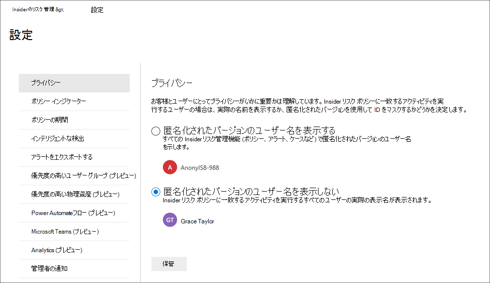
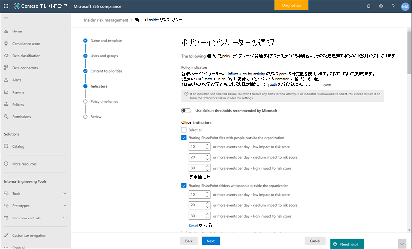
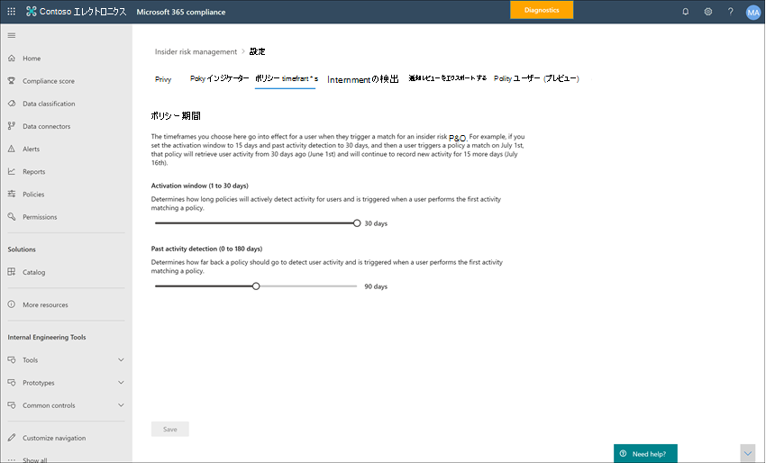
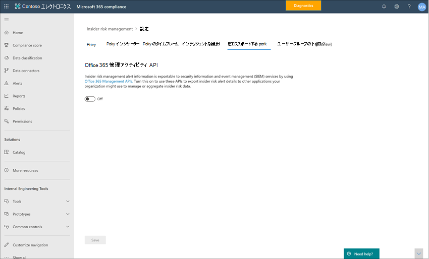
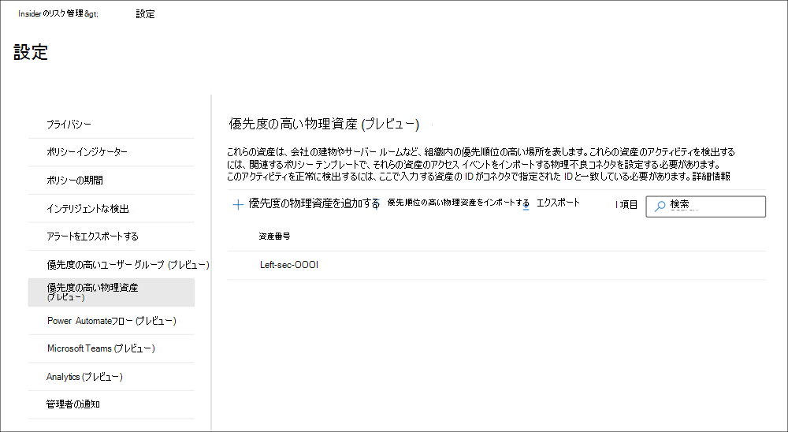
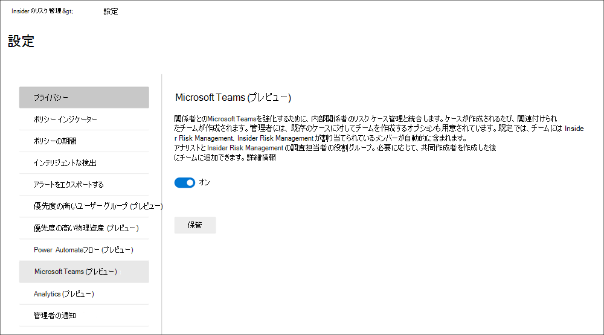
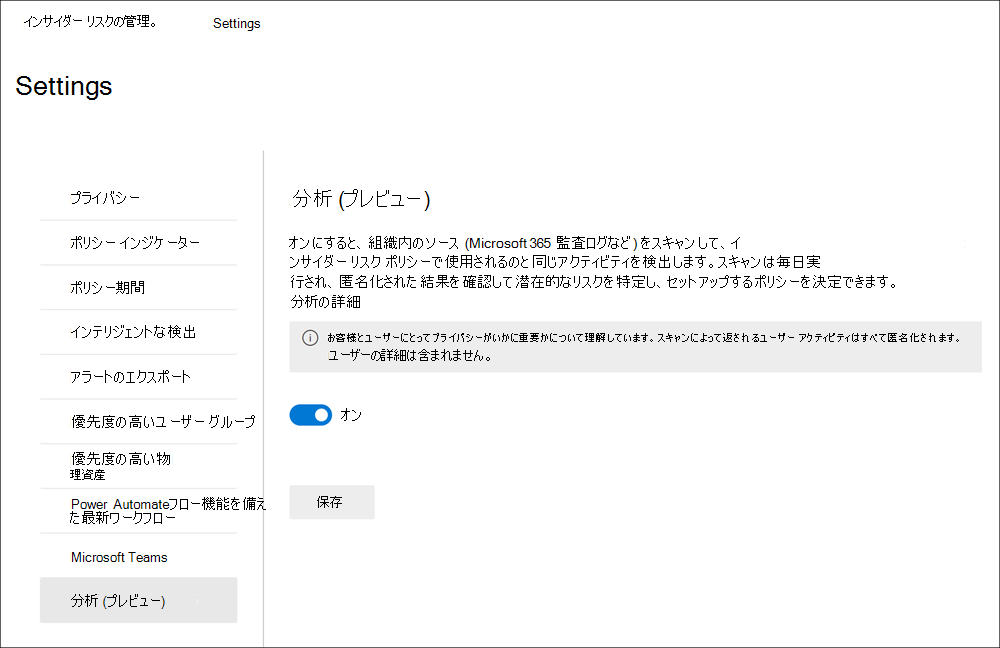
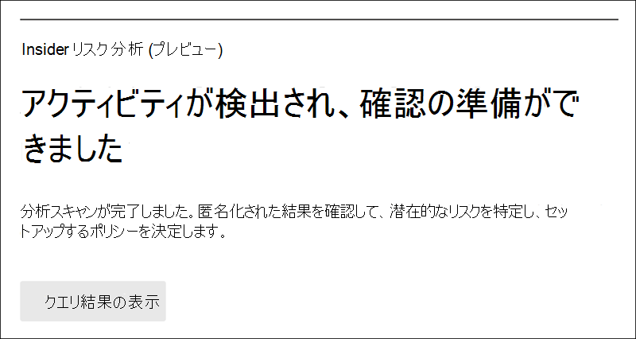

# インサイダー リスク管理設定の概要

インサイダー リスク管理の設定は、ポリシーの作成時に選択したテンプレートに関係なく、すべてのインサイダー リスク管理ポリシーに適用されます。 設定は、すべてのインサイダー リスク管理ページの上部にある **Insider リスク設定** コントロールを使用して構成されます。 これらの設定は、次の領域のポリシー コンポーネントを制御します。

- [プライバシー](#privacy)
- [インジケーター](#indicators)
- [ポリシー期間](#policy-timeframes)
- [インテリジェントな検出](#intelligent-detections)
- [アラートをエクスポートする](#export-alerts)
- [優先度の高いユーザー グループ (プレビュー)](#priority-user-groups-preview)
- [優先度の高い物理資産 (プレビュー)](#priority-physical-assets-preview)
- [Power Automate フロー (プレビュー)](#power-automate-flows-preview)
- [Microsoft Teams (プレビュー)](#microsoft-teams-preview)
- [分析](#analytics)
- [管理通知](#admin-notifications)

インサイダー リスク管理ポリシーを開始して作成する前に、これらの設定を理解し、組織のコンプライアンス ニーズに最適なレベルの設定を選択することが重要です。

## プライバシー

ポリシー照合のあるユーザーのプライバシーの保護は重要であり、インサイダー リスクのアラートに関するデータ調査および分析レビューにおける客観性の促進に役立ちます。 インサイダー リスク ポリシーが一致するユーザーの場合は、次のいずれかの設定を選択できます。

- **匿名化されたバージョンのユーザー名を表示** する: ユーザーの名前は匿名化され、管理者、データ調査担当者、およびレビュー担当者がポリシー アラートに関連付けられているユーザーを確認できないようにします。 たとえば、ユーザーの「Grace Taylor」は、インサイダー リスク管理環境のすべての領域で「AnonIS8-988」のようなランダムな仮名で表示されます。 この設定を選択すると、現在と過去のポリシー照合のあるすべてのユーザーが匿名化され、すべてのポリシーに適用されます。 このオプションを選択した場合、インサイダー リスク アラートとケースの詳細のユーザー プロファイル情報は使用できません。 ただし、ユーザー名は、既存のポリシーに新しいユーザーを追加するとき、または新しいポリシーにユーザーを割り当てるときに表示されます。 この設定をオフにした場合、現在または過去のポリシー一致を持つすべてのユーザーのユーザー名が表示されます。

    >[!IMPORTANT]
    >Microsoft 365 やその他のシステムでインサイダー リスク アラートまたはケースを持つユーザーの参照整合性を維持するために、エクスポートされたアラートではユーザー名の匿名化は保持されません。 エクスポートされたアラートには、各アラートのユーザー名が表示されます。

- **匿名化されたバージョンのユーザー名を表示しないでください**。アラートとケースに対して、現在および過去のすべてのポリシー一致のユーザー名が表示されます。 すべてのインサイダー リスク管理のアラートとケースについて、ユーザー プロファイル情報 (名前、タイトル、エイリアス、組織または部署) がユーザーに表示されます。

## インジケーター

Insider リスク ポリシー テンプレートは、検出して調査するリスク アクティビティの種類を定義します。 各ポリシー テンプレートは、特定のトリガーとリスク アクティビティに対応する特定のインジケーターに基づいています。 すべてのインジケーターは既定で無効になっており、インサイダー リスク管理ポリシーを構成する前に、1 つ以上のポリシー インジケーターを選択する必要があります。

アラートは、ユーザーが必要なしきい値を満たすポリシー インジケーターに関連するアクティビティを実行するときに、ポリシーによってトリガーされます。 Insider リスク管理では、次の 2 種類のインジケーターが使用されます。

- **イベントのトリガー**: ユーザーがインサイダー リスク管理ポリシーでアクティブかどうかを判断するイベント。 ユーザーがインサイダー リスク管理ポリシーに追加された場合、トリガー イベントがない場合、ユーザー アクティビティはポリシーによって評価されません。 たとえば、ユーザー ポリシー テンプレートを *削除することで、データ盗難* から作成されたポリシーにユーザー A が追加され、ポリシーと Microsoft 365 HR コネクタが適切に構成されます。 ユーザー A が人事コネクタによって報告された終了日になるまで、ユーザー A アクティビティはリスクに関するこのインサイダー リスク管理ポリシーによって評価されません。 トリガー イベントのもう 1 つの例は、*データ リーク* ポリシーを使用するときに、ユーザーが *重大度の高い* DLP ポリシー アラートを持っている場合です。
- **ポリシー インジケーター**: スコープ内ユーザーのリスク スコアを決定するために使用されるインサイダー リスク管理ポリシーに含まれるインジケーター。 これらのポリシー インジケーターは、ユーザーに対してトリガー イベントが発生した後にのみアクティブ化されます。 ポリシー インジケーターの例には、ユーザーが個人のクラウド ストレージ サービスまたはポータブル ストレージ デバイスにデータをコピーするとき、ユーザー アカウントが Azure Active Directory から削除された場合、またはユーザーが承認されていない外部関係者と内部ファイルとフォルダーを共有する場合があります。

特定のポリシー テンプレートのトリガー イベントをカスタマイズするために、特定のポリシー インジケーターを使用することもできます。 ポリシー ウィザードで *、優先度の高いユーザー テンプレートによる**一般的なデータリーク* またはデータリーク用に構成すると、ポリシーの柔軟性とカスタマイズ性が向上し、ユーザーがポリシーのスコープ内にある場合に使用できます。 さらに、これらのトリガー インジケーターに対して個々のアクティビティしきい値を定義して、ポリシーのよりきめ細かい制御を行うことができます。

ポリシー インジケーターは、次の領域にセグメント化されます。 インサイダー リスク ポリシーを作成するときに、インジケーターを選択して、インジケーター レベルごとにインジケーター イベントの制限をアクティブ化およびカスタマイズできます。

- **Office インジケーター**: SharePoint サイト、Microsoft Teams、電子メール メッセージングのポリシー インジケーターが含まれます。
- **デバイス インジケーター**: これには、ネットワーク経由やデバイスとのファイルの共有などのアクティビティに関するポリシー インジケーターが含まれます。 インジケーターには、実行可能ファイル (.exe) とダイナミック リンク ライブラリ (.dll) ファイル アクティビティを除く、すべてのファイルの種類を含むアクティビティが含まれます。 *デバイス インジケーター* を選択すると、ビルド 1809 以降のデバイスと macOS (Catalina 10.15 以降) デバイスWindows 10アクティビティが処理されます。 Windows デバイスと macOS デバイスの両方で、まずデバイスをコンプライアンス ポータルにオンボードする必要があります。 デバイス インジケーターには、Microsoft Edge と Google Chrome で表示、コピー、共有、または印刷された非実行可能ファイルの流出信号を組織が検出して処理するのに役立つブラウザー信号検出も含まれています。 インサイダー リスクとの統合のために Windows デバイスを構成する方法の詳細については、この記事の「 [デバイス インジケーターを有効にして Windows デバイスをオンボードする](insider-risk-management-settings.md#OnboardDevices) 」セクションを参照してください。 インサイダー リスクと統合するための macOS デバイスの構成の詳細については、この記事の「デバイス インジケーターを有効にして macOS デバイスをオンボードする」セクションを参照してください。 ブラウザーの信号検出の詳細については、「 [インサイダー リスク管理のブラウザー信号検出の詳細と構成](insider-risk-management-browser-support.md)」を参照してください。
- **セキュリティ ポリシー違反インジケーター (プレビュー)**: 未承認または悪意のあるソフトウェアのインストールやセキュリティ制御のバイパスに関連するMicrosoft Defender for Endpointからのインジケーターが含まれます。 インサイダー リスク管理でアラートを受信するには、アクティブな Defender for Endpoint ライセンスとインサイダー リスク統合が有効になっている必要があります。 インサイダー リスク管理統合用に Defender for Endpoint を構成する方法の詳細については、「[Microsoft Defender for Endpointで高度な機能を構成する」を](/windows/security/threat-protection/microsoft-defender-atp/advanced-features\#share-endpoint-alerts-with-microsoft-compliance-center)参照してください。
- **正常性レコード アクセス インジケーター (プレビュー)**: 患者の医療記録へのアクセスに関するポリシー インジケーターが含まれます。 たとえば、電子医療記録 (EMR) システム ログ内の患者の医療記録へのアクセスの試行は、インサイダー リスク管理の医療ポリシーと共有できます。 インサイダー リスク管理でこのような種類のアラートを受信するには、医療固有のデータ コネクタと HR データ コネクタが構成されている必要があります。
- **物理アクセス インジケーター (プレビュー)**: 機密資産への物理的なアクセスに関するポリシー インジケーターが含まれます。 たとえば、物理的な不適切なシステム ログ内の制限された領域へのアクセスを試みた場合は、インサイダー リスク管理ポリシーと共有できます。 インサイダー リスク管理でこのような種類のアラートを受信するには、インサイダー リスク管理と物理 [不正処理データ コネクタ](import-physical-badging-data.md) が構成された優先度の物理資産を有効にする必要があります。 物理アクセスの構成の詳細については、この記事の [「優先度の物理アクセス」セクション](#priority-physical-assets-preview) を参照してください。
- **Microsoft Defender for Cloud Apps インジケーター (プレビュー)**: Defender for Cloud Apps からの共有アラートからのポリシー インジケーターが含まれます。 Defender for Cloud Apps で異常検出を自動的に有効にすると、すぐに結果の検出と照合が開始され、ユーザーやネットワークに接続されているマシンやデバイス全体で多数の動作異常がターゲットになります。 これらのアクティビティをインサイダー リスク管理ポリシー アラートに含めるには、このセクションで 1 つ以上のインジケーターを選択します。 Defender for Cloud Apps の分析と異常検出の詳細については、「 [動作分析と異常検出を取得する](/cloud-app-security/anomaly-detection-policy)」を参照してください。
- **リスク スコア の向上**: これには、1 日のユーザーの通常のアクティビティを上回るアクティビティや、ポリシー違反として解決された以前のケースを持つユーザーのリスク スコアの引き上げが含まれます。 リスク スコア の向上を有効にすると、リスク スコアと、これらの種類のアクティビティに対するアラートの可能性が高まります。 1 日のユーザーの通常のアクティビティを上回るアクティビティの場合、検出されたアクティビティがユーザーの一般的な動作から逸脱した場合、スコアはブーストされます。 以前のケースがポリシー違反として解決されたユーザーの場合、ユーザーが以前に確認済みのポリシー違反として複数のケースを解決した場合、スコアはブーストされます。 リスク スコア の補助アイテムは、1 つ以上のインジケーターが選択されている場合にのみ選択できます。

場合によっては、組織内のインサイダー リスク ポリシーに適用されるインサイダー リスク ポリシー インジケーターを制限することができます。 すべてのインサイダー リスク ポリシーから無効にすることで、特定の領域のポリシー インジケーターを無効にすることができます。 トリガー イベントは、*優先度の高いユーザー テンプレートによる**一般的なデータ リークまたはデータリーク* から作成されたポリシーに対してのみ変更できます。 他のすべてのテンプレートから作成されたポリシーには、カスタマイズ可能なトリガー インジケーターやイベントがありません。

すべてのインサイダー リスク ポリシーで有効になっているインサイダー リスク ポリシー インジケーターを定義するには、 **Insider リスク設定** > **インジケーター** に移動し、1 つ以上のポリシー インジケーターを選択します。 ポリシー ウィザードでインサイダー リスク ポリシーを作成または編集するときに、[インジケーターの設定] ページで選択したインジケーターを個別に構成することはできません。

> [!NOTE]
> 手動で追加された新しいユーザーが [ユーザー] **ダッシュボード** に表示されるまでに数時間かかる場合があります。 これらのユーザーの過去 90 日間のアクティビティは、表示に最大 24 時間かかる場合があります。 手動で追加されたユーザーのアクティビティを表示するには、 **ユーザー ダッシュボード** でユーザーを選択し、詳細ウィンドウの **[ユーザー アクティビティ** ] タブを開きます。

### デバイス インジケーターを有効にして Windows デバイスをオンボードする

Windows デバイスでリスク アクティビティの監視を有効にし、これらのアクティビティのポリシー インジケーターを含めるには、Windows デバイスが次の要件を満たしている必要があり、次のオンボード手順を完了する必要があります。

#### 手順 1: エンドポイントを準備する

インサイダー リスク管理でレポートする予定のWindows 10 デバイスが、これらの要件を満たしていることを確認します。

1. x64 ビルド 1809 以降Windows 10実行していて、2020 年 2 月 [20 日からWindows 10更新プログラム (OS ビルド 17763.1075) を](https://support.microsoft.com/help/4537818/windows-10-update-kb4537818)インストールしている必要があります。
2. Windows 10 デバイスへのログインに使用するユーザー アカウントは、アクティブな Azure Active Directory (AAD) アカウントである必要があります。 Windows 10 デバイスには、[AAD](/azure/active-directory/devices/concept-azure-ad-join)、ハイブリッド AAD、または Active Directory 参加済み、または登録されている AAD を指定できます。
3. エンドポイント デバイスに Microsoft Edge ブラウザーをインストールして、クラウド アップロード アクティビティのアクションを検出します。 「[Chromium ベースの新しい Microsoft Edge をダウンロードする](https://support.microsoft.com/help/4501095/download-the-new-microsoft-edge-based-on-chromium)」を参照してください。

#### 手順 2: デバイスのオンボード

デバイスでインサイダー リスク管理アクティビティを検出するには、デバイスの監視を有効にし、エンドポイントをオンボードする必要があります。 どちらのアクションもMicrosoft Purview コンプライアンス ポータルで実行されます。

まだオンボードされていないデバイスをオンボードする場合は、適切なスクリプトをダウンロードし、次の手順で説明するようにデプロイします。

デバイスが[既にMicrosoft Defender for Endpoint](/windows/security/threat-protection/)にオンボードされている場合は、管理対象デバイスの一覧に既に表示されます。 [手順 3: デバイスが次のセクションのMicrosoft Defender for Endpointにオンボードされている場合](insider-risk-management-settings.md#OnboardStep3)は、次のセクションに従います。

この展開シナリオでは、まだオンボードされていないデバイスをオンボードし、Windows 10 デバイスでインサイダー リスク アクティビティを検出するだけです。

1. [Microsoft Purview コンプライアンス ポータル](https://compliance.microsoft.com) を開きます。
2. コンプライアンス ポータルの設定ページを開き、[ **デバイスのオンボード**] を選択します。

   > [!NOTE]
   > 通常、デバイスのオンボーディングが有効になるまで約60秒かかりますが、Microsoft サポートに連絡するまでに最大 30 分かかります。

3. [**デバイス管理**]を選択して、[**デバイス**]リストを開きます。 デバイスをオンボードするまで、リストは空になります。
4. オンボーディングプロセスを開始するには、[**オンボーディング**]を選択します。
5. **[展開方法**] の一覧から、これらのデバイスに展開する方法を選択し、**パッケージをダウンロード** します。
6. 「[Windows 10 マシンのオンボーディングツールと方法](/windows/security/threat-protection/microsoft-defender-atp/configure-endpoints)」の適切な手順に従います。 このリンクをクリックすると、手順 5 で選択した導入パッケージと一致する Microsoft Defender for Endpoint の手順にアクセスできるランディング ページが表示されます。
    - グループポリシーを使用した Windows 10 マシンのオンボード
    - Microsoft Endpoint Configuration Manager を使用した Windows 10 マシンのオンボード
    - モバイルデバイス管理ツールを使用した Windows 10 マシンのオンボード
    - ローカルスクリプトを使用した Windows 10 マシンのオンボード
    - 非永続的な仮想デスクトップインフラストラクチャ (VDI) マシンをオンボーディングします。

完了し、エンドポイントがオンボードされたら、デバイスの一覧に表示され、エンドポイントは監査アクティビティ ログのインサイダー リスク管理へのレポートを開始します。

> [!NOTE]
> これは、ライセンス執行時でのエクスペリエンスです。 必要なライセンスがないと、データは表示されず、アクセスできません。

#### 手順 3: デバイスがMicrosoft Defender for Endpointにオンボードされている場合

Microsoft Defender for Endpointが既にデプロイされていて、エンドポイントが報告されている場合は、これらのエンドポイントがすべてマネージド デバイスの一覧に表示されます。 引き続き新しいデバイスをインサイダー リスク管理にオンボードし、 [手順 2:](insider-risk-management-settings.md#OnboardStep2) デバイスのオンボードセクションを使用してカバレッジを拡大できます。

1. [Microsoft Purview コンプライアンス ポータル](https://compliance.microsoft.com) を開きます。
2. コンプライアンス ポータルの設定ページを開き、[ **デバイス監視を有効にする]** を選択します。
3. [**デバイス管理**]を選択して、[**デバイス**]リストを開きます。 既にMicrosoft Defender for Endpointに報告されているデバイスの一覧が表示されます。
4. より多くのデバイス **をオンボードする** 必要がある場合は、[オンボード] を選択します。
5. **展開方法** の一覧から、これらのデバイスに展開する方法を選択し、**パッケージをダウンロード** します。
6. 「[Windows 10 マシンのオンボーディングツールと方法](/windows/security/threat-protection/microsoft-defender-atp/configure-endpoints)」の適切な手順に従います。 このリンクをクリックすると、手順 5 で選択した導入パッケージと一致する Microsoft Defender for Endpoint の手順にアクセスできるランディング ページが表示されます。
    - グループポリシーを使用した Windows 10 マシンのオンボード
    - Microsoft Endpoint Configuration Manager を使用した Windows 10 マシンのオンボード
    - モバイルデバイス管理ツールを使用した Windows 10 マシンのオンボード
    - ローカルスクリプトを使用した Windows 10 マシンのオンボード
    - 非永続的な仮想デスクトップインフラストラクチャ (VDI) マシンをオンボーディングします。

完了し、エンドポイントがオンボードされたら、 **デバイス** テーブルの下に表示され、エンドポイントは監査アクティビティ ログのインサイダー リスク管理への報告を開始します。

> [!NOTE]
>これは、ライセンス執行時でのエクスペリエンスです。 必要なライセンスがないと、データは表示されず、アクセスできません。

### デバイス インジケーターを有効にして macOS デバイスをオンボードする

macOS デバイス (Catalina 10.15 以降) を Microsoft 365 にオンボードして、Intuneまたは JAMF Pro を使用してインサイダー リスク管理ポリシーをサポートできます。 詳細と構成のガイダンスについては、「 [MacOS デバイスを Microsoft 365 にオンボードする (プレビュー)」を](device-onboarding-macos-overview.md)参照してください。

### インジケーター レベルの設定 (プレビュー)

ポリシー ウィザードでポリシーを作成するときに、1 日のリスク イベント数がインサイダー リスク アラートのリスク スコアにどのように影響するかを構成できます。 これらのインジケーター設定を使用すると、組織内のリスク イベントの発生回数が、これらのイベントのリスク スコアや関連するアラートの重大度にどのように影響するかを制御できます。 必要に応じて、有効なすべてのインジケーターに対して Microsoft が推奨する既定のイベントしきい値レベルを保持することもできます。

たとえば、インサイダー リスク ポリシー設定で SharePoint インジケーターを有効にし、新しいインサイダー リスク *データ リーク* ポリシーのインジケーターを構成するときに SharePoint イベントの **カスタムしきい値を設定** することにしました。 インサイダー リスク ポリシー ウィザードでは、SharePoint インジケーターごとに 3 つの異なる日次イベント レベルを構成して、これらのイベントに関連付けられているアラートのリスク スコアに影響を与えます。

最初の 1 日のイベント レベルでは、イベントのリスク スコアへの影響が低い場合は *1 日あたり 10 イベント以上* 、イベントのリスク スコアへの影響は *1 日あたり 20 イベント以上* 、イベントのリスク スコアへの影響は *1 日あたり 30 イベント以上* です。 これらの設定は、実質的に次のことを意味します。

- イベントのトリガー後に発生する SharePoint イベントが 1 ~ 9 個ある場合、リスク スコアは影響を最小限に抑え、アラートを生成しない傾向があります。
- トリガー イベントの後に発生する SharePoint イベントが 10 ~ 19 個ある場合、リスク スコアは本質的に低く、アラートの重大度レベルは低いレベルになる傾向があります。
- トリガー後に発生する SharePoint イベントが 20 ~ 29 個ある場合、リスク スコアは本質的に高く、アラートの重大度レベルは中程度のレベルになる傾向があります。
- トリガー後に発生する SharePoint イベントが 30 個以上ある場合、リスク スコアは本質的に高く、アラートの重大度レベルは高いレベルになる傾向があります。

ポリシーのしきい値のもう 1 つのオプションは、ユーザーの通常の毎日のアクティビティの量を超えるアクティビティにポリシー トリガー イベントを割り当てることです。 各しきい値は、特定のしきい値設定によって定義されるのではなく、スコープ内のポリシー ユーザーに対して検出された異常なアクティビティに対して動的にカスタマイズされます。 個々のインジケーターで異常なアクティビティのしきい値アクティビティがサポートされている場合は、そのインジケーターのポリシー ウィザードで、その **日のユーザーの通常のアクティビティを上回るアクティビティ** を選択できます。 このオプションが一覧に表示されていない場合、インジケーターでは異常なアクティビティトリガーを使用できません。 **アクティビティが日のユーザーの通常のアクティビティを上回** っている場合は、インジケーターの一覧に表示されますが、選択可能でない場合は、**Insider リスク設定** > **ポリシー インジケーター** でこのオプションを有効にする必要があります。

## ポリシー期間

ポリシー期間を使用すると、インサイダー リスク管理ポリシー テンプレートのイベントおよびアクティビティに基づいて、ポリシー照合の後にトリガーされる過去および将来の確認期間を定義できます。 選択したポリシー テンプレートに応じて、次のポリシー期間を使用できます。

- **[アクティブ化] ウィンドウ**: すべてのポリシー テンプレートで使用できます。 *[アクティブ化] ウィンドウ* は、トリガーイベントの **後** にウィンドウがアクティブ化される定義済みの日数です。 このウィンドウは、ポリシーに割り当てられたすべてのユーザーに対してトリガー イベントが発生してから 1 ~ 30 日間アクティブ化されます。 たとえば、インサイダー リスク管理ポリシーを構成し、 *アクティブ化ウィンドウ* を 30 日間に設定したとします。 ポリシーの構成から数か月が経過し、ポリシーに含まれるいずれかのユーザーに対してトリガー イベントが発生します。 トリガー イベントによって *アクティブ化ウィンドウがアクティブ化* され、トリガー イベントが発生してから 30 日間、そのユーザーに対してポリシーがアクティブになります。
- **過去のアクティビティ検出**: すべてのポリシー テンプレートで使用できます。 *過去のアクティビティ検出* は、トリガー イベントの **前に** ウィンドウがアクティブ化される定義済みの日数です。 このウィンドウは、ポリシーに割り当てられたすべてのユーザーに対してトリガー イベントが発生するまでの 0 ~ 90 日間アクティブ化されます。 たとえば、インサイダー リスク管理ポリシーを構成し、 *過去のアクティビティ検出* を 90 日間に設定しました。 ポリシーの構成から数か月が経過し、ポリシーに含まれるいずれかのユーザーに対してトリガー イベントが発生します。 トリガー イベントは *過去のアクティビティ検出* をアクティブ化し、ポリシーはトリガー イベントの前に 90 日間、そのユーザーの履歴アクティビティを収集します。

## インテリジェントな検出

インテリジェント検出設定は、危険なアクティビティの検出をアラートに対して処理する方法を絞り込むのに役立ちます。 特定の状況では、無視するファイルの種類を定義する必要がある場合や、毎日のイベントの検出レベルを適用してユーザーのリスク スコアを高める必要がある場合があります。 これらの設定を使用して、ファイルの種類の除外を制御し、異常なアクティビティやファイル ボリュームの制限のリスク スコアを高めます。

### ファイルの種類の除外

すべてのインサイダー リスク管理ポリシーの照合から特定のファイルの種類を除外するには、コンマで区切ってファイルの種類の拡張子を入力します。 たとえば、特定の種類の音楽ファイルをポリシー照合から除外するには、*ファイルの種類の除外* フィールドで **aac、mp3、wav、wma** と入力します。 これらの拡張機能を含むファイルは、すべてのインサイダー リスク管理ポリシーによって無視されます。

### 通常とは異なるアクティビティのスコアを向上させる、毎日のイベントの最小数

この設定では、ユーザーにとって異常と見なされるアクティビティのリスク スコアを高めるために必要な日次イベントの数を定義します。 たとえば、このリスク ブーストに「25」と入力するとします。 ユーザーが過去 30 日間に平均 10 個のファイルダウンロードを行ったが、ポリシーで 1 日に 20 個のファイルがダウンロードされたことが検出された場合、そのユーザーにとっては珍しいことですが、その日にダウンロードしたファイルの数がこのリスク ブーストに対して入力した数より少なかったため、そのアクティビティのスコアは向上しません。

### アラート ボリューム

インサイダー リスク ポリシーによって検出されたユーザー アクティビティには、特定のリスク スコアが割り当てられ、アラートの重大度 (低、中、高) が決定されます。 既定では、特定の重大度の低、中、高の重大度のアラートが生成されますが、ニーズに合わせてボリュームを増減できます。 すべてのインサイダー リスク管理ポリシーのアラートの量を調整するには、次のいずれかの設定を選択します。

- **アラートの数が少なくなります**。重大度の高いアラートはすべて表示され、重大度が低く、重大度が低いアラートは表示されません。 この設定レベルは、いくつかの真の陽性を見逃す可能性があります。
- **既定のボリューム**: 重大度の高いアラートと、重大度が中程度と低のバランスの取れた量が表示されます。
- **その他のアラート**: すべての中高重大度アラートと最も低い重大度のアラートが表示されます。 この設定レベルでは、誤検知が増える可能性があります。

### Microsoft Defender for Endpoint (プレビュー)

[Microsoft Defender for Endpoint](/windows/security/threat-protection/microsoft-defender-atp/microsoft-defender-advanced-threat-protection)は、エンタープライズ ネットワークが高度な脅威を防止、検出、調査、および対応できるように設計されたエンタープライズ エンドポイント セキュリティ プラットフォームです。 組織内のセキュリティ違反の可視性を高めるために、インサイダー リスク管理セキュリティ違反ポリシー テンプレートから作成されたポリシーで使用されるアクティビティに対して Defender for Endpoint アラートをインポートしてフィルター処理できます。

関心のあるシグナルの種類に応じて、Defender for Endpoint アラートトリアージの状態に基づいて、インサイダー リスク管理にアラートをインポートすることを選択できます。 インポートするグローバル設定で、次のアラート トリアージの状態を 1 つ以上定義できます。

- 不明
- 新規
- 処理中
- Resolved

Defender for Endpoint からのアラートは毎日インポートされます。 選択したトリアージの状態によっては、Defender for Endpoint のトリアージ状態の変化と同じアラートに対する複数のユーザー アクティビティが表示される場合があります。

たとえば、この設定で *[新規*]、[*進行中*]、および *[解決済み*] を選択した場合、Microsoft Defender for Endpointアラートが生成され、状態が *[新規]* の場合、インサイダー リスクのユーザーに対して初期アラート アクティビティがインポートされます。 Defender for Endpoint トリアージの状態が *[進行中]* に変わると、インサイダー リスクのユーザーに対してこのアラートの 2 つ目のアクティビティがインポートされます。 解決 *済* みの最終的な Defender for Endpoint トリアージの状態が設定されると、このアラートの 3 番目のアクティビティがインサイダー リスクのユーザーに対してインポートされます。 この機能により、調査担当者は Defender for Endpoint アラートの進行に従い、調査に必要な可視性のレベルを選択できます。

> [!IMPORTANT]
> セキュリティ違反警告をインポートするには、組織に Microsoft Defender for Endpoint を構成し、Defender セキュリティ センターで Microsoft Defender for Endpoint とインサイダー リスク管理統合を有効にする必要があります。 インサイダー リスク管理統合のために Microsoft Defender for Endpoint を構成する方法の詳細については、「[Microsoft Defender for Endpoint で高度な機能を構成する](/windows/security/threat-protection/microsoft-defender-atp/advanced-features\#share-endpoint-alerts-with-microsoft-compliance-center)」を参照してください。

### ドメイン

ドメイン設定は、特定のドメインに対するアクティビティのリスク レベルを定義するのに役立ちます。 これらのアクティビティには、ファイルの共有、電子メール メッセージの送信、コンテンツのダウンロード、またはアップロードが含まれます。 これらの設定でドメインを指定することで、これらのドメインで発生するアクティビティのリスク スコアリングを増減できます。

[ドメインの追加] を使用して、各ドメイン設定のドメインを定義します。 また、ワイルドカードを使用して、ルート ドメインまたはサブドメインのバリエーションを照合することもできます。 たとえば、sales.wingtiptoys.com と support.wingtiptoys.com を指定するには、ワイルドカード エントリ '*.wingtiptoys.com' を使用して、これらのサブドメイン (および同じレベルの他のサブドメイン) と一致させます。 ルート ドメインに複数レベルのサブドメインを指定するには、[ **複数レベルサブドメインを含める** ] チェック ボックスをオンにする必要があります。

次のドメイン設定ごとに、最大 500 個のドメインを入力できます。

- **未承認のドメイン:** 未承認のドメインを指定すると、これらのドメインで行われるアクティビティのリスク スコアが *高くなります* 。 たとえば、コンテンツを他のユーザーと共有するアクティビティ (gmail.com アドレスを持つユーザーに電子メールを送信するなど) や、ユーザーがこれらの未承認のドメインからデバイスにコンテンツをダウンロードする場合などです。
- **許可されるドメイン:** 許可されたドメインに関連する特定のアクティビティはポリシーによって無視され、アラートは生成されません。 これらのアクティビティには、次のものが含まれます。

    - 外部ドメインに送信された電子メール
    - ファイル、フォルダー、外部ドメインと共有されているサイト
    - 外部ドメインにアップロードされたファイル (Microsoft Edge ブラウザーを使用)

    設定で許可されるドメインを指定することで、これらのドメインを持つこのアクティビティは、内部組織アクティビティの処理方法と同様に扱われます。 たとえば、アクティビティにマップするためにここに追加されたドメインには、組織外のユーザーとコンテンツを共有する (gmail.com アドレスを持つユーザーに電子メールを送信するなど) 場合があります。

- **サード パーティのドメイン:** 組織がビジネス目的 (クラウド ストレージなど) にサード パーティのドメインを使用している場合は、デバイス インジケーター [ *ブラウザーを使用してサード パーティ サイトからコンテンツをダウンロード* する] に関連するアクティビティのアラートを受信できるように、ここに含めます。

## アラートをエクスポートする

インサイダー リスク管理アラート情報は、[Office 365 Management Activity API スキーマ](/office/office-365-management-api/office-365-management-activity-api-schema#security-and-compliance-alerts-schema)を使用して、セキュリティ情報とイベント管理 (SIEM) およびセキュリティ オーケストレーションの自動応答 (SOAR) ソリューションにエクスポートできます。 Office 365管理アクティビティ API を使用して、組織がインサイダー リスク情報を管理または集計するために使用する可能性がある他のアプリケーションにアラート情報をエクスポートできます。 アラート情報はエクスポートされ、Office 365管理アクティビティ API を使用して 60 分ごとに使用できます。

組織で Microsoft Sentinel を使用している場合は、すぐに使用できるインサイダー リスク管理データ コネクタを使用して、インサイダー リスク アラート情報を Sentinel にインポートすることもできます。 詳細については、Microsoft Sentinel の記事の [「Insider Risk Management (IRM) (プレビュー)」](/azure/sentinel/data-connectors-reference#microsoft-365-insider-risk-management-irm-preview) を参照してください。

>[!IMPORTANT]
>Microsoft 365 やその他のシステムでインサイダー リスク アラートまたはケースを持つユーザーの参照整合性を維持するために、エクスポートされたアラートではユーザー名の匿名化は保持されません。 エクスポートされたアラートには、各アラートのユーザー名が表示されます。

API を使用してインサイダー リスク アラート情報を確認するには:

1. **Insider リスク管理** 設定 **のエクスポート アラート** で、Office 365 Management  >  Activity API のサポート **を** > 有効にします。 既定では、この設定は Microsoft 365 組織では無効になっています。
2. *SecurityComplianceAlerts* によって一般的なOffice 365監査アクティビティをフィルター処理します。
3. *InsiderRiskManagement* カテゴリで *SecurityComplianceAlerts* をフィルター処理します。

アラート情報には、セキュリティとコンプライアンスのアラート スキーマと、Office 365 Management Activity API の共通スキーマからの情報が含まれています。

セキュリティ & コンプライアンス アラート スキーマのインサイダー リスク管理アラートには、次のフィールドと値がエクスポートされます。

| **アラート パラメーター** | **説明** |
|:------------------|:----------------|
| AlertType | アラートの種類は *カスタム* です。  |
| AlertId | アラートの GUID。 インサイダー リスク管理アラートは変更可能です。 アラートの状態が変化すると、同じ AlertID を持つ新しいログが生成されます。 この AlertID は、アラートの更新プログラムを関連付けるために使用できます。 |
| カテゴリ | アラートのカテゴリは *InsiderRiskManagement です*。 このカテゴリは、これらのアラートと他のセキュリティ & コンプライアンス アラートを区別するために使用できます。 |
| コメント | アラートの既定のコメント。 値は *、新しいアラート (アラート* の作成時にログに記録されます) と *アラートの更新 (アラート* の更新があった場合にログに記録) です。 AlertID を使用して、アラートの更新プログラムを関連付ける。 |
| データ | アラートのデータには、一意のユーザー ID、ユーザー プリンシパル名、およびユーザーがポリシーにトリガーされた日時 (UTC) が含まれます。 |
| 名前 | アラートを生成したインサイダー リスク管理ポリシーのポリシー名。 |
| PolicyId | アラートをトリガーしたインサイダー リスク管理ポリシーの GUID。 |
| 重要度 | アラートの重大度。 値は *高*、 *中*、または *低です*。 |
| ソース | アラートのソース。 値は *セキュリティ & コンプライアンスOffice 365* です。 |
| 状態 | アラートの状態。 値が *アクティブ* (インサイダー リスクでの *ニーズ レビュー* )、 *調査* (インサイダー リスクで *確認* 済み)、 *解決済み* (インサイダー リスクで *解決済* み)、 *却下* (インサイダー リスクで *却下)* です。 |
| バージョン | セキュリティとコンプライアンスのアラート スキーマのバージョン。 |

次のフィールドと値は、[Office 365 Management Activity API 共通スキーマ](/office/office-365-management-api/office-365-management-activity-api-schema#common-schema)のインサイダー リスク管理アラート用にエクスポートされます。

- UserId
- Id
- RecordType
- CreationTime
- 操作
- OrganizationId
- UserType
- UserKey

## 優先度の高いユーザー グループ (プレビュー)

組織内のユーザーは、自分の位置、機密情報へのアクセスレベル、リスク履歴に応じて、さまざまなレベルのリスクを持つ場合があります。 これらのユーザーのアクティビティの調査とスコアリングに優先順位を付けると、組織に大きな影響を与える可能性がある潜在的なリスクを警告するのに役立ちます。 インサイダー リスク管理の優先度の高いユーザー グループは、より詳細な検査とより機密性の高いリスク スコアリングが必要な組織内のユーザーを定義するのに役立ちます。 優先度の高い *ユーザーによるセキュリティ ポリシー違反と、優先度* の高いユーザー ポリシー テンプレート *によるデータ漏洩* と組み合わせて、優先度の高いユーザー グループに追加されたユーザーは、重大度レベルが高いインサイダー リスク アラートとアラートの可能性が高くなります。

すべてのアナリストや調査担当者がレビューを受け入れられている代わりに、優先度の高いユーザー グループは、特定のユーザーまたはインサイダー リスク ロール グループに対するレビュー アクティビティを制限する必要もあります。 個々のユーザーとロール グループを割り当てて、優先度の高い各ユーザー グループのユーザー、アラート、ケース、レポートを確認することができます。 優先度の高いユーザー グループは、組み込みの *Insider Risk Management*、*Insider Risk Management Analysts、Insider Risk Management Investigators* ロール グループ、これらのロール グループの 1 つ以上、またはユーザーのカスタム選択に割り当てられたレビュー権限を持つことができます。

たとえば、ユーザーが機密情報にアクセスできる機密性の高いプロジェクトでは、データ漏えいから保護する必要があります。 このプロジェクトで作業する組織内のユーザーに対して *、機密プロジェクト* *ユーザー* の優先度ユーザー グループを作成することを選択します。 さらに、この優先度の高いユーザー グループには、すべてのインサイダー リスク管理管理者、アナリスト、および調査担当者に表示されるグループに関連付けられたユーザー、アラート、ケース、およびレポートを含めることはできません。 **[設定]** で、*機密プロジェクト ユーザー* の優先度ユーザー グループを作成し、グループに関連するデータを表示できるレビュー担当者として 2 人のユーザーを割り当てます。 ポリシー ウィザードと *優先度ユーザーによるデータ リーク* ポリシー テンプレートを使用して、新しいポリシーを作成し、 *機密プロジェクト ユーザー* の優先度ユーザー グループをポリシーに割り当てます。 *機密プロジェクト ユーザー* の優先度ユーザー グループのメンバーに対してポリシーによって調べられたアクティビティは、リスクに対してより機密性が高く、これらのユーザーによるアクティビティはアラートを生成し、重大度レベルが高いアラートを持つ可能性が高くなります。

### 優先度の高いユーザー グループを作成する

新しい優先度ユーザー グループを作成するには、Microsoft Purview コンプライアンス ポータルの **Insider リスク管理** ソリューションでコントロールを設定します。 優先度の高いユーザー グループを作成するには、*Insider Risk Management または Insider Risk Management* *管理* ロール グループのメンバーである必要があります。

優先度の高いユーザー グループを作成するには、次の手順を実行します。

1. [Microsoft Purview コンプライアンス ポータル](https://compliance.microsoft.com)で、**Insider リスク管理** に移動し、**Insider リスク設定** を選択します。
2. [ **優先度の高いユーザー グループ (プレビュー)]** ページを選択します。
3. [ **優先度の高いユーザー グループ (プレビュー)]** ページで、[ **優先度の高いユーザー グループの作成** ] を選択してグループ作成ウィザードを開始します。
4. [ **名前と説明]** ページで、次のフィールドに入力します。
    - **名前 (必須)**: 優先度の高いユーザー グループのフレンドリ名を入力します。 ウィザードの完了後、優先度の高いユーザー グループの名前を変更することはできません。
    - **説明 (省略可能)**: 優先度の高いユーザー グループの説明を入力します。
5. [**次へ**] を選んで続行します。
6. [ **メンバーの選択** ] ページで、[メンバーの **選択]** を選択して検索し、グループに含めるメールが有効なユーザー アカウントを選択するか、[ **すべて選択** ] チェック ボックスをオンにして組織内のすべてのユーザーをグループに追加します。 [ **追加]** を選択して続行するか **、[キャンセル] を選択** してグループにユーザーを追加せずに閉じます。
7. [**次へ**] を選んで続行します。
8. [ **このグループを表示できるユーザーの選択]** ページで、優先度の高いユーザー グループのユーザー、アラート、ケース、レポートを確認できるユーザーを定義する必要があります。 少なくとも 1 つのユーザーまたはインサイダー リスク管理ロール グループを割り当てる必要があります。 [ **ユーザーと役割グループの選択]** を選択し、優先度の高いユーザー グループに割り当てるユーザーまたはインサイダー リスク管理の役割グループを選択します。 [ **追加]** を選択して、選択したユーザーまたは役割グループをグループに割り当てます。
9. [次へ] を選んで続行します。
10. [ **確認** ] ページで、優先度の高いユーザー グループに対して選択した設定を確認します。 [ **編集]** リンクを選択してグループ値を変更するか、[ **送信]** を選択して優先度の高いユーザー グループを作成してアクティブ化します。
11. 確認ページで **、[完了** ] を選択してウィザードを終了します。

### 優先度の高いユーザー グループを更新する

既存の優先度ユーザー グループを更新するには、Microsoft Purview コンプライアンス ポータルの **Insider リスク管理** ソリューションでコントロールを設定します。 優先度の高いユーザー グループを更新するには、*Insider Risk Management または Insider Risk Management* *管理* ロール グループのメンバーである必要があります。

優先度の高いユーザー グループを編集するには、次の手順を実行します。

1. [Microsoft Purview コンプライアンス ポータル](https://compliance.microsoft.com)で、**Insider リスク管理** に移動し、**Insider リスク設定** を選択します。
2. [ **優先度の高いユーザー グループ (プレビュー)]** ページを選択します。
3. 編集する優先度の高いユーザー グループを選択し、[ **グループの編集]** を選択します。
4. [ **名前と説明]** ページで、必要に応じて [説明] フィールドを更新します。 優先度の高いユーザー グループの名前を更新することはできません。 [**次へ**] を選んで続行します。
5. [ **メンバーの選択** ] ページで、[メンバーの選択] コントロールを使用して新しいメンバーをグループ **に** 追加します。 グループからユーザーを削除するには、削除するユーザーの横にある [X] を選択します。 [**次へ**] を選んで続行します。
6. [ **このグループを表示できるユーザーの選択]** ページで、優先度の高いユーザー グループのユーザー、アラート、ケース、レポートを確認できるユーザーまたはロール グループを追加または削除します。
7. [**次へ**] を選んで続行します。
8. [ **確認** ] ページで、優先度の高いユーザー グループに対して選択した更新設定を確認します。 [ **編集]** リンクを選択してグループ値を変更するか、[ **送信]** を選択して優先度の高いユーザー グループを更新します。
9. 確認ページで **、[完了** ] を選択してウィザードを終了します。

### 優先度の高いユーザー グループを削除する

既存の優先度ユーザー グループを削除するには、Microsoft Purview コンプライアンス ポータルの **Insider リスク管理** ソリューションでコントロールを設定します。 優先度の高いユーザー グループを削除するには、*Insider Risk Management または Insider Risk Management* *管理* ロール グループのメンバーである必要があります。

> [!IMPORTANT]
> 優先度の高いユーザー グループを削除すると、割り当てられているアクティブなポリシーから削除されます。 アクティブなポリシーに割り当てられている優先度の高いユーザー グループを削除した場合、ポリシーにはスコープ内のユーザーは含まれず、実質的にアイドル状態になり、アラートは作成されません。

優先度の高いユーザー グループを削除するには、次の手順を実行します。

1. [Microsoft Purview コンプライアンス ポータル](https://compliance.microsoft.com)で、**Insider リスク管理** に移動し、**Insider リスク設定** を選択します。
2. [ **優先度の高いユーザー グループ (プレビュー)]** ページを選択します。
3. 編集する優先度の高いユーザー グループを選択し、ダッシュボード メニューから **[削除** ] を選択します。
4. [ **削除** ] ダイアログで、[ **はい** ] を選択して優先度の高いユーザー グループを削除するか、[ **キャンセル]** を選択してダッシュボードに戻ります。

## 優先度の高い物理資産 (プレビュー)

優先度の高い物理資産へのアクセスを特定し、アクセス アクティビティをユーザー イベントに関連付けるのは、コンプライアンス インフラストラクチャの重要なコンポーネントです。 これらの物理資産は、会社の建物、データ センター、サーバー ルームなど、組織内の優先度の高い場所を表します。 インサイダー リスク アクティビティは、通常とは異なる時間を働くユーザーに関連付けられている可能性があります。これらの承認されていない機密性の高い領域やセキュリティで保護された領域へのアクセスを試み、正当なニーズを持たない高レベルの領域へのアクセスを要求します。

優先度の高い物理資産が有効になっており、 [物理的な不適切なデータ コネクタ](import-physical-badging-data.md) が構成されている場合、インサイダー リスク管理は、物理制御およびアクセス システムからのシグナルを他のユーザー リスク アクティビティと統合します。 物理的なアクセス システム全体の動作パターンを調べ、これらのアクティビティを他のインサイダー リスク イベントと関連付けることで、インサイダー リスク管理は、コンプライアンス調査担当者やアナリストがアラートに関するより多くの情報に基づいた対応の決定を行うのに役立ちます。 優先度の高い物理資産へのアクセスは、非優先度資産へのアクセスとは異なる方法で分析情報でスコア付けされ、識別されます。

たとえば、組織には、通常の作業領域と機密プロジェクト領域への物理的なアクセスを監視および承認するユーザーに対する不適切なシステムがあります。 機密性の高いプロジェクトで作業している複数のユーザーがいて、プロジェクトが完了すると、これらのユーザーは組織の他の領域に戻ります。 機密性の高いプロジェクトが完了に近づくと、プロジェクトの作業が機密のままになり、プロジェクト領域へのアクセスが厳密に制御されるようにする必要があります。

Microsoft 365 の物理不正処理データ コネクタを有効にして、物理的な不正プログラム システムからアクセス情報をインポートし、インサイダー リスク管理で優先物理資産を指定することを選択します。 不正なシステムから情報をインポートし、インサイダー リスク管理で特定された他のリスク アクティビティと物理的なアクセス情報を関連付けることで、プロジェクトのユーザーの 1 人が通常の勤務時間後にプロジェクト オフィスにアクセスし、通常の作業領域から大量のデータを個人用クラウド ストレージ サービスにエクスポートしていることに気付きます。 オンライン アクティビティに関連付けられたこの物理的なアクセス アクティビティは、データ盗難の可能性を示す可能性があり、コンプライアンス調査担当者やアナリストは、このユーザーの状況に応じて適切なアクションを実行できます。

### 優先度の物理資産を構成する

優先度の高い物理資産を構成するには、物理不正使用コネクタを構成し、Microsoft Purview コンプライアンス ポータルの **Insider リスク管理** ソリューションで設定コントロールを使用します。 優先度の高い物理資産を構成するには、*Insider Risk Management* または *Insider Risk Management 管理 ロール グループ* のメンバーである必要があります。

優先順位物理資産を構成するには、次の手順を実行します。

1. インサイダー リスク管理の概要に関する記事のインサイダー リスク管理の構成手順 [に](insider-risk-management-configure.md) 従います。 手順 3 で、物理不正接続コネクタを構成していることを確認します。

    > [!IMPORTANT]
    > インサイダー リスク管理ポリシーで、退出および終了したユーザーに関連するシグナル データを物理的な制御およびアクセス プラットフォームからのイベント データと関連付けるためには、Microsoft 365 HR コネクタも構成する必要があります。 Microsoft 365 HR コネクタを有効にせずに物理的な不適切なコネクタを有効にした場合、インサイダー リスク管理ポリシーでは、組織内のユーザーの物理アクセス アクティビティのイベントのみが処理されます。

2. [Microsoft Purview コンプライアンス ポータル](https://compliance.microsoft.com)で、**Insider リスク管理** に移動し、**Insider リスク設定** > **[優先度の物理資産**] を選択します。
3. [ **優先度の物理資産** ] ページで、物理不正プログラム コネクタによってインポートされた資産イベントを検出する物理資産 ID を手動で追加するか、物理不正取りコネクタによってインポートされたすべての物理資産 ID の.csv ファイルをインポートできます。a) 物理資産 ID を手動で追加するには、[ **優先度の物理資産の追加]** を選択し、物理資産 ID を入力します。 次に、[追加] を選択 **します**。 他の物理資産 ID を入力し、[ **優先度の高い物理資産の追加** ] を選択して、入力したすべての資産を保存します。
    b) .csv ファイルから物理資産 ID の一覧を追加するには、[ **優先度の高い物理資産のインポート**] を選択します。 エクスプローラー ダイアログで、インポートする.csv ファイルを選択し、[ **開く**] を選択します。 .csv ファイルの物理資産 ID が一覧に追加されます。
4. **[設定]** の **[ポリシー インジケーター**] ページに移動します。
5. [ **ポリシー インジケーター** ] ページで、[ **物理アクセス インジケーター** ] セクションに移動し、[ **終了後の物理アクセスまたは機密資産へのアクセスの失敗**] チェック ボックスをオンにします。
6. [ **保存] を** 選択して構成し、終了します。

### 優先度の高い物理資産を削除する

既存の優先度物理資産を削除するには、Microsoft Purview コンプライアンス ポータルの Insider リスク管理ソリューションの設定コントロールを使用します。 優先度の高い物理資産を削除するには、Insider Risk Management または Insider Risk Management 管理 ロール グループのメンバーである必要があります。

> [!IMPORTANT]
> 優先度の高い物理資産を削除すると、以前に含まれていたアクティブなポリシーによって検証から削除されます。 優先度物理資産に関連付けられたアクティビティによって生成されたアラートは削除されません。

優先度の物理資産を削除するには、次の手順を実行します。

1. [Microsoft Purview コンプライアンス ポータル](https://compliance.microsoft.com)で、**Insider リスク管理** に移動し、**Insider リスク設定** > **[優先度の物理資産**] を選択します。
2. [ **優先度の物理資産** ] ページで、削除する資産を選択します。
3. アクション メニューで **[削除** ] を選択して資産を削除します。

## Power Automate フロー (プレビュー)

[Microsoft Power Automate](/power-automate/getting-started) は、アプリケーションとサービス間のアクションを自動化するワークフロー サービスです。 テンプレートからのフローを使用するか、手動で作成することで、これらのアプリケーションとサービスに関連付けられている一般的なタスクを自動化できます。 インサイダー リスク管理に Power Automate フローを有効にすると、ケースとユーザーの重要なタスクを自動化できます。 Power Automate フローを構成して、ユーザー、アラート、ケース情報を取得し、この情報を関係者やその他のアプリケーションと共有したり、ケース ノートへの投稿などのインサイダー リスク管理のアクションを自動化したりできます。 Power Automate フローは、ケースとポリシーのスコープ内の任意のユーザーに適用できます。

インサイダー リスク管理を含む Microsoft 365 サブスクリプションをお持ちのお客様は、推奨されるインサイダー リスク管理 Power Automate テンプレートを使用するために追加の Power Automate ライセンスは必要ありません。 これらのテンプレートは、組織をサポートし、中核となるインサイダー リスク管理シナリオをカバーするようにカスタマイズできます。 これらのテンプレートで Premium Power Automate 機能を使用する場合、Microsoft Purview コネクタを使用してカスタム テンプレートを作成する場合、または Microsoft 365 の他のコンプライアンス領域で Power Automate テンプレートを使用する場合は、さらに Power Automate ライセンスが必要になる場合があります。

次の Power Automate テンプレートは、インサイダー リスク管理のユーザーとケースのプロセス自動化をサポートするために、お客様に提供されます。

- **インサイダー リスク ポリシーに追加されたときにユーザーに通知する**: このテンプレートは、内部リスク管理ポリシーの対象となる場合にユーザーに通知する必要がある内部ポリシー、プライバシー、または規制要件を持つ組織向けです。 このフローが構成され、[ **ユーザー]** ページでユーザーに対して選択されると、ユーザーとそのマネージャーは、ユーザーがインサイダー リスク管理ポリシーに追加されたときに電子メール メッセージを送信します。 このテンプレートでは、SharePoint サイトでホストされている SharePoint リストの更新もサポートされており、日付/時刻やメッセージ受信者などの通知メッセージの詳細を追跡するのに役立ちます。 **プライバシー設定** でユーザーを匿名化することを選択した場合、このテンプレートから作成されたフローは意図したとおりに機能せず、ユーザーのプライバシーが維持されます。 このテンプレートを使用した Power Automate フローは、 **ユーザー ダッシュボード** で利用できます。
- **インサイダー リスク ケースのユーザーに関する人事または企業からの情報の要求**: ケースに対応する場合、インサイダー リスク アナリストや調査担当者は、ケース アクティビティのコンテキストを理解するために人事または他の利害関係者と相談する必要がある場合があります。 このフローが構成され、ケースに対して選択されると、アナリストと調査担当者は、このフロー用に構成された人事およびビジネス関係者に電子メール メッセージを送信します。 各受信者には、事前構成済みまたはカスタマイズ可能な応答オプションを含むメッセージが送信されます。 受信者が応答オプションを選択すると、応答はケース ノートとして記録され、受信者と日付/時刻の情報が含まれます。 **プライバシー設定** でユーザーを匿名化することを選択した場合、このテンプレートから作成されたフローは意図したとおりに機能せず、ユーザーのプライバシーが維持されます。 このテンプレートを使用した Power Automate フローは、 **ケース ダッシュボード** で利用できます。
- **ユーザーがインサイダー リスク アラートを持っているときにマネージャーに通知する**: 一部の組織では、ユーザーがインサイダー リスク管理アラートを持っているときに、すぐに管理通知を受ける必要がある場合があります。 このフローを構成して選択すると、ケース ユーザーのマネージャーに、すべてのケース アラートに関する次の情報を含む電子メール メッセージが送信されます。
    - アラートに適用されるポリシー
    - アラートの日付/時刻
    - アラートの重大度レベル

    このフローは、メッセージが送信され、フローがアクティブ化されたことを示すケース ノートを自動的に更新します。 **プライバシー設定** でユーザーを匿名化することを選択した場合、このテンプレートから作成されたフローは意図したとおりに機能せず、ユーザーのプライバシーが維持されます。 このテンプレートを使用した Power Automate フローは、 **ケース ダッシュボード** で利用できます。
- **ServiceNow でインサイダー リスク ケースのレコードを作成** する: このテンプレートは、ServiceNow ソリューションを使用してインサイダー リスク管理ケースを追跡する組織向けです。  場合によっては、インサイダー リスク アナリストと調査担当者が ServiceNow でケースのレコードを作成できます。 このテンプレートをカスタマイズして、組織の要件に基づいて ServiceNow で選択したフィールドを設定できます。 このテンプレートを使用した Power Automate フローは、 **ケース ダッシュボード** で利用できます。 使用可能な ServiceNow フィールドの詳細については、 [ServiceNow コネクタのリファレンス](/connectors/service-now/) 記事を参照してください。

### インサイダー リスク管理テンプレートから Power Automate フローを作成する

推奨されるインサイダー リスク管理テンプレートから Power Automate フローを作成するには、**ケース** ダッシュボードまたは **ユーザー ダッシュボード** で直接作業するときに、Microsoft Purview コンプライアンス ポータルの **Insider リスク管理** ソリューションの設定コントロールまたは [**Power Automate フローの管理**] オプションを **使用** します。

設定領域で Power Automate フローを作成するには、*Insider Risk Management* または *Insider Risk Management 管理* ロール グループのメンバーである必要があります。 Power Automate フローの管理オプションを使用して **Power Automate フロー** を作成するには、少なくとも 1 つのインサイダー リスク管理ロール グループのメンバーである必要があります。

推奨されるインサイダー リスク管理テンプレートから Power Automate フローを作成するには、次の手順を実行します。

1. [Microsoft Purview コンプライアンス ポータル](https://compliance.microsoft.com)で、**Insider リスク管理** に移動し、**Insider リスク設定** > **Power Automate フロー** を選択します。 [**Power Automate フローの管理** の **自動化** > ] を選択して、[**ケース**] または **[ユーザー] ダッシュボード** ページからアクセスすることもできます。
2. **Power Automate フロー** ページで、ページの [**Insider risk management templates**] セクションから推奨されるテンプレートを選択します。
3. フローには、フローに必要な埋め込み接続が一覧表示され、接続の状態が使用可能かどうかが確認されます。 必要に応じて、表示されない接続を更新します。 **[続行]** を選択します。
4. 既定では、推奨されるフローは、推奨されるインサイダー リスク管理と、フローに割り当てられたタスクを完了するために必要な Microsoft 365 サービス データ フィールドで事前に構成されています。 必要に応じて、[ **詳細オプションの表示** ] コントロールを使用してフロー コンポーネントをカスタマイズし、フロー コンポーネントで使用可能なプロパティを構成します。
5. 必要に応じて、[ **新しい** ステップ] ボタンを選択して、フローに他の手順を追加します。 ほとんどの場合、これは推奨される既定のテンプレートには必要ありません。
6. [ **下書きを保存] を** 選択してフローをさらに構成するために保存するか、[ **保存]** を選択してフローの構成を完了します。
7. **[閉じる**] を選択して **Power Automate フロー** ページに戻ります。 新しいテンプレートは、[ **マイ フロー** ] タブのフローとして一覧表示され、フローを作成するユーザーのインサイダー リスク管理ケースを操作するときに **、[自動化]** ドロップダウン コントロールから自動的に使用できます。

> [!IMPORTANT]
> 組織内の他のユーザーがフローにアクセスする必要がある場合は、フローを共有する必要があります。

### インサイダー リスク管理用のカスタム Power Automate フローを作成する

組織の一部のプロセスとワークフローは、推奨されるインサイダー リスク管理フロー テンプレートの外部にあり、インサイダー リスク管理領域用のカスタム Power Automate フローを作成する必要がある場合があります。 Power Automate フローは柔軟であり、広範なカスタマイズをサポートしていますが、インサイダー リスク管理機能と統合するために必要な手順があります。

次の手順を実行して、インサイダー リスク管理用のカスタム Power Automate テンプレートを作成します。

1. **Power Automate フロー ライセンスを確認する**: インサイダー リスク管理トリガーを使用するカスタマイズされた Power Automate フローを作成するには、Power Automate ライセンスが必要です。 推奨されるインサイダー リスク管理フロー テンプレートは、追加のライセンスを必要とせず、インサイダー リスク管理ライセンスの一部として含まれています。
2. **自動化されたフローを作成する**: インサイダー リスク管理イベントによってトリガーされた後に、1 つ以上のタスクを実行するフローを作成します。 自動化されたフローを作成する方法の詳細については、「 [Power Automate でフローを作成する](/power-automate/get-started-logic-flow)」を参照してください。
3. **Microsoft Purview コネクタを選択** します。Microsoft Purview コネクタを検索して選択します。 このコネクタは、インサイダー リスク管理のトリガーとアクションを有効にします。 コネクタの詳細については、 [コネクタリファレンスの概要](/connectors/connector-reference/) に関する記事を参照してください。
4. **フローのインサイダー リスク管理トリガーを選択** する: Insider リスク管理には、カスタム Power Automate フローで使用できる 2 つのトリガーがあります。
    - **選択したインサイダー リスク管理ケースの場合**: このトリガーを使用するフローは、インサイダー リスク管理ケース ダッシュボード ページから選択できます。
    - **選択したインサイダー リスク管理ユーザーの場合**: このトリガーを使用するフローは、インサイダー リスク管理ユーザー ダッシュボード ページから選択できます。
5. フローのインサイダー リスク管理アクションを選択する: インサイダー リスク管理のいくつかのアクションから、カスタム フローに含めることができます。
    - インサイダー リスク管理アラートを取得する
    - インサイダー リスク管理ケースを入手する
    - インサイダー リスク管理ユーザーを取得する
    - ケースのインサイダー リスク管理アラートを取得する
    - インサイダー リスク管理のケース ノートを追加する

### Power Automate フローを共有する

既定では、ユーザーによって作成された Power Automate フローは、そのユーザーのみが使用できます。 他のインサイダー リスク管理ユーザーがフローにアクセスして使用するには、フロー作成者がフローを共有する必要があります。 フローを共有するには、Microsoft Purview コンプライアンス ポータルの **Insider リスク管理ソリューション** の設定コントロールを使用するか、[**ケース**] または [**ユーザー] ダッシュボード** ページで直接作業する場合は、[自動化] コントロールの **[Power Automate フローの管理**] オプションを使用します。 フローを共有したら、そのフローを共有したすべてのユーザーが、**ケース** ダッシュボードと **ユーザー ダッシュボード** の **[Automate** control] ドロップダウンからフローにアクセスできます。

設定領域で Power Automate フローを共有するには、*Insider Risk Management* または *Insider Risk Management 管理* ロール グループのメンバーである必要があります。 Power Automate フローの管理オプションを使用して **Power Automate フロー** を共有するには、少なくとも 1 つのインサイダー リスク管理ロール グループのメンバーである必要があります。

Power Automate フローを共有するには、次の手順を実行します。

1. [Microsoft Purview コンプライアンス ポータル](https://compliance.microsoft.com)で、**Insider リスク管理** に移動し、**Insider リスク設定** > **Power Automate フロー** を選択します。 [**Power Automate フローの管理** の **自動化** > ] を選択して、[**ケース**] または **[ユーザー] ダッシュボード** ページからアクセスすることもできます。
2. **Power Automate フロー** ページで、[**マイ フロー**] タブまたは [**チーム フロー**] タブを選択します。
3. 共有するフローを選択し、フロー オプション メニューから **[共有** ] を選択します。
4. フロー共有ページで、フローの所有者として追加するユーザーまたはグループの名前を入力します。
5. [ **接続の使用** ] ダイアログで **、[OK] を** 選択して、追加されたユーザーまたはグループがフローに完全にアクセスすることを確認します。

### Power Automate フローを編集する

フローを編集するには、**ケース** ダッシュボードまたは **ユーザー ダッシュボード** で直接作業するときに、Microsoft Purview コンプライアンス ポータルの **Insider リスク管理** ソリューションの設定コントロールを使用するか、[**自動化**] コントロールの **[Power Automate フローの管理**] オプションを使用します。

設定領域で Power Automate フローを編集するには、*Insider Risk Management* または *Insider Risk Management 管理* ロール グループのメンバーである必要があります。 Power Automate フローの管理オプションを使用して **Power Automate フロー** を編集するには、少なくとも 1 つのインサイダー リスク管理ロール グループのメンバーである必要があります。

Power Automate フローを編集するには、次の手順を実行します。

1. [Microsoft Purview コンプライアンス ポータル](https://compliance.microsoft.com)で、**Insider リスク管理** に移動し、**Insider リスク設定** > **Power Automate フロー** を選択します。 [**Power Automate フローの管理** の **自動化** > ] を選択して、[**ケース**] または **[ユーザー] ダッシュボード** ページからアクセスすることもできます。
2. **Power Automate フロー** ページで、編集するフローを選択し、フロー制御メニューから **[編集]** を選択します。
3. **省略記号** > の **設定** を選択してフロー コンポーネントの設定を変更するか **、省略記号** > **Delete を選択** してフロー コンポーネントを削除します。
4. **[保存] を** 選択し、[**閉じる**] を選択してフローの編集を完了します。

### Power Automate フローを削除する

フローを削除するには、**ケース** ダッシュボードまたは **ユーザー ダッシュボード** で直接作業するときに、Microsoft Purview コンプライアンス ポータルの **Insider リスク管理** ソリューションの設定コントロールを使用するか、[**自動化**] コントロールの [**Power Automate フローの管理**] オプションを使用します。 フローが削除されると、すべてのユーザーのオプションとして削除されます。

設定領域で Power Automate フローを削除するには、*Insider Risk Management* または *Insider Risk Management 管理* ロール グループのメンバーである必要があります。 Power Automate フローの管理オプションを使用して **Power Automate フロー** を削除するには、少なくとも 1 つのインサイダー リスク管理ロール グループのメンバーである必要があります。

Power Automate フローを削除するには、次の手順を実行します。

1. [Microsoft Purview コンプライアンス ポータル](https://compliance.microsoft.com)で、**Insider リスク管理** に移動し、**Insider リスク設定** > **Power Automate フロー** を選択します。 [**Power Automate フローの管理** の **自動化** > ] を選択して、[**ケース**] または **[ユーザー] ダッシュボード** ページからアクセスすることもできます。
2. **Power Automate フロー** ページで、削除するフローを選択し、フロー制御メニューから **[削除**] を選択します。
3. 削除の確認ダイアログで、[ **削除** ] を選択してフローを削除するか、[ **キャンセル]** を選択して削除操作を終了します。

## Microsoft Teams (プレビュー)

コンプライアンス アナリストと調査担当者は、インサイダー リスク管理ケースでの共同作業に Microsoft Teams を簡単に使用できます。 Microsoft Teams の他の利害関係者と調整し、コミュニケーションを取り、次のことができます。

- プライベート Teams チャネルのケースの応答アクティビティを調整して確認する
- 個々のケースに関連するファイルと証拠を安全に共有して保存する
- アナリストと調査担当者による応答アクティビティの追跡と確認

Microsoft Teams でインサイダー リスク管理が有効になると、アラートが確認され、ケースが作成されるたびに、専用の Microsoft Teams チームが作成されます。 既定では、チームには *Insider Risk Management*、*Insider Risk Management Analysts、Insider Risk Management Investigators* ロール グループのすべてのメンバー  (最大 100 人の初期ユーザー) が自動的に含まれます。 追加の組織の共同作成者は、作成後に必要に応じてチームに追加される場合があります。 Microsoft Teams を有効にする前に作成された既存のケースの場合、アナリストと調査担当者は、必要に応じてケースで作業するときに新しい Microsoft Teams チームを作成することを選択できます。  インサイダー リスク管理で関連するケースを解決すると、チームは自動的にアーカイブされます (非表示と読み取り専用に移動)。

Microsoft Teams でチームとチャネルを使用する方法の詳細については、「Microsoft Teams の [チームとチャネルの概要」を参照してください](/MicrosoftTeams/teams-channels-overview)。

ケースに対して Microsoft Teams のサポートを有効にすることは、迅速かつ簡単に構成できます。 Microsoft Teams でインサイダー リスク管理を有効にするには、次の手順を実行します。

1. [Microsoft Purview コンプライアンス ポータル](https://compliance.microsoft.com)で、**Insider リスク管理** > **の Insider リスク設定** に移動します。
2. **Microsoft Teams** ページを選択します。
3. インサイダー リスク管理のために Microsoft Teams の統合を有効にします。
4. [ **保存] を** 選択して構成し、終了します。

### 既存のケースの Microsoft Teams チームを作成する

既存のケースがある場合に Microsoft Teams のインサイダー リスク管理のサポートを有効にする場合は、必要に応じて各ケースのチームを手動で作成する必要があります。 インサイダー リスク管理設定で Microsoft Teams のサポートを有効にすると、新しいケースによって新しい Microsoft Teams チームが自動的に作成されます。

ユーザーは、ケースから Microsoft Teams チームを作成するために、組織内に Microsoft 365 グループを作成するためのアクセス許可が必要です。 Microsoft 365 グループのアクセス許可の管理の詳細については、「[Microsoft 365 グループを作成できるユーザーを管理する」](../solutions/manage-creation-of-groups.md)を参照してください。

ケースのチームを作成するには、既存のケースで直接作業するときに、Microsoft Team の作成コントロールを使用します。 新しいチームを作成するには、次の手順を実行します。

1. [Microsoft Purview コンプライアンス ポータル](https://compliance.microsoft.com)で、**Insider リスク管理** > ケースに移動し **、既存の** ケースを選択します。
2. ケース アクション メニューで、[ **Microsoft チームの作成**] を選択します。
3. [ **チーム名** ] フィールドに、新しい Microsoft Teams チームの名前を入力します。
4. [ **Microsoft チームの作成** ] を選択し、[ **閉じる**] を選択します。

インサイダー リスク管理ロール グループに割り当てられているユーザーの数によっては、すべての調査担当者とアナリストがケースに対して Microsoft Teams チームに追加されるまでに 15 分かかる場合があります。

## 分析

Insider リスク分析では、インサイダー リスク ポリシーを構成することなく、組織内の潜在的なインサイダー リスクの評価を行うことができます。 この評価は、組織が高いユーザー リスクの潜在的領域を特定し、構成することを考えるべきインサイダー リスク マネジメント ポリシーの種類と範囲を特定するのに役立ちます。 分析スキャンでは、組織に次の利点があります。

- 簡単に構成: 分析スキャンを開始するには、分析の推奨事項でメッセージが表示されたら [スキャンの実行] を選択するか、[**Insider risk settings Analytics]** >  に移動して分析を有効にします。
- 設計別のプライバシー: スキャン結果と分析情報は集計および匿名化されたユーザー アクティビティとして返され、個々のユーザー名はレビュー担当者によって識別できません。
- 統合された分析情報を通じて潜在的なリスクを理解する: スキャン結果は、ユーザーの潜在的なリスク領域をすばやく特定し、これらのリスクを軽減するのに最適なポリシーを特定するのに役立ちます。

[Insider Risk Management Analytics のビデオ](https://www.youtube.com/watch?v=5c0P5MCXNXk)を確認して、分析が潜在的なインサイダー リスクの特定を加速し、迅速にアクションを実行する方法を理解するのに役立ちます。

分析では、リスクの潜在的な領域に関する分析情報を特定するために、複数のソースからリスク アクティビティ イベントをスキャンします。 現在の構成に応じて、分析では、次の領域で対象となるリスク アクティビティが検索されます。

- **Microsoft 365 監査ログ**: すべてのスキャンに含まれる、リスクの高い可能性のあるアクティビティのほとんどを特定するための主要なソースです。
- **Exchange Online**: すべてのスキャンに含まれるExchange Onlineアクティビティは、添付ファイル内のデータが外部の連絡先またはサービスに電子メールで送信されるアクティビティを識別するのに役立ちます。
- **Azure Active Directory**: すべてのスキャンに含まれる Azure Active Directory 履歴は、削除されたユーザー アカウントを持つユーザーに関連付けられている危険なアクティビティを特定するのに役立ちます。
- **Microsoft 365 HR データ コネクタ**: 構成されている場合、HR コネクタ イベントは、辞任日または今後の終了日を持つユーザーに関連付けられている危険なアクティビティを特定するのに役立ちます。

スキャンからの分析分析情報は、インサイダー リスク管理ポリシーで使用されるのと同じリスク アクティビティシグナルに基づいており、シングル ユーザーアクティビティとシーケンス ユーザー アクティビティの両方に基づいて結果を報告します。 ただし、分析のリスク スコアリングは最大 10 日間のアクティビティに基づいていますが、インサイダー リスク ポリシーでは分析情報に毎日のアクティビティが使用されます。 組織で分析を初めて有効にして実行すると、1 日間のスキャン結果が表示されます。 分析を有効のままにすると、過去 10 日間のアクティビティの最大範囲の分析情報レポートに追加された各毎日のスキャンの結果が表示されます。

### 分析を有効にしてスキャンを開始する

インサイダー リスク分析を有効にするには、*Insider Risk Management*、*Insider Risk Management 管理*、または *Microsoft 365 Global 管理者* ロール グループのメンバーである必要があります。
インサイダー リスク分析を有効にするには、次の手順を実行します。

1. [Microsoft Purview コンプライアンス ポータル](https://compliance.microsoft.com)で、**Insider リスク管理** に移動します。
2. [インサイダー リスク管理の **概要**] タブ **の [組織のインサイダー リスクのスキャン**] カードで [スキャンの **実行**] を選択します。これにより、組織の分析スキャンが有効になります。 また、 **Insider リスク設定** > **分析** に移動し、 **テナントのユーザー アクティビティをスキャンして潜在的なインサイダー リスクを特定** できるようにすることで、組織内のスキャンを有効にすることもできます。
3. **[分析の詳細**] ウィンドウで、[**スキャンの実行**] を選択して、組織のスキャンを開始します。 分析スキャン結果は、分析情報がレポートとして確認できるようになるまで最大 48 時間かかる場合があります。

### 分析分析情報の表示と新しいポリシーの作成

組織の最初の分析スキャンが完了すると、*Insider Risk Management 管理* ロール グループのメンバーは自動的に電子メール通知を受け取り、潜在的に危険なアクティビティに関する最初の分析情報と推奨事項をユーザーが表示できます。 組織の分析を無効にしない限り、毎日のスキャンが続行されます。 管理者への電子メール通知は、組織内のアクティビティの最初のインスタンスの後に分析 (データ漏えい、盗難、流出) 用の 3 つのスコープ内カテゴリのそれぞれに対して提供されます。 メール通知は、毎日のスキャンの結果としてフォローアップ アクティビティを検出するために管理者に送信されません。 **Insider リスク管理** > **Settings** > **Analytics** の分析が無効になっていて、組織で再度有効になっている場合、自動メール通知がリセットされ、電子メールが *Insider Risk Management 管理* ロール グループのメンバーに送信され、新しいスキャン分析情報が得られます。

組織の潜在的なリスクを表示するには、[**概要**] タブに移動し、**Insider リスク分析** カードで **[結果の表示**] を選択します。 組織のスキャンが完了していない場合は、スキャンがまだアクティブであることを示すメッセージが表示されます。

完了したスキャンでは、組織で検出された潜在的なリスクと、これらのリスクに対処するための分析情報と推奨事項が表示されます。 特定されたリスクと特定の分析情報は、地域別にグループ化されたレポート、特定されたリスクを持つユーザーの合計数、危険な可能性があるアクティビティを持つこれらのユーザーの割合、およびこれらのリスクを軽減するために推奨されるインサイダー リスク ポリシーに含まれます。 レポートには次のものが含まれます。

- **データリーク分析情報**: 組織外の情報の偶発的な過剰共有や悪意のあるユーザーによるデータ漏えいを含む可能性があるすべてのユーザーのアクティビティ。
- **データ盗難の分析情報**: 組織外での情報の危険な共有や悪意のあるユーザーによるデータ盗難を含む可能性のある、削除された Azure Active Directory アカウントを持つユーザーまたはユーザーを離れるアクティビティ。
- **トップ 流出分析情報**: 組織外でのデータの共有を含むすべてのユーザーによるアクティビティ。

分析情報の詳細を表示するには、[ **詳細の表示** ] を選択して、分析情報の詳細ウィンドウを表示します。 詳細ウィンドウには、完全な分析情報の結果、インサイダー リスク ポリシーの推奨事項、および推奨されるポリシーの作成に役立つ **[ポリシーの作成** ] ボタンが含まれています。 [ポリシーの作成] を選択すると、ポリシー ウィザードに移動し、分析情報に関連する推奨ポリシー テンプレートが自動的に選択されます。 たとえば、分析分析情報が *データ リーク* アクティビティ用の場合、ポリシー ウィザードで *一般的なデータ リーク* ポリシー テンプレートが事前に選択されます。

### 分析を無効にする

インサイダー リスク分析を無効にするには、*Insider Risk Management*、*Insider Risk Management 管理*、または Microsoft 365 *Global 管理者* ロール グループのメンバーである必要があります。 分析を無効にすると、分析分析情報レポートは静的なままになり、新しいリスクに対しては更新されません。

インサイダー リスク分析を無効にするには、次の手順を実行します。

1. [Microsoft Purview コンプライアンス ポータル](https://compliance.microsoft.com)で、**Insider リスク管理** に移動します。
2. [**Insider risk settings Analytics] ページを選択します** > 。
3. **[分析**] ページで、[**テナントのユーザー アクティビティをスキャンして潜在的なインサイダー リスクを特定する**] をオフにします。

## 管理通知

管理通知は、選択可能なインサイダー リスク管理ロール グループに電子メール通知を自動的に送信します。 通知を有効にし、次のシナリオの通知を受け取る役割グループを割り当てることができます。

- 新しいポリシーに対して最初のアラートが生成されたときに通知メールを送信します。 ポリシーは 24 時間ごとにチェックされ、初回のアラートはチェックされ、ポリシーの後続のアラートでは通知は送信されません。
- 新しい重大度の高いアラートが生成されたときに、毎日メールを送信します。 重大度の高いアラートについては、ポリシーは 24 時間ごとにチェックされます。
- 未解決の警告を含むポリシーをまとめた毎週のメールを送信する

組織でインサイダー リスク管理分析を有効にした場合、*Insider Risk Management 管理* ロール グループのメンバーは、データ漏えい、盗難、流出アクティビティの初期分析分析情報の電子メール通知を自動的に受信します。

管理者通知と分析通知を無効にする場合は、次の手順を実行します。

1. [Microsoft Purview コンプライアンス ポータル](https://compliance.microsoft.com)で、**Insider リスク管理** > **の Insider リスク設定** に移動します。
2. **管理通知** ページを選択します。
3. 該当する場合は、次のオプションのチェック ボックスをオフにします。
    - **新しいポリシーに対して最初のアラートが生成されたときに通知メールを送信する**
    - **Analytics で新しい分析情報が利用可能になったときに電子メール通知を送信する**
    - **Analytics がオフになっているときに電子メール通知を送信する**

4. [ **保存] を** 選択して構成し、終了します。
