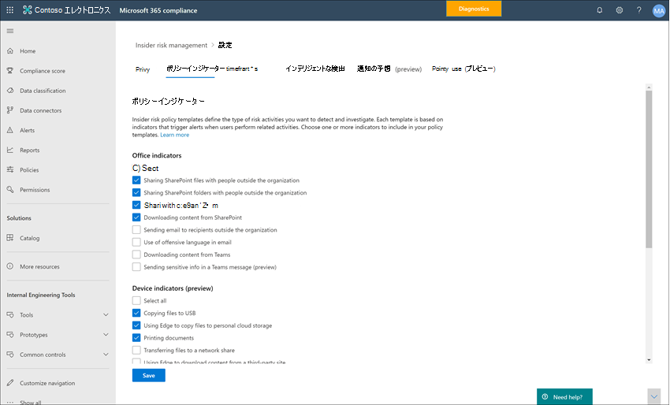

# インサイダー リスク管理設定の使用を開始するGet started with insider risk management settings

インサイダー リスク管理の設定は、ポリシー作成時に選択したテンプレートに関係なく、すべてのインサイダー リスク管理ポリシーに適用されます。Insider risk management settings apply to all insider risk management policies, regardless of the template you chose when creating a policy. 設定は、すべてのインサイダー リスクの管理タブの 1 番上にある **Insider リスク設定** コントロールを使用して構成します。Settings are configured using the **Insider risk settings** control located at the top of all insider risk management tabs. これらの設定は、次の領域のポリシー コンポーネントを制御します。These settings control policy components for the following areas:

- プライバシーPrivacy
- インジケーターIndicators
- ポリシーのタイムラインPolicy timelines
- インテリジェントな検出Intelligent detections
- アラートをエクスポートする (プレビュー)Export alerts (preview)
- 優先度のユーザー グループ (プレビュー)Priority user groups (preview)
- 優先度の物理資産 (プレビュー)Priority physical assets (preview)
- Power Automate フロー (プレビュー)Power Automate flows (preview)
- Microsoft Teams (プレビュー)Microsoft Teams (preview)

インサイダー リスク管理ポリシーを開始して作成する前に、これらの設定を理解し、組織のコンプライアンス ニーズに最適な設定レベルを選択することが重要です。Before you get started and create insider risk management policies, it's important to understand these settings and choose setting levels best for the compliance needs for your organization.

## プライバシーPrivacy

ポリシー照合のあるユーザーのプライバシーの保護は重要であり、インサイダー リスクのアラートに関するデータ調査および分析レビューにおける客観性の促進に役立ちます。Protecting the privacy of users that have policy matches is important and can help promote objectivity in data investigation and analysis reviews for insider risk alerts. インサイダー リスク ポリシーの一致を持つユーザーの場合は、次のいずれかの設定を選択できます。For users with an insider risk policy match, you can choose one of the following settings:

- **匿名化された** バージョンのユーザー名を表示する : ユーザーの名前が匿名化され、管理者、データ調査担当者、レビュー担当者がポリシー通知に関連付けられているユーザーを確認できません。**Show anonymized versions of usernames**: Names of users are anonymized to prevent admins, data investigators, and reviewers from seeing who is associated with policy alerts. たとえば、ユーザーの「Grace Taylor」は、インサイダー リスク管理環境のすべての領域で「AnonIS8-988」のようなランダムな仮名で表示されます。For example, a user 'Grace Taylor' would appear with a randomized pseudonym such as 'AnonIS8-988' in all areas of the insider risk management experience. この設定を選択すると、現在と過去のポリシー照合のあるすべてのユーザーが匿名化され、すべてのポリシーに適用されます。Choosing this setting anonymizes all users with current and past policy matches and applies to all policies. インサイダー リスクアラートのユーザー プロファイル情報とケースの詳細は、このオプションが選択されている場合は使用できません。User profile information in the insider risk alert and case details will not be available when this option is chosen. ただし、ユーザー名は、既存のポリシーに新しいユーザーを追加する場合、またはユーザーを新しいポリシーに割り当てるときに表示されます。However, usernames are displayed when adding new users to existing policies or when assigning users to new policies. この設定をオフにした場合、現在または過去のポリシーが一致しているすべてのユーザーのユーザー名が表示されます。If you choose to turn off this setting, usernames will be displayed for all users that have current or past policy matches.
- **匿名化されたバージョン** のユーザー名を表示しない : ユーザー名は、アラートとケースに対する現在および過去のポリシーの一致すべてについて表示されます。**Do not show anonymized versions of usernames**: Usernames are displayed for all current and past policy matches for alerts and cases. ユーザー プロファイル情報 (名前、役職、エイリアス、組織または部署) は、すべてのインサイダー リスク管理の警告とケースについてユーザーに対して表示されます。User profile information (the name, title, alias, and organization or department) is displayed for the user for all insider risk management alerts and cases.

## インジケーターIndicators

インサイダー リスク ポリシー テンプレートは、検出して調査するリスク アクティビティの種類を定義します。Insider risk policy templates define the type of risk activities that you want to detect and investigate. 各ポリシー テンプレートは、特定のトリガーとリスク アクティビティに対応する特定のインジケーターに基づいています。Each policy template is based on specific indicators that correspond to specific triggers and risk activities. すべてのインジケーターは既定で無効になっています。インサイダー リスク管理ポリシーを構成する前に、1 つ以上のポリシー インジケーターを選択する必要があります。All indicators are disabled by default, and you must select one or more policy indicators before configuring an insider risk management policy.

アラートは、ユーザーが必要なしきい値を満たすポリシー インジケーターに関連するアクティビティを実行すると、ポリシーによってトリガーされます。Alerts are triggered by policies when users perform activities related to policy indicators that meet a required threshold. インサイダー リスク管理では、次の 2 種類のインジケーターを使用します。Insider risk management uses two types of indicators:

- **イベントのトリガー**: ユーザーがインサイダー リスク管理ポリシーでアクティブかどうかを決定するイベント。**Triggering events**: Events that determine if a user is active for an insider risk management policy. ユーザーがインサイダー リスク管理ポリシーに追加された場合、トリガー イベントが発生しない場合、そのユーザーアクティビティはポリシーによって評価されません。If a user is added to an insider risk management policy does not have a triggering event, the user activity is not evaluated by the policy. たとえば、ユーザー A は、データ盗難から作成されたポリシーにユーザー ポリシー テンプレートによって追加され、ポリシーと Microsoft 365 HR コネクタが適切に構成されます。For example, User A is added to a policy created from the *Data theft by departing users* policy template and the policy and Microsoft 365 HR connector are properly configured. ユーザー A が HR コネクタによって報告された終了日を得るまで、ユーザー A アクティビティは、このインサイダー リスク管理ポリシーによってリスクについて評価されません。Until User A has a termination date reported by the HR connector, User A activities aren't evaluated by this insider risk management policy for risk. トリガー イベントのもう 1 つの例は、ユーザーがデータ リーク ポリシーを使用するときに重大度が高い DLP ポリシーアラート *を持つ* 場合です。Another example of a triggering event is if a user has a *High* severity DLP policy alert when using *Data leaks* policies.
- **ポリシー インジケーター**: 対象ユーザーのリスク スコアを決定するために使用されるインサイダー リスク管理ポリシーに含まれるインジケーター。**Policy indicators**: Indicators included in insider risk management policies used to determine a risk score for an in-scope user. これらのポリシー インジケーターは、ユーザーに対してトリガー イベントが発生した後にのみアクティブ化されます。These policy indicators are only activated after a triggering event occurs for a user. ポリシー インジケーターの例としては、ユーザーが個人のクラウド ストレージ サービスまたはポータブル ストレージ デバイスにデータをコピーする場合や、ユーザーが承認されていない外部関係者と内部ファイルやフォルダーを共有する場合があります。Some examples of policy indicators are when a user copies data to personal cloud storage services or portable storage devices, or if a user shares internal files and folders with unauthorized external parties.

ポリシー インジケーターは、次の領域に分割されます。Policy indicators are segmented into the following areas. インサイダー リスク ポリシーを作成するときに、インジケーターを選択して各インジケーター レベルのインジケーター イベント制限をアクティブ化およびカスタマイズできます。You can choose the indicators to activate and customize indicator event limits for each indicator level when creating an insider risk policy:

- **Officeインジケーター**: SharePoint サイト、Teams、および電子メール メッセージングのポリシー インジケーターが含まれます。**Office indicators**: These include policy indicators for SharePoint sites, Teams, and email messaging.
- **デバイス インジケーター**: ネットワーク上やデバイスでファイルを共有するなどのアクティビティに関するポリシー インジケーターが含まれます。**Device indicators**: These include policy indicators for activity such as sharing files over the network or with devices. インジケーターには、ファイルに関連Microsoft Officeアクティビティが含まれます。CSV ファイルと .PDF ファイル。Indicators include activity involving Microsoft Office files, .CSV files, and .PDF files. [デバイス インジケーター **] を選択** した場合、アクティビティは Windows 10 ビルド 1809 以上のデバイスでのみ処理されます。If you select **Device indicators**, activity is processed only for devices with Windows 10 Build 1809 or higher. インサイダー リスクと統合するためのデバイスの構成について詳しくは、「デバイス インジケーターとオンボード デバイスの有効化」セクション [をご覧](insider-risk-management-settings.md#OnboardDevices) ください。For more information on configuring devices for integration with insider risk, see the following [Enable device indicators and onboard devices](insider-risk-management-settings.md#OnboardDevices) section.
- **セキュリティ ポリシー違反インジケーター**: これには、未承認または悪意のあるソフトウェアのインストールまたはセキュリティ制御のバイパスに関連する、エンドポイント用 Microsoft Defender からのインジケーターが含まれます。**Security policy violation indicator**: These include indicators from Microsoft Defender for Endpoint related to unapproved or malicious software installation or bypassing security controls. インサイダー リスク管理でアラートを受信するには、アクティブなエンドポイント用 Defender ライセンスとインサイダー リスク統合を有効にする必要があります。To receive alerts in insider risk management, you must have an active Defender for Endpoint license and insider risk integration enabled. インサイダー リスク管理統合のための Defender for Endpoint の構成について詳しくは、「エンドポイント用 Microsoft Defender の高度な機能を構成する」をご [覧ください](/windows/security/threat-protection/microsoft-defender-atp/advanced-features\#share-endpoint-alerts-with-microsoft-compliance-center)。For more information on configuring Defender for Endpoint for insider risk management integration, see [Configure advanced features in Microsoft Defender for Endpoint](/windows/security/threat-protection/microsoft-defender-atp/advanced-features\#share-endpoint-alerts-with-microsoft-compliance-center).
- **リスク スコア : 異常なアクティビティ** や過去のポリシー違反のリスク スコアの引き上げが含まれます。**Risk score boosters**: These include raising the risk score for unusual activities or past policy violations. リスク スコアを有効にすると、リスク スコアが上がり、これらの種類のアクティビティに関するアラートが発生する可能性が高くなされます。Enabling risk score boosters increase risk scores and the likelihood of alerts for these types of activities. リスク スコアの評価は、1 つ以上のインジケーターが選択されている場合にのみ選択できます。Risk score boosters can only be selected if one or more indicators are selected.

場合によっては、組織内のインサイダー リスク ポリシーに適用されるインサイダー リスク ポリシー インジケーターを制限できます。In some cases, you may want to limit the insider risk policy indicators that are applied to insider risk policies in your organization. すべてのインサイダー リスク ポリシーから無効にすることで、特定の領域のポリシー インジケーターを無効にできます。You can turn off the policy indicators for specific areas by disabling them from all insider risk policies. インサイダー リスク ポリシー テンプレートのトリガー イベントは変更できません。Triggering events cannot be modified for insider risk policy templates.

すべてのインサイダー リスク ポリシーで有効になっているインサイダー リスク ポリシー インジケーターを定義するには **、Insider リスク** 設定インジケーターに移動し、1 つ以上のポリシー インジケーター  >  を選択します。To define the insider risk policy indicators that are enabled in all insider risk policies, navigate to **Insider risk settings** > **Indicators** and select one or more policy indicators. ポリシー ウィザードでインサイダー リスク ポリシーを作成または編集するときに、[インジケーターの設定] ページで選択したインジケーターを個別に構成することはできません。The indicators selected on the Indicators settings page cannot be individually configured when creating or editing an insider risk policy in the policy wizard.

>[!NOTE]
>手動で追加した新しいユーザーがユーザー ダッシュボードに表示されるには数時間かかる **場合があります**。It may take several hours for new manually-added users to appear in the **Users dashboard**. これらのユーザーの過去 90 日間のアクティビティは、表示に最大 24 時間かかる場合があります。Activities for the previous 90 days for these users may take up to 24 hours to display. 手動で追加したユーザーのアクティビティを表示するには、ユーザー ダッシュボードでユーザーを選択し、詳細ウィンドウの [**ユーザー アクティビティ**] タブを開きます。To view activities for manually added users, select the user on the **Users dashboard** and open the **User activity** tab on the details pane.

### デバイス インジケーターを有効にしてデバイスをオンボードするEnable device indicators and onboard devices

デバイス上のリスク アクティビティの監視を有効にし、これらのアクティビティのポリシー インジケーターを含めるには、デバイスが次の要件を満たしている必要があります。また、次のオンボード手順を完了する必要があります。To enable the monitoring of risk activities on devices and include policy indicators for these activities, your devices must meet the following requirements and you must complete the following onboarding steps.

#### 手順 1: エンドポイントを準備するStep 1: Prepare your endpoints

インサイダー リスク管理での報告を計画している Windows 10 デバイスが、これらの要件を満たしていることを確認します。Make sure that the Windows 10 devices that you plan on reporting in insider risk management meet these requirements.

1. Windows 10 x64 ビルド 1809 以降を実行し、2020 年 2 月 20 日から Windows 10 更新プログラム [(OS ビルド 17763.1075)](https://support.microsoft.com/help/4537818/windows-10-update-kb4537818) をインストールしている必要があります。Must be running Windows 10 x64 build 1809 or later and must have installed the [Windows 10 update (OS Build 17763.1075)](https://support.microsoft.com/help/4537818/windows-10-update-kb4537818) from February 20, 2020.
2. すべてのデバイスは[Azure Active Directory (AAD) に参加する ](/azure/active-directory/devices/concept-azure-ad-join)か、Hybrid Azure AD に参加する必要があります。All devices must be [Azure Active Directory (AAD) joined](/azure/active-directory/devices/concept-azure-ad-join), or Hybrid Azure AD joined.
3. Microsoft Chromium Edge ブラウザーをエンドポイント デバイスにインストールして、クラウド アップロード アクティビティのアクションを監視します。Install Microsoft Chromium Edge browser on the endpoint device to monitor actions for the cloud upload activity. 「[Chromium ベースの新しい Microsoft Edge をダウンロードする](https://support.microsoft.com/help/4501095/download-the-new-microsoft-edge-based-on-chromium)」を参照してください。See, [Download the new Microsoft Edge based on Chromium](https://support.microsoft.com/help/4501095/download-the-new-microsoft-edge-based-on-chromium).

#### 手順 2: デバイスのオンボーディングStep 2: Onboarding devices

デバイスでインサイダー リスク管理アクティビティを監視する前に、デバイスの監視を有効にし、エンドポイントをオンボードする必要があります。You must enable device monitoring and onboard your endpoints before you can monitor for insider risk management activities on a device. これらのアクションはどちらも Microsoft 365 コンプライアンスポータルで行われます。Both of these actions are done in the Microsoft 365 Compliance portal.

まだオンボードされていないデバイスをオンボードする場合は、次の手順に従って適切なスクリプトをダウンロードし、展開します。When you want to onboard devices that haven't been onboarded yet, you'll download the appropriate script and deploy as outlined in the following steps.

既に [Microsoft Defender for Endpoint](/windows/security/threat-protection/) にオンボーディングされているデバイスがある場合、それらは管理対象デバイスのリストに表示されます。If you already have devices onboarded into [Microsoft Defender for Endpoint](/windows/security/threat-protection/), they will already appear in the managed devices list. 手順 [3: 次のセクションでデバイス](insider-risk-management-settings.md#OnboardStep3) が Microsoft Defender for Endpoint にオンボードされている場合に実行します。Follow [Step 3: If you have devices onboarded into Microsoft Defender for Endpoint](insider-risk-management-settings.md#OnboardStep3) in the next section.

この展開シナリオでは、まだオンボードされていないデバイスをオンボードし、Windows 10 デバイス上のインサイダー リスクアクティビティを監視するだけの場合です。In this deployment scenario, you'll onboard devices that have not been onboarded yet, and you just want to monitor insider risk activities on Windows 10 devices.

1. [Microsoft コンプライアンスセンター](https://compliance.microsoft.com)を開きます。Open the [Microsoft compliance center](https://compliance.microsoft.com).
2. コンプライアンスセンターの設定ページを開き、[**オンボードデバイス**]を選択します。Open the Compliance Center settings page and choose **Onboard devices**.

   > [!NOTE]
   > 通常、デバイスのオンボーディングが有効になるまで約60秒かかりますが、Microsoft サポートに連絡するまでに最大 30 分かかります。While it usually takes about 60 seconds for device onboarding to be enabled, please allow up to 30 minutes before engaging with Microsoft support.

3. [**デバイス管理**]を選択して、[**デバイス**]リストを開きます。Choose **Device management** to open the **Devices** list. デバイスをオンボードするまで、リストは空になります。The list will be empty until you onboard devices.
4. オンボーディングプロセスを開始するには、[**オンボーディング**]を選択します。Choose **Onboarding** to begin the onboarding process.
5. 展開方法の一覧からこれらのデバイスへの展開方法を選択し、パッケージ **をダウンロードします**。Choose the way you want to deploy to these more devices from the **Deployment method** list and then **download package**.
6. 「[Windows 10 マシンのオンボーディングツールと方法](/windows/security/threat-protection/microsoft-defender-atp/configure-endpoints)」の適切な手順に従います。Follow the appropriate procedures in [Onboarding tools and methods for Windows 10 machines](/windows/security/threat-protection/microsoft-defender-atp/configure-endpoints). このリンクをクリックすると、手順 5 で選択した導入パッケージと一致する Microsoft Defender for Endpoint の手順にアクセスできるランディング ページが表示されます。This link takes you to a landing page where you can access Microsoft Defender for Endpoint procedures that match the deployment package you selected in step 5:
    - グループポリシーを使用した Windows 10 マシンのオンボードOnboard Windows 10 machines using Group Policy
    - Microsoft Endpoint Configuration Manager を使用した Windows 10 マシンのオンボードOnboard Windows machines using Microsoft Endpoint Configuration Manager
    - モバイルデバイス管理ツールを使用した Windows 10 マシンのオンボードOnboard Windows 10 machines using Mobile Device Management tools
    - ローカルスクリプトを使用した Windows 10 マシンのオンボードOnboard Windows 10 machines using a local script
    - 非永続的な仮想デスクトップインフラストラクチャ (VDI) マシンをオンボーディングします。Onboard non-persistent virtual desktop infrastructure (VDI) machines.

完了し、エンドポイントがオンボードされた後、デバイスの一覧に表示され、エンドポイントはインサイダー リスク管理への監査アクティビティ ログの報告を開始します。Once done and endpoint is onboarded, it should be visible in the devices list and the endpoint will start reporting audit activity logs to insider risk management.

> [!NOTE]
> これは、ライセンス執行時でのエクスペリエンスです。This experience is under license enforcement. 必要なライセンスがないと、データは表示されず、アクセスできません。Without the required license, data will not be visible or accessible.

#### 手順 3: デバイスがエンドポイント用 Microsoft Defender にオンボードされている場合Step 3: If you have devices onboarded into Microsoft Defender for Endpoint

Microsoft Defender for Endpoint が既に展開され、エンドポイントが報告されている場合、これらのエンドポイントはすべて管理対象デバイスの一覧に表示されます。If Microsoft Defender for Endpoint is already deployed and there are endpoints reporting in, all these endpoints will appear in the managed devices list. 引き続き新しいデバイスをインサイダー リスク管理にオンボードし、「手順 [2:](insider-risk-management-settings.md#OnboardStep2) オンボード デバイス」セクションを使用して対象範囲を拡大できます。You can continue to onboard new devices into insider risk management to expand coverage by using the [Step 2: Onboarding devices](insider-risk-management-settings.md#OnboardStep2) section.

1. [Microsoft コンプライアンスセンター](https://compliance.microsoft.com)を開きます。Open the [Microsoft compliance center](https://compliance.microsoft.com).
2. コンプライアンスセンターの設定ページを開き、[**デバイスの監視を有効にする**]を選択します。Open the Compliance Center settings page and choose **Enable device monitoring**.
3. [**デバイス管理**]を選択して、[**デバイス**]リストを開きます。Choose **Device management** to open the **Devices** list. 既に Microsoft Defender for Endpoint にレポートしているデバイスのリストが表示されます。You should see the list of devices that are already reporting in to Microsoft Defender for Endpoint.
4. 追加 **のデバイスをオンボード** する必要がある場合は、[オンボード] を選択します。Choose **Onboarding** if you need to onboard more devices.
5. [展開方法] ボックスの一覧からこれらのデバイスへの展開方法を **選択** し、パッケージを **ダウンロードします**。Choose the way you want to deploy to these more devices from the **Deployment method** list and then **Download package**.
6. 「[Windows 10 マシンのオンボーディングツールと方法](/windows/security/threat-protection/microsoft-defender-atp/configure-endpoints)」の適切な手順に従います。Follow the appropriate procedures in [Onboarding tools and methods for Windows 10 machines](/windows/security/threat-protection/microsoft-defender-atp/configure-endpoints). このリンクをクリックすると、手順 5 で選択した導入パッケージと一致する Microsoft Defender for Endpoint の手順にアクセスできるランディング ページが表示されます。This link takes you to a landing page where you can access Microsoft Defender for Endpoint procedures that match the deployment package you selected in step 5:
    - グループポリシーを使用した Windows 10 マシンのオンボードOnboard Windows 10 machines using Group Policy
    - Microsoft Endpoint Configuration Manager を使用した Windows 10 マシンのオンボードOnboard Windows machines using Microsoft Endpoint Configuration Manager
    - モバイルデバイス管理ツールを使用した Windows 10 マシンのオンボードOnboard Windows 10 machines using Mobile Device Management tools
    - ローカルスクリプトを使用した Windows 10 マシンのオンボードOnboard Windows 10 machines using a local script
    - 非永続的な仮想デスクトップインフラストラクチャ (VDI) マシンをオンボーディングします。Onboard non-persistent virtual desktop infrastructure (VDI) machines.

完了し、エンドポイントがオンボードされた後、[ **デバイス** ] テーブルの下に表示され、エンドポイントはインサイダー リスク管理への監査アクティビティ ログの報告を開始します。Once done and endpoint is onboarded, it should be visible under the **Devices** table and the endpoint will start reporting audit activity logs to insider risk management.

> [!NOTE]
>これは、ライセンス執行時でのエクスペリエンスです。This experience is under license enforcement. 必要なライセンスがないと、データは表示されず、アクセスできません。Without the required license, data will not be visible or accessible.

### インジケーター レベルの設定 (プレビュー)Indicator level settings (preview)

ポリシー ウィザードでポリシーを作成する場合、インサイダー リスク アラートのリスク スコアに日次数のリスク イベントが与える影響を構成できます。When creating a policy in the policy wizard, you can configure how the daily number of risk events should influence the risk score for insider risk alerts. これらのインジケーター設定を使用すると、組織内で発生するリスク イベントの数が、これらのイベントのリスク スコアおよびそれに関連するアラートの重大度にどのような影響を与えるのか制御できます。These indicator settings help you control how the number of occurrences of risk events in your organization should affect the risk score, and consequently the associated alert severity, for these events. 必要に応じて、有効なすべてのインジケーターに対して Microsoft が推奨する既定のイベントしきい値レベルを維持することもできます。If you prefer, you can also choose to keep the default event threshold levels recommended by Microsoft for all enabled indicators.

たとえば、インサイダー リスク ポリシー設定で SharePoint インジケーターを有効にし、新しいインサイダー リスク データ漏洩ポリシーのインジケーターを構成するときに SharePoint イベントのカスタムしきい値を設定します。For example, you decide to enable SharePoint indicators in the insider risk policy settings and to set custom thresholds for SharePoint events when configuring indicators for a new insider risk *Data leaks* policy. インサイダー リスク ポリシー ウィザードでは、SharePoint インジケーターごとに 3 つの異なる毎日のイベント レベルを構成して、これらのイベントに関連付けられたアラートのリスク スコアに影響を与える必要があります。While in the insider risk policy wizard, you configure three different daily event levels for each SharePoint indicator to influence the risk score for alerts associated with these events.

最初の 1 日のイベント レベルでは、イベントのリスク スコアへの影響が低い場合は 1 日あたり *10* 以上のイベント、イベントのリスク スコアに中程度の影響を与える場合は 1 日あたり *20* 以上のイベント、1 日あたり *30* 以上のイベントはイベントのリスク スコアに高い影響を与えるしきい値を設定します。For the first daily event level, you set the threshold at *10 or more events per day* for a lower impact to the risk score for the events, *20 or more events per day* for a medium impact to the risk score for the events, and *30 or more events per day* a higher impact to the risk score for the events. これらの設定は、実質的に次のことを意味します。These settings effectively mean:

- イベントをトリガーした後に発生する SharePoint イベントが 1 ~ 9 件ある場合、リスク スコアは影響を最小限に抑え、警告を生成しない傾向があります。If there are 1-9 SharePoint events that take place after triggering event, risk scores are minimally impacted and would tend not to generate an alert.
- トリガー イベントの後に発生する SharePoint イベントが 10 ~ 19 件ある場合、リスク スコアは本質的に低く、アラートの重大度レベルは低いレベルになる傾向があります。If there are 10-19  SharePoint events that take place after a triggering event, the risk score is inherently lower and alert severity levels would tend to be at a low level.
- トリガー後に発生する SharePoint イベントが 20 ~ 29 件ある場合、リスク スコアは本質的に高く、アラートの重大度レベルは中レベルになる傾向があります。If there are 20-29 SharePoint events that take place after a triggering, the risk score is inherently higher and alert severity levels would tend to be at a medium level.
- トリガー後に発生する SharePoint イベントが 30 以上ある場合、リスク スコアは本質的に高く、アラートの重大度レベルは高いレベルになる傾向があります。If there are 30 or more SharePoint events that take place after a triggering, the risk score is inherently higher and alert severity levels would tend to be at a high level.

## ポリシー期間Policy timeframes

ポリシー期間を使用すると、インサイダー リスク管理ポリシー テンプレートのイベントおよびアクティビティに基づいて、ポリシー照合の後にトリガーされる過去および将来の確認期間を定義できます。Policy timeframes allow you to define past and future review periods that are triggered after policy matches based on events and activities for the insider risk management policy templates. 選択したポリシー テンプレートに応じて、次のポリシー期間を使用できます。Depending on the policy template you choose, the following policy timeframes are available:

- **アクティブ化ウィンドウ**: すべてのポリシー テンプレートで使用できます。アクティブ化ウィンドウは、トリガー イベントが発生した後にウィンドウがアクティブ化される定義済みの日数です。**Activation window**: Available for all policy templates, the *Activation window* is the defined number of days that the window activates **after** a triggering event. このウィンドウは、ポリシーに割り当てられたユーザーに対してトリガー イベントが発生した後、1 ~ 30 日間アクティブ化されます。The window activates for 1 to 30 days after a triggering event occurs for any user assigned to the policy. たとえば、インサイダー リスク管理ポリシーを構成し、ライセンス認証ウィンドウを 30 日に設定したとします。For example, you've configured an insider risk management policy and set the *Activation window* to 30 days. ポリシーを構成してから数か月が経過し、そのポリシーに含まれているいずれかのユーザーに対してトリガー イベントが発生します。Several months have passed since you configured the policy and a triggering event occurs for one of the users included in the policy. トリガー イベントはアクティブ *化ウィンドウを* アクティブ化し、トリガー イベントが発生した後 30 日間、そのユーザーに対してポリシーがアクティブになります。The triggering event activates the *Activation window* and the policy is active for that user for 30 days after the triggering event occurred.
- **過去のアクティビティの** 検出 : すべてのポリシー テンプレートで使用できます。過去のアクティビティ検出は、トリガー イベントが発生する前にウィンドウがアクティブ化される定義済みの日数です。**Past activity detection**: Available for all policy templates, the *Past activity detection* is the defined number of days that the window activates **before** a triggering event. このウィンドウは、ポリシーに割り当てられたすべてのユーザーに対してトリガー イベントが発生する前に、0 ~ 180 日間アクティブ化されます。The window activates for 0 to 180 days before a triggering event occurs for any user assigned to the policy. たとえば、インサイダー リスク管理ポリシーを構成し、過去のアクティビティ検出を 90 日間に設定したとします。For example, you've configured an insider risk management policy and set the *Past activity detection* to 90 days. ポリシーを構成してから数か月が経過し、そのポリシーに含まれているいずれかのユーザーに対してトリガー イベントが発生します。Several months have passed since you configured the policy and a triggering event occurs for one of the users included in the policy. トリガー イベントは過去のアクティビティ検出をアクティブ化し、ポリシーはトリガー イベントの 90 日前に、そのユーザーの過去のアクティビティを収集します。The triggering event activates the *Past activity detection* and the policy gathers historic activities for that user for 90 days prior to the triggering event.

## インテリジェントな検出Intelligent detections

インテリジェントな検出設定は、危険なアクティビティの検出をアラートに対して処理する方法を調整するのに役立ちます。Intelligent detection settings help refine how the detections of risky activities are processed for alerts. 状況によっては、無視するファイルの種類を定義する必要がある場合や、ファイルの検出レベルを適用して、通知の最小バーを定義する必要がある場合があります。In certain circumstances, you may need to define files types to ignore or you want to enforce a detection level for files to help define a minimum bar for alerts. これらの設定を使用して、アラート ボリューム全体、ファイルの種類の除外、ファイル ボリュームの制限を制御します。Use these settings to control overall alert volume, file type exclusions, and file volume limits.

### 異常検出Anomaly detections

異常検出には、ファイルの種類の除外やファイルの量の制限設定が含まれます。Anomalous detections include settings for file type exclusions and file volume limits.

- **ファイルの種類の除外**: インサイダー リスク管理ポリシーの一致から特定の種類のファイルを除外するには、ファイルの種類の拡張子をコンマで区切って入力します。**File type exclusions**: To exclude specific file types from all insider risk management policy matching, enter file type extensions separated by commas. たとえば、特定の種類の音楽ファイルをポリシー照合から除外するには、*ファイルの種類の除外* フィールドで **aac、mp3、wav、wma** と入力します。For example, to exclude certain types of music files from policy matches you may enter *aac,mp3,wav,wma* in the **File type exclusions** field. これらの拡張子が付いたファイルは、すべてのインサイダー リスク管理ポリシーで無視されます。Files with these extensions would be ignored by all insider risk management policies.
- **ファイル ボリュームのカットオフ制限**: インサイダー リスク ポリシーでアクティビティアラートが報告される前の最小ファイル レベルを定義するには、ファイルの数を入力します。**File volume cut-off limit**: To define a minimum file level before activity alerts are reported in insider risk policies, enter the number of files. たとえば、ポリシーでこのアクティビティが異常と見なされている場合でも、ユーザーが 10 ファイル以下をダウンロードするときにインサイダー リスクの警告を生成しない場合は、「10」と入力します。For example, you would enter '10' if you do not want to generate insider risk alerts when a user downloads 10 files or less, even if the policies consider this activity an anomaly.

### アラート ボリュームAlert volume

インサイダー リスク ポリシーによって検出されたユーザー アクティビティには、特定のリスク スコアが割り当てられます。このスコアによってアラートの重大度 (低、中、高) が決定されます。User activities detected by insider risk policies are assigned a specific risk score, which in turn determines the alert severity (low, medium, high). 既定では、一定量の低、中、高の重大度のアラートが生成されますが、必要に応じてボリュームを増減できます。By default, we'll generate a certain amount of low, medium, and high severity alerts, but you can increase or decrease the volume to suit your needs. すべてのインサイダー リスク管理ポリシーのアラートの量を調整するには、次のいずれかの設定を選択します。To adjust the volume of alerts for all insider risk management policies, choose one of the following settings:

- **アラートの数が** 少ない : 重大度の高いアラートはすべて表示され、重大度が中程度のアラートは少なく、重要度が低いアラートは表示されます。**Fewer alerts**: You'll see all high severity alerts, fewer medium severity alerts, and no low severity ones. この設定レベルは、真の正の値が見つからない可能性を意味します。This setting level means you might miss some true positives.
- **既定のボリューム**: 重大度の高いアラートと、中程度と低の重大度のアラートのバランスの取れた量が表示されます。**Default volume**: You'll see all high severity alerts and a balanced amount of medium and low severity alerts.
- **その他の** アラート: 重大度が中程度のアラートと高いアラート、および重要度の最も低いアラートが表示されます。**More alerts**: You'll see all medium and high severity alerts and most low severity alerts. この設定レベルでは、誤検知が多く発生する可能性があります。This setting level might result in more false positives.

### Microsoft Defender for Endpoint (プレビュー)Microsoft Defender for Endpoint (preview)

[Microsoft Defender for Endpoint は](/windows/security/threat-protection/microsoft-defender-atp/microsoft-defender-advanced-threat-protection) 、エンタープライズ ネットワークが高度な脅威を防止、検出、調査、および対応するために設計されたエンタープライズ エンドポイント セキュリティ プラットフォームです。[Microsoft Defender for Endpoint](/windows/security/threat-protection/microsoft-defender-atp/microsoft-defender-advanced-threat-protection) is an enterprise endpoint security platform designed to help enterprise networks prevent, detect, investigate, and respond to advanced threats. 組織内のセキュリティ違反をよりよく可視化するには、インサイダー リスク管理セキュリティ違反ポリシー テンプレートから作成されたポリシーで使用されるアクティビティについて、Defender for Endpoint アラートをインポートしてフィルター処理できます。To have better visibility of security violation in your organization, you can import and filter Defender for Endpoint alerts for activities used in policies created from insider risk management security violation policy templates.

関心のあるシグナルの種類に応じて、Defender for Endpoint アラートトリアージの状態に基づいてインサイダー リスク管理にアラートをインポートできます。Depending on the types of signals you are interested in, you can choose to import alerts to insider risk management based on the Defender for Endpoint alert triage status. インポートするグローバル設定で、次のアラート トリアージ状態を 1 つ以上定義できます。You can define one or more of the following alert triage statuses in the global settings to import:

- 不明Unknown
- 新規New
- 処理中In progress
- ResolvedResolved

エンドポイント用 Defender からのアラートは毎日インポートされます。Alerts from Defender for Endpoint are imported daily. 選択したトリアージの状態によっては、エンドポイント用 Defender のトリアージステータスの変更と同じアラートに対して複数のユーザー アクティビティが表示される場合があります。Depending on the triage status you choose, you may see multiple user activities for the same alert as the triage status changes in Defender for Endpoint.

たとえば、この設定で [新規]、[進行中]、および [解決済み] を選択した場合、Microsoft Defender for Endpoint アラートが生成され、ステータスが [新規] の場合、インサイダー リスクのユーザーに対して最初のアラート アクティビティがインポートされます。  For example, if you select *New*, *In progress*, and *Resolved* for this setting, when a Microsoft Defender for Endpoint alert is generated and the status is *New*, an initial alert activity is imported for the user in insider risk. Defender for Endpoint トリアージの状態が *[進行中*] に変わると、このアラートの 2 番目のアクティビティがインサイダー リスクのユーザーに対してインポートされます。When the Defender for Endpoint triage status changes to *In progress*, a second activity for this alert is imported for the user in insider risk. 最終的な Defender for Endpoint トリアージの *状態である Resolved* が設定されると、このアラートの 3 番目のアクティビティがインサイダー リスクのユーザーに対してインポートされます。When the final Defender for Endpoint triage status of *Resolved* is set, a third activity for this alert is imported for the user in insider risk. この機能により、調査担当者は Defender for Endpoint のアラートの進行状況に従い、調査で必要な可視性のレベルを選択できます。This functionality allows investigators to follow the progression of the Defender for Endpoint alerts and choose the level of visibility that their investigation requires.

>[!IMPORTANT]
>組織で Microsoft Defender for Endpoint を構成し、Defender セキュリティ センターでインサイダー リスク管理統合のために Defender for Endpoint を有効にして、セキュリティ違反の警告をインポートする必要があります。You'll need to have Microsoft Defender for Endpoint configured in your organization and enable Defender for Endpoint for insider risk management integration in the Defender Security Center to import security violation alerts. インサイダー リスク管理の統合のために Defender for Endpoint を構成する方法について詳しくは、「エンドポイント用 Defender の高度な機能を構成する」をご [覧ください](/windows/security/threat-protection/microsoft-defender-atp/advanced-features\#share-endpoint-alerts-with-microsoft-compliance-center)。For more information on configuring Defender for Endpoint for insider risk management integration, see [Configure advanced features in Defender for Endpoint](/windows/security/threat-protection/microsoft-defender-atp/advanced-features\#share-endpoint-alerts-with-microsoft-compliance-center).

### ドメイン (プレビュー)Domains (preview)

ドメイン設定は、特定のドメインへの通信のリスク レベルを定義するのに役立ちます。Domain settings help you define risk levels for communications to specific domains. これらの通信には、ファイルの共有、電子メール メッセージ、コンテンツのダウンロードが含まれます。These communications include sharing files, email messages, or downloading content. これらの設定でドメインを指定することで、これらのドメインで行うアクティビティのリスク スコアを増減できます。By specifying domains in these settings, you can increase or decrease the risk scoring for activity that takes place with these domains. たとえば、許可されたcontoso.comとsales.wingtiptoys.comを指定するには、[許可されたドメイン] フィールドに「contoso.com sales.wingtiptoys.com」と **入力** します。For example, to specify contoso.com and sales.wingtiptoys.com as allowed domains, you will enter 'contoso.com sales.wingtiptoys.com' in the **Allowed domains** field.

次のドメイン設定ごとに、最大 500 のドメインを入力できます。For each of the following domain settings, you can enter up to 500 domains:

- **許可されていないドメイン:** 許可されていないドメインを指定すると、これらのドメインで行うアクティビティのリスク スコア *が高くなります* 。**Unallowed domains:** By specifying unallowed domains, activity that takes place with these domains will have *higher* risk scores.
- **許可されたドメイン:** 許可ドメインを設定で指定すると、これらのドメインで行われるアクティビティはリスク スコアが低く、内部組織のアクティビティの処理方法と同様に処理されます。**Allowed domains:** By specifying allowed domains in settings, activity that takes place with these domains will have *lower* risk scores and is treated similarly to how internal organization activity is treated. たとえば、これらのドメインに対する電子メール アクティビティは、内部電子メール アクティビティの分析方法と同様に分析されます。For example, email activities to these domains are analyzed similarly to how internal email activity is analyzed.
- **サード パーティのドメイン:** サード パーティのドメインは、組織のビジネス目的で使用されるドメインであり、機密性の高いコンテンツがこれらの場所に保存される場合があります。**Third party domains:** Third party domains are domains used for business purposes at your organization and sensitive content may be stored across these locations. サード パーティのドメインを指定すると、これらのドメインで危険なアクティビティに関するアラートを受信できます。By specifying a third party domain, you can receive alerts for any risky activity on these domains.

## アラートをエクスポートする (プレビュー)Export alerts (preview)

インサイダー リスク管理アラート情報は、Office [365](/office/office-365-management-api/office-365-management-activity-api-schema#security-and-compliance-alerts-schema)管理アクティビティ API スキーマを介してセキュリティ情報およびイベント管理 (SIEM) サービスにエクスポートできます。Insider risk management alert information is exportable to security information and event management (SIEM) services via the [Office 365 Management Activity API schema](/office/office-365-management-api/office-365-management-activity-api-schema#security-and-compliance-alerts-schema). Office 365 管理アクティビティ API を使用して、組織がインサイダー リスク情報の管理または集計に使用する可能性がある他のアプリケーションにアラート情報をエクスポートできます。You can use the Office 365 Management Activity APIs to export alert information to other applications your organization may use to manage or aggregate insider risk information.

API を使用してインサイダー リスクアラート情報を確認するには:To use the APIs to review insider risk alert information:

1. Insider **リスク** Office設定のエクスポートで、365 管理アクティビティ API のサポート  >  **を有効**  >  **にします**。Enable Office 365 Management Activity API support in **Insider risk management** > **Settings** > **Export**. 既定では、この設定は Microsoft 365 組織では無効になっています。By default, this setting is disabled for your Microsoft 365 organization.
2. *SecurityComplianceAlerts* Office 365 の一般的な監査アクティビティをフィルター処理します。Filter the common Office 365 audit activities by *SecurityComplianceAlerts*.
3. *InsiderRiskManagement カテゴリで SecurityComplianceAlerts をフィルター* 処理します。 Filter *SecurityComplianceAlerts* by the *InsiderRiskManagement* category.

アラート情報には、セキュリティとコンプライアンスの警告スキーマ、および Office 365 マネージメント アクティビティ API 共通スキーマからの情報が含まれる。Alert information contains information from the security and compliance alert schema and the Office 365 Management Activity API common schema.

次のフィールドと値は、セキュリティ/コンプライアンス アラート スキーマのインサイダー リスク管理&エクスポートされます。The following fields and values are exported for insider risk management alerts for the Security & Compliance alert schema:

| **Alert パラメーター****Alert parameter** | **説明****Description** |
|:------------------|:----------------|
| AlertTypeAlertType | 通知の種類はカスタム *です*。Type of the alert is *Custom*.  |
| AlertIdAlertId | アラートの GUID。The GUID of the alert. インサイダー リスク管理のアラートは変更可能です。Insider risk management alerts are mutable. アラートの状態が変化すると、同じ AlertID を持つ新しいログが生成されます。As alert status changes, a new log with the same AlertID is generated. This AlertID can be used to correlate updates for an alert.This AlertID can be used to correlate updates for an alert. |
| カテゴリCategory | アラートのカテゴリは *InsiderRiskManagement です*。The category of the alert is *InsiderRiskManagement*. このカテゴリは、これらのアラートと他のセキュリティ/コンプライアンスアラートを区別&使用できます。This category can be used to distinguish from these alerts from other Security & Compliance alerts. |
| CommentsComments | アラートの既定のコメント。Default comments for the alert. 値は *新しいアラート* (アラートの作成時にログに記録される) とアラート *の更新* (アラートの更新時にログに記録される) です。Values are *New Alert* (logged when an alert is created) and *Alert Updated* (logged when there is an update to an alert). AlertID を使用して、アラートの更新を関連付ける。Use the AlertID to correlate updates for an alert. |
| データData | アラートのデータには、一意のユーザー ID、ユーザー プリンシパル名、およびユーザーがポリシーにトリガーされた日時 (UTC) が含まれます。The data for the alert, includes the unique user ID, user principal name, and date and time (UTC) when user was triggered into a policy. |
| 名前Name | アラートを生成したインサイダー リスク管理ポリシーのポリシー名。Policy name for insider risk management policy that generated the alert. |
| PolicyIdPolicyId | アラートをトリガーしたインサイダー リスク管理ポリシーの GUID。The GUID of the insider risk management policy that triggered the alert. |
| 重要度Severity | アラートの重要度。The severity of the alert. 値は、*高、\*\*中、* または *低 です*。Values are *High*, *Medium*, or *Low*. |
| ソースSource | アラートのソース。The source of the alert. この値は *、Office 365 Security & Compliance です*。The value is *Office 365 Security & Compliance*. |
| 状態Status | アラートの状態。The status of the alert. 値は *アクティブ*(インサイ *ダー* リスクでのレビューが必要)、*調査中\*\*(イン* サイダー リスクで確認済み)、*解決済み\*\*(イン* サイダー リスクで解決済 *み)、* 却下 *(イン* サイダー リスクで却下)。Values are *Active* (*Needs Review* in insider risk), *Investigating* (*Confirmed* in insider risk), *Resolved* (*Resolved* in insider risk), *Dismissed* (*Dismissed* in insider risk). |
| バージョンVersion | セキュリティとコンプライアンスの警告スキーマのバージョン。The version of the security and compliance alert schema. |

以下のフィールドと値は、Office 365 マネージメント アクティビティ API 共通スキーマに関するインサイダー リスク管理 [の警告用にエクスポートされます](/office/office-365-management-api/office-365-management-activity-api-schema#common-schema)。The following fields and values are exported for insider risk management alerts for the [Office 365 Management Activity API common schema](/office/office-365-management-api/office-365-management-activity-api-schema#common-schema).

- UserIdUserId
- IDId
- RecordTypeRecordType
- CreationTimeCreationTime
- 操作Operation
- OrganizationIdOrganizationId
- UserTypeUserType
- UserKeyUserKey

## 優先度のユーザー グループ (プレビュー)Priority user groups (preview)

組織内のユーザーは、自分の位置、機密情報へのアクセスレベル、またはリスク履歴に応じて、異なるレベルのリスクを持つ場合があります。Users in your organization may have different levels of risk depending on their position, level of access to sensitive information, or risk history. これらのユーザーのアクティビティの検査とスコアを優先順位付けすると、組織に高い結果をもたらす可能性のある潜在的なリスクについて警告することができます。Prioritizing the examination and scoring of the activities of these users can help alert you to potential risks that may have higher consequences for your organization. インサイダー リスク管理の優先度の高いユーザー グループは、より詳細な検査とより機密性の高いリスク スコアリングを必要とする組織内のユーザーを定義するのに役立ちます。Priority user groups in insider risk management help define the users in your organization that need closer inspection and more sensitive risk scoring. 優先度ユーザーによるセキュリティポリシー違反や優先度ユーザー ポリシーテンプレートによるデータ漏洩と組み合まれており、優先度ユーザー グループに追加されたユーザーは、インサイダー リスクの警告や警告の重大度レベルが高くなる可能性が高くなります。Coupled with the *Security policy violations by priority users* and *Data leaks by priority users* policy templates, users added to a priority user group have an increased likelihood of insider risk alerts and alerts with higher severity levels.

たとえば、ユーザーが機密情報にアクセスできる機密性の高いプロジェクトのデータ漏洩から保護する必要があります。For example, you need to protect against data leaks for a highly confidential project where users have access to sensitive information. このプロジェクトに取 *り組* む組織内のユーザーに対して、プロジェクト ユーザーの優先度の高いユーザー グループを作成します。You choose to create *Confidential Project* *Users* priority user group for users in your organization that work on this project. ポリシー ウィザードと優先度ユーザーポリシー テンプレートによるデータ漏洩を使用して、新しいポリシーを作成し *、"Confidential Project Users/機密プロジェクト ユーザー* " 優先度ユーザー グループをポリシーに割り当てる。Using the policy wizard and the *Data leaks by priority users* policy template, you create a new policy and assign the *Confidential Project Users* priority users group to the policy. [機密プロジェクト ユーザー] 優先度ユーザーグループのメンバーに対してポリシーによって調べらたアクティビティはリスクに対してより機密性が高く、これらのユーザーによるアクティビティはアラートを生成する可能性が高く、重大度レベルが高いアラートを持つ可能性が高くなります。Activities examined by the policy for members of the *Confidential Project Users* priority user group are more sensitive to risk and activities by these users will be more likely to generate an alert and have alerts with higher severity levels.

### 優先度のユーザー グループを作成するCreate a priority user group

新しい優先度ユーザー グループを作成するには、Microsoft 365 コンプライアンス センターの **Insider リスク** 管理ソリューションで設定コントロールを使用します。To create a new priority user group, you'll use setting controls in the **Insider risk management** solution in the Microsoft 365 compliance center. 優先度のユーザー グループを作成するには *、Insider Risk Management* 役割グループまたは *Insider Risk Management Admin* 役割グループのメンバーである必要があります。To create a priority user group, you must be a member of the *Insider Risk Management* or *Insider Risk Management Admin* role group.

優先度のユーザー グループを作成するには、次の手順を実行します。Complete the following steps to create a priority user group:

1. Microsoft [365](https://compliance.microsoft.com)コンプライアンス センターで、[Insider リスク管理] に移動し **、[Insider リスク** の設定] **を選択します**。In the [Microsoft 365 compliance center](https://compliance.microsoft.com), go to **Insider risk management** and select **Insider risk settings**.
2. [優先度の **ユーザー グループ] タブを選択** するSelect the **Priority user groups** tab
3. [優先度ユーザー **グループ] タブで** 、[優先度ユーザー グループの作成] を選択 **し、グループ** 作成ウィザードを開始します。On the **Priority user groups** tab, select **Create priority user group** to start the group creation wizard.
4. [グループの **定義] ページ** で、次のフィールドに入力します。On the **Define group** page, complete the following fields:
    - **Name (必須)**: 優先度ユーザー グループの表示名を入力します。**Name (required)**: Enter a friendly name for the priority user group. ウィザードを完了した後は、優先度のユーザー グループの名前を変更できます。You can't change the name of the priority user group after you complete the wizard.
    - **説明 (オプション)**: 優先度ユーザー グループの説明を入力します。**Description (optional)**: Enter a description for the priority user group.
5. [次 **へ] を選択** して続行します。Select **Next** to continue.
6. [メンバーの選択] ページで、[検索するメンバーの選択] を選択し、グループに含めるメールが有効なユーザー アカウントを選択するか、[すべて選択] チェック ボックスをオンにして組織内のすべてのユーザーをグループに追加します。 On the **Choose members** page, select **Choose members** to search and select which mail-enabled user accounts are included in the group or select the **Select all** checkbox to add all users in your organization to the group. [ **追加] を** 選択して続行するか **、[** キャンセル] を選択して、グループにユーザーを追加せずに閉じます。Select **Add** to continue or **Cancel** to close without adding any users to the group.
7. [次 **へ] を選択** して続行します。Select **Next** to continue.
8. [ **レビュー]** ページで、優先度のユーザー グループに対して選択した設定を確認します。On the **Review** page, review the settings you've chosen for the priority user group. グループ **の値を** 変更するには [編集] を選択し、優先度のユーザー グループ **を作成して** アクティブ化するには [送信] を選択します。Select **Edit** to change any of the group values or select **Submit** to create and activate the priority user group.
9. 確認ページで、[完了] **を選択** してウィザードを終了します。On the confirmation page, select **Done** to exit the wizard.

### 優先度のユーザー グループを更新するUpdate a priority user group

既存の優先度ユーザー グループを更新するには、Microsoft 365 コンプライアンス センターの **Insider リスク** 管理ソリューションの設定コントロールを使用します。To update an existing priority user group, you'll use setting controls in the **Insider risk management** solution in the Microsoft 365 compliance center. 優先度ユーザー グループを更新するには *、Insider Risk Management* 役割グループまたは *Insider Risk Management Admin* 役割グループのメンバーである必要があります。To update a priority user group, you must be a member of the *Insider Risk Management* or *Insider Risk Management Admin* role group.

優先度ユーザー グループを編集するには、次の手順を実行します。Complete the following steps to edit a priority user group:

1. Microsoft [365](https://compliance.microsoft.com)コンプライアンス センターで、[Insider リスク管理] に移動し **、[Insider リスク** の設定] **を選択します**。In the [Microsoft 365 compliance center](https://compliance.microsoft.com), go to **Insider risk management** and select **Insider risk settings**.
2. [優先度の **ユーザー グループ] タブを選択** するSelect the **Priority user groups** tab
3. 編集する優先度のユーザー グループを選択し、[グループの編集] **を選択します**。Select the priority user group you want to edit and select **Edit group**.
4. [グループの **定義] ページ** で、必要に応じて [説明] フィールドを更新します。On the **Define group** page, update the Description field if needed. 優先度のユーザー グループの名前は更新できない。You can't update the name of the priority user group. [次 **へ] を** 選択して続行します。Select **Next** to continue.
5. [メンバー **の選択] ページで** 、[メンバーの選択] コントロールを使用してグループに新 **しいメンバーを追加** します。On the **Choose members** page, add new members to the group using the **Choose members** control. グループからユーザーを削除するには、削除するユーザーの横にある [X] を選択します。To remove a user from the group, select the 'X' next to the user you wish to remove. [次 **へ] を選択** して続行します。Select **Next** to continue.
6. [ **レビュー]** ページで、優先度ユーザー グループに対して選択した更新設定を確認します。On the **Review** page, review the update settings you've chosen for the priority user group. グループ **の値を** 変更するには [編集] を選択し、優先度のユーザー グループを更新するには [ **送信** ] を選択します。Select **Edit** to change any of the group values or select **Submit** to update the priority user group.
7. 確認ページで、[完了] **を選択** してウィザードを終了します。On the confirmation page, select **Done** to exit the wizard.

### 優先度のユーザー グループを削除するDelete a priority user group

既存の優先度ユーザー グループを削除するには、Microsoft 365 コンプライアンス センターの **Insider リスク** 管理ソリューションの設定コントロールを使用します。To delete an existing priority user group, you'll use setting controls in the **Insider risk management** solution in the Microsoft 365 compliance center. 優先度ユーザー グループを削除するには *、Insider Risk Management* 役割グループまたは *Insider Risk Management Admin* 役割グループのメンバーである必要があります。To delete a priority user group, you must be a member of the *Insider Risk Management* or *Insider Risk Management Admin* role group.

>[!IMPORTANT]
>優先度のユーザー グループを削除すると、そのグループが割り当てられているアクティブなポリシーからそのグループが削除されます。Deleting a priority user group will remove it from any active policy to which it is assigned. アクティブなポリシーに割り当てられている優先度ユーザー グループを削除すると、ポリシーにはスコープ内のユーザーが含まれるのではなく、実質的にアイドル状態であり、通知は作成されません。If you delete a priority user group that is assigned to an active policy, the policy will not contain any in-scope users and will effectively be idle and will not create alerts.

優先度のユーザー グループを削除するには、次の手順を実行します。Complete the following steps to delete a priority user group:

1. Microsoft [365](https://compliance.microsoft.com)コンプライアンス センターで、[Insider リスク管理] に移動し **、[Insider リスク** の設定] **を選択します**。In the [Microsoft 365 compliance center](https://compliance.microsoft.com), go to **Insider risk management** and select **Insider risk settings**.
2. [優先度の **ユーザー グループ] タブを選択** するSelect the **Priority user groups** tab
3. 編集する優先度のユーザー グループを選択し、ダッシュボード メニューから **[削除** ] を選択します。Select the priority user group you want to edit and select **Delete** from the dashboard menu.
4. [削除 **] ダイアログで**、[**は** い] を選択して優先度のユーザー グループを削除するか、[キャンセル] を選択してダッシュボードに戻ります。On the **Delete** dialog, select **Yes** to delete the priority user group or select **Cancel** to return to the dashboard.

## 優先度の物理資産 (プレビュー)Priority physical assets (preview)

優先度の高い物理資産へのアクセスを識別し、アクセス アクティビティとユーザー イベントを関連付けるのは、コンプライアンス インフラストラクチャの重要なコンポーネントです。Identifying access to priority physical assets and correlating access activity to user events is an important component of your compliance infrastructure. これらの物理資産は、会社の建物、データ センター、サーバー ルームなど、組織内の優先度の高い場所を表します。These physical assets represent priority locations in your organization, such as company buildings, data centers, or server rooms. インサイダー リスク アクティビティは、通常とは異なる時間に作業しているユーザー、承認されていない機密性の高い領域やセキュリティで保護された領域にアクセスしようとするユーザー、および正当なニーズのない高レベル領域へのアクセスの要求に関連付けられている可能性があります。Insider risk activities may be associated with users working unusual hours, attempting to access these unauthorized sensitive or secure areas, and requests for access to high-level areas without legitimate needs.

優先度の物理資産を有効にし、物理不良データ コネクタを構成すると、インサイダー リスク管理は、物理制御システムおよびアクセス システムからのシグナルを他のユーザー リスク アクティビティと統合します。With priority physical assets enabled and the [Physical badging data connector](import-physical-badging-data.md) configured, insider risk management integrates signals from your physical control and access systems with other user risk activities. 物理アクセス システム全体の動作パターンを調べて、これらのアクティビティを他のインサイダー リスク イベントと関連付けすることで、インサイダー リスク管理は、コンプライアンス調査担当者やアナリストがアラートに対してより多くの情報に基づいた対応の決定を行うのに役立ちます。By examining patterns of behavior across physical access systems and correlating these activities with other insider risk events, insider risk management can help compliance investigators and analysts make more informed response decisions for alerts. 優先度の高い物理資産へのアクセスは、優先度の低いアセットへのアクセスとは異なる方法でスコア付けされ、分析情報で識別されます。Access to priority physical assets are scored and identified in insights differently from access to non-priority assets.

たとえば、組織には、通常の作業領域や機密性の高いプロジェクト領域への物理的なアクセスを監視および承認するユーザー用の不良システムがあります。For example, your organization has a badging system for users that monitors and approves physical access to normal working and sensitive project areas. 機密性の高いプロジェクトに取り組む複数のユーザーがいて、プロジェクトが完了すると、これらのユーザーは組織の他の領域に戻る必要があります。You have several users working on a sensitive project and these users will return to other areas of your organization when the project is completed. 機密性の高いプロジェクトが完了間近に近付く中、プロジェクト作業が機密であり、プロジェクト領域へのアクセスが厳しく管理されている必要があります。As the sensitive project nears completion, you want to make sure that the project work remains confidential and that access to the project areas is tightly controlled.

Microsoft 365 の物理不良データ コネクタを有効にして、物理バグシステムからアクセス情報をインポートし、インサイダー リスク管理で優先度の高い物理資産を指定することができます。You choose to enable the Physical badging data connector in Microsoft 365 to import access information from your physical badging system and specify priority physical assets in insider risk management. バグシステムから情報をインポートし、物理的なアクセス情報をインサイダー リスク管理で識別された他のリスクアクティビティと関連付けすることで、プロジェクトのユーザーの 1 人が通常の勤務時間後にプロジェクト オフィスにアクセスし、通常の作業領域から個人のクラウド ストレージ サービスに大量のデータをエクスポートしているのに気付きます。By importing information from your badging system and correlating physical access information with other risk activities identified in insider risk management, you notice that one of the users on the project is accessing the project offices after normal working hours and is also exporting large amounts of data to a personal cloud storage service from their normal work area. オンライン アクティビティに関連するこの物理的なアクセス アクティビティは、データの盗難の可能性を示している場合があり、コンプライアンス調査担当者やアナリストは、このユーザーの状況に応じて適切なアクションを実行できます。This physical access activity associated with the online activity may point to possible data theft and compliance investigators and analysts can take appropriate actions as dictated by the circumstances for this user.

### 優先度の物理資産を構成するConfigure priority physical assets

優先度の物理資産を構成するには、物理バグリング コネクタを構成し、Microsoft 365 コンプライアンス センターの **Insider リスク** 管理ソリューションで設定コントロールを使用します。To configure priority physical assets, you'll configure the Physical badging connector and use setting controls in the **Insider risk management** solution in the Microsoft 365 compliance center. 優先度の物理資産を構成するには *、Insider Risk Management* または Insider Risk Management Admin 役割グループのメンバー *である必要があります*。To configure priority physical assets, you must be a member of the *Insider Risk Management* or *Insider Risk Management Admin role group*.

優先度の物理資産を構成するには、次の手順を実行します。Complete the following steps to configure priority physical assets:

1. インサイダー リスク管理の構成手順については、「インサイダー リスク管理の開始」 [の記事を参照](insider-risk-management-configure.md) してください。Follow the configuration steps for insider risk management in the [Getting started with insider risk management](insider-risk-management-configure.md) article. 手順 3 で、物理バグリング コネクタを構成します。In Step 3, make sure you configure the Physical badging connector.

    >[!IMPORTANT]
    >インサイダー リスク管理ポリシーで、内部および終了したユーザーに関連する信号データを物理制御およびアクセス プラットフォームからのイベント データを使用および関連付ける場合は、Microsoft 365 HR コネクタも構成する必要があります。For insider risk management policies to use and correlate signal data related to departing and terminated users with event data from your physical control and access platforms, you must also configure the Microsoft 365 HR connector. Microsoft 365 HR コネクタを有効にせずに物理バグリング コネクタを有効にした場合、インサイダー リスク管理ポリシーは組織内のユーザーの物理的なアクセス アクティビティのイベントのみを処理します。If you enable the Physical badging connector without enabling the Microsoft 365 HR connector, insider risk management policies will only process events for physical access activities for users in your organization.

2. Microsoft [365](https://compliance.microsoft.com)コンプライアンス センターで **、Insider リスク** 管理に移動し、[インサイダー リスクの設定] の [優先度の物理  >  **資産] を選択します**。In the [Microsoft 365 compliance center](https://compliance.microsoft.com), go to **Insider risk management** and select **Insider risk settings** > **Priority physical assets**.
3. [優先度 **の物理資産**] ページでは、物理バグリング コネクタによってインポートされた資産イベントを監視する物理資産の ID を手動で追加するか、または .物理バグリング コネクタによってインポートされた物理資産 ID すべての CSV ファイル:a) 物理資産 ID を手動で追加するには、[優先度の物理資産の追加] を選択し、物理資産 ID を入力して、[追加] を選択します。On the **Priority physical assets** page, you can either manually add the physical asset IDs you want to monitor for the asset events imported by the Physical badging connector or import a .CSV file of all physical assets IDs imported by the Physical badging connector: a) To manually add physical assets IDs, choose **Add priority physical assets**, enter a physical asset ID, then select **Add**. その他の物理資産の IDを入力し、[優先度の高い物理資産の追加] を選択して、入力した資産を保存します。Enter other physical asset IDs and then select **Add priority physical assets** to save all the assets entered.
    b) から物理資産の一覧を追加するには.CSV ファイルで、[優先度の **高い物理資産のインポート] を選択します**。b) To add a list of physical asset IDs from a .CSV file, choose **Import priority physical assets**. エクスプローラー のダイアログ ボックスで、 .インポートする CSV ファイルを開き、[開く] を **選択します**。From the file explorer dialog, select the .CSV file you wish to import, then select **Open**. の物理資産の ID です。CSV ファイルがリストに追加されます。The physical asset IDs from the .CSV files are added to the list.
4. [設定] の **[ポリシー インジケーター]** タブに移動します。Navigate to the **Policy indicators** tab in Settings.
5. [ポリシー インジケーター **] ページ** で、[ **物理** アクセス インジケーター] セクションに移動し、終了後または機密資産へのアクセスが失敗した後の物理アクセスのチェック ボックス **をオンにします**。On the **Policy indicators** page, navigate to the **Physical access indicators** section and select the checkbox for **Physical access after termination or failed access to sensitive asset**.
6. 構成して **終了するには、[** 保存] を選択します。Select **Save** to configure and exit.

### 優先度の物理資産を削除するDelete a priority physical asset

既存の優先度の物理資産を削除するには、Microsoft 365 コンプライアンス センターの Insider リスク管理ソリューションの設定コントロールを使用します。To delete an existing priority physical asset, you'll use setting controls in the Insider risk management solution in the Microsoft 365 compliance center. 優先度の物理資産を削除するには、Insider Risk Management 役割グループまたは Insider Risk Management Admin 役割グループのメンバーである必要があります。To delete a priority physical asset, you must be a member of the Insider Risk Management or Insider Risk Management Admin role group.

>[!IMPORTANT]
>優先度の物理資産を削除すると、以前に含まれているアクティブなポリシーによって検査から削除されます。Deleting a priority physical asset removes it from examination by any active policy to which it was previously included. 優先度の物理資産に関連付けられたアクティビティによって生成されたアラートは削除されません。Alerts generated by activities associated with the priority physical asset aren't deleted.

優先度の物理資産を削除するには、次の手順を実行します。Complete the following steps to delete a priority physical asset:

1. Microsoft [365](https://compliance.microsoft.com)コンプライアンス センターで **、Insider リスク** 管理に移動し、[**イン** サイダー リスクの設定] の [優先度の物理  >  **資産] を選択します**。In the [Microsoft 365 compliance center](https://compliance.microsoft.com), go to **Insider risk management** and select **Insider risk settings** > **Priority physical assets**.
2. [優先度 **の物理資産] ページ** で、削除するアセットを選択します。On the **Priority physical assets** page, select the asset you want to delete.
3. アクション **メニューの [** 削除] を選択して、アセットを削除します。Select **Delete** on the action menu to delete the asset.

## Power Automate フロー (プレビュー)Power Automate flows (preview)

[Microsoft Power Automate は](/power-automate/getting-started) 、アプリケーションおよびサービス間でアクションを自動化するワークフロー サービスです。[Microsoft Power Automate](/power-automate/getting-started) is a workflow service that automates actions across applications and services. テンプレートからのフローまたは手動で作成されたフローを使用すると、これらのアプリケーションとサービスに関連付けられている一般的なタスクを自動化できます。By using flows from templates or created manually, you can automate common tasks associated with these applications and services. インサイダー リスク管理の Power Automate フローを有効にした場合、ケースとユーザーの重要なタスクを自動化できます。When you enable Power Automate flows for insider risk management, you can automate important tasks for cases and users. Power Automate フローを構成して、ユーザー、アラート、ケース情報を取得し、この情報を関係者や他のアプリケーションと共有し、インサイダー リスク管理 (ケース ノートへの投稿など) のアクションを自動化できます。You can configure Power Automate flows to retrieve user, alert, and case information and share this information with stakeholders and other applications, as well as automate actions in insider risk management, such as posting to case notes. Power Automate フローは、ケースとポリシーの範囲内のすべてのユーザーに適用されます。Power Automate flows are applicable for cases and any user in scope for a policy.

インサイダー リスク管理を含む Microsoft 365 サブスクリプションをお持ちのお客様は、推奨されるインサイダー リスク管理 Power Automate テンプレートを使用するために、Power Automate ライセンスを追加する必要はありません。Customers with Microsoft 365 subscriptions that include insider risk management do not need additional Power Automate licenses to use the recommended insider risk management Power Automate templates. これらのテンプレートは、組織をサポートし、コア インサイダー リスク管理シナリオに対応するためにカスタマイズできます。These templates can be customized to support your organization and cover core insider risk management scenarios. これらのテンプレートでプレミアム Power Automate 機能を使用するか、Microsoft 365 コンプライアンス コネクタを使用してカスタム テンプレートを作成するか、Microsoft 365 の他のコンプライアンス領域に Power Automate テンプレートを使用する場合は、Power Automate ライセンスが必要な場合があります。If you choose to use premium Power Automate features in these templates, create a custom template using the Microsoft 365 compliance connector, or use Power Automate templates for other compliance areas in Microsoft 365, you may need more Power Automate licenses.

インサイダー リスク管理のユーザーとケースのプロセス自動化をサポートするために、次の Power Automate テンプレートが提供されます。The following Power Automate templates are provided to customers to support process automation for insider risk management users and cases:

- **ユーザー** がインサイダー リスク ポリシーに追加された場合にユーザーに通知する: このテンプレートは、内部ポリシー、プライバシー、または規制要件を持つ組織向けで、インサイダー リスク管理ポリシーの対象となる場合にユーザーに通知する必要があります。**Notify users when they're added to an insider risk policy**: This template is for organizations that have internal policies, privacy, or regulatory requirements that users must be notified when they are subject to insider risk management policies. このフローがユーザー ページでユーザーに対して構成および選択されている場合、ユーザーがインサイダー リスク管理ポリシーに追加された場合、ユーザーとそのマネージャーに電子メール メッセージが送信されます。When this flow is configured and selected for a user in the users page, users and their managers are sent an email message when the user is added to an insider risk management policy. このテンプレートは、日付/時刻やメッセージ受信者など、通知メッセージの詳細を追跡するのに役立つ SharePoint サイトでホストされている SharePoint リストの更新もサポートしています。This template also supports updating a SharePoint list hosted on a SharePoint site to help track notification message details like date/time and the message recipient. プライバシー設定でユーザーを匿名化することを選択した場合、このテンプレートから作成されたフローは意図した通り機能しないので、ユーザーのプライバシーは維持されます。If you've chosen to anonymize users in **Privacy settings**, flows created from this template will not function as intended so that user privacy is maintained. このテンプレートを使用した Power Automate フローは、ユーザー ダッシュボードで **利用できます**。Power Automate flows using this template are available on the **Users dashboard**.
- インサイダー リスクケースのユーザーに関する人事やビジネスからの情報を要求 **する:** インサイダー リスク アナリストや調査担当者は、ケースに関する活動のコンテキストを理解するために、人事または他の関係者に相談する必要があります。**Request information from HR or business about a user in an insider risk case**: When acting on a case, insider risk analysts and investigators may need to consult with HR or other stakeholders to understand the context of the case activities. このフローが構成され、ケースに対して選択された場合、アナリストと調査担当者は、このフロー用に構成された人事およびビジネス関係者に電子メール メッセージを送信します。When this flow is configured and selected for a case, analysts and investigators send an email message to HR and business stakeholders configured for this flow. 各受信者には、事前に構成された応答オプションまたはカスタマイズ可能な応答オプションを含むメッセージが送信されます。Each recipient is sent a message with pre-configured or customizable response options. 受信者が応答オプションを選択すると、応答はケース ノートとして記録され、受信者と日付/時刻の情報が含まれます。When recipients select a response option, the response is recorded as a case note and includes recipient and date/time information. [プライバシーの設定] でユーザーを匿名化することを選択した場合、このテンプレートから作成されたフローは意図した通り機能しないので、ユーザーのプライバシーは維持されます。If you've chosen to anonymize users in **Privacy settings**, flows created from this template will not function as intended so that user privacy is maintained. このテンプレートを使用した Power Automate フローは、ケース ダッシュボード **で利用できます**。Power Automate flows using this template are available on the **Cases dashboard**.
- **ユーザーがインサイダー** リスクアラートを受け取った場合にマネージャーに通知する: 組織によっては、ユーザーがインサイダー リスク管理の警告を受け取った場合に、直ちに管理通知を受け取る必要がある場合があります。**Notify manager when a user has an insider risk alert**: Some organizations may need to have immediate management notification when a user has an insider risk management alert. このフローを構成して選択すると、ケース ユーザーのマネージャーに、すべてのケースアラートに関する次の情報を含む電子メール メッセージが送信されます。When this flow is configured and selected, the manager for the case user is sent an email message with the following information about all case alerts:
    - アラートに適用されるポリシーApplicable policy for the alert
    - アラートの日付/時刻Date/Time of the alert
    - アラートの重大度レベルSeverity level of the alert

    フローは、メッセージが送信され、フローがアクティブ化されたというケース ノートを自動的に更新します。The flow automatically updates the case notes that the message was sent and that the flow was activated. プライバシー設定でユーザーを匿名化することを選択した場合、このテンプレートから作成されたフローは意図した通り機能しないので、ユーザーのプライバシーは維持されます。If you've chosen to anonymize users in **Privacy settings**, flows created from this template will not function as intended so that user privacy is maintained. このテンプレートを使用した Power Automate フローは、ケース ダッシュボード **で利用できます**。Power Automate flows using this template are available on the **Cases dashboard**.

- インサイダー リスク ケースをフォローアップする予定表の事前通知を追加する **:** このテンプレートを使用すると、リスク調査担当者とアナリストは、ケースの予定表リマインダーを Office 365 Outlook カレンダーに追加できます。**Add calendar reminder to follow up on an insider risk case**: This template allows risk investigators and analysts to add calendar reminders for cases to their Office 365 Outlook calendar. このフローにより、ケースの処理やアラートのトリアージ処理を行う際に、ユーザーがインサイダー リスク管理ワークフローを終了または切り替える必要が排除されます。This flow eliminates the need for users to exit or switch out of the insider risk management workflow when processing cases and triaging alerts. このフローを構成して選択すると、フローを実行しているユーザーの Office 365 Outlook 予定表にリマインダーが追加されます。When this flow is configured and selected, a reminder is added to Office 365 Outlook calendar for the user running the flow. このテンプレートを使用した Power Automate フローは、ケース ダッシュボード **で利用できます**。Power Automate flows using this template are available on the **Cases dashboard**.
- **ServiceNow でインサイ** ダー リスク ケースのレコードを作成する : このテンプレートは、ServiceNow ソリューションを使用してインサイダー リスク管理ケースを追跡する必要がある組織向けです。**Create record for insider risk case in ServiceNow**: This template is for organizations that want to use their ServiceNow solution to track insider risk management cases.  場合によっては、インサイダー リスク アナリストと調査担当者が ServiceNow でケースのレコードを作成できます。When in a case, insider risk analysts and investigators can create a record for the case in ServiceNow. このテンプレートをカスタマイズして、組織の要件に基づいて ServiceNow で選択したフィールドに値を設定できます。You can customize this template to populate selected fields in ServiceNow based on your organization's requirements. このテンプレートを使用した Power Automate フローは、ケース ダッシュボード **で利用できます**。Power Automate flows using this template are available on the **Cases dashboard**. 使用可能な ServiceNow フィールドの詳細については [、ServiceNow Connector のリファレンス記事を参照](/connectors/service-now/) してください。For more information on available ServiceNow fields, see the [ServiceNow Connector reference](/connectors/service-now/) article.

### インサイダー リスク管理テンプレートから Power Automate フローを作成するCreate a Power Automate flow from insider risk management template

推奨されるインサイダー リスク管理テンプレートから Power Automate フローを作成するには、Microsoft 365 コンプライアンス センターの Insider **リスク** 管理ソリューションの設定コントロールを使用するか、[ケース] または [ユーザー] ダッシュボードで直接作業する場合は、Automate コントロールの **[Power Automate** フローの管理] オプションを使用します。 To create a Power Automate flow from a recommended  insider risk management template, you'll use the settings controls in the **Insider risk management** solution in the Microsoft 365 compliance center or the **Manage Power Automate flows** option from the **Automate** control when working directly in the **Cases** or **Users dashboards**.

設定領域に Power Automate フローを作成するには *、Insider Risk Management* 役割グループまたは *Insider Risk Management Admin* 役割グループのメンバーである必要があります。To create a Power Automate flow in the settings area, you must be a member of the *Insider Risk Management* or *Insider Risk Management Admin* role group. [Power Automate フローの管理] オプションを使用して **Power Automate** フローを作成するには、少なくとも 1 つのインサイダー リスク管理役割グループのメンバーである必要があります。To create a Power Automate flow with the **Manage Power Automate flows** option, you must be a member of at least one insider risk management role group.

推奨されるインサイダー リスク管理テンプレートから Power Automate フローを作成するには、次の手順を実行します。Complete the following steps to create a Power Automate flow from a recommended insider risk management template:

1. Microsoft [365](https://compliance.microsoft.com/)コンプライアンス センターで **、[Insider リスク** 管理] に移動し **、[Insider リスク** の設定  >  **] の [Power Automate フロー] を選択します**。In the [Microsoft 365 compliance center](https://compliance.microsoft.com/), go to **Insider risk management** and select **Insider risk settings** > **Power Automate flows**. [ケース] または [**ユーザー]** ダッシュボード ページからアクセスするには、Power Automate フローの自動管理  >  **を選択します**。You can also access from the **Cases** or **Users dashboards** pages by choosing **Automate** > **Manage Power Automate flows**.
2. [Power **Automate フロー] ページで** 、ページの **[Insider リスク** 管理] セクションから推奨テンプレートを選択します。On the **Power Automate flows** page, select a recommended template from the **Insider risk management templates you may like** section on the page.
3. フローには、フローに必要な埋め込み接続が一覧表示され、接続状態が使用可能な場合に注意が必要です。The flow lists the embedded connections needed for the flow and will note if the connection statuses are available. 必要に応じて、表示されない接続を更新します。If needed, update any connections that aren't displayed as available. [続行] **を選択します**。Select **Continue**.
4. 既定では、推奨されるフローは、推奨されるインサイダー リスク管理と、フローに割り当てられたタスクを完了するために必要な Microsoft 365 サービス データ フィールドで事前に構成されています。By default, the recommended flows are pre-configured with the recommended insider risk management and Microsoft 365 service data fields required to complete the assigned task for the flow. 必要に応じて、[詳細オプションの表示] コントロールを使用してフロー コンポーネントをカスタマイズし、フロー コンポーネントの使用可能なプロパティを構成します。If needed, customize the flow components by using the **Show advanced options** control and configuring the available properties for the flow component.
5. 必要に応じて、[新しいステップ] ボタンを選択して、フローに他の **手順を追加** します。If needed, add any other steps to the flow by selecting the **New step** button. ほとんどの場合、これは推奨される既定のテンプレートには必要ない必要があります。In most cases, this should not be needed for the recommended default templates.
6. [ **下書きの保存]** を選択して詳細な構成のフローを保存するか、[保存] **を選択して** フローの構成を完了します。Select **Save draft** to save the flow for further configuration or select **Save** to complete the configuration for the flow.
7. [ **閉じる]** を選択して Power Automate フロー **ページに戻** ります。Select **Close** to return to the **Power Automate flow** page. 新しいテンプレートは [自分のフロー] タブにフローとして一覧表示され、フローを作成するユーザーのインサイダー リスク管理ケースを操作するときに自動的に **[Automate]** ドロップダウン コントロールから利用できます。The new template will be listed as a flow on the **My flows** tabs and is automatically available from the **Automate** dropdown control when working with insider risk management cases for the user creating the flow.

>[!IMPORTANT]
>組織内の他のユーザーがフローにアクセスする必要がある場合は、フローを共有する必要があります。If other users in your organization need access to the flow, the flow must be shared.

### インサイダー リスク管理用のカスタム Power Automate フローを作成するCreate a custom Power Automate flow for insider risk management

組織の一部のプロセスとワークフローは、推奨されるインサイダー リスク管理フロー テンプレートの外部にある場合があります。また、インサイダー リスク管理領域用のカスタム Power Automate フローを作成する必要がある場合があります。Some processes and workflows for your organization may be outside of the recommended insider risk management flow templates and you may have the need to create custom Power Automate flows for insider risk management areas. Power Automate フローは柔軟で、広範なカスタマイズをサポートしますが、インサイダー リスク管理機能と統合するには、実行する必要がある手順があります。Power Automate flows are flexible and support extensive customization, but there are steps that need to be taken to integrate with insider risk management features.

インサイダー リスク管理用のカスタム Power Automate テンプレートを作成するには、次の手順を実行します。Complete the following steps to create a custom Power Automate template for insider risk management:

1. **Power Automate フロー ライセンスを** 確認する : インサイダー リスク管理トリガーを使用するカスタマイズされた Power Automate フローを作成するには、Power Automate ライセンスが必要です。**Check your Power Automate flow license**: To create customized Power Automate flows that use insider risk management triggers, you'll need a Power Automate license. 推奨されるインサイダー リスク管理フロー テンプレートは、追加のライセンスを必要としません。また、インサイダー リスク管理ライセンスの一部として含まれています。The recommended insider risk management flow templates do not require extra licensing and are included as part of your insider risk management license.
2. **自動化されたフローを作成** する : インサイダー リスク管理イベントによってトリガーされた後、1 つ以上のタスクを実行するフローを作成します。**Create an automated flow**: Create a flow that performs one or more tasks after it's triggered by an insider risk management event. 自動フローを作成する方法の詳細については [、「Power Automate](/power-automate/get-started-logic-flow)でフローを作成する」を参照してください。For details on how to create an automated flow, see [Create a flow in Power Automate](/power-automate/get-started-logic-flow).
3. **Microsoft 365 コンプライアンス コネクタを選択** します:Microsoft 365 コンプライアンス コネクタを検索して選択します。**Select the Microsoft 365 compliance connector**: Search for and select the Microsoft 365 compliance connector. このコネクタを使用すると、インサイダー リスク管理のトリガーとアクションを有効にできます。This connector enables insider risk management triggers and actions. コネクタの詳細については、「コネクタ リファレンスの概要 [」の記事を参照](/connectors/connector-reference/) してください。For more information on connectors, see the [Connector reference overview](/connectors/connector-reference/) article.
4. **フローに対するインサイ** ダー リスク管理のトリガーを選択する: Insider リスク管理には、カスタム Power Automate フローで使用できる 2 つのトリガーがあります。**Choose insider risk management triggers for your flow**: Insider risk management has two triggers available for custom Power Automate flows:
    - **選択したインサイダー リスク管理ケース** の場合: このトリガーのフローは、Insider Risk Management Cases ダッシュボード ページから選択できます。**For a selected insider risk management case**: Flows with this trigger can be selected from the insider risk management Cases dashboard page.
    - **選択したインサイダー リスク管理** ユーザーの場合: このトリガーを含むフローは、インサイダー リスク管理の [ユーザー] ダッシュボード ページから選択できます。**For a selected insider risk management user**: Flows with this trigger can be selected from the insider risk management Users dashboard page.
5. フローのインサイダー リスク管理アクションを選択する: インサイダー リスク管理用のいくつかのアクションから、カスタム フローに含めるアクションを選択できます。Choose insider risk management actions for your flow: You can choose from several actions for insider risk management to include in your custom flow:
    - インサイダー リスク管理アラートを取得するGet insider risk management alert
    - インサイダー リスク管理ケースを取得するGet insider risk management case
    - インサイダー リスク管理ユーザーを取得するGet insider risk management user
    - ケースに関するインサイダー リスク管理のアラートを取得するGet insider risk management alerts for a case
    - インサイダー リスク管理ケースのメモを追加するAdd insider risk management case note

### Power Automate フローを共有するShare a Power Automate flow

既定では、ユーザーが作成した Power Automate フローは、そのユーザーだけが利用できます。By default, Power Automate flows created by a user are only available to that user. 他のインサイダー リスク管理ユーザーがアクセスしてフローを使用するには、フローの作成者がフローを共有する必要があります。For other insider risk management users to have access and use a flow, the flow must be shared by the flow creator. フローを共有するには、Microsoft 365 コンプライアンス センターの **Insider リスク** 管理ソリューションの設定コントロールを使用するか、[ケース] または [ユーザー] ダッシュボード ページで直接作業する際に、Automate コントロールの **[Power Automate** フローの管理] オプションを使用します。To share a flow, you'll use the settings controls in the **Insider risk management solution** in the Microsoft 365 compliance center or the **Manage Power Automate flows** option from the Automate control when working directly in the **Cases** or **Users dashboard** pages. フローを共有すると、そのフローを共有しているすべてのユーザーが、[ケース] および [ユーザー] ダッシュボードの **[自動化**] コントロール ドロップダウンの **フローに\*\*\*\*アクセスできます**。Once you have shared a flow, everyone who it has been shared with can access the flow in the **Automate** control dropdown in the **Case** and **User dashboards**.

設定領域で Power Automate フローを共有するには *、Insider Risk Management* 役割グループまたは *Insider Risk Management Admin* 役割グループのメンバーである必要があります。To share a Power Automate flow in the settings area, you must be a member of the *Insider Risk Management* or *Insider Risk Management Admin* role group. Power Automate フローを Power  Automate フローの管理オプションと共有するには、少なくとも 1 つのインサイダー リスク管理役割グループのメンバーである必要があります。To share a Power Automate flow with the **Manage Power Automate flows** option, you must be a member of at least one insider risk management role group.

Power Automate フローを共有するには、次の手順を実行します。Complete the following steps to share a Power Automate flow:

1. Microsoft [365](htttps://compliance.microsoft.com)コンプライアンス センターで **、[Insider リスク** 管理] に移動し **、[Insider リスク** の設定  >  **] の [Power Automate フロー] を選択します**。In the [Microsoft 365 compliance center](htttps://compliance.microsoft.com), go to **Insider risk management** and select **Insider risk settings** > **Power Automate flows**. You can also access from the **Cases** or **Users dashboards pages** by choosing Automate **Manage** Power Automate  >  **flows**.You can also access from the **Cases** or **Users dashboards** pages by choosing **Automate** > **Manage Power Automate flows**.
2. [Power **Automate フロー] ページで** 、[自分のフロー] タブ **または [チーム フロー]** **タブを選択** します。On the **Power Automate flows** page, select the **My flows** or **Team flows** tab.
3. 共有するフローを選択し、[フロー オプション] **メニューから** [共有] を選択します。Select the flow to share, then select **Share** from the flow options menu.
4. フロー共有ページで、フローの所有者として追加するユーザーまたはグループの名前を入力します。On the flow sharing page, enter the name of the user or group you want to add as an owner for the flow.
5. [使用された **接続** ] ダイアログで **、[OK]** を選択して、追加されたユーザーまたはグループがフローに完全にアクセスできると確認します。On the **Connection Used** dialog, select **OK** to acknowledge that the added user or group will have full access to the flow.

### Power Automate フローを編集するEdit a Power Automate flow

フローを編集するには、Microsoft 365 コンプライアンス センターの **Insider リスク** 管理ソリューションの設定コントロールを使用するか、[ケース] または [ユーザー  ] ダッシュボードで直接作業する場合は、Automate コントロールの **[Power Automate** フローの管理] オプションを使用 **します。**To edit a flow, you'll use the settings controls in the **Insider risk management** solution in the Microsoft 365 compliance center or the **Manage Power Automate flows** option from the **Automate** control when working directly in the **Cases** or **Users dashboards**.

設定領域で Power Automate フローを編集するには *、Insider Risk Management* 役割グループまたは *Insider Risk Management Admin* 役割グループのメンバーである必要があります。To edit a Power Automate flow in the settings area, you must be a member of the *Insider Risk Management* or *Insider Risk Management Admin* role group. [Power Automate フローの管理] オプションを使用して **Power Automate** フローを編集するには、少なくとも 1 つのインサイダー リスク管理役割グループのメンバーである必要があります。To edit a Power Automate flow with the **Manage Power Automate flows** option, you must be a member of at least one insider risk management role group.

Power Automate フローを編集するには、次の手順を実行します。Complete the following steps to edit a Power Automate flow:

1. Microsoft [365](htttps://compliance.microsoft.com)コンプライアンス センターで **、[Insider リスク** 管理] に移動し、[Insider **リスク** の設定]  >  **の [Power Automate フロー] を選択します**。In the [Microsoft 365 compliance center](htttps://compliance.microsoft.com), go to **Insider risk management** and select **Insider risk settings** > **Power Automate flows**. [ケース] または [**ユーザー]** ダッシュボード ページからアクセスするには、Power Automate フローの自動管理  >  **を選択します**。You can also access from the **Cases** or **Users dashboards** pages by choosing **Automate** > **Manage Power Automate flows**.
2. [Power **Automate フロー] ページで** 、編集するフローを選択し、フロー制御メニューから **[** 編集] を選択します。On the **Power Automate flows** page, select a flow to edit and select **Edit** from the flow control menu.
3. フロー コンポーネント **の設定を変更** するには省略記号の設定を選択し、フロー コンポーネントを削除するには省略記号  >    >  **Delete** を選択します。Select the **ellipsis** > **Settings** to change a flow component setting or **ellipsis** > **Delete** to delete a flow component.
4. [保存 **] を** 選択し、[閉 **じる]** を選択してフローの編集を完了します。Select **Save** and then **Close** to complete editing the flow.

### Power Automate フローを削除するDelete a Power Automate flow

フローを削除するには、Microsoft 365 コンプライアンス センターの **Insider リスク** 管理ソリューションの設定コントロールを使用するか、[ケース] または [ユーザー  ] ダッシュボードで直接作業する場合は、Automate コントロールの **[Power Automate** フローの管理] オプションを使用 **します。**To delete a flow, you'll use the settings controls in the **Insider risk management** solution in the Microsoft 365 compliance center or the **Manage Power Automate flows** option from the **Automate** control when working directly in the **Cases** or **Users dashboards**. フローが削除されると、すべてのユーザーのオプションとして削除されます。When a flow is deleted, it is removed as an option for all users.

設定領域で Power Automate フローを削除するには *、Insider Risk Management* 役割グループまたは *Insider Risk Management Admin* 役割グループのメンバーである必要があります。To delete a Power Automate flow in the settings area, you must be a member of the *Insider Risk Management* or *Insider Risk Management Admin* role group. [Power Automate フローの管理] オプションを使用して **Power Automate** フローを削除するには、少なくとも 1 つのインサイダー リスク管理役割グループのメンバーである必要があります。To delete a Power Automate flow with the **Manage Power Automate flows** option, you must be a member of at least one insider risk management role group.

Power Automate フローを削除するには、次の手順を実行します。Complete the following steps to delete a Power Automate flow:

1. Microsoft [365](htttps://compliance.microsoft.com)コンプライアンス センターで **、[Insider リスク** 管理] に移動し **、[Insider リスク** の設定  >  **] の [Power Automate フロー] を選択します**。In the [Microsoft 365 compliance center](htttps://compliance.microsoft.com), go to **Insider risk management** and select **Insider risk settings** > **Power Automate flows**. [ケース] または [**ユーザー]** ダッシュボード ページからアクセスするには、Power Automate フローの自動管理  >  **を選択します**。You can also access from the **Cases** or **Users dashboards** pages by choosing **Automate** > **Manage Power Automate flows**.
2. [Power **Automate フロー] ページで** 、削除するフローを選択し、フロー制御メニューから **[** 削除] を選択します。On the **Power Automate flows** page, select a flow to delete and select **Delete** from the flow control menu.
3. 削除確認ダイアログで、[削除] **を選択** してフローを削除するか、[キャンセル] **を選択して** 削除アクションを終了します。On the deletion confirmation dialog, select **Delete** to remove the flow or select **Cancel** to exit the deletion action.

## Microsoft Teams (プレビュー)Microsoft Teams (preview)

コンプライアンス アナリストと調査担当者は、インサイダー リスク管理ケースでの共同作業に Microsoft Teams を簡単に使用できます。Compliance analysts and investigators can easily use Microsoft Teams for collaboration on insider risk management cases. Microsoft Teams の他の関係者と調整し、連絡を取り合い、次の活動を行います。They can coordinate and communicate with other stakeholders in Microsoft Teams to:

- プライベート Teams チャネルのケースに対する対応アクティビティの調整と確認Coordinate and review response activities for cases in private Teams channels
- 個々のケースに関連するファイルと証拠を安全に共有および保存するSecurely share and store files and evidence related to individual cases
- アナリストと調査担当者による対応アクティビティの追跡と確認Track and review response activities by analysts and investigators

Microsoft Teams でインサイダー リスク管理が有効になると、アラートが確認され、ケースが作成されるたび、専用の Microsoft Teams チームが作成されます。After Microsoft Teams is enabled for insider risk management, a dedicated Microsoft Teams team is created every time an alert is confirmed and a case is created. 既定では、チームには Insider *Risk Management、Insider Risk Management* *Analysts、* および *Insider Risk Management の調査* 者役割グループ (最大 100 人の初期ユーザー) のすべてのメンバーが自動的に含まれます。By default, the team automatically includes all members of the *Insider Risk Management*, *Insider Risk Management Analysts*, and *Insider Risk Management Investigators* role groups (up to 100 initial users). 組織の投稿者は、作成後に必要に応じてチームに追加できます。Additional organization contributors may be added to the team after it is created and as appropriate. Microsoft Teams を有効にする前に作成された既存のケースの場合、アナリストと調査担当者は、必要に応じてケースで作業するときに新しい Microsoft Teams チームを作成できます。For existing cases created before enabling Microsoft Teams, analysts and investigators can choose to create a new Microsoft Teams team when working in a case if needed.  インサイダー リスク管理で関連するケースを解決すると、チームは自動的にアーカイブされます (非表示および読み取り専用に移動されます)。Once you resolve the associated case in insider risk management, the team is automatically archived (moved to hidden and read-only).

Microsoft Teams でチームとチャネルを使用する方法の詳細については、「Microsoft Teams のチームとチャネル [の概要」を参照してください](/MicrosoftTeams/teams-channels-overview)。For more information on how to use teams and channels in Microsoft Teams, see [Overview of teams and channels in Microsoft Teams](/MicrosoftTeams/teams-channels-overview).

ケースに対する Microsoft Teams サポートの有効化は、迅速かつ簡単に構成できます。Enabling Microsoft Teams support for cases is quick and easy to configure. Microsoft Teams でインサイダー リスク管理を有効にするには、次の手順を実行します。To enable Microsoft Teams for insider risk management, complete the following steps:

1. Microsoft [365](htttps://compliance.microsoft.com)コンプライアンス センターで **、Insider リスク管理 Insider リスク設定**  >  **に移動します**。In the [Microsoft 365 compliance center](htttps://compliance.microsoft.com), go to **Insider risk management** > **Insider risk settings**.
2. Microsoft **Teams タブを選択** します。Select the **Microsoft Teams** tab.
3. インサイダー リスク管理用に Microsoft Teams 統合を有効にする。Enable Microsoft Teams integration for insider risk management.
4. 構成して **終了するには、[** 保存] を選択します。Select **Save** to configure and exit.

### 既存のケース用に Microsoft Teams チームを作成するCreate a Microsoft Teams team for existing cases

既存のケースがある場合にインサイダー リスク管理に対して Microsoft Teams サポートを有効にする場合は、必要に応じてケースごとに手動でチームを作成する必要があります。If you enable Microsoft Teams support for insider risk management after you have existing cases, you'll need to manually create a team for each case as needed. インサイダー リスク管理設定で Microsoft Teams サポートを有効にすると、新しいケースによって新しい Microsoft Teams チームが自動的に作成されます。After enabling Microsoft Teams support in insider risk management settings, new cases will automatically create a new Microsoft Teams team.

ユーザーは、ケースから Microsoft Teams チームを作成するために、組織内に Microsoft 365 グループを作成するためのアクセス許可が必要です。Users need permission to create Microsoft 365 groups in your organization to create a Microsoft Teams team from a case. Microsoft 365 グループのアクセス許可の管理の詳細については [、「Microsoft 365](/microsoft-365/solutions/manage-creation-of-groups)グループを作成できるユーザーを管理する」を参照してください。For more information about managing permissions for Microsoft 365 Groups, see [Manage who can create Microsoft 365 Groups](/microsoft-365/solutions/manage-creation-of-groups).

ケースのチームを作成するには、既存のケースで直接作業するときに Microsoft チームの作成コントロールを使用します。To create a team for a case, you'll use the Create Microsoft Team control when working directly in an existing case. 新しいチームを作成するには、次の手順を実行します。Complete the following steps to create a new team:

1. Microsoft [365 コンプライアンス](htttps://compliance.microsoft.com)センターで **、Insider リスク** 管理ケースに移動し、既存のケース  >  を選択します。In the [Microsoft 365 compliance center](htttps://compliance.microsoft.com), go to **Insider risk management** > **Cases** and select an existing case.
2. ケースアクション メニューで、[Microsoft Team の作成 **] を選択します**。On the case action menu, select **Create Microsoft Team**.
3. [チーム **名] フィールド** に、新しい Microsoft Teams チームの名前を入力します。In the **Team name** field, enter a name for the new Microsoft Teams team.
4. [Microsoft **チームの作成] を選択し** 、[閉じる] を **選択します**。Select **Create Microsoft team** and then select **Close**.

インサイダー リスク管理役割グループに割り当てられたユーザーの数によっては、すべての調査担当者とアナリストがケースに対して Microsoft Teams チームに追加されるのに 15 分かかる場合があります。Depending on the number of users assigned to insider risk management role groups, it may take 15 minutes for all investigators and analysts to be added to the Microsoft Teams team for a case.
