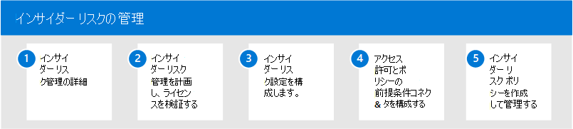

# インサイダーリスクMicrosoft 365

従業員は、幅広いプラットフォームとサービスでデータを作成、管理、共有するためのアクセスが増えています。 ほとんどの場合、組織には、コンプライアンス要件と従業員のプライバシー基準を満たしながら、組織全体のリスクを特定および軽減するためのリソースとツールが限られています。 これらのリスクには、従業員を退出してデータを盗み、偶発的な過剰共有や悪意のある意図による組織外の情報のデータ漏洩が含まれる場合があります。

Microsoft 365の Insider リスク管理は、サービスとサードパーティのインジケーターの全幅を使用して、リスクの高いユーザー アクティビティをすばやく特定し、トリアージし、行動するのに役立ちます。 Microsoft 365 および Microsoft Graph のログを使用すると、インサイダー リスク管理を使用して、リスク インジケーターを特定し、これらのリスクを軽減するためのアクションを実行するための特定のポリシーを定義できます。

以下のビデオを見て、組織の価値、文化、およびユーザー エクスペリエンスを優先しながら、組織がリスクを防止、検出、および含むのに役立つインサイダー リスク管理の方法について説明します。
 
 

**開発に関するインサイダー&管理ソリューション**:
>[!VIDEO https://www.microsoft.com/videoplayer/embed/RE4j9CN]
 

**Insider リスク管理ワークフロー**:
>[!VIDEO https://www.microsoft.com/videoplayer/embed/RE4OUXB]

## インサイダー リスク管理を構成Microsoft 365

組織のインサイダー リスク管理を構成するには、次の手順を使用します。

1. インサイダー[リスク管理の詳細については](insider-risk-management.md)、Microsoft 365
2. インサイ [ダー リスク管理を計画し、ライセンスを確認する](insider-risk-management-plan.md)
3. 内部 [リスク管理の設定を構成する](insider-risk-management-settings.md)
4. アクセス [許可とポリシー](insider-risk-management-configure.md#step-1-enable-permissions-for-insider-risk-management) の [前提条件をコネクタ&構成する](insider-risk-management-configure.md#step-4-configure-prerequisites-for-policies)
5. インサイダー リスク管理 [ポリシーの作成と構成](insider-risk-management-configure.md#step-6-create-an-insider-risk-management-policy)

## インサイダー リスク管理の詳細

- [インサイダー リスク ポリシーの管理](insider-risk-management-policies.md)
- [インサイダー リスク アクティビティを調査する](insider-risk-management-activities.md)
- [インサイダー リスク ケースに関する法律](insider-risk-management-cases.md)