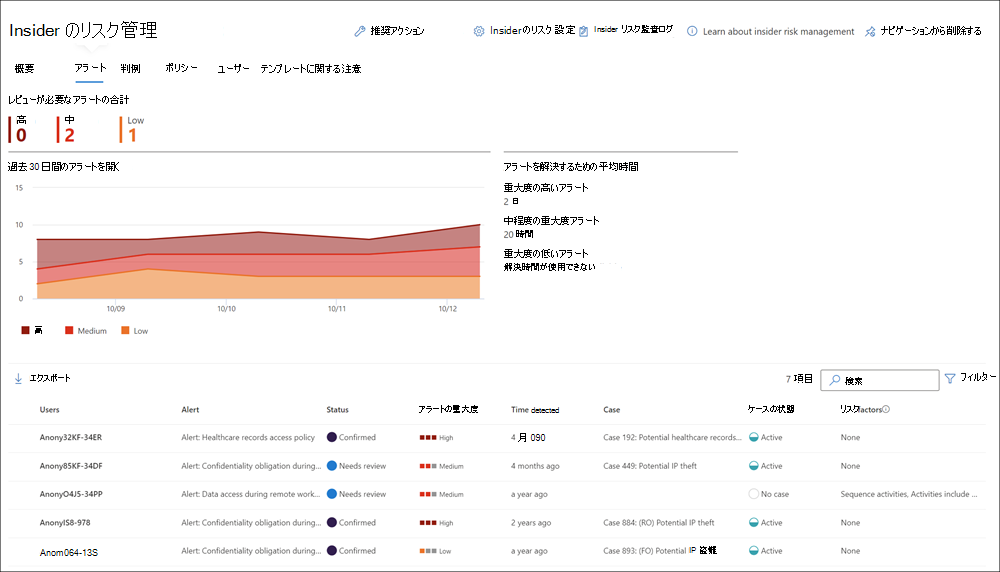
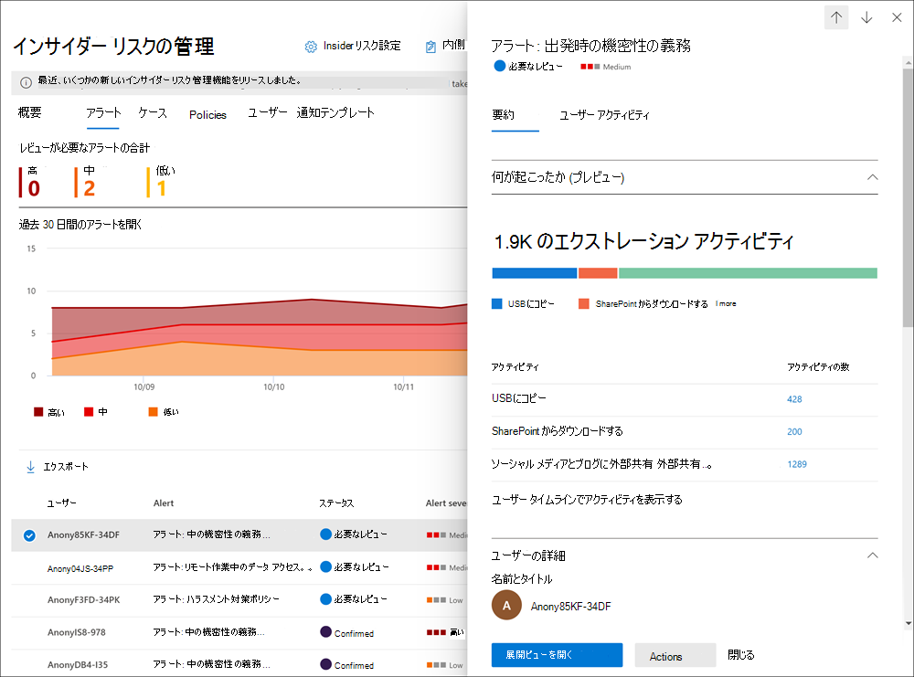
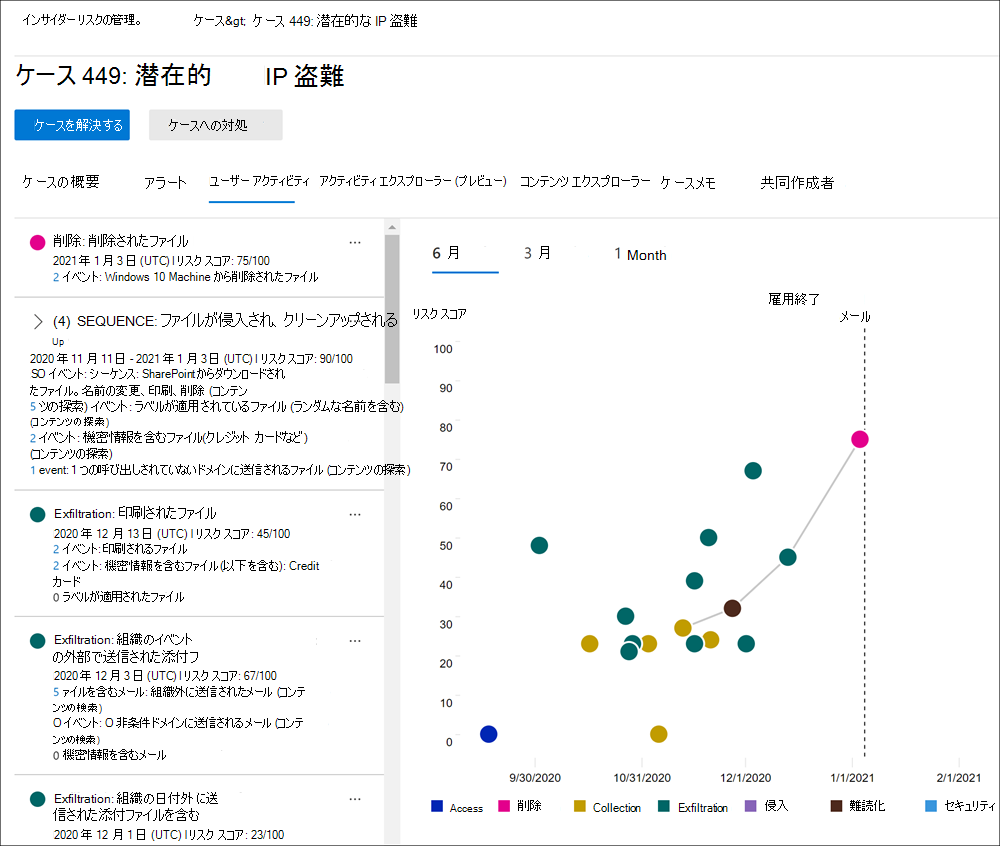

# インサイダー リスク管理の詳細については、Microsoft 365

Insider リスク管理は Microsoft 365 のコンプライアンス ソリューションであり、組織内の悪意のある不注意なアクティビティを検出、調査、および処理することで、内部リスクを最小限に抑えるのに役立ちます。 Insider リスク ポリシーを使用すると、ケースに対応し、必要に応じて Microsoft Advanced eDiscovery にケースをエスカレートするなど、組織内で特定および検出するリスクの種類を定義できます。 組織内のリスク アナリストは、適切なアクションを迅速に実行して、ユーザーが組織のコンプライアンス基準に準拠している必要があります。

以下のビデオを見て、組織の価値、文化、およびユーザー エクスペリエンスを優先しながら、組織がリスクを防止、検出、および含むのに役立つインサイダー リスク管理の方法について説明します。
 
 

**開発に関するインサイダー&管理ソリューション**:
>[!VIDEO https://www.microsoft.com/videoplayer/embed/RE4j9CN]
 

**Insider リスク管理ワークフロー**:
>[!VIDEO https://www.microsoft.com/videoplayer/embed/RE4OUXB]

## 最新のリスクの痛みのポイント

組織内のリスクを管理して最小化するには、まずモダンワークプレースで見つかったリスクの種類を理解します。 一部のリスクは、外部イベントや直接制御の外にある要因によって駆動されます。 その他のリスクは、最小限に抑え、回避できる内部イベントやユーザー アクティビティによって駆動されます。 一部の例は、組織内のユーザーによる違法、不適切、未承認、または非倫理的な動作やアクションによるリスクです。 これらの動作には、ユーザーによるさまざまな内部リスクが含まれます。

- 機密データの漏洩とデータ流出
- 機密違反
- 知的所有権侵害
- 詐欺
- インサイダー取引
- 規制遵守違反

最新の職場のユーザーは、幅広いプラットフォームとサービスでデータを作成、管理、共有できます。 ほとんどの場合、組織には、組織全体のリスクを特定および軽減するリソースとツールが限られている一方で、ユーザーのプライバシー基準を満たしています。

Insider リスク管理は、サービスとサードパーティのインジケーターの全幅を使用して、リスクアクティビティをすばやく特定、トリアージ、および行動するのに役立ちます。 内部リスク管理は、Microsoft 365および Microsoft Graphのログを使用して、リスク インジケーターを識別するための特定のポリシーを定義できます。 これらのポリシーを使用すると、リスクの高いアクティビティを特定し、これらのリスクを軽減するために行動できます。

Insider リスク管理は、次の原則を中心に行います。

- **透明性 :** ユーザーのプライバシーと組織のリスクのバランスを、設計によるプライバシーアーキテクチャとバランスを取る。
- **構成** 可能: 業界、地理的、およびビジネス グループに基づいて構成可能なポリシー。
- **統合:** コンプライアンス ソリューション全体にわたる統合Microsoft 365ワークフロー。
- **操作可能**: レビューアー通知、データ調査、およびユーザー調査を有効にする分析情報を提供します。

## 分析による潜在的なリスクの特定 (プレビュー)

Insider リスク分析では、インサイダー リスク ポリシーを構成することなく、組織内の潜在的なインサイダー リスクの評価を行うことができます。 この評価は、組織が高いユーザー リスクの潜在的領域を特定し、構成することを考えるべきインサイダー リスク マネジメント ポリシーの種類と範囲を特定するのに役立ちます。 この評価は、既存のインサイダー リスク ポリシーの追加のライセンスまたは将来の最適化のニーズを判断するのにも役立ちます。

インサイダー リスク分析の詳細については、「Insider リスク管理の設定 [: Analytics」を参照してください](insider-risk-management-settings.md#analytics-preview)。

## ワークフロー

インサイダー リスク管理ワークフローは、組織内の内部リスクに対処するための特定、調査、およびアクションの実行に役立ちます。 集中ポリシー テンプレート、Microsoft 365 サービス全体での包括的なアクティビティ シグナリング、アラートとケース管理ツールを使用すると、アクション可能な分析情報を使用して、リスクの高い動作をすばやく特定して対処できます。

内部リスクアクティビティと Microsoft 365 のインサイダーリスク管理でのコンプライアンスの問題を特定、解決するには、次のワークフローを使用します。

### ポリシー

[Insider リスク管理ポリシーは](insider-risk-management-policies.md) 、組織で調べるトリガー イベントとリスク インジケーターを定義する定義済みのテンプレートとポリシー条件を使用して作成されます。 これらの条件には、アラートに対するリスク インジケーターの使用方法、ポリシーに含まれるユーザー、優先順位付けされるサービス、監視期間が含まれます。

以下のポリシー テンプレートから選択して、インサイダー リスク管理をすばやく開始できます。

- [離職するユーザーによるデータ盗難](insider-risk-management-policies.md#data-theft-by-departing-users)
- [一般的なデータ漏洩](insider-risk-management-policies.md#general-data-leaks)
- [優先度の高いユーザーによるデータ漏洩 (プレビュー)](insider-risk-management-policies.md#data-leaks-by-priority-users-preview)
- [不満を持つユーザーによるデータ漏洩 (プレビュー)](insider-risk-management-policies.md#data-leaks-by-disgruntled-users-preview)
- [一般的なセキュリティ ポリシー違反 (プレビュー)](insider-risk-management-policies.md#general-security-policy-violations-preview)
- [離職するユーザーによるセキュリティ ポリシー違反 (プレビュー)](insider-risk-management-policies.md#security-policy-violations-by-departing-users-preview)
- [優先ユーザーによるセキュリティ ポリシー違反 (プレビュー)](insider-risk-management-policies.md#security-policy-violations-by-priority-users-preview)
- [不満を持つユーザーによるセキュリティ ポリシー違反 (プレビュー)](insider-risk-management-policies.md#security-policy-violations-by-disgruntled-users-preview)

### アラート

アラートは、ポリシー条件に一致し、アラート ダッシュボードに表示されるリスク インジケーターによって自動的 [に生成されます](insider-risk-management-activities.md#alert-dashboard)。 このダッシュボードを使用すると、組織のレビュー、時間の間にアラートを開く、アラートの統計情報が必要なすべてのアラートを簡単に表示できます。 すべてのポリシー通知は、既存のアラートとアクションが必要な新しいアラートの状態をすばやく特定するために、次の情報と一緒に表示されます。

- 状態
- 重要度
- 検出された時間
- ケース
- ケースの状態

### トリアージ

調査が必要な新しいユーザー アクティビティによって、ニーズレビューステータスが割り当てられたアラート *が自動的に生成* されます。 レビュー担当者は、これらのアラートをすばやく識別し、確認、評価、およびトリアージできます。

新しいケースを開いて、既存のケースに警告を割り当てるか、警告を無視すれば警告を解決できます。 アラート フィルターを使用すると、状態、重大度、または検出された時間によって簡単にアラートを識別できます。 トリアージ プロセスの一環として、レビュー担当者は、ポリシーによって識別されたアクティビティのアラートの詳細を表示し、ポリシーの一致に関連付けられたユーザー アクティビティを表示し、アラートの重大度を確認し、ユーザー プロファイル情報を確認できます。

### 調査

ユーザー アクティビティ レポート (プレビュー) を使用して、選択したユーザーのすべてのアクティビティ [をすばやく調査します](insider-risk-management-activities.md#user-activity-reports-preview)。 これらのレポートを使用すると、組織内の調査担当者は、一時的または明示的にインサイダー リスク管理ポリシーに割り当てることなく、定義された期間の特定のユーザーのアクティビティを調査できます。 ユーザーのアクティビティを調べた後、調査担当者は個々のアクティビティを良性として却下したり、レポートへのリンクを他の調査員と共有または電子メールで送信したり、ユーザーを一時的または明示的にインサイダーリスク管理ポリシーに割り当てるか選択できます。

[ポリシーの](insider-risk-management-cases.md) 一致に関するアクティビティの詳細と状況の詳細と調査を必要とするアラート用にケースが作成されます。 ケース **ダッシュボードには** 、組織のすべてのアクティブなケース、オープン ケース、および組織のケース統計が表示されます。 レビュー担当者は、状況、ケースが開かされた日付、およびケースが最後に更新された日付によって、迅速にケースをフィルター処理できます。

ケース ダッシュボードでケースを選択すると、ケースの調査とレビューが開きます。 この手順は、インサイダー リスク管理ワークフローの中心です。 この領域では、リスク アクティビティ、ポリシー条件、アラートの詳細、およびユーザーの詳細が、レビュー担当者向け統合ビューに合成されます。 この領域の主な調査ツールは次のとおりです。

- **ユーザー アクティビティ**: ユーザー アクティビティは、現在または過去のリスク アクティビティの時間とリスク レベルでアクティビティをプロットする対話型グラフに自動的に表示されます。 レビュー担当者は、ユーザーのリスク履歴全体をすばやくフィルター処理して表示し、詳細については特定のアクティビティを詳しく説明できます。
- **コンテンツ エクスプローラー**: アラート アクティビティに関連付けられているすべてのデータ ファイルと電子メール メッセージが自動的にキャプチャされ、コンテンツ エクスプローラーに表示されます。 レビュー担当者は、データ ソース、ファイルの種類、タグ、会話、その他多くの属性によってファイルやメッセージをフィルター処理して表示できます。
- **ケース ノート**: レビュー担当者は、[ケース メモ] セクションでケースのメモを提供できます。 このリストは、中央ビューのすべてのメモを統合し、レビュー者と提出日の情報を含めます。

さらに、新しい [監査ログ (プレビュー)](insider-risk-management-audit-log.md) を使用すると、インサイダー リスク管理機能で実行されたアクションについて情報を得られます。 このリソースを使用すると、1 つ以上のインサイダー リスク管理役割グループに割り当てられたユーザーが実行したアクションを個別に確認できます。

### 操作

ケースを調査した後、レビュー担当者は迅速に行動してケースを解決したり、組織内の他のリスク関係者と共同作業を行います。 ユーザーがポリシー条件に誤って違反した場合、組織に合わせてカスタマイズできる通知テンプレートから、簡単な通知通知をユーザーに送信できます。 これらの通知は、簡単なリマインダーとして機能する場合や、将来の危険な動作を防ぐためのトレーニングやガイダンスの更新をユーザーに指示する場合があります。 詳細については [、「Insider リスク管理通知テンプレート」を参照してください](insider-risk-management-notices.md)。

より深刻な状況では、インサイダーリスク管理ケース情報を組織内の他のレビュー担当者やサービスと共有する必要がある場合があります。 Insider リスク管理は、エンド Microsoft 365解決に役立つ他のコンプライアンス ソリューションと緊密に統合されています。

- **Advanced eDiscovery**: ケースをエスカレートして調査を行うと、ケースのデータと管理を、Advanced eDiscoveryにMicrosoft 365。 Advanced eDiscovery は、組織の内部および外部の調査に対応するコンテンツを保持、収集、確認、分析、エクスポートするためのエンド ツー エンドのワークフローを提供します。 これにより、法務チームは訴訟ホールド通知ワークフロー全体を管理できます。 Advanced eDiscovery の詳細については、「[Advanced eDiscovery in Microsoft 365の概要](overview-ediscovery-20.md)」を参照してください。
- **Office 365管理 API** の統合 (プレビュー) : Insider リスク管理は、セキュリティ情報とイベント管理 (SIEM) サービスへのアラート情報のエクスポートを、Office 365管理 API を介してサポートします。 プラットフォームでアラート情報にアクセスできると、組織のリスク プロセスに最も適しています。 管理 API を使用してアラート情報をエクスポートする方法Office 365を参照[してください](insider-risk-management-settings.md#export-alerts-preview)。

> [!NOTE]
> ServiceNow コネクタのプレビュー中のフィードバックとサポートに感謝します。 ServiceNow コネクタのプレビューを終了し、2020 年 11 月 30 日にインサイダー リスク管理のサポートを中止することを決定しました。 インサイダー リスク管理における ServiceNow 統合を顧客に提供する代替方法を積極的に評価しています。

## シナリオ

Insider リスク管理は、次の一般的なシナリオで、組織内の内部リスクを軽減するための検出、調査、およびアクションの実行に役立ちます。

### 離職するユーザーによるデータ盗難

ユーザーが自発的に、または終了の結果として組織を離れる場合、企業、顧客、およびユーザーのデータが危険にさらされるという正当な懸念がしばしば生じます。 ユーザーは、プロジェクト データがプロプライエタリではないと無邪気に仮定したり、個人の利益のために会社のデータを取得したり、会社のポリシーや法的基準に違反したりしたがっている可能性があります。 ユーザー ポリシー テンプレートを削除してデータ盗難を使用する Insider リスク管理ポリシーは、通常、この種類の盗難に関連付けられているアクティビティを自動的に検出します。 このポリシーを使用すると、データ盗難に関連する疑わしいアクティビティに関するアラートを自動的に受信し、ユーザーを退出して適切な調査アクションを実行できます。 このポリシー テンプレートMicrosoft 365[組織の人事](import-hr-data.md)コネクタを構成する必要があります。

### 機密情報または機密情報の意図的または意図しない漏洩

ほとんどの場合、ユーザーは機密情報または機密情報を適切に処理するために最善を試みます。 ただし、ユーザーが間違いを犯したり、情報が組織外で誤って共有されたり、情報保護ポリシーに違反したりする場合があります。 その他の状況では、ユーザーは意図的に機密情報や機密情報を悪意のある意図と共有したり、個人の利益を得たりする可能性があります。 次のデータ 漏洩ポリシー テンプレートを使用して作成された Insider リスク管理ポリシーは、機密情報または機密情報の共有に関連する通常のアクティビティを自動的に検出します。

- [一般的なデータ漏洩](insider-risk-management-policies.md#general-data-leaks)
- [優先度の高いユーザーによるデータ漏洩 (プレビュー)](insider-risk-management-policies.md#data-leaks-by-priority-users-preview)
- [不満を持つユーザーによるデータ漏洩 (プレビュー)](insider-risk-management-policies.md#data-leaks-by-disgruntled-users-preview)

## 意図的または意図しないセキュリティ ポリシー違反 (プレビュー)

ユーザーは通常、最新の職場でデバイスを管理する際に大きな制御を持っています。 このコントロールには、職務のパフォーマンスに必要なアプリケーションをインストールまたはアンインストールするためのアクセス許可や、デバイスのセキュリティ機能を一時的に無効にする機能が含まれる場合があります。 このアクティビティが不注意、偶発的、または悪意のある場合でも、この行為は組織にリスクを与える可能性があります。最小限に抑えるために識別して行動することが重要です。 これらのリスクの高いセキュリティ アクティビティを識別するために、次のインサイダー リスク管理セキュリティ ポリシー違反テンプレートはセキュリティ リスク インジケーターをスコア付けし、Microsoft Defender for Endpoint アラートを使用してセキュリティ関連のアクティビティに関する分析情報を提供します。

- [一般的なセキュリティ ポリシー違反 (プレビュー)](insider-risk-management-policies.md#general-security-policy-violations-preview)
- [離職するユーザーによるセキュリティ ポリシー違反 (プレビュー)](insider-risk-management-policies.md#security-policy-violations-by-departing-users-preview)
- [優先ユーザーによるセキュリティ ポリシー違反 (プレビュー)](insider-risk-management-policies.md#security-policy-violations-by-priority-users-preview)
- [不満を持つユーザーによるセキュリティ ポリシー違反 (プレビュー)](insider-risk-management-policies.md#security-policy-violations-by-disgruntled-users-preview)

## 位置、アクセス レベル、またはリスク履歴に基づくユーザーのポリシー (プレビュー)

組織内のユーザーは、自分の位置、機密情報へのアクセスレベル、またはリスク履歴に応じて、リスクのレベルが異なる場合があります。 この構造には、組織のエグゼクティブ リーダーシップ チームのメンバー、広範なデータおよびネットワーク アクセス権限を持つ IT 管理者、または危険なアクティビティの過去の履歴を持つユーザーが含まれる場合があります。 このような状況では、調査と迅速なアクションに対するアラートの表面化に役立つ、より詳細な検査とより積極的なリスク スコアリングが重要です。 これらの種類のユーザーの危険なアクティビティを特定するために、優先度の高いユーザー グループを作成し、次のポリシー テンプレートからポリシーを作成できます。

- [優先ユーザーによるセキュリティ ポリシー違反 (プレビュー)](insider-risk-management-policies.md#security-policy-violations-by-priority-users-preview)
- [優先度の高いユーザーによるデータ漏洩 (プレビュー)](insider-risk-management-policies.md#data-leaks-by-priority-users-preview)

## 不満を持つユーザーによるアクションと動作 (プレビュー)

雇用ストレス イベントは、インサイダー リスクに関連するいくつかの方法でユーザーの行動に影響を与える可能性があります。 これらのストレスは、パフォーマンスレビューが不十分な場合、ポジション降格、またはパフォーマンス レビュー計画に配置されているユーザーである可能性があります。 ほとんどのユーザーは、これらのイベントに対して悪意を持って応答しないが、これらのアクションのストレスにより、通常の状況では通常は考慮されないアクションを実行するユーザーが生じかねない。 これらの種類のリスクの高いアクティビティを識別するために、次のインサイダー リスク管理ポリシー テンプレートは Microsoft 365 HR コネクタを使用し、雇用ストレスイベントの近くで発生する可能性がある行動に関連するリスク 指標のスコアリングを開始します。

- [不満を持つユーザーによるデータ漏洩 (プレビュー)](insider-risk-management-policies.md#data-leaks-by-disgruntled-users-preview)
- [不満を持つユーザーによるセキュリティ ポリシー違反 (プレビュー)](insider-risk-management-policies.md#security-policy-violations-by-disgruntled-users-preview)

## 始める準備はいいですか。

- 組織内 [のインサイダー リスク管理ポリシー](insider-risk-management-plan.md) を有効にするために準備する方法については、「インサイダー リスク管理の計画」を参照してください。
- イン [サイダー リスク ポリシーのグローバル設定を構成するには、「](insider-risk-management-settings.md) インサイダー リスク管理設定の使用を開始する」を参照してください。
- 前提条件 [を構成し、ポリシーを作成](insider-risk-management-configure.md) し、アラートの受信を開始するには、「Insider リスク管理の開始」を参照してください。
