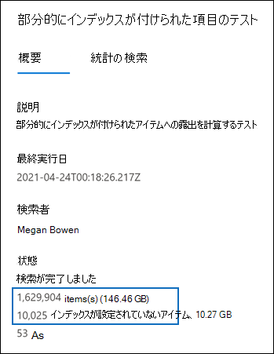

# <a name="investigating-partially-indexed-items-in-ediscovery"></a>電子情報開示で部分的にインデックス付きアイテムを調査する

検索を実行すると、Microsoft 365 コンプライアンス センター検索結果に部分的にインデックス付きアイテムが自動的に含まれます。 部分的にインデックス付けされたExchangeは、SharePoint サイトおよび OneDrive for Business サイト上のメールボックス アイテムとドキュメントに基OneDrive for Business で、何らかの理由で検索用に完全にインデックスが作成されたのではなかっています。 ほとんどの電子メール メッセージとサイト ドキュメントは、電子メール メッセージのインデックスの制限に含まれますので、インデックス作成 [に成功しています](limits-for-content-search.md#indexing-limits-for-email-messages)。 ただし、一部のアイテムは、これらのインデックスの制限を超える可能性があります。部分的にインデックスが作成されます。 電子情報開示検索を実行すると、アイテムを検索用にインデックス化できない理由と、部分的にインデックス付きアイテムとして返されるその他の理由を次に示します。
  
- 電子メール メッセージには、イメージ ファイルなどの有効なハンドラーのない添付ファイルがあります。これは、部分的にインデックスが作成された電子メール アイテムの最も一般的な原因です。

- 電子メール メッセージに添付されているファイルが多すぎます。

- 電子メール メッセージに添付されているファイルが大きすぎます。

- この種のファイルのインデックス付けはサポートされているが、特定のファイルでインデックス付けエラーが発生した。

異なりますが、ほとんどの組織のお客様は、ボリュームごとに 1% 未満のコンテンツを持ち、部分的にインデックスが作成されたサイズでコンテンツの 12% 未満です。 ボリュームとサイズの違いは、ファイルが大きいほど、完全にインデックスを作成できないコンテンツを含む確率が高いからです。
  
## <a name="why-does-the-partially-indexed-item-count-change-for-a-search"></a>部分的にインデックスが作成されたアイテム数が検索に対して変更される理由

電子情報開示検索を実行すると、検索された場所の部分的にインデックスが作成されたアイテムの総数とサイズが、検索の詳細な統計情報に表示される検索結果の統計情報に一覧表示されます。 これらは、検索統計で  *インデックスのないアイテム*  と呼ばれる点に注意してください。 検索結果で返される部分的にインデックス付きアイテムの数に影響を与えるいくつかの点を次に示します。
  
- アイテムが部分的にインデックス付けされ、検索クエリと一致する場合は、検索結果アイテムのカウント (およびサイズ) と部分的にインデックス付きアイテムの両方に含まれます。 ただし、同じ検索の結果がエクスポートされる場合、アイテムは一連の検索結果にのみ含まれます。部分的にインデックス付きアイテムとして含まれません。

- SharePoint サイトと OneDrive サイトにある部分的にインデックス付きアイテムは、検索の詳細な統計情報に表示される部分的にインデックス付きアイテムの見積もりには含まれません。 ただし、部分的にインデックスが作成されたアイテムは、電子情報開示検索の結果をエクスポートするときにエクスポートできます。 たとえば、サイトのみを検索する場合、部分的にインデックスが作成されたアイテムの推定数は 0 になります。
  
## <a name="calculating-the-ratio-of-partially-indexed-items-in-your-organization"></a>組織内の部分的にインデックス付きアイテムの比率を計算する

部分的にインデックスが作成されたアイテムに対する組織の露出を理解するために、(空白のキーワード クエリを使用して) すべてのメールボックス内のすべてのコンテンツの検索を実行できます。 次の例では、1,629,904 (146.46 GB) の完全インデックス付きアイテムと 10,025 (10.27 GB) の部分的なインデックス付きアイテムがあります。
  

  
次の計算を使用して、部分的にインデックス付けされたアイテムの割合を決定できます。
  
 **組織内の部分的にインデックス付きアイテムの比率を計算するには、次の方法を実行します。**

`(Total number of partially indexed items/Total number of items) x 100`

`(10025/1629904) x 100 = 0.62%`

前の例の検索結果を使用すると、すべてのメールボックス アイテムの 0.62% が部分的にインデックス付けされます。
  
 **組織内の部分的にインデックスが作成されたアイテムのサイズの割合を計算するには、次の方法を実行します。**

`(Size of all partially indexed items/Size of all items) x 100`

`(10.27 GB/146.46 MB) x 100 = 7.0%`

したがって、前の例では、メールボックス アイテムの合計サイズの 7% が部分的にインデックス付けされたアイテムからのサイズです。 前に述べたように、ほとんどの組織のお客様は、ボリューム別にコンテンツの 1% 未満、部分的にインデックスが作成されたサイズ別のコンテンツの 12% 未満を持っています。

## <a name="working-with-partially-indexed-items"></a>部分的にインデックス付きアイテムを操作する

部分的にアイテムを調べて、関連する情報が含まれているのを検証する必要がある場合は、部分的に[](export-a-content-search-report.md)インデックス付けされたアイテムに関する情報を含むコンテンツ検索レポートをエクスポートできます。 コンテンツ検索レポートをエクスポートする場合は、部分的にインデックス付けされたアイテムを含むエクスポート オプションのいずれかを選択してください。
  

  
これらのオプションのいずれかを使用して電子情報開示検索結果または検索レポートをエクスポートする場合、エクスポートには Unindexed という名前のレポートが含Items.csv。 このレポートには、ファイルファイルと同じ情報のほとんどがResultsLog.csvされます。ただし、Unindexed Items.csv ファイルには、部分的にインデックス付けされたアイテムに関連する 2 つのフィールド ( **エラー** タグとエラー プロパティ) も **含まれています**。 これらのフィールドには、部分的にインデックスが作成された各アイテムのインデックスエラーに関する情報が含まれています。 これら 2 つのフィールドの情報を使用すると、特定のインデックスエラーが調査に影響を与えるかどうかを判断するのに役立ちます。 その場合は、対象の検索を実行し、特定の電子メール メッセージと SharePoint または OneDrive ドキュメントを取得およびエクスポートして、調査に関連するかどうかを確認できます。 詳細な手順については、「ターゲット検索用に[CSV](csv-file-for-an-id-list-content-search.md)ファイルを準備する」を参照Office 365。

> [!NOTE]
> Unindexed Items.csvファイルには、エラーの種類とエラー メッセージという **名前のフィールド** も **含まれています**。 これらは、[エラー タグ] フィールドと [エラー プロパティ]フィールドの情報に似ていますが、詳細情報が少ない従来のフィールドです。 これらの従来のフィールドは無視しても安全です。
  
## <a name="errors-related-to-partially-indexed-items"></a>部分的にインデックス付けされたアイテムに関連するエラー

エラー タグは、エラーとファイルの種類という 2 つの情報からなります。 たとえば、このエラー/ファイルの種類のペアでは、次のようになります。

```text
 parseroutputsize_xls
```

 `parseroutputsize` はエラーであり `xls` 、エラーが発生したファイルのファイルの種類です。 ファイルの種類が認識されない場合、またはファイルの種類がエラーに適用されない場合は、ファイルの種類の代わりの値 `noformat` が表示されます。
  
インデックス作成エラーの一覧と、エラーの考えられる原因の説明を次に示します。
  
| エラー タグ | 説明 |
|:-----|:-----|
| `attachmentcount` <br/> |電子メール メッセージの添付ファイルが多すぎて、これらの添付ファイルの一部が処理されません。  <br/> |
| `attachmentdepth` <br/> |コンテンツレトリバーとドキュメント パーサーは、他の添付ファイル内に入れ子になった添付ファイルのレベルが多すぎます。 これらの添付ファイルの一部は処理されません。  <br/> |
| `attachmentrms` <br/> |添付ファイルは RMS で保護されたため、デコードに失敗しました。  <br/> |
| `attachmentsize` <br/> |電子メール メッセージに添付されたファイルが大きすぎて処理できなかった。  <br/> |
| `indexingtruncated` <br/> |処理された電子メール メッセージをインデックスに書き込む場合、インデックス可能なプロパティの 1 つが大きすぎて切り捨てられていました。 切り捨てられたプロパティは、[エラーのプロパティ] フィールドに一覧表示されます。  <br/> |
| `invalidunicode` <br/> |電子メール メッセージには、有効な Unicode として処理できなかったテキストが含まれる。 このアイテムのインデックス作成が不完全な場合があります。  <br/> |
| `parserencrypted` <br/> |添付ファイルまたは電子メール メッセージの内容が暗号化され、Microsoft 365デコードできなかった場合。  <br/> |
| `parsererror` <br/> |解析中に不明なエラーが発生しました。 これは通常、ソフトウェアのバグやサービスのクラッシュによって発生します。  <br/> |
| `parserinputsize` <br/> |添付ファイルが大きすぎてパーサーが処理できないので、その添付ファイルの解析が発生しなかったか、完了しなかった。  <br/> |
| `parsermalformed` <br/> |添付ファイルの形式が正しくなって、パーサーで処理できなかった。 この結果は、古いファイル形式、互換性のないソフトウェアによって作成されたファイル、またはクレーム以外のふりをするウイルスが原因である可能性があります。  <br/> |
| `parseroutputsize` <br/> |添付ファイルの解析からの出力が大きすぎて、切り捨てる必要がありました。  <br/> |
| `parserunknowntype` <br/> |添付ファイルには、ファイルの種類Microsoft 365検出できなかった。  <br/> |
| `parserunsupportedtype` <br/> |添付ファイルにはファイルの種類Office 365検出できますが、そのファイルの種類の解析はサポートされていません。  <br/> |
| `propertytoobig` <br/> |ストア内の email プロパティのExchangeが大きすぎて取得できなかったので、メッセージを処理できませんでした。 これは通常、電子メール メッセージの body プロパティにのみ発生します。  <br/> |
| `retrieverrms` <br/> |コンテンツレトリバーが RMS で保護されたメッセージをデコードできなかった。  <br/> |
| `wordbreakertruncated` <br/> |インデックス作成中にドキュメント内で識別された単語が多すぎます。 制限に達すると、プロパティの処理が停止し、プロパティが切り詰めされます。  <br/> |

エラー フィールドは、[エラー タグ] フィールドに表示される処理エラーの影響を受けるフィールドを示します。 メッセージ本文のエラーなどのプロパティを検索しても、検索結果には  `subject`  `participants` 影響しません。 これは、詳細に調査する必要がある可能性がある部分的にインデックス付けされたアイテムを正確に決定する場合に役立ちます。
  
## <a name="using-a-powershell-script-to-determine-your-organizations-exposure-to-partially-indexed-email-items"></a>PowerShell スクリプトを使用して、部分的にインデックスが作成された電子メール アイテムへの組織の露出を特定する

次の手順では、すべての Exchange メールボックス内のすべてのアイテムを検索し、部分的にインデックス付けされた電子メール アイテムの組織の比率 (カウントとサイズ別) に関するレポートを生成し、発生するインデックスエラーごとにアイテムの数 (とそのファイルの種類) を表示する PowerShell スクリプトを実行する方法を示します。 前のセクションのエラー タグの説明を使用して、インデックスエラーを特定します。
  
1. ファイル名のサフィックスを使用してWindows PowerShellスクリプト ファイルに次のテキストを保存.ps1。たとえば、 `PartiallyIndexedItems.ps1` .

   ```powershell
     write-host "**************************************************"
     write-host "     Security & Compliance Center PowerShell      " -foregroundColor yellow -backgroundcolor darkgreen
     write-host "   eDiscovery Partially Indexed Item Statistics   " -foregroundColor yellow -backgroundcolor darkgreen
     write-host "**************************************************"
     " " 
     # Create a search with Error Tags Refinders enabled
     Remove-ComplianceSearch "RefinerTest" -Confirm:$false -ErrorAction 'SilentlyContinue'
     New-ComplianceSearch -Name "RefinerTest" -ContentMatchQuery "size>0" -RefinerNames ErrorTags -ExchangeLocation ALL
     Start-ComplianceSearch "RefinerTest"
     # Loop while search is in progress
     do{
         Write-host "Waiting for search to complete..."
         Start-Sleep -s 5
         $complianceSearch = Get-ComplianceSearch "RefinerTest"
     }while ($complianceSearch.Status -ne 'Completed')
     $refiners = $complianceSearch.Refiners | ConvertFrom-Json
     $errorTagProperties = $refiners.Entries | Get-Member -MemberType NoteProperty
     $partiallyIndexedRatio = $complianceSearch.UnindexedItems / $complianceSearch.Items
     $partiallyIndexedSizeRatio = $complianceSearch.UnindexedSize / $complianceSearch.Size
     " "
     "===== Partially indexed items ====="
     "         Total          Ratio"
     "Count    {0:N0}{1:P2}" -f $complianceSearch.Items.ToString("N0").PadRight(15, " "), $partiallyIndexedRatio
     "Size(GB) {0:N2}{1:P2}" -f ($complianceSearch.Size / 1GB).ToString("N2").PadRight(15, " "), $partiallyIndexedSizeRatio
     " "
     Write-Host ===== Reasons for partially indexed items =====
     foreach($errorTagProperty in $errorTagProperties)
     {
         $name = $refiners.Entries.($errorTagProperty.Name).Name
         $count = $refiners.Entries.($errorTagProperty.Name).TotalCount
         $frag = $name.Split("{_}")
         $errorTag = $frag[0]
         $fileType = $frag[1]
         if ($errorTag -ne $lastErrorTag)
         {
             $errorTag
         }
         "    " + $fileType + " => " + $count
         $lastErrorTag = $errorTag
     }
   ```

2. [セキュリティ/コンプライアンス センターの PowerShell に接続する](/powershell/exchange/exchange-online-powershell)。

3. [セキュリティ & コンプライアンス センター PowerShell] で、手順 1 でスクリプトを保存したフォルダーに移動し、スクリプトを実行します。例えば：

   ```powershell
   .\PartiallyIndexedItems.ps1
   ```

スクリプトから返される出力の例を次に示します。
  


> [!NOTE]
> 以下の点に注意してください。
>  
> - 電子メール アイテムの総数とサイズ、および部分的にインデックスが作成された電子メール アイテムの組織の比率 (カウントとサイズ別)。
> 
> - リスト エラー タグと、エラーが発生した対応するファイルの種類。
  
## <a name="see-also"></a>関連項目

[電子情報開示の部分的にインデックス付きアイテム](partially-indexed-items-in-content-search.md)